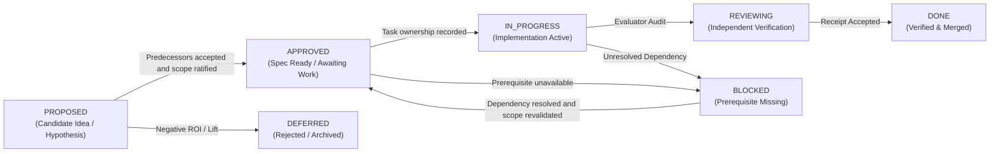

# AETHER / Vanguard: Feature & Capability Backlog

```text
====================================================================================================
Authority: Execution (Sequencing & Lifecycle Tracking)
Scope:     Capability Packages, Substrate Evolution, Tooling & Benchmarking Backlog
Streams:   A (Runtime/Product) | B (State/Agency) | C (Gates/Evidence)
Invariant: Mechanism presence is not closure; state transitions require empirical receipts.
====================================================================================================
```

## 1. Lifecycle State Definitions

Every item in this backlog is managed through a strict predicate-driven lifecycle:



* **`PROPOSED`**: Candidate hypothesis, architectural proposal, or product feature under technical evaluation.
* **`APPROVED`**: Specification and falsifiers ratified; awaiting implementation. Current file ownership is in tasks.md; there is no WIP=1 calendar in this file.
* **`IN_PROGRESS`**: Actively under implementation; checkboxes live in [`tasks.md`](tasks.md).
* **`REVIEWING`**: Code implemented; awaiting independent empirical evaluation and receipt production.
* **`BLOCKED`**: Execution halted due to prerequisite milestone gates (e.g., M-9 blocked on M-8).
* **`DONE`**: Implementation verified by passing tests, boundary checks, and frozen evidence receipts.
* **`DEFERRED`**: Candidate rejected or postponed due to lack of measured lift or architectural misalignment.
* **`REOPENED`**: A previously closed package has a current-source or
  exact-subject falsifier that invalidates carrying its old closure forward.
  The earlier receipt remains historical evidence for its own subject.

Lifecycle applies to a **package scope and evidence subject**, not to every future
use of its ID. `ACCEPTED` is the receipt disposition that supports `DONE`; it is
not a separate package state. A `DONE` mechanism can have a `PROPOSED` extension
without being reopened. `APPROVED` requires the applicable predecessor gates and
implementation scope to be ratified; approval of this inventory alone does not
approve its proposed packages. `BLOCKED` names a missing prerequisite for already
authorized work; an unapproved extension stays `PROPOSED` with its blockers named.

`REVIEWING`, `DEFERRED` and `REOPENED` retain the meanings above. Historical
`PARTIAL` / `TECHNICAL SLICE DONE` qualifiers describe delivered scope, not full
acceptance; `DEPRECATED` marks retired tooling. They do not silently advance a
package into `DONE`. Status changes require a scoped receipt, acceptance decision
and applicable subject identity; mechanism tests alone do not close empirical gates.

---

## 2. Capability Family Backlog

### Leadership priority and evidence reconciliation (2026-09-12)

This decision applies to remaining scope, not historical receipts. It is ratified
under the current leadership delegation and [RUN-1](spec.md#run-1-leadership-execution-decision-2026-09-12).
Priority chooses the next eligible work; only task `requires:` edges authorize
execution. Documentation commits and proposed test commands do not prove acceptance.

| Priority / package | Disposition and planning depth | Next deliverable |
|---|---|---|
| P0 — EXP-01 / CONTROL | APPROVED bounded control-hardening and corpus/metric work; detailed tasks now | Publication-level freeze/evidence validation, finite L2 corpus, prerequisite reconciliation and a frozen canary disposition. No new agent capability or paid run authorized here. |
| Preservation — GATE-01 / CTX-01 / REC-01 | DONE on accepted `2989d57d` scope; reuse and targeted regression evidence | Do not rebuild these packages. Changes affecting their claims require successor qualification. |
| P1 — MEM-01 / MEM-02 / T-56 | PROPOSED product qualification; first post-control package refinement | Combine catalog invocation, durable authorized retrieval, revocation and signed rollback into one qualification scope; MEM-02 separately measures lift. Existing APIs first, no new memory core. |
| P2 — CAS-01 / DEL-01 extension | PROPOSED conditional branches; retain outcomes and fault model, defer exact new modules | Use control failure attribution to select recoverable workspace or one advisory reader. Mutating specialists require CAS; advisory readers do not. |
| P2 — EVAL-02 | PROPOSED independent qualification branch; narrow initial implementation to Verified | Preserve Aider as follow-on scope. Greenfield checks stay separate and are not blocked by benchmark adapters. No official score or publication inferred. |
| Later — OCT-03 / EXP-02 advanced treatments | DEFERRED implementation selection; existing proposal contracts retained | Campaign requires accepted CAS/delegation and demonstrated multi-episode demand. MCTS, RTV and learned routing require measured need and a separately admitted experiment. |
| Rejected direction | No implementation authorization | Vote-based merge/acceptance, parallel core ledgers/governors/episode engines, automatic enabling from focused tests, and compulsory new packages copied from reference pseudocode. |

No percentage-complete estimates are used. The inspected source at `001911e3`
supports the following inventory; test files are falsifier locations, not test
results from this documentation review.

| Capability | Observed state and evidence | Remaining qualification |
|---|---|---|
| Context, compaction and deterministic recovery | Built in `agency/context/compiler.py` and `agency/episode/protocol_recovery.py`; accepted NT-1 integration on its recorded subject | Preserve on the control subject; fixture preservation does not prove model quality. |
| Search/index, ledger and editing | Built owners in `ports/index.py`, `runtime/ledger_emitter.py`, `adapters/environment/transaction.py`; broader product claims remain partial | End-to-end selected composition and current-subject evidence; transaction preflight is not durable workspace CAS. |
| Child spawning and roles | Built `EpisodeEngine.spawn` and runtime delegation; specialist product qualification proposed | Aggregate restart/cancellation evidence and a measured advisory treatment. |
| Memory and learning | Partial product capability: `ports/memory.py`, `runtime/memory.py`, `adapters/stores/memory_engine.py`, `runtime/governance/learning.py` | Public composition, authorization/revocation across restart, independent empirical M-8 receipt. |
| Skill library | Built static index/catalog in `runtime/skill_index.py` / `agent_plugins.py`; `SkillLibrary` protocol; signed mechanisms in `runtime/skill_evaluation.py`. `skill_lifecycle.CompositionRegistry` is in-memory and refuses unsigned promotion/rollback | Durable product invocation and learned-skill lifecycle are not accepted. Reuse the durable governance owner, not the in-memory registry as persistence. Starting falsifiers: `test.runtime.test_w12_skills_and_sealed_spawn`, `test.falsifiers.test_m8_skill_lifecycle`, `test.adapters.test_durable_memory_port`. |
| Campaign / MCTS / tournament | No accepted OCT-03 product implementation established; algorithm and task proposals exist | Deferred. Mechanism/proposal presence never authorizes a score or merge. |

The historical family tables below retain their original subject-specific
dispositions. Where they say APPROVED for a broader or older mechanism, that does
not supersede this remaining-work selection. A proposed extension is not READY
until T-129 records its complete package admission; ordinary implementation
choices then stay with its owner under RUN-04.

### 2.0 Approved near-term package deltas (NT-1)

This is package scope/lifecycle, not a second task queue. NT-1 in [`spec.md`](spec.md#nt-1-near-term-baseline-context-cache-and-recovery-delta) promotes the core reference decisions into canonical contracts. T-98–T-111 and revised T-77 own work in [`tasks.md`](tasks.md#near-term-ownership-and-ready-work). Stream A/B/C supersede historical lane labels for this scope only. Approval is not implementation or milestone acceptance.

Evidence integrity and required profile safety are core qualification obligations.

Control uses truthful projection, canonical state/recovery, nonmutating measurement,
existing patch safety, compaction and restart. New CAS, specialist, campaign,
learning and benchmark capabilities are post-control. M-8 memory acceptance still
precedes M-9 beta; deployment-profile safety cannot be waived by this classification.

| Package | Approved scope and owner | Existing capability relationship | Acceptance / lifecycle |
|---|---|---|---|
| **GATE-01** | Nonmutating runner, complete collection, current failure inventory, dead-path cleanup and integrated gate; C coordinates, A/B fix their owned surfaces | Additive baseline qualification; preserves MS-INSTRUMENT's historical subject. T-98/T-101/T-108/T-109/T-111 | `DONE`; receipt `ACCEPTED` on `2989d57d`. Exact-subject discovery and verify receipts close MS-BASELINE and reconcile MS-CONTEXT. |
| **CTX-01** | Canonical working-state snapshots, bounded existing compiler, provider-aware counting/cache telemetry and 100+ turn deterministic preservation; B values/compiler, A codecs/runtime | Successor integration of CMX-03/CMX-10B/CMX-11, not duplicate memory or compiler. T-100/T-104/T-105/T-107/T-110; T-77 moved here from IDX-01 | `DONE`; receipt `ACCEPTED` on `2989d57d`. Component contracts and the 104-turn fresh-process qualification are green. No cache-hit or live-quality guarantee. |
| **REC-01** | Bounded semantic history, transport backoff, reground/replan/stop, durable decisions/deadlines; B policy, A bindings | Extends ProtocolRecoveryState and existing EpisodeEngine; T-106/T-107/T-110. T-80 consumes the core detector later | `DONE` for core recovery; receipt `ACCEPTED` on `2989d57d`. Durable binding and fresh-process reconciliation pass. No consultation, authority expansion, specialist spawning or new retry loop. |
| **INS-01 near-term delta** | Truthful terminal projection, thin facade, CLI help/flags/non-success exits; A | T-99/T-102/T-97 complete the NT-1 product-surface obligations without accepting broader control evidence | `DONE` for the NT-1 delta; no completed-without-evidence result through any product surface. T-89 remains a distinct MS-CONTROL measurement-path obligation. |
| **CMX-01 near-term delta** | Single preset catalog, normalized behavioral identity, declared versus effective budgets; C catalog, A consumers | T-103/T-102 integrate the NT-1 catalog/facade obligation; retain existing product ceilings | `DONE` for the NT-1 delta; budget-only presets remain labeled honestly. T-79 retains its distinct MS-CONTROL acceptance obligation and ARM-01/T-96 stays post-control. |

#### Near-term package delivery map

This map records the accepted NT-1 handoffs on `2989d57d`; these are completed obligations, not a remaining queue. Checkbox status and execution order remain exclusively in `tasks.md`.

| Deliverable | Package responsibility | Inputs already accepted | Output consumed by | Package done condition |
|---|---|---|---|---|
| T-109 | GATE-01 proves the repository can be measured without mutation or omission | T-97/T-98/T-99/T-101/T-102/T-103/T-108 | MS-BASELINE and T-107 | Complete clean-subject receipt accepted with zero failures/errors and all required runners executed. |
| T-77 | CTX-01 completes stable-prefix, bounded receipt and goal-echo behavior | T-104 compiler and T-105 provider codec | T-110 | Existing compiler passes cache-breakpoint falsifier; cache use remains observed or null. |
| T-107 | CTX-01/REC-01 binds typed state, selection and recovery through the one runtime ledger | T-100/T-104/T-105/T-106 plus MS-BASELINE | T-110 | Write-before-use ordering and cold replay pass event coverage and runtime resume falsifiers. |
| T-110 | CTX-01/REC-01 qualifies integrated preservation under long deterministic execution | T-107 and T-77 | T-111 | 100+ turn uninterrupted/resumed semantic equivalence with no replay or false completion. |
| T-111 | GATE-01 reconciles the final subject and guards control identity | T-109 and T-110 | MS-CONTEXT and T-26 | Full gate accepted; five execution files agree; exact unfrozen control candidate handed off. |

Package boundaries are strict. CTX-01 owns context/state preservation, REC-01 owns deterministic recovery semantics, GATE-01 owns evidence integrity, and none of them owns benchmark-quality claims. Completion of these packages authorizes control preparation only. It does not accept the CONTROL package or any FH-1 proposal.

The accepted delivery used A for runtime/product binding, B for context/recovery
policy and C for evidence/catalog integration. Current file leases remain solely
in `tasks.md`; those historical assignments do not reserve future work. T-111 is
accepted and T-26 is ready for prerequisite audit, but remains `UNFROZEN`.
T-51/T-52 and applicable T-79/T-89/T-92–T-95 evidence still require control-subject
reconciliation. A hermetically ready mechanism is not a live score, T-26/T-27
acceptance or an MS-CONTROL disposition.

**Release dependency:** MS-BASELINE -> MS-CONTEXT -> new MS-CONTROL freeze/qualification. T-111 reconciles the integrated subject; T-26/T-27 retain their evidence obligations. M-8 empirical acceptance and M-9/M-10 authorization are unchanged. Existing DONE mechanisms retain their historical receipts; richer current product preservation needs the new gates.

**Post-control scope:** CAS, specialist/campaign activation, governed learning,
comparative routing and external benchmark claims require their named gates.
Existing profile safety and evidence integrity remain mandatory. M-8 memory
acceptance precedes M-9 beta. Historical Part 3 prototypes are design references,
not authorizations to introduce new stores, ports or parallel policy engines.

### 2.0a Post-control capability packages (FH-1) [PROPOSAL]

These packages extend existing owners and remain `PROPOSED`; they do not alter approved NT-1 work. Contracts: [spec FH-1](spec.md#fh-1-post-control-backend-horizon-proposal). Acceptance: [horizon gates](milestones.md#post-control-horizon-release-predicates-fh-1). The only work tree is [T-112–T-128](tasks.md#context-post-control-horizon-fh-1-proposal).

| Package / lifecycle | Bounded scope and owner | Upstream acceptance required | Output / downstream consumer |
|---|---|---|---|
| **CAS-01 — `PROPOSED`** | Domain tree/edit values; environment/store adapters capture and materialize immutable candidates; existing runtime emitter owns promotion. Includes recovery, journaled export and bounded GC. T-112–T-116 refine T-17/T-30/T-49. | MS-CONTROL; reviewed FH-1 contracts and implementation leaves. Historical T-17 preflight is a reuse seam, not CAS acceptance. | MS-CAS: one winning durable promotion, monotonic generation, lost-reply reconciliation, verified rollback or explicit export quarantine. Required by mutating specialists and OCT-03; no atomic-host-checkout claim. |
| **DEL-01 extension — `PROPOSED`** | Existing agency spawn, child runtime and governor integration; bounded advisory readers, durable intent, sibling reservations, idempotent dispatch and cancellation reconciliation. T-117/T-118 refine T-29/T-34/T-53. | MS-CONTROL; reviewed FH-1 leaves. MS-CAS is additionally required for mutating workers, not for the initial read-only mechanism. | MS-DELEGATION: canonical lineage, attenuation and aggregate conservation across restart/unknown outcomes. Feeds EXP-02 specialist studies and OCT-03; does not establish useful specialist lift. Historical DEL-01 mechanism remains DONE. |
| **EXP-02 — `PROPOSED`** | Optional pack/agency routing, recovery and specialist treatments; benchmark owners measure one declared change at fixed task membership and total budget. T-119 refines T-28/T-29/T-30/T-50/T-80/T-96. | MS-CONTROL; MS-DELEGATION for specialist arms; MS-CAS additionally for mutating arms. | MS-META/MS-SPECIALIST: accepted useful-lift or cost-saving/noninferiority evidence before enabling the measured treatment. Coordination, verification, retries and failures count toward cost. A basic campaign does not require positive specialist lift. |
| **OCT-03 extension — `PROPOSED`** | Minimal durable campaign client above existing runtime; dependency artifacts, node reconciliation, parent-owned integration and bounded replanning. T-120 refines T-31/T-54/T-34. | MS-CAS and MS-DELEGATION, each downstream of MS-CONTROL; reviewed campaign leaves. | MS-CAMPAIGN: dependency readiness from accepted artifacts, restart without duplicate effects and exterior verification of the combined tree. Director has zero mutating verbs. Full OCT-01–OCT-04/HYDRA activation remains post-M-10. |
| **MEM-01 qualification extension — `PROPOSED`** | Existing runtime memory/governance and store adapters: project-scoped versioned lessons, retrieval/cache revocation, separate generation/evaluation/promotion and rollback. `MEM-QUAL` is this scope's alias; T-121 refines T-32/T-56/T-57 with MEM-02 empirical evidence. | MS-CONTROL for FH-1 activation; applicable existing M-8 obligations and qualified empirical runner. No blanket CAS-01 or campaign dependency. | MS-MEMORY and M-8: authorization/revocation evidence, held-out lift >= 0.05 at p < 0.05 and executed rollback, independently accepted. Feeds M-9 readiness; does not require a vector store or permit learning from the evaluation holdout. |
| **EVAL-02 — `PROPOSED`** | Benchmark protocol adapters and existing exterior evaluator seams; pinned SWE-bench Verified and Aider protocols, plus a separate greenfield completeness corpus. T-122–T-125 refine T-51/T-58. | MS-CONTROL; reviewed evaluator-separation, manifest and replay leaves. Optional CAS/delegation/memory gates apply only when those capabilities are included in the measured arm. | MS-EVAL qualifies immutable subject/evaluator separation, faithful reference replay and complete failure accounting. Feeds official runs; fixtures produce no live score. DeepSWE T-33 remains separate. |
| **REL-QUAL extension — `PROPOSED`** | Benchmark/release owners bind official outputs, statistical comparison, independent review, migration/rollback and claims. T-126–T-128 refine T-33/T-58/T-67 and SWE-P3–P5. | MS-EVAL plus SWE-P4/P5 for official runs; MS-OFFICIAL for superiority claims; applicable M-8/M-9/M-10 predicates for release handoff. | Distinct MS-OFFICIAL, MS-SOTA and release-handoff evidence. A valid score does not prove superiority; no guaranteed score or professional-equivalence claim. |

**Contract traceability (proposal-level).** One index only: it names where each
package's candidate contracts and decomposition live, and duplicates neither. All
rows are `PROPOSED`; none is a lease, and T-129 admission may change any of them.

| Package | Candidate clauses in `spec.md` | Root candidate rows in `tasks.md` | Named candidate schemas |
|---|---|---|---|
| CAS-01 | FH-C01–FH-C11 | T-112a (tree values), then T-112b/T-113a | `aether.tree/1`, `aether.edit-set/1`, `aether.check-plan/1`, `aether.candidate-check/1`, `aether.promotion/1`, `aether.export-journal/1` |
| DEL-01 | FH-D01–FH-D07 | T-117a (specialist wire), then T-117b | `aether.specialist-request/1`, `aether.specialist-findings/1`, `aether.delegation-settlement/1` |
| OCT-03 | FH-D08–FH-D12 | T-120a, gated on T-117b | `aether.campaign-plan/1`, `aether.campaign-lease/1` |
| MEM-01 | FH-M01–FH-M04 | T-121a (lesson values), then T-121b | `aether.lesson/1`, `aether.lesson-revocation/1`, `aether.retrieval-admission/1` |
| EVAL-02 | FH-E01–FH-E04 | T-122a (manifest schemas), then T-122b | `aether.evaluation-manifest/1`, `aether.evaluation-attempt/1` |

No schema above is registered, and no clause above is accepted law; FH-1.1–FH-1.8
is proposed contract detail. Fail-closed outcomes are indexed in the FH-1.8 matrix.

The earlier review order is superseded by the leadership priority table above.
CAS, read-only delegation, memory and evaluation
are conditional branches after MS-CONTROL. The applicable gate predicates,
finite statistical stopping rules and invariant vetoes are owned by
[`milestones.md`](milestones.md#post-control-horizon-release-predicates-fh-1).

**Scope exclusions and reuse.** CTX-01 owns bounded working context; MEM-01 owns
authorized durable learning. REC-01 owns deterministic recovery; EXP-02 owns new
measured consultations/routing. DEL-01 owns child mechanics; OCT-03 owns campaign
coordination; neither introduces a competing episode loop, ledger writer or
budget accountant. CAS-01 extends the existing transaction/storage seams; memory
registry compare-and-swap does not qualify workspace CAS. Planned kernel delta is
zero, N-06 forbids runtime subprocess execution, and new public ports require an
independently replaceable responsibility rather than a copied reference API.

Existing grounding seams include
[`ContextCompiler`](../../vanguard/packages/agency/context/compiler.py),
[`ProtocolRecoveryState`](../../vanguard/packages/agency/episode/protocol_recovery.py),
[`EpisodeEngine.spawn`](../../vanguard/packages/agency/episode/engine.py),
[`AtomicMultiFileTransactionManager`](../../vanguard/packages/adapters/environment/transaction.py),
[`LedgerEmitter`](../../vanguard/packages/runtime/ledger_emitter.py), and
[`DurableCompositionRegistry`](../../vanguard/packages/runtime/governance/learning.py).
These identify reuse owners, not proof that the proposed packages already exist.
The [review series](../reports/reviews/aether_v093_review/part4_roadmap_and_strategic_synthesis.md)
and [auxiliary table](../../.draft/temp_auxiliary_table.md) remain non-canonical
planning inputs; their completion percentages and prototype names cannot advance
these lifecycle states.

Advance packages from PROPOSED only after applicable predecessor acceptance and
T-129 package admission. This review defers implementation of OCT-03 and advanced
EXP-02 treatments even after those predecessors; their rows retain proposal
detail for possible later selection. A valid negative experiment retains evidence
and leaves its treatment disabled. Larger stores, parallel writers, learned
routers and semantic ranking require measured need and separately pinned treatments.
Reuse existing ports unless a distinct responsibility demonstrably lacks a contract.

### 2.1 Substrate, Kernel & Event Sourcing (VISION.md §1–6)

| ID | Title & Focus | Subsystem | Lane | Status | Target Milestone | Description & Acceptance Gate |
|---|---|---|---|---|---|---|
| **SUB-01** | S0–S12 Monotonic Dispatch Pipeline | `kernel` | Lane A | `DONE` | M-0–M-3C | 13-stage dispatch pipeline, Typed Budget Governor, $\le 1438$ LOC budget. |
| **SUB-02** | Append-Only Event Store & JCS Ledger | `domain` / `runtime` | Lane A | `DONE` | M-5a | RFC 8785 JCS canonicalization, SQLite WAL ledger emitter, `mhf.event/2`. |
| **SUB-03** | Partial-Order Causal Graph & Concurrency | `runtime` | Lane A | `PROPOSED` | M-7+ | Transition physical sequence numbers to causal DAG dependency tracking. |
| **SUB-04** | Subprocess Sandbox PTY ShellPort | `adapters` | Lane A | `APPROVED` | M-9 | Persistent pseudo-terminal inside Bubblewrap with streaming and sub-200ms SIGINT. |

### 2.2 Memory, Learning & Metacognition (VISION.md §14, §18)

| ID | Title & Focus | Subsystem | Lane | Status | Target Milestone | Description & Acceptance Gate |
|---|---|---|---|---|---|---|
| **MEM-01** | Governed Memory & Rollback Mechanisms | `runtime` / stores | Lane A | `REVIEWING` (existing mechanisms); `PROPOSED` (FH-1 extension) | M-8 / MS-MEMORY | Existing authorization, promotion and rollback mechanisms do not close M-8. Qualification extension and dependencies are in §2.0a (`MEM-QUAL` alias); MEM-02 owns empirical proof. |
| **MEM-02** | M-8 Empirical Held-Out Canary Proof | `benchmarks` | Lane B | `BLOCKED` (on REL-01R/REL-02R) | M-8 | Held-out real-model canary demonstrating $\ge 0.05$ lift without synthetic metrics after the runtime executor and successor canary are qualification-ready. |
| **MEM-03** | Adaptive Strategy & Meta-Controller | `agency` / `runtime` | Lane A | `APPROVED` | M-6.5 | Higher-order policy adjusting strategy upon failure without modifying history. |
| **MEM-04** | Trajectory-to-Skill Promotion Pipeline | `runtime` | Lane A | `PROPOSED` | M-8+ | Mining verified traces to propose reusable skills with explicit promotion receipts. |

### 2.3 Recursive Delegation & Topologies (VISION.md §12, §16)

| ID | Title & Focus | Subsystem | Lane | Status | Target Milestone | Description & Acceptance Gate |
|---|---|---|---|---|---|---|
| **DEL-01** | Monotonic Capability Attenuation | `kernel` / `agency`; extension in agency/runtime | Lane A | `DONE` (historical mechanism); `PROPOSED` (FH-1 extension) | M-6 / MS-DELEGATION | Preserve recursive attenuation and child-spawn receipts for their accepted subjects. The §2.0a extension qualifies advisory specialists and durable aggregate accounting after MS-CONTROL, with zero kernel delta; historical DONE does not activate it. |
| **DEL-02** | Multi-Role Topology Declarations | `runtime` | Lane A | `APPROVED` | M-7 | Declarative multi-agent topologies (debate, critic, swarm) through single runtime. |
| **DEL-03** | Hardware-Aware Swarm Scheduler | `runtime` | Lane A | `PROPOSED` | M-7+ | VRAM drain scheduling between Architect (DeepSeek) and Worker (Qwen) models. |

### 2.4 Code Intelligence, Verification & SOTA Tools (VISION.md §5, §8)

| ID | Title & Focus | Subsystem | Lane | Status | Target Milestone | Description & Acceptance Gate |
|---|---|---|---|---|---|---|
| **TLS-01** | AdmissionGate Closed-Loop Validation | `agency` | Lane A | `DONE` | W-092-2 | Fail-closed patch requirement and fresh workspace verification enforcement. |
| **TLS-02** | DeepSeek DSML / JSON Normalization | `agency` | Lane A | `DONE` | W-092-4 | Protocol recovery for malformed markdown tool calls and stream truncations. |
| **TLS-03** | Tree-Sitter & SBFL Fault Localization | `ports` / `adapters`| Lane B | `DEFERRED` | Post-CMX-07 | Optional treatment; may enter WIP only after the canonical single-worker baseline is qualified and a preregistered ablation exists. |
| **TLS-04** | AST Syntax Pre-Flight Gate (<0.2ms) | `adapters` | Lane A | `DONE` (mechanism) | MS-CHANGE | `adapters/environment/transaction.py` performs `ast.parse` preflight and aborts before durable flush. |
| **TLS-05** | Speculative Git Checkpoint Engine | `adapters` | Lane A | `APPROVED` | W-092-4 | In-memory CoW git checkpoints with automatic rollback on test regression. |
| **TLS-06** | AST Mutation Verification (Anti-Collusion)| `adapters` | Lane B | `PROPOSED` | M-8+ | Injects AST mutants to falsify ungrounded or no-op candidate test suites. |
| **TLS-07** | Composable Web Research Port (SSRF-Safe)| `ports` / `adapters`| Lane A | `PROPOSED` | M-9 | Egress-controlled web search and fetch tools with domain allowlists. |

### 2.5 Documentation Plane & Developer Tools

| ID | Title & Focus | Subsystem | Lane | Status | Target Milestone | Description & Acceptance Gate |
|---|---|---|---|---|---|---|
| **DOC-01** | MkDocs HTML Generator (Deprecated) | `docs` | Lane A | `DEPRECATED` | P0 | Deprecated in favor of raw Markdown docs and fast AST/JSONL knowledge retrieval. |
| **DOC-02** | Deterministic Knowledge Base (.jsonl) | `tools` | Lane A | `DONE` | P0 | Machine-generated `catalog`, `code-map`, `symbols`, and `ownership` files. |
| **DOC-03** | Structured RAG V0 (Deterministic) | `tools` | Lane A | `DONE` | P0 | Exact-ID and authority-weighted context query tool (`tools/docs_rag_v0.py`). |
| **DOC-04** | Griffe & mkdocstrings API Docs (Deprecated) | `docs` / `tools` | Lane A | `DEPRECATED` | P1 | Deprecated in favor of LDA AST indexing and symbols knowledge base. |
| **DOC-05** | AST-Grep Structural Repository Indexer | `tools` | Lane B | `PROPOSED` | P1 | Structural AST queries for callers, adapters, and deprecated APIs. |
| **DOC-06** | SCIP Language-Agnostic Symbol Index | `tools` | Lane B | `PROPOSED` | P1 | SCIP indexer generating full cross-language symbol maps for Python & TS. |

### 2.6 Beta Delivery, SWE-Bench & Release Hardening (VISION.md §20)

| ID | Title & Focus | Subsystem | Lane | Status | Target Milestone | Description & Acceptance Gate |
|---|---|---|---|---|---|---|
| **REL-01** | Wave H0: Tooling Integrity & Exact Subject | `benchmarks` | Lane B | `DONE` (historical subject only) | M-8 | Structural dry-run and injected seams were delivered, but current-source audit found the live executor cannot return a patch or execute a bounded multi-turn write-capable attempt. |
| **REL-01R** | Current-Subject Empirical Runner Repair | `benchmarks` / `runtime` | Lane B | `IN_PROGRESS` | W-092-F0 | Bind one write-capable multi-turn runtime attempt to patch, event/trajectory, usage and exterior-verdict identities; restore HEAD-bound LDA/navigation health. |
| **REL-02** | Wave H1: Frozen 10-Task Canary | `benchmarks` | Both | `DONE` (historical artifact only) | M-8 | The old artifact remains immutable, but title/payload/workspace duplication and current-subject drift prevent its reuse as qualification evidence. |
| **REL-02R** | Successor Uncontaminated Canary | `benchmarks` | Lane B | `BLOCKED` (on REL-01R) | W-092-F0 / M-8 | Freeze a successor only after every task, workspace, oracle, split, base revision and digest resolves to one unique subject. |
| **REL-03** | Wave H2: Official SWE-Bench Container Bridge| `benchmarks` | Lane B | `APPROVED` | M-9 | Isolated official evaluation container passing pure unified diffs. |
| **REL-04** | Wave H3: Preregistered Hypothesis Ablations | `runtime` / `bench` | Both | `PROPOSED` | M-9 | Controlled A/B trials with $\ge 0.05$ lift threshold per treatment. |
| **REL-05** | Wave H4: Release Qualification & Signed Envelope| `ci` / `release` | Both | `BLOCKED` (on M-9) | Full 2348+ test suite, clean out-of-tree install, signed Ed25519 envelope. |

### 2.7 Specialized CLI Product Family (PRD Candidate Proposals)

| ID | Title & Focus | Subsystem | Lane | Status | Target Milestone | Description & Acceptance Gate |
|---|---|---|---|---|---|---|
| **CLI-01** | `vg-code` (Autonomous SWE Problem Solver) | `packs/code-default` | Lane A | `DONE` | M-4 | Autonomous bug fixing: Ingestion $\to$ Reproducer $\to$ Surgical Patch $\to$ Verification. |
| **CLI-02** | `vg-swarm` (Tiered Multi-Model Coding Swarm) | `agency/spawn` | Lane A | `PROPOSED` | M-7+ | Tiered swarm: DeepSeek/Claude Architect plans $\to$ Qwen/Haiku workers execute diffs. |
| **CLI-03** | `vg-fuzz` / `vg-verifier` (Formal CEGIS & SMT Falsifier) | `ports/evaluator` | Lane B | `PROPOSED` | M-5b+ | Formal verification: SMT spec $\to$ CEGIS inductive synthesis $\to$ Concolic fuzzing. |
| **CLI-04** | `vg-refactor` (Causal Slicing & Modernizer) | `ports/index` | Lane A | `PROPOSED` | M-9+ | AST call-graph causal slicing for atomic, regression-free codebase refactoring. |
| **CLI-05** | `vg-review` / `vg-arena` (Adversarial Multi-Model Reviewer)| `agency/spawn` | Lane A | `PROPOSED` | M-7+ | Zero-trust PR review: Competing reviewer personas (Security, Performance, Style) debate. |
| **CLI-06** | `vg-tutor` (Evidence-Graph Codebase Guide) | `packs/tutor` | Lane A | `DONE` | M-5a | Dynamic AST traversal $\to$ Socratic interactive codebase explanations with clickable proofs. |
| **CLI-07** | `vg-research` (Bounded Technical RFC & Web Corroborator)| `packs/research` | Lane A | `PROPOSED` | M-9 | Egress-controlled technical search $\to$ SSRF-safe fetch $\to$ Triangulated RFC generation. |
| **CLI-08** | `vg-rlvr` (Verifiable Trajectory & Dataset Generator) | `domain/evidence` | Lane B | `PROPOSED` | M-8+ | Mining verified traces (State, Action, Reward, Trace) for RL fine-tuning. |
| **TUI-01** | `aether` Coding-Agent Terminal: one `@aether/tui-core`-driven cell renderer unifying `clients/tui` + `clients/cli/src/tui`, with plan mode | `clients/tui-core` / `clients/tui` / `clients/cli` / `runtime` | Lane A | `REVIEWING` | M-9 (`TC-E-047`), `BLOCKED` on M-8 | **Definition-of-Ready, 5 of 7 met.** Done: single command registry; plan mode enforced by runtime grant attenuation, not client-side politeness (falsifier `test.runtime.test_w3_plan_mode`); Ink removed and the CLI interactive path consolidated in-process; the W1 command set; partial W4 renderer polish. **Not met:** the OpenTUI qualification spike is `PARTIAL` — first-frame and event-to-render P95 passed budget, RSS did not (69.2MB vs 45MB), and keystroke latency, real SIGWINCH, SSH terminals and 256/16-colour fallbacks were never exercised for want of an attached TTY; receipt at `.draft/todo/w0-spike/receipt.json`. The OpenTUI + Solid render layer is therefore **not started** and the pre-existing cell renderer stands under the plan's own fallback clause. **To become READY:** re-run the spike on a real interactive session or re-scope its renderable count, then decide the render layer. Remaining known gaps: `@file` is submit-time expansion, not a live picker; focus is shown by border colour rather than inverse video. Evidence: `@aether/tui-core` 27 tests, `@aether/tui` 42 tests, `node --test`. Milestone-level progress stays blocked on M-8 regardless of this row. |

### 2.8 Formal Reasoning & Algorithmic Engines (LIM Integration Proposals)

| ID | Title & Focus | Subsystem | Lane | Status | Target Milestone | Description & Acceptance Gate |
|---|---|---|---|---|---|---|
| **ALG-01** | SMT-Guided CEGIS Synthesis Loop | `ports/evaluator` | Lane B | `PROPOSED` | M-5b+ | Iterative counterexample synthesis loop: $\Phi(x, y) \to P \in \mathcal{L} \to \text{Z3 SMT Check}$. |
| **ALG-02** | SBFL Multi-Metric Fault Localization Suite | `ports/index` | Lane B | `PROPOSED` | M-8+ | Multi-metric suspiciousness scoring: DStar ($* = 2$), Tarantula, and Ochiai. |
| **ALG-03** | Formal State-Hash Anti-Thrashing FSM | `agency/episode` | Lane A | `PROPOSED` | W-092-4 | Signature hashing $H(\text{tool}, \text{args}, \text{state})$; triggers `ERR_THRASHING_LOOP` recovery. |

### 2.9 Coding Max Convergence Epic

This epic is the accepted planning disposition of the three Electroweak
solutions. It does not authorize copying executable prototypes from the report
tree. Production changes must be re-derived against current ports, boundaries,
source, and tests.

The architecture rule is **thin app, thick declarative composition**:
`apps/coding_max` owns request/result ergonomics and preset selection;
`packs/code-default` owns coding cognition and policy; runtime remains the only
composition/lifecycle authority; infrastructure stays behind generic ports.

| ID | Capability package | Primary owner | Status | Dependency | Acceptance gate |
|---|---|---|---|---|---|
| **CMX-01** | Current-mechanism delta and three presets | `packs/code-default`, manifests | `DONE` (NT-1 delta); `REVIEWING` (control obligation) | Accepted NT-1; T-79 candidate reconciliation | T-103/T-102 accepted on `2989d57d`; declared ceilings, caller attenuation and normalized behavioral identity preserved. T-79 still needs applicable control-subject evidence; budget-only presets do not establish distinct treatments. |
| **CMX-02** | Port-backed repository intelligence | `ports/index.py`, adapters, code-pack bindings | `PARTIAL` | IDX-01 | Public Coding Max presets now declare the shared index and the runtime constructs bounded `ContextPacket` context; staged task-ranked retrieval, epoch refresh and fallback evidence remain. |
| **CMX-03** | Durable plan/context/recovery loop | code-pack policies + existing projections | `DONE` (NT-1 preservation scope) | CTX-01, REC-01 accepted | Canonical snapshots, serialized context budgets and persisted recovery qualified by the accepted 104-turn fresh-process fixture on `2989d57d`. Live task quality remains a CONTROL obligation. |
| **CMX-04** | Multi-file and greenfield correctness | code-pack policies and fixtures | `REVIEWING` | CMX-10A, CMX-11 | Hermetic policies/fixtures and conservative verification observation exist; task-specific completion and repository-scale change-surface qualification remain. |
| **CMX-05** | Coding Max application facade | `apps/coding_max`, shared application service, `vg` | `DONE` (NT-1 facade repair) | INS-01 near-term delta accepted | T-99/T-102 resolve the refusal-collapse reopening on `2989d57d` and establish one truthful product path. Historical broader product claims retain their own acceptance boundaries; this repair does not accept MS-CONTROL or M-9. |
| **CMX-06** | Conditional review and mediated specialist roles | manifests/topology/child runtime | `BLOCKED` (on CMX-07) | CMX-05 and accepted baseline | Reviewer/localizer/test-investigator roles remain disabled until one-role-at-a-time held-out ablations beat the qualified single-worker control. |
| **CMX-07** | Repository-scale qualification | benchmark program | `BLOCKED` (on REL-01R, CMX-09..11) | CMX-04, CMX-05 | Re-freeze the exact multi-class subject only after canonical completion, long-session resume and progressive-context gates pass. |
| **CMX-08** | First-party reference-agent portfolio | apps + independent packs/manifests | `TECHNICAL SLICE DONE` | M-10 and stable public composition contract | Coding Max plus two non-coding supported agents install, run, resume, and emit attributable evidence through the same public framework contract |
| **CMX-09** | Canonical Harness Convergence | runtime, code pack, manifests, thin app | `IN_PROGRESS` (Active in [`tasks.md`](tasks.md)) | W-092-F1 | Fold accepted later prompt/tool/recovery mechanisms into public presets; use one capability-derived admission/policy binding; exact technical delta governed by [`spec.md`](spec.md). |
| **CMX-10A** | Truthful Task-Aware Completion | runtime + code-pack completion policy | `IN_PROGRESS` | CMX-09 | Parse real verification counts and fail closed on zero, stale, partial, incomplete or task-inapplicable evidence across bugfix, feature, migration, greenfield and read-only tasks. |
| **CMX-10B** | Durable Long-Session Continuation | runtime/session/task projection | `DONE` | CMX-10A | Domain `SemanticTaskState`, fold, episode_id, σ-not-in-L3, 40-turn fold parity. Falsifiers green 2026-09-03. |
| **CMX-11** | Progressive Repository Context & Change Closure | agency context, `IndexPort`, adapters, code pack | `IN_PROGRESS` | CMX-09, CMX-10B | SEE A stack T-14–T-16/T-36/T-37/T-45 MECHANISM. Remaining: T-46 `[PROPOSAL]` ranking. Change-closure T-18–T-20 MECHANISM; product MS-CHANGE stays `OPEN` on T-47–T-49. |

### 2.10 Octopus Meta-Controller & Swarm Topology (VISION.md §12, §16; M-OCT Horizon)

The full Octopus / Conductor capability family retains the M-OCT/post-M-10
boundary. The smaller OCT-03 FH-1 extension in §2.0a is a conditional campaign
client after MS-CAS and MS-DELEGATION, not authorization for the full family.
Neither scope replaces kernel dispatch or the existing episode loop. Subsystem
labels below describe proposed ownership, not promises that new modules exist;
exact paths and pseudocode belong to later runway reviews.

| ID | Title & Focus | Subsystem | Lane | Status | Target Milestone | Description & Acceptance Gate |
|---|---|---|---|---|---|---|
| **OCT-01** | Content-Addressed Mailbox Protocol | `domain/topology` | Lane A | `PROPOSED` | M-OCT / W-OCT-1 | Sub-agents communicate strictly by publishing and reading content-addressed immutable message digests (`digest_of(payload)`); zero shared memory; deterministic replayability. |
| **OCT-02** | Declarative CoordinationPlan DAG & Merge Policies | `domain/topology` | Lane A | `PROPOSED` | M-OCT / W-OCT-2 | Topology declared as data DAG with per-mille budget shares ($\sum \text{budget\_share} \le 1000$); formal merge policies: `CONCAT`, `FIRST_COMPLETE`, `SYNTHESISE`, `UNANIMOUS`. |
| **OCT-03** | Outer-Loop Multi-Day Roadmap Director (≡ draft `DIR-01`) | runtime client; exact module deferred | Lane A | `PROPOSED` | MS-CAMPAIGN (FH-1); M-OCT (full horizon) | FH-1 requires MS-CAS and MS-DELEGATION after MS-CONTROL. Zero-mutating-verb director coordinates qualified children, accepted dependency artifacts and exterior-verified integration. Full M-OCT remains post-M-10; §2.0a is the extension scope, not a second package. |
| **OCT-04** | Meta-Conductor & Swarm Goal Algebra | `runtime/outer_loop` | Lane A | `PROPOSED` | M-OCT / W-OCT-4 | Higher-order pilot framework; formal algebraic separation and reconciliation of individual worker objectives under a shared global campaign objective. |

### 2.11 Electroweak Convergence: Harness Preconditions & Settlement Truth

Accepted disposition of the Electroweak v0.9.2 review dossiers (Synthesis of
Record, 2026-09-04). Eleven IDs were proposed across the two sources — six in the
draft synthesis, five in the GPT (SOL + Terra) dossier. **Seven** open as capability
packages here; the other four, all from the draft synthesis, resolved to live rows
and are recorded as aliases in §3 rather than as new packages, per **R-01
(architecture sprawl)**: a synthesis that names sprawl as a risk does not open a
new row where a live one already carries the work.

Five of the seven (`INS-01`, `DLG-01`, `BRG-01`, `EXP-01`, `ARM-01`) come from the
GPT (SOL + Terra) dossier and the procedural evidence standard in §9. Each declares
its admission route: **Route R** rows repair a defect verified at a named source
line and close on a regression test; the single **Route L** row (`ARM-01`) claims
lift and therefore stays `PROPOSED` until a preregistered ablation says otherwise.

**Lifecycle reconciliation (2026-09-11; accepted NT-1 subject `2989d57d`).**
The earlier five boundary violations, four related-surface failures and deferred
T-97 are historical findings, superseded for the accepted NT-1 scope. GATE-01,
CTX-01, REC-01 and the INS-01/CMX-01 near-term deltas are DONE. HAR-01 and BRG-01
retain their historical DONE mechanism dispositions. INS-01's broader control
obligation remains IN_PROGRESS; EXP-01 method preparation is APPROVED, with live
L0, corpus/metric reconciliation and T-26/T-27 acceptance still outstanding.
ARM-01 remains PROPOSED. The following dossier table retains original admission
labels and contract rationale; this reconciliation and §2.0 govern subsequent
accepted deltas. Task receipts remain in `tasks.md`; old focused-test counts are
not current gate evidence.

| ID | Title & Focus | Subsystem | Lane | Status | Target Milestone | Reconciliation | Description & Acceptance Gate |
|---|---|---|---|---|---|---|---|
| **HAR-01** | Harness Precondition Repair (deaf-mute agent) | `domain` / `agency` / `runtime` / `adapters` | Lane A | `APPROVED` | MS-TRUTH (precondition) | **New.** No existing T-id covers native tool-call style, approval-policy passthrough, or `finish` declaration. Extends DIALECT (T-21, T-22). Precondition of **CMX-09**; does not subsume it. Adds T-69–T-74. | **Precondition.** No settlement gate is reachable until the agent can call tools, write, and finish. (1) Add explicit `ToolCallStyle.NATIVE` profiles only for production routes whose native-tool support is verified; unverified routes preserve the degradation chain. (2) `runtime/session.py:656` reads `components.approval_policy` instead of the literal `"low"`. (3) Declare `finish-tool.json` in `vg-code-{default,fast,balanced,max}`. (4) Two-axis settlement contract (**T-72**, see spec §3). (5) Purge the `provider: ollama` tier-1 route and resolve `$FRONTIER` in `packs/code-default/harness.yaml`. <br/>*Falsifier*: each native-declared route dispatches `patch.apply` and `finish` in `Mode.BENCHMARK` with no protocol degradation or `denied_ask_fail_closed`; an unverified route is never silently promoted to `NATIVE`; `grep -rn "ollama" packs/` is empty; `terminal_status=abandoned` plus `disposition=passed` round-trips without contradiction. |
| **INS-01** | Product Instrument Integrity (identity · receipt · measured subject) | `runtime` / `benchmarks` / `clients` | Lane A | `APPROVED` (Route R) | MS-TRUTH (Wave 1) → MS-CONTROL (Wave 2) | **New.** GPT Blockers B/E plus **C-18**. No existing T-id covers run identity, receipt telemetry, or the benchmark subject. `MS-INSTRUMENT` is `CLOSED` over the **benchmark harness** subject (`test.benchmarks.test_instrument_ms`); the product CLI path was never its subject, so that closure does not transfer and this is not a REOPEN. Adds T-84, T-85, T-89, T-97. | **Instrument.** (1) Generated UUID/ULID run identity; `--resume <id>` is the only recovery route (`entrypoint.py:56`). (2) Receipt carries real `modelRoutes`, `promptTokens`, `completionTokens`, `verifiedStepIds` and cost provenance (`entrypoint.py:218`). (3) The canary executes through `entrypoint.execute`, not `Runtime.execute_profiled` directly (`agentic_harness_matrix_benchmark.py:98`). <br/>*Falsifier*: two `vg code` calls in one workspace produce two distinct ledgers and only `--resume` recovers a prior one; one live run's receipt carries a non-empty `modelRoutes`, non-null token counts, and `verifiedStepIds` matching the ledger; the canary runner's entry symbol is `entrypoint.execute`. |
| **DLG-01** | Live Dialect Validation & Provenance | `adapters` | Lane A | `APPROVED` (Route R) | MS-TRUTH | **New.** Extends DIALECT (T-21/T-22) and T-82 rather than replacing them; `agency/episode/protocol_recovery.py` already supplies the bounded temperature-zero retry, so only validation and provenance are missing. Adds T-86, T-90. | **Dialect.** Pass the manifest `aliases.json` map into `ProposalTranslator.translate` on the live path (`openrouter.py:1204`); validate tool name and arguments against the declared schema; record the raw-response digest and typed classifier class in the ledger. Explicit alias table only — no fuzzy tool-name matching. <br/>*Falsifier*: an undeclared tool name is rejected typed and never translated; a declared alias resolves to its canonical verb; a malformed completion leaves a retrievable raw-response digest plus a typed failure class, and never a silent `note`. |
| **BRG-01** | Local Inference Instrument Fail-Closed | `tools/llama_cpp` | Lane B | `APPROVED` (Route R) | MS-TRUTH (precondition of any `LIVE-LOCAL` row) | **New.** Lives outside `vanguard/packages/`: touches no kernel line, no port, and no wave file set. Precondition of every local measurement, which is why it is Wave 1 despite being tooling. Adds T-87, T-88, T-91. | **Instrument.** `--flash-attn on\|off\|auto`; `ONLINE` requires `proc.poll() is None`, the expected child PID, and a `/props` model + alias match; an occupied port is `MODEL_MISMATCH`, never silently adopted; `stop` terminates only an identity-verified recorded child; structured status `{ONLINE, REFUSED, FORBIDDEN, TIMEOUT, PID_STALE, MODEL_MISMATCH}`; MCP returns typed `EMPTY_COMPLETION` / `MAX_TOKENS_WITHOUT_CONTENT` instead of empty success. <br/>*Falsifier*: an invalid `-fa` child cannot be reported online while another server holds the port; `stop` never issues a process-name kill; an empty completion with `finish_reason=length` returns a typed error, not content. |
| **EXP-01** | Measurement Ladder & Preregistration | `benchmarks` | Lane B | `APPROVED` (Route R — method, not lift) | MS-CONTROL | **New.** Operationalizes §2.2's ablation algebra and Opus's honest-comparison instrument at run level. **Consumes** T-51/T-52 rather than duplicating them: T-51 freezes the suite, T-52 supplies Wilson and \(\kappa\), EXP-01 supplies the ladder, the row schema, and the veto. Adds T-92–T-95. | **Method.** Four rungs (§9.2): L0 smoke triad, L1 twelve-task freeze, L2 ≥30-task canary, L3 arm comparison. Per-run evidence row schema (§9.3); metric set with **false-completion rate = 0** as a hard veto (§9.4); a hypothesis registry binding every Route L mechanism to a preregistered single-variable ablation. <br/>*Falsifier*: a rung-L2 report missing any required schema field is refused by the writer; a run with `disposition=passed` and no bound oracle digest cannot enter a report; a treatment with no registered hypothesis id cannot be scored; a `REPLAY` row cannot be published in the same table as a `LIVE-LOCAL` row. |
| **ARM-01** | Comparative Arm Program (agents × models × presets) | `benchmarks` / `agency/manifests` | Lane B | `PROPOSED` (Route L) | MS-CONTROL (gate) → MS-SENIOR | **New.** The multi-agent comparison the framework exists to run. Deliberately `PROPOSED`, not `APPROVED`: it is authorized by a **closed MS-CONTROL and a landed EXP-01**, never by this document. Adds T-96. | **Comparison.** Declare arms as (manifest × model × preset) triples over one immutable task bundle; LAM-first hermetic protocol regression, then one live canary per authorized arm, then the frozen corpus. Provider outage, zero model calls, HTTP error, or missing credentials are `not_run` — never task failure, never a model-quality score. <br/>*Falsifier*: two arms differing in more than one declared dimension cannot be published as a comparison; every arm report cites the exact manifest digest, model id, server build, quantization, and sampling; `openrouter/free` cannot be cited as a stable benchmark identity unless it pins the selected model. |
| **IDX-01** | LDA-Backed Repository Intelligence | `adapters` / `agency` | Lane B | `APPROVED` | MS-SEE | **New adapter only.** `IndexPort` already exists (`ports/index.py`) and is **not modified**. Third implementation beside `FileRepoIndex` / `InMemoryRepoIndex`. Closes the CMX-02 `PARTIAL` retrieval half; **narrows T-46** to optional query-local ranking in pack policy. Adds T-75–T-77. | **Intelligence.** `LdaRepoIndex` in `adapters/stores/lda_index.py` reads `.lda/index.db` (**80,618** relations, 10,580 symbols, 3,372 files) and returns unranked value objects. Expose `repo.{search_symbols,get_callers,get_dependencies,get_tests}` as bounded observations into **L5 only**. An A/B-able pack policy may PPR-rank results inside an explicit request; no ranking enters `IndexPort`, the adapter, or L1–L3. Emit provider cache breakpoints at the L3 boundary and record cache tokens. |

---

## 3. Package index (not a sprint queue)

Team capacity is chosen later. `requires:` edges live on tasks. This index maps packages to T-ids.

**T-69–T-97 are filed in [`tasks.md`](tasks.md).** Their rows remain the task-level
authority; this table is only the package index. A task may be marked complete only
when its named falsifier and required evidence pass for the exact subject. The
convergence baseline remains a separate evidence blocker and must not be regenerated
to fit the current tree.

| Package | Aliases | Related T-ids | MS-* | Notes |
|---|---|---|---|---|
| **INSTRUMENT** | REL-01R | T-01–T-03, T-24–T-25, T-40–T-41 | MS-INSTRUMENT | `DONE` at `63b77116` |
| **TRUTH** | CMX-10A, W-092-F2, HAR-01, *SET-01* | T-04–T-08, T-42, T-38, T-23, T-69–T-74, T-81, T-82 | MS-TRUTH | T-69–T-74/T-81/T-82 mechanisms landed; T-18 is wired through the default repo index; T-04 successor obligation remains open pending exact-subject evidence |
| **STATE** | CMX-10B, W-092-F3 | T-09–T-13, T-43–T-44 | MS-RESUME | `DONE` at `8637db55` (closer receipt 2026-09-03). |
| **SEE** | CMX-11, PRG-01, W-092-F4, IDX-01 | T-14–T-16, T-36–T-37, T-45, T-75–T-77 | MS-SEE | T-46 **narrowed**: optional query-local ranking stays in pack policy, never `IndexPort` or the adapter |
| **CHANGE** | TXN-01, SHD-01, TLS-04/05, *EDT-01* | T-17–T-20, T-47–T-49, T-78, T-83a, T-83b | MS-CHANGE | T-17 `DONE`; TLS-04 mechanism present in `transaction.py`; T-18/T-19/T-20 production mechanisms wired; `str_replace` folds into T-47; T-83 caller admission remains separate |
| **DIALECT** | WRN-01, TLS-02 | T-21–T-22, T-50 | — | T-21–T-22 `DONE`. T-50 `[PROPOSAL]`. Does not close MS-CHANGE. |
| **CONTROL** | CMX-07, W-092-F5, CMX-01, EXP-01, *PRF-01*, ALG-03 | T-26–T-27, T-51–T-52, T-79, T-89, T-92–T-95, T-97 | MS-CONTROL | `APPROVED` preparation; empirical gate OPEN. MS-BASELINE/MS-CONTEXT and NT-1 product repairs are accepted. T-26 is BLOCKED and UNFROZEN under RUN-1; T-26a/T-51 are READY, with T-52/T-26b and live prerequisites preceding freeze; T-27/T-51/T-52 remain open. Acceptance follows the frozen sample, resource stops and vetoes in milestones.md. **T-80** is an EXP-02 post-control treatment, not a freeze dependency. |
| **INSTRUMENT (product)** | INS-01, BRG-01, DLG-01 | T-84–T-88, T-90, T-91, T-97 | MS-TRUTH → MS-CONTROL | Distinct subject from the `CLOSED` MS-INSTRUMENT (benchmark harness). Precondition of every `LIVE-*` row |
| **COMPARISON** | ARM-01 | T-96 | MS-CONTROL → MS-SENIOR | `PROPOSED` (Route L). No arm claim is authorized before MS-CONTROL closes |
| **META** | MEM-03 | T-28 | MS-META | `[PROPOSAL]` |
| **SPECIALIST** | CMX-06, W-092-F6 | T-29–T-30, T-53 | MS-SPECIALIST | `[PROPOSAL]` |
| **CAMPAIGN** | OCT-01…04, HYD-01/02, *DIR-01* | T-31, T-54–T-55, T-34 | MS-CAMPAIGN / MS-HYDRA | `DIR-01` ≡ **OCT-03**; director is a runtime client with zero mutating tools |
| **MEMORY** | MEM-01, MEM-02, MEM-04, *MEM-QUAL* | T-32, T-56–T-57, T-121 | MS-MEMORY / M-8 | MEM-QUAL names the MEM-01 FH-1 qualification extension; MEM-02 owns empirical proof. Proposed activation requires MS-CONTROL and applicable M-8 evidence. |
| **OFFICIAL** | REL-03, SWE-P5 | T-33, T-58 | MS-OFFICIAL | G-3; local ≠ official |
| **LATTICE** | SUB-01 (live kernel) | T-35, T-64 | — | TCB / boundaries / I-7 AST ban |
| **CLI** | TUI-01 (related) | T-59–T-60 | — | Facade stays thin |
| **PACKS** | CMX-01, CMX-04 | T-61–T-63 | — | Task-class policy; classifier; bypass |
| **DOCS** | DOC-* | T-67–T-68 | — | T-68: this Dev C pass. T-67 after merges. |
| **MUTATION** | VER-02, TLS-06 | T-39 | — | `[PROPOSAL]` optional ≥ 0.80 |

### v2 ID → T-id aliases (not a second DAG)

| v2 / old ID | Canonical T-id | Collision note |
|---|---|---|
| v2 `SUB-01` (admission) | T-04 / T-05 | Distinct from backlog **SUB-01** S0–S12 `DONE` |
| `TXN-01` | T-17 | |
| `SHD-01` | T-18 | |
| `PRG-01` | T-15 | Not a second compiler |
| `PRG-02` / ResultDistiller | T-36 | |
| `WRN-01` | T-21 | |
| `WRN-02` pager | T-37 | |
| `VER-01` fail-to-pass | T-38 | Bugfix class only |
| `VER-02` mutation | T-39 | `[PROPOSAL]` |
| `HYD-01` / `HYD-02` | T-55 | `[PROPOSAL]` |
| `CMX-10A` | T-04–T-08 cluster | |
| `CMX-10B` | T-09–T-13 cluster | |
| `CMX-11` | T-14–T-20 cluster | |
| `W-092-F2` | MS-TRUTH | See milestones appendix |
| `OCT-01` / `OCT-02` | T-54 | Keep existing OCT rows above |
| Draft `SET-01` | T-04/T-05/T-07 + T-18/T-19/T-20 | Not a package. TRUTH + CHANGE settlement half. |
| Draft `EDT-01` | T-47 (+ T-17 `DONE`, TLS-04/05) | Not a package. `str_replace` is a T-47 strategy. |
| Draft `PRF-01` | **CMX-01** | Not a package. NT-1 preset/facade delta DONE; control-subject obligation remains distinct. |
| `MEM-QUAL` | **MEM-01** extension + MEM-02; T-121/T-32/T-56/T-57 | Qualification alias, not another memory implementation or independent lifecycle. |
| Draft `DIR-01` | **OCT-03** + T-31/T-54 | Not a package. Keep the OCT-* rows in §2.10 authoritative. |
| Draft `HAR-01` | T-69–T-74 | **New package.** Precondition of CMX-09. |
| Draft `IDX-01` | T-75–T-77 | **New package.** Narrows T-46 to optional query-local ranking in pack policy. |
| `INS-01` | T-84, T-85, T-89, T-97 | **New package** (GPT Blockers B/E, C-18). Product instrument; distinct subject from `MS-INSTRUMENT`'s benchmark harness. |
| `DLG-01` | T-86, T-90 | **New package** (GPT Blocker C). Extends T-21/T-22 and T-82; does not replace them. |
| `BRG-01` | T-87, T-88, T-91 | **New package** (GPT Blocker D/F). `tools/llama_cpp` only; no package-tree collision. |
| `EXP-01` | T-92–T-95 | **New package** (GPT PR-2, §9). Consumes T-51/T-52; does not replace them. |
| `ARM-01` | T-96 | **New package, `PROPOSED`** (GPT PR-3). Gated on a closed MS-CONTROL and a landed EXP-01. |

Existing CMX-01…CMX-11, REL-*, OCT-*, TLS-*, MEM-*, TUI-01, SUB-* rows in §2 remain authoritative for lifecycle state. Do not restamp **SUB-01**.

---

## 5. Decision register

Score bands: see [`milestones.md`](milestones.md).

### D-01

Decision: preserve the domain-blind kernel.

Reason: current gaps are higher-layer truth, state, context, and evaluation problems.

### D-02

Decision: one canonical runtime execution path.

Reason: benchmark, app, agent, and campaign behavior must remain comparable.

### D-03

Decision: strong single-agent control precedes swarm defaults.

Reason: causal attribution and economics require a baseline.

### D-04

Decision: typed evidence precedes adaptive intelligence.

Reason: a controller trained on false completion optimizes the wrong objective.

### D-05

Decision: task state is a ledger projection.

Reason: long sessions must survive process death without competing truth.

### D-06

Decision: context is a selected evidence packet, not transcript truncation.

Reason: goal, obligations, and verification must retain explicit identities.

### D-07

Decision: repository intelligence is an optional projection.

Reason: stale or unavailable indexes need a deterministic fallback.

### D-08

Decision: outer-loop coordination uses content-addressed handoffs.

Reason: transcripts do not scale across packages or roles.

### D-09

Decision: memory promotion remains exterior and reversible.

Reason: self-certifying memory creates epistemic corruption.

### D-10

Decision: external benchmark scores are measurements, not architecture requirements.

Reason: benchmark defects and contamination change over time.

---

## 6. Open research questions (from A §33)

## 33. Open research questions

### Q-01

Which context items have the highest causal value at each task phase?

### Q-02

Can boundary-local paired continuation reliably score compaction quality?

### Q-03

When does a read-only localizer outperform extra worker self-retrieval?

### Q-04

What task features predict positive reviewer lift?

### Q-05

How should repository epoch be computed incrementally without false freshness?

### Q-06

Can affected-test recall be estimated without privileged gold patches?

### Q-07

Which failure fingerprints transfer across repositories and languages?

### Q-08

How much of long-horizon failure is state loss versus model planning error?

### Q-09

What is the optimal rolling-plan horizon by task class?

### Q-10

How should architectural erosion enter promotion utility?

### Q-11

Can cheap models safely manage context while strong models implement?

### Q-12

How should correlated model failures alter multi-agent topology value?

### Q-13

What confidence threshold should trigger human escalation?

### Q-14

How can research-agent citation correctness be graded automatically?

### Q-15

Which agent-computer interface changes yield more lift than prompt changes?

---

---

## 7. Risks

Keep A R-01–R-12 and B extras in this section. Score bands: see [`milestones.md`](milestones.md).

### Kill list and non-goals

- No second `EpisodeEngine`; no Forge/Chimera in product scores; no swarm or topology as a DEFAULT (D-02, T-23).
- No new provider abstraction or local inference plane.
- No kernel coding semantics, AST machinery, memory, or learning layers.
- No broad UI work before truthful headless JSON.
- No leaderboard mixing live results, replay, provider errors, or zero-call rows.
- No claim that grammar constraints or min-p remove semantic hallucination.
- NO PROMPT-REWRITE QUARTER. AHE-class evidence: tools/middleware/memory beat system prompts. Do not spend a quarter on `system-prompt.txt`. This is the most easily violated item on the list because prompt edits feel productive and are cheap to ship.
- No shrinking of `ADMISSION_GATE_EXEMPT` without the RF-25 successor baseline.
- No official SWE/DeepSWE claim from local runs (G-3).
- `ORCH-*` packs, the SONNET four paradigms, and any `RATIFIED` badge in `future_improvements_sota_harness_2808.md` are NOT HEAD.

### Coding-P0 acceptance predicate

The first real product requires all of the following:

1. A fresh repository changed through the public CLI, with unique durable run identity and an inspectable ledger.
2. The local model executes declared canonical tools or emits a typed honest protocol failure — prose cannot become an effect or a success.
3. `completed` binds current mutation, postimage, tamper evaluation, and a passing frozen EXTERNAL oracle.
4. P0-FIB, P0-CSV, P0-BUG pass in fresh workspaces, or failure is honest and trajectory-backed.
5. A frozen 12-task canary retains model/server/task identity, routes, tokens, turns, latency, costs/missingness, false-completion rate, trajectories.
6. Replay can reproduce decisions without being presented as fresh model skill.

### R-01: architecture sprawl

Risk: each agent idea becomes a new subsystem.

Mitigation: profiles are declarative compositions over shared values, ports, runtime, and packs.

### R-02: `HarnessSession` becomes a god object

Risk: new features accumulate in one 1,600-line coordinator.

Mitigation: extract verification tracking, context-state assembly, and controller coordination behind internal collaborators without changing authority.

### R-03: benchmark gaming

Risk: prompts and policies specialize to public tasks.

Mitigation: private held-out tasks, rotating canaries, multi-benchmark portfolio, and treatment registry.

### R-04: false-positive completion

Risk: agent looks strong because weak checks pass.

Mitigation: typed verification lattice and exterior exact-subject grading.

### R-05: multi-agent cost explosion

Risk: duplicated context and model calls dominate.

Mitigation: bifurcation threshold, read-only specialists, content-addressed handoffs, and cost-per-signed-pass gates.

### R-06: context compression loss

Risk: compaction removes requirements or evidence.

Mitigation: mandatory floors, omission ledger, paired continuation tests at compaction boundaries.

### R-07: stale repository intelligence

Risk: agents act on pre-patch graphs.

Mitigation: repository epochs, incremental refresh, explicit stale fallback.

### R-08: self-reinforcing memory

Risk: agent learns from its own false passes.

Mitigation: only exterior-verified trajectories can become promotion candidates.

### R-09: resume divergence

Risk: resumed agent repeats work or changes intent.

Mitigation: full semantic state identity and restart-at-every-boundary falsifiers.

### R-10: evaluator coupling

Risk: candidate can influence its grader.

Mitigation: process and identity separation, immutable task manifests, signed verdicts.

### R-11: overclaiming professional equivalence

Risk: benchmark score becomes a claim of human job replacement.

Mitigation: report bounded competencies, task strata, time horizons, and failure distributions.

### R-12: documentation drift

Risk: rapidly edited documents conflict with source.

Mitigation: reverse-route every production change and regenerate knowledge projections only after canonical updates.

---

### From B

## 19. Risks

| Risk | Why it is real here | Mitigation | Rollback |
|---|---|---|---|
| Architecture sprawl | Forge/Chimera already second loops; Octopus/Hydra drafts want a third | One EpisodeEngine product path; quarantine | Delete product wiring, keep modules experimental |
| God-object growth | `HarnessSession` ~1000 lines; `EpisodeEngine` ~900 | New behavior as injected policies, not more branches | Split only with tests; no drive-by rewrite |
| Benchmark gaming | B1 `__pycache__`; Forge count=1; vendor vs Scale Pro | Wave 0–1; scaffold disclosure | INVALID stop |
| False-positive completion | default exemption | Tickets 04–08 | Restore exemption only with named harness + test |
| Multi-agent cost explosion | DeepSWE leaders already $2–$26/task on mini-swe-agent | Control first; \(\kappa\) primary | Treatments off |
| Context compression loss | structured consolidate keyword scrape | Progressive invariants | Disable new strategy |
| Stale repository intelligence | map at session start | Epoch + refresh | Fail closed on stale |
| Self-reinforcing memory | M-8 mechanism exists, product wiring tempting | Wave 9 after control | Unwire |
| Restart divergence | L3 dump; synthesized episode_id | Tickets 11–13 | Disable resume product claim |
| Evaluator coupling | local tests vs signed daemon | Lattice of confidence | Official claims require official eval |
| Overclaiming professional equivalence | user asked senior/staff/principal/lead | Profiles are suites, not HR | Ban job-title marketing |
| Documentation drift | active.md = tasks.md; W-092-F0 DONE vs LDA STALE; FEATURE_SPEC files missing | This draft records contradictions; do not “fix” canonical docs in this task | Canonical updates after implementation |
| LIM technique import | README forbids LIM as authority | Reimplement behind ports | Reject LIM calls from runtime |
| Dirty worktree confusion | TUI + runtime profile edits exist | Do not touch | — |
| Spending into noise | $0.10 cannot estimate p | No paid run this session | — |
| Kernel contamination | FEATURE_SPEC discipline is good; drafts sometimes ignore it | TCB 1386/1438 | revert kernel diffs |
| Adapter importing agency | hexagonal rule | `check_boundaries.py` | revert |
| Greenfield tamper gap | agents write tests then change them | Ticket 18–19 | fail closed |
| Parallel writes | WorkflowScheduler thread pool | Ticket 34 | sequential only |
| Stale Scale page narrative | ~23% GPT-5 story vs 61.5% table | Cite table + date | Re-fetch at Wave 10 |


---

## 4. Cross-References

* **Vision (Constitutional Law Zero)**: [`VISION.md`](../../VISION.md)
* **Target Milestone Gates**: [`milestones.md`](milestones.md)
* **Flat task tree**: [`tasks.md`](tasks.md)
* **Feature delta specification**: [`spec.md`](spec.md)
* **Technical handbook**: [`technical.md`](technical.md)
* **Normative System Specification & Delta**: [`spec.md`](spec.md)
