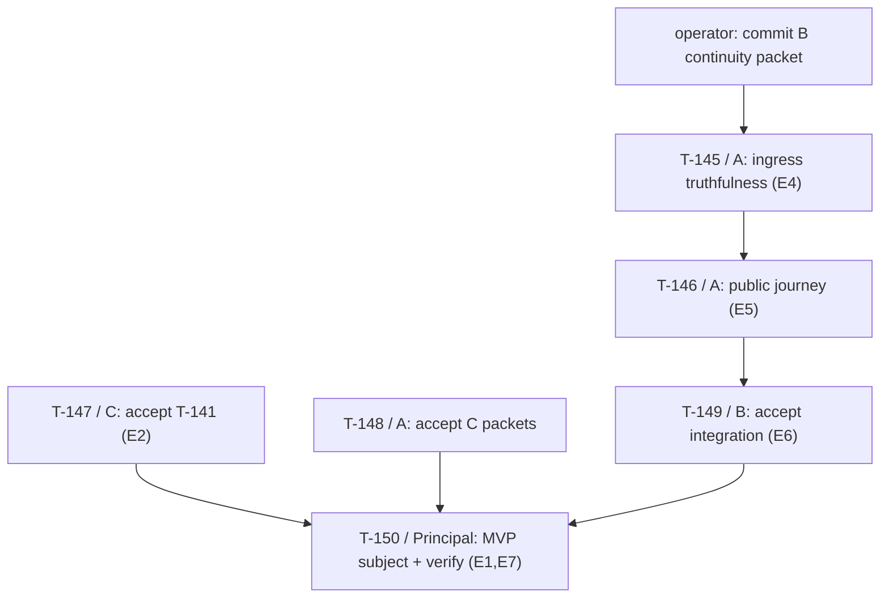

# Engineering-MVP Delivery Protocol (MS-MVP)

Authority: execution. Delta contracts: [`spec.md`](spec.md). Gates: [`milestones.md`](milestones.md).
Task rows: [`tasks.md`](tasks.md). Packages: [`backlog.md`](backlog.md). Handbook: [`technical.md`](technical.md).

**What this document decides.** It closes the Engineering-MVP outcome into a finite,
checkable gate (`E1`-`E7`, §2); fixes the normative child publication protocol that
T-141 realized in source (§3-§4); records two *reproduced* public-route defects with
their exact stacks (§5); and issues six self-contained work packets (§6) whose
contracts, falsifiers, commands and acceptors are complete enough to execute without
another leadership round-trip.

**What this document does not do.** It grants no acceptance. It does not close
`MS-CONTROL`, unfreeze `T-26`, authorize provider or paid calls, admit a corpus,
authorize `T-144`, or convert any receipt in §1 into an accepted claim. `MS-MVP` is a
*product capability* gate. It is deliberately **orthogonal to** and **not a
precondition of** the `D-6` `F1`-`F7` control-freeze predicates in
[`milestones.md`](milestones.md#d-6--closed-ms-control-freeze-preconditions-2026-09-13),
and it adds no eighth `F` predicate. The 2026-09-13 decoupling stands.

---

## 1. Position (verified, 2026-09-15)

State is recorded as **receipts**, not as acceptance. Every row below was reproduced
in-session at `lock_head` `90292daa` unless the Disposition column says otherwise.

| Subject | Receipt | Disposition |
|---|---|---|
| T-141 child isolation, verified publication, fenced recovery | `90292daa`; 61 focused tests PASS; 8 mutation probes each red when their guard is removed | **LANDED / acceptance pending.** Authored by Principal; Principal is ineligible to accept |
| T-131.4 admitted completion stops dispatch | B packet, uncommitted; 7 tests PASS | LANDED-IN-TREE / pending operator commit + C disposition |
| T-131.3 receipt binding to workspace/task/composition/command/subject | B packet, uncommitted | LANDED-IN-TREE / pending |
| T-131.7 resume hydration of durable state and identity | 31 tests PASS (`lda sweep`, this session) | **ACCEPTED (bounded, in-process/chain-tip)** by C |
| T-142 open-intent reconciliation at chain tip | 16 tests PASS (`lda sweep`, this session) | **ACCEPTED (bounded)** by C |
| Public CLI runtime ingress across all surfaces | — | **WITHHELD** by C; see §5 |
| T-133 / T-132 / T-137 / T-143 | `a217a9ef` / `9b61c71b` / `d76156a3` / `95a9ba38`; 74 tests PASS | Maintained as separate SHA-bound subjects; A review |
| Hexagonal boundaries; TCB 1386/1438; domain blindness; isolation policy | PASS | Current |
| `just check` | **RED** on 16 machine-local path references in `docs/research/coding_harness/aux_cli_multi_profiles.md` | Pre-existing, untouched file. Not an MVP blocker; see `E7` |
| Documentation health | 164 broken links, 63 frontmatter violations (`lda sweep`) | Pre-existing. Named, not masked |
| Curator / sealed store / evaluation authority / uninvolved acceptor | UNASSIGNED or UNPROVISIONED | External. Blocks `F3`/`F6`/`F7`, **not** `MS-MVP` |

**The serialization is now discharged.** Principal's T-141 work landed; `session.py`
was released; B's session-dependent repairs are complete in-tree. The only remaining
serialized step is **A's final public-CLI integration**, which §5 and §6 now specify
exactly rather than leave as a hand-off sentence.

---

## 2. MS-MVP — closed acceptance predicates (E1-E7)

`MS-MVP` closes when and only when `E1`-`E7` below hold with mutually compatible,
independently accepted receipts. This finite list replaces every open-ended phrase
("the MVP", "a useful journey", "production ready") in prior planning prose. A
missing receipt identifies the failing `E`-number; it never creates a new
task-shaped prerequisite.

| Predicate | Closed content |
|---|---|
| **E1 — Subject identity** | One clean commit; the exact public route `entrypoint.execute` -> `Runtime.execute_profiled` -> `Runtime.run_composed` -> `HarnessSession.run`; pack, model route, store, environment and profile identities pinned in the `RunPlan`. Working-tree claims are inadmissible |
| **E2 — Child mutation safety accepted** | T-141 independently accepted by a non-author against §4's `C-PUB-1`-`C-PUB-9`: child-local effect adapters, immutable base-bound retention, exclusive fencing through publication and recovery, five-fold revalidation at publication, verified-tree-equals-published-tree, and fail-closed crash/rejection/stale-base/sibling-escape/cleanup paths. The positive isolated-spawn control must be present and green; a permanent refusal does not satisfy `E2` |
| **E3 — Continuity accepted** | T-131.4, T-131.3, T-131.7 and T-142 accepted on real `Runtime` -> `HarnessSession` execution with a disposable WAL and a scripted model. Handcrafted ledger fixtures do not satisfy `E3`. C's bounded acceptance covers the in-process and chain-tip halves; the ingress half is `E4` |
| **E4 — Public ingress truthfulness** | `E-CLI-1` and `E-CLI-2` (§5) closed: a non-git workspace yields a *typed refusal*, never an unhandled `WorkspaceSnapshotRefused` escaping the public route; and durable resume state is hydrated and revalidated on every ingress that has durable events for the run, not only `command == "resume"` |
| **E5 — Useful journey demonstrated** | Through the public CLI route only: one greenfield multi-file creation and one brownfield multi-file change, each with exterior verification of the exact submitted candidate, complete changed-file attribution and honest cost accounting. Component receipts are not journeys |
| **E6 — Truthful refusal preserved** | On the same public route: an unverified, patchless, vacuous, tampered, stale or unauthorized candidate terminates as `abstained` / `failed` / `abandoned` / `undeterminable`, never `completed`. A restart neither widens authority nor replenishes budget. `fc == 0` on the demonstrated journeys |
| **E7 — Gate honesty** | `just verify` executed **once** on the clean exact MVP subject by the final integrator. Every pre-existing failure is named with its file and reason and is *not* attributed to the MVP subject; no gate is weakened, narrowed or silenced to produce a green line |

**Acceptor eligibility.** An author of a claim may not accept it. Principal authored
T-141 and is ineligible for `E2`. B authored the continuity packet and is ineligible
for `E3`. A owns the integration and becomes an author of `E4`/`E5`; `E4`-`E7`
therefore require an acceptor who did not write the integration — C where C made no
repair, otherwise an explicitly named uninvolved acceptor. This is the same
non-author rule `F4` uses; it is not a new authority.

---

## 3. Architecture: the delegation and publication lattice

### 3.1 Placement

No new layer. The protocol lives entirely inside the existing lattice
(`domain <- ports <- kernel <- agency <- runtime -> adapters`):

```text
runtime/root.py          composition edge: binds the recursion runner, refuses uncontained
runtime/delegation.py    SpawnAdapter: mints identity, attenuates, carries live authority
runtime/child_runtime.py recursion edge: rebinds ports, runs the child, drives publication
runtime/workspace.py     lifecycle: views, fence, base, candidate, staging, publish, recover
runtime/bootstrap.py     composition root: mints the child-local adapter factory
runtime/evaluator_gateway.py  sole legal projection of a signed exterior verdict
```

There is **no** second scheduler, episode loop, ledger, task-state store or
transaction framework, and none may be added under this gate. `ChildRuntimePort` is
unchanged; the authority seam is duck-typed (`run_child_authorized`) precisely so a
conforming runner that needs no publication authority is not obliged to carry one.

### 3.2 The five identities

All digests are RFC 8785 JCS canonicalization under `domain/canonicalisation/digest.py`,
written $H(\cdot)$. For child $c$ with view entries $E^{view}_c$ and shared-tree
entries $E^{base}$ at the moment the view was created:

$$B_c = H(\{\text{entries}: E^{base}\}) \qquad \text{(base binding, written once)}$$

$$K_c = H(\{\text{childId}: c,\; \text{base}: B_c,\; \text{entries}: E^{view}_c\}) \qquad \text{(candidate)}$$

$$E^{comb}_c = E^{base} \oplus E^{view}_c \qquad T_c = H(\{\text{entries}: E^{comb}_c\}) \qquad \text{(combined tree)}$$

where $\oplus$ is right-biased key-wise overlay (the child's bytes win on collision).
$E^{base}$ excludes the control directory and `EXCLUDED_DIRNAMES` = {`.git`, `.hg`,
`.svn`}.

**Why the candidate binds the base.** Two identical file sets computed against
different bases are *different claims*. Giving them one digest would let a retry
launder a stale candidate onto a tree that had moved. This is the difference between
content-addressing and claim-addressing, and it is the reason `K_c` includes $B_c$.

**Why the combined tree exists.** `DIR-C7` requires exterior verification of what the
parent ends up with. Verifying $E^{view}_c$ and then writing $E^{comb}_c$ verifies the
wrong object. $T_c$ is the published object, so $T_c$ is the verified object.

### 3.3 Publication state machine

```text
            ┌──────────┐  retain_candidate      ┌───────────┐
  child ───▶│ VIEW     │───────────────────────▶│ RETAINED  │
  episode   │ (seeded, │  base-bound, immutable │  (K_c)    │
            │  fenced  │                        └─────┬─────┘
            │  off)    │                              │ acquire(fence) + stage
            └──────────┘                              ▼
                                                ┌───────────┐
       exterior evaluator reads this ──────────▶│  STAGED   │  (T_c on disk)
                                                └─────┬─────┘
                            verdict(T_c) = pass ?     │
                      ┌───────────────────────────────┴────────────┐
                      │ no                                      yes│
                      ▼                                            ▼
                ┌───────────┐                              ┌──────────────┐
                │  REFUSED  │  result downgraded to        │  AUTHORIZED  │ durable
                │           │  UNDETERMINABLE, tree clean  │  (intent)    │ record
                └───────────┘                              └──────┬───────┘
                                                                  │ apply entries
                                                                  ▼
                                                           ┌─────────────┐
                                                           │  PUBLISHED  │ marker last
                                                           └─────────────┘
```

`recover()` re-enters only at `AUTHORIZED -> PUBLISHED`. It can finish a decision; it
can never make one.

### 3.4 The revalidation five-tuple

Publication is admitted iff all five hold **at the instant before the shared tree
changes** — not at dispatch, not at child completion:

$$\text{publish}(c) \iff \mathrm{Fence}(c) \wedge \mathrm{Base}(c) \wedge \mathrm{Cand}(c) \wedge \mathrm{Staged}(c) \wedge \mathrm{Verdict}(c)$$

| Term | Predicate | Defeats |
|---|---|---|
| $\mathrm{Fence}$ | `holder == c` and `token` current and lease unexpired | zombie writer, racing sibling, reclaimed lease |
| $\mathrm{Base}$ | $H(\{\text{entries}: E^{base}_{now}\}) = B_c$ and $K_c$ is bound to $B_c$ | stale base, concurrent sibling publication |
| $\mathrm{Cand}$ | candidate re-read from disk and re-digested to $K_c$ | tampered retention, substituted candidate |
| $\mathrm{Staged}$ | staged bytes re-digested to $T_c$ | swap between verification and publication |
| $\mathrm{Verdict}$ | daemon-signed, bound to subject $T_c$, disposition `passed`, executed tests $> 0$ | fabricated pass, vacuous pass, pass about another tree |

$\mathrm{Verdict}$ is projected through `evaluator_gateway.settlement_payload` — the
same function that decides what may be ledgered — so publication and the ledger
cannot disagree about whether a pass was bound.

### 3.5 Crash contract

| Crash point | Shared tree | `recover()` | Rationale |
|---|---|---|---|
| before retention | untouched | nothing | nothing was claimed |
| after retention, before authorization | untouched | **skipped** | a retained candidate is *work*, never permission; authority cannot be re-derived after a crash |
| after authorization, before marker | possibly partial | re-applies in full | acceptance is never partial |
| after marker | complete | no-op | keyed by $T_c$; no effect settles twice |
| during cleanup | complete | no-op | the lease is merely held and expires |

Exclusion during recovery is the lifecycle `flock`, **not** a fresh lease. Recovery
runs precisely when the authorizing owner is dead with its lease still held; demanding
the fence would make recovery impossible in the only case it exists for, and seizing
the fence would hand a recovering restart a live owner's tree.

---

## 4. Normative contracts

Clauses are binding on any change to the delegation or publication path. A change
that cannot satisfy one of these returns to leadership for an amendment; it is not
resolved by relaxing the clause.

- **C-PUB-1 (child-local effects).** A supervised child executes effects through an
  adapter constructed at its own view root. Rebasing `repo_path` while leaving the
  parent's adapter bound is refused, not degraded. Absence of a factory is a refusal.
- **C-PUB-2 (ownership of the adapter).** The child owns and disposes its adapter;
  the parent's adapter lifetime is untouched by any child.
- **C-PUB-3 (immutable base-bound retention).** A retained candidate may not be
  replaced. Re-retention of identical content against the identical base is
  idempotent; anything else refuses.
- **C-PUB-4 (exclusive fencing).** Shared-tree mutation is serialized to one holder
  by monotonic token. Expiry alone is not containment; a takeover invalidates the
  prior ticket by token so a descheduled writer fails closed without consulting a
  clock.
- **C-PUB-5 (five-fold revalidation).** §3.4 holds in full, at publication time.
- **C-PUB-6 (verified equals published).** The bytes an exterior evaluator read are
  the bytes that land. Re-digest the staged tree immediately before applying.
- **C-PUB-7 (recovery finishes, never decides).** `recover()` acts only on durable
  authorizations whose content re-digests to their recorded identity.
- **C-PUB-8 (forbidden targets).** A candidate may not write the workspace control
  directory (it could forge its own settlement) or repository metadata
  (`EXCLUDED_DIRNAMES`; a published `.git/config` carrying `core.hooksPath` is code
  execution on the parent's next git command). Exclusion from the base and refusal as
  a target must move together — excluding a directory from comparison while allowing
  writes into it is an escape hatch, not an optimization.
- **C-PUB-9 (honest refusal).** A refused publication is reported `undeterminable`,
  never `ok` and never as a silent success. The child completed in its own view, so
  its work is not lost; whether the shared tree received it is genuinely unknown
  (`F-22`).

### 4.1 Publication — reference pseudocode

```python
def publish_child(c, plan, authority):
    K = supervisor.retain_candidate(c)          # base-bound, immutable, idempotent
    if not child_result.ok:
        return child_result                      # retained, never published

    ticket = supervisor.acquire(c)               # C-PUB-4
    try:
        combined = supervisor.stage(ticket, candidate_digest=K)   # revalidates fence+base
        lapsed = authority.recheck(plan, child_result.actual_cost)
        if lapsed:
            raise PublicationRefused(lapsed)     # grant expired / actions dropped / overspend
        verdict = verify_exterior(combined.root, combined.digest)
        if verdict.signed_subject != combined.digest:
            raise PublicationRefused("verdict names another tree")
        supervisor.publish(ticket, combined, verdict=verdict)      # C-PUB-5, C-PUB-6
    finally:
        supervisor.release(ticket)
```

### 4.2 Recovery — reference pseudocode

```python
def recover():                                   # under the lifecycle lock only
    for child_dir in sorted(control_dir):
        record = authorization(child_dir.name)   # None for merely-retained work
        if record is None:
            continue                             # C-PUB-7: never promote
        if published_tree_digest(child_dir.name) == record.tree_digest:
            continue                             # already settled; do not re-settle
        apply_authorized(child_dir.name)         # content re-digested on read
```

### 4.3 Composition seams (public contract surface)

| Seam | Signature | Contract |
|---|---|---|
| `SessionPorts.child_environment` | `(child_id, root) -> EnvironmentAdapter` | Minted by the composition root beside the root adapter. `None` is not a fallback to the parent's adapter; it is the reason a spawning composition is refused |
| `SessionPorts.child_tree_verifier` | `(child_id, staged_root, tree_digest) -> EvaluatorPort` | Binds an exterior evaluator to one staged tree. `None` means no child may publish |
| `RuntimeChildRunner.is_contained()` | `-> bool` | All three of supervisor, adapter factory and verifier, or none. The composition root asks this one question and refuses on `False` |
| `RuntimeChildRunner.run_child_authorized` | `(plan, authority) -> ChildRunResult` | The only entry point that may publish. `run_child` (no authority) is legal solely for the unsupervised historical composition |

---

## 5. Reproduced public-route defects

Both were reproduced in-session at `90292daa`. Neither is speculative, and neither
is B's or C's to repair: both sit on the public ingress that A owns.

### E-CLI-1 — non-git workspace crashes completion admission

**Observed.** `test.runtime.test_app_service_and_cli` errors with:

```text
session.py:2701  _admit_completion -> current_workspace_digest=self._workspace_digest()
session.py:1994  raise WorkspaceSnapshotRefused
WORKSPACE_SNAPSHOT_REFUSED[instrument_error]: unable to enumerate repository status
```

**Isolated.** A directory that is not a git repository fails `snapshot()`; an
*unborn* repository (`git init`, zero commits) succeeds with the empty-tree digest:

| Workspace | `snapshot().ok` | Result |
|---|---|---|
| plain directory, no `.git` | `False` | `instrument_error: unable to enumerate repository status` |
| `git init`, no commits | `True` | `sha256:e3b0c442...` (empty tree) |

**Two defects, not one.** (a) The public greenfield journey in a plain directory
cannot reach a terminal at all. (b) More seriously, a *legitimate* refusal escapes as
an unhandled exception through `entrypoint.execute` instead of becoming a typed
terminal — so an honest "I cannot observe this workspace" is delivered as a crash.
(b) must be repaired even if (a) is resolved by requiring a repository.

**Boundary.** Do not repair by fabricating a digest, defaulting to the empty tree, or
skipping the binding. A workspace whose identity cannot be observed is a workspace on
which completion cannot be admitted; the fix is a truthful terminal, not a synthetic
identity.

### E-CLI-2 — ingress hydration is conditioned on the command verb

**Observed.** `runtime/entrypoint.py` hydrates durable state only under
`if command == "resume":`. Every other ingress constructs `TaskContext` with
`resume_state=None`.

**Consequence.** A run whose store already holds durable events for its `run_id`
starts with no hydrated identity, objective, episode or project. The continuity
T-131.7 and T-142 establish is bypassed by the verb, not by the state. Continuity
that depends on the operator typing the right word is not continuity.

**Boundary.** Hydrate from durable state whenever durable events exist for the run,
and *revalidate* rather than trust: a changed composition, preset, verification
subject or turn ceiling must fail closed on hydration, exactly as T-142 proves for
the in-process path. Do not widen `entrypoint.py` into a second session; the smallest
repair is cold-start hydration and revalidation on the existing ingress.

---

## 6. Work packets

Each packet is self-contained: lease, contract, falsifier, command, acceptor. Owners
act without further routine escalation. `requires:` is the only ordering relation.

### T-145 / A — public ingress truthfulness (`E4`)

- **Requires:** B's continuity packet committed by the repository operator.
- **Lease:** `runtime/entrypoint.py`, `runtime/session.py` (ingress and workspace
  identity seams only), `test/runtime/test_app_service_and_cli.py`, one new
  falsifier `test/falsifiers/test_t145_public_ingress_truthfulness.py`.
- **Contract:** close `E-CLI-1` and `E-CLI-2` per §5. Typed terminal on unobservable
  workspace identity; hydration keyed on durable state, not on the command verb;
  revalidation fails closed on changed composition, preset, subject or ceiling.
- **Falsifier (positive):** a plain-directory greenfield run reaches a truthful
  terminal; a run with durable events hydrates identity, objective, episode and
  project without `command == "resume"`.
- **Falsifier (adversarial):** unobservable workspace never admits completion;
  changed composition on hydration refuses; hydration never replenishes budget or
  re-widens a revoked grant.
- **Command:** `python3 -m unittest test.falsifiers.test_t145_public_ingress_truthfulness test.runtime.test_app_service_and_cli -v`
- **Acceptor:** C (made no repair here).

### T-146 / A — public journey evidence (`E5`)

- **Requires:** T-145.
- **Lease:** `test/falsifiers/test_t146_public_journey.py` (new); no production
  source without an explicit amendment.
- **Contract:** demonstrate, through `entrypoint.execute` only, one greenfield
  multi-file creation and one brownfield multi-file change with exterior
  verification of the exact submitted candidate, complete changed-file attribution
  and honest cost accounting. Scripted model, disposable WAL, no provider.
- **Falsifier:** both journeys green; changed-file set exactly matches the candidate;
  the verification subject digest equals the submitted candidate's.
- **Command:** `python3 -m unittest test.falsifiers.test_t146_public_journey -v`
- **Acceptor:** uninvolved acceptor (A authors the claim).

### T-147 / C — independent acceptance of T-141 (`E2`)

- **Requires:** none. Ready now.
- **Lease:** read-only. **No repair to any file under review.**
- **Contract:** dispose T-141 at `90292daa` against `C-PUB-1`-`C-PUB-9`. Accept only
  demonstrated bounded behavior; qualify or reject anything else.
- **Required probes:** re-run the eight mutation probes — removing each of
  (base revalidation, both verdict-pass checks together, recovery's authorization
  requirement, signed-subject binding, child-local adapter requirement, authority
  recheck, metadata target refusal, metadata base exclusion) must red. **A negative
  control that does not red when its guard is removed is not a control**; record any
  that stays green as a rejection, not a nit.
- **Command:** `python3 -m unittest test.falsifiers.test_t141_child_workspace_lifecycle test.falsifiers.test_t141_production_activation -v`
- **Acceptor:** C is the acceptor; Principal is ineligible.

### T-148 / A — independent acceptance of C's four packets

- **Requires:** none. Ready now.
- **Lease:** read-only on `a217a9ef`, `9b61c71b`, `d76156a3`, `95a9ba38`.
- **Contract:** accept only bounded demonstrated behavior; record missing SHA or
  evidence rather than accepting a working-tree claim. No repair inside a packet
  under review.
- **Acceptor:** A is the acceptor for these four.

### T-149 / B — independent acceptance of T-145/T-146 integration

- **Requires:** T-145, T-146.
- **Lease:** read-only.
- **Contract:** verify the integration did not weaken a continuity control; confirm
  `E6` on the public route (no false completion; restart neither widens authority nor
  replenishes budget).
- **Acceptor:** B (authored continuity, not the integration).

### T-150 / Principal — MVP subject assembly and single verify (`E1`, `E7`)

- **Requires:** T-145 through T-149.
- **Contract:** assemble one clean exact MVP subject; run `just verify` **once**;
  name every pre-existing failure with file and reason; attribute none of them to the
  MVP subject. Report `E1`-`E7` disposition honestly, including any predicate that
  did not close.
- **Known pre-existing failures to name, not fix, under this packet:** the 16
  machine-local path references in `docs/research/coding_harness/aux_cli_multi_profiles.md`;
  164 broken documentation links; 63 frontmatter violations.

### Packet dependency graph



T-147 and T-148 run **in parallel** with T-145/T-146. Only the A -> B -> Principal
chain is serialized.

---

## 7. Workflows and operating standard

### 7.1 Golden order (per packet)

Per [`lda-navigator`](../../../.agents/skills/lda-navigator/SKILL.md) §4:

```text
lda sweep --json  ->  lda tasks --ready --json  ->  lda plan "<packet>"
  ->  targeted line-range reads (never whole files)
  ->  surgical change
  ->  uv run lda index --delta
  ->  focused falsifiers from the plan  ->  lda drift --json
```

### 7.2 Packet protocol

No Git commands by developers. Hand the repository operator: packet ID, exact changed
files, commands, and the requested one-commit subject. Never include another owner's
dirty files. Do not run discovery or full-suite loops; run focused falsifiers,
relevant linters and `just check`. The final integrator runs `just verify` once.

### 7.3 Evidence rules

- A component receipt is not a journey; a journey is not an acceptance.
- Working-tree claims are inadmissible: bind a SHA.
- An author may not accept their own claim.
- Name pre-existing failures; never mask them and never attribute them to your subject.
- A `NOT_REPRODUCED` finding needs an independently accepted disposition, not invented
  repair work.

### 7.4 Mutation-proof procedure (mandatory for every negative control)

A test that passes both with and without the guard it claims to prove is evidence of
nothing. For each new negative control:

1. Disable exactly one guard (invert the condition, or `if False:`).
2. Run the focused suite. It **must** red, and red on the control that names that guard.
3. Restore, re-run, confirm green.
4. If a control stays green, it is passing for the wrong reason — fix the control, do
   not delete it, and never narrow the guard to match a weak control.

Defence in depth is legitimate: where a guard is enforced at two points, disable both
and show the suite reds. Record which probes were run in the packet receipt.

### 7.5 Decision standard

Prefer the existing runtime, ledger, evaluator gateway, dispatch authorization and
single writer. Make the smallest safe architectural choice that preserves `DIR-C1`-`C7`
and the hexagonal lattice. Do not create a scheduler, a second episode loop, a second
ledger, a second task state or a transaction framework. Escalate only for a genuinely
new public contract, an irreconcilable invariant, external authority or budget, or an
unavoidable occupied lease.

---

## 8. Deliberately deferred

Recorded so they are not silently forgotten and not silently started. Package rows
live in [`backlog.md`](backlog.md); the rationale is here.

| Item | Why deferred |
|---|---|
| **Concurrent sibling publication / merge** | Publication currently refuses a stale base rather than merging. Two siblings touching *disjoint* files still serialize, and the second is refused if the first published. Correct and fail-closed, but it caps parallel worker throughput. A merge strategy is a new public contract and is out of `MS-MVP` |
| **Base computation at repository scale** | `shared_entries()` reads the whole working tree as text on every view creation and every publication. Correct, `O(tree)`, and untested at repository scale. Needs a measurement before an optimization; an unmeasured optimization here would trade a proven invariant for a guess |
| **Binary and non-UTF-8 candidate content** | Excluded from the base and refused in retention. A child cannot currently publish a binary artifact |
| **T-144 planner-worker-verifier convergence** | Blocked on independent acceptance of T-141/T-142/T-143. Capability demonstration only; never a control result |
| **`F3`/`F6`/`F7` external dependencies** | Curator, sealed store, evaluation authority and uninvolved acceptor are UNASSIGNED or UNPROVISIONED. Named, not fabricated, not contacted |
| **Documentation health debt** | 164 broken links, 63 frontmatter violations, 16 machine-local path references. Real debt, tracked, but not an `MS-MVP` predicate — folding it in would let a documentation chore block a product gate |

---

## 9. Stop conditions

Unchanged and binding under this document: no provider calls, no paid runs, no
`T-26`/`T-27`, no `MS-CONTROL` closure, no corpus admission, no `T-144`
implementation, and no production approval repair merely because a diagnostic exists.

---

## 10. References

- Source: [`workspace.py`](../../../vanguard/packages/runtime/workspace.py),
  [`child_runtime.py`](../../../vanguard/packages/runtime/child_runtime.py),
  [`delegation.py`](../../../vanguard/packages/runtime/delegation.py),
  [`root.py`](../../../vanguard/packages/runtime/root.py),
  [`bootstrap.py`](../../../vanguard/packages/runtime/bootstrap.py),
  [`evaluator_gateway.py`](../../../vanguard/packages/runtime/evaluator_gateway.py),
  [`entrypoint.py`](../../../vanguard/packages/runtime/entrypoint.py)
- Falsifiers: [`test_t141_child_workspace_lifecycle.py`](../../../test/falsifiers/test_t141_child_workspace_lifecycle.py),
  [`test_t141_production_activation.py`](../../../test/falsifiers/test_t141_production_activation.py)
- Gates: [`milestones.md`](milestones.md) (`D-6` `F1`-`F7`), [`spec.md`](spec.md) (`DIR-4`, `RUN-1`)
- Navigation: [`lda-navigator`](../../../.agents/skills/lda-navigator/SKILL.md)
- Roles and authority: [`roles_and_authority.md`](../management/roles_and_authority.md),
  [`work_packet_protocol.md`](../management/work_packet_protocol.md)
