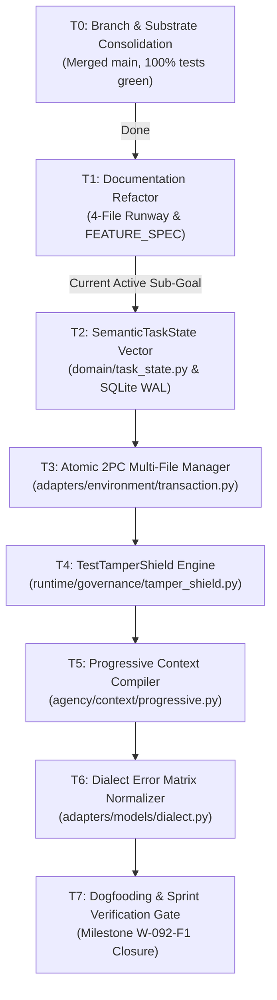

# Execution tasks (flat, by context)

Authority: execution. Delta contracts: [`spec.md`](spec.md). Handbook: [`technical.md`](technical.md). Packages: [`backlog.md`](backlog.md). TARGET gates: [`milestones.md`](milestones.md).

**Current decision:** [RUN-1](spec.md#run-1-leadership-execution-decision-2026-09-12)
governs the active work below. Older checklists retain historical obligations but
cannot add READY work. No sprint/wave ordering. No new compiler or episode loop.

## Active autonomous work (2026-09-12)

Planning is approved under the present leadership delegation; no implementation
or test execution is claimed in this review. Start from `001911e3` or an explicitly
reconciled successor. The historical NT-1 handoff below remains accepted on
`2989d57d`; its counts are not current measurements. Only the following READY
rows are authorized for the next engineering assignment. All other unchecked
historical/proposed rows require reconciliation before activation.

**Autonomy standard for every READY row — [RUN-04](spec.md#run-1-leadership-execution-decision-2026-09-12).**
A READY row authorizes implementation within its lease and accepted contract. The
engineer MAY choose private helpers, test fixtures, error wording, equivalent
algorithms, and bounded fixes to failures the task itself introduces; they MAY
write the declared falsifier before the implementation, and a missing test file
is not by itself a blocker. The engineer MUST NOT silently add a public port or
schema, change product presets, widen scope or authority, disable verification,
alter an acceptance threshold, or promote an unapproved proposal — each of those
returns to leadership. Every session records subject, row, remaining work, file
ownership, verification disposition and remaining allowance in the handoff below,
creating no new planning file; at session exhaustion, leave a resumable handoff.

| Task | Owner / state | requires: | Scope / exit |
|---|---|---|---|
| T-26a | C — ACCEPTED (independent review, Dev B 2026-09-12) | T-111 accepted | Validate the complete manifest and publication boundary under RUN-02; preserve pure diagnostic scoring. Detailed row below. |
| T-51 | C — ACCEPTED (independent review, Dev B 2026-09-12) | T-111 accepted | Freeze a candidate 30-task L2 holdout with explicit strata, task/oracle digests and no L0/L1 overlap; local data preparation only. Detailed row below. |
| T-52 | A — LANDED, awaiting independent review by B | T-26a, T-51 | Reconcile binary/missing counts, single attempts, cost provenance and fixed stopping through publication; detailed row below. |
| T-26b | B, A reviews product identity — BLOCKED | T-26a, T-51, T-52 | Integrate the report gate into the selected runner, prove product-path and stop/budget behavior hermetically, and reconcile applicable T-79/T-89/T-92–T-95/T-97 receipts. |
| T-26 | C / release owner — BLOCKED; UNFROZEN | T-111, T-26b, T-92 live L0 acceptance | Freeze one clean compatible subject and all identities/resources. Missing model, authorized resources or live prerequisite is a named blocker. No paid call in this task. |
| T-27 | C runs; independent reviewer accepts — BLOCKED | T-26, explicit run authorization | Execute the fixed canary, publish all outcomes, and record independent disposition. A published negative is task reporting completion, not acceptance for dependency edges. |
| T-129 | C with relevant package owner — BLOCKED | T-27 accepted / MS-CONTROL closed | Refine one selected post-control package, memory/skills first. Ratify scope, paths, schema obligations, budgets and leaf edges before implementation. No automatic FH-1 activation. |

**Session rules.** Acquire exact file leases from the task row after inspecting
current Git state; proposed directory maps are not active leases. With no overlap,
READY work may proceed independently; otherwise serialize. Use an isolated test
repository under NT-B02, preserve user changes, and do not run unbounded repair
loops. Default to at most three unsuccessful repair cycles per leaf, 120 seconds
per focused test command and 1800 seconds per full gate command; a timeout is an
incomplete check, not a pass. A tighter assigned budget wins. Stop with the named
failure and resumable handoff when exhausted; iterative mutation loops retain the
required byte-for-byte rollback guarantee. These are developer-session bounds,
not changes to product presets or empirical-run ceilings.

Each handoff in the existing task row records `subject`, `state`, `lease`,
`completed`, `next_action`, `verification` (command/result or not_run), `remaining_budget`,
`blocker` and artifact references. A successor may resume within the same approved
scope without leadership. Escalate only changed acceptance/authority/public
contracts, paid resources, unsafe migration or a scope expansion. Missing fixtures
are authored as the first step of an admitted leaf; missing design decisions are
resolved at package admission rather than improvised as new architecture.

**Historical handoff (2026-09-11; accepted integrated subject `2989d57d4d38c01eecdb7a5fbb6f125077f00e59`).** Leadership accepted T-77, T-107, T-110 and T-111 after exact-subject qualification. Full discovery ran 3,121 tests: 3,079 passed, 42 skipped, zero failures/errors. The complete `just check` and `just verify` pipelines, 815-test runtime collection (17 skipped), 38-test focused runtime/RF slice and 20-test preregistration/frozen-canary slice passed. T-110 executed 104 deterministic turns over four fresh Python interpreters and matched the uninterrupted semantic vector without duplicate settled effects. Public presets remain byte-identical; TCB LOC is 1386 (<= 1438); Invariant N-06 has zero `subprocess` imports in runtime; `control_preregistration.json` remains `UNFROZEN` (`subject_sha: null`) with zero paid calls. MS-BASELINE and MS-CONTEXT are CLOSED. MS-CONTROL remains OPEN; T-26 was recorded READY but UNFROZEN; current readiness is superseded by RUN-1, and T-27/T-51/T-52 remain open.

## Near-term ownership and ready work

**Operational Vocabulary Standard:**
- Execution units are strictly identified by **Stream + Task ID + Milestone Gate** (e.g. `Stream A: T-99 -> MS-BASELINE`).
- Terms such as "sprint", "wave", and "phase" are retired historical designations and carry no operational authority.
- Where those words survive below, they are provenance, not ordering: source-document citations (for example "B Wave 0 corpus sizes"), dated session notes, and the verbatim ticket bodies in the appendix are reproduced as written and are never edited to change their historical meaning. No occurrence of "wave", "sprint" or "phase" anywhere in this file schedules, sequences, or authorizes work; only `requires:` does.
- The `requires:` edges are the sole dependency ordering.

### Accepted convergence handoff (historical)

This table is a projection of the `requires:` edges below. `READY` authorizes work; `BLOCKED` means its named predecessor lacks an accepted receipt. A focused-green implementation candidate remains unchecked until independent review accepts its full task contract.

| Task | Stream | State | Requires | Concrete exit |
|---|---|---|---|---|
| **T-109** | C, with A/B defect owners | `ACCEPTED` | T-97/T-98/T-99/T-101/T-102/T-103/T-108 accepted | One clean SHA passes complete Python discovery, full `just check` and `just verify` bodies, TypeScript gates and nonmutation comparison with zero failures/errors. |
| **T-77** | B | `ACCEPTED` | T-104/T-105 accepted | Integrated context/cache contracts pass on `2989d57d`; cache usage remains observed or null. |
| **T-107** | A | `ACCEPTED` | T-100/T-104/T-105/T-106/T-109 accepted | Registered write-before-use selection/recovery and project-scoped cold replay pass on `2989d57d`. |
| **T-110** | A/C | `ACCEPTED` | T-107 and T-77 | The 104-turn fixture crosses four fresh interpreters and preserves the semantic vector on `2989d57d`. |
| **T-111** | C | `ACCEPTED` | T-109 and T-110 | Exact-subject full gates reconcile and close MS-BASELINE/MS-CONTEXT on `2989d57d`. |
| **T-26** | C/Leadership | `BLOCKED; UNFROZEN` | See active work table | The earlier READY label meant preparation, not readiness to freeze before hardening and live prerequisites. |
| **T-27** | C/reviewer | `BLOCKED` | See active work table | Reporting completion alone does not unlock branch acceptance. |
| **FH-1 tree** | A/B/C | `PROPOSED; NOT READY` | T-27 accepted and T-129 package admission | Atomic rows are design candidates, not executable leases. |

### Stream Ownership and Boundaries

The labels **Stream A/B/C** below are current engineering ownership, not the historical `(A)`/`(B)` source-document labels or prior Lane A/B roles. There is no sprint calendar. T-98, T-99, T-100 and T-97 are independently ready. T-99 uses an independent disposable repository for targeted reproductions; no broad contributor-tree suite is permitted before T-98. Dependencies are actual prerequisites, not hidden external approvals.

| Stream | Exclusive owned files / exceptions | Integration rule |
|---|---|---|
| A — Runtime and product | `runtime/{entrypoint,app_service,child_runtime,cli,session,task_state,checkpoints,ledger_emitter}.py`; `apps/coding_max/`; `adapters/models/`; CLI parser/main/tests; runtime/app tests except C's explicitly listed collection fixtures | Sole writer of runtime bindings; B hands over pure interfaces. A owns T-97 and facade portions of T-79/T-89. |
| B — Pure state, context, recovery and patch correctness | `domain/task_state.py`; `agency/context/`, `agency/episode/`; `adapters/environment/`; `packs/code-default/` except C's `presets.json`/`load.py`; corresponding agency/semantic-state/patch/transaction tests | T-100 -> T-104 -> T-106 within B; no edits to A's `session.py` or provider serializers. |
| C — Test integrity, configuration and acceptance | `test/__init__.py`, `test/conftest.py`, shared safe fixtures, `test/lab/`, collection/nonmutation meta-tests; benchmarks/tests; tools/linters; CI/lockfiles/package manifests/`justfile`; preset catalog/load/manifests; execution docs and generated knowledge | Sole merge-queue/document owner. Remaining test files are assigned by T-101 before edits; C hands A fixture changes for A-owned tests. |

Work executes on the active feature branch (`feat/aether-framework-electroweak-canonical-agents`) with strictly disjoint file leases per Stream (zero file-level overlap) and focused test falsifiers to prevent cross-contamination. Shared-tree concurrent editing of the same file is forbidden. An explicit file assignment overrides a directory default; transfer a file only after the prior owner's patch lands. No two active rows may lease the same file. Zero planned file overlap is enforceable; semantic conflicts are resolved by integrated verification. Read-only reviews may cross ownership. Generated files have only the generator as writer. If event/schema tooling needs changes, C lands schema-generator input changes while A owns emission/reducer consumers under T-107.

### Multi-day delivery batch for context convergence

Historical NT-1 delivery record only. The active autonomous table supersedes its
readiness and staffing; completed convergence work is not reactivated here.

This batch is a coordination timebox, not a new dependency system or a waiver of
`requires:` edges. Developers work autonomously on isolated branches or repositories
from the same C-published integration SHA. They may use several coherent commits and
run focused tests during development; routine red-to-green iterations do not require
Leadership review. Stream C serializes merges and requests one independent Leadership
decision only after the final clean candidate and complete receipts exist.

| Order | Owner | Substantial deliverable | Handoff boundary |
|---|---|---|---|
| 1 | C | Integrate `cae7c98d` and `37813a65`; register `ContextSelectionRecorded`; run combined T-77/T-107 and event-coverage gates | `COMPLETE`: Merged, registered, event coverage green, published integration SHA. |
| 2A | A | Build T-110 on the integrated production path; repair runtime/session/checkpoint/provider defects it exposes; audit A-owned product consumers used by T-79/T-89 | `COMPLETE`: Delivered T-110 fixture in `dbf8144d`; qualified cold continuation and trajectory content. |
| 2B | B | Harden integrated context and recovery behavior under T-110 fault cases; repair only B-owned compiler/compaction/recovery policy | `COMPLETE`: Preserved turn 0 initial epoch on cold resume, hardened context/recovery conformance. |
| 2C | C | In parallel, audit C-owned preset/catalog and hermetic T-51/T-52/T-92–T-95 corpus, metrics and preregistration readiness | `COMPLETE`: Verified presets byte-identical; `control_preregistration.json` verified `UNFROZEN` (`subject_sha: null`); zero paid calls. |
| 3 | C | Integrate A/B, execute T-111 and all full gates, reconcile the five execution files and prepare the evidence package | `COMPLETE`: Full discovery passed (3121 tests, 0 failures, 0 errors, 42 skipped), `just check` & `just verify` PASS; submitted on `2989d57d` for consolidated Leadership verdict. |

The batch stops at an **unfrozen control candidate**. Leadership acceptance of the
T-111 package is required before T-26 freezes an exact subject. T-27 and paid L2
execution remain later control work. T-80, T-96, CAS, specialists, delegation,
campaigns and memory learning remain outside this batch.

### Context: Baseline and truthful product convergence

- [x] **T-98: Runner-independent isolation and nonmutation**
  - **package / owner**: GATE-01 / Stream C
  - **requires**: []
  - **files**: `test/__init__.py`, `test/conftest.py`, shared test fixtures, `tools/linters/check_test_hygiene.py`, `justfile`; **[NEW]** `test/contracts/test_suite_nonmutation.py`
  - **contract**: NT-B01–B03. Redirect corpora for unittest; independent Git metadata and no network/credentials. Provision missing declared gate dependencies without relaxing gates.
  - **falsifier**: `python3 -m unittest test.contracts.test_suite_nonmutation test.tools.test_check_test_hygiene -v`; deliberate writes/staging escape fail the meta-test; contributor source/index/corpus digests unchanged.
  - **accepted evidence (2026-09-10)**: 35 tests passed; complete check/verify recipe bodies passed after this protection, with no gate claim.

- [x] **T-99: Lossless terminal projection and admission successors**
  - **package / owner**: INS-01 / Stream A
  - **requires**: []
  - **files**: `runtime/entrypoint.py`, `runtime/app_service.py`, `runtime/child_runtime.py`, app/facade and RF-90 tests; paths are under `vanguard/packages/` unless test-qualified
  - **contract**: NT-B04, EW-9.1; one terminal mapping, separate disposition. Supply real verification in successful T-04 successor fixtures; never weaken the gate.
  - **falsifier**: `python3 -m unittest test.apps.coding_max.test_coding_max_facade test.falsifiers.test_rf90_generic_entrypoint test.falsifiers.test_completion_gate_scope -v`; a mutation collapsing refusal into completion fails at both public surfaces.
  - **accepted evidence (2026-09-10)**: named product falsifier 45/45 and trajectory reader/writer slice 22/22; product `abstained` remains exact and frozen trajectory enums narrow it to `aborted`, never success.

- [x] **T-97: CLI product surface — reproduce then repair**
  - **package / owner**: INS-01 / Stream A
  - **requires**: [] (T-84 landed in M-5A)
  - **files**: `vanguard/clients/cli/src/composition/parse-cli.ts`, `vanguard/clients/cli/src/main.ts`, `vanguard/clients/cli/test/commands.test.ts`
  - **contract**: Reproduce current `aether code --help` behavior before repair; make it print help and exit zero without a completion frame. Resolve `-m` collision by explicit binding whose losing spelling errors rather than silently winning.
  - **falsifier**: `npm --workspace @vanguard/cli test` proves help exits zero without model call, conflicting flags cannot resolve ambiguously, and non-success execution returns nonzero; `npm run typecheck` also required.
  - **accepted evidence (2026-09-10)**: CLI 89/89 and monorepo typecheck passed; help is non-executing and the explicit `-m` binding cannot leak values into the brief.

- [x] **T-101: Complete collection and current-subject failure inventory**
  - **package / owner**: GATE-01 / Stream C
  - **requires**: [T-98]
  - **files**: `test/lab/`, retained lab-dependent falsifiers and their supported tooling, **[NEW]** `test/contracts/test_collection_integrity.py`, baseline receipt artifacts
  - **contract**: NT-B01–B03. Classify every failure by current subject and assign exact files. Port required assertions to supported APIs; retire only with a recorded successor/withdrawn claim. Do not resurrect dead engines just to satisfy imports.
  - **falsifier**: `python3 -m unittest test.contracts.test_collection_integrity -v`; intentionally absent/import-broken module fails. Full isolated discovery records all failures/errors/skips and catches no hidden collection loss.
  - **accepted evidence (2026-09-10)**: 6/6 falsifier passed (`python3 -m unittest test.contracts.test_collection_integrity -v`); complete root discovery executed on current subject with zero omission loss: 2,924 collected, 2,918 executed, 2,861 passed, 10 failed, 7 errored, 42 skipped (duration 156.653s). All 17 failures/errors classified by stream (Stream A: 6 fails, 2 errors; Stream B: 1 fail; Stream C: 2 fails, 4 errors + 1 ladder import error). Nonmutation verified (24/24 in `test_suite_nonmutation`). Unlocks B: T-108.

- [x] **T-103: Preset and evidence configuration integrity**
  - **package / owner**: CMX-01 / Stream C
  - **requires**: [T-98]
  - **files**: `packs/code-default/{presets.json,load.py}`, selected `agency/manifests/vg-code-{fast,balanced,max}/` files, preset/benchmark tests
  - **contract**: NT-B04 and T-79. Preserve existing declared budgets, label budget-only differences honestly; normalized behavioral identity includes selected plugins. No new comparative arms.
  - **falsifier**: `python3 -m unittest test.packs.code_default.test_presets test.benchmarks.test_instrument_ms test.benchmarks.test_preregistration -v`; relabeling identical behavior cannot establish distinct treatment; declared bounds are not caller attenuation.
  - **accepted evidence (2026-09-10)**: 28/28 falsifier passed (`python3 -m unittest test.packs.code_default.test_presets test.benchmarks.test_instrument_ms test.benchmarks.test_preregistration -v`); declared catalog ceilings (fast: $0.05/8t/16k, balanced: $0.15/20t/40k, max: $0.40/40t/96k) preserved without mutation and parity asserted with manifests; caller bounds attenuate monotonically without elevating declared ceilings (`effective_limit`); normalized behavioral identity includes plugins (`planner`, `context`); relabeling identical behavior or budget-only differences cannot establish distinct comparative treatments under `assert_single_varied_dimension`. Unlocks A: T-102.

- [x] **T-102: Thin facade and canonical product execution**
  - **package / owner**: INS-01 / Stream A
  - **requires**: [T-99, T-103]
  - **files**: `apps/coding_max/facade.py`, `runtime/{entrypoint,cli,app_service}.py`, app/runtime tests
  - **contract**: Complete T-79/T-89 product-side convergence without a second loader, default ceiling or execution loop; installed resources resolve through the supported package API.
  - **falsifier**: `python3 -m unittest test.runtime.test_app_service_and_cli test.apps.coding_max.test_facade test.apps.test_preset_budgets -v`; same input/profile yields same declared/effective budgets and outcome through CLI/API/facade.
  - **accepted evidence (2026-09-10)**: leadership independently inspected the runtime catalog, facade, entrypoint, application-service and CLI convergence on `7594c2381eb56d071855a69f8743deca0a8609fb`; the named falsifier passed 19/19. `pack_catalog.py` is the sole `spec_from_file_location` pack loader and preset allowlist owner, installed manifests resolve through package resources, caller limits only attenuate catalog ceilings, and no parallel product execution loop was introduced. Acceptance is scoped to T-102 and does not accept T-108, authorize T-109, or close MS-BASELINE.

- [x] **T-108: Existing patch correctness and dead-path consolidation**
  - **package / owner**: GATE-01 / Stream B
  - **requires**: [T-98, T-101]
  - **files**: `packs/code-default/toolkits/ast_patch.py`, selected `adapters/environment/` implementation and patch tests; unreachable agency implementations identified by T-101; runtime/manifest caller edits handed to A/C
  - **contract**: TC-E-061. Reject stale/ambiguous preimages and incomplete hunks; one production patch semantics with permitted adapters/fakes. No deletion quota, no new CAS workspace engine, no loss of registered plugin/falsifier coverage.
  - **falsifier**: `python3 -m unittest test.falsifiers.test_d6_patch_context_anchoring test.packs.code_default.test_ast_patch test.runtime.test_atomic_multi_file_transaction -v`; invalid file N leaves all owned preimages intact. Full collection follows removals.
  - **accepted evidence (2026-09-10)**: leadership corrected the committed `fake.py` syntax defect and independently falsified stale/ambiguous anchors, empty/edit-free hunks, false declared old/new hunk counts, and five-file rollback. The combined T-108 slice passed 25/25; hunk start lines remain relocation hints but declared counts now bind the complete body. Git/Fake and the pack toolkit reuse `adapters/environment/hunks.py`; multi-file Git commits reuse `AtomicMultiFileTransactionManager`; no CAS workspace engine or parallel patch semantics was introduced. Unlocks T-109.

- [x] **T-109: Integrated baseline acceptance**
  - **package / owner**: GATE-01 / Stream C
  - **requires**: [T-98, T-99, T-101, T-102, T-103, T-108, T-97]
  - **files**: gate/tooling configuration and existing execution handoffs; defects remain assigned to their source owners
  - **contract**: Close MS-BASELINE only on exact-subject complete receipts. Remaining failures found by T-101 are mandatory, not exclusions from this gate.
  - **falsifier**: `python3 -m unittest discover -s test -t .` in the qualified isolated runner, complete `just check`, `just verify` recipe bodies and TypeScript gates. Zero failures/errors, no unaccounted module loss, source/index/corpus unchanged. Missing commands block acceptance.
  - **implementation protocol**:
    1. Start from a committed, clean candidate; record full SHA, branch, Python/uv/Node/npm versions, platform, runner identity, `justfile` digest and LDA identity. A dirty candidate is ineligible rather than “qualified with changes.”
    2. Execute the nonmutation and collection-integrity falsifiers before broad discovery. The isolated repository has independent Git metadata, redirected writable corpora, provider credentials removed and network denied. Capture protected source/index/corpus digests before the first test.
    3. Run full unittest discovery once as the authoritative collection. Record collected, executed, passed, failed, errored and skipped as disjoint counts that reconcile arithmetically. Preserve every traceback and import error. A focused rerun may diagnose a failure but cannot replace this receipt.
    4. Run the literal current `just check` and `just verify` recipes and the declared TypeScript gates. A missing executable or dependency is `not_run` and blocks acceptance. Do not infer recipe success from individually green subsets.
    5. Recompute protected digests and inspect `git status --porcelain`. Any contributor-source, index-of-record or corpus mutation invalidates the run. Route real defects to the owning stream, produce a new committed candidate and restart the exact-subject gate.
    6. C independently reviews command completeness, count arithmetic, skips, output digests and candidate identity. Only then may T-109 be checked and MS-BASELINE move to `CLOSED`.
  - **accepted evidence (2026-09-11)**:
    - **subject_sha**: `f71fca4876fff0104e996cdd01fa85f8ce09c604`
    - **dirty_state**: `clean` (`git status --porcelain` returned empty)
    - **runner**: `Stream C Lead (AETHER/Vanguard hermetic qualification)`
    - **platform**: `Linux fedora 7.1.12-200.fc44.x86_64`
    - **python**: `Python 3.12.14`
    - **uv**: `uv 0.12.9 (x86_64-unknown-linux-gnu)`
    - **node**: `v24.20.0`
    - **npm**: `11.19.0`
    - **justfile_digest**: `3e931467bf626a99de4ea75ceb31b15dc3e2b1d14c5c17a1a6f5efb3e26fbaaf`
    - **commands[]**:
      - `UV_CACHE_DIR=/tmp/aether-uv-cache uv sync --frozen`: exit 0 (12 packages verified)
      - `UV_CACHE_DIR=/tmp/aether-uv-cache uv run python3 -m unittest test.contracts.test_suite_nonmutation test.contracts.test_collection_integrity test.tools.test_check_test_hygiene -v`: exit 0 (Ran 41 tests in 5.853s, OK)
      - `UV_CACHE_DIR=/tmp/aether-uv-cache uv run python3 -m unittest discover -s test -t .`: exit 0 (Ran 3006 tests in 125.547s, OK (skipped=42))
      - `UV_CACHE_DIR=/tmp/aether-uv-cache uv run just check`: exit 0 (AETHER CHECK: PASS)
      - `UV_CACHE_DIR=/tmp/aether-uv-cache uv run just verify`: exit 0 (AETHER VERIFY: PASS)
      - `npm run typecheck`: exit 0 (11 workspaces verified)
      - `npm --workspace @vanguard/cli test`: exit 0 (89 passed, 0 failed in 1722ms)
    - **counts**: collected=3006, executed=2964, passed=2964, failed=0, errors=0, skipped=42
    - **arithmetic_reconciliation**: collected (3006) = passed (2964) + failed (0) + errors (0) + skipped (42); executed (2964) = passed (2964) + failed (0) + errors (0)
    - **import_failures[]**: `[]`
    - **pre_state_digest**: `01083ed308d7700fc8cd529736f7d6ab4eacbbac4ca8dd2251a1c564884e1552`
    - **post_state_digest**: `93861a4c5f290066e4db69f06d7369831ec989c321569157cbb749fe594f28dd` (Tracked protected tree manifest digest `e3aadfb5285ac8b0566e38a5dfda209ac96db93686330df10ba2f33372e3d30c` unmutated)
    - **lda_identity**: `{"head_sha": "f71fca4876fff0104e996cdd01fa85f8ce09c604", "profile": "AETHER", "dirty": false}`
    - **reviewer_disposition**: `ACCEPTED (Stream C Test-Integrity Lead; exact-subject MS-BASELINE qualification gate green with zero failures/errors; operational authorization granted for Dev A to begin T-107 and Dev B to deliver T-77; final Leadership review deferred to MS-BASELINE + MS-CONTEXT integrated candidate)`

### Context: Canonical context, cache and deterministic recovery

- [x] **T-100: Canonical working-memory and recovery value contracts**
  - **package / owner**: CTX-01 / Stream B
  - **requires**: []
  - **files**: `domain/task_state.py`, `agency/episode/protocol_recovery.py` value definitions, `test/contracts/test_semantic_task_state.py`
  - **contract**: NT-1.2. Immutable canonical snapshots reuse SemanticTaskState; retain full state and add versioned cursor/lineage/reducer binding. Define bounded recovery serialization and migration before consumers.
  - **falsifier**: `python3 -m unittest test.contracts.test_semantic_task_state -v`; nested-map mutation cannot alter captured bytes; bad versions/digests/counters/duplicate keys fail; old supported state round trips without effect replay.
  - **accepted evidence (2026-09-10)**: semantic-state/recovery/spawn slice 49/49; construction and decode are deeply immutable, malformed/inconsistent versioned state fails closed, and child abstention is non-success.

- [x] **T-104: Bounded context selection on the existing compiler**
  - **package / owner**: CTX-01 / Stream B
  - **requires**: [T-100]
  - **files**: `agency/context/{compiler,compaction,layers,distiller}.py`, context tests
  - **contract**: NT-C01–C05. Port Prefix/compile_packet behavior into ContextCompiler; preserve mandatory state/newest interaction; bound body/item counts; stable tool ordering; omissions and policy identity.
  - **falsifier**: `python3 -m unittest test.agency.test_context_compiler test.agency.test_context_packet -v`; oversize/stale evidence is elided with artifact identity; irreducible overflow performs no inference; token count fits final hard budget.
  - **accepted evidence (2026-09-10)**: compiler/packet slice 41/41; implementation extends the existing compiler and introduces no parallel context path.

- [x] **T-105: Provider serialization and cache observation**
  - **package / owner**: CTX-01 / Stream A
  - **requires**: [T-102, T-104]
  - **files**: existing `adapters/models/` request serializers, **[NEW]** `test/adapters/test_prompt_serialization_budget.py`; no B-owned compiler edits
  - **contract**: NT-C03/C06. Implement PromptCodec at the actual provider boundary; count final request; negotiate cache controls and expose real usage or null. No generic fixture cache-rate claim.
  - **falsifier**: `python3 -m unittest test.adapters.test_prompt_serialization_budget -v`; native tool-schema overhead fits; changed dynamic state preserves prefix bytes; cache misses preserve semantics and reservations use uncached bounds.
  - **accepted evidence (2026-09-10)**: leadership replaced the unsafe average `ceil(bytes/3)` estimate with a fail-closed one-token-per-UTF-8-byte ceiling for byte-level provider tokenizers; routes may inject an exact tokenizer. Adversarial punctuation, arbitrary bytes and multibyte UTF-8 now falsify density assumptions. The codec still counts the final posted request and native tool schemas, keeps cache observations nullable, and never widens reservations from cache reports. The expanded named falsifier passed 24/24; no B-owned compiler or parallel context path was introduced.

- [x] **T-106: Bounded deterministic stall recovery**
  - **package / owner**: REC-01 / Stream B
  - **requires**: [T-100, T-104]
  - **files**: `agency/episode/{protocol_recovery,engine}.py`, `test/agency/test_protocol_recovery.py`
  - **contract**: NT-R01–R03. Integrate Part 3 recover semantics with bounded histories, persisted decisions and reground/replan/stop only; consultations remain disabled. No second retry loop.
  - **falsifier**: `python3 -m unittest test.agency.test_protocol_recovery -v`; six-action repeat and two/three-cycles detected, new evidence permits progress, retries/deadlines survive serialization, permission denial never sleeps into authorization.
  - **accepted evidence (2026-09-10)**: stall recovery slice 15/15 passed (`python3 -m unittest test.agency.test_protocol_recovery -v`); 6-action window detects 3 unchanged signatures, length-2 and length-3 cycles detected, new evidence permits progress, retries/deadlines survive serialization, and permission denial fails closed without sleeping.

- [x] **T-107: Runtime binding and durable selection/recovery events**
  - **package / owner**: CTX-01 / REC-01 / Stream A
  - **requires**: [T-100, T-104, T-105, T-106, T-109]
  - **files**: `runtime/{session,task_state,checkpoints,ledger_emitter}.py`, runtime tests; C owns any schema-generator inputs/event registry tooling needed by this handoff
  - **contract**: NT-1.2, NT-C05, NT-R03. Bind values and policies through composition; emit registered mhf.event/2 facts before inference/dispatch; reconstruct state without repeated effects; bump identities when behavior changes.
  - **falsifier**: `python3 -m unittest test.runtime.test_task_state_fold test.runtime.test_resume_identity test.runtime.test_context_layer_residency test.runtime.test_coding_resume -v`; event-write failure blocks next external call, resume preserves counters and prefix epoch. `python3 tools/linters/check_event_coverage.py`.
  - **implementation checklist**:
    - Reuse `Session`, `LedgerEmitter`, `fold_task_state`, existing checkpoint/reconstruction code and `ProtocolRecoveryState`; do not add another session loop, event store, checkpoint authority or retry controller.
    - At composition, bind repository subject, context-policy digest, prompt/tool epoch, model route, serializer and counter identity. Behavior-affecting changes create a new identity; they never reuse an old cache/freeze identity.
    - Before inference, durably emit a registered `ContextSelectionRecorded` fact containing the selection/prefix/state/policy/request identities, cursor, token count and omissions required by `aether.prompt-selection/1`. Failure to append stops inference.
    - After each semantic attempt, durably emit the complete recovery snapshot through the registered recovery/state event before wait, retry, reground, replan or another dispatch. Persist the chosen delay and deadline once. Failure to append stops the next external action.
    - On cold resume, fold the ledger, validate schema/lineage/reducer/subject identities, reconcile open intents and children, and reconstruct counters, attempts, pending operation, deadline, remaining budgets, prefix epoch and settled effects. Never replay a settled or occurrence-unknown effect.
    - Register every new production-emittable event through C-owned schema/catalog generator inputs and keep `check_event_coverage.py` green. Runtime remains declarative with respect to execution: no `subprocess` import under `vanguard/packages/runtime/`.
  - **fault injections**: selection append failure before model call; recovery append failure before retry; crash after selection append but before inference; crash after `EffectStarted` but before settlement; restart with wrong subject/policy/reducer; duplicate resume request; expired pending-operation deadline.
  - **accepted evidence (2026-09-11; subject 2989d57d)**: candidate `cae7c98d` is integrated on `2989d57d4d38c01eecdb7a5fbb6f125077f00e59`. `ContextSelectionRecorded` is registered through canonical generator inputs and handled in the domain reducer. The named falsifier passed 42/42, event coverage passed, ledger truth passed, and the final full discovery/verify gates were green. Runtime retains zero `subprocess` imports. Leadership accepted the row at T-111.

- [x] **T-110: Long-session preservation qualification**
  - **package / owner**: CTX-01 / REC-01 / Stream A
  - **requires**: [T-107, T-77]
  - **files**: **[NEW]** `test/runtime/test_long_session_context_recovery.py`, existing cold-resume fixtures; no new runtime path
  - **contract**: NT-I02. At least 100 deterministic turns, forced compaction and fresh-process restart, misleading tool output, stale verification, pending-operation deadline and exhausted recovery. Dedicated test budget, unchanged public presets.
  - **falsifier**: `python3 -m unittest test.runtime.test_long_session_context_recovery test.falsifiers.test_rf25_cold_continuation test.falsifiers.test_rf23_trajectory_content -v`; exact intent/constraints, next action, settled effects and accounting preserved; no false completion.
  - **fixture blueprint**:
    - Use a deterministic fake clock, deterministic model/operator tape, isolated event store and dedicated test-only context/turn budget. Assert the shipped fast/balanced/max preset bytes and declared ceilings are unchanged.
    - Drive at least 100 accepted or rejected turns with multiple high-watermark crossings, low-watermark compactions and at least two fresh-process reconstructions at different boundaries.
    - Include oversized observations, bounded artifact receipts, misleading untrusted text, one stale verification, a repeated-action six-turn window, length-two/three cycles, one pending operation, a persisted transient delay and exhausted reground/replan allowances.
    - At every checkpoint compare objective, constraints, active plan, next action, modified resources, last material failure, latest applicable verification, settled descriptors, remaining budgets, recovery counters/history, pending operation/deadline and epoch/serializer/counter identities.
    - Prove that omission affects presentation only: durable task facts remain reconstructable; newest complete interaction remains; stale verification cannot authorize finish; exhausted recovery terminates explicitly; no settled effect executes twice.
  - **acceptance matrix**: uninterrupted run versus cold-resumed run must yield identical semantic state and terminal disposition; exact event sequence numbers may differ only where the contract explicitly permits recovery facts. Test output must name the first divergent field.
  - **accepted evidence (2026-09-11; subject 2989d57d)**: the strengthened fixture passed 7/7 and its combined RF slice passed 9/9 on `2989d57d4d38c01eecdb7a5fbb6f125077f00e59`. It executed 104 deterministic turns over four fresh Python interpreters, reconstructed solely from SQLite, reconciled the turn-76 open intent without duplicate settlement and matched the uninterrupted semantic vector. Shipped presets remained byte-identical. Leadership accepted the row at T-111.

- [x] **T-111: Near-term gate reconciliation and control handoff**
  - **package / owner**: GATE-01 / EXP-01 / Stream C
  - **requires**: [T-109, T-110]
  - **files**: existing five execution files; `benchmarks/ladder/control_preregistration.json` validation and receipt references; knowledge regenerated, never hand-edited
  - **contract**: NT-I02. Verify final integrated SHA and MS-BASELINE/MS-CONTEXT predicates; keep T-26 UNFROZEN until all applicable dependencies and live-smoke dispositions are satisfied. This task does not make a paid call or close MS-CONTROL.
  - **falsifier**: `python3 -m unittest test.benchmarks.test_preregistration test.falsifiers.test_rel02_frozen_canary -v`, full isolated gate on final subject; changing context/model/schema/policy identity refuses reuse of an old freeze.
  - **reconciliation checklist**:
    1. Verify accepted T-109 and T-110 receipts refer to the integrated candidate or rerun them on the final candidate when any executable, schema, prompt, model, tool, serializer, counter, policy or preset identity changed.
    2. Run preregistration/frozen-canary falsifiers and the complete T-109 gate again. Confirm all protected bytes and the working tree remain unchanged.
    3. Reconcile `spec.md`, `technical.md`, `backlog.md`, `tasks.md` and `milestones.md`; regenerate knowledge through its generator. Status prose must agree with checkboxes and milestone rows.
    4. Mark MS-CONTEXT closed only after independent receipt review. Record the exact subject and explicit missingness; fixture success makes no live provider, cache-rate or benchmark-quality claim.
    5. Hand the accepted subject to T-26 as an unfrozen control candidate. T-26/T-27/T-51/T-52 and applicable T-79/T-89/T-92–T-95 obligations remain control work.
  - **accepted evidence (2026-09-11; subject 2989d57d)**: full discovery ran 3,121 tests (3,079 passed, 42 skipped, zero failures/errors) on `2989d57d4d38c01eecdb7a5fbb6f125077f00e59`. `just check` and the complete elevated-IPC `just verify` passed, including Python, TypeScript, schema/event coverage, integrity and documentation gates. The preregistration/frozen-canary slice passed 20/20. LDA was healthy and fresh with zero stale paths. Leadership closed MS-BASELINE and MS-CONTEXT and handed this exact subject to T-26 as an unfrozen candidate.

New test modules above are deliverables of their rows; absence before implementation is not a pass. Existing T-04/T-79/T-89/T-97 IDs retain their contracts; T-99/T-102/T-103 assign the successor integration work, not competing implementations. Historical checked mechanisms stay checked; all new rows remain unchecked until their receipts are accepted.

B §18 tickets T-01–T-35 are canonical. A §31 maps into those IDs or T-36+ (see merge map appendix). v2 `SUB-*` are aliases. Live backlog `SUB-01` (kernel S0–S12) is a different package.

Historical CMX-09 sprint DAG is in the [appendix](#appendix-historical-cmx-09-dag-do-not-execute).

### Context: Post-control horizon (FH-1) [PROPOSAL]

All leaves remain unchecked and provisional. T-27 below means accepted positive
MS-CONTROL, not merely a finished evaluation. Every branch additionally requires
T-129 package admission. The expanded candidate board is a decomposition; its exact
paths and commands are not yet ratified or necessarily present. Parent outcomes
remain planning requirements; existing code, composition and persistence owners
must be resolved before the rows can become executable.

These leaves refine existing T-17/T-28–T-34/T-49–T-58/T-67/T-80/T-96 families rather than creating competing implementations. [FH-1](spec.md#fh-1-post-control-backend-horizon-proposal) supplies contracts and [milestones](milestones.md#post-control-horizon-release-predicates-fh-1) supplies acceptance. Official evaluation of the single controller does not require optional CAS/campaign/memory work; any measured arm using those features does require their accepted gates. No paid calls or public submissions are authorized by this tree.

- [ ] **T-112: Canonical tree and edit-set contracts [PROPOSAL]**
  - **owner**: domain values; ports contract review
  - **requires**: [T-27]
  - **contract**: FH-C01; CAS-01
  - **prototype leaves**: Define versioned entries, node/tree digests, bounds and exact edit-set validation; map existing port seams before adding any API.
  - **falsifier / acceptance**: Round-trip bytes/modes/empty directories; reject duplicate/escaping paths, unsupported nodes and malformed digests.

- [ ] **T-113: Durable snapshot adapter and isolated materialization [PROPOSAL]**
  - **owner**: adapters/environment and blob store
  - **requires**: [T-112]
  - **contract**: FH-C01; CAS-01
  - **prototype leaves**: Capture consistently, persist blobs before acknowledgement, materialize pinned trees and scratch outputs; bound storage.
  - **falsifier / acceptance**: Capture race, crash during blob write, corruption, symlink and case-collision rejection; verifier cannot write active source.

- [ ] **T-114: Authenticated candidate verification and atomic promotion [PROPOSAL]**
  - **owner**: runtime emitter/reducers; adapter transaction boundary
  - **requires**: [T-113]
  - **contract**: FH-C02; CAS-01
  - **prototype leaves**: Bind check plan and trusted receipts; implement idempotency and head/generation compare-and-append with registered events.
  - **falsifier / acceptance**: Concurrent promotion admits one winner; stale receipts, omitted checks, forged verdicts and ABA reject; lost reply reconciles.

- [ ] **T-115: Checkout export recovery and CAS retention [PROPOSAL]**
  - **owner**: environment/store adapters; runtime lifecycle
  - **requires**: [T-114]
  - **contract**: FH-C03/FH-C04; CAS-01
  - **prototype leaves**: Journal export/preimages, preserve metadata and external edits; implement rollback as new promotion and bounded pinned GC.
  - **falsifier / acceptance**: Crash at each exported path; restore exact bytes/modes/existence or quarantine; GC cannot remove live/pending evidence.

- [ ] **T-116: CAS integration qualification [PROPOSAL]**
  - **owner**: test/runtime; test/contracts; test/adapters
  - **requires**: [T-115]
  - **contract**: MS-CAS
  - **prototype leaves**: Drive selected product profile through capture, multi-file edit, verification, promotion, restart and separate export.
  - **falsifier / acceptance**: Fresh-process persistence and second-verifier failure preserve baseline; full preservation gates; publish exact-subject MS-CAS disposition.

- [ ] **T-117: Specialist wire and scope contracts [PROPOSAL]**
  - **owner**: domain/ports; agency policy
  - **requires**: [T-27]
  - **contract**: FH-D01/FH-D02; DEL-01
  - **prototype leaves**: Bind parent/call/request identities, artifact inputs, bounded findings and composition-owned read effects; reuse spawn values.
  - **falsifier / acceptance**: Reject parent/subject mismatch, authority escalation, malformed output and credential-bearing context.

- [ ] **T-118: Canonical spawn lifecycle and resource qualification [PROPOSAL]**
  - **owner**: runtime delegation; agency spawn; focused test owners
  - **requires**: [T-117]
  - **contract**: MS-DELEGATION
  - **prototype leaves**: Reserve through current governor, persist/reconcile intent and lineage; handle cancellation, revocation and unknown usage.
  - **falsifier / acceptance**: Sibling overreservation, crash before/after dispatch, repeated call IDs and pending cancellation; no duplicate child/refund.

- [ ] **T-119: Preregistered adaptive and specialist treatments [PROPOSAL]**
  - **owner**: benchmarks paired studies; pack policies
  - **requires**: [T-118, T-122]
  - **contract**: EXP-02; MS-META/MS-SPECIALIST
  - **prototype leaves**: Refine T-28/T-29/T-30/T-50/T-80/T-96 into separately frozen one-variable studies; mutating variants additionally require T-116.
  - **falsifier / acceptance**: Same tasks and total ceilings, missingness/cost/latency accounting; valid negative/inconclusive disables treatment; positive gate needs prespecified lift.

- [ ] **T-120: Durable campaign prototype [PROPOSAL]**
  - **owner**: runtime client and existing scheduling; test integration
  - **requires**: [T-116, T-118]
  - **contract**: FH-D03; OCT-03
  - **prototype leaves**: Refine T-31/T-34/T-54: versioned DAG, artifacts, node leases, single merge owner and bounded replanning; no second execution loop.
  - **falsifier / acceptance**: Crash at each node boundary, unresolved child, failed dependency and conflicting candidates; no duplicate writes; combined-tree verification.

- [ ] **T-121: Governed memory product qualification [PROPOSAL]**
  - **owner**: existing memory/learning runtime and adapters; evaluator tests
  - **requires**: [T-27]
  - **contract**: MS-MEMORY; MEM-QUAL
  - **prototype leaves**: Refine T-32/T-56/T-57: versioned lessons, authorization/revocation, independent evaluation/promotion and rollback.
  - **falsifier / acceptance**: Cross-project leakage and stale cache denied; failed promotion retains evidence; held-out lift disposition; reconcile remaining M-8 predicates.

- [ ] **T-122: Frozen evaluation schema and independent evaluator boundary [PROPOSAL]**
  - **owner**: benchmarks protocols; existing evaluator adapters; test owners
  - **requires**: [T-27]
  - **contract**: FH-E01/FH-E02; EVAL-02
  - **prototype leaves**: Define corpus/arm/attempt identities, denominator reconciliation, unique evaluator runs and immutable prediction artifacts.
  - **falsifier / acceptance**: Reject unfrozen manifest, stale cache, forged receipt, missing row and worker access to oracle; preserve setup failure and unknown cost.

- [ ] **T-123: SWE-bench Verified protocol adapter [PROPOSAL]**
  - **owner**: benchmarks/tools runners and benchmark tests
  - **requires**: [T-122]
  - **contract**: FH-E03; EVAL-02
  - **prototype leaves**: Pin upstream evaluator/dataset/images and prediction format; reproduce reference outputs in isolated fixtures before paid execution.
  - **falsifier / acceptance**: Known pass/fail/empty/invalid patches, timeout and missing report retain upstream meaning; changed patch cannot reuse cached verdict.

- [ ] **T-124: Aider polyglot protocol adapter [PROPOSAL]**
  - **owner**: benchmarks/tools runners and benchmark tests
  - **requires**: [T-122]
  - **contract**: FH-E03; EVAL-02
  - **prototype leaves**: Pin corpus/runner/edit/feedback rules; label AETHER harness substitution and preserve first-attempt versus retry metrics.
  - **falsifier / acceptance**: Multilingual build/test collection, invalid edit, feedback-budget exhaustion and missing output; no pooling with Verified.

- [ ] **T-125: Greenfield corpus and evaluation protocol gate [PROPOSAL]**
  - **owner**: benchmarks corpus/evaluator and test owners
  - **requires**: [T-123, T-124]
  - **contract**: MS-EVAL; EVAL-02
  - **prototype leaves**: Refine T-51/T-58 with separate requirement-to-check corpus, negative/stub cases and clean-start verification; audit all adapters.
  - **falsifier / acceptance**: Placeholder-only implementations fail exterior checks; all expected attempts accounted; publish protocol disposition without claiming live scores.

- [ ] **T-126: Official frozen benchmark execution and audit [PROPOSAL]**
  - **owner**: benchmark execution and independent evidence review
  - **requires**: [T-125]
  - **contract**: MS-OFFICIAL; SWE-P4/SWE-P5
  - **prototype leaves**: After applicable SWE-P3/P4 predicates, freeze exact arms, spend, sample/stop policy and run authorized evaluations; preserve T-33 DeepSWE separately.
  - **falsifier / acceptance**: Complete raw outputs, corpus-specific denominators and reproducible evaluator results; retain negative/missing outcomes; submission authority explicit.

- [ ] **T-127: Dated SOTA comparison disposition [PROPOSAL]**
  - **owner**: benchmark statistics and independent reviewer
  - **requires**: [T-126]
  - **contract**: MS-SOTA
  - **prototype leaves**: Freeze eligible comparator/metric/resource envelope and statistical threshold before evaluation; compare only compatible protocols.
  - **falsifier / acceptance**: Independent replay/statistical audit; declare positive/negative/inconclusive/invalid; no universal score or professional-equivalence claim.

- [ ] **T-128: Full-horizon release reconciliation [PROPOSAL]**
  - **owner**: execution governance; architecture owners and release reviewers
  - **requires**: [T-126]
  - **contract**: M-8/M-9/M-10; REL-QUAL
  - **prototype leaves**: Map accepted profile features to evidence and canonical architecture, migrate/version schemas, retire superseded paths with successor tests.
  - **falsifier / acceptance**: Complete release recipes and independent evidence review; retain M-8/M-9/M-10 predicates. T-127 required only for a SOTA claim; T-116/T-118/T-120/T-121 required when corresponding features ship.


#### FH-1 atomic subtask board [PROPOSAL]

Every row below is `[PROPOSAL]`, requiring accepted T-27 **and T-129 admission for
its package** in addition to the listed edges. Proposed paths are placeholders,
not leases. Prospective falsifier commands are not current runnable evidence.
After admission, writing the missing falsifier is an ordinary first implementation
step; its expected failure must test behavior rather than only a missing import.

**T-129 preparation disposition (2026-09-12; NOT admission).** Source placement
and dependency corrections below resolve the known planning defects. T-129 remains
BLOCKED on accepted T-27; all post-control rows remain PROPOSED/BLOCKED. No lease,
implementation, schema allocation, paid run or package acceptance is authorized.
See the technical handbook's “T-129 preparation: owner decisions” for the source
evidence and compatibility boundaries. Revalidate against the eventual admitted
subject; do not treat this preparation as a completed T-129 checkbox.

**Stream assignment for post-control work.** `A` = runtime and product composition;
`B` = pure domain, algorithms and adapters; `C` = integrity, gates, benchmarks and
the merge queue. This extends the NT-1 Stream table above without re-assigning any
NT-1 file: `runtime/cas/`, `runtime/campaign/` and `runtime/delegation.py` join A;
`domain/cas/`, `domain/delegation/`, `domain/campaign/`, `domain/memory/` and
`adapters/cas/` join B; the cross-layer fault-injection and concurrency suites join C.

| Subtask | Stream -> Gate | Requires | Leased files (exclusive) | Falsifier |
|---|---|---|---|---|
| **T-112a** Tree values and `H_tree` | B -> MS-CAS | T-27 | `vanguard/packages/domain/cas/tree.py`; `test/domain/test_cas_tree.py` | `python3 -m unittest test.domain.test_cas_tree -v` |
| **T-112b** Preimage validator and edit-set apply | B -> MS-CAS | T-112a | `vanguard/packages/domain/cas/edit_set.py`; `test/domain/test_cas_edit_set.py` | `python3 -m unittest test.domain.test_cas_edit_set -v` |
| **T-113a** Harden existing FileBlobStore durability/integrity | B -> MS-CAS | T-112a | `vanguard/packages/adapters/stores/blob_store.py`; `test/adapters/test_cas_blob_store.py` | `python3 -m unittest test.adapters.test_cas_blob_store -v` |
| **T-113b** Capture and isolated materialization | B -> MS-CAS | T-113a | `vanguard/packages/adapters/cas/workspace.py`; `test/adapters/test_cas_workspace.py` | `python3 -m unittest test.adapters.test_cas_workspace -v` |
| **T-114a** Promotion value, `I(P)`, generation algebra | B -> MS-CAS | T-112b | `vanguard/packages/domain/cas/promotion.py`; `test/domain/test_cas_promotion.py` | `python3 -m unittest test.domain.test_cas_promotion -v` |
| **T-114b** `prepare_and_promote` Phases 0–5 | A -> MS-CAS | T-113b, T-114a, T-114d, T-114e | `vanguard/packages/runtime/cas/promote.py`; `test/runtime/test_cas_promote.py` | `python3 -m unittest test.runtime.test_cas_promote -v` |
| **T-114c** Commit critical section and lost-reply reconcile | A -> MS-CAS | T-114b, T-114f | `vanguard/packages/runtime/cas/commit.py`; `test/runtime/test_cas_commit.py` | `python3 -m unittest test.runtime.test_cas_commit -v` |
| **T-114d** Check-plan sufficiency and verifier attestation | B -> MS-CAS | T-114a | `vanguard/packages/adapters/verification/runner.py`; `test/adapters/test_candidate_verifier.py` | `python3 -m unittest test.adapters.test_candidate_verifier -v` |
| **T-115a** Journaled export and quarantine engine | B -> MS-CAS | T-114c | `vanguard/packages/adapters/cas/export.py`; `test/adapters/test_cas_export.py` | `python3 -m unittest test.adapters.test_cas_export -v` |
| **T-115b** Pin closure and bounded mark/sweep GC | B -> MS-CAS | T-115a | `vanguard/packages/adapters/cas/retention.py`; `test/adapters/test_cas_retention.py` | `python3 -m unittest test.adapters.test_cas_retention -v` |
| **T-116a** CAS fault-injection suite (`F1`–`F3`, `X1`–`X2`) | C -> MS-CAS | T-115b | `test/contracts/test_cas_fault_injection.py` | `python3 -m unittest test.contracts.test_cas_fault_injection -v` |
| **T-116b** Fresh-process concurrency and ABA falsifiers | C -> MS-CAS | T-116a | `test/falsifiers/test_cas_concurrency.py` | `python3 -m unittest test.falsifiers.test_cas_concurrency -v` |
| **T-116c** Product-profile CAS integration qualification | C -> MS-CAS | T-116b, T-116d | `test/integration/test_cas_product_profile.py` | `python3 -m unittest test.integration.test_cas_product_profile -v` |
| **T-117a** Specialist request/findings wire schemas | B -> MS-DELEGATION | T-27 | `vanguard/packages/domain/delegation/specialist.py`; `test/domain/test_specialist_wire.py` | `python3 -m unittest test.domain.test_specialist_wire -v` |
| **T-117b** Settlement value and conservation predicate | B -> MS-DELEGATION | T-117a | `vanguard/packages/domain/delegation/settlement.py`; `test/domain/test_delegation_settlement.py` | `python3 -m unittest test.domain.test_delegation_settlement -v` |
| **T-118a** Five-state dispatch/settlement FSM | A -> MS-DELEGATION | T-117b | `vanguard/packages/runtime/delegation.py`; `test/runtime/test_delegation_fsm.py` | `python3 -m unittest test.runtime.test_delegation_fsm -v` |
| **T-118b** `reconcile_delegation` and cancellation propagation | A -> MS-DELEGATION | T-118a | `vanguard/packages/runtime/delegation_recovery.py`; `test/runtime/test_delegation_recovery.py` | `python3 -m unittest test.runtime.test_delegation_recovery -v` |
| **T-118c** Delegation fault-injection suite (`D1`–`D2`) | C -> MS-DELEGATION | T-118b | `test/contracts/test_delegation_fault_injection.py` | `python3 -m unittest test.contracts.test_delegation_fault_injection -v` |
| **T-119a** Paired one-variable specialist study harness | C -> MS-SPECIALIST | T-118c, T-122b | `benchmarks/studies/specialist_paired.py`; `test/benchmarks/test_specialist_paired.py` | `python3 -m unittest test.benchmarks.test_specialist_paired -v` |
| **T-120a** Campaign plan, Kahn sort, `ready(v)` | B -> MS-CAMPAIGN | T-117b | `vanguard/packages/domain/campaign/plan.py`; `test/domain/test_campaign_plan.py` | `python3 -m unittest test.domain.test_campaign_plan -v` |
| **T-120b** Director runtime client and lease fencing | A -> MS-CAMPAIGN | T-116c, T-118c, T-120a | `vanguard/packages/runtime/campaign/director.py`; `test/runtime/test_campaign_director.py` | `python3 -m unittest test.runtime.test_campaign_director -v` |
| **T-120c** Zero-mutating-verb and resume falsifiers (`C1`–`C2`) | C -> MS-CAMPAIGN | T-120b | `test/contracts/test_campaign_isolation.py` | `python3 -m unittest test.contracts.test_campaign_isolation -v` |
| **T-121a** Lesson values and revocation root `R_e` | B -> MS-MEMORY | T-27 | `vanguard/packages/domain/memory/lesson.py`; `test/domain/test_lesson_revocation.py` | `python3 -m unittest test.domain.test_lesson_revocation -v` |
| **T-121b** Retrieval admission and epoch cache invalidation | A -> MS-MEMORY | T-121a | `vanguard/packages/runtime/memory_admission.py`; `test/runtime/test_retrieval_admission.py` | `python3 -m unittest test.runtime.test_retrieval_admission -v` |
| **T-121c** Contamination join and held-out lift study | C -> MS-MEMORY | T-121b, T-122b | `benchmarks/studies/memory_lift.py`; `test/benchmarks/test_memory_lift.py` | `python3 -m unittest test.benchmarks.test_memory_lift -v` |
| **T-122a** Evaluation manifest/attempt schemas | B -> MS-EVAL | T-27 | `vanguard/packages/domain/evaluation/manifest.py`; `test/domain/test_evaluation_manifest.py` | `python3 -m unittest test.domain.test_evaluation_manifest -v` |
| **T-122b** Independent evaluator boundary | C -> MS-EVAL | T-122a | `benchmarks/evaluation_protocols/evaluator_boundary.py`; `test/benchmarks/test_evaluator_boundary.py` | `python3 -m unittest test.benchmarks.test_evaluator_boundary -v` |
| **T-123a** SWE-bench Verified pinned adapter | C -> MS-EVAL | T-122b | `benchmarks/evaluation_protocols/swebench_verified.py`; `test/benchmarks/test_swebench_verified.py` | `python3 -m unittest test.benchmarks.test_swebench_verified -v` |
| **T-124a** Aider polyglot pinned adapter | C -> MS-EVAL | T-122b | `benchmarks/evaluation_protocols/aider_polyglot.py`; `test/benchmarks/test_aider_polyglot.py` | `python3 -m unittest test.benchmarks.test_aider_polyglot -v` |
| **T-125a** Greenfield corpus and exterior acceptance | C -> MS-EVAL | T-122b | `benchmarks/evaluation_protocols/greenfield_corpus.py`; `test/benchmarks/test_greenfield_corpus.py` | `python3 -m unittest test.benchmarks.test_greenfield_corpus -v` |
| **T-126a** Frozen official execution and audit recipe | C -> MS-OFFICIAL | T-123a, T-124a, T-125a | `benchmarks/ladder/official_run.py`; `test/benchmarks/test_official_run.py` | `python3 -m unittest test.benchmarks.test_official_run -v` |
| **T-127a** Dated SOTA comparison disposition | C -> MS-SOTA | T-126a | `benchmarks/ladder/sota_comparison.py`; `test/benchmarks/test_sota_comparison.py` | `python3 -m unittest test.benchmarks.test_sota_comparison -v` |
| **T-128a** Release reconciliation and schema migration | C -> M-8/M-9/M-10 | T-126a | `tools/release/reconcile_horizon.py`; `test/tools/test_release_reconcile.py` | `python3 -m unittest test.tools.test_release_reconcile -v` |

The following three integration leaves supplement the original 33-row board;
they have the same PROPOSED/BLOCKED admission guard. Shared owners are explicit,
not covered by a claim of directory-level disjointness.

| Subtask | Stream -> Gate | Requires | Candidate files (not active leases) | Prospective falsifier |
|---|---|---|---|---|
| **T-114e** CAS event allocation, writer authority and replay | C -> MS-CAS | T-114a | `schemas/mhf/event_envelope.schema.json`; `schemas/mhf/event_envelope_v2.schema.json`; regenerate `vanguard/packages/domain/wire/types_gen.py` through the existing generator; extend `vanguard/packages/domain/ledger/events.py`, `state.py`, `reducer.py`; extend `vanguard/packages/runtime/ledger_emitter.py`; new `test/contracts/test_cas_event_replay.py` | `python3 -m unittest test.contracts.test_cas_event_replay test.contracts.test_event_coverage -v` |
| **T-114f** Durable compare-and-append boundary | C -> MS-CAS | T-114e | extend `vanguard/packages/ports/event_store.py`, `vanguard/packages/adapters/stores/event_store.py`, `vanguard/packages/runtime/ledger_emitter.py`; new `test/contracts/test_cas_store_atomicity.py` | `python3 -m unittest test.contracts.test_cas_store_atomicity -v` |
| **T-116d** CAS composition and restart hookup | A -> MS-CAS | T-115b | extend `vanguard/packages/runtime/session.py`, `compose.py`, `wiring.py`; new `test/runtime/test_cas_composition.py` | `python3 -m unittest test.runtime.test_cas_composition -v` |

T-114e hands the emitter lease to T-114f; T-114c consumes the resulting port, not
a second store connection. T-116c qualifies T-116d's product wiring, not only a
fixture-built coordinator. T-114e must preserve old ledger readability and cover
unauthorized writers, unknown kinds, deterministic replay and restored generation.
T-114f must falsify two-process stale promotion, conflicting transaction identity
and lost-reply duplication; ordinary atomic batch append is insufficient evidence.
At admission, the first leaf creating each new Python package owns its
`__init__.py` and matching test-package scaffold; later leaves depend on that
handoff. Shared composition/schema owners across packages require serialized
leases and explicit edges in the selected package decision.

Parent leaves T-112–T-128 stay unchecked until every one of their subtasks is
accepted. A subtask closes on its own falsifier plus the parent's stated acceptance
row; a green focused suite alone never checks a parent box.

**Falsifier obligations by clause.** Each suite must contain at least these
must-fail cases, taken from the spec clause it defends:

- `test_cas_tree`: mode-only change alters `H_tree`; an empty directory alters `H_tree`; `P1`–`P7` each reject with their own code; a symlink is `TREE_UNSUPPORTED` and is never dereferenced; `casefold(NFC(.))` collision is `TREE_CASE_COLLISION`.
- `test_cas_edit_set`: one bad preimage rejects the whole set; `expected_node` distinguishes a mode change from a content change; double application fails; post-apply parent closure is enforced.
- `test_cas_commit`: `n` concurrent promotions admit exactly one winner; `A -> B -> A` with a held stale request returns `GENERATION_STALE`, not success; a replayed `transaction_id` with different fields returns `TRANSACTION_IDENTITY_MISMATCH`; a lost reply adopts the original receipt without a second append.
- `test_cas_export`: an externally modified path is preserved and quarantines rather than being restored over; `completed_paths` drives resume; a committed promotion with a quarantined export reports both.
- `test_delegation_fsm`: sibling overreservation is refused; a timeout settles at **reserved**, never zero; `CHILD_UNKNOWN` holds the reservation unsettled; cancel does not replenish the envelope.
- `test_campaign_isolation`: the director module constructs no `EpisodeEngine` and reaches no mutating verb; a superseded `fence_token` cannot append a disposition; a failed dependency never becomes ready; crash after node K resumes at K+1 without recomputing K.
- `test_lesson_revocation`: a cached retrieval under a superseded `R_e` is refused; a revoked record never returns from recall; revocation appends no rewrite of prior admission events.
- `test_memory_lift`: a contaminated provenance digest invalidates the run; `Δμ >= 0.05` with `p < 0.05` but a CI lower bound at or below zero vetoes rather than promotes.

#### Disjoint file-lease matrix (post-control) [PROPOSAL]

Zero file-level overlap across streams and across concurrently active subtasks.
An explicit row lease overrides any directory default, exactly as under NT-1.

| Stream | Post-control exclusive leases | Rows |
|---|---|---|
| **A — Runtime and product** | `vanguard/packages/runtime/cas/`, `vanguard/packages/runtime/campaign/`, `vanguard/packages/runtime/memory_admission.py`, `vanguard/packages/runtime/delegation.py`, `vanguard/packages/runtime/delegation_recovery.py`, and the matching `test/runtime/` suites | T-114b, T-114c, T-118a, T-118b, T-120b, T-121b |
| **B — Domain, algorithms and adapters** | `vanguard/packages/domain/{cas,delegation,campaign,memory,evaluation}/`, `vanguard/packages/adapters/cas/`, `vanguard/packages/adapters/verification/`, and the matching `test/domain/` and `test/adapters/` suites | T-112a, T-112b, T-113a, T-113b, T-114a, T-114d, T-115a, T-115b, T-117a, T-117b, T-120a, T-121a, T-122a |
| **C — Integrity, gates and benchmarks** | `test/contracts/`, `test/falsifiers/`, `test/integration/`, `benchmarks/`, `tools/release/`, preset catalogs and manifests, the five execution documents, and the merge queue | T-116a, T-116b, T-116c, T-118c, T-119a, T-120c, T-121c, T-122b, T-123a, T-124a, T-125a, T-126a, T-127a, T-128a |

Candidate leases require revalidation at admission; shared integration owners are serialized.
No disjointness or readiness claim follows from this directory summary. Integration
rows T-114e/f and T-116d explicitly supplement its owner assignments; T-113a
extends the existing B-owned blob store outside `adapters/cas/`.
`vanguard/packages/kernel/` appears in no lease —
planned kernel delta is zero against the 1438-LOC ceiling, and current TCB is 1386.
`vanguard/packages/runtime/` acquires no `import subprocess`: check execution is
leased to `adapters/verification/` under B (N-06).

**Illustrative cross-stream handoffs** (the full board's `requires:` edges govern), each
is a completed-patch handoff, never concurrent editing of one file:

1. **B -> A at T-114a -> T-114b.** B lands the pure promotion value and generation algebra; A then composes the phases. A never edits `domain/cas/`.
2. **B -> A at T-117b -> T-118a.** B lands the settlement value; A then wires the FSM into `runtime/delegation.py`. B never edits that module.
3. **A -> C at T-120b -> T-120c.** A lands the director; C then writes the isolation falsifier that must prove A's module reaches no mutating verb. C never edits `runtime/campaign/`.

### Context: Instrument truth

**T-01 Enumerator membership digest** (B)  
- [x] Schema-valid task manifest required; directory names insufficient  
- [x] Reject `__pycache__`, hidden, tmp, missing oracle, duplicate IDs, digest mismatch  
- [x] Order-independent task-set digest  
- Files: `benchmarks/benchmark_20_suite/runner.py`; create `test/benchmarks/test_b20_membership.py`  
- Falsifier: `__pycache__` is not a task  

**T-02 Subject SHA on every empirical JSON** (B)  
- [x] Bind `subject_sha` = frozen candidate `git rev-parse HEAD`  
- [x] Missing SHA ⇒ receipt refused  
- Files: `benchmarks/protocols.py`, B20 writer  
- Requires: T-01  

**T-03 Dry-run empirical field ban** (B)  
- [x] `dry_run ⇒` pass/cost/oracle_passed null  
- Files: runners; cousin `test/benchmarks/test_m8_bundle.py`  

**T-24 Patch identity on results** (B)  
- [x] PASS row without patch digest refused  
- Requires: T-02  

**T-25 Missingness taxonomy** (B)  
- [x] Distinct `passed` / `failed` / `undeterminable` / `not_run`  
- [x] Provider ≠ task fail; harness ≠ model; `DATASET_INVALID` ≠ fail  
- Requires: T-01, T-02  

**T-40 Dirty-subject fail-closed** (A §31.9)  
- [x] Qualifying run on dirty tree fails closed  
- Related: T-02  

**T-41 BAAC schema-valid discovery** (A §31.7)  
- [x] Require schema-valid manifests in BAAC (if distinct from T-01, keep both)  

### Context: Admission and verification truth

**T-04 Remove default admission exemption** (B) — LANDED + successor obligation  
- [x] Record RF-25 / M-2 successor baseline **before** shrinking `ADMISSION_GATE_EXEMPT`  
- [x] Falsifier: `vg-code-default` + `finish` + no patch ⇒ not completed  
- FACT: exemption pinned by `test/falsifiers/test_completion_gate_scope.py`  
- Files: `runtime/session.py`  
- **Successor baseline (recorded 2026-09-04, pre-shrink).** The named frozen falsifiers survive the shrink: `test/falsifiers/test_rf25_cold_continuation.py` and `test/falsifiers/test_rf23_trajectory_content.py` are green before and after. `test_completion_gate_scope.py` was rewritten as its own successor — it now pins the capability-derived contract instead of the exemption it used to freeze. The `ADMISSION_GATE_EXEMPT` pin in `test/runtime/test_observed_test_counts.py` was replaced by the T-07 subject cases in the same file.  
- **Successor obligation (OPEN, 21 tests / 14 files).** Deferred by decision, not by oversight: each scripts a bare `finish` through `vg-code-default` / `vg-code-lex` and asserts `completed`. The gate now rejects it, the script exhausts, and the run ends `instrument_error`. These are mechanism tests whose turn budgets and outcomes were incidental to the exemption; none is a named M-2 falsifier. Retargeting them is a separate work package and MUST NOT be done by weakening the gate.  
  `test/runtime/test_harness_session.py` (4) · `test/runtime/test_app_service_and_cli.py` (2) · `test/runtime/test_s22_refusal_is_recorded.py` (2) · `test/falsifiers/test_rf90_generic_entrypoint.py` (2) · `test/runtime/test_beta12_kill_and_resume.py` · `test/runtime/test_m8_turn_loop.py` · `test/runtime/test_evo13_cli_cassette_doctor.py` · `test/runtime/test_studio_gateway.py` · `test/runtime/test_evidence_capture.py` · `test/runtime/test_composition_root.py` · `test/agency/test_native_agent_catalog.py` · `test/apps/coding_max/test_coding_max_facade.py` · `test/benchmarks/test_beta14_performance_baseline.py` · `test/integration/test_reconstruction_packs.py` · `test/agency/test_cassette_replay.py`  
  The last two are cassette replays; their sibling packs (`vg-code-claude-shaped`, `vg-code-opencode-shaped`, `vg-code-swe-mini`) are already red at HEAD for the identical reason, so those three and these two close together or not at all.  

**T-05 One gating source of truth** (B)  
- [x] Delete unused `ADMISSION_GATED_HARNESSES` **or** make it the only source  
- Both name sets deleted; `admission_required` is the sole decider and reads declared capability only. Pinned by `test/falsifiers/test_completion_gate_scope.py`.  
- Requires: T-04  
- Files: `session.py`; `test_completion_gate_scope.py`  

**T-06 Remove Forge `test_count = 1`** (B)
- [x] Delete `forge/engine.py` L309–311 fallback
- [x] Chimera `executed = 1` on bare exit 0 — same treatment (subtask from A G-01)
- Chimera non-zero-exit leftover closed in `63b77116`.
- Falsifier: exit 0 + empty output ⇒ not passed

**T-07 Typed verification command subject** (B)  
- [x] Bind argv digest + workspace digest + task digest  
- [x] `python3 -c 'print("OK")'` is not verification  
- `VerificationSubject` in `session.py` digests all three; the subject is re-derived against live digests at admission, so a receipt cannot survive the write that invalidated it. `verification_argv` rejects inline interpreter program text outright — a model that writes the program writes its output too, so `python3 -c 'print("3 tests passed")'` is not a subject either. Falsifiers in `test/runtime/test_observed_test_counts.py`.  
- Requires: T-04  

**T-08 Parse counts without inventing** (B)  
- [x] collected/executed/passed/failed/skipped (A §31.2–3)  
- [x] `Ran 0 tests` / `0 passed` ⇒ 0  
- [x] Unrecognized runner remains unknown  
- Session parser + pack `ParsedTestOutput.runner` landed `8637db55` (B). Chimera tail done by A (`63b77116`). Do not uncheck.
- Requires: T-07  

**T-42 Adversarial coding verification suite** (A §31.6)  
- [x] Replace retired `test/runtime/test_coding_verification.py` empty suite  
- [x] `true` / `echo 10 tests passed` cannot admit  
- [x] Unrelated suite cannot satisfy task relevance  
- [x] Stale verification after write rejected  
- [x] Foreign task/composition digest rejected  

**T-38 Fail-to-pass reproducer (bugfix class)** (v2 §5.3, A §9.4)  
- [x] Pre-verify MUST fail; post-verify MUST pass; vacuous reproducer rejected  
- [x] Not a universal finish law (docs/research/explanation excluded)  

**T-39 Mutation score ≥ 0.80** (v2 §5.4, VER-02) `[PROPOSAL]`  
- [ ] Optional treatment; not default admission  
- [ ] Do not make mutation a universal finish law  
- Alias: `VER-02`, `TLS-06`  

**T-23 Quarantine Forge/Chimera from Coding Max reports** (B)  
- [x] Product arms ⊆ `{vg-code-fast,balanced,max}`  
- Requires: T-06  

### Context: Semantic state and resume

**T-09 Domain SemanticTaskState** (B) merge with `CodingTaskState`
- [x] Land `vanguard/packages/domain/task_state.py` (stdlib + JCS) on commit `8637db55`
- [x] `CodingTaskState is SemanticTaskState`; one fold: `runtime/task_state.py` `fold_task_state`
- [x] A §6.2 extra types remain `[PROPOSAL]` in spec
- Lock `66aa7a3c`: path MISSING. Branch: present on `8637db55` — B owns. MS-RESUME `CLOSED` (closer: 16 unittest OK, 2026-09-03).  

**T-10 Runtime fold** (B)  
- [x] Fold events; unknown ignored; remove `"test" in action.lower()` inference  
- [x] Durable events: classified, hypothesis open/support/reject, obligation open/satisfied, etc. (A §10.2)  
- Requires: T-09  

**T-11 Preserve episode_id on resume** (B)  
- [x] Stop synthesizing only `episode-{run_id}`  
- Requires: T-10  

**T-12 Stop dumping resume_state into L3** (B)  
- [x] σ in L4/L5; L1–L3 prefix identity after resume+write  
- Requires: T-10  

**T-13 ContextPacket resume identity** (B)  
- [x] Populate `validate_resume_identity` fields  
- Requires: T-12  

**T-43 Task class on projection** (A §31.11)  
- [x] Explicit task class on state (if not inside T-09 schema)  

**T-44 Resume parity vectors** (A §31.16–19)  
- [x] All semantic fields; restart-after-patch; restart-after-verification; 40-turn fresh-process  
- Requires: T-11, T-12  

### Context: Context, index, epoch

**T-14 WorkspaceEpoch** (B)  
- [x] `{treeHash, indexDigest, sourceRevision, compiledAtTurn}`  
- [x] Stale packet cannot justify completion  
- Files: `ports/index.py`, `adapters/stores/repo_index.py`, session  

**T-15 Progressive L4/L5 strategy** (B)  
- [x] Policy on existing `ContextCompiler`; **not** a second compiler (`PRG-01` alias)  
- [x] Settled invariants / dead ends non-evictable  
- [x] ResultDistiller at effect boundary (v2 §3.3) → split T-36  
- Requires: T-12, T-14  

**T-16 Index refresh after patch.apply** (B)  
- [x] Callers after write include new symbol or explicit omission  
- Requires: T-14  

**T-36 ResultDistiller + output caps** (v2 §3.3, §13, WRN-02)  
- [x] Compact text + full artifact digest; ~1–2k char tool bodies  
- [x] Goal echo at tail of L5 (v2 §15)  

**T-37 Omission ledger in packet** (A §11.5, §31.20)  
- [x] Explicit omitted-items report; truncated ≠ complete  

**T-45 Deterministic no-index fallback** (A §31.23)  
- [x] Evidence when IndexPort unavailable  

**T-46 Optional query-local ranking in pack policy** (A §31.22) `[PROPOSAL]`
- [ ] A/B-able request-local ranking stays in pack policy; it never enters `IndexPort`, an index adapter, or L1–L3

### Context: Multi-file edit, 2PC, tamper, completeness

**T-17 Atomic multi-file transaction** (B, v2 §4.2)  
- [x] Shadow tree; `ast.parse` in **adapter**; all-or-nothing  
- [x] File 4 of 5 syntax fail rolls back all  
- [x] Kernel MUST NOT gain AST  
- Files: create `adapters/environment/transaction.py`; `git.py`  
- Requires: T-08 (honest verify)  

**T-18 TestTamperShield** `REOPENED` → CLOSED 2026-09-04 (B, spec §6)  
- [x] Enumerate tests via IndexPort, not only `Path.glob("test/**")`  
- [x] Assertion edit ⇒ admission reject  
- [x] Wire `runtime/governance/tamper_shield.py` into `session._admit_completion`  
- Historical audit note (superseded 2026-09-05): mechanism present, **zero production callers** — imported only by `test/runtime/test_tamper_shield.py`. The earlier receipt stood for its own subject; it did not carry forward to a shield nothing called.
- Closed 2026-09-04: `HarnessSession` freezes the shield at turn 0 (`_freeze_tamper_shield`, after the declared IndexPort binds) and evaluates it in `_admit_completion` before the completion policy runs. A failed enumeration is not read as a clean tree. `TestTamperShieldIsWiredIntoAdmission` in `test/runtime/test_tamper_shield.py` drives the production call, not the mechanism in isolation. **Reach limit resolved 2026-09-05:** the default manifest now declares `vg-code-default/repo-index.json`; all four product presets have a declared repository index for the production tamper path.
- Requires: T-17, T-14  

**T-19 Greenfield oracle vacuity** (B, A §12.4, v2 §21.3)  
- [x] Tests that pass on stubs rejected  
- Requires: T-18  

**T-20 Brownfield implicated-set fail-closed** (B, A §12.2–12.3)  
- [x] Empty primary + coverage_ratio 1.0 cannot admit  
- [x] Greenfield bypass cannot apply to `bugfix`  
- [x] Public signature change ⇒ call sites in same transaction  
- Requires: T-16  

**T-47 Read-before-edit + multi-strategy apply** (v2 §14) `[PROPOSAL]`  
- [ ] Refuse patch if file/hunk not observed; exact → whitespace → indent → fuzzy → unified diff  

**T-48 Workspace fingerprint circuit breaker** (v2 §14.5) `[PROPOSAL]`  
- [ ] Cyclic `d_t = d_{t-2}` ⇒ change hypothesis  

**T-49 Speculative git checkpoint rollback** (v2 §4.4) `[PROPOSAL]`  

### Context: Dialect and model routing

**T-21 Dialect typed failure classes** (B, spec §8)  
- [x] Truncated JSON, DeepSeek fence, XML tags classified without false `ok`  
- Files: `adapters/models/dialect.py`; create `test/contracts/test_dialect_recovery.py`  

**T-22 Fail-closed model resolve** (B)  
- [x] Alias or error; never silent unknown (`deepseek-v4-flash` vs `-0731`)  
- Files: `routing.py`  

**T-50 Routing experiments harness** (A §22.5) `[PROPOSAL]`  
- [ ] Hold task/tools/context/verify fixed; compare routes  

### Context: Single-agent qualification

**T-26 Frozen control preregistration** (B)  
- [ ] n, models, stop rule frozen before first paid call  
- Requires: T-01–T-25 as applicable  
- **requires (RUN-1)**: [T-111, T-26b, T-92 live L0 acceptance]; active table owns readiness. MS-BASELINE and MS-CONTEXT compatible with the candidate; freeze makes no paid call.
- **draft contract 2026-09-05 (not a freeze):** `benchmarks/ladder/control_preregistration.json` exists with `status: UNFROZEN`, `subject_sha: null`. The L2 arm is pinned to single-worker `vg-code-balanced` / preset `balanced` / `vanguard.packages.runtime.entrypoint.execute` (Forge/Chimera/fast/max excluded). `require_frozen()` refuses scoring. This does not complete T-26 or authorize a paid call.  

**T-27 Single-agent canary (eval)** (B)  
- [ ] Disposition in {POSITIVE, NEGATIVE, UNDETERMINABLE, INVALID}  
- Requires: T-26  
- **prerequisite edge (RUN-1):** T-27 accepted positive disposition permits T-129 package admission, not blanket implementation. Run the public product path with one worker and balanced/product composition; negative or undeterminable results leave MS-CONTROL open.

**Historical control audit (recorded 2026-09-11; not re-executed here).** The
documentation recorded the following 17-test slice. No independently bound
acceptance receipt for this audit was established in the current review; retain
it as a diagnostic claim, not current qualification or proof of T-26 readiness:

```bash
python3 -m unittest test.benchmarks.test_preregistration \
                    test.benchmarks.test_metric_veto \
                    test.benchmarks.test_product_path_subject \
                    test.lab.test_preregistration
# Ran 17 tests -- OK   (6 + 4 + 4 + 3)
```

`benchmarks/ladder/control_preregistration.json` remains `status: UNFROZEN` with
`subject_sha: null`, `suite_digest: null`, `model_id: null` and `frozen_at: null`;
the freeze is a documentation act on an accepted exact subject and makes no paid
call. The arm stays pinned to single-worker `vg-code-balanced` / preset `balanced` /
`vanguard.packages.runtime.entrypoint.execute`, with `forge`, `chimera`,
`vg-code-fast` and `vg-code-max` excluded. The published stop rule stands: `n >= 30`
evaluable `LIVE-*` rows, retries never add tasks, `POSITIVE` only if
`wilson_lb >= 0.40` **and** `false_completion_rate == 0`; `NEGATIVE` and
`UNDETERMINABLE` are valid published results that leave MS-CONTROL `OPEN`.

**Gate defect found: the freeze refusal is not wired into the scoring path.**
`benchmarks/ladder/control.py::require_frozen` raises `ControlNotFrozen` correctly,
but `uv run lda callers benchmarks.ladder.control.require_frozen` returns exactly one
caller — `test.benchmarks.test_preregistration.TestPreregistration.test_unfrozen_control_cannot_be_scored`
— and `grep -rn require_frozen` confirms no production caller. `score_metrics` and
`canary_disposition` in `benchmarks/ladder/metrics.py` compute a Wilson interval and
a disposition without consulting the preregistration at all. The guarantee that an
unfrozen control cannot be scored is therefore asserted by a unit test, not enforced
at the entrypoint that would actually score it. This does not weaken T-26's stop
rule; it means the stop rule currently depends on a caller choosing to check.

- [ ] **T-26a: Enforce `require_frozen` at the scoring entrypoint** (C -> MS-CONTROL)
  - **state**: `ACCEPTED` — independent review recorded below; this control-gate hardening does not require T-27.
  - **requires**: [T-111]
  - **leased files**: `benchmarks/ladder/control.py`, `metrics.py`, `evidence.py`;
    `test/benchmarks/test_preregistration.py`, `test_metric_veto.py`.
  - **contract**: RUN-02/RUN-03; keep the checked-in preregistration UNFROZEN.
  - **change**: Complete explicit manifest validation and a report admission
    boundary; retain fixture-compatible pure helpers. Validate every arm field,
    subject/suite/configuration binding and evidence population. Reject forged
    frozen flags, empty records and missing required values. No new schema version
    or filesystem dependency in pure statistics; raise typed refusal at publication.
  - **falsifier / acceptance**: `python3 -m unittest test.benchmarks.test_preregistration test.benchmarks.test_metric_veto -v`.
    Add table-driven must-fail manifests/rows and a fully bound positive fixture;
    prove diagnostics still work without a production freeze. Publication wiring
    is completed and falsified by T-26b before any real freeze.
  - **session 2026-09-12 (Dev A) — implementation landed, awaiting review.**
    Subject at start `4eca1554`. Changed: `benchmarks/ladder/control.py`,
    `metrics.py`, `evidence.py`, `test/benchmarks/test_preregistration.py`,
    `test_metric_veto.py`. `require_frozen` now checks freeze state first
    (`ControlNotFrozen`), then validates schema, subject digest, model/provider
    and configuration identity, all four arm fields, sample policy, suite
    membership/digests and every resource ceiling (`ControlManifestError`; both
    under a new `ControlAdmissionError`). `record={}` no longer falls back to the
    ambient file. New `evidence.reconcile_population` joins rows to the frozen
    manifest; new `metrics.publish_control_report` is the single admission
    boundary. `canary_disposition` now derives the freeze from `record=` instead
    of accepting `frozen: bool`. `score_metrics` stays pure — no record, no file.
    Falsifiers green (34 tests); each guard mutation-checked RED. The checked-in
    preregistration is untouched and still UNFROZEN with `subject_sha: null`.
    **Remaining for T-26b:** no production caller invokes
    `publish_control_report` yet — wiring it into the report writer is T-26b's
    lease. The manifest keys this boundary requires beyond the current
    checked-in file (`arm.provider`, `arm.*_digest`, `sample.attempts_per_task`,
    `sample.missing_outcomes_retain_slots`, `suite.*`, `resources.*`) are added
    to the record at freeze time by T-26; no schema version was bumped.
  - **independent acceptance 2026-09-12 (Dev B).** Reviewed the landing diff at
    `24712896ac1025bbb593791f89070030851465e4` and its executable receipts.
    `require_frozen` fails closed for `UNFROZEN`, forged, incomplete and empty
    records without ambient fallback; `publish_control_report` is the sole
    manifest-and-population admission boundary; and `score_metrics` remains
    record-free diagnostic scoring. Re-executed
    `python3 -m unittest test.benchmarks.test_preregistration test.benchmarks.test_metric_veto test.benchmarks.test_control_corpus -v`:
    42 tests passed in 0.053s (wall 0.18s), exit 0. The checked-in
    `control_preregistration.json` remains `UNFROZEN`, with null subject, suite,
    model and freeze timestamp; no paid call was made. T-26a is ACCEPTED.

- [ ] **T-26b: Integrate and qualify the control evidence path**
  - **owner/state**: C; BLOCKED; A reviews existing public product identity.
  - **requires**: [T-26a, T-51, T-52]
  - **leased files**: `benchmarks/agentic_harness_matrix_benchmark.py`,
    `benchmarks/product_path.py`, `benchmarks/ladder/control.py`,
    `test/benchmarks/test_product_path_subject.py`;
    read-only prerequisite receipts and existing product entrypoint.
  - **contract**: RUN-02/RUN-03; reuse the runner's existing public composition route.
  - **falsifier**: `python3 -m unittest test.benchmarks.test_ladder_runner test.benchmarks.test_product_path_subject test.benchmarks.test_preregistration test.benchmarks.test_metric_veto -v`.
    Drive `run_single_harness_task` and the report writer through `execute_product`
    with hermetic evidence; the existing source-string checks are not sufficient.
    Pin balanced/product explicitly rather than inheriting the helper's local/six-turn
    defaults. Bind exterior results to the final submitted candidate and preserve
    applicable test protection. UNFROZEN/mismatched data
    cannot publish; fixed slots, stop before excess dispatch, missingness and
    false completion survive through the caller. Existing budget tests alone are
    insufficient. Resolve T-79/T-89/T-92–T-95/T-97 receipt compatibility explicitly.
    If runtime changes are needed, record the exact defect/owner rather than
    bypassing the product route. Exit is an eligible local candidate, not live L0.

**T-51 Internal multi-class corpus freeze** (A §31.28, B Wave 0 corpus sizes)  
- [x] **state**: ACCEPTED; owner C; **requires**: [T-111 accepted].
- **leased files**: new `benchmarks/ladder/l2_thirty/suite.json`, new
  `test/benchmarks/test_control_corpus.py`; existing candidate task/oracle files
  read-only. Any needed new task fixture needs a named lease before authoring.
- **contract**: RUN-03; select exactly 30 distinct held-out executable tasks;
  freeze membership/order/strata, source and oracle digests; reject L0/L1 overlap,
  generated cache entries, duplicates, missing oracles and insufficient class mix.
  No invention of task identifiers or digests to meet cardinality.
- **falsifier**: prospective `python3 -m unittest test.benchmarks.test_control_corpus -v`;
  first author the module, then falsify malformed membership and contamination.
  If eligible source tasks are insufficient, hand off counts and exact missing
  classes; do not silently tune on or relabel the evaluation holdout.
  - **session 2026-09-12 (Dev B) — implementation landed, awaiting review.**
    Subject at start `4eca1554`. Added `benchmarks/ladder/l2_thirty/suite.json`
    and `test/benchmarks/test_control_corpus.py`. Frozen membership of exactly
    30 tasks across 5 strata (10 brownfield, 11 greenfield, 5 multi_file,
    1 multi_turn, 3 single_file) drawn from `benchmark_20_suite/` (20),
    `baac/challenges/` (9), and `greenfield/` (1). Source trees and oracle paths
    are SHA-256 digest-bound. Zero overlap with L0/L1; M-8 memory holdout, run
    artifacts, and cache directories strictly excluded. Falsifiers green
    (8 tests in `test_control_corpus.py` falsifying malformed membership, duplicate
    IDs, missing oracles, contamination, and cardinality != 30).
  - **independent acceptance 2026-09-12 (Dev B).** Inspected the frozen suite
    and its validator at `24712896ac1025bbb593791f89070030851465e4`: the ordered
    membership has 30 distinct tasks in five explicit strata (10/11/5/1/3), and
    each task source tree and oracle resolves and matches its recorded SHA-256.
    The validator rejects L0/L1 and M-8 contamination, generated/cache/run
    artifacts, missing oracles, duplicates and class/count drift. The shared
    focused receipt above passed all 8 corpus falsifiers (42 tests total, exit 0).
    T-51 is ACCEPTED; this preparation made no paid call and did not freeze the
    preregistration.

**T-52 Wilson intervals + cost κ on control** (A §13.5, B §16)  
- [ ] **state**: LANDED, awaiting independent review by B; owner A;
  **requires**: [T-26a, T-51 accepted].
- **leased files**: `benchmarks/ladder/metrics.py`, `benchmarks/statistics.py`,
  `test/benchmarks/test_metric_veto.py`; new `test/benchmarks/test_control_accounting.py`.
- **contract**: RUN-03; 30 scheduled slots, zero replacement attempts, binary
  denominator separate from missingness, cost/usage never fabricated, no rate from
  a caller-provided inconsistent count. Preserve the two-sided Wilson computation.
- **falsifier**: `python3 -m unittest test.benchmarks.test_metric_veto test.benchmarks.test_control_accounting -v`
  (second module new). Cover 17/30 versus 18/30 threshold, a missing slot,
  duplicate attempt, historical/live mixing, unknown usage and exhausted budget.
  - **session 2026-09-12 (Dev A) — implementation landed, awaiting independent review.**
    Subject at start `16827390` (Dev B acceptance of T-26a and T-51). Added
    `UsageTotals`/`usage_rate` to `benchmarks/statistics.py` and
    `usage_totals`/`budget_exhausted`/`BUDGET_EXHAUSTED` to
    `benchmarks/ladder/metrics.py`; new `test/benchmarks/test_control_accounting.py`.
    `wilson_interval` is unchanged: the preserved two-sided interval already
    decides the boundary at 17/30 = `(0.39197, 0.72623)` -> NEGATIVE and
    18/30 = `(0.42320, 0.75410)` -> POSITIVE. Three accounting defects closed:
    token κ was divided by the turn total of only the rows that happened to
    report usage (a rate from an inconsistent population, now `None` unless both
    dimensions are settled over the same population); an observed zero usage was
    indistinguishable from unknown usage (`_observed_int` now keeps `0` a
    measurement and refuses `bool`); and `cost_usd_micros` was never accounted
    at all (now `total_cost_usd_micros`, `None` while any row is unobserved).
    Budget exhaustion is recorded as the observed terminal outcome
    `budget_exhausted` (already canonical in `benchmarks/protocols.py`), counted
    as `n_budget_exhausted`; it fills its scheduled slot, is not a binary
    outcome, and does not license a replacement dispatch. Fixed-slot,
    duplicate, mixing and population-mismatch enforcement continues to live in
    `reconcile_population` (`benchmarks/ladder/evidence.py`, outside this lease)
    and is unmodified. Falsifiers green (38 tests across the two modules; each
    of the five new guards independently proven to red under mutation).
    `control_preregistration.json` remains `UNFROZEN` (`subject_sha: null`);
    zero paid calls; no product-path file touched.

- [ ] **T-129: Admit one selected post-control package**
  - **owner/state**: C plus package owner; BLOCKED; **requires**: [T-27 accepted].
  - **leased files**: the five existing execution files only; source read-only.
  - **early preparation**: source-owner/path and dependency review recorded on
    2026-09-12 ahead of the gate. This does not satisfy admission acceptance or
    remove T-27 from `requires:`; implementation and package selection still wait.
  - **scope**: memory/skills qualification first; select other branches using
    measured failures and the priority table. Map existing source/tests, mark each
    new path, resolve collisions, specify schema/emitter/reducer/composition and
    migration work, complete leaf dependencies and finite budgets. Keep package
    authoring, empirical acceptance and paid-run authority separate.
  - **acceptance**: one reviewed package decision changes selected leaves to READY
    or BLOCKED by explicit predecessors. All other branches retain their state.
    LDA plan/resolve and document/path checks substantiate readiness; a list of
    hypothetical test commands does not. No new implementation in this task.

### Context: Meta, specialists, merge `[PROPOSAL]`

**T-28 Meta-controller paired study** (B)  
- [ ] Inconclusive ≠ negative; cannot enlarge budget; cannot admit completion  
- Requires: T-27  

**T-29 Treatment T-TI ablation** (B)  
- [ ] Investigator cannot `patch.apply`; McNemar includes missingness  
- Requires: T-27  

**T-30 Isolated patch EXTERIOR_SELECT** (B)  
- [ ] Selector is test verdict; LLM preference ignored  
- Requires: T-27, T-17  

**T-53 Role catalog** (A §15.2 localizer/reviewer/test_investigator) — subtasks under T-29 if not split  

### Context: Campaign and HYDRA `[PROPOSAL]`

**T-31 Campaign director fixture** (B)  
- [ ] Crash after node 3; resume 4–8; no duplicate writes  
- [ ] Director has zero mutating tools (v2 §7.1)  
- Files: create `runtime/campaign/` **not** a second EpisodeEngine  
- Requires: T-27  

**T-54 CAS mailbox + CoordinationPlan** (v2 OCT-01/02, A §6.7) — may be subtasks of T-31  

**T-55 HYDRA bifurcation + living horizon** (v2 §7.3–7.4) `[PROPOSAL]`  
- [ ] Product implementer remains EpisodeEngine+pack, not ChimeraEngine  

**T-34 WorkflowScheduler lease honesty** (B)  
- [ ] Parallel path uses kernel leases or is disabled in product profiles  

### Context: Memory and skills `[PROPOSAL]` product wiring

**T-32 Memory grant on product path** (B)  
- [ ] Retrieve without grant denied; generator ≠ evaluator ≠ promoter  
- Requires: T-27; ADR-0100  
- Present docs: `memory-learning.md`  

**T-56 Skill catalog progressive disclosure** (v2 §18, A §17.4–17.5)  
- [ ] Names in L2/L3; body on invoke; exterior promote; rollback  

**T-57 Counterfactual replay** (A §17.6)  

### Context: Official benches `[PROPOSAL]` / blocked on control

**T-33 Official DeepSWE wrapper** (B)  
- [ ] Dry-run produces no pass%; committed-patch-only grading  
- Requires: T-27; REL-03  
- G-3: local suites never official  

**T-58 SWE-P5 official procedure adapter** (A §18, milestones SWE-P*)  

### Context: CLI / operator

**T-59 Facade stays thin** (A §2.3, v2 §12)  
- [ ] CLI does not assemble prompts, patch, or grade  
- MECHANISM: `run/status/resume/evidence/cost`  
- `[PROPOSAL]`: `cancel`, `doctor`, `checkpoint`, `--non-interactive`, NDJSON  

**T-60 TUI-ready backend events** (A §23.4) `[PROPOSAL]` — events only; no TUI visual design (A non-goal)  

### Context: Packs, prompts, policies

**T-61 Task-class policy fragments** (A §21.2) versioned, ablatable  

**T-62 Pack keyword classifier repair** (B §3.4 `classify_task`)  

**T-63 Greenfield vs completeness silent bypass removal** (B §3.4, T-20)  

### Context: Lattice hygiene

**T-35 TCB and boundary freeze** (B)  
- [ ] `check_tcb_budget.py`, `check_boundaries.py`, domain-blindness PASS on every impl  
- Requires: each impl task  

**T-64 Kernel AST prohibition regression test** (v2 I-7 vs §4.3)  
- [ ] No `ast.parse` in `vanguard/packages/kernel/`  

### Context: Research / explanation agents

**T-65 Explanation completion policy** (A §26.3, §9.4)  
- [ ] Evidence-linked claims; no mutation unless requested  

**T-66 Research completion policy** (A §26.2, §9.4)  
- [ ] Provenance; no fabricated citations  

### Context: Present-docs promotion (after merges)

**T-67 Promote landed contracts**  
- [ ] Move true schemas from `execution/spec.md` into `docs/architecture/` / `docs/backend/` / `docs/SPEC.md`  
- [ ] Run `docs_rag_v0.py --file` on every changed production path  
- [ ] `just docs-knowledge` — never hand-edit `.generated/`  

**T-68 Link repair** (PHASE-0 §8) — can start immediately; does not wait for T-01
- [x] Living `docs/execution/` / README / AGENTS: `active.md` → `tasks.md`; `FEATURE_SPEC.md` eliminated, `spec.md` is canonical delta contract
- [x] Restore `docs/SPEC.md` (deleted in `614b7800`; compact TARGET contract)
- [ ] Remaining historical mentions in handbook appendices / research reports — do not rewrite research  

### Context: Electroweak convergence work tree

- [x] **T-69: Capability-bound native tool-call profiles**
  - **package**: HAR-01
  - **subsystem**: domain
  - **lane**: Lane A (Build/Core)
  - **requires**: []
  - **file_touches**: [`vanguard/packages/domain/models/profile.py`, `vanguard/packages/adapters/models/`, **[NEW]** `test/contracts/test_model_profiles.py`]
  - **specification**: Declare `ToolCallStyle.NATIVE` only for routes whose native-tool support is verified by capability evidence; this is not a blanket promotion of every production model. Unknown or unverified routes preserve the `NATIVE → JSON_SCHEMA → FENCED_JSON → TEXT_GRAMMAR` degradation chain.
  - **acceptance_falsifier**: `python3 -m unittest test.contracts.test_model_profiles -v` proves each native-declared route resolves `ToolCallStyle.NATIVE` and accepts its provider-shape vector; no unknown or unverified id is silently promoted, and each one still degrades `NATIVE → JSON_SCHEMA → FENCED_JSON → TEXT_GRAMMAR` via `degraded()`.

- [x] **T-70: Approval threshold from declared `approval_policy`**
  - **package**: HAR-01
  - **subsystem**: runtime
  - **lane**: Lane A (Build/Core)
  - **requires**: [T-69]
  - **file_touches**: [`vanguard/packages/runtime/session.py`, **[NEW]** `test/runtime/test_approval_passthrough.py`]
  - **specification**: Resolve the benchmark approval threshold from the manifest's declared `components.approval_policy`. With `threshold: standard`, medium `patch.apply` and high `proc.exec` dispatch without a fail-closed ask denial.
  - **acceptance_falsifier**: `python3 -m unittest test.runtime.test_approval_passthrough -v` passes and the literal approval threshold `"low"` is absent from `runtime/session.py`.
  - **landed 2026-09-04**: `resolve_approval_threshold` reads the pack's frozen `components.approval_policy` — no second artifact, no `Harness` field. Declared `threshold` governs the benchmark, where `F-07` turns an ask into a denial; declared `mode: assisted` keeps interactive runs asking, so `F-08` and the Ed25519 descriptor-bound approval flow are untouched. Missing, malformed, non-object, non-string or unrecognised policy all fail closed to the strictest rung. Successors landed for the eight frozen falsifiers that read the old hardcoded denial as `K-17` itself: `test_repair_loop_and_modes.py` (2), `test_s17_s18_real_mock_episode.py` (2), `test_s24_interactive_write_path.py` (3), `test_composition_root.py` (1), plus the `S8-B-04` handoff marker in `test_composition_values.py`.

- [x] **T-70a: Reproduce mid-stream SSE abort before flag change**
  - **package**: HAR-01
  - **subsystem**: adapters
  - **lane**: Lane B (Audit/Test)
  - **requires**: []
  - **file_touches**: [`vanguard/packages/adapters/models/openrouter.py`, **[NEW]** `test/adapters/test_openrouter_stream_abort.py`]
  - **specification**: Capture a red reproducer in which a truncated SSE chunk arrives after at least one delta before changing any transport flag. Close as `no_defect` if the current path cannot reproduce the failure.
  - **acceptance_falsifier**: `python3 -m unittest test.adapters.test_openrouter_stream_abort -v` first demonstrates the reproducing failure, then guards the selected resolution.

- [x] **T-71: Declare `finish-tool.json` in the product presets**
  - **package**: HAR-01
  - **subsystem**: agency
  - **lane**: Lane A (Build/Core)
  - **requires**: []
  - **file_touches**: [`vanguard/packages/agency/manifests/vg-code-default/manifest.json`, `vanguard/packages/agency/manifests/vg-code-fast/manifest.json`, `vanguard/packages/agency/manifests/vg-code-balanced/manifest.json`, `vanguard/packages/agency/manifests/vg-code-max/manifest.json`, **[NEW]** `vanguard/packages/agency/manifests/vg-code-default/finish-tool.json`, **[NEW]** `test/contracts/test_manifest_components.py`]
  - **specification**: Add a flat `finish` tool schema at the manifest root and declare it through the four product presets' `components.tools` maps. Every declared component path must resolve from the manifests root and every `kind` must exist in `kinds.json`.
  - **acceptance_falsifier**: `python3 -m unittest test.contracts.test_manifest_components -v` proves the four presets resolve `finish` without introducing a `components/` directory.

- [x] **T-72: Two-axis settlement contract**
  - **package**: HAR-01
  - **subsystem**: domain
  - **lane**: Lane A (Build/Core)
  - **requires**: []
  - **file_touches**: [**[NEW]** `vanguard/packages/domain/evidence/disposition.py`, `vanguard/packages/domain/evidence/__init__.py`, `benchmarks/protocols.py`, **[NEW]** `test/contracts/test_settlement_disposition.py`]
  - **specification**: Separate runtime terminal status from exterior task disposition and enforce the typed receipt invariants. Oracle `passed` never implies terminal `completed`; `terminal_status=abandoned` with `disposition=passed` is legal and must replay without contradiction.
  - **acceptance_falsifier**: `python3 -m unittest test.contracts.test_settlement_disposition -v` rejects `passed` with zero executed tests, reasonless `undeterminable`, and `not_run` with an envelope digest; `disposition_to_outcome(NOT_RUN)` raises; `EpisodeCompleted` payloads contain no `disposition` key (no new ledger kind is allocated); and `abandoned` plus `passed` is accepted and replays without contradiction.

- [x] **T-73: `EffectStarted` single-emission ledger falsifier**
  - **package**: HAR-01
  - **subsystem**: runtime
  - **lane**: Lane B (Audit/Test)
  - **requires**: [T-72]
  - **file_touches**: [`vanguard/packages/runtime/ledger_emitter.py`, **[NEW]** `test/runtime/test_effect_started_singleton.py`]
  - **specification**: Prove that replaying one effect emits exactly one `EffectStarted` with exactly one lease id. If the reproducer requires a kernel change, stop for an ADR and re-run the TCB guard before any fix lands.
  - **acceptance_falsifier**: `python3 -m unittest test.runtime.test_effect_started_singleton -v` observes one and only one `EffectStarted` for the fixture effect.

- [x] **T-74: Workspace `.pyc` hygiene**
  - **package**: HAR-01
  - **subsystem**: adapters
  - **lane**: Lane A (Build/Core)
  - **requires**: []
  - **file_touches**: [`vanguard/packages/adapters/environment/sandboxed.py`, **[NEW]** `test/adapters/test_workspace_pycache.py`]
  - **specification**: Route `PYTHONPYCACHEPREFIX` to sandbox tmpfs so test execution cannot mutate the subject workspace with bytecode. Preserve the pre-run workspace digest.
  - **acceptance_falsifier**: `python3 -m unittest test.adapters.test_workspace_pycache -v` leaves no `*.pyc` beneath the workspace and reports identical before/after digests.

- [ ] **T-75: `LdaRepoIndex` adapter**
  - **package**: IDX-01
  - **subsystem**: adapters
  - **lane**: Lane B (Audit/Test)
  - **requires**: []
  - **file_touches**: [**[NEW]** `vanguard/packages/adapters/stores/lda_index.py`, `vanguard/packages/ports/index.py`, **[NEW]** `test/contracts/test_lda_repo_index.py`]
  - **specification**: Implement the existing `IndexPort` structurally over `.lda/index.db` and return value-only symbols, dependency edges, and test associations. Missing or stale indexes fail deterministically without a partial map, preserving T-45's fallback; ranking does not enter the port or adapter.
  - **acceptance_falsifier**: `python3 -m unittest test.contracts.test_lda_repo_index -v` proves structural conformance and deterministic stale/missing-index failure.

- [ ] **T-76: Bind `repo.*` observation tools into L5**
  - **package**: IDX-01
  - **subsystem**: packs/
  - **lane**: Lane B (Audit/Test)
  - **requires**: [T-75]
  - **file_touches**: [`packs/code-default/toolkits/repo_map.py`, `packs/code-default/plugins/index.yaml`, `vanguard/packages/adapters/bindings/code.py`, **[NEW]** `test/agency/test_l5_only_observations.py`]
  - **specification**: Expose `repo.search_symbols`, `repo.get_callers`, `repo.get_dependencies`, and `repo.get_tests` as bounded observations. Their results enter L5 only and cannot perturb the frozen L1–L3 prefix.
  - **acceptance_falsifier**: `python3 -m unittest test.agency.test_l5_only_observations -v` keeps the L1–L3 digest bit-identical across ten turns while retaining all four observations in L5.

- [x] **T-77: Cache breakpoints, CTRF distillation, and Trailing Goal Echo**
  - **package**: CTX-01 (IDX-01 remains the optional retrieval consumer)
  - **subsystem**: agency
  - **owner**: Stream B; provider serializer is A/T-105, durable emission A/T-107
  - **requires**: [T-104, T-105]
  - **file_touches**: [`vanguard/packages/agency/context/compiler.py`, `vanguard/packages/agency/context/compaction.py`, **[NEW]** `test/agency/test_cache_breakpoints.py`]
  - **specification**: NT-C01–C06: preserve L1–L3 bytes, bounded test receipts and goal echo; negotiate cache controls through the provider serializer. Successful verification receipts remain in working state even when their raw passing logs are omitted. T-76 is not a prerequisite for provider-neutral context behavior.
  - **acceptance_falsifier**: `python3 -m unittest test.agency.test_cache_breakpoints -v` proves stable prefix bytes and schema order, bounded artifact-addressed results, L5 tail echo and explicit cache-usage missingness. No universal fixture or live 85% cache-hit threshold.
  - **implementation checklist**:
    - Compile only through the existing `ContextCompiler`; retain the frozen L1-L3 prefix and canonical tool-schema order for the composition epoch.
    - Place provider cache controls only through T-105's `PromptCodec` negotiation. Unsupported routes receive byte-identical unmarked messages.
    - Convert oversized result bodies into subject-bound artifact receipts before selection; retain verification command, environment, counts, exit status and freshness even when raw output is omitted.
    - Apply NT-C04 eviction order and preserve the newest complete interaction. Append the complete objective/constraint goal echo at L5 after dynamic evidence so late-turn instructions cannot replace it.
    - Emit actual provider cache observations or explicit null. Prefix equality proves deterministic bytes, never a hit, speedup, cost reduction or authorized budget widening.
  - **accepted evidence (2026-09-11; subject 2989d57d)**: candidate `37813a65` and the B-owned fault hardening are integrated on `2989d57d4d38c01eecdb7a5fbb6f125077f00e59`. The named context slice passed 37/37 and the final discovery/verify gates were green. Stable L1-L3 bytes, bounded artifact receipts, trailing goal echo and three-valued cache observation are preserved. Leadership accepted the row at T-111; no cache-hit-rate claim follows.

- [ ] **T-78: Exact-match `str_replace` primitive**
  - **package**: CHANGE
  - **subsystem**: adapters
  - **lane**: Lane A (Build/Core)
  - **requires**: [T-17]
  - **file_touches**: [`vanguard/packages/adapters/environment/git.py`, `vanguard/packages/adapters/environment/transaction.py`, **[NEW]** `test/adapters/test_str_replace_exact.py`]
  - **specification**: Add an exact, unique-preimage `str_replace` routed through the existing atomic multi-file transaction manager. A non-unique preimage or any syntax failure fails closed with byte-identical rollback; no fuzzy or indentation-relaxation path exists.
  - **acceptance_falsifier**: `python3 -m unittest test.adapters.test_str_replace_exact -v` yields typed `PATCH_PREIMAGE_MISMATCH` and preserves all five fixture files when file four fails syntax validation.

- [ ] **T-79: Unify the preset catalog on `presets.json`**
  - **package**: CMX-01
  - **subsystem**: apps
  - **lane**: Lane A (Build/Core)
  - **requires**: [T-71]
  - **file_touches**: [`vanguard/packages/apps/coding_max/facade.py`, `packs/code-default/load.py`, `vanguard/packages/agency/manifests/vg-code-fast/manifest.json`, `vanguard/packages/agency/manifests/vg-code-balanced/manifest.json`, `vanguard/packages/agency/manifests/vg-code-max/manifest.json`, **[NEW]** `test/apps/test_preset_budgets.py`]
  - **specification**: Make `presets.json` the sole product budget catalog and remove the facade's Python `max_turns` default. Fast, balanced, and max must produce distinct declared ceilings of 50,000/150,000/400,000 µUSD and 8/20/40 turns.
  - **acceptance_falsifier**: `python3 -m unittest test.apps.test_preset_budgets -v` proves `fast`/`balanced`/`max` yield three **distinct** `EpisodeStarted.budgetCeiling` values matching `presets.json` exactly (50,000/150,000/400,000 µUSD; 8/20/40 turns), that `max_turns` is never a Python default in the facade, and that `vg-code-fast` halts at turn eight with `BUDGET_EXHAUSTED`.
  - **implementation candidate 2026-09-05 (session stop):** catalog compile in `packs/code-default/load.py`; distinct `vg-code-{fast,balanced,max}/budget-policy.json`; `EpisodeStarted.budgetCeiling` is the declared catalog (not `min(preset, override)`); tighter loop bounds record `budgetAttenuation.turns` separately; facade `max_turns` default is `None`; product `code` defaults to `vg-code-balanced`. Named falsifier **8/8** green (`test.apps.test_preset_budgets`). Keep unchecked: `runtime/cli.py` still imports `apps.coding_max` (boundary), and a related-surface run of `test.apps.coding_max.test_coding_max_facade` plus `test.falsifiers.test_rf90_generic_entrypoint` produced **4 failures** (patchless FakeModel finish reports `completed` on the facade path; RF-90 fakeBackend tape exhausts to `instrument_error` after the product completion gate refuses finish).

- [ ] **T-80: Anti-thrashing workspace oscillation circuit breaker**
  - **package**: CONTROL
  - **subsystem**: agency
  - **lane**: Lane A (Build/Core)
  - **requires**: [T-78, T-106, MS-CONTROL (closed)]
  - **scope clarification (NT-1)**: Post-control workspace/tool-policy treatment only. Reuse T-106's core detector; do not create a second cycle detector or enable consultation before control acceptance.
  - **file_touches**: [`vanguard/packages/agency/episode/engine.py`, `packs/code-default/middleware/`, **[NEW]** `test/agency/test_anti_thrashing_circuit_breaker.py`]
  - **specification**: Detect the two-cycle workspace oscillation where `d_t == d_{t-2}` before dispatching another proposal. Return typed `OSCILLATION_CIRCUIT_BREAKER` evidence that forces a hypothesis change.
  - **acceptance_falsifier**: `python3 -m unittest test.agency.test_anti_thrashing_circuit_breaker -v` trips before the next proposal on the two-cycle digest fixture.

- [x] **T-81: Greenfield oracle vacuity rejection**
  - **package**: TRUTH
  - **subsystem**: packs/
  - **lane**: Lane B (Audit/Test)
  - **requires**: [T-19]
  - **file_touches**: [`packs/code-default/oracles/gate.py`, **[NEW]** `test/packs/test_greenfield_vacuity_rejection.py`]
  - **specification**: Execute a greenfield suite against empty stubs containing only `pass` or `raise NotImplementedError`. If that control produces zero failures, reject the oracle as vacuous rather than treating it as evidence of completion.
  - **acceptance_falsifier**: `python3 -m unittest test.packs.test_greenfield_vacuity_rejection -v` returns typed `VACUOUS_ORACLE_REJECTED` for the empty-stub control.

- [x] **T-82: Fenced JSON action unwrapping and anti-premature finish**
  - **package**: HAR-01 / TRUTH
  - **subsystem**: adapters
  - **lane**: Lane A (Build/Core)
  - **requires**: [T-71]
  - **file_touches**: [`vanguard/packages/adapters/models/invocation.py`, `vanguard/packages/adapters/models/dialect.py`, **[NEW]** `vanguard/packages/agency/admission.py`, **[NEW]** `test/adapters/test_dialect_fenced_action_recovery.py`]
  - **specification**: Promote a markdown-fenced tool call found in `note` when the outer response carries `action: null`, after full typed validation. Reject unsolicited finish proposals before mutation/verification or while unparsed tool invocations remain with typed `PREMATURE_FINISH_REJECTED`.
  - **acceptance_falsifier**: `python3 -m unittest test.adapters.test_dialect_fenced_action_recovery -v` recovers the fenced read action and rejects the premature finish fixture.

- [x] **T-83a: Greenfield prompt modernization**
  - **package**: TRUTH
  - **subsystem**: packs/
  - **lane**: Lane A (Build/Core)
  - **requires**: []
  - **file_touches**: [`packs/code-default/system-prompt.txt`]
  - **specification**: Removes the instructions “Write ONE file per turn” and “do not read or search first” from the greenfield system prompt. This half carries no dependency: it does not wait for `IndexPort`, T-75, or the edit primitive.
  - **acceptance_falsifier**: `! rg -n -i 'write one file per turn|do not read or search first' packs/code-default/system-prompt.txt`.

- [ ] **T-83b: `callers_by_symbol` completion admission**
  - **package**: CHANGE
  - **subsystem**: runtime
  - **lane**: Lane A (Build/Core)
  - **requires**: [T-75]
  - **file_touches**: [`vanguard/packages/runtime/session.py`, **[NEW]** `vanguard/packages/agency/multi_file_completeness.py`, **[NEW]** `test/runtime/test_multi_file_callers_admission.py`]
  - **specification**: Feeds `IndexPort.get_callers` into `_admit_completion` through the multi-file completeness policy. A public-symbol edit cannot finish while known callers remain uninspected; T-78 is deliberately not a dependency.
  - **acceptance_falsifier**: `python3 -m unittest test.runtime.test_multi_file_callers_admission -v` rejects the `file_a.py` change with typed `UNINSPECTED_CALLERS_REMAINING` until `file_b.py` is inspected or updated.

- [x] **T-84: Unique durable run identity and explicit resume**
  - **package**: INS-01
  - **subsystem**: runtime
  - **lane**: Lane A (Build/Core)
  - **requires**: []
  - **file_touches**: [`vanguard/packages/runtime/entrypoint.py`, `vanguard/clients/cli/`, **[NEW]** `test/runtime/test_run_identity.py`]
  - **specification**: Generate a unique UUID/ULID when a code request omits `runId`; successive requests must create distinct ledgers. Only explicit `resumeFrom` recovers a prior ledger, and the generated id appears in both the first JSON frame and receipt.
  - **acceptance_falsifier**: `python3 -m unittest test.runtime.test_run_identity -v` produces two distinct run ids and proves the literal `run-cli` is absent from `runtime/entrypoint.py`.

- [x] **T-85: Product receipt telemetry passthrough**
  - **package**: INS-01
  - **subsystem**: runtime
  - **lane**: Lane A (Build/Core)
  - **requires**: [T-84]
  - **file_touches**: [`vanguard/packages/runtime/entrypoint.py`, `vanguard/packages/runtime/compose.py`, `vanguard/packages/runtime/app_service.py`, **[NEW]** `test/runtime/test_receipt_telemetry.py`]
  - **specification**: Populate successful product receipts from live runtime telemetry rather than empty constants. Carry model routes, prompt/completion tokens, the ledger's verified step set, and cost provenance.
  - **acceptance_falsifier**: `python3 -m unittest test.runtime.test_receipt_telemetry -v` finds non-empty routes, non-null tokens, matching verified step ids, and no success-path `[]`/`None` telemetry constant.
  - **landed 2026-09-05:** `entrypoint.execute` projects the success receipt through the shared `app_service._result_from_execution`, so the product path carries no second receipt algebra. Routes, prompt/completion tokens and measured cost come from the live `RunTelemetry`/trajectory; `verifiedStepIds` are folded from the ledger's TODO receipts (a `complete` step with no receipt digest is not projected) rather than from a bespoke event. The falsifier drives the real `entrypoint` -> `Runtime` -> ledger path and reds under mutation of the mapping.

- [ ] **T-86: Live-path alias and tool-name validation**
  - **package**: DLG-01
  - **subsystem**: adapters
  - **lane**: Lane A (Build/Core)
  - **requires**: [T-69]
  - **file_touches**: [`vanguard/packages/adapters/models/openrouter.py`, `vanguard/packages/adapters/models/invocation.py`, `vanguard/packages/agency/manifests/`, **[NEW]** `test/adapters/test_live_alias_validation.py`]
  - **specification**: Pass declared manifest aliases into the live proposal translator and validate canonical tool names plus arguments against their schemas. Reject undeclared names with typed `TOOL_NOT_DECLARED`; fuzzy and edit-distance matching are forbidden.
  - **acceptance_falsifier**: `python3 -m unittest test.adapters.test_live_alias_validation -v` resolves a declared alias, rejects undeclared or schema-invalid calls, and emits no translated effect for them.

- [x] **T-87: Bridge lifecycle fail-closed**
  - **package**: BRG-01
  - **subsystem**: tools/
  - **lane**: Lane B (Audit/Test)
  - **requires**: []
  - **file_touches**: [`tools/llama_cpp/cli.py`, **[NEW]** `test/tools/test_llama_bridge_lifecycle.py`]
  - **specification**: Require a live expected child PID and matching `/props` model plus alias before reporting `ONLINE`; an occupied foreign port is never silently adopted. Stop only an identity-verified recorded child, with typed `MODEL_MISMATCH` and `PID_STALE` failures and no process-name kill.
  - **acceptance_falsifier**: `python3 -m unittest test.tools.test_llama_bridge_lifecycle -v` verifies `--flash-attn on|off|auto`, keeps a child with an invalid launch contract `FAILED` and never `ONLINE` while a foreign server holds the port; adopting an occupied port without a matching `/props` model and alias yields typed `MODEL_MISMATCH`; a stale PID file yields typed `PID_STALE`; and stop issues no `pkill` or `pgrep -f`.

- [x] **T-88: MCP fail-closed completions**
  - **package**: BRG-01
  - **subsystem**: tools/
  - **lane**: Lane B (Audit/Test)
  - **requires**: []
  - **file_touches**: [`tools/llama_cpp/mcp_server.py`, **[NEW]** `test/tools/test_llama_mcp_failclosed.py`]
  - **specification**: Convert empty completions into typed failures, using `MAX_TOKENS_WITHOUT_CONTENT` for `finish_reason=length` and `EMPTY_COMPLETION` otherwise. Permit at most one bounded retry and hide the raw chat template behind an explicit status opt-in.
  - **acceptance_falsifier**: `python3 -m unittest test.tools.test_llama_mcp_failclosed -v` proves empty content cannot return success and the retry bound is one.

- [ ] **T-89: Benchmarks execute the product path**
  - **package**: INS-01 / EXP-01
  - **subsystem**: benchmarks/
  - **lane**: Lane A (Build/Core)
  - **requires**: [T-84, T-85]
  - **file_touches**: [`benchmarks/agentic_harness_matrix_benchmark.py`, `benchmarks/backend_baselines.py`, `vanguard/packages/runtime/entrypoint.py`, **[NEW]** `test/benchmarks/test_product_path_subject.py`]
  - **specification**: Route the canary through `runtime.entrypoint.execute`, the same product subject exercised by `vg code`, rather than calling `Runtime.execute_profiled` directly. The runner and CLI must bind the same manifest digest and preset.
  - **acceptance_falsifier**: `python3 -m unittest test.benchmarks.test_product_path_subject -v` rejects the direct-runtime runner and matches product-path manifest and preset identity.
  - **implementation candidate 2026-09-05 (session stop):** canary runner calls `benchmarks.product_path.execute_product` → `entrypoint.execute`; no `Runtime.execute_profiled` on that runner. Named falsifier **4/4** green (`test.benchmarks.test_product_path_subject`). Keep unchecked: `product_path.py` imports `runtime.entrypoint` (benchmarks may import only `runtime.root` + ports).

- [ ] **T-90: Raw-response digest and dialect classifier provenance**
  - **package**: DLG-01
  - **subsystem**: adapters
  - **lane**: Lane B (Audit/Test)
  - **requires**: [T-86]
  - **file_touches**: [`vanguard/packages/adapters/models/dialect.py`, `vanguard/packages/runtime/ledger_emitter.py`, **[NEW]** `test/adapters/test_dialect_provenance.py`]
  - **specification**: Record every normalization failure with a CAS-retrievable raw-response digest and a typed classifier among `not_json`, `missing_kind`, `xml_tool_tags`, `deepseek_fence`, `truncated`, and `tool_not_declared`. Never publish a malformed completion as a bare note.
  - **acceptance_falsifier**: `python3 -m unittest test.adapters.test_dialect_provenance -v` resolves the full body from its digest and observes a typed class for every malformed fixture.

- [x] **T-91: Native-only alias and environment purge**
  - **package**: BRG-01 / HAR-01
  - **subsystem**: adapters
  - **lane**: Lane B (Audit/Test)
  - **requires**: []
  - **file_touches**: [`packs/code-default/harness.yaml`, `vanguard/packages/adapters/models/factory.py`, `vanguard/packages/adapters/models/routing.py`, `vanguard/packages/adapters/models/env_loader.py`, **[NEW]** `test/contracts/test_native_only_routes.py`]
  - **specification**: Restrict local inference configuration to `VANGUARD_LLAMA_ENDPOINT` and `VANGUARD_LLAMA_MODEL`, and fail retired provider aliases with a typed routing error. Purge live `ollama` configuration while allowing only explicitly historical documentation mentions.
  - **acceptance_falsifier**: `python3 -m unittest test.contracts.test_native_only_routes -v` passes and `rg -n -i 'ollama' packs/ vanguard/ tools/ docs/` returns only historical changelog entries.

- [ ] **T-92: L0 smoke triad through the public CLI**
  - **package**: EXP-01
  - **subsystem**: benchmarks/
  - **lane**: Lane A (Build/Core)
  - **requires**: [T-84, T-85, T-87]
  - **file_touches**: [**[NEW]** `benchmarks/ladder/l0_triad/`, **[NEW]** `test/benchmarks/test_l0_triad.py`]
  - **specification**: Run P0-FIB, P0-CSV, and P0-BUG in fresh workspaces through the public CLI, retaining the trajectory and a typed reason on failure. Record fixture and oracle digests, and refuse `completed` when no patch digest exists.
  - **acceptance_falsifier**: `python3 -m unittest test.benchmarks.test_l0_triad -v` gives every task either an exterior pass or a retained typed failure and rejects patchless completion.
  - **implementation candidate 2026-09-05 (session stop):** P0-FIB / P0-CSV / P0-BUG fixtures + `l0_triad/runner.py` through `execute_product`. Named falsifier **4/4** hermetic green. This is runner mechanics, not a live L0 disposition and not Wave 1 empirical close. Keep unchecked: runner imports `domain.canonicalisation.digest`.

- [ ] **T-93: L1 frozen pre-canary and evidence row schema**
  - **package**: EXP-01
  - **subsystem**: benchmarks/
  - **lane**: Lane B (Audit/Test)
  - **requires**: [T-92]
  - **file_touches**: [`benchmarks/protocols.py`, **[NEW]** `benchmarks/ladder/l1_twelve/`, **[NEW]** `test/benchmarks/test_evidence_row_schema.py`]
  - **specification**: Freeze twelve tasks—four greenfield, four single-file bug, and four data/CLI—under one `suite_digest`. Refuse incomplete evidence rows and prohibit a table from mixing `REPLAY` and `LIVE-LOCAL` evidence labels.
  - **acceptance_falsifier**: `python3 -m unittest test.benchmarks.test_evidence_row_schema -v` refuses every row missing a required §9.3 field and every mixed-label table.
  - **implementation candidate 2026-09-05 (session stop):** L1 twelve-task freeze in `benchmarks/ladder/l1_twelve/suite.json`; row writer refuses incomplete / patchless-completed / mixed REPLAY+LIVE. Named falsifier **5/5** green. Keep unchecked: `benchmarks/ladder/evidence.py` imports `domain.canonicalisation.digest` and `domain.evidence.disposition`.

- [ ] **T-94: Metric set and false-completion veto**
  - **package**: EXP-01
  - **subsystem**: benchmarks/
  - **lane**: Lane B (Audit/Test)
  - **requires**: [T-93, T-72]
  - **file_touches**: [`benchmarks/protocols.py`, `benchmarks/statistics.py`, **[NEW]** `test/benchmarks/test_metric_veto.py`]
  - **specification**: Emit false-completion, valid-first-tool-call, malformed-tool, recovery, no-op, time-to-first-valid-action, turn-waste W, and κ metrics. Any non-zero false-completion rate fails the gate regardless of pass rate; Wilson lower bounds use only `LIVE-*` rows.
  - **acceptance_falsifier**: `python3 -m unittest test.benchmarks.test_metric_veto -v` fails a non-zero false-completion fixture and excludes non-live rows from the Wilson denominator.
  - **implementation candidate 2026-09-05 (session stop):** false-completion veto; Wilson on `LIVE-*` only; canary disposition ∈ `{POSITIVE, NEGATIVE, UNDETERMINABLE, INVALID}`; zero live observations → `UNDETERMINABLE`, not zero risk. Named falsifier **4/4** green. Keep unchecked until the shared Wave 2 gate is green. T-72 remains a landed dependency.

- [ ] **T-95: Hypothesis registry and preregistration harness**
  - **package**: EXP-01
  - **subsystem**: benchmarks/
  - **lane**: Lane B (Audit/Test)
  - **requires**: [T-94]
  - **file_touches**: [**[NEW]** `benchmarks/hypotheses.json`, `vanguard/packages/runtime/paired_evaluation.py`, **[NEW]** `test/benchmarks/test_preregistration.py`]
  - **specification**: Bind every Route L row to a registered hypothesis with a control digest, one varied dimension, an expected metric and direction, and a stopping rule. Refuse paired comparisons that vary more than the single preregistered dimension.
  - **acceptance_falsifier**: `python3 -m unittest test.benchmarks.test_preregistration -v` rejects unregistered treatments and multi-dimension comparisons.
  - **implementation candidate 2026-09-05 (session stop):** `benchmarks/hypotheses.json` + `assert_single_varied_dimension`; named falsifier **6/6** green. The control preregistration intentionally remains `UNFROZEN`; this does not complete T-26, does not close `MS-CONTROL`, and does not authorize a paid call.

- [ ] **T-96: Arm matrix and LAM-first comparison protocol**
  - **package**: ARM-01
  - **subsystem**: benchmarks/
  - **lane**: Lane B (Audit/Test)
  - **requires**: [T-95, MS-CONTROL (closed)]
  - **file_touches**: [**[NEW]** `benchmarks/ladder/l3_arms/`, `vanguard/packages/agency/manifests/`, **[NEW]** `test/benchmarks/test_arm_matrix.py`]
  - **specification**: Define each arm as a manifest-digest × model-id × preset triple and require LAM replay regression before live execution. Provider outages, HTTP errors, and zero-model-call runs record `not_run` with explicit missingness and stay outside the denominator.
  - **acceptance_falsifier**: `python3 -m unittest test.benchmarks.test_arm_matrix -v` refuses multi-dimension arm comparisons and excludes every typed `not_run` row.

- [x] **T-97: CLI product surface — reproduce then repair**
  - **package**: INS-01
  - **subsystem**: client
  - **owner**: Stream A (active near-term, NT-1)
  - **requires**: [T-84]
  - **file_touches**: [`vanguard/clients/cli/src/composition/parse-cli.ts`, `vanguard/clients/cli/src/main.ts`, `vanguard/clients/cli/test/commands.test.ts`]
  - **specification**: Reproduce the current `aether code --help` behavior before repair, then make it print help and exit zero without a completion frame. Resolve the `-m` collision by an explicit binding whose losing spelling errors instead of silently winning.
  - **acceptance_falsifier**: `npm --workspace @vanguard/cli test` proves help exits zero without an episode/model call, conflicting flags cannot resolve ambiguously, and non-success execution returns nonzero; `npm run typecheck` also required.
  - **status**: Accepted 2026-09-10 on CLI 89/89, monorepo typecheck, and complete check/verify recipe evidence.

#### Constitutional audit receipt — Prompt 12 (2026-09-04)

- **PASS — TCB ceiling**: `python3 tools/linters/check_tcb_budget.py` reported exactly 1386 logical lines across 9 files, unchanged from the constitutional baseline; 52 lines of headroom are not an implementation budget.
- **PASS — domain blindness (I-7)**: `python3 tools/linters/check_domain_blindness.py` reported no coding, pytest, or AST tokens in `vanguard/packages/domain/` or `vanguard/packages/kernel/`.
- **PASS — hexagonal boundaries**: `python3 tools/linters/check_boundaries.py` checked 827 source files and passed the enforced import lattice.
- **PASS — single `EpisodeEngine`**: the product path constructs `EpisodeEngine` once in `vanguard/packages/runtime/session.py`; recursive child execution uses the same engine class. `runtime/root.py` only re-exports Forge types, with no `ForgeFacade` invocation or Forge/Chimera parser reuse on the product path.
- **PASS — anti-sprawl**: the Prompt 11–12 commit modifies `docs/execution/tasks.md` only and adds no Markdown path under `docs/`, including `docs/reports/` and `docs/architecture/`.


## Appendix: B §18 ticket bodies (verbatim)

Canonical files/requires/falsifiers from Plan B. Expanded checkboxes above must not drop these lines.

## 18. Initial engineering tickets

Dependency key: `requires:`. Status: all `PROPOSED` unless noted.

### Ticket 01 — Enumerator membership digest
- **Files:** `benchmarks/benchmark_20_suite/runner.py`; `test/benchmarks/test_b20_membership.py` (create)
- **Requires:** none
- **Falsifier:** `__pycache__` directory is not a task; digest matches frozen list of 20 names
- **Done when:** B1-style INVALID cannot recur without stop

### Ticket 02 — Subject SHA on every empirical JSON
- **Files:** benchmark writers; `benchmarks/protocols.py`
- **Requires:** 01
- **Falsifier:** missing `subject_sha` ⇒ receipt refused (`test_sota_protocols` already has binding — extend to B20 writer)

### Ticket 03 — Dry-run empirical field ban
- **Files:** runners; `test/benchmarks/test_m8_bundle.py` already has a cousin
- **Requires:** none
- **Falsifier:** dry-run JSON has null pass/cost

### Ticket 04 — Remove default admission exemption (landed; successor open)
- **Files:** `runtime/session.py` `ADMISSION_GATE_EXEMPT`
- **Requires:** none
- **Falsifier:** `vg-code-default` + `finish` + no patch ⇒ not completed
- **Rollback:** if a named compatibility harness must stay exempt, shrink set with a recorded governance note — do not restore lex+default silently
- **FACT (current product path).** `admission_required` is capability-derived in `runtime/session.py`: a harness declaring `patch.apply` is gated, including `vg-code-default` and `vg-code-lex`; `ADMISSION_GATE_EXEMPT` no longer authorizes a product-default bypass. The 21 legacy bare-finish assertions remain a successor obligation and must be retargeted or replaced with exact-subject evidence; do not weaken the gate to satisfy them.

### Ticket 05 — Delete unused `ADMISSION_GATED_HARNESSES` or make it the only source
- **Files:** `session.py`; `test/falsifiers/test_completion_gate_scope.py`
- **Requires:** 04
- **Falsifier:** one function decides gating; name set cannot drift

### Ticket 06 — Remove Forge `test_count = 1`
- **Files:** `agency/forge/engine.py` L309–311; `test/agency/test_forge.py`
- **Requires:** none (can parallel 04)
- **Falsifier:** exit 0 + empty output ⇒ not passed

### Ticket 07 — Typed verification command subject
- **Files:** `session.py` `_observe_completion_dispatch`; admission_gate
- **Requires:** 04
- **Falsifier:** `python3 -c 'print("OK")'` is not a verification subject

### Ticket 08 — Parse pytest `N passed` without inventing counts
- **Files:** `_observed_test_count`; pack `test_output_parser.py` if present
- **Requires:** 07
- **Falsifier:** unittest `Ran 0 tests` ⇒ count 0; pytest `0 passed` ⇒ 0

### Ticket 09 — Domain SemanticTaskState
- **Files:** create `domain/task_state.py` (**MISSING** in HEAD); FEATURE_SPEC §3
- **Requires:** none technically; **schedule after** 04 so we do not persist false completes
- **Falsifier:** `test/contracts/test_semantic_task_state.py` as specified
- **FACT.** Schema is [`domain/task_state.py`](../../vanguard/packages/domain/task_state.py) (`SemanticTaskState`; `CodingTaskState` alias). Live fold remains [`runtime/task_state.py`](../../vanguard/packages/runtime/task_state.py) `fold_task_state`. A's 17 extra domain types stay `[PROPOSAL]`.

### Ticket 10 — Runtime fold of SemanticTaskState
- **Files:** `runtime/task_state.py`
- **Requires:** 09
- **Falsifier:** fold monotonic revision; unknown events ignored; `"test" in action.lower()` removed or replaced

### Ticket 11 — Preserve episode_id on resume
- **Files:** `app_service.py` L385–389
- **Requires:** 10
- **Falsifier:** resumed events use original episode_id

### Ticket 12 — Stop dumping resume_state into L3
- **Files:** `session.py` L619–622; compiler
- **Requires:** 10
- **Falsifier:** L3 prefix identity; L4 contains σ digest

### Ticket 13 — Populate ContextPacket resume identity
- **Files:** `packet.py`; session orientation block
- **Requires:** 12
- **Falsifier:** `validate_resume_identity` fails on policy mismatch

### Ticket 14 — WorkspaceEpoch
- **Files:** ports/index.py (additive fields); repo_index adapter; session
- **Requires:** 13
- **Falsifier:** write ⇒ epoch change ⇒ packet invalid until refresh

### Ticket 15 — Progressive L4/L5 strategy
- **Files:** create `agency/context/progressive.py` **or** `compaction.py` strategy; `compiler.py`
- **Requires:** 12, 14
- **Falsifier:** settled invariants never truncated; FEATURE_SPEC budget caps

### Ticket 16 — Index refresh after patch.apply
- **Files:** session observe path; pack IndexToolkit
- **Requires:** 14
- **Falsifier:** callers after write include new symbol or explicit omission

### Ticket 17 — Atomic multi-file transaction manager
- **Files:** create `adapters/environment/transaction.py`; `git.py`
- **Requires:** 08 (verification still honest)
- **Falsifier:** 5-file syntax fail rolls back all

### Ticket 18 — TestTamperShield with IndexPort enumeration
- **Files:** create `runtime/governance/tamper_shield.py`
- **Requires:** 17 for greenfield freeze timing; 14 for file list
- **Falsifier:** assertion edit ⇒ admission reject; `Path.glob("test/**")` is insufficient — use enumerated tests

### Ticket 19 — Greenfield oracle vacuity
- **Files:** pack greenfield policy
- **Requires:** 18
- **Falsifier:** tests that pass on stubs rejected

### Ticket 20 — Brownfield implicated-set fail-closed
- **Files:** `multi_file_completeness.py`; change_surface.py
- **Requires:** 16
- **Falsifier:** empty primary + coverage_ratio 1.0 cannot admit; greenfield bypass cannot apply to `bugfix` brief

### Ticket 21 — Dialect typed failure classes
- **Files:** `dialect.py`; create `test/contracts/test_dialect_recovery.py`
- **Requires:** none (parallel)
- **Falsifier:** truncated JSON, DeepSeek fence, XML tool tags classified without false `ok`

### Ticket 22 — Fail-closed model resolve
- **Files:** `routing.py` L42–44; harness.yaml aliases
- **Requires:** 21 optional
- **Falsifier:** `deepseek-v4-flash` without `-0731` either aliases or errors, never silent unknown

### Ticket 23 — Quarantine Forge/Chimera from Coding Max reports
- **Files:** benchmark arm lists; `runtime/root.py` exports remain but labeled experimental
- **Requires:** 06
- **Falsifier:** Wave 5 preregistration arms ⊆ `{vg-code-fast,balanced,max}`

### Ticket 24 — Patch identity on results
- **Files:** B20 result schema; session evidence
- **Requires:** 02
- **Falsifier:** PASS row without patch digest refused

### Ticket 25 — Missingness taxonomy in runners
- **Files:** BAAC + B20 diagnosis mapping
- **Requires:** 01, 02
- **Falsifier:** traceback-only row is `harness_error` not `FAIL`

### Ticket 26 — Frozen Wave 5 preregistration
- **Files:** new prereg JSON bound to candidate SHA after S4
- **Requires:** 01–25 as applicable
- **Falsifier:** n, models, λ, stop rule frozen before first paid call

### Ticket 27 — Single-agent canary execution (eval lane)
- **Files:** none in product if wrappers exist
- **Requires:** 26
- **Falsifier:** spend ledger disposition in {POSITIVE, NEGATIVE, UNDETERMINABLE, INVALID}; never silent

### Ticket 28 — Meta-controller paired study harness
- **Files:** `paired_evaluation.py`; meta_controller
- **Requires:** 27 control receipt
- **Falsifier:** inconclusive ≠ negative; budget cannot grow

### Ticket 29 — Treatment T-TI ablation
- **Files:** manifests; topology
- **Requires:** 27
- **Falsifier:** reviewer/investigator cannot call patch.apply; McNemar table includes missingness

### Ticket 30 — Isolated patch EXTERIOR_SELECT
- **Files:** child_runtime; git worktrees
- **Requires:** 27, 17
- **Falsifier:** selector is test verdict; LLM preference ignored

### Ticket 31 — Campaign director fixture
- **Files:** create `runtime/campaign/` (Wave 8)
- **Requires:** 27
- **Falsifier:** crash after node 3; resume nodes 4–8 without duplicate writes

### Ticket 32 — Memory grant on product path
- **Files:** `runtime/memory.py` wiring
- **Requires:** 27; ADR-0100
- **Falsifier:** retrieve without grant denied; MEM-02 still independent

### Ticket 33 — Official DeepSWE wrapper (no score fishing)
- **Files:** `benchmarks/` Harbor/Pier adapter
- **Requires:** 27; REL-03
- **Falsifier:** wrapper dry-run produces no pass%; committed-patch-only grading

### Ticket 34 — WorkflowScheduler lease honesty
- **Files:** `workflow_scheduler.py` L225–242
- **Requires:** none (lattice hygiene)
- **Falsifier:** parallel path either uses kernel leases or is disabled in product profiles

### Ticket 35 — TCB and boundary freeze
- **Files:** none expected
- **Requires:** each impl ticket
- **Falsifier:** `check_tcb_budget.py` still PASS; `check_boundaries.py`; domain-blindness PASS

Tickets 01–08 are the true critical path for long-horizon **truth**. Tickets 09–20 are the critical path for long-horizon **competence**. 21–25 are hygiene. 26–27 are the first honest score. 28–35 are gated. Waves 6–10 and tickets 28–35 are **`[PROPOSAL]`**; this lock does not authorize them.


## Appendix: A §31 → T-id merge map

## 5.2 Merge map: A §31 → T-ids (no dropped tickets)

| A §31 # | Maps to |
|---|---|
| 1 inferred test counts | T-06, T-08 |
| 2 runner identity | T-07 |
| 3 collected/executed/… | T-08 |
| 4 bind epoch | T-14 |
| 5 bind selected test IDs | T-07 subtask |
| 6 retired suite | T-42 |
| 7 BAAC manifests | T-41 |
| 8 task-set digest | T-01 |
| 9 dirty subject | T-40 |
| 10 failure classes | T-25 |
| 11 task class | T-43 |
| 12 hypothesis events | T-10 |
| 13 obligation events | T-10 |
| 14 repository epoch | T-14 |
| 15 context selection identity | T-13 |
| 16–19 resume falsifiers | T-44 |
| 20 omission report | T-37 |
| 21 post-write index | T-16 |
| 22 phase-aware ranking | T-46 |
| 23 no-index fallback | T-45 |
| 24 change-surface callers | T-20 |
| 25 task-to-test association | T-07 / T-20 |
| 26 greenfield DAG | T-19 |
| 27 test-tamper | T-18 |
| 28 60-task corpus | T-51 |
| 29 single-agent CI | T-52 |
| 30 first positive treatment | T-29 |


## Appendix: historical CMX-09 DAG (do not execute)

Pre-PHASE-0 T2–T7 map to T-09, T-17, T-18, T-15, T-21.

### Historical CMX-09 DAG



### Historical T0–T7 checklist (do not execute)

- [x] **T0: Substrate Consolidation & Regression Hardening**
  - Consolidated divergent branches into `main` via PR #30.
  - Hardened sandbox address space (512MB) and patch runner (`git apply` fallback).
  - All 1,471 Python tests + 10 TypeScript workspaces passing green.

- [x] **T1: Documentation Runway Refactor & Forensic Quarantine**
  - Refactored `docs/execution/` into the operational runway (`milestones.md`, `backlog.md`, `spec.md`, `tasks.md`).
  - Authored SOTA delta contract in [`spec.md`](spec.md).
  - Quarantined autopsy logs, git commit digests, and historical forensics.

- [ ] **T2: Domain Semantic Task State Vector (`CMX-09.1`)**
  - **File**: `vanguard/packages/domain/task_state.py`
  - **Objective**: Implement `SemanticTaskState`, `TaskStep`, and `StepState` per [`spec.md`](spec.md) §3.
  - **Falsifier**: `test/contracts/test_semantic_task_state.py` validating monotonic revision increments, immutability, and JCS serialization.

- [ ] **T3: Two-Phase Commit Multi-File Transaction Manager (`CMX-09.2`)**
  - **File**: `vanguard/packages/adapters/environment/transaction.py`
  - **Objective**: Implement `AtomicMultiFileTransactionManager` with preflight AST syntax checking and in-memory rollback.
  - **Falsifier**: `test/runtime/test_atomic_multi_file_transaction.py` verifying full rollback when any candidate file in a 5-file set contains syntax errors.

- [ ] **T4: Cryptographic Test Tamper Shield (`CMX-09.3`)**
  - **File**: `vanguard/packages/runtime/governance/tamper_shield.py`
  - **Objective**: Implement `TestTamperShield` hashing test files at turn 0 and failing closed upon test assertion modification.
  - **Falsifier**: `test/runtime/test_tamper_shield.py` asserting immediate rejection when test assertions are altered.

- [ ] **T5: Progressive Context Compiler (`CMX-09.4`)**
  - **File**: `vanguard/packages/agency/context/progressive.py`
  - **Objective**: Implement 4-tier token budgeting (Invariant Anchor $\to$ Negative Memory $\to$ Active AST Slice $\to$ Symbol Topology Stubs).
  - **Falsifier**: `test/agency/test_progressive_context_compiler.py` confirming context budget limits and zero amnesia of settled invariants.

- [ ] **T6: Self-Healing Model Dialect Normalizer (`CMX-09.5`)**
  - **File**: `vanguard/packages/adapters/models/dialect.py`
  - **Objective**: Implement multi-pattern recovery for DeepSeek fenced JSON, Claude XML tags, and OpenAI function calling.
  - **Falsifier**: `test/contracts/test_dialect_recovery.py` parsing malformed and truncated tool call streams.

- [ ] **T7: Terminal Sprint Verification & Gate Promotion (`W-092-F1`)**
  - Run all boundary, TCB budget, and contract falsifiers.
  - Promote verified interfaces from `spec.md` into canonical `docs/architecture/`.
