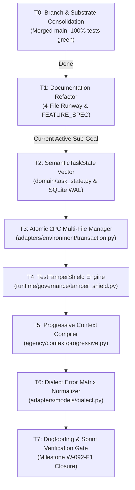

# Active Sprint Work Runway: W-092-F1 / CMX-09

```text
====================================================================================================
Authority: Execution (Dynamic Work DAG & Active Sub-Goal)
Active Ticket: CMX-09 / W-092-F1 (Canonical Coding Max Convergence)
Delta Contract: docs/execution/FEATURE_SPEC.md
Forensic Rule: Commit SHAs, raw benchmark logs, and diagnostic autopsies are quarantined out of this file.
====================================================================================================
```

## 1. Active WIP Lanes (WIP=1 Rule)

| Lane | Assigned Owner | Active Package | Target Gate | Current Lifecycle State |
|---|---|---|---|---|
| **Lane A (Implementation)** | Senior Engineering Agent | **`CMX-09`** (Canonical Harness Convergence) | `W-092-F1` | `IN_PROGRESS` |
| **Lane B (Independent Verification)** | Evaluator / Release Gate | **`REL-01R`** (Runner & Navigation Truth) | `W-092-F0` | `REVIEWING` |

---

## 2. Dynamic Execution DAG (Lane A: `CMX-09`)



### Active Sub-Goal & Task Status Matrix

- [x] **T0: Substrate Consolidation & Regression Hardening**
  - Consolidated divergent branches into `main` via PR #30.
  - Hardened sandbox address space (512MB) and patch runner (`git apply` fallback).
  - All 1,471 Python tests + 10 TypeScript workspaces passing green.

- [x] **T1: Documentation Runway Refactor & Forensic Quarantine**
  - Refactored `docs/execution/` into exactly 4 files (`milestones.md`, `backlog.md`, `FEATURE_SPEC.md`, `tasks.md`).
  - Authored SOTA delta contract in [`FEATURE_SPEC.md`](FEATURE_SPEC.md).
  - Quarantined autopsy logs, git commit digests, and historical forensics.

- [ ] **T2: Domain Semantic Task State Vector (`CMX-09.1`)**
  - **File**: `vanguard/packages/domain/task_state.py`
  - **Objective**: Implement `SemanticTaskState`, `TaskStep`, and `StepState` per [`FEATURE_SPEC.md`](FEATURE_SPEC.md) §3.
  - **Falsifier**: `test/contracts/test_semantic_task_state.py` validating monotonic revision increments, immutability, and JCS serialization.

- [ ] **T3: Two-Phase Commit Multi-File Transaction Manager (`CMX-09.2`)**
  - **File**: `vanguard/packages/adapters/environment/transaction.py`
  - **Objective**: Implement `AtomicMultiFileTransactionManager` with preflight AST syntax checking and in-memory rollback.
  - **Falsifier**: `test/runtime/test_atomic_multi_file_transaction.py` verifying full rollback when any candidate file in a 5-file set contains syntax errors.

- [ ] **T4: Cryptographic Test Tamper Shield (`CMX-09.3`)**
  - **File**: `vanguard/packages/runtime/governance/tamper_shield.py`
  - **Objective**: Implement `TestTamperShield` hashing test files at turn 0 and failing closed upon test assertion modification.
  - **Falsifier**: `test/runtime/test_tamper_shield.py` asserting immediate rejection when test assertions are altered.

- [ ] **T5: Progressive Context Compiler (`CMX-09.4`)**
  - **File**: `vanguard/packages/agency/context/progressive.py`
  - **Objective**: Implement 4-tier token budgeting (Invariant Anchor $\to$ Negative Memory $\to$ Active AST Slice $\to$ Symbol Topology Stubs).
  - **Falsifier**: `test/agency/test_progressive_context_compiler.py` confirming context budget limits and zero amnesia of settled invariants.

- [ ] **T6: Self-Healing Model Dialect Normalizer (`CMX-09.5`)**
  - **File**: `vanguard/packages/adapters/models/dialect.py`
  - **Objective**: Implement multi-pattern recovery for DeepSeek fenced JSON, Claude XML tags, and OpenAI function calling.
  - **Falsifier**: `test/contracts/test_dialect_recovery.py` parsing malformed and truncated tool call streams.

- [ ] **T7: Terminal Sprint Verification & Gate Promotion (`W-092-F1`)**
  - Run all boundary, TCB budget, and contract falsifiers.
  - Promote verified interfaces from `FEATURE_SPEC.md` into canonical `docs/architecture/`.

---

## 3. Active Blockers & Dependencies

- **Blocker B-1**: None currently blocking Lane A. All T0 prerequisites green.
- **Blocker B-2**: Lane B canary runs (`REL-02R`) blocked until `REL-01R` runner repair finishes.
- **Blocker B-3**: `TUI-01` (`aether` terminal, [`backlog.md` §2.7](backlog.md)) is not a WIP=1 lane occupant — both lanes above are full — and its milestone (`M-9`/`TC-E-047`) stays `BLOCKED` on `M-8`. Its command-registry (`clients/tui-core`) and plan-mode-enforcement (`runtime/profiles.py`/`wiring.py`/`session.py`) slices landed opportunistically as self-contained, independently falsifiable units that do not contend for either occupied lane, per `backlog.md`'s scope note that it tracks "work outside the active sprint WIP=1 constraint." The OpenTUI qualification spike (`PRD_AETHER_TUI.md` §8.1) is only partially run (RSS over budget; see `backlog.md` `TUI-01`) — the render-layer rewrite and packaging remain unauthorized and unstarted pending a full spike pass and explicit lane authorization.

---

## 4. Verification & Falsifier Execution Commands

Autonomous agents executing tasks in this sprint MUST execute the following exact commands to validate progress:

```bash
# 1. Architecture boundaries & TCB budget (threshold <= 1438 LOC)
python3 tools/linters/check_boundaries.py
python3 tools/linters/check_tcb_budget.py

# 2. Invariant linters
python3 tools/linters/check_domain_blindness.py
python3 tools/linters/check_isolation_policy.py
python3 tools/linters/check_markdown_links.py

# 3. Unit & contract test suites
python3 -m unittest discover -s test/kernel -t .
python3 -m unittest discover -s test/contracts -t .
python3 -m unittest discover -s test/agency -t .
python3 -m unittest discover -s test/runtime -t .

# 4. Frontend & client test suite
npm test
```
