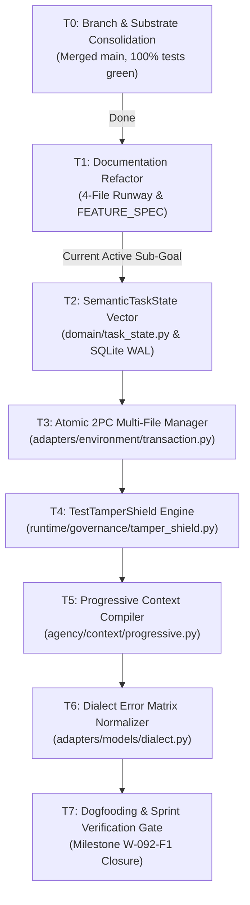

# Execution tasks (flat, by context)

Authority: execution. Delta contracts: [`spec.md`](spec.md). Handbook: [`technical.md`](technical.md). Packages: [`backlog.md`](backlog.md). TARGET gates: [`milestones.md`](milestones.md).

**No sprints. No waves.** Check boxes as work completes. **Recommended reading order (not a schedule):** **T-16** (MS-SEE, needs T-14) and **T-18** (MS-CHANGE, needs T-14+T-17) in parallel. Skip T-04/T-05/T-07. Do not create `progressive.py` (T-15).

B §18 tickets T-01–T-35 are canonical. A §31 maps into those IDs or T-36+ (see merge map appendix). v2 `SUB-*` are aliases. Live backlog `SUB-01` (kernel S0–S12) is a different package.

Historical CMX-09 sprint DAG is in the [appendix](#appendix-historical-cmx-09-dag-do-not-execute).

### Context: Instrument truth

**T-01 Enumerator membership digest** (B)  
- [x] Schema-valid task manifest required; directory names insufficient  
- [x] Reject `__pycache__`, hidden, tmp, missing oracle, duplicate IDs, digest mismatch  
- [x] Order-independent task-set digest  
- Files: `benchmarks/benchmark_20_suite/runner.py`; create `test/benchmarks/test_b20_membership.py`  
- Falsifier: `__pycache__` is not a task  

**T-02 Subject SHA on every empirical JSON** (B)  
- [x] Bind `subject_sha` = frozen candidate `git rev-parse HEAD`  
- [x] Missing SHA ⇒ receipt refused  
- Files: `benchmarks/protocols.py`, B20 writer  
- Requires: T-01  

**T-03 Dry-run empirical field ban** (B)  
- [x] `dry_run ⇒` pass/cost/oracle_passed null  
- Files: runners; cousin `test/benchmarks/test_m8_bundle.py`  

**T-24 Patch identity on results** (B)  
- [x] PASS row without patch digest refused  
- Requires: T-02  

**T-25 Missingness taxonomy** (B)  
- [x] Distinct `passed` / `failed` / `undeterminable` / `not_run`  
- [x] Provider ≠ task fail; harness ≠ model; `DATASET_INVALID` ≠ fail  
- Requires: T-01, T-02  

**T-40 Dirty-subject fail-closed** (A §31.9)  
- [x] Qualifying run on dirty tree fails closed  
- Related: T-02  

**T-41 BAAC schema-valid discovery** (A §31.7)  
- [x] Require schema-valid manifests in BAAC (if distinct from T-01, keep both)  

### Context: Admission and verification truth

**T-04 Remove default admission exemption** (B) `[PROPOSAL]` + successor baseline  
- [ ] Record RF-25 / M-2 successor baseline **before** shrinking `ADMISSION_GATE_EXEMPT`  
- [ ] Falsifier: `vg-code-default` + `finish` + no patch ⇒ not completed  
- FACT: exemption pinned by `test/falsifiers/test_completion_gate_scope.py`  
- Files: `runtime/session.py`  

**T-05 One gating source of truth** (B)  
- [ ] Delete unused `ADMISSION_GATED_HARNESSES` **or** make it the only source  
- Requires: T-04  
- Files: `session.py`; `test_completion_gate_scope.py`  

**T-06 Remove Forge `test_count = 1`** (B)
- [x] Delete `forge/engine.py` L309–311 fallback
- [x] Chimera `executed = 1` on bare exit 0 — same treatment (subtask from A G-01)
- Chimera non-zero-exit leftover closed in `63b77116`.
- Falsifier: exit 0 + empty output ⇒ not passed

**T-07 Typed verification command subject** (B)  
- [ ] Bind argv digest + workspace digest + task digest  
- [ ] `python3 -c 'print("OK")'` is not verification  
- Requires: T-04  

**T-08 Parse counts without inventing** (B)  
- [x] collected/executed/passed/failed/skipped (A §31.2–3)  
- [x] `Ran 0 tests` / `0 passed` ⇒ 0  
- [x] Unrecognized runner remains unknown  
- Session parser + pack `ParsedTestOutput.runner` landed `8637db55` (B). Chimera tail done by A (`63b77116`). Do not uncheck.
- Requires: T-07  

**T-42 Adversarial coding verification suite** (A §31.6)  
- [x] Replace retired `test/runtime/test_coding_verification.py` empty suite  
- [x] `true` / `echo 10 tests passed` cannot admit  
- [x] Unrelated suite cannot satisfy task relevance  
- [x] Stale verification after write rejected  
- [x] Foreign task/composition digest rejected  

**T-38 Fail-to-pass reproducer (bugfix class)** (v2 §5.3, A §9.4)  
- [x] Pre-verify MUST fail; post-verify MUST pass; vacuous reproducer rejected  
- [x] Not a universal finish law (docs/research/explanation excluded)  

**T-39 Mutation score ≥ 0.80** (v2 §5.4, VER-02) `[PROPOSAL]`  
- [ ] Optional treatment; not default admission  
- [ ] Do not make mutation a universal finish law  
- Alias: `VER-02`, `TLS-06`  

**T-23 Quarantine Forge/Chimera from Coding Max reports** (B)  
- [x] Product arms ⊆ `{vg-code-fast,balanced,max}`  
- Requires: T-06  

### Context: Semantic state and resume

**T-09 Domain SemanticTaskState** (B) merge with `CodingTaskState`
- [x] Land `vanguard/packages/domain/task_state.py` (stdlib + JCS) on commit `8637db55`
- [x] `CodingTaskState is SemanticTaskState`; one fold: `runtime/task_state.py` `fold_task_state`
- [x] A §6.2 extra types remain `[PROPOSAL]` in spec
- Lock `66aa7a3c`: path MISSING. Branch: present on `8637db55` — B owns. MS-RESUME `CLOSED` (closer: 16 unittest OK, 2026-09-03).  

**T-10 Runtime fold** (B)  
- [x] Fold events; unknown ignored; remove `"test" in action.lower()` inference  
- [x] Durable events: classified, hypothesis open/support/reject, obligation open/satisfied, etc. (A §10.2)  
- Requires: T-09  

**T-11 Preserve episode_id on resume** (B)  
- [x] Stop synthesizing only `episode-{run_id}`  
- Requires: T-10  

**T-12 Stop dumping resume_state into L3** (B)  
- [x] σ in L4/L5; L1–L3 prefix identity after resume+write  
- Requires: T-10  

**T-13 ContextPacket resume identity** (B)  
- [x] Populate `validate_resume_identity` fields  
- Requires: T-12  

**T-43 Task class on projection** (A §31.11)  
- [x] Explicit task class on state (if not inside T-09 schema)  

**T-44 Resume parity vectors** (A §31.16–19)  
- [x] All semantic fields; restart-after-patch; restart-after-verification; 40-turn fresh-process  
- Requires: T-11, T-12  

### Context: Context, index, epoch

**T-14 WorkspaceEpoch** (B)  
- [x] `{treeHash, indexDigest, sourceRevision, compiledAtTurn}`  
- [x] Stale packet cannot justify completion  
- Files: `ports/index.py`, `adapters/stores/repo_index.py`, session  

**T-15 Progressive L4/L5 strategy** (B)  
- [ ] Policy on existing `ContextCompiler`; **not** a second compiler (`PRG-01` alias)  
- [ ] Settled invariants / dead ends non-evictable  
- [ ] ResultDistiller at effect boundary (v2 §3.3) → if large, split T-36  
- Requires: T-12, T-14  

**T-16 Index refresh after patch.apply** (B)  
- [ ] Callers after write include new symbol or explicit omission  
- Requires: T-14  

**T-36 ResultDistiller + output caps** (v2 §3.3, §13, WRN-02)  
- [ ] Compact text + full artifact digest; ~1–2k char tool bodies  
- [ ] Goal echo at tail of L5 (v2 §15)  

**T-37 Omission ledger in packet** (A §11.5, §31.20)  
- [ ] Explicit omitted-items report; truncated ≠ complete  

**T-45 Deterministic no-index fallback** (A §31.23)  
- [ ] Evidence when IndexPort unavailable  

**T-46 Phase-aware ranking** (A §31.22) `[PROPOSAL]` keep ranking out of IndexPort (B)  

### Context: Multi-file edit, 2PC, tamper, completeness

**T-17 Atomic multi-file transaction** (B, v2 §4.2)  
- [x] Shadow tree; `ast.parse` in **adapter**; all-or-nothing  
- [x] File 4 of 5 syntax fail rolls back all  
- [x] Kernel MUST NOT gain AST  
- Files: create `adapters/environment/transaction.py`; `git.py`  
- Requires: T-08 (honest verify)  

**T-18 TestTamperShield** (B, spec §6)  
- [x] Enumerate tests via IndexPort, not only `Path.glob("test/**")`  
- [x] Assertion edit ⇒ admission reject  
- Requires: T-17, T-14  

**T-19 Greenfield oracle vacuity** (B, A §12.4, v2 §21.3)  
- [x] Tests that pass on stubs rejected  
- Requires: T-18  

**T-20 Brownfield implicated-set fail-closed** (B, A §12.2–12.3)  
- [x] Empty primary + coverage_ratio 1.0 cannot admit  
- [x] Greenfield bypass cannot apply to `bugfix`  
- [x] Public signature change ⇒ call sites in same transaction  
- Requires: T-16  

**T-47 Read-before-edit + multi-strategy apply** (v2 §14) `[PROPOSAL]`  
- [ ] Refuse patch if file/hunk not observed; exact → whitespace → indent → fuzzy → unified diff  

**T-48 Workspace fingerprint circuit breaker** (v2 §14.5) `[PROPOSAL]`  
- [ ] Cyclic `d_t = d_{t-2}` ⇒ change hypothesis  

**T-49 Speculative git checkpoint rollback** (v2 §4.4) `[PROPOSAL]`  

### Context: Dialect and model routing

**T-21 Dialect typed failure classes** (B, spec §8)  
- [x] Truncated JSON, DeepSeek fence, XML tags classified without false `ok`  
- Files: `adapters/models/dialect.py`; create `test/contracts/test_dialect_recovery.py`  

**T-22 Fail-closed model resolve** (B)  
- [ ] Alias or error; never silent unknown (`deepseek-v4-flash` vs `-0731`)  
- Files: `routing.py`  

**T-50 Routing experiments harness** (A §22.5) `[PROPOSAL]`  
- [ ] Hold task/tools/context/verify fixed; compare routes  

### Context: Single-agent qualification

**T-26 Frozen control preregistration** (B; strip “Wave 5” from title)  
- [ ] n, models, stop rule frozen before first paid call  
- Requires: T-01–T-25 as applicable  

**T-27 Single-agent canary (eval)** (B)  
- [ ] Disposition in {POSITIVE, NEGATIVE, UNDETERMINABLE, INVALID}  
- Requires: T-26  

**T-51 Internal multi-class corpus freeze** (A §31.28, B Wave 0 corpus sizes)  
- [ ] Keep A’s 10×6 class mix as `[PROPOSAL]` size; do not treat as a sprint  

**T-52 Wilson intervals + cost κ on control** (A §13.5, B §16)  

### Context: Meta, specialists, merge `[PROPOSAL]`

**T-28 Meta-controller paired study** (B)  
- [ ] Inconclusive ≠ negative; cannot enlarge budget; cannot admit completion  
- Requires: T-27  

**T-29 Treatment T-TI ablation** (B)  
- [ ] Investigator cannot `patch.apply`; McNemar includes missingness  
- Requires: T-27  

**T-30 Isolated patch EXTERIOR_SELECT** (B)  
- [ ] Selector is test verdict; LLM preference ignored  
- Requires: T-27, T-17  

**T-53 Role catalog** (A §15.2 localizer/reviewer/test_investigator) — subtasks under T-29 if not split  

### Context: Campaign and HYDRA `[PROPOSAL]`

**T-31 Campaign director fixture** (B)  
- [ ] Crash after node 3; resume 4–8; no duplicate writes  
- [ ] Director has zero mutating tools (v2 §7.1)  
- Files: create `runtime/campaign/` **not** a second EpisodeEngine  
- Requires: T-27  

**T-54 CAS mailbox + CoordinationPlan** (v2 OCT-01/02, A §6.7) — may be subtasks of T-31  

**T-55 HYDRA bifurcation + living horizon** (v2 §7.3–7.4) `[PROPOSAL]`  
- [ ] Product implementer remains EpisodeEngine+pack, not ChimeraEngine  

**T-34 WorkflowScheduler lease honesty** (B)  
- [ ] Parallel path uses kernel leases or is disabled in product profiles  

### Context: Memory and skills `[PROPOSAL]` product wiring

**T-32 Memory grant on product path** (B)  
- [ ] Retrieve without grant denied; generator ≠ evaluator ≠ promoter  
- Requires: T-27; ADR-0100  
- Present docs: `memory-learning.md`  

**T-56 Skill catalog progressive disclosure** (v2 §18, A §17.4–17.5)  
- [ ] Names in L2/L3; body on invoke; exterior promote; rollback  

**T-57 Counterfactual replay** (A §17.6)  

### Context: Official benches `[PROPOSAL]` / blocked on control

**T-33 Official DeepSWE wrapper** (B)  
- [ ] Dry-run produces no pass%; committed-patch-only grading  
- Requires: T-27; REL-03  
- G-3: local suites never official  

**T-58 SWE-P5 official procedure adapter** (A §18, milestones SWE-P*)  

### Context: CLI / operator

**T-59 Facade stays thin** (A §2.3, v2 §12)  
- [ ] CLI does not assemble prompts, patch, or grade  
- MECHANISM: `run/status/resume/evidence/cost`  
- `[PROPOSAL]`: `cancel`, `doctor`, `checkpoint`, `--non-interactive`, NDJSON  

**T-60 TUI-ready backend events** (A §23.4) `[PROPOSAL]` — events only; no TUI visual design (A non-goal)  

### Context: Packs, prompts, policies

**T-61 Task-class policy fragments** (A §21.2) versioned, ablatable  

**T-62 Pack keyword classifier repair** (B §3.4 `classify_task`)  

**T-63 Greenfield vs completeness silent bypass removal** (B §3.4, T-20)  

### Context: Lattice hygiene

**T-35 TCB and boundary freeze** (B)  
- [ ] `check_tcb_budget.py`, `check_boundaries.py`, domain-blindness PASS on every impl  
- Requires: each impl task  

**T-64 Kernel AST prohibition regression test** (v2 I-7 vs §4.3)  
- [ ] No `ast.parse` in `vanguard/packages/kernel/`  

### Context: Research / explanation agents

**T-65 Explanation completion policy** (A §26.3, §9.4)  
- [ ] Evidence-linked claims; no mutation unless requested  

**T-66 Research completion policy** (A §26.2, §9.4)  
- [ ] Provenance; no fabricated citations  

### Context: Present-docs promotion (after merges)

**T-67 Promote landed contracts**  
- [ ] Move true schemas from `execution/spec.md` into `docs/architecture/` / `docs/backend/` / `docs/SPEC.md`  
- [ ] Run `docs_rag_v0.py --file` on every changed production path  
- [ ] `just docs-knowledge` — never hand-edit `.generated/`  

**T-68 Link repair** (PHASE-0 §8) — can start immediately; does not wait for T-01
- [x] Living `docs/execution/` / README / AGENTS: `active.md` → `tasks.md`; `FEATURE_SPEC.md` eliminated, `spec.md` is canonical delta contract
- [x] Restore `docs/SPEC.md` (deleted in `614b7800`; compact TARGET contract)
- [ ] Remaining historical mentions in handbook appendices / research reports — do not rewrite research  

## Appendix: B §18 ticket bodies (verbatim)

Canonical files/requires/falsifiers from Plan B. Expanded checkboxes above must not drop these lines.

## 18. Initial engineering tickets

Dependency key: `requires:`. Status: all `PROPOSED` unless noted.

### Ticket 01 — Enumerator membership digest
- **Files:** `benchmarks/benchmark_20_suite/runner.py`; `test/benchmarks/test_b20_membership.py` (create)
- **Requires:** none
- **Falsifier:** `__pycache__` directory is not a task; digest matches frozen list of 20 names
- **Done when:** B1-style INVALID cannot recur without stop

### Ticket 02 — Subject SHA on every empirical JSON
- **Files:** benchmark writers; `benchmarks/protocols.py`
- **Requires:** 01
- **Falsifier:** missing `subject_sha` ⇒ receipt refused (`test_sota_protocols` already has binding — extend to B20 writer)

### Ticket 03 — Dry-run empirical field ban
- **Files:** runners; `test/benchmarks/test_m8_bundle.py` already has a cousin
- **Requires:** none
- **Falsifier:** dry-run JSON has null pass/cost

### Ticket 04 — Remove default admission exemption
- **Files:** `runtime/session.py` `ADMISSION_GATE_EXEMPT`
- **Requires:** none
- **Falsifier:** `vg-code-default` + `finish` + no patch ⇒ not completed
- **Rollback:** if a named compatibility harness must stay exempt, shrink set with a recorded governance note — do not restore lex+default silently
- **FACT (lock HEAD `66aa7a3c`).** The exemption is pinned, not accidental. [`test/falsifiers/test_completion_gate_scope.py`](../../test/falsifiers/test_completion_gate_scope.py) asserts `vg-code-default` ∉ `ADMISSION_GATED_HARNESSES` and documents that frozen M-2 falsifiers compose bare finishes through the default harness. Live `admission_required` (`runtime/session.py` L127–138) exempts `vg-code-default` / `vg-code-lex` via `ADMISSION_GATE_EXEMPT`; RF-25 cold-continuation evidence is on that product path. **Implementation of this ticket remains `[PROPOSAL]`** and requires a **successor baseline** for RF-25 / M-2 / `test_completion_gate_scope.py` before the exemption is removed — do not silently retarget those tests.

### Ticket 05 — Delete unused `ADMISSION_GATED_HARNESSES` or make it the only source
- **Files:** `session.py`; `test/falsifiers/test_completion_gate_scope.py`
- **Requires:** 04
- **Falsifier:** one function decides gating; name set cannot drift

### Ticket 06 — Remove Forge `test_count = 1`
- **Files:** `agency/forge/engine.py` L309–311; `test/agency/test_forge.py`
- **Requires:** none (can parallel 04)
- **Falsifier:** exit 0 + empty output ⇒ not passed

### Ticket 07 — Typed verification command subject
- **Files:** `session.py` `_observe_completion_dispatch`; admission_gate
- **Requires:** 04
- **Falsifier:** `python3 -c 'print("OK")'` is not a verification subject

### Ticket 08 — Parse pytest `N passed` without inventing counts
- **Files:** `_observed_test_count`; pack `test_output_parser.py` if present
- **Requires:** 07
- **Falsifier:** unittest `Ran 0 tests` ⇒ count 0; pytest `0 passed` ⇒ 0

### Ticket 09 — Domain SemanticTaskState
- **Files:** create `domain/task_state.py` (**MISSING** in HEAD); FEATURE_SPEC §3
- **Requires:** none technically; **schedule after** 04 so we do not persist false completes
- **Falsifier:** `test/contracts/test_semantic_task_state.py` as specified
- **FACT.** Schema is [`domain/task_state.py`](../../vanguard/packages/domain/task_state.py) (`SemanticTaskState`; `CodingTaskState` alias). Live fold remains [`runtime/task_state.py`](../../vanguard/packages/runtime/task_state.py) `fold_task_state`. A's 17 extra domain types stay `[PROPOSAL]`.

### Ticket 10 — Runtime fold of SemanticTaskState
- **Files:** `runtime/task_state.py`
- **Requires:** 09
- **Falsifier:** fold monotonic revision; unknown events ignored; `"test" in action.lower()` removed or replaced

### Ticket 11 — Preserve episode_id on resume
- **Files:** `app_service.py` L385–389
- **Requires:** 10
- **Falsifier:** resumed events use original episode_id

### Ticket 12 — Stop dumping resume_state into L3
- **Files:** `session.py` L619–622; compiler
- **Requires:** 10
- **Falsifier:** L3 prefix identity; L4 contains σ digest

### Ticket 13 — Populate ContextPacket resume identity
- **Files:** `packet.py`; session orientation block
- **Requires:** 12
- **Falsifier:** `validate_resume_identity` fails on policy mismatch

### Ticket 14 — WorkspaceEpoch
- **Files:** ports/index.py (additive fields); repo_index adapter; session
- **Requires:** 13
- **Falsifier:** write ⇒ epoch change ⇒ packet invalid until refresh

### Ticket 15 — Progressive L4/L5 strategy
- **Files:** create `agency/context/progressive.py` **or** `compaction.py` strategy; `compiler.py`
- **Requires:** 12, 14
- **Falsifier:** settled invariants never truncated; FEATURE_SPEC budget caps

### Ticket 16 — Index refresh after patch.apply
- **Files:** session observe path; pack IndexToolkit
- **Requires:** 14
- **Falsifier:** callers after write include new symbol or explicit omission

### Ticket 17 — Atomic multi-file transaction manager
- **Files:** create `adapters/environment/transaction.py`; `git.py`
- **Requires:** 08 (verification still honest)
- **Falsifier:** 5-file syntax fail rolls back all

### Ticket 18 — TestTamperShield with IndexPort enumeration
- **Files:** create `runtime/governance/tamper_shield.py`
- **Requires:** 17 for greenfield freeze timing; 14 for file list
- **Falsifier:** assertion edit ⇒ admission reject; `Path.glob("test/**")` is insufficient — use enumerated tests

### Ticket 19 — Greenfield oracle vacuity
- **Files:** pack greenfield policy
- **Requires:** 18
- **Falsifier:** tests that pass on stubs rejected

### Ticket 20 — Brownfield implicated-set fail-closed
- **Files:** `multi_file_completeness.py`; change_surface.py
- **Requires:** 16
- **Falsifier:** empty primary + coverage_ratio 1.0 cannot admit; greenfield bypass cannot apply to `bugfix` brief

### Ticket 21 — Dialect typed failure classes
- **Files:** `dialect.py`; create `test/contracts/test_dialect_recovery.py`
- **Requires:** none (parallel)
- **Falsifier:** truncated JSON, DeepSeek fence, XML tool tags classified without false `ok`

### Ticket 22 — Fail-closed model resolve
- **Files:** `routing.py` L42–44; harness.yaml aliases
- **Requires:** 21 optional
- **Falsifier:** `deepseek-v4-flash` without `-0731` either aliases or errors, never silent unknown

### Ticket 23 — Quarantine Forge/Chimera from Coding Max reports
- **Files:** benchmark arm lists; `runtime/root.py` exports remain but labeled experimental
- **Requires:** 06
- **Falsifier:** Wave 5 preregistration arms ⊆ `{vg-code-fast,balanced,max}`

### Ticket 24 — Patch identity on results
- **Files:** B20 result schema; session evidence
- **Requires:** 02
- **Falsifier:** PASS row without patch digest refused

### Ticket 25 — Missingness taxonomy in runners
- **Files:** BAAC + B20 diagnosis mapping
- **Requires:** 01, 02
- **Falsifier:** traceback-only row is `harness_error` not `FAIL`

### Ticket 26 — Frozen Wave 5 preregistration
- **Files:** new prereg JSON bound to candidate SHA after S4
- **Requires:** 01–25 as applicable
- **Falsifier:** n, models, λ, stop rule frozen before first paid call

### Ticket 27 — Single-agent canary execution (eval lane)
- **Files:** none in product if wrappers exist
- **Requires:** 26
- **Falsifier:** spend ledger disposition in {POSITIVE, NEGATIVE, UNDETERMINABLE, INVALID}; never silent

### Ticket 28 — Meta-controller paired study harness
- **Files:** `paired_evaluation.py`; meta_controller
- **Requires:** 27 control receipt
- **Falsifier:** inconclusive ≠ negative; budget cannot grow

### Ticket 29 — Treatment T-TI ablation
- **Files:** manifests; topology
- **Requires:** 27
- **Falsifier:** reviewer/investigator cannot call patch.apply; McNemar table includes missingness

### Ticket 30 — Isolated patch EXTERIOR_SELECT
- **Files:** child_runtime; git worktrees
- **Requires:** 27, 17
- **Falsifier:** selector is test verdict; LLM preference ignored

### Ticket 31 — Campaign director fixture
- **Files:** create `runtime/campaign/` (Wave 8)
- **Requires:** 27
- **Falsifier:** crash after node 3; resume nodes 4–8 without duplicate writes

### Ticket 32 — Memory grant on product path
- **Files:** `runtime/memory.py` wiring
- **Requires:** 27; ADR-0100
- **Falsifier:** retrieve without grant denied; MEM-02 still independent

### Ticket 33 — Official DeepSWE wrapper (no score fishing)
- **Files:** `benchmarks/` Harbor/Pier adapter
- **Requires:** 27; REL-03
- **Falsifier:** wrapper dry-run produces no pass%; committed-patch-only grading

### Ticket 34 — WorkflowScheduler lease honesty
- **Files:** `workflow_scheduler.py` L225–242
- **Requires:** none (lattice hygiene)
- **Falsifier:** parallel path either uses kernel leases or is disabled in product profiles

### Ticket 35 — TCB and boundary freeze
- **Files:** none expected
- **Requires:** each impl ticket
- **Falsifier:** `check_tcb_budget.py` still PASS; `check_boundaries.py`; domain-blindness PASS

Tickets 01–08 are the true critical path for long-horizon **truth**. Tickets 09–20 are the critical path for long-horizon **competence**. 21–25 are hygiene. 26–27 are the first honest score. 28–35 are gated. Waves 6–10 and tickets 28–35 are **`[PROPOSAL]`**; this lock does not authorize them.

## Appendix: A §31 → T-id merge map

## 5.2 Merge map: A §31 → T-ids (no dropped tickets)

| A §31 # | Maps to |
|---|---|
| 1 inferred test counts | T-06, T-08 |
| 2 runner identity | T-07 |
| 3 collected/executed/… | T-08 |
| 4 bind epoch | T-14 |
| 5 bind selected test IDs | T-07 subtask |
| 6 retired suite | T-42 |
| 7 BAAC manifests | T-41 |
| 8 task-set digest | T-01 |
| 9 dirty subject | T-40 |
| 10 failure classes | T-25 |
| 11 task class | T-43 |
| 12 hypothesis events | T-10 |
| 13 obligation events | T-10 |
| 14 repository epoch | T-14 |
| 15 context selection identity | T-13 |
| 16–19 resume falsifiers | T-44 |
| 20 omission report | T-37 |
| 21 post-write index | T-16 |
| 22 phase-aware ranking | T-46 |
| 23 no-index fallback | T-45 |
| 24 change-surface callers | T-20 |
| 25 task-to-test association | T-07 / T-20 |
| 26 greenfield DAG | T-19 |
| 27 test-tamper | T-18 |
| 28 60-task corpus | T-51 |
| 29 single-agent CI | T-52 |
| 30 first positive treatment | T-29 |

## Appendix: historical CMX-09 DAG (do not execute)

Pre-PHASE-0 T2–T7 map to T-09, T-17, T-18, T-15, T-21.

### Historical CMX-09 DAG

### Historical T0–T7 checklist (do not execute)

- [x] **T0: Substrate Consolidation & Regression Hardening**
  - Consolidated divergent branches into `main` via PR #30.
  - Hardened sandbox address space (512MB) and patch runner (`git apply` fallback).
  - All 1,471 Python tests + 10 TypeScript workspaces passing green.

- [x] **T1: Documentation Runway Refactor & Forensic Quarantine**
  - Refactored `docs/execution/` into the operational runway (`milestones.md`, `backlog.md`, `spec.md`, `tasks.md`).
  - Authored SOTA delta contract in [`spec.md`](spec.md).
  - Quarantined autopsy logs, git commit digests, and historical forensics.

- [ ] **T2: Domain Semantic Task State Vector (`CMX-09.1`)**
  - **File**: `vanguard/packages/domain/task_state.py`
  - **Objective**: Implement `SemanticTaskState`, `TaskStep`, and `StepState` per [`spec.md`](spec.md) §3.
  - **Falsifier**: `test/contracts/test_semantic_task_state.py` validating monotonic revision increments, immutability, and JCS serialization.

- [ ] **T3: Two-Phase Commit Multi-File Transaction Manager (`CMX-09.2`)**
  - **File**: `vanguard/packages/adapters/environment/transaction.py`
  - **Objective**: Implement `AtomicMultiFileTransactionManager` with preflight AST syntax checking and in-memory rollback.
  - **Falsifier**: `test/runtime/test_atomic_multi_file_transaction.py` verifying full rollback when any candidate file in a 5-file set contains syntax errors.

- [ ] **T4: Cryptographic Test Tamper Shield (`CMX-09.3`)**
  - **File**: `vanguard/packages/runtime/governance/tamper_shield.py`
  - **Objective**: Implement `TestTamperShield` hashing test files at turn 0 and failing closed upon test assertion modification.
  - **Falsifier**: `test/runtime/test_tamper_shield.py` asserting immediate rejection when test assertions are altered.

- [ ] **T5: Progressive Context Compiler (`CMX-09.4`)**
  - **File**: `vanguard/packages/agency/context/progressive.py`
  - **Objective**: Implement 4-tier token budgeting (Invariant Anchor $\to$ Negative Memory $\to$ Active AST Slice $\to$ Symbol Topology Stubs).
  - **Falsifier**: `test/agency/test_progressive_context_compiler.py` confirming context budget limits and zero amnesia of settled invariants.

- [ ] **T6: Self-Healing Model Dialect Normalizer (`CMX-09.5`)**
  - **File**: `vanguard/packages/adapters/models/dialect.py`
  - **Objective**: Implement multi-pattern recovery for DeepSeek fenced JSON, Claude XML tags, and OpenAI function calling.
  - **Falsifier**: `test/contracts/test_dialect_recovery.py` parsing malformed and truncated tool call streams.

- [ ] **T7: Terminal Sprint Verification & Gate Promotion (`W-092-F1`)**
  - Run all boundary, TCB budget, and contract falsifiers.
  - Promote verified interfaces from `spec.md` into canonical `docs/architecture/`.

