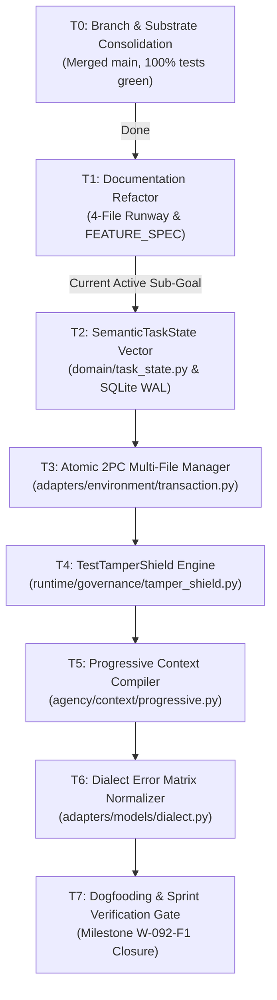

# Execution tasks (flat, by context)

Authority: execution. Delta contracts: [`spec.md`](spec.md). Handbook: [`technical.md`](technical.md). Packages: [`backlog.md`](backlog.md). TARGET gates: [`milestones.md`](milestones.md).

**No sprints. No waves.** Check boxes as work completes. **Recommended reading order (not a schedule):** MS-SEE A stack T-16/T-15/T-36/T-37/T-45 is MECHANISM this-branch. Skip T-04/T-05/T-07. Do not create `progressive.py` (T-15). T-46 ranking stays `[PROPOSAL]`.

B §18 tickets T-01–T-35 are canonical. A §31 maps into those IDs or T-36+ (see merge map appendix). v2 `SUB-*` are aliases. Live backlog `SUB-01` (kernel S0–S12) is a different package.

Historical CMX-09 sprint DAG is in the [appendix](#appendix-historical-cmx-09-dag-do-not-execute).

### Context: Instrument truth

**T-01 Enumerator membership digest** (B)  
- [x] Schema-valid task manifest required; directory names insufficient  
- [x] Reject `__pycache__`, hidden, tmp, missing oracle, duplicate IDs, digest mismatch  
- [x] Order-independent task-set digest  
- Files: `benchmarks/benchmark_20_suite/runner.py`; create `test/benchmarks/test_b20_membership.py`  
- Falsifier: `__pycache__` is not a task  

**T-02 Subject SHA on every empirical JSON** (B)  
- [x] Bind `subject_sha` = frozen candidate `git rev-parse HEAD`  
- [x] Missing SHA ⇒ receipt refused  
- Files: `benchmarks/protocols.py`, B20 writer  
- Requires: T-01  

**T-03 Dry-run empirical field ban** (B)  
- [x] `dry_run ⇒` pass/cost/oracle_passed null  
- Files: runners; cousin `test/benchmarks/test_m8_bundle.py`  

**T-24 Patch identity on results** (B)  
- [x] PASS row without patch digest refused  
- Requires: T-02  

**T-25 Missingness taxonomy** (B)  
- [x] Distinct `passed` / `failed` / `undeterminable` / `not_run`  
- [x] Provider ≠ task fail; harness ≠ model; `DATASET_INVALID` ≠ fail  
- Requires: T-01, T-02  

**T-40 Dirty-subject fail-closed** (A §31.9)  
- [x] Qualifying run on dirty tree fails closed  
- Related: T-02  

**T-41 BAAC schema-valid discovery** (A §31.7)  
- [x] Require schema-valid manifests in BAAC (if distinct from T-01, keep both)  

### Context: Admission and verification truth

**T-04 Remove default admission exemption** (B) `[PROPOSAL]` + successor baseline  
- [ ] Record RF-25 / M-2 successor baseline **before** shrinking `ADMISSION_GATE_EXEMPT`  
- [ ] Falsifier: `vg-code-default` + `finish` + no patch ⇒ not completed  
- FACT: exemption pinned by `test/falsifiers/test_completion_gate_scope.py`  
- Files: `runtime/session.py`  

**T-05 One gating source of truth** (B)  
- [ ] Delete unused `ADMISSION_GATED_HARNESSES` **or** make it the only source  
- Requires: T-04  
- Files: `session.py`; `test_completion_gate_scope.py`  

**T-06 Remove Forge `test_count = 1`** (B)
- [x] Delete `forge/engine.py` L309–311 fallback
- [x] Chimera `executed = 1` on bare exit 0 — same treatment (subtask from A G-01)
- Chimera non-zero-exit leftover closed in `63b77116`.
- Falsifier: exit 0 + empty output ⇒ not passed

**T-07 Typed verification command subject** (B)  
- [ ] Bind argv digest + workspace digest + task digest  
- [ ] `python3 -c 'print("OK")'` is not verification  
- Requires: T-04  

**T-08 Parse counts without inventing** (B)  
- [x] collected/executed/passed/failed/skipped (A §31.2–3)  
- [x] `Ran 0 tests` / `0 passed` ⇒ 0  
- [x] Unrecognized runner remains unknown  
- Session parser + pack `ParsedTestOutput.runner` landed `8637db55` (B). Chimera tail done by A (`63b77116`). Do not uncheck.
- Requires: T-07  

**T-42 Adversarial coding verification suite** (A §31.6)  
- [x] Replace retired `test/runtime/test_coding_verification.py` empty suite  
- [x] `true` / `echo 10 tests passed` cannot admit  
- [x] Unrelated suite cannot satisfy task relevance  
- [x] Stale verification after write rejected  
- [x] Foreign task/composition digest rejected  

**T-38 Fail-to-pass reproducer (bugfix class)** (v2 §5.3, A §9.4)  
- [x] Pre-verify MUST fail; post-verify MUST pass; vacuous reproducer rejected  
- [x] Not a universal finish law (docs/research/explanation excluded)  

**T-39 Mutation score ≥ 0.80** (v2 §5.4, VER-02) `[PROPOSAL]`  
- [ ] Optional treatment; not default admission  
- [ ] Do not make mutation a universal finish law  
- Alias: `VER-02`, `TLS-06`  

**T-23 Quarantine Forge/Chimera from Coding Max reports** (B)  
- [x] Product arms ⊆ `{vg-code-fast,balanced,max}`  
- Requires: T-06  

### Context: Semantic state and resume

**T-09 Domain SemanticTaskState** (B) merge with `CodingTaskState`
- [x] Land `vanguard/packages/domain/task_state.py` (stdlib + JCS) on commit `8637db55`
- [x] `CodingTaskState is SemanticTaskState`; one fold: `runtime/task_state.py` `fold_task_state`
- [x] A §6.2 extra types remain `[PROPOSAL]` in spec
- Lock `66aa7a3c`: path MISSING. Branch: present on `8637db55` — B owns. MS-RESUME `CLOSED` (closer: 16 unittest OK, 2026-09-03).  

**T-10 Runtime fold** (B)  
- [x] Fold events; unknown ignored; remove `"test" in action.lower()` inference  
- [x] Durable events: classified, hypothesis open/support/reject, obligation open/satisfied, etc. (A §10.2)  
- Requires: T-09  

**T-11 Preserve episode_id on resume** (B)  
- [x] Stop synthesizing only `episode-{run_id}`  
- Requires: T-10  

**T-12 Stop dumping resume_state into L3** (B)  
- [x] σ in L4/L5; L1–L3 prefix identity after resume+write  
- Requires: T-10  

**T-13 ContextPacket resume identity** (B)  
- [x] Populate `validate_resume_identity` fields  
- Requires: T-12  

**T-43 Task class on projection** (A §31.11)  
- [x] Explicit task class on state (if not inside T-09 schema)  

**T-44 Resume parity vectors** (A §31.16–19)  
- [x] All semantic fields; restart-after-patch; restart-after-verification; 40-turn fresh-process  
- Requires: T-11, T-12  

### Context: Context, index, epoch

**T-14 WorkspaceEpoch** (B)  
- [x] `{treeHash, indexDigest, sourceRevision, compiledAtTurn}`  
- [x] Stale packet cannot justify completion  
- Files: `ports/index.py`, `adapters/stores/repo_index.py`, session  

**T-15 Progressive L4/L5 strategy** (B)  
- [x] Policy on existing `ContextCompiler`; **not** a second compiler (`PRG-01` alias)  
- [x] Settled invariants / dead ends non-evictable  
- [x] ResultDistiller at effect boundary (v2 §3.3) → split T-36  
- Requires: T-12, T-14  

**T-16 Index refresh after patch.apply** (B)  
- [x] Callers after write include new symbol or explicit omission  
- Requires: T-14  

**T-36 ResultDistiller + output caps** (v2 §3.3, §13, WRN-02)  
- [x] Compact text + full artifact digest; ~1–2k char tool bodies  
- [x] Goal echo at tail of L5 (v2 §15)  

**T-37 Omission ledger in packet** (A §11.5, §31.20)  
- [x] Explicit omitted-items report; truncated ≠ complete  

**T-45 Deterministic no-index fallback** (A §31.23)  
- [x] Evidence when IndexPort unavailable  

**T-46 Optional query-local ranking in pack policy** (A §31.22) `[PROPOSAL]`
- [ ] A/B-able request-local ranking stays in pack policy; it never enters `IndexPort`, an index adapter, or L1–L3

### Context: Multi-file edit, 2PC, tamper, completeness

**T-17 Atomic multi-file transaction** (B, v2 §4.2)  
- [x] Shadow tree; `ast.parse` in **adapter**; all-or-nothing  
- [x] File 4 of 5 syntax fail rolls back all  
- [x] Kernel MUST NOT gain AST  
- Files: create `adapters/environment/transaction.py`; `git.py`  
- Requires: T-08 (honest verify)  

**T-18 TestTamperShield** `REOPENED` (B, spec §6)  
- [x] Enumerate tests via IndexPort, not only `Path.glob("test/**")`  
- [x] Assertion edit ⇒ admission reject  
- [ ] Wire `runtime/governance/tamper_shield.py` into `session._admit_completion`  
- Reopened 2026-09-04: mechanism present, **zero production callers** — imported only by `test/runtime/test_tamper_shield.py`. The earlier receipt stands for its own subject; it does not carry forward to a shield nothing calls.  
- Requires: T-17, T-14  

**T-19 Greenfield oracle vacuity** (B, A §12.4, v2 §21.3)  
- [x] Tests that pass on stubs rejected  
- Requires: T-18  

**T-20 Brownfield implicated-set fail-closed** (B, A §12.2–12.3)  
- [x] Empty primary + coverage_ratio 1.0 cannot admit  
- [x] Greenfield bypass cannot apply to `bugfix`  
- [x] Public signature change ⇒ call sites in same transaction  
- Requires: T-16  

**T-47 Read-before-edit + multi-strategy apply** (v2 §14) `[PROPOSAL]`  
- [ ] Refuse patch if file/hunk not observed; exact → whitespace → indent → fuzzy → unified diff  

**T-48 Workspace fingerprint circuit breaker** (v2 §14.5) `[PROPOSAL]`  
- [ ] Cyclic `d_t = d_{t-2}` ⇒ change hypothesis  

**T-49 Speculative git checkpoint rollback** (v2 §4.4) `[PROPOSAL]`  

### Context: Dialect and model routing

**T-21 Dialect typed failure classes** (B, spec §8)  
- [x] Truncated JSON, DeepSeek fence, XML tags classified without false `ok`  
- Files: `adapters/models/dialect.py`; create `test/contracts/test_dialect_recovery.py`  

**T-22 Fail-closed model resolve** (B)  
- [x] Alias or error; never silent unknown (`deepseek-v4-flash` vs `-0731`)  
- Files: `routing.py`  

**T-50 Routing experiments harness** (A §22.5) `[PROPOSAL]`  
- [ ] Hold task/tools/context/verify fixed; compare routes  

### Context: Single-agent qualification

**T-26 Frozen control preregistration** (B; strip “Wave 5” from title)  
- [ ] n, models, stop rule frozen before first paid call  
- Requires: T-01–T-25 as applicable  

**T-27 Single-agent canary (eval)** (B)  
- [ ] Disposition in {POSITIVE, NEGATIVE, UNDETERMINABLE, INVALID}  
- Requires: T-26  

**T-51 Internal multi-class corpus freeze** (A §31.28, B Wave 0 corpus sizes)  
- [ ] Keep A’s 10×6 class mix as `[PROPOSAL]` size; do not treat as a sprint  

**T-52 Wilson intervals + cost κ on control** (A §13.5, B §16)  

### Context: Meta, specialists, merge `[PROPOSAL]`

**T-28 Meta-controller paired study** (B)  
- [ ] Inconclusive ≠ negative; cannot enlarge budget; cannot admit completion  
- Requires: T-27  

**T-29 Treatment T-TI ablation** (B)  
- [ ] Investigator cannot `patch.apply`; McNemar includes missingness  
- Requires: T-27  

**T-30 Isolated patch EXTERIOR_SELECT** (B)  
- [ ] Selector is test verdict; LLM preference ignored  
- Requires: T-27, T-17  

**T-53 Role catalog** (A §15.2 localizer/reviewer/test_investigator) — subtasks under T-29 if not split  

### Context: Campaign and HYDRA `[PROPOSAL]`

**T-31 Campaign director fixture** (B)  
- [ ] Crash after node 3; resume 4–8; no duplicate writes  
- [ ] Director has zero mutating tools (v2 §7.1)  
- Files: create `runtime/campaign/` **not** a second EpisodeEngine  
- Requires: T-27  

**T-54 CAS mailbox + CoordinationPlan** (v2 OCT-01/02, A §6.7) — may be subtasks of T-31  

**T-55 HYDRA bifurcation + living horizon** (v2 §7.3–7.4) `[PROPOSAL]`  
- [ ] Product implementer remains EpisodeEngine+pack, not ChimeraEngine  

**T-34 WorkflowScheduler lease honesty** (B)  
- [ ] Parallel path uses kernel leases or is disabled in product profiles  

### Context: Memory and skills `[PROPOSAL]` product wiring

**T-32 Memory grant on product path** (B)  
- [ ] Retrieve without grant denied; generator ≠ evaluator ≠ promoter  
- Requires: T-27; ADR-0100  
- Present docs: `memory-learning.md`  

**T-56 Skill catalog progressive disclosure** (v2 §18, A §17.4–17.5)  
- [ ] Names in L2/L3; body on invoke; exterior promote; rollback  

**T-57 Counterfactual replay** (A §17.6)  

### Context: Official benches `[PROPOSAL]` / blocked on control

**T-33 Official DeepSWE wrapper** (B)  
- [ ] Dry-run produces no pass%; committed-patch-only grading  
- Requires: T-27; REL-03  
- G-3: local suites never official  

**T-58 SWE-P5 official procedure adapter** (A §18, milestones SWE-P*)  

### Context: CLI / operator

**T-59 Facade stays thin** (A §2.3, v2 §12)  
- [ ] CLI does not assemble prompts, patch, or grade  
- MECHANISM: `run/status/resume/evidence/cost`  
- `[PROPOSAL]`: `cancel`, `doctor`, `checkpoint`, `--non-interactive`, NDJSON  

**T-60 TUI-ready backend events** (A §23.4) `[PROPOSAL]` — events only; no TUI visual design (A non-goal)  

### Context: Packs, prompts, policies

**T-61 Task-class policy fragments** (A §21.2) versioned, ablatable  

**T-62 Pack keyword classifier repair** (B §3.4 `classify_task`)  

**T-63 Greenfield vs completeness silent bypass removal** (B §3.4, T-20)  

### Context: Lattice hygiene

**T-35 TCB and boundary freeze** (B)  
- [ ] `check_tcb_budget.py`, `check_boundaries.py`, domain-blindness PASS on every impl  
- Requires: each impl task  

**T-64 Kernel AST prohibition regression test** (v2 I-7 vs §4.3)  
- [ ] No `ast.parse` in `vanguard/packages/kernel/`  

### Context: Research / explanation agents

**T-65 Explanation completion policy** (A §26.3, §9.4)  
- [ ] Evidence-linked claims; no mutation unless requested  

**T-66 Research completion policy** (A §26.2, §9.4)  
- [ ] Provenance; no fabricated citations  

### Context: Present-docs promotion (after merges)

**T-67 Promote landed contracts**  
- [ ] Move true schemas from `execution/spec.md` into `docs/architecture/` / `docs/backend/` / `docs/SPEC.md`  
- [ ] Run `docs_rag_v0.py --file` on every changed production path  
- [ ] `just docs-knowledge` — never hand-edit `.generated/`  

**T-68 Link repair** (PHASE-0 §8) — can start immediately; does not wait for T-01
- [x] Living `docs/execution/` / README / AGENTS: `active.md` → `tasks.md`; `FEATURE_SPEC.md` eliminated, `spec.md` is canonical delta contract
- [x] Restore `docs/SPEC.md` (deleted in `614b7800`; compact TARGET contract)
- [ ] Remaining historical mentions in handbook appendices / research reports — do not rewrite research  

### Context: Electroweak convergence work tree

- [ ] **T-69: Capability-bound native tool-call profiles**
  - **package**: HAR-01
  - **subsystem**: domain
  - **lane**: Lane A (Build/Core)
  - **requires**: []
  - **file_touches**: [`vanguard/packages/domain/models/profile.py`, `vanguard/packages/adapters/models/`, **[NEW]** `test/contracts/test_model_profiles.py`]
  - **specification**: Declare `ToolCallStyle.NATIVE` only for routes whose native-tool support is verified by capability evidence; this is not a blanket promotion of every production model. Unknown or unverified routes preserve the `NATIVE → JSON_SCHEMA → FENCED_JSON → TEXT_GRAMMAR` degradation chain.
  - **acceptance_falsifier**: `python3 -m unittest test.contracts.test_model_profiles -v` proves each native-declared route resolves `ToolCallStyle.NATIVE` and accepts its provider-shape vector; no unknown or unverified id is silently promoted, and each one still degrades `NATIVE → JSON_SCHEMA → FENCED_JSON → TEXT_GRAMMAR` via `degraded()`.

- [ ] **T-70: Approval threshold from declared `approval_policy`**
  - **package**: HAR-01
  - **subsystem**: runtime
  - **lane**: Lane A (Build/Core)
  - **requires**: [T-69]
  - **file_touches**: [`vanguard/packages/runtime/session.py`, **[NEW]** `test/runtime/test_approval_passthrough.py`]
  - **specification**: Resolve the benchmark approval threshold from the manifest's declared `components.approval_policy`. With `threshold: standard`, medium `patch.apply` and high `proc.exec` dispatch without a fail-closed ask denial.
  - **acceptance_falsifier**: `python3 -m unittest test.runtime.test_approval_passthrough -v` passes and the literal approval threshold `"low"` is absent from `runtime/session.py`.

- [ ] **T-70a: Reproduce mid-stream SSE abort before flag change**
  - **package**: HAR-01
  - **subsystem**: adapters
  - **lane**: Lane B (Audit/Test)
  - **requires**: []
  - **file_touches**: [`vanguard/packages/adapters/models/openrouter.py`, **[NEW]** `test/adapters/test_openrouter_stream_abort.py`]
  - **specification**: Capture a red reproducer in which a truncated SSE chunk arrives after at least one delta before changing any transport flag. Close as `no_defect` if the current path cannot reproduce the failure.
  - **acceptance_falsifier**: `python3 -m unittest test.adapters.test_openrouter_stream_abort -v` first demonstrates the reproducing failure, then guards the selected resolution.

- [ ] **T-71: Declare `finish-tool.json` in the product presets**
  - **package**: HAR-01
  - **subsystem**: agency
  - **lane**: Lane A (Build/Core)
  - **requires**: []
  - **file_touches**: [`vanguard/packages/agency/manifests/vg-code-default/manifest.json`, `vanguard/packages/agency/manifests/vg-code-fast/manifest.json`, `vanguard/packages/agency/manifests/vg-code-balanced/manifest.json`, `vanguard/packages/agency/manifests/vg-code-max/manifest.json`, **[NEW]** `vanguard/packages/agency/manifests/vg-code-default/finish-tool.json`, **[NEW]** `test/contracts/test_manifest_components.py`]
  - **specification**: Add a flat `finish` tool schema at the manifest root and declare it through the four product presets' `components.tools` maps. Every declared component path must resolve from the manifests root and every `kind` must exist in `kinds.json`.
  - **acceptance_falsifier**: `python3 -m unittest test.contracts.test_manifest_components -v` proves the four presets resolve `finish` without introducing a `components/` directory.

- [ ] **T-72: Two-axis settlement contract**
  - **package**: HAR-01
  - **subsystem**: domain
  - **lane**: Lane A (Build/Core)
  - **requires**: []
  - **file_touches**: [**[NEW]** `vanguard/packages/domain/evidence/disposition.py`, `vanguard/packages/domain/evidence/__init__.py`, `benchmarks/protocols.py`, **[NEW]** `test/contracts/test_settlement_disposition.py`]
  - **specification**: Separate runtime terminal status from exterior task disposition and enforce the typed receipt invariants. Oracle `passed` never implies terminal `completed`; `terminal_status=abandoned` with `disposition=passed` is legal and must replay without contradiction.
  - **acceptance_falsifier**: `python3 -m unittest test.contracts.test_settlement_disposition -v` rejects `passed` with zero executed tests, reasonless `undeterminable`, and `not_run` with an envelope digest; `disposition_to_outcome(NOT_RUN)` raises; `EpisodeCompleted` payloads contain no `disposition` key (no new ledger kind is allocated); and `abandoned` plus `passed` is accepted and replays without contradiction.

- [ ] **T-73: `EffectStarted` single-emission ledger falsifier**
  - **package**: HAR-01
  - **subsystem**: runtime
  - **lane**: Lane B (Audit/Test)
  - **requires**: [T-72]
  - **file_touches**: [`vanguard/packages/runtime/ledger_emitter.py`, **[NEW]** `test/runtime/test_effect_started_singleton.py`]
  - **specification**: Prove that replaying one effect emits exactly one `EffectStarted` with exactly one lease id. If the reproducer requires a kernel change, stop for an ADR and re-run the TCB guard before any fix lands.
  - **acceptance_falsifier**: `python3 -m unittest test.runtime.test_effect_started_singleton -v` observes one and only one `EffectStarted` for the fixture effect.

- [ ] **T-74: Workspace `.pyc` hygiene**
  - **package**: HAR-01
  - **subsystem**: adapters
  - **lane**: Lane A (Build/Core)
  - **requires**: []
  - **file_touches**: [`vanguard/packages/adapters/environment/sandboxed.py`, **[NEW]** `test/adapters/test_workspace_pycache.py`]
  - **specification**: Route `PYTHONPYCACHEPREFIX` to sandbox tmpfs so test execution cannot mutate the subject workspace with bytecode. Preserve the pre-run workspace digest.
  - **acceptance_falsifier**: `python3 -m unittest test.adapters.test_workspace_pycache -v` leaves no `*.pyc` beneath the workspace and reports identical before/after digests.

- [ ] **T-75: `LdaRepoIndex` adapter**
  - **package**: IDX-01
  - **subsystem**: adapters
  - **lane**: Lane B (Audit/Test)
  - **requires**: []
  - **file_touches**: [**[NEW]** `vanguard/packages/adapters/stores/lda_index.py`, `vanguard/packages/ports/index.py`, **[NEW]** `test/contracts/test_lda_repo_index.py`]
  - **specification**: Implement the existing `IndexPort` structurally over `.lda/index.db` and return value-only symbols, dependency edges, and test associations. Missing or stale indexes fail deterministically without a partial map, preserving T-45's fallback; ranking does not enter the port or adapter.
  - **acceptance_falsifier**: `python3 -m unittest test.contracts.test_lda_repo_index -v` proves structural conformance and deterministic stale/missing-index failure.

- [ ] **T-76: Bind `repo.*` observation tools into L5**
  - **package**: IDX-01
  - **subsystem**: packs/
  - **lane**: Lane B (Audit/Test)
  - **requires**: [T-75]
  - **file_touches**: [`packs/code-default/toolkits/repo_map.py`, `packs/code-default/plugins/index.yaml`, `vanguard/packages/adapters/bindings/code.py`, **[NEW]** `test/agency/test_l5_only_observations.py`]
  - **specification**: Expose `repo.search_symbols`, `repo.get_callers`, `repo.get_dependencies`, and `repo.get_tests` as bounded observations. Their results enter L5 only and cannot perturb the frozen L1–L3 prefix.
  - **acceptance_falsifier**: `python3 -m unittest test.agency.test_l5_only_observations -v` keeps the L1–L3 digest bit-identical across ten turns while retaining all four observations in L5.

- [ ] **T-77: Cache breakpoints, CTRF distillation, and Trailing Goal Echo**
  - **package**: IDX-01
  - **subsystem**: agency
  - **lane**: Lane A (Build/Core)
  - **requires**: [T-76]
  - **file_touches**: [`vanguard/packages/agency/context/compiler.py`, `vanguard/packages/agency/context/compaction.py`, `vanguard/packages/runtime/ledger_emitter.py`, **[NEW]** `test/agency/test_cache_breakpoints.py`]
  - **specification**: Emit a provider cache breakpoint at the L3 boundary, record cache read/write tokens, distill test output into bounded CTRF, and append a compact Trailing Goal Echo to L5. Passing runs are omitted and failure diffs are capped at 1,500 characters without losing digest-addressable evidence.
  - **acceptance_falsifier**: `python3 -m unittest test.agency.test_cache_breakpoints -v` proves prefix stability, a turn-two-or-later cache-hit rate above 85% on the fixture, bounded CTRF, and the L5 tail echo.

- [ ] **T-78: Exact-match `str_replace` primitive**
  - **package**: CHANGE
  - **subsystem**: adapters
  - **lane**: Lane A (Build/Core)
  - **requires**: [T-17]
  - **file_touches**: [`vanguard/packages/adapters/environment/git.py`, `vanguard/packages/adapters/environment/transaction.py`, **[NEW]** `test/adapters/test_str_replace_exact.py`]
  - **specification**: Add an exact, unique-preimage `str_replace` routed through the existing atomic multi-file transaction manager. A non-unique preimage or any syntax failure fails closed with byte-identical rollback; no fuzzy or indentation-relaxation path exists.
  - **acceptance_falsifier**: `python3 -m unittest test.adapters.test_str_replace_exact -v` yields typed `PATCH_PREIMAGE_MISMATCH` and preserves all five fixture files when file four fails syntax validation.

- [ ] **T-79: Unify the preset catalog on `presets.json`**
  - **package**: CMX-01
  - **subsystem**: apps
  - **lane**: Lane A (Build/Core)
  - **requires**: [T-71]
  - **file_touches**: [`vanguard/packages/apps/coding_max/facade.py`, `packs/code-default/load.py`, `vanguard/packages/agency/manifests/vg-code-fast/manifest.json`, `vanguard/packages/agency/manifests/vg-code-balanced/manifest.json`, `vanguard/packages/agency/manifests/vg-code-max/manifest.json`, **[NEW]** `test/apps/test_preset_budgets.py`]
  - **specification**: Make `presets.json` the sole product budget catalog and remove the facade's Python `max_turns` default. Fast, balanced, and max must produce distinct declared ceilings of 50,000/150,000/400,000 µUSD and 8/20/40 turns.
  - **acceptance_falsifier**: `python3 -m unittest test.apps.test_preset_budgets -v` proves `fast`/`balanced`/`max` yield three **distinct** `EpisodeStarted.budgetCeiling` values matching `presets.json` exactly (50,000/150,000/400,000 µUSD; 8/20/40 turns), that `max_turns` is never a Python default in the facade, and that `vg-code-fast` halts at turn eight with `BUDGET_EXHAUSTED`.

- [ ] **T-80: Anti-thrashing workspace oscillation circuit breaker**
  - **package**: CONTROL
  - **subsystem**: agency
  - **lane**: Lane A (Build/Core)
  - **requires**: [T-78]
  - **file_touches**: [`vanguard/packages/agency/episode/engine.py`, `packs/code-default/middleware/`, **[NEW]** `test/agency/test_anti_thrashing_circuit_breaker.py`]
  - **specification**: Detect the two-cycle workspace oscillation where `d_t == d_{t-2}` before dispatching another proposal. Return typed `OSCILLATION_CIRCUIT_BREAKER` evidence that forces a hypothesis change.
  - **acceptance_falsifier**: `python3 -m unittest test.agency.test_anti_thrashing_circuit_breaker -v` trips before the next proposal on the two-cycle digest fixture.

- [ ] **T-81: Greenfield oracle vacuity rejection**
  - **package**: TRUTH
  - **subsystem**: packs/
  - **lane**: Lane B (Audit/Test)
  - **requires**: [T-19]
  - **file_touches**: [`packs/code-default/oracles/gate.py`, **[NEW]** `test/packs/test_greenfield_vacuity_rejection.py`]
  - **specification**: Execute a greenfield suite against empty stubs containing only `pass` or `raise NotImplementedError`. If that control produces zero failures, reject the oracle as vacuous rather than treating it as evidence of completion.
  - **acceptance_falsifier**: `python3 -m unittest test.packs.test_greenfield_vacuity_rejection -v` returns typed `VACUOUS_ORACLE_REJECTED` for the empty-stub control.

- [ ] **T-82: Fenced JSON action unwrapping and anti-premature finish**
  - **package**: HAR-01 / TRUTH
  - **subsystem**: adapters
  - **lane**: Lane A (Build/Core)
  - **requires**: [T-71]
  - **file_touches**: [`vanguard/packages/adapters/models/invocation.py`, `vanguard/packages/adapters/models/dialect.py`, **[NEW]** `vanguard/packages/agency/admission.py`, **[NEW]** `test/adapters/test_dialect_fenced_action_recovery.py`]
  - **specification**: Promote a markdown-fenced tool call found in `note` when the outer response carries `action: null`, after full typed validation. Reject unsolicited finish proposals before mutation/verification or while unparsed tool invocations remain with typed `PREMATURE_FINISH_REJECTED`.
  - **acceptance_falsifier**: `python3 -m unittest test.adapters.test_dialect_fenced_action_recovery -v` recovers the fenced read action and rejects the premature finish fixture.

- [ ] **T-83a: Greenfield prompt modernization**
  - **package**: TRUTH
  - **subsystem**: packs/
  - **lane**: Lane A (Build/Core)
  - **requires**: []
  - **file_touches**: [`packs/code-default/system-prompt.txt`]
  - **specification**: Removes the instructions “Write ONE file per turn” and “do not read or search first” from the greenfield system prompt. This half carries no dependency: it does not wait for `IndexPort`, T-75, or the edit primitive.
  - **acceptance_falsifier**: `! rg -n -i 'write one file per turn|do not read or search first' packs/code-default/system-prompt.txt`.

- [ ] **T-83b: `callers_by_symbol` completion admission**
  - **package**: CHANGE
  - **subsystem**: runtime
  - **lane**: Lane A (Build/Core)
  - **requires**: [T-75]
  - **file_touches**: [`vanguard/packages/runtime/session.py`, **[NEW]** `vanguard/packages/agency/multi_file_completeness.py`, **[NEW]** `test/runtime/test_multi_file_callers_admission.py`]
  - **specification**: Feeds `IndexPort.get_callers` into `_admit_completion` through the multi-file completeness policy. A public-symbol edit cannot finish while known callers remain uninspected; T-78 is deliberately not a dependency.
  - **acceptance_falsifier**: `python3 -m unittest test.runtime.test_multi_file_callers_admission -v` rejects the `file_a.py` change with typed `UNINSPECTED_CALLERS_REMAINING` until `file_b.py` is inspected or updated.

- [ ] **T-84: Unique durable run identity and explicit resume**
  - **package**: INS-01
  - **subsystem**: runtime
  - **lane**: Lane A (Build/Core)
  - **requires**: []
  - **file_touches**: [`vanguard/packages/runtime/entrypoint.py`, `vanguard/clients/cli/`, **[NEW]** `test/runtime/test_run_identity.py`]
  - **specification**: Generate a unique UUID/ULID when a code request omits `runId`; successive requests must create distinct ledgers. Only explicit `resumeFrom` recovers a prior ledger, and the generated id appears in both the first JSON frame and receipt.
  - **acceptance_falsifier**: `python3 -m unittest test.runtime.test_run_identity -v` produces two distinct run ids and proves the literal `run-cli` is absent from `runtime/entrypoint.py`.

- [ ] **T-85: Product receipt telemetry passthrough**
  - **package**: INS-01
  - **subsystem**: runtime
  - **lane**: Lane A (Build/Core)
  - **requires**: [T-84]
  - **file_touches**: [`vanguard/packages/runtime/entrypoint.py`, `vanguard/packages/runtime/compose.py`, `vanguard/packages/runtime/app_service.py`, **[NEW]** `test/runtime/test_receipt_telemetry.py`]
  - **specification**: Populate successful product receipts from live runtime telemetry rather than empty constants. Carry model routes, prompt/completion tokens, the ledger's verified step set, and cost provenance.
  - **acceptance_falsifier**: `python3 -m unittest test.runtime.test_receipt_telemetry -v` finds non-empty routes, non-null tokens, matching verified step ids, and no success-path `[]`/`None` telemetry constant.

- [ ] **T-86: Live-path alias and tool-name validation**
  - **package**: DLG-01
  - **subsystem**: adapters
  - **lane**: Lane A (Build/Core)
  - **requires**: [T-69]
  - **file_touches**: [`vanguard/packages/adapters/models/openrouter.py`, `vanguard/packages/adapters/models/invocation.py`, `vanguard/packages/agency/manifests/`, **[NEW]** `test/adapters/test_live_alias_validation.py`]
  - **specification**: Pass declared manifest aliases into the live proposal translator and validate canonical tool names plus arguments against their schemas. Reject undeclared names with typed `TOOL_NOT_DECLARED`; fuzzy and edit-distance matching are forbidden.
  - **acceptance_falsifier**: `python3 -m unittest test.adapters.test_live_alias_validation -v` resolves a declared alias, rejects undeclared or schema-invalid calls, and emits no translated effect for them.

- [ ] **T-87: Bridge lifecycle fail-closed**
  - **package**: BRG-01
  - **subsystem**: tools/
  - **lane**: Lane B (Audit/Test)
  - **requires**: []
  - **file_touches**: [`tools/llama_cpp/cli.py`, **[NEW]** `test/tools/test_llama_bridge_lifecycle.py`]
  - **specification**: Require a live expected child PID and matching `/props` model plus alias before reporting `ONLINE`; an occupied foreign port is never silently adopted. Stop only an identity-verified recorded child, with typed `MODEL_MISMATCH` and `PID_STALE` failures and no process-name kill.
  - **acceptance_falsifier**: `python3 -m unittest test.tools.test_llama_bridge_lifecycle -v` keeps an invalid `-fa` child `FAILED` and never `ONLINE` while a foreign server holds the port; adopting an occupied port without a matching `/props` model and alias yields typed `MODEL_MISMATCH`; a stale PID file yields typed `PID_STALE`; and stop issues no `pkill` or `pgrep -f`.

- [ ] **T-88: MCP fail-closed completions**
  - **package**: BRG-01
  - **subsystem**: tools/
  - **lane**: Lane B (Audit/Test)
  - **requires**: []
  - **file_touches**: [`tools/llama_cpp/mcp_server.py`, **[NEW]** `test/tools/test_llama_mcp_failclosed.py`]
  - **specification**: Convert empty completions into typed failures, using `MAX_TOKENS_WITHOUT_CONTENT` for `finish_reason=length` and `EMPTY_COMPLETION` otherwise. Permit at most one bounded retry and hide the raw chat template behind an explicit status opt-in.
  - **acceptance_falsifier**: `python3 -m unittest test.tools.test_llama_mcp_failclosed -v` proves empty content cannot return success and the retry bound is one.

- [ ] **T-89: Benchmarks execute the product path**
  - **package**: INS-01 / EXP-01
  - **subsystem**: benchmarks/
  - **lane**: Lane A (Build/Core)
  - **requires**: [T-84, T-85]
  - **file_touches**: [`benchmarks/agentic_harness_matrix_benchmark.py`, `benchmarks/backend_baselines.py`, `vanguard/packages/runtime/entrypoint.py`, **[NEW]** `test/benchmarks/test_product_path_subject.py`]
  - **specification**: Route the canary through `runtime.entrypoint.execute`, the same product subject exercised by `vg code`, rather than calling `Runtime.execute_profiled` directly. The runner and CLI must bind the same manifest digest and preset.
  - **acceptance_falsifier**: `python3 -m unittest test.benchmarks.test_product_path_subject -v` rejects the direct-runtime runner and matches product-path manifest and preset identity.

- [ ] **T-90: Raw-response digest and dialect classifier provenance**
  - **package**: DLG-01
  - **subsystem**: adapters
  - **lane**: Lane B (Audit/Test)
  - **requires**: [T-86]
  - **file_touches**: [`vanguard/packages/adapters/models/dialect.py`, `vanguard/packages/runtime/ledger_emitter.py`, **[NEW]** `test/adapters/test_dialect_provenance.py`]
  - **specification**: Record every normalization failure with a CAS-retrievable raw-response digest and a typed classifier among `not_json`, `missing_kind`, `xml_tool_tags`, `deepseek_fence`, `truncated`, and `tool_not_declared`. Never publish a malformed completion as a bare note.
  - **acceptance_falsifier**: `python3 -m unittest test.adapters.test_dialect_provenance -v` resolves the full body from its digest and observes a typed class for every malformed fixture.

- [ ] **T-91: Native-only alias and environment purge**
  - **package**: BRG-01 / HAR-01
  - **subsystem**: adapters
  - **lane**: Lane B (Audit/Test)
  - **requires**: []
  - **file_touches**: [`packs/code-default/harness.yaml`, `vanguard/packages/adapters/models/factory.py`, `vanguard/packages/adapters/models/routing.py`, `vanguard/packages/adapters/models/env_loader.py`, **[NEW]** `test/contracts/test_native_only_routes.py`]
  - **specification**: Restrict local inference configuration to `VANGUARD_LLAMA_ENDPOINT` and `VANGUARD_LLAMA_MODEL`, and fail retired provider aliases with a typed routing error. Purge live `ollama` configuration while allowing only explicitly historical documentation mentions.
  - **acceptance_falsifier**: `python3 -m unittest test.contracts.test_native_only_routes -v` passes and `rg -n -i 'ollama' packs/ vanguard/ tools/ docs/` returns only historical changelog entries.

- [ ] **T-92: L0 smoke triad through the public CLI**
  - **package**: EXP-01
  - **subsystem**: benchmarks/
  - **lane**: Lane A (Build/Core)
  - **requires**: [T-84, T-85, T-87]
  - **file_touches**: [**[NEW]** `benchmarks/ladder/l0_triad/`, **[NEW]** `test/benchmarks/test_l0_triad.py`]
  - **specification**: Run P0-FIB, P0-CSV, and P0-BUG in fresh workspaces through the public CLI, retaining the trajectory and a typed reason on failure. Record fixture and oracle digests, and refuse `completed` when no patch digest exists.
  - **acceptance_falsifier**: `python3 -m unittest test.benchmarks.test_l0_triad -v` gives every task either an exterior pass or a retained typed failure and rejects patchless completion.

- [ ] **T-93: L1 frozen pre-canary and evidence row schema**
  - **package**: EXP-01
  - **subsystem**: benchmarks/
  - **lane**: Lane B (Audit/Test)
  - **requires**: [T-92]
  - **file_touches**: [`benchmarks/protocols.py`, **[NEW]** `benchmarks/ladder/l1_twelve/`, **[NEW]** `test/benchmarks/test_evidence_row_schema.py`]
  - **specification**: Freeze twelve tasks—four greenfield, four single-file bug, and four data/CLI—under one `suite_digest`. Refuse incomplete evidence rows and prohibit a table from mixing `REPLAY` and `LIVE-LOCAL` evidence labels.
  - **acceptance_falsifier**: `python3 -m unittest test.benchmarks.test_evidence_row_schema -v` refuses every row missing a required §9.3 field and every mixed-label table.

- [ ] **T-94: Metric set and false-completion veto**
  - **package**: EXP-01
  - **subsystem**: benchmarks/
  - **lane**: Lane B (Audit/Test)
  - **requires**: [T-93, T-72]
  - **file_touches**: [`benchmarks/protocols.py`, `benchmarks/statistics.py`, **[NEW]** `test/benchmarks/test_metric_veto.py`]
  - **specification**: Emit false-completion, valid-first-tool-call, malformed-tool, recovery, no-op, time-to-first-valid-action, turn-waste W, and κ metrics. Any non-zero false-completion rate fails the gate regardless of pass rate; Wilson lower bounds use only `LIVE-*` rows.
  - **acceptance_falsifier**: `python3 -m unittest test.benchmarks.test_metric_veto -v` fails a non-zero false-completion fixture and excludes non-live rows from the Wilson denominator.

- [ ] **T-95: Hypothesis registry and preregistration harness**
  - **package**: EXP-01
  - **subsystem**: benchmarks/
  - **lane**: Lane B (Audit/Test)
  - **requires**: [T-94]
  - **file_touches**: [**[NEW]** `benchmarks/hypotheses.json`, `vanguard/packages/runtime/paired_evaluation.py`, **[NEW]** `test/benchmarks/test_preregistration.py`]
  - **specification**: Bind every Route L row to a registered hypothesis with a control digest, one varied dimension, an expected metric and direction, and a stopping rule. Refuse paired comparisons that vary more than the single preregistered dimension.
  - **acceptance_falsifier**: `python3 -m unittest test.benchmarks.test_preregistration -v` rejects unregistered treatments and multi-dimension comparisons.

- [ ] **T-96: Arm matrix and LAM-first comparison protocol**
  - **package**: ARM-01
  - **subsystem**: benchmarks/
  - **lane**: Lane B (Audit/Test)
  - **requires**: [T-95, MS-CONTROL (closed)]
  - **file_touches**: [**[NEW]** `benchmarks/ladder/l3_arms/`, `vanguard/packages/agency/manifests/`, **[NEW]** `test/benchmarks/test_arm_matrix.py`]
  - **specification**: Define each arm as a manifest-digest × model-id × preset triple and require LAM replay regression before live execution. Provider outages, HTTP errors, and zero-model-call runs record `not_run` with explicit missingness and stay outside the denominator.
  - **acceptance_falsifier**: `python3 -m unittest test.benchmarks.test_arm_matrix -v` refuses multi-dimension arm comparisons and excludes every typed `not_run` row.

- [ ] **T-97: CLI product surface — reproduce then repair**
  - **package**: INS-01
  - **subsystem**: client
  - **lane**: Lane A (Build/Core)
  - **requires**: [T-84]
  - **file_touches**: [`vanguard/clients/cli/src/composition/parse-cli.ts`, `vanguard/clients/cli/src/main.ts`, **[NEW]** `test/cli/test_help_and_flags.spec.ts`]
  - **specification**: Reproduce the current `aether code --help` behavior before repair, then make it print help and exit zero without a completion frame. Resolve the `-m` collision by an explicit binding whose losing spelling errors instead of silently winning.
  - **acceptance_falsifier**: `npm test -- test/cli/test_help_and_flags.spec.ts` proves help exits zero and the conflicting flag cannot resolve ambiguously.

#### Constitutional audit receipt — Prompt 12 (2026-09-04)

- **PASS — TCB ceiling**: `python3 tools/linters/check_tcb_budget.py` reported exactly 1386 logical lines across 9 files, unchanged from the constitutional baseline; 52 lines of headroom are not an implementation budget.
- **PASS — domain blindness (I-7)**: `python3 tools/linters/check_domain_blindness.py` reported no coding, pytest, or AST tokens in `vanguard/packages/domain/` or `vanguard/packages/kernel/`.
- **PASS — hexagonal boundaries**: `python3 tools/linters/check_boundaries.py` checked 827 source files and passed the enforced import lattice.
- **PASS — single `EpisodeEngine`**: the product path constructs `EpisodeEngine` once in `vanguard/packages/runtime/session.py`; recursive child execution uses the same engine class. `runtime/root.py` only re-exports Forge types, with no `ForgeFacade` invocation or Forge/Chimera parser reuse on the product path.
- **PASS — anti-sprawl**: the Prompt 11–12 commit modifies `docs/execution/tasks.md` only and adds no Markdown path under `docs/`, including `docs/reports/` and `docs/architecture/`.

## Appendix: B §18 ticket bodies (verbatim)

Canonical files/requires/falsifiers from Plan B. Expanded checkboxes above must not drop these lines.

## 18. Initial engineering tickets

Dependency key: `requires:`. Status: all `PROPOSED` unless noted.

### Ticket 01 — Enumerator membership digest
- **Files:** `benchmarks/benchmark_20_suite/runner.py`; `test/benchmarks/test_b20_membership.py` (create)
- **Requires:** none
- **Falsifier:** `__pycache__` directory is not a task; digest matches frozen list of 20 names
- **Done when:** B1-style INVALID cannot recur without stop

### Ticket 02 — Subject SHA on every empirical JSON
- **Files:** benchmark writers; `benchmarks/protocols.py`
- **Requires:** 01
- **Falsifier:** missing `subject_sha` ⇒ receipt refused (`test_sota_protocols` already has binding — extend to B20 writer)

### Ticket 03 — Dry-run empirical field ban
- **Files:** runners; `test/benchmarks/test_m8_bundle.py` already has a cousin
- **Requires:** none
- **Falsifier:** dry-run JSON has null pass/cost

### Ticket 04 — Remove default admission exemption
- **Files:** `runtime/session.py` `ADMISSION_GATE_EXEMPT`
- **Requires:** none
- **Falsifier:** `vg-code-default` + `finish` + no patch ⇒ not completed
- **Rollback:** if a named compatibility harness must stay exempt, shrink set with a recorded governance note — do not restore lex+default silently
- **FACT (lock HEAD `66aa7a3c`).** The exemption is pinned, not accidental. [`test/falsifiers/test_completion_gate_scope.py`](../../test/falsifiers/test_completion_gate_scope.py) asserts `vg-code-default` ∉ `ADMISSION_GATED_HARNESSES` and documents that frozen M-2 falsifiers compose bare finishes through the default harness. Live `admission_required` (`runtime/session.py` L127–138) exempts `vg-code-default` / `vg-code-lex` via `ADMISSION_GATE_EXEMPT`; RF-25 cold-continuation evidence is on that product path. **Implementation of this ticket remains `[PROPOSAL]`** and requires a **successor baseline** for RF-25 / M-2 / `test_completion_gate_scope.py` before the exemption is removed — do not silently retarget those tests.

### Ticket 05 — Delete unused `ADMISSION_GATED_HARNESSES` or make it the only source
- **Files:** `session.py`; `test/falsifiers/test_completion_gate_scope.py`
- **Requires:** 04
- **Falsifier:** one function decides gating; name set cannot drift

### Ticket 06 — Remove Forge `test_count = 1`
- **Files:** `agency/forge/engine.py` L309–311; `test/agency/test_forge.py`
- **Requires:** none (can parallel 04)
- **Falsifier:** exit 0 + empty output ⇒ not passed

### Ticket 07 — Typed verification command subject
- **Files:** `session.py` `_observe_completion_dispatch`; admission_gate
- **Requires:** 04
- **Falsifier:** `python3 -c 'print("OK")'` is not a verification subject

### Ticket 08 — Parse pytest `N passed` without inventing counts
- **Files:** `_observed_test_count`; pack `test_output_parser.py` if present
- **Requires:** 07
- **Falsifier:** unittest `Ran 0 tests` ⇒ count 0; pytest `0 passed` ⇒ 0

### Ticket 09 — Domain SemanticTaskState
- **Files:** create `domain/task_state.py` (**MISSING** in HEAD); FEATURE_SPEC §3
- **Requires:** none technically; **schedule after** 04 so we do not persist false completes
- **Falsifier:** `test/contracts/test_semantic_task_state.py` as specified
- **FACT.** Schema is [`domain/task_state.py`](../../vanguard/packages/domain/task_state.py) (`SemanticTaskState`; `CodingTaskState` alias). Live fold remains [`runtime/task_state.py`](../../vanguard/packages/runtime/task_state.py) `fold_task_state`. A's 17 extra domain types stay `[PROPOSAL]`.

### Ticket 10 — Runtime fold of SemanticTaskState
- **Files:** `runtime/task_state.py`
- **Requires:** 09
- **Falsifier:** fold monotonic revision; unknown events ignored; `"test" in action.lower()` removed or replaced

### Ticket 11 — Preserve episode_id on resume
- **Files:** `app_service.py` L385–389
- **Requires:** 10
- **Falsifier:** resumed events use original episode_id

### Ticket 12 — Stop dumping resume_state into L3
- **Files:** `session.py` L619–622; compiler
- **Requires:** 10
- **Falsifier:** L3 prefix identity; L4 contains σ digest

### Ticket 13 — Populate ContextPacket resume identity
- **Files:** `packet.py`; session orientation block
- **Requires:** 12
- **Falsifier:** `validate_resume_identity` fails on policy mismatch

### Ticket 14 — WorkspaceEpoch
- **Files:** ports/index.py (additive fields); repo_index adapter; session
- **Requires:** 13
- **Falsifier:** write ⇒ epoch change ⇒ packet invalid until refresh

### Ticket 15 — Progressive L4/L5 strategy
- **Files:** create `agency/context/progressive.py` **or** `compaction.py` strategy; `compiler.py`
- **Requires:** 12, 14
- **Falsifier:** settled invariants never truncated; FEATURE_SPEC budget caps

### Ticket 16 — Index refresh after patch.apply
- **Files:** session observe path; pack IndexToolkit
- **Requires:** 14
- **Falsifier:** callers after write include new symbol or explicit omission

### Ticket 17 — Atomic multi-file transaction manager
- **Files:** create `adapters/environment/transaction.py`; `git.py`
- **Requires:** 08 (verification still honest)
- **Falsifier:** 5-file syntax fail rolls back all

### Ticket 18 — TestTamperShield with IndexPort enumeration
- **Files:** create `runtime/governance/tamper_shield.py`
- **Requires:** 17 for greenfield freeze timing; 14 for file list
- **Falsifier:** assertion edit ⇒ admission reject; `Path.glob("test/**")` is insufficient — use enumerated tests

### Ticket 19 — Greenfield oracle vacuity
- **Files:** pack greenfield policy
- **Requires:** 18
- **Falsifier:** tests that pass on stubs rejected

### Ticket 20 — Brownfield implicated-set fail-closed
- **Files:** `multi_file_completeness.py`; change_surface.py
- **Requires:** 16
- **Falsifier:** empty primary + coverage_ratio 1.0 cannot admit; greenfield bypass cannot apply to `bugfix` brief

### Ticket 21 — Dialect typed failure classes
- **Files:** `dialect.py`; create `test/contracts/test_dialect_recovery.py`
- **Requires:** none (parallel)
- **Falsifier:** truncated JSON, DeepSeek fence, XML tool tags classified without false `ok`

### Ticket 22 — Fail-closed model resolve
- **Files:** `routing.py` L42–44; harness.yaml aliases
- **Requires:** 21 optional
- **Falsifier:** `deepseek-v4-flash` without `-0731` either aliases or errors, never silent unknown

### Ticket 23 — Quarantine Forge/Chimera from Coding Max reports
- **Files:** benchmark arm lists; `runtime/root.py` exports remain but labeled experimental
- **Requires:** 06
- **Falsifier:** Wave 5 preregistration arms ⊆ `{vg-code-fast,balanced,max}`

### Ticket 24 — Patch identity on results
- **Files:** B20 result schema; session evidence
- **Requires:** 02
- **Falsifier:** PASS row without patch digest refused

### Ticket 25 — Missingness taxonomy in runners
- **Files:** BAAC + B20 diagnosis mapping
- **Requires:** 01, 02
- **Falsifier:** traceback-only row is `harness_error` not `FAIL`

### Ticket 26 — Frozen Wave 5 preregistration
- **Files:** new prereg JSON bound to candidate SHA after S4
- **Requires:** 01–25 as applicable
- **Falsifier:** n, models, λ, stop rule frozen before first paid call

### Ticket 27 — Single-agent canary execution (eval lane)
- **Files:** none in product if wrappers exist
- **Requires:** 26
- **Falsifier:** spend ledger disposition in {POSITIVE, NEGATIVE, UNDETERMINABLE, INVALID}; never silent

### Ticket 28 — Meta-controller paired study harness
- **Files:** `paired_evaluation.py`; meta_controller
- **Requires:** 27 control receipt
- **Falsifier:** inconclusive ≠ negative; budget cannot grow

### Ticket 29 — Treatment T-TI ablation
- **Files:** manifests; topology
- **Requires:** 27
- **Falsifier:** reviewer/investigator cannot call patch.apply; McNemar table includes missingness

### Ticket 30 — Isolated patch EXTERIOR_SELECT
- **Files:** child_runtime; git worktrees
- **Requires:** 27, 17
- **Falsifier:** selector is test verdict; LLM preference ignored

### Ticket 31 — Campaign director fixture
- **Files:** create `runtime/campaign/` (Wave 8)
- **Requires:** 27
- **Falsifier:** crash after node 3; resume nodes 4–8 without duplicate writes

### Ticket 32 — Memory grant on product path
- **Files:** `runtime/memory.py` wiring
- **Requires:** 27; ADR-0100
- **Falsifier:** retrieve without grant denied; MEM-02 still independent

### Ticket 33 — Official DeepSWE wrapper (no score fishing)
- **Files:** `benchmarks/` Harbor/Pier adapter
- **Requires:** 27; REL-03
- **Falsifier:** wrapper dry-run produces no pass%; committed-patch-only grading

### Ticket 34 — WorkflowScheduler lease honesty
- **Files:** `workflow_scheduler.py` L225–242
- **Requires:** none (lattice hygiene)
- **Falsifier:** parallel path either uses kernel leases or is disabled in product profiles

### Ticket 35 — TCB and boundary freeze
- **Files:** none expected
- **Requires:** each impl ticket
- **Falsifier:** `check_tcb_budget.py` still PASS; `check_boundaries.py`; domain-blindness PASS

Tickets 01–08 are the true critical path for long-horizon **truth**. Tickets 09–20 are the critical path for long-horizon **competence**. 21–25 are hygiene. 26–27 are the first honest score. 28–35 are gated. Waves 6–10 and tickets 28–35 are **`[PROPOSAL]`**; this lock does not authorize them.

## Appendix: A §31 → T-id merge map

## 5.2 Merge map: A §31 → T-ids (no dropped tickets)

| A §31 # | Maps to |
|---|---|
| 1 inferred test counts | T-06, T-08 |
| 2 runner identity | T-07 |
| 3 collected/executed/… | T-08 |
| 4 bind epoch | T-14 |
| 5 bind selected test IDs | T-07 subtask |
| 6 retired suite | T-42 |
| 7 BAAC manifests | T-41 |
| 8 task-set digest | T-01 |
| 9 dirty subject | T-40 |
| 10 failure classes | T-25 |
| 11 task class | T-43 |
| 12 hypothesis events | T-10 |
| 13 obligation events | T-10 |
| 14 repository epoch | T-14 |
| 15 context selection identity | T-13 |
| 16–19 resume falsifiers | T-44 |
| 20 omission report | T-37 |
| 21 post-write index | T-16 |
| 22 phase-aware ranking | T-46 |
| 23 no-index fallback | T-45 |
| 24 change-surface callers | T-20 |
| 25 task-to-test association | T-07 / T-20 |
| 26 greenfield DAG | T-19 |
| 27 test-tamper | T-18 |
| 28 60-task corpus | T-51 |
| 29 single-agent CI | T-52 |
| 30 first positive treatment | T-29 |

## Appendix: historical CMX-09 DAG (do not execute)

Pre-PHASE-0 T2–T7 map to T-09, T-17, T-18, T-15, T-21.

### Historical CMX-09 DAG

### Historical T0–T7 checklist (do not execute)

- [x] **T0: Substrate Consolidation & Regression Hardening**
  - Consolidated divergent branches into `main` via PR #30.
  - Hardened sandbox address space (512MB) and patch runner (`git apply` fallback).
  - All 1,471 Python tests + 10 TypeScript workspaces passing green.

- [x] **T1: Documentation Runway Refactor & Forensic Quarantine**
  - Refactored `docs/execution/` into the operational runway (`milestones.md`, `backlog.md`, `spec.md`, `tasks.md`).
  - Authored SOTA delta contract in [`spec.md`](spec.md).
  - Quarantined autopsy logs, git commit digests, and historical forensics.

- [ ] **T2: Domain Semantic Task State Vector (`CMX-09.1`)**
  - **File**: `vanguard/packages/domain/task_state.py`
  - **Objective**: Implement `SemanticTaskState`, `TaskStep`, and `StepState` per [`spec.md`](spec.md) §3.
  - **Falsifier**: `test/contracts/test_semantic_task_state.py` validating monotonic revision increments, immutability, and JCS serialization.

- [ ] **T3: Two-Phase Commit Multi-File Transaction Manager (`CMX-09.2`)**
  - **File**: `vanguard/packages/adapters/environment/transaction.py`
  - **Objective**: Implement `AtomicMultiFileTransactionManager` with preflight AST syntax checking and in-memory rollback.
  - **Falsifier**: `test/runtime/test_atomic_multi_file_transaction.py` verifying full rollback when any candidate file in a 5-file set contains syntax errors.

- [ ] **T4: Cryptographic Test Tamper Shield (`CMX-09.3`)**
  - **File**: `vanguard/packages/runtime/governance/tamper_shield.py`
  - **Objective**: Implement `TestTamperShield` hashing test files at turn 0 and failing closed upon test assertion modification.
  - **Falsifier**: `test/runtime/test_tamper_shield.py` asserting immediate rejection when test assertions are altered.

- [ ] **T5: Progressive Context Compiler (`CMX-09.4`)**
  - **File**: `vanguard/packages/agency/context/progressive.py`
  - **Objective**: Implement 4-tier token budgeting (Invariant Anchor $\to$ Negative Memory $\to$ Active AST Slice $\to$ Symbol Topology Stubs).
  - **Falsifier**: `test/agency/test_progressive_context_compiler.py` confirming context budget limits and zero amnesia of settled invariants.

- [ ] **T6: Self-Healing Model Dialect Normalizer (`CMX-09.5`)**
  - **File**: `vanguard/packages/adapters/models/dialect.py`
  - **Objective**: Implement multi-pattern recovery for DeepSeek fenced JSON, Claude XML tags, and OpenAI function calling.
  - **Falsifier**: `test/contracts/test_dialect_recovery.py` parsing malformed and truncated tool call streams.

- [ ] **T7: Terminal Sprint Verification & Gate Promotion (`W-092-F1`)**
  - Run all boundary, TCB budget, and contract falsifiers.
  - Promote verified interfaces from `spec.md` into canonical `docs/architecture/`.
