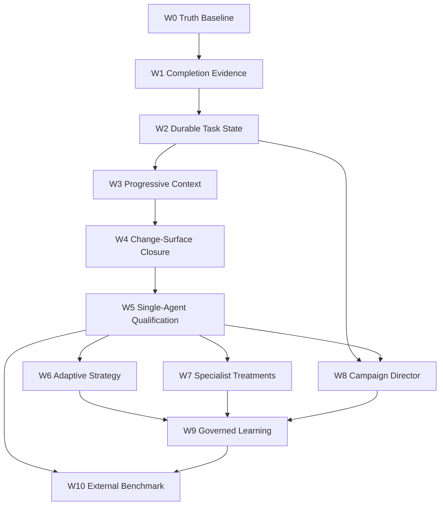

# Technical Specifications (Detailed)

Developers SHALL use this file plus [`spec.md`](spec.md), [`tasks.md`](tasks.md), [`milestones.md`](milestones.md), and [`backlog.md`](backlog.md). Drafts under `.draft/DEVELOPMENT_FINAL_PLAN*.md` are unused reference.

**Present vs future.** `docs/architecture/`, `docs/backend/`, and `docs/execution/spec.md` describe HEAD. This file describes how to implement remaining work and keeps `[PROPOSAL]` variants in full.

**Navigation before coding.** `uv run lda identity --json` then `uv run lda doctor --json`. Then `python3 tools/docs_rag_v0.py --file <path>` for the file you will edit. Kernel stays domain-blind (I-7). AST preflight belongs in `adapters/environment/`, never `kernel/dispatch.py` S7/S8.

**Canonical task IDs** are `T-01`… in [`tasks.md`](tasks.md). v2 `SUB-*` / `TXN-*` are aliases in [`backlog.md`](backlog.md). Live kernel pipeline package `SUB-01` in the backlog is **not** v2 admission.

**Recommended reading order (not a sprint):** MS-SEE A stack T-16/T-15/T-36/T-37/T-45 is MECHANISM. T-14 and T-17 are MECHANISM. T-04 stays `[PROPOSAL]`. T-46 ranking stays `[PROPOSAL]`.

**FACT STORE path:** `adapters/stores/event_store.py`.
**I-STATE.** Lock `66aa7a3c`: `domain/task_state.py` MISSING. Branch: LIVE `8637db55` (`SemanticTaskState`; fold in `runtime/task_state.py`). MS-RESUME `CLOSED`.
**MS-INSTRUMENT CLOSED** at `63b77116`.
**MS-RESUME CLOSED** at `8637db55`.
**T-14 WorkspaceEpoch LIVE** `587db91a`. **T-16/T-15/T-36/T-37/T-45 LIVE** (`33dc7c33`, `2a4cdaad`, `179f5616`, `81b7b572`, `c7995195`). **T-17 adapter 2PC LIVE** `5c9870f0`.
**T-04 / `ADMISSION_GATE_EXEMPT`:** unchanged. Do not implement here.

## 0. Epistemic legend

| Tag | Meaning |
|---|---|
| **FACT** | Observed in current source |
| **MECHANISM** | Code exists with tests; not a product claim |
| **INFERENCE** | Engineering conclusion from FACT + MECHANISM |
| **[PROPOSAL]** | Future work; keep the text; do not treat as HEAD |
| **ASPIRATION** | Competitive position; not a forecast |
| **CONTRADICTION** | Two authorities disagree; source wins |
| **MISSING** | Path does not exist at lock HEAD `66aa7a3c` |
| **SUPERSEDED** | Keep text, mark `[PROPOSAL]`, cite the better location |

Present docs to open while coding:

| Context | Read first |
|---|---|
| Kernel / TCB | `docs/architecture/boundaries.md`, `vanguard/packages/kernel/dispatch.py` |
| Turn loop | `docs/backend/architecture/agency.md`, `episode/engine.py`, `session.py` |
| Context | `compiler.py`, `layers.py`, `compaction.py` |
| Runtime / resume | `docs/backend/architecture/runtime-execution.md`, `app_service.py`, `task_state.py` |
| Index | `ports/index.py`, `adapters/stores/repo_index.py` |
| Packs | `packs/code-default/` |
| Memory | `docs/backend/architecture/memory-learning.md`, `ports/memory.py` |
| Eval | `docs/backend/architecture/assurance-evaluation.md` |

Wave-titled sections copied below are **capability recipes**, not a calendar.

## Electroweak v0.9.3 Wave 1–2 contract overlay `[PROPOSAL]`

**Overlay scope and epistemic status.** This is the implementation handbook for
the authorized Electroweak Wave 1–2 contracts in [`spec.md`](spec.md) §EW-9.
Per §0, every recipe below is **`[PROPOSAL]`**: the code it prescribes is not
observed in current source and MUST NOT be read as HEAD. What is `FACT` is the
*defect each recipe repairs*, observed at the file and line the recipe cites.
Authorization comes from `spec.md` §EW-9; this file carries only the recipe. The
older Wave 0–10 sections below remain historical capability recipes with their
existing titles. Do not renumber, retitle, or infer current scheduling from
them.

This overlay stops at the frozen control. It does not schedule or provide
next-code recipes for Prompts 05, 06, 07, or 09; T-75–T-78, T-83b, T-77, T-80,
OCT-03, or ARM-01. DLG-01's live alias/provenance work (T-86, T-90) is likewise
post-control — Wave 3, alongside IDX-01 — and not part of the Wave 1 package
set.

### `[PROPOSAL]` W1 — HAR-01 harness preconditions

No settlement result is useful until the product agent can call declared tools,
write through the mediated path, and explicitly finish. Apply these repairs in
the order below and keep their falsifiers executable:

| Work item | Recipe | Required falsifier |
|---|---|---|
| Capability-bound native profiles (T-69) | In `domain/models/profile.py`, add an explicit `ToolCallStyle.NATIVE` profile only for a production route whose provider-shape vector has verified native dispatch. Preserve `NATIVE -> JSON_SCHEMA -> FENCED_JSON -> TEXT_GRAMMAR` for unknown/unverified routes. Never stamp the registry globally. | Every native-declared route dispatches `patch.apply` and `finish` without degradation; an unverified route is never promoted. |
| Approval passthrough (T-70) | Replace the hardcoded unsealed threshold in `runtime/session.py` with the manifest's existing `components.approval_policy`; do not author a second policy artifact. | The product default honors `mode=assisted`, `threshold=standard`, and `escalate_on=[proc.exec]`; a missing/malformed component fails closed. |
| Finish declaration (T-71) | Add the flat `vg-code-default/finish-tool.json` component and register it for the default/fast/balanced/max product manifests. Use the already supported `ProposalKind.FINISH`; do not add another verb or execution path. | All four manifests resolve the component and can propose `finish`; undeclared or malformed finish remains rejected. |
| Streaming abort (T-70a) | First capture the OpenRouter SSE abort at the two non-retryable malformed/empty proposal call sites. Only after the regression fails may the retryable boundary be changed. | A malformed streamed chunk after completed effects enters bounded protocol recovery instead of discarding the episode. T-70a MUST NOT close as `no_defect` from the earlier hedge. |
| Orientation selectors | Extend the existing `proc://exec/allow/...` set only with the minimum read-only orientation verbs required to locate the workspace and inspect files; keep selector grammar and mediation unchanged. | A fresh agent can orient, while an undeclared executable remains denied. |
| `EffectStarted` singleton | Replay a ledger containing adjacent equal `descriptorDigest` and `leaseId` values before choosing the owner-side fix. The kernel is the sole authorized originator; do not spend TCB headroom speculatively. | One accepted effect produces exactly one `EffectStarted`. |
| Effect-budget binding | Reproduce the known reservation shape before choosing the runtime/kernel boundary. Additive resources and structural ceilings remain distinct. | A known reservation never emits `{}` or an unexplained `-1` settlement. |
| Completion-tool restriction | Re-verify autonomous no-approval re-entry, then bind `_completion_allowed_tools` inside the actual turn loop rather than only at outer engine construction if the defect remains. | The restriction applies on every autonomous iteration. |
| Workspace initialization | Re-verify the advertised `kind=git` environment, then make `vanguard init` establish resolvable workspace state and initialize Git when absent. | Fresh `vanguard init` reaches mediated `proc.exec` without ambient `AETHER_WORKSPACE_ROOT`. |
| Provider configuration | Remove the retired `ollama` route and resolve the literal `$FRONTIER` in the supported pack configuration. llama.cpp / llama-server remains the local inference standard. | Native-only route scan finds no retired alias or unresolved provider placeholder. |
| Workspace hygiene (T-74) | Route `PYTHONPYCACHEPREFIX` outside the workspace tree. Keep index exclusions separate from workspace-digest truth. | A Python effect creates no agent-authored `.pyc` path in the workspace digest. |
| Fenced-action recovery (T-82) | In the existing dialect/invocation pipeline, unwrap markdown-fenced JSON action blocks found in note payloads into candidate proposals. Do not execute raw text. Reject unsolicited `finish` when an invocation remains unparsed or no mutation occurred. | Fenced `patch.apply` recovers through validation; ambiguous or mutation-free finish fails closed. |
| Greenfield prompt and vacuity (T-81/T-83a) | Remove the product prompt conflict that says not to read/search and to write one file per turn. State the scaffold -> red oracle -> atomic 2PC sequence. Keep structural and behavioral evidence distinct; reject `pass` and `NotImplementedError` stubs with `VACUOUS_ORACLE_REJECTED`. | A stub may not produce a green settlement; the same fixture must be red before implementation and green after it. |

The kernel TCB remains **1386 logical LOC** for this overlay. A reproduced defect
that truly requires kernel work needs separate authorization, its complete
architecture package, and a fresh budget check; Wave 1 documentation does not
spend the headroom.

### `[PROPOSAL]` W1 — TRUTH two-axis settlement and admission

Implement the domain value by following the exact contract in the Synthesis of
Record §3.2; do not duplicate that module body here. The integration recipe is:

1. Add the pure `TaskDisposition` enum and immutable `SettlementReceipt` under
   `domain/evidence`, exporting the six named settlement symbols through the
   package surface. The wire schema is `aether.settlement/1`.
2. Enforce construction refusals for `passed` at zero executed tests, `passed`
   without bound oracle and verification subject, reasonless
   `undeterminable`, and evidence-bearing `not_run`. Make
   `disposition_to_outcome(not_run)` raise `DispositionError`.
3. Emit run termination only on existing `EpisodeCompleted` and emit the
   settlement receipt only on existing `VerdictRecorded`. Allocate no new
   ledger event kind. Keep `terminal_status` a plain string in the domain value
   so `domain` does not import `agency`.
4. Derive the benchmark disposition vocabulary from `TaskDisposition` and
   preserve missingness-marker precedence. Gate only through
   `satisfies_predicate`; never use `!= failed` as a positive test.
5. Record the RF-25 successor baseline before removing
   `ADMISSION_GATE_EXEMPT` (T-04), then update its frozen assertion. Do not use
   the baseline precondition to retain a permanent product-default bypass.
6. In `_admit_completion`, join mutation receipt, current postimage/epoch,
   relevant tests collected and executed, zero exit code, the existing
   IndexPort-enumerated tamper shield, and zero unresolved omissions/stale-index
   markers. Test implication/caller evidence is required only through the
   currently authorized Wave 1 surface. **T-83b is out of scope here by
   dependency, not by preference:** it wires `IndexPort.get_callers`, which has
   no adapter until `LdaRepoIndex` lands in T-75 (Wave 3). Where the Synthesis
   of Record §7 lists T-83b in the Wave 1 `session.py` cell it contradicts its
   own dependency graph; the dependency governs. Do not re-litigate this.

The axes are independent throughout. Oracle `PASS` never rewrites
`RunTermination` to `completed`, and `abandoned + passed` is a valid settlement.
The decisive contract tests are: `passed@0-tests` raises; reasonless
`undeterminable` raises; `not_run` with an envelope digest raises; outcome
projection of `not_run` raises; `EpisodeCompleted` contains no disposition; and
ledger replay preserves `terminal_status=abandoned` with
`disposition=passed`.

### `[PROPOSAL]` W1 — INS-01 and BRG-01 instrument integrity

INS-01 is an additive product-path repair. It does **not** reopen
`spec.md` §1 or `MS-INSTRUMENT`.

- Replace the literal CLI run identity with a generated UUID/ULID per new run.
  Only `--resume <id>` may continue an existing identity. Two invocations in
  one workspace must produce different ledgers.
- Carry actual `modelRoutes`, non-null token accounting, `verifiedStepIds`, and
  cost provenance from composition/application service into the product
  receipt. Do not fill missing telemetry with synthetic zeroes.
- Make benchmark execution call `runtime.entrypoint.execute`; a direct call to
  `Runtime.execute_profiled` is useful only when explicitly labeled as a
  different subject.
- In `tools/llama_cpp/cli.py`, use the accepted flash-attention flag; declare
  readiness only while the child is live, its PID matches, and `/props` binds
  the expected model identity. Stop only that verified child, never blanket
  `pkill`. In the MCP server, turn empty and max-token outputs into typed
  fail-closed errors.

Falsify with unique-run-identity, receipt-telemetry, product-path-subject,
bridge-lifecycle, and bridge-empty-output tests. Provider outage, HTTP failure,
or zero model calls settles as `not_run`, not task failure.

### `[PROPOSAL]` W2 — CMX-01 preset unification (T-79)

Unify the product path around the existing `packs/code-default/presets.json`
catalog; do not author replacement budget numbers:

| Preset | `usd_micros` | `millis` | `tokens` | `turns` |
|---|---:|---:|---:|---:|
| fast | 50,000 | 300,000 | 16,000 | 8 |
| balanced | 150,000 | 900,000 | 40,000 | 20 |
| max | 400,000 | 2,400,000 | 96,000 | 40 |

Make `CodingMaxFacade` select that catalog, expose the overlay from the pack
loader, give each product manifest its declared budget policy, and remove the
facade's universal `max_turns=40` default. Trace the selected ceiling through
`runtime/wiring.py` to `Governor` and assert it on `EpisodeStarted.budgetCeiling`.
`usd_micros`, `millis`, `tokens`, and `bytes` are additive reservation
dimensions; `turns` and `depth` are structural ceilings and are never summed.

### `[PROPOSAL]` W2 — EXP-01 evidence ladder and frozen control

Build the instrument in increasing-cost rungs:

1. **L0 (T-92):** run `P0-FIB`, `P0-CSV`, and `P0-BUG` in fresh workspaces via
   the public CLI. This licenses only the Wave 1 smoke statement.
2. **L1 (T-93):** freeze four greenfield, four single-file bug, and four
   data/CLI tasks. Use them to find fixture/oracle defects; publish no pass rate
   and never reuse tuned L1 tasks as L2 evaluation.
3. **L2:** freeze the exact candidate SHA and a multi-class suite of at least 30
   tasks. Execute single-worker `vg-code-balanced` through the product path.
   Close `MS-CONTROL` only with Wilson LB >= 0.40 and false-completion rate 0.
4. **L3:** after `MS-CONTROL`, compare immutable manifest x model x preset arms
   with at least 30 tasks per arm and one declared dimension changed. License
   relative task-class claims only.

Freeze prompts, tools, fixtures, oracle, model, server flags, sampling, and
budgets on the first measured attempt; any change resets the rung. The harness
writes one append-only row per run with every field group from `spec.md` §EW-9.4,
including `n`, `suite_digest`, and the oracle/tamper digests, and refuses blanks. It also refuses
`pass_rate_pct` when observed rows are fewer than the frozen suite size.

Partition `LIVE-LOCAL`, `LIVE-HOSTED`, `LIVE-HISTORICAL`, `REPLAY`, `STATIC`,
and `UNDETERMINABLE`. Only current `LIVE-*` rows enter capability rates;
undeterminable rows require reasons and leave the denominator. Bind every
non-control run to the T-95 hypothesis registry with a control digest and one
varied dimension.

Publish false-completion rate, Wilson live oracle pass rate, valid first-call
rate, malformed/recovery rate, no-op rate, time to first valid action, turn
waste `W`, and token efficiency `kappa`. **False-completion rate must equal
zero.** It vetoes every pass-rate, lift, latency, token, and cost claim. Publish
the frozen control disposition even when it is negative or undeterminable.

---

## From v2 — architecture catalog and SOTA harness mechanics

Copied from [`.draft/DEVELOPMENT_FINAL_PLAN_v2.md`](../reports/reviews/electroweak_v092/plans/DEVELOPMENT_FINAL_PLAN_v2.md) (locked triad). FACT / `[PROPOSAL]` tags remain binding.

## Locked triad roles

```text
A  = Program law: reliability identity, wave order, competency profiles,
     formal model, per-class evidence, non-goals, D-01–D-10
B  = Ground truth: live inventory, proven gaps, lattice placement,
     tickets 01–35, operator one-pager (01–13 first)
v2 = Architecture catalog: 16 primitives (map, not new cores),
     context economics, 2PC/tamper/dialect mechanics, later phenotypes
     (director / HYDRA / mutation) as [PROPOSAL]
```

Build order (locked, from B, aligned with the SOTA suggestion):

```text
cannot-lie → can-resume → can-see → can-change-many-files
  → qualify one EpisodeEngine coding agent
  → then meta / specialists / campaign / skills-memory
```

This triad **does not authorize** kernel AST, a second `EpisodeEngine`, or default HYDRA. Source outranks drafts. Kernel remains domain-blind (I-7). Coding semantics stay in `packs/code-default/`. CLI is a client of `ApplicationService`, not the brain.

## Epistemic legend (applies to every later claim)

| Tag | Meaning | Promotion rule |
|---|---|---|
| **FACT** | Observed in current source, tests executed this session, or an official primary source fetched on 2026-09-03 | May be treated as current truth for planning |
| **MECHANISM** | Code exists and unit/contract tests exist | Not a product or benchmark claim |
| **INFERENCE** | Reasonable engineering conclusion from FACT + MECHANISM | Must not be restated as evidence |
| **PROPOSAL** | Recommended next work | Requires a later ticket, falsifier, and WIP slot |
| **ASPIRATION** | Desired competitive position | Forbidden as a forecast of a specific score |
| **CONTRADICTION** | Two authorities disagree; source wins | Record both sides; do not silently pick the nicer one |
| **SUPERSEDED** | Attractive draft idea that current lattice or source rejects | Keep the text, mark `[PROPOSAL]`, cite the better location. Do not drop the insight. |

## Lock identity

- `lock_head`: `66aa7a3c0c31`
- `lock_date`: `2026-09-03`
- `lda_freshness`: `FRESH`
- Dual mission: closed-loop coding harness **and** composable agent framework (see §1.1). CLI (`vg` / `aether`) is the operator surface, not a second intelligence.
- Reliability identity:

$$
R = \prod_{t} \Pr(\text{honest progress}_t \mid \text{honest state}_{t-1})
$$

This file is a non-authoritative draft. It proposes work; it authorizes nothing. Current source and executable tests outrank this file, outrank Plan A, and outrank Plan B.

---

## 1. Executive Synthesis & Strategic Complementarity

### 1.1 The Dual Mission of Vanguard / AETHER
Vanguard is simultaneously two tightly integrated systems:
1. **The SOTA Autonomous Coding Agent (`Coding Max`)**: A world-class software engineering agent capable of autonomously executing multi-hour, multi-turn (50–200 turns) engineering tasks—including complex brownfield bug fixes, greenfield multi-file subsystem creation, multi-repo investigation, and atomic refactoring—with cryptographic verification, zero context amnesia, and fail-closed termination.
2. **The Harness Builder Meta-Framework (`Substrate Primitives`)**: A composable, modular framework providing the computational physics, workflow DAGs, memory hierarchies, and governance gates to rapidly build, evaluate, and evolve *arbitrary autonomous agents* (Coding, Review, Planning, Swarm Meta-Orchestration).

**Lock note.** The CLI is not either of those systems. It is a client of `ApplicationService` (`run` / `status` / `resume` / `evidence` / `cost`; presets `fast|balanced|max`). See §12.

### 1.2 Complementarity with Plan A + Plan B (MERGED is a historical sibling)

**FACT (lock HEAD `66aa7a3c`).** `.draft/DEVELOPMENT_FINAL_PLAN_MERGED.md` is **absent**. This document (`v2`) **does not compete with nor replace** Plan A or Plan B. Locked two-tier (now three-role) hierarchy:

- **Plan A remains program law**: reliability identity, wave order, competency profiles, formal model, per-class evidence, non-goals, D-01–D-10.
- **Plan B remains substrate ground truth and the critical-path DAG**: empirical contradiction audit, live inventory, lattice placement, and Tickets 01–35 (operator one-pager 01–13 first).
- **`DEVELOPMENT_FINAL_PLAN_v2.md` defines the System Architecture & Primitive Mechanics**: It synthesizes the extensive research in `docs/research/coding_harness/`, the outer-loop director in `docs/reports/reviews/electroweak_v092/octopus/`, and dynamic multi-agent topologies (`HYDRA`). It translates conceptual theory into typed protocols, concrete data models, and execution packages ready to be decomposed (in a *later* sprint) into [`milestones.md`](milestones.md), [`backlog.md`](backlog.md), [`docs/execution/spec.md`](spec.md) (current delta file), and [`tasks.md`](tasks.md).

Historical claim (draft v2.0.0 §1.2, 2026-09-03): this document does not compete with nor replace `DEVELOPMENT_FINAL_PLAN_MERGED.md`; MERGED "remains the Substrate Ground Truth & Forensic Baseline" owning the empirical contradiction audit, the 3 headline metrics ($R_{\text{solve}}$, $C_{\text{turn}}$, $R_{\text{tamper}}$), and Tickets 01–35. **Keep that idea.** `[PROPOSAL]` if MERGED is restored as an optional historical sibling. It is **not** authority while absent. Critical-path numbering remains B tickets 01–35. v2 `SUB-*` / `M-HYD` inventory in §8 is `[PROPOSAL]` mapping, not a replacement DAG.

```text
┌──────────────────────────────────────────────────────────────────────────────────────────────────┐
│                   DEVELOPMENT_FINAL_PLAN_v2 (This Master Plan)                                   │
│  - Composable Harness Builder Primitives (16 Primitives, Event-Sourced Node Types)               │
│  - Long-Horizon Agency & Context Economics (L1-L5 Prefix Stability, Result Distiller, Dead-Ends) │
│  - Multi-File Greenfield/Brownfield 2PC Transactions & 0.2ms AST Preflight                       │
│  - Anti-Tamper Test Shield, UID 10002 Evaluator & Fail-to-Pass Reproducer Protocol               │
│  - Model Dialect Recovery & Response Wrangling (DeepSeek, Claude, OpenAI)                        │
│  - Outer-Loop Director (OCT-* / ORCH-*) & Meta-Conductor Closed Supervisory Loop                 │
│  - Dynamic Bifurcation & Living Horizon Swarm Topologies (HYDRA)                                 │
└─────────────────────────────────────────────┬────────────────────────────────────────────────────┘
                                              │ Informs & Extends
                                              ▼
┌──────────────────────────────────────────────────────────────────────────────────────────────────┐
│         Plan A (law) + Plan B (substrate foundation & core DAG 01–35)                            │
│  - Empirical Evidence Audit & Forensic Contradiction Elimination                                 │
│  - Strict Hexagonal Boundaries (domain ← ports ← kernel ← agency ← runtime → adapters)            │
│  - Kernel TCB Line-of-Code Budget (≤ 1438 LOC Ceiling)                                           │
│  - Admission Gate & Verification Proof Spine (Tickets 01–08 Critical Path)                       │
│  - Control-First Single-Agent Benchmark Qualification (Tickets 09–35)                            │
└──────────────────────────────────────────────────────────────────────────────────────────────────┘
```

Historical diagram target (draft v2.0.0): the lower box was labeled `DEVELOPMENT_FINAL_PLAN_MERGED.md (Substrate Foundation & Core DAG)`. Retargeted above to A + B. MERGED box copy kept as `[PROPOSAL]` historical sibling:

```text
┌──────────────────────────────────────────────────────────────────────────────────────────────────┐
│             DEVELOPMENT_FINAL_PLAN_MERGED.md (Substrate Foundation & Core DAG)                   │
│  - Empirical Evidence Audit & Forensic Contradiction Elimination                                 │
│  - Strict Hexagonal Boundaries (domain ← ports ← kernel ← agency ← runtime → adapters)            │
│  - Kernel TCB Line-of-Code Budget (≤ 1438 LOC Ceiling)                                           │
│  - Admission Gate & Verification Proof Spine (Tickets 01–08 Critical Path)                       │
│  - Control-First Single-Agent Benchmark Qualification (Tickets 09–35)                            │
└──────────────────────────────────────────────────────────────────────────────────────────────────┘
```

---

## 2. Pillar I: The Harness Builder Framework & Meta-Framework Primitives

### 2.1 The 16 Candidate Computational Substrate Primitives
Per `RESEARCH_META_FRAMEWORK_2408.md` and `RESEARCH_metaframework_2508_improved.md`, an autonomous agent framework must not treat high-level constructs ("Agent", "Planner", "Critic") as atomic primitives. Instead, it defines **16 pure computational primitives** from which all agentic behaviors emerge:

The **Target Package Placement** column is the original architecture sketch. Paths that do not exist at lock HEAD, or that violate current lattice owners, are `[PROPOSAL]` future packages — **do not delete**. The **Current owner (FACT)** column pins live code at HEAD `66aa7a3c`. These 16 primitives are a **map onto existing cores**, not a mandate to create 16 new packages.

| Primitive | Classification | Formal Responsibility & Behavioral Contract | Target Package Placement | Current owner (FACT) |
|---|---|---|---|---|
| **`OBSERVE`** | Sensory | Ingests environment/system states into typed evidence snapshots. Zero mutation. | `ports/environment.py` | `ports/environment.py` + `adapters/environment/` |
| **`REPRESENT`**| Cognitive | Projects raw bytes into content-addressed ASTs, symbols, embeddings, or maps. | `domain/transforms/` | `domain/transforms/` (`contracts.py` live `TransformSpec`) |
| **`PREDICT`**  | Epistemic | Generates testable hypotheses and expected future observations. | `agency/prediction/` **[PROPOSAL]** (MISSING in HEAD `66aa7a3c`) | MISSING — no `agency/prediction/` package |
| **`SELECT`**   | Attention | Bounded selection under constraints (token budgeting, tool routing). | `agency/context/` | `agency/context/compiler.py` |
| **`ACT`**      | Executive | 4-stage dispatch: `Proposal → Attenuate → Dispatch → Receipt`. | `kernel/dispatch.py` | `kernel/dispatch.py` (S0–S12) |
| **`STORE`**    | Memory | Persists content-addressed immutable records to SQLite WAL. | `runtime/event_store.py` **[PROPOSAL]** (MISSING as that path) | `adapters/stores/event_store.py` |
| **`RETRIEVE`** | Memory | Policy-bounded selection from storage (BM25 FTS5, AST adjacency). | `adapters/index/` **[PROPOSAL]** (MISSING as that path) | `adapters/stores/repo_index.py` + `ports/index.py` |
| **`COMMUNICATE`**| Social | Typed, content-addressed message passing preserving causal lineage. | `domain/topology/` **[PROPOSAL]** (MISSING in HEAD `66aa7a3c`) | MISSING — no `domain/topology/` package |
| **`ALLOCATE`** | Resource | Allocates 6D resource tensors (USD, time, tokens, bytes, turns, depth). | `kernel/budget.py` | `kernel/budget.py` |
| **`VERIFY`**   | Structural| Synchronous local checks: AST syntax, type linkage, schema validity. | `adapters/environment/` | `adapters/environment/` (post-write `ast.parse` in `git.py`; preflight 2PC MISSING) |
| **`EVALUATE`** | Exterior | Independent, out-of-process verification emitting signed receipts. | `adapters/evaluator/` | `adapters/evaluator/` |
| **`COMPOSE`**  | Structural| Assembles primitive instances into directed acyclic workflow graphs. | `runtime/wiring.py` | `runtime/wiring.py` / `runtime/compose.py` |
| **`VARY`**     | Evolutionary| Applies mutations, structural variations, or hyperparameter sweeps. | `agency/evolution/` **[PROPOSAL]** (MISSING in HEAD `66aa7a3c`) | MISSING — no `agency/evolution/` package |
| **`CONSOLIDATE`**| Learning | Distills multi-turn experiences into procedures, skills, or records. | `agency/memory/` **[PROPOSAL]** (MISSING as that path) | `runtime/memory.py` / `runtime/skill_lifecycle.py` / `skill_*` |
| **`REVISE`**   | Strategic | Meta-level strategy revision when marginal progress plateaus. | `runtime/outer_loop/` **[PROPOSAL]** (MISSING in HEAD `66aa7a3c`) | `runtime/meta_controller.py` (powerless advisor; no outer-loop package) |
| **`SCHEDULE`** | Temporal | Manages activation, concurrency, priority queues, and interruptions. | `runtime/session.py` | `runtime/session.py` |

Keep `agency/prediction/`, `agency/evolution/`, and `runtime/outer_loop/` as `[PROPOSAL]` future packages — do not delete those rows or the target paths.

### 2.2 "Agent as a Compiled Phenotype"
In Vanguard, an **Agent is not an ontological base class**; it is an ephemeral **Compiled Phenotype**:
```python
@dataclass(frozen=True, slots=True)
class BoundedPhenotype:
    """An ephemeral, task-conditioned computational organization."""
    phenotype_id: str
    workflow_graph_digest: str
    state_boundary_scope: tuple[str, ...]
    capability_lease: CapabilityGrant
    budget_lease: BudgetTensor
    model_policy_digest: str
    mailbox_endpoint_id: str
```
Phenotypes are lazily compiled by an architecture compiler based on task requirements, executed to satisfy a specific proof obligation, and retired immediately after verification.

### 2.3 Event-Sourced Workflow Graph & Closed Node Kinds
Rather than running monolithic agent loops, complex workflows are modeled as **Event-Sourced Directed Acyclic Graphs (DAGs)** composed of 9 closed node kinds (`LLM_RESPONSE_WRANGLER.md` §3):
```text
┌──────────────────────────────────────────────────────────────────────────────────────────────────┐
│                                   WORKFLOW GRAPH NODE TAXONOMY                                   │
├─────────────────┬────────────────────────────────────────────────────────────────────────────────┤
│ 1. transform    │ Pure, deterministic in-memory computation (parsing, normalizing, ranking).     │
│ 2. model        │ Single constrained model inference call (one prompt -> one response).         │
│ 3. episode      │ Iterative model-tool loop (only invoked when open-ended feedback is required).  │
│ 4. effect       │ Authorized external privileged mutation passing through the Kernel.            │
│ 5. gate         │ Deterministic boundary acceptance or rejection of candidate evidence.          │
│ 6. router       │ Branch selection based on state predicates or classifier outputs.              │
│ 7. join         │ Synchronization barrier merging results from concurrent predecessor paths.     │
│ 8. interrupt    │ Execution pause awaiting operator approval, external webhook, or lease renewal.│
│ 9. evaluator    │ Independent, out-of-process test execution request.                            │
└─────────────────┴────────────────────────────────────────────────────────────────────────────────┘
```

### 2.4 Pure Artifact-Transform Algebra
All in-memory transformations (diff parsing, AST skeletonization, token estimation, linting) must implement the **Pure Transform Contract** (`domain/transforms/contracts.py`):

**`[PROPOSAL]` alias sketch** (original v2 draft fields `name` / `input_type` / `output_type` / `timeout_ms`). Keep as a naming alias if a later adapter wants friendlier field names. It is **not** the live dataclass.

```python
@dataclass(frozen=True, slots=True)
class TransformSpec:
    name: str
    input_type: str
    output_type: str
    max_input_bytes: int
    max_output_bytes: int
    timeout_ms: int

@dataclass(frozen=True, slots=True)
class TransformResult:
    success: bool
    output_digest: str
    output_payload: Mapping[str, Any]
    diagnostics: tuple[str, ...]
    execution_duration_ms: int
```

**FACT — live `TransformSpec` fields** from [`vanguard/packages/domain/transforms/contracts.py`](../../vanguard/packages/domain/transforms/contracts.py) lines 20–31 (HEAD `66aa7a3c`):

```python
@dataclass(frozen=True, slots=True)
class TransformSpec:
    """Immutable specification declaring transform capabilities and resource bounds."""

    transform_id: str
    version: str
    input_schema: str
    output_schema: str
    config_digest: str = ""
    deterministic: bool = True
    max_input_bytes: int = 10_000_000
    max_output_bytes: int = 10_000_000
    timeout_seconds: float = 30.0
```

Live sibling types in the same module (FACT, not a replacement of the sketch above): `TransformInput` (`artifact_digest`, `schema_id`, `labels`); `TransformDiagnostic` (`code`, `severity`, `message`, `location`); `TransformOutput` (`status`, `payload`, `output_schema`, `diagnostics`, `confidence_ppm`); live `TransformResult` (`status: TransformStatus`, `output_digest: str | None`, `output_schema: str | None`, `diagnostics`, `confidence_ppm`). `TransformStatus` is `accepted | rejected | unchanged | retryable_error | fatal_error`.

**Invariants on Transforms**:
- **I-TX-1 (Pure Stdlib & Zero I/O)**: Transforms must never execute filesystem writes, subprocess calls, network sockets, or system clocks.
- **I-TX-2 (Idempotency & Provenance)**: The same `(input_digest, config_digest)` must deterministically yield the exact same `output_digest`.
- **I-TX-3 (TCB Exemption)**: Transforms live in `domain/transforms/` and do not consume Kernel TCB lines of code.

---

## 3. Pillar II: SOTA Long-Horizon Agency & Context Economics (100+ Turns)

### 3.1 The 5 Root Problems of Context Economics
Long-horizon execution (50–200 turns) routinely collapses due to five distinct phenomena:
1. **P1: Turn-Level Bloat**: Raw tool outputs (large stack traces, 5,000-line pytest runs, full file reads) flood context.
2. **P2: Attention Dilution ("Lost in the Middle")**: 50,000 tokens present, but the model fails to attend to critical constraints.
3. **P3: KV-Cache Invalidation**: Changing system prompts or tool order destroys prompt cache, increasing latency and cost by 10×.
4. **P4: Cross-Episode & Inter-Turn Amnesia**: Re-trying hypotheses and patches that were already falsified 10 turns prior.
5. **P5: Large-Scale Repository Ingestion**: 10,000 files in the workspace, with budget for only 30.

### 3.2 L1–L5 Prefix-Stable Context Architecture
To maximize provider prompt caching (Anthropic, DeepSeek, OpenAI) from 27% to **>72%** (**ASPIRATION** — desired competitive cache-hit position; forbidden as a forecast of a measured score at lock HEAD), context is assembled into 5 strict layers (`agency/context/compiler.py`):
```text
┌──────────────────────────────────────────────────────────────────────────────────┐
│ L1: SYSTEM      │ Constitutional law, core output schema      │ Mutation = 0     │
├─────────────────┼─────────────────────────────────────────────┼──────────────────┤
│ L2: TOOLS       │ Stable tool JSON schemas & definitions       │ Mutation = 0     │
├─────────────────┼─────────────────────────────────────────────┼──────────────────┤
│ L3: ENVIRONMENT │ OS conventions, repository map, skill cards  │ Mutation = 0     │
├─────────────────┴─────────────────────────────────────────────┴──────────────────┤
│ ─── [KV CACHE BARRIER: Ephemeral Cache Breakpoint Injected Here] ──────────────── │
├─────────────────┬─────────────────────────────────────────────┬──────────────────┤
│ L4: TASK        │ Problem brief, active step, invariants      │ Mutates per task │
├─────────────────┼─────────────────────────────────────────────┼──────────────────┤
│ L5: DIALOGUE    │ Recency window, working set, tool receipts  │ Mutates per turn │
└──────────────────────────────────────────────────────────────────────────────────┘
```
**Rule**: `PREFIX_LAYERS` (L1–L3) are byte-frozen at session startup. No turn dynamic data may enter L1–L3.

**FACT.** Session compiles σ into L4 notes (`PromptAssembler`, source `task-state`); it does not dump `resume_state` JSON into frozen L3. `repo_map` still enters the environment prefix at construction. Target remains: epoch-bound map **not** in the frozen prefix.

`ContextCompiler` **FACT**: L1–L3 freeze at construction (`agency/context/compiler.py`). Compile is **not** a step inside `EpisodeEngine`. Product loop is session + compiler + engine: observe → propose → `recover_proposal` → `Kernel.dispatch` → ingest (`agency/episode/engine.py`).

### 3.3 Distillation at the Effect Boundary (`ResultDistiller`)
Distillation occurs **at the moment the effect receipt is generated**, *before* reaching the context compaction buffer:
```python
class ResultDistiller(Protocol):
    def distill(self, verb: str, payload: Mapping[str, Any]) -> DistilledResult: ...

@dataclass(frozen=True, slots=True)
class DistilledResult:
    compact_text: str          # What enters L5 dialogue history (~150 tokens)
    full_artifact_digest: str  # Content-address of raw output (retrievable on demand)
    tokens_saved: int
```
- **`PytestDistiller`**: Extracts: exit code, failing test names, assertion line, and failure message. Drops: successful dots, stack frames below the assertion frame, collection warnings, and timing tables (1,200 tokens $\to$ 180 tokens).
- **Critical Invariant ("Never Destroy, Always Address")**: The raw output is saved to the blob store under `full_artifact_digest`. The agent can invoke `ctx.expand(digest)` if full stack traces are genuinely required.

### 3.4 Recency-Inverted Salience & Pinned Working-Set Header
To combat "Lost in the Middle" attention degradation, the prompt compiler pins an immutable **Working-Set Header (~80 tokens)** directly at the top of L5, adjacent to the latest turn:
```text
================================== ACTIVE WORKING SET ==================================
Goal: Implement SemanticTaskState vector and verify JCS canonicalization
Touched Files: vanguard/packages/domain/task_state.py (2 hunks)
Current Verification: FAILING — test_jcs_canonical: AssertionError: keys not sorted
Rejected Dead Ends:
  [Turn 04] Sorting keys with sorted(dict) — failed slots dataclass mapping
  [Turn 08] Relying on json.dumps(sort_keys=True) — violates RFC 8785 float format
Next Objective: Use vanguard.packages.domain.canonical.canonical_json() reducer
========================================================================================
```

**FACT.** `vanguard/packages/domain/task_state.py` holds `SemanticTaskState` (`CodingTaskState` alias). The only fold is `runtime/task_state.py` `fold_task_state`. A's 17 extra domain types stay `[PROPOSAL]`. The working-set example is a sketch of L5 pinning, not a second store.

### 3.5 The Dead-Ends Algebra (`StructuredRecord.dead_ends`)
In long-horizon debugging, **knowing what failed and why is 10× more valuable than knowing what succeeded**. 
- Whenever a test fails following a patch or a hypothesis is refuted, the failure signature and rationale are registered into `falsified_hypotheses`.
- Invariant: Compaction and eviction algorithms are strictly forbidden from evicting `falsified_hypotheses`. They remain pinned in L4/L5, preventing the dreaded "cyclical patching death spiral".

### 3.6 Repo-Scale Retrieval via Skeletonization, AST Callgraphs & Submodular Knapsack
For large repositories (100k+ LOC):
1. **3-Tier Skeletonization**:
   - `L0`: File path + single-line module docstring (~15 tokens).
   - `L1`: Tree-sitter AST skeletons: class names, method signatures, argument types, return types, decorators; function bodies elided (~150 tokens).
   - `L2`: Full file source (~500–5,000 tokens).
2. **Submodular Knapsack Packing**:
   Instead of naive Top-$K$ semantic similarity (which produces redundant file clusters), pack candidates by maximizing marginal symbol coverage:
   $$\text{Gain}(file) = \frac{\alpha \cdot \text{Relevance}(file) + (1 - \alpha) \cdot |\text{NewSymbolsCovered}|}{\max(\text{Tokens}(file), 1)}$$
   Greedy submodular optimization provides a provable $(1 - 1/e)$ approximation bound under strict token budgets.
3. **Spectrum-Based Fault Localization (SBFL Ochiai)**:
   For bug localization, map test coverage matrices to calculate suspicion scores:
   $$\text{Suspiciousness}(s) = \frac{e_f(s)}{\sqrt{n_f \cdot (e_f(s) + e_p(s))}}$$
   Inject the top 5 suspicious lines directly into the Turn 1 prompt, bypassing 5–10 manual exploratory turns.

---

## 4. Pillar III: Greenfield Multi-File Synthesis & Recoverable Transactions

### 4.1 The Greenfield Synthesis Challenge
When building new subsystems requiring multiple interdependent files (domain schemas, port interfaces, adapters, wiring, and tests), agents often fail due to:
- Writing implementations before interfaces exist;
- Cyclic imports and broken symbol exports;
- Cascading syntax errors discovered late during whole-suite runs.

### 4.2 Two-Phase Commit (2PC) Multi-File Transaction Protocol
All multi-file modifications must pass through an atomic **Two-Phase Commit Transaction Manager** (`adapters/environment/transaction.py`):
```text
Agent Proposes Transaction (Files: [A.py, B.py, C.py])
    │
    ▼
[PHASE 1: PRE-FLIGHT (In-Memory Shadow Workspace)]
    ├─ 1. In-Process AST Syntax Verification (ast.parse)
    ├─ 2. Cross-Module Symbol Linkage (all imported types resolve)
    └─ 3. Structural Boundary Verification (hexagonal layer check)
    │
    ├─► If ALL checks PASS:
    │     ▼
    │   [PHASE 2: COMMIT]
    │     ├─ Write staged files atomically to disk
    │     └─ Emit TransactionCommitted event with tree hash
    │
    └─► If ANY check FAILS:
          ▼
        [PHASE 2: ROLLBACK]
          ├─ Discard shadow buffer; disk untouched
          ├─ Record failure signature into dead_ends
          └─ Emit TransactionRejected with exact syntax line/column diagnostics
```

**FACT.** `adapters/environment/transaction.py` is **MISSING** in HEAD `66aa7a3c`. No `WorkspaceEpoch` module. The 2PC protocol above is `[PROPOSAL]`. Correct lattice placement for any future transaction manager is this adapter section (§4.2), **not** the kernel.

**MECHANISM (live).** `GitEnvironment.apply` is sequential (`adapters/environment/git.py`). After write, `ast.parse` is a **post-write observation** (~853–900): syntax errors are appended to the receipt; they do **not** roll back the write. `packs/code-default/middleware/repository/multi_file_completeness.py` and `GreenfieldPolicy` already exist.

### 4.3 In-Process 0.2ms AST Syntax Pre-Flight Gate
Hooked into Kernel Dispatch Stage $S_7$ / $S_8$ (`surgical_patch_preflight`) — **`[PROPOSAL]` rejected by I-7; FACT after the snippet:**
```python
def validate_syntax_preflight(file_path: str, proposed_content: str) -> tuple[bool, str | None]:
    if file_path.endswith(".py"):
        try:
            ast.parse(proposed_content, filename=file_path)
            return True, None
        except SyntaxError as exc:
            return False, f"SyntaxError at line {exc.lineno}, col {exc.offset}: {exc.msg}"
    return True, None
```
- Executes in **0.2 milliseconds**. Intercepts indentation errors and malformed ASTs before disk writes, eliminating 15–30 second timeout waits on external compiler subprocesses.

**`[PROPOSAL]` rejected by I-7 / current `dispatch.py`.** Historical claim (this subsection title + first sentence): AST preflight is "Hooked into Kernel Dispatch Stage $S_7$ / $S_8$ (`surgical_patch_preflight`)". **CONTRADICTION** with §9.1 "ZERO AST in kernel" and with live dispatch:

```text
FACT Kernel S7 = RESERVE (governor.reserve)
FACT Kernel S8 = VERIFY (grant binds THIS descriptor and is unexpired)
```

Kernel must never import or reference AST, git, files, patches, tests, models, or agents (I-7). Keep the `ast.parse` snippet. Correct placement is §4.2 `adapters/environment/` (and B: observation already exists post-write in `git.py`). Pre-write blocking preflight remains `[PROPOSAL]` in the adapter, not the TCB.

### 4.4 Speculative Branching & Git Checkpoint Rollbacks
- For complex multi-turn refactors, `SpeculativeBranchManager` generates a lightweight git checkpoint (`git stash create` or detached branch pointer).
- If the agent introduces regressions that cannot be resolved within 3 turns, the runtime triggers a clean rollback to the latest green state, preventing cumulative code degradation.

---

## 5. Pillar IV: Autonomous Verification, Tamper-Resistance & Reproducers

### 5.1 Separation of Authority Invariant
$$\mathbf{Candidate\ (Agent)} \neq \mathbf{Evaluator\ (Judge)} \neq \mathbf{Promotion\ Authority\ (Release\ Gate)}$$
- The coding agent runs under rootless Bubblewrap sandbox (`bwrap` UID `10001`).
- Verification suites run via `ExteriorEvaluatorClient` communicating with an isolated evaluator daemon under UID `10002`.
- Test suites, golden data fixtures, and grading scripts are mounted **read-only** (`ro-bind`).

### 5.2 The Cryptographic Test Tamper Shield (`TestTamperShield`)
To eliminate "reward hacking" (where an agent modifies test assertions, changes `assert x == 42` to `assert True`, or comments out tests):
```python
@dataclass(frozen=True, slots=True)
class TestTamperShield:
    frozen_test_digests: Mapping[str, str] # path -> sha256 at Turn 0

    def verify_workspace_integrity(self, workspace_root: Path) -> tuple[bool, str | None]:
        for test_path, expected_hash in self.frozen_test_digests.items():
            current_file = workspace_root / test_path
            if not current_file.exists():
                return False, f"TAMPERING DETECTED: Frozen test {test_path} was deleted!"
            current_hash = hashlib.sha256(current_file.read_bytes()).hexdigest()
            if current_hash != expected_hash:
                return False, f"TAMPERING DETECTED: Frozen test {test_path} was modified!"
        return True, None
```
**Rule**: Modifying frozen test files triggers immediate fail-closed termination with `TAMPER_VIOLATION`.

**MECHANISM (this branch, T-18).** `runtime/governance/tamper_shield.py` freezes IndexPort-enumerated test digests. Assertion or test-body edit fails admission (`TAMPER_VIOLATION`). `Path.glob("test/**")` is not the enumeration source. Session `_tamper_shield.evaluate(...)` still unwired (B owns the admission call). Lock `66aa7a3c` still MISSING.

### 5.3 Gated Dual-Loop Reproducer Protocol (Fail-to-Pass Enforcement)
To guarantee bug fixes are real and not coincidental passes:
```text
Stage 1: LOCALIZATION    ──► Identify root cause.
Stage 2: REPRODUCER      ──► Write minimal reproducing test (test_repro.py).
Stage 3: PRE-VERIFY      ──► Execute reproducer on unpatched code. MUST FAIL.
                             (If it passes, reproducer is invalid: REJECT).
Stage 4: SURGICAL PATCH  ──► Apply code fix via 2PC transaction.
Stage 5: POST-VERIFY     ──► Execute reproducer on patched code. MUST PASS.
Stage 6: REGRESSION GATE ──► Execute full repository test suite. ZERO regressions.
Stage 7: CLEANUP         ──► Quarantine or promote reproducer into official test suite.
```
**Enforcement**: Invoking `finish` without a verified `Fail-to-Pass` receipt is rejected by the `AdmissionGate`.

**I-1 universal signed finish is `[PROPOSAL]` and too strong** versus A §9.4 per-class evidence (A wins for completion policy) and versus the local vs exterior evaluator split (B §3.4). Keep this section as the bugfix-class protocol. Do not promote it to universal law for research/explanation/greenfield classes.

**FACT (live admission, not this protocol).** `VerificationReceipt.passed` = `exit_code == 0 and executed_test_count > 0` (`admission_gate.py` 22–37). Session `_observed_test_count` returns 0 if unparseable (363–375). Forge `parse_test_output` and Chimera bare-exit-0 parsing leave unknown counts at 0 (T-06). `admission_required` exempts `vg-code-default` / `vg-code-lex`, else `"patch.apply" in verbs` (`runtime/session.py` 124–138). `ADMISSION_GATED_HARNESSES` is unused in runtime.

### 5.4 Type-Aware Mutation Testing (EvalPlus / LLMorpheus)
To defeat "tautological fixes" (hardcoding return values for known test cases):
- Synthesize syntactic mutants across modified diff lines (swap operators: `==` $\leftrightarrow$ `!=`, `<` $\leftrightarrow$ `<=`, boolean constants: `True` $\leftrightarrow$ `False`).
- Require Mutation Score:
  $$MS(Patch) = \frac{\sum_{m \in \mathcal{M}} \mathbb{I}(\text{Tests fail on mutant } m)}{|\mathcal{M}|} \ge 0.80$$
- Patches that pass tests even when their core logic is inverted are rejected as ungrounded.

**`[PROPOSAL]` optional treatment, not default admission.** Keep the full formula and section. Do not make $MS \ge 0.80$ a product-path gate until a successor baseline exists. Competing variant: A per-class evidence (A §9.4) remains completion law.

---

## 6. Pillar V: Model Dialect Wrangling & Response Recovery

### 6.1 Provider Dialect Realities
| Model Family | Tool Calling Dialect | Common Degenerations & Idiosyncrasies |
|---|---|---|
| **Claude (3.5 / 3.7 Sonnet)** | Native XML & JSON parameter blocks | Emits markdown unified diffs or search-and-replace text blocks into assistant text instead of calling `patch.apply`. |
| **DeepSeek (V3 / R1 / Coder)**| DSML (`<\|action_start\|>`) or fenced JSON | Emits `<think>...</think>` tags that must be cleanly stripped; truncates JSON arguments when hitting `max_tokens`. |
| **OpenAI (GPT-4o / o1 / o3)** | Structured Outputs / function calling | Rejects trailing commas or minor JSON schema deviations; strict typing. |
| **Local Models (Qwen 2.5 Coder)**| Inconsistent schema adherence | Outputs explanatory prose before/after tool JSON; missing closing brackets. |

### 6.2 Decoupled Protocol Recovery Pipeline
Provider adapters handle **only** raw network transport. Output normalization is handled by a model-agnostic **Protocol Recovery Pipeline** (`agency/episode/protocol_recovery.py`):
```text
Raw Model Output
    │
    ▼
[Dialect Detection & Stripping]
    ├─ Extract and isolate reasoning tokens (<think>...</think>)
    └─ Detect markup syntax (DSML, XML tags, fenced ```json codeblocks)
    │
    ▼
[JSON Argument Repair]
    ├─ Strip trailing commas
    ├─ Quote unquoted object keys
    └─ Balance missing closing braces/brackets from truncated streams
    │
    ▼
[Proposal Classification & Validation]
    ├─ Validate against tool JSON schema
    └─ Check action authorization against active capability grant
```

**MECHANISM.** `agency/episode/protocol_recovery.py` exists. `EpisodeEngine` is observe → propose → `recover_proposal` → `Kernel.dispatch` → ingest.

### 6.3 Bounded Protocol Recovery State Machine
Replaces immediate episode crashes with structured, actionable retry loops:
1. **Truncated Output Recovery**:
   - If response ends mid-stream due to `max_tokens`: preserve partial JSON, compute continuation token offset, and issue a continuation request retaining full prefix.
2. **Markdown Patch Emitted in Prose**:
   - If the model writes a valid unified diff inside assistant text without calling `patch.apply`: parse the diff block, calculate artifact digest, and return structured retry feedback:
     `RetryModel(reason="PATCH_EMITTED_AS_TEXT", feedback={"required_tool": "patch.apply", "candidate_digest": digest})`.
   - **Invariant**: The engine *never* silently executes raw text as an effect; the model must formally submit the authorized proposal.
3. **Head/Tail Output Paging**:
   - When test runners emit 50,000+ characters of output, page automatically: retain the **first 25 lines** (environment and discovery), elide middle passing noise with `[... N lines elided; raw digest sha256:... ...]`, and retain the **last 60 lines** (the exact stack trace, assertion failure, and summary).

---

## 7. Pillar VI: Outer-Loop Meta-Orchestration & Multi-Agent Topologies

### 7.1 The Director Layer (Program-Scale Orchestration)
While the inner loop (`EpisodeEngine` / Kernel S0–S12) solves *one task well*, the **Outer-Loop Director** (`OCT-03` / `ORCH-*`) executes *entire multi-package roadmaps* (`SOTA-01..11`):
- **Lifecycle**: Sequences tasks according to dependency DAGs, spans multiple days, manages cross-episode memory, and handles fresh-process restarts via SQLite WAL checkpoints.
- **Strict Boundary**: The Director has **zero mutating tools** (no `fs.write`, no `proc.exec`). It directs, decomposes, reviews, and gates; the Dispatcher executes.

**`[PROPOSAL]`.** `runtime/outer_loop/` is MISSING in HEAD `66aa7a3c`. Director is a later phenotype, not default. See A waves 7–8 and B waves 7–8. Default swarm is rejected.

### 7.2 The Meta-Conductor: Higher-Order Supervisory Loop
The **Meta-Conductor** (`OCT-04`) operates as an exterior pilot *above* AETHER, reasoning about the execution attempt itself:
$$\mathbf{measure} \longrightarrow \mathbf{diagnose} \longrightarrow \mathbf{intervene} \longrightarrow \mathbf{re\text{-}measure}$$

#### The Non-LLM `ProgressVector`
Computed deterministically from append-only ledger events with zero model calls:
```python
@dataclass(frozen=True, slots=True)
class ProgressVector:
    verification_delta: float  # (tests passing now - tests passing at checkpoint) [-1.0..1.0]
    novelty: float             # 1 - (repeated action signatures / total actions) [0.0..1.0]
    scope_fidelity: float      # |touched_files ∩ declared_scope| / |touched_files| [0.0..1.0]
    evidence_freshness: int    # Turns elapsed since last verification receipt
    budget_burn: float         # spent_budget / total_allocated [0.0..1.0]
    convergence: float         # 1 - (distinct failure fingerprints / total attempts)
```

#### Closed Vocabulary of 8 Pathologies & Ordered Interventions
1. **`THRASHING`** (`novelty < 0.3` over 3 turns) $\to$ **Level 0 (NOTE)**: Inject dead-ends block into context.
2. **`SCOPE_DRIFT`** (`scope_fidelity < 0.8`) $\to$ **Level 2 (REBRIEF)**: Halt and reinforce scope boundaries.
3. **`BLIND`** (`evidence_freshness > 3` with edits) $\to$ **Level 1 (RESTRICT)**: Restrict tools to test verification only.
4. **`WON_BUT_UNAWARE`** (`verification_delta > 0` $\land$ passing $\land$ no `finish`) $\to$ **Level 1 (RESTRICT)**: Restrict tools to `{finish, read}`. (Eliminates the "Abandoned Paradox" where 18/26 green runs looped until budget exhaustion).
5. **`STALLED`** (`verification_delta == 0` over 5 turns) $\to$ **Level 4 (ESCALATE_BAND)**: Escalate model tier or bisect task.
6. **`DIVERGENT`** (`convergence < 0.3`) $\to$ **Level 5 (BISECT)**: Split task into two sequential sub-tasks.
7. **`BUDGET_RISK`** (`budget_burn > 0.8` $\land$ unverified) $\to$ **Level 8 (TERMINATE)**: Graceful stop, persist partial diff.
8. **`INTERVENTION_INEFFECTIVE`** (2 failed interventions) $\to$ **Level 7 (ESCALATE_HUMAN)**: Pause, request human directive.

**FACT (live meta, distinct from this conductor).** `runtime/meta_controller.py`: a controller **cannot enlarge a budget**. `conclude` becomes an ordinary `finish` proposal (`session.py` `_lower_controller_directive`), still gated. Meta must not admit `completed`. See §20.

### 7.3 Dynamic Bifurcation Functional (HYDRA)
Avoids the twin traps of flat ReAct loops (which derail on complex features) and rigid multi-agent swarms (which waste tokens on simple fixes):
$$\mathcal{C} = 0.35 \cdot U_{\text{loc}} + 0.30 \cdot C_{\text{dep}} + 0.20 \cdot S_{\text{spec}} + 0.15 \cdot K_{\text{ctx}}$$
- **Threshold Rule**:
  - $\mathcal{C} < 0.38 \implies \mathbf{Mode\ A\ (Fluid\ ReAct\ Actor)}$: Single agent, direct read $\to$ patch $\to$ verify $\to$ finish in 2–3 turns ($< \$0.003$).
  - $\mathcal{C} \ge 0.38 \lor \text{failure\_streak} \ge 2 \implies \mathbf{Mode\ B\ (Attenuated\ Multi-Head\ DAG)}$.

**`[PROPOSAL]` later phenotype.** This triad does not authorize default HYDRA. Keep the heads, the functional, and the living-horizon rules.

### 7.4 The 5 Specialized Heads & Living Horizon Planning
```text
[Head 1: LIVING PLANNER]       Emits plan.horizon/1 digest (15% budget share, 3 turns)
          │
          ▼
[Head 2: SEMANTIC LOCALIZER]   Emits context.bundle/1 AST slice digest (10% budget share, 2 turns)
          │
          ▼
[Head 3: CHIMERA IMPLEMENTER]  Synthesizes diff, validates AST syntax (50% budget share, 8 turns)
          │
          ▼
[Head 4: CLEAN-ARCH REVIEWER]  Audits hexagonal boundaries, emits review.verdict/1 (10% budget share)
          │
          ▼
[Head 5: MILESTONE EVALUATOR]  Hermetic sandbox execution (UID 10001), emits VerificationReceipt
```

**FACT.** Product implementer is **`EpisodeEngine` + coding pack** (`packs/code-default/`), not `ChimeraEngine`. `agency/chimera/engine.py` `ChimeraEngine` is a parallel loop that does **not** call `Kernel.dispatch` — `[PROPOSAL]` / reject-as-default (B §3.5). Keep the Head 3 topology label `CHIMERA IMPLEMENTER` as a historical / specialist-treatment name. Do not ship Chimera as the Coding Max synthesis head.

Forge likewise does not call `Kernel.dispatch` (B §3.5). Quarantine both from Coding Max scores.

- **Living Horizon Planning**: Bounded horizons: $|m_{\text{active}}| \equiv 1$ (strictly one active sub-milestone), $|\mathcal{Q}_{\text{horizon}}| \le 2$ (at most two queued). The plan is amended dynamically via event-sourced `HydraPlanAmended` events as new facts emerge.
- **Content-Addressed Mailboxes (`OCT-01`)**: Sub-agents pass information **strictly via 64-character SHA-256 CAS digests** (`sha256:[a-f0-9]{64}`). Handing off a 4,000-token diff costs exactly **$O(1)$ token overhead**, eliminating context inflation across agents.

---

## 8. Pillar VII: Unified Package Inventory & Operational Runway Mapping

To transition these architectural pillars into delivery without documentation sprawl, packages are organized into 8 stable capability tracks mapped to the authoritative runway files:

```text
┌──────────────────────────────────────────────────────────────────────────────────────────────────┐
│                             MAPPING TO THE 4 RUNWAY FILES                                        │
├───────────────────┬──────────────────────────────────────────────────────────────────────────────┤
│ milestones.md     │ Tracks stable release gates: M-0 through M-10, M-OCT, and M-HYD.            │
│ backlog.md        │ Tracks capability package inventory (SUB, PRG, TXN, SHD, WRN, OCT, HYD).     │
│ FEATURE_SPEC.md   │ Active sprint delta specification (typed Pydantic schemas, error matrices).  │
│ tasks.md          │ Active dynamic execution work DAG (WIP=1, T0–T7 checkboxes, test falsifiers).│
└───────────────────┴──────────────────────────────────────────────────────────────────────────────┘
```

**FACT.** `docs/execution/FEATURE_SPEC.md` may be stale naming; current delta file observed in the execution set is [`docs/execution/spec.md`](../execution/spec.md). `docs/execution/active.md` is **absent**. Keep the runway-file names above. This lock pass does **not** rewrite those files.

### 8.1 Unified Capability Package Inventory

**`[PROPOSAL]` ID mapping.** Keep the table. These `SUB-*` / `PRG-*` / `TXN-*` / `M-HYD` identifiers are **not** a replacement DAG. Critical-path numbers remain **B tickets 01–35**. Do not restamp live execution IDs in this pass.

| Package ID | Capability Name | Primary Subsystem | Implementation Deliverables | Target Gate |
|---|---|---|---|---|
| **`SUB-01`** | **Substrate Admission Repair** | `agency/episode/` | Fix `AdmissionGate` kwargs, wire `session.py` to require verification on default pack. | `W-092-F0` |
| **`SUB-02`** | **Semantic Task State Vector** | `domain/task_state.py` | `SemanticTaskState`, `TaskStep`, monotonic revision, RFC 8785 JCS; fold remains `fold_task_state`. | `W-092-F1` |
| **`TXN-01`** | **2PC Multi-File Transaction** | `adapters/environment/`| `AtomicMultiFileTransactionManager`, shadow tree, preflight syntax and symbol validator. | `W-092-F1` |
| **`SHD-01`** | **Cryptographic Tamper Shield**| `runtime/governance/` | `TestTamperShield`, Turn-0 test hashing, fail-closed rejection on test mutation. | `W-092-F1` |
| **`PRG-01`** | **Progressive Context Compiler**| `agency/context/` | L1–L5 prefix-stable compiler, ephemeral cache markers, working-set header with dead ends. | `W-092-F1` |
| **`PRG-02`** | **Boundary Result Distillation**| `agency/context/` | `ResultDistiller` protocol, `PytestDistiller`, content-addressed `full_digest` expansion. | `W-092-F2` |
| **`WRN-01`** | **Model Dialect Recovery** | `adapters/models/` | `ProtocolRecoveryPipeline`, DeepSeek think stripping, markdown diff prose extraction. | `W-092-F1` |
| **`WRN-02`** | **Token-Aware Output Pager** | `agency/context/` | Head/tail output compressor (first 25 lines + last 60 lines), middle passing elision. | `W-092-F2` |
| **`VER-01`** | **Fail-to-Pass Reproducer Gate**| `agency/episode/` | Gated reproducer loop: requires failing pre-verify and passing post-verify receipts. | `W-092-F2` |
| **`VER-02`** | **Mutation Testing Oracle** | `agency/mutation/` | Syntactic mutant generator (operator and boolean swaps), 0.80 mutation score gate. | `W-092-F3` |
| **`OCT-01`** | **Content-Addressed Mailbox** | `domain/topology/` | CAS message digests, $O(1)$ token inter-agent handoffs, zero shared-memory leakage. | `M-OCT-1` |
| **`OCT-02`** | **Declarative Coordination DAG**| `domain/topology/` | `CoordinationPlan` DAG, budget shares ($\sum \le 1000$), merge policies. | `M-OCT-2` |
| **`OCT-03`** | **Outer-Loop Multi-Day Director**| `runtime/outer_loop/`| Roadmap Director above `EpisodeEngine`, SQLite-WAL state continuation across restarts. | `M-OCT-3` |
| **`OCT-04`** | **Meta-Conductor Pilot** | `runtime/outer_loop/`| Closed supervisory loop (`ProgressVector`, 8 pathologies, 9-level intervention ladder). | `M-OCT-4` |
| **`HYD-01`** | **Dynamic Bifurcation Classifier**| `agency/topology/` | Complexity functional $\mathcal{C}$, Mode A (Fluid ReAct) vs Mode B (Multi-Head DAG). | `M-HYD-1` |
| **`HYD-02`** | **Living Horizon Planning Engine**| `agency/topology/` | Bounded horizon ($|m_{\text{active}}| \equiv 1$, $|\mathcal{Q}| \le 2$), event-sourced plan amendments. | `M-HYD-2` |

**SUB-02 FACT.** `domain/task_state.py` exists; `CodingTaskState` is the same type. Keep one fold in `runtime/task_state.py`. A's 17 extra types stay `[PROPOSAL]`.

**PRG-01 must not be a second `ContextCompiler`.** `[PROPOSAL]` is L4/L5 strategy on the **existing** compiler (`agency/context/compiler.py`), matching B §6.8: "do not fork a second ContextCompiler class hierarchy if a strategy suffices." Rollback: if progressive compiler duplicates `ContextCompiler` into a second loop, reject.

**TXN-01 / SHD-01 / OCT-\* / HYD-\* / VER-02:** MISSING modules at HEAD; keep as `[PROPOSAL]`. `WRN-01` overlays existing `protocol_recovery.py` (MECHANISM).

---

## 9. Lattice Placement, Invariant Matrix & TCB Budget Accounting

### 9.1 Hexagonal Dependency Lattice Placement
All proposed primitives strictly adhere to Vanguard's unidirectional dependency lattice:
```text
domain ← ports ← kernel ← agency ← runtime → adapters
         (apps/ is a thin client slot of runtime)
```

```text
┌──────────────────┬─────────────────────────────┬─────────────────────────────────────────────────┐
│ Layer            │ Directory                   │ Authorized Primitive Additions                  │
├──────────────────┼─────────────────────────────┼─────────────────────────────────────────────────┤
│ **Domain**       │ `vanguard/packages/domain/` │ - `SemanticTaskState`, `TaskStep`, `StepState`  │
│                  │                             │ - Pure transforms (`domain/transforms/`)        │
│                  │                             │ - Mailbox message contracts (`domain/topology/`)│
├──────────────────┼─────────────────────────────┼─────────────────────────────────────────────────┤
│ **Ports**        │ `vanguard/packages/ports/`  │ - `ResultDistiller`, `TransactionManagerPort`   │
│                  │                             │ - `OuterLoopPolicy`, `EvaluatorPort` SPI        │
├──────────────────┼─────────────────────────────┼─────────────────────────────────────────────────┤
│ **Kernel (TCB)** │ `vanguard/packages/kernel/` │ - Strictly domain-blind capability dispatch.    │
│                  │                             │ - ZERO coding, AST, or agent concepts allowed.  │
│                  │                             │ - Budget headroom: 52 LOC (1386/1438 LOC used). │
├──────────────────┼─────────────────────────────┼─────────────────────────────────────────────────┤
│ **Agency**       │ `vanguard/packages/agency/` │ - `ProgressiveContextCompiler` (L1–L5)          │
│                  │                             │ - `ProtocolRecoveryPipeline`, `ResultDistiller` │
│                  │                             │ - `DynamicBifurcationClassifier`, Living Plan   │
├──────────────────┼─────────────────────────────┼─────────────────────────────────────────────────┤
│ **Runtime**      │ `vanguard/packages/runtime/`│ - `TestTamperShield` (governance engine)        │
│                  │                             │ - `OuterLoopDirector`, `MetaConductor` pilot    │
│                  │                             │ - SQLite-WAL event projections (mem.*, orch.*)  │
├──────────────────┼─────────────────────────────┼─────────────────────────────────────────────────┤
│ **Adapters**     │ `vanguard/packages/adapters`│ - `AtomicMultiFileTransactionManager`           │
│                  │                             │ - Concrete LLM dialect recovery parsers         │
│                  │                             │ - Isolated evaluator client (UID 10002)         │
│                  │                             │ - Tree-sitter & SBFL Ochiai adapters            │
└──────────────────┴─────────────────────────────┴─────────────────────────────────────────────────┘
```

**FACT.** Kernel row "ZERO coding, AST, or agent concepts allowed" is the winning lattice rule (I-7). §4.3 kernel S7/S8 AST hook is `[PROPOSAL]` **rejected**; see that subsection. Agency row `ProgressiveContextCompiler` must not fork a second compiler class (PRG-01 / B §6.8). Domain `SemanticTaskState` lives in `domain/task_state.py`; the fold stays in runtime. Event store FACT owner is `adapters/stores/event_store.py`, not a `runtime/event_store.py` module.

No `KernelPort` symbol exists in `vanguard/packages/ports/` (FACT; keep A's `KernelPort` row as `[PROPOSAL]` — see A §2.1). Canonical composition path: `ApplicationService → Runtime → HarnessSession → EpisodeEngine → Kernel`. Campaign Service as an extra layer is A's `[PROPOSAL]`.

### 9.2 Invariant Matrix
| Invariant ID | Name | Statement & Enforcement Mechanism |
|---|---|---|
| **`I-1`** | **Fail-Closed Verification** | No task may terminate with `finish` without a valid, signed `VerificationReceipt`. Process exit codes alone are insufficient. **`[PROPOSAL]` too strong vs A §9.4 per-class evidence** (A wins) and vs local vs exterior evaluator split (B §3.4). Keep as bugfix-class aspiration. |
| **`I-2`** | **Monotonic Attenuation** | Child agent capabilities $\mathcal{G}_C \subseteq \mathcal{G}_P$ and child budgets $\mathcal{B}_C \le \mathcal{B}_P$. Privilege escalation is mathematically impossible. |
| **`I-6`** | **Process Isolation** | Agent mutations execute in rootless `bwrap` (UID 10001); test evaluation executes under exterior daemon (UID 10002). |
| **`I-7`** | **Kernel Domain Blindness** | The Kernel TCB must never import or reference domain concepts (AST, git, files, patches, tests, models, agents). |
| **`I-TCB`** | **TCB Line Budget** | Production kernel LOC must strictly remain $\le 1438$ LOC. Enforced in CI via `check_tcb_budget.py`. |
| **`I-STATE`**| **Zero Context Amnesia** | Settled invariants and falsified dead-ends are strictly non-evictable. They remain permanently pinned in prompt headers. |
| **`I-TXN`** | **Preflighted Recoverability**| Multi-file edits must pass 0.2ms AST syntax checks before touching disk. Any failure triggers total in-memory rollback. **`[PROPOSAL]`**; live MECHANISM is sequential apply + post-write `ast.parse` observation. |
| **`I-SHD`** | **Test Oracle Immutability** | Baseline test fixtures are hashed at Turn 0 via IndexPort. Any write mutation to frozen tests triggers fail-closed admission (`TAMPER_VIOLATION`). **MECHANISM** T-18 (`tamper_shield.py` LIVE this branch; lock `66aa7a3c` MISSING). |
| **`I-MAIL`**| **Content-Addressed Handoff**| Inter-agent coordination occurs strictly via 64-character SHA-256 CAS digests ($O(1)$ token overhead). No raw transcript leakage. **`[PROPOSAL]`** (`domain/topology/` MISSING). |

---

## 10. Conclusion & Next Operational Steps

With the completion of this master plan (`DEVELOPMENT_FINAL_PLAN_v2`):
1. **The Research is Consolidated**: The best insights from `docs/reports/reviews/electroweak_v092/octopus/`, `docs/research/coding_harness/`, and `.draft/` are formally unified into a coherent, hexagonal-compliant architecture.
2. **The Substrate Baseline is Preserved**: Plan B remains the authoritative guide for immediate substrate truth and Tickets 01–35. Historical claim (draft v2.0.0): `DEVELOPMENT_FINAL_PLAN_MERGED.md` remains that guide — file **absent**; keep as `[PROPOSAL]` historical sibling.
3. **Execution Runway Ready** (later sprint; this lock pass does **not** edit `docs/execution/`):
   - **`milestones.md`** can now be updated with stable gates for `M-OCT` and `M-HYD`.
   - **`backlog.md`** can now be updated with the categorized packages (`SUB`, `PRG`, `TXN`, `SHD`, `WRN`, `VER`, `OCT`, `HYD`).
   - Active sprint **`FEATURE_SPEC.md`** / current **`docs/execution/spec.md`** contracts can be drawn directly from the formal schemas in Sections 3–7 and the appended SOTA pillars.
   - Dynamic **`tasks.md`** DAGs can sequence T0–T7 increments with exact test falsifiers.

**Do not add a competing ticket DAG in this file.** Implementation numbering: **B §18**.

The sections below append the user SOTA harness-loop suggestion **in full**. They do not replace Pillars I–VII.

---

## 11. Closed-loop controller vs chatbot (product loop)

A SOTA coding harness is a **closed-loop controller**, not a chatbot with files. Session success is roughly the product of every turn not failing mechanically, not losing the goal in context, and not “finishing” without proof. Tool friction and context rot dominate model IQ on long, multi-file work.

That is already the thesis in this repo: Vanguard owns the substrate (episode loop, kernel dispatch, ledger, budgets); the coding pack owns coding semantics (discover → patch → verify). The CLI (`vg` / `aether`) is a client of that loop, not a second intelligence.

### 11.1 The loop that everything else hangs on

Every competitive coding CLI (Claude Code, Cursor Agent, Codex, OpenHands, Aider, SWE-agent) is a variant of:

```text
observe workspace
  → compile bounded context (prefix-stable + rolling L5)
  → model proposes structured tool calls
  → authorize (caps, sandbox, budget)
  → effect (read / search / edit / shell / index / test)
  → ingest receipts (truncate, classify, fingerprint)
  → compact / checkpoint
  → admit completion only with fresh verification
```

**FACT.** In this tree that is `EpisodeEngine`: observe → propose → `recover_proposal` → `Kernel.dispatch` → ingest receipt → repeat (`agency/episode/engine.py` ~371–740). Compile is `ContextCompiler` / session, **not** a step inside `EpisodeEngine`. Coding policy lives in `packs/code-default/` (fs, AST patch, repo map, verification gate, greenfield).

The product target loop is:

```text
INGEST → DISCOVER → PLAN → EDIT → VERIFY_TARGETED
                         ↑              │
                         └── RECOVER ←──┘
                                        → VERIFY_BROAD → COMPLETE
```

Transitions must follow **receipts**, not the model’s story. A patch that did not apply is not “in verification.” `finish` without a green receipt bound to the **current** workspace digest is not complete. That gate is `AdmissionGate` + `VerificationReceipt` (`exit_code == 0` **and** `executed_test_count > 0` **and** digest match).

**FACT.** `VerificationReceipt.passed` = `exit_code == 0 and executed_test_count > 0`. Digest-match binding of finish to current workspace is `[PROPOSAL]` relative to live admission.

If that gate is leaky, adding memory, RAG, skills, and swarms only **multiplies false completions**. Plan B’s ordering is correct: **truthful settlement first**, then context, then skills/memory, then specialists. An `AdmissionGate` leak multiplies swarms: HYDRA-first topologies in this file remain `[PROPOSAL]`, not the build order.

---

## 12. CLI as the operator surface (not the brain)

A SOTA coding CLI needs two modes:

| Mode | Job |
|---|---|
| **Interactive TTY** | Streaming turns, diffs, cost, interrupt, resume, approvals |
| **Headless / CI** | `run` / `resume` / `cancel`, NDJSON events, stable exit codes, `--non-interactive` |

Minimum command surface:

- `run` / `resume` / `cancel` / `status` / `evidence` / `cost`
- `doctor` (index + sandbox + model route)
- `checkpoint` (crash-safe)
- flags for budget, model, profile (`fast` / `balanced` / `max`), workspace, worktree isolation

The CLI should **not** assemble prompts, patch files, or grade success. It streams ledger events. Intelligence stays in agency + pack. The product PRD already says this: UNIX instrument, TUI optional, Ink out of the headless path. TUI visual design remains an A non-goal.

**MECHANISM.** `CodingMaxFacade` / `CodingMax` (`vanguard/packages/apps/coding_max/facade.py`) exposes `run` / `status` / `resume` / `evidence` / `cost`; presets `fast|balanced|max`. It is a client of `ApplicationService`.

**`[PROPOSAL]` extra commands:** `cancel`, `doctor`, `checkpoint`, NDJSON headless stream, `--non-interactive`. See also Plan A appended operator surface (canonical write-up for CLI law). This section is the architecture catalog copy so v2 is not a stub.

---

## 13. Small orthogonal toolkit (the agent’s hands)

SOTA is a **small orthogonal toolkit**. Overlapping tools raise schema error and the model shops among them.

| Primitive | Contract | Why it is load-bearing | Live verb / owner | Upgrade |
|---|---|---|---|---|
| **Read** | path + `offset`/`limit` (never dump 4k-line files) | Windowed observation; prefix cache stays small | **MECHANISM** `fs.read` (windowed) | keep windowing |
| **Search** | ripgrep-class, path-scoped, cap hits | Localization without ingesting the repo | **MECHANISM** `fs.search` | output caps `[PROPOSAL]` |
| **Glob / list** | workspace-rooted, path-escape fail-closed | Discovery | **MECHANISM** `fs.list` | — |
| **Edit** | search/replace **or** AST-anchored patch; fuzzy whitespace fallback | $\epsilon_{\text{tool}}$ killer | **MECHANISM** `patch.apply` | fuzzy apply `[PROPOSAL]` |
| **Write** | new files / full rewrite only when justified | Greenfield; forbidden as default brownfield | via environment write / patch | named rare verb `[PROPOSAL]` |
| **Multi-file txn / 2PC** | all-or-nothing 2PC, syntax preflight | No half-broken trees | **MISSING** `transaction.py` | atomic multi-file `[PROPOSAL]` |
| **Shell** | argv, cwd=workspace, timeout, truncated stdout | Tests, git, formatters | **MECHANISM** `proc.exec` | output caps `[PROPOSAL]` |
| **Index** | `repo_map` / symbol / callers, epoch-bound | Zoom, not grep-as-cognition | **MECHANISM** pack `IndexToolkit` (still verb `fs.read`) + `adapters/stores/repo_index.py` | epoch bind `[PROPOSAL]` |
| **Todo / plan** | durable steps in task state, not only chat | Long sessions | **MECHANISM** `CodingTaskState` fold | domain promotion `[PROPOSAL]` |
| **Skill load** | name in catalog; body only when invoked | Progressive disclosure | **MECHANISM** `runtime/skill_lifecycle.py` | product wiring `[PROPOSAL]` |
| **Memory** | query with grant; hits with provenance | Cross-session, not dump | **MECHANISM** authorize then recall (`prompt_assembler.py` 107–113) | four-tier product wiring `[PROPOSAL]` |
| **Test** | first-class parse (CTRF/JUnit), not raw pytest novels | Admission fuel | **MECHANISM** evaluator + `VerificationReceipt` | vacuity/mutation optional `[PROPOSAL]` |

You already have the skeleton: `fs.read` / `fs.search` / `fs.list`, `patch.apply` (AST + unified diff), `proc.exec`, index toolkit. SOTA upgrades on top of that are **resilient apply** (fuzzy match, indent-agnostic), **output caps**, and **atomic multi-file** — not 40 more verbs.

**Scripts beat the model for mechanics.** Format, lint, test, index refresh, “find callers of X” should be tools/scripts. The model decides *what* to run; deterministic code does *how*. That is harness engineering, not prompt engineering.

---

## 14. Reading and editing stack (where most harnesses die)

Failure cascade from the coding-harness treatise: 1-space mismatch → “target not found” → full-file overwrite → suite explodes → context fills with traceback → budget dies. The model looked dumb; the patcher was brittle.

SOTA editing stack (all `[PROPOSAL]` except the two MECHANISM bullets):

1. **Read-before-edit.** `[PROPOSAL]` Refuse patch if the file (or the hunk’s anchor digest) was not observed this episode, or if the workspace epoch moved.
2. **Surgical default.** `[PROPOSAL]` Search/replace or AST node replace. Full-file write is a named, rare verb.
3. **Multi-strategy apply.** `[PROPOSAL]` Exact → whitespace-normalized → indent-shift → fuzzy line window → unified diff. Hermes-style 9-strategy is the empirical pattern.
4. **AST / syntax preflight.** `[PROPOSAL]` in adapter, **rejected in kernel** (I-7 / §4.3). `ast.parse` (or tree-sitter) **before** disk. Fail in milliseconds, nudge immediately. Do not wait for pytest to discover `SyntaxError`.
5. **Workspace fingerprint.** `[PROPOSAL]` Hash the implicated tree. Cyclic $d_t = d_{t-2}$ ⇒ circuit breaker (“you reverted; change hypothesis”), not another identical edit. `WorkspaceEpoch` is MISSING in HEAD `66aa7a3c`.
6. **Two-phase multi-file.** `[PROPOSAL]` Stage all writes in memory → parse all → flush all or roll back all (`INV-DELTA-3` in FEATURE_SPEC). File 4 of 5 syntax-failing must not leave 1–3 on disk. Placement: `adapters/environment/` (§4.2).
7. **Completeness.** `[PROPOSAL]` product default / **MECHANISM** helper exists: public signature change ⇒ implicated call sites in the same transaction (`packs/code-default/middleware/repository/multi_file_completeness.py`). “I updated the definition” is not done.

**MECHANISM (live, keep):** sequential `GitEnvironment.apply` + post-write `ast.parse` observation (`git.py` ~853–900). Observation does not currently block or roll back the write.

For big files: read windows around the symbol (LDA `symbol` / `callers`), never the whole generated file unless the task is that file.

---

## 15. Context: rolling windows, compress, cache, progressive packets

Context is not “stuff the transcript until 200k.” It is a **compiler** with frozen prefix for KV-cache and a rolling working set.

The L1–L5 layout in §3.2 is the right SOTA shape. This section expands product mechanics; it does **not** replace Pillar II.

| Layer | Content | Mutation |
|---|---|---|
| **L1** | Role, constitution, output contract | Frozen at build |
| **L2** | Tool schemas | Frozen at composition |
| **L3** | Env conventions, retrieved priors | Frozen within task |
| **L4** | Goal, constraints, settled invariants | Stable within task |
| **L5** | Turns, tool bodies, dynamic notes | **Only** compacted layer |

**Cache.** Byte-identical L1–L3 across turns is how you get prefix/KV cache hits (Anthropic/OpenAI cache breakpoints). Do not put timestamps, random ids, or “turn 17 of 40” in L1. `stable_prefix_builder.py` exists for this. `vg-code-default` already uses recency-window + `evict_old_tool_results`. The 27% → >72% jump in §3.2 is **ASPIRATION**.

**FACT vs target.** σ is compiled into L4 notes. `repo_map` still enters the environment prefix. Target: epoch-bound map not in the frozen prefix.

**Rolling window.** Keep the last *N* turns (policy: 64 items is a start; token ceiling is the real constraint). Older **tool bodies** become receipts: “read `foo.py` 12kb at turn 4” — fact kept, bytes dropped (`ResultEvictionStrategy`).

**Compress (structured, not vibe-summary).** Naive LLM-summarize of history loses the bug. Compact **observations**; persist **semantic task state** outside the prompt:

- goal, constraints, current step
- hypotheses + dead ends
- inspected / modified files
- last failure class + last verification
- remaining budget

Fold that from the ledger on every compile (`CodingTaskState` / planned `SemanticTaskState`). Compaction may drop raw pytest logs; it must not drop “tests X,Y fail on digest Z.”

**Tool-output policy.** Cap at ~1–2k chars; keep assertion + first frames; drop the middle. Lost-in-the-middle is real: **goal at the head (L4) and a short goal echo at the tail of L5**.

**Progressive packets (Aider / LDA pattern).** Do not RAG the whole repo into L5. Budgeted slices:

- invariant anchor (goal + settled facts)
- negative memory (dead ends)
- active AST slice (open files, epoch-bound)
- symbol stubs + **explicit omissions** (“index truncated; 40 symbols omitted”)

**PRG-01** is this L4/L5 strategy on the existing `ContextCompiler`, not a second compiler (B §6.8).

After every write, **refresh index epoch**. Serving a pre-write repo map is silent corruption. `WorkspaceEpoch` is MISSING; `[PROPOSAL]`.

---

## 16. Index modes: structural map / lexical / graph zoom / docs RAG

Three retrieval modes, used in this order, plus docs RAG as a fourth channel:

1. **Structural map** — Aider-style repo map: important files/symbols under a token budget (PageRank / PPR on the import/call graph). Your `IndexToolkit.render(token_budget)` + LDA `repomap`.
2. **Lexical** — BM25 / ripgrep for exact APIs, error strings, TODOs.
3. **Graph zoom** — `symbol` → `callers` / `callees` / `references`. This is how you do blast-radius on a 200k-LOC tree without stuffing it in context.
4. **Docs RAG** — canonical owners, ADRs, SPEC. A **fourth** channel, not a substitute for the code graph.

**FACT.** Index owner is `adapters/stores/repo_index.py` + `ports/index.py`. There is no `adapters/index/` package. Event store owner is `adapters/stores/event_store.py`. Session currently injects a one-shot `repo_map(token_budget=4000)` into L3 (B §4.4) — target is epoch-bound L5 remainder, not frozen prefix.

Bind every packet to `WorkspaceEpoch { treeHash, indexDigest, sourceRevision }`. Stale epoch ⇒ reindex or fail closed. `WorkspaceEpoch` is **MISSING** in HEAD `66aa7a3c` — `[PROPOSAL]`.

For brownfield: traceback + symbol + callers beats “grep the ticket title.” For greenfield: the map is the **scaffold you are building**, not a search problem.

---

## 17. Four-tier memory (short-term vs long-term)

Do not put “memory” in one bucket. The four-tier model is the industry one. Plan A appends the operator-law copy; this is the architecture catalog copy.

| Tier | Lives | Goes into the prompt? |
|---|---|---|
| **Working** | Current turn scratch | Yes, ephemeral |
| **Episodic (short)** | This run’s receipts, plan, dead ends | As **folded state** + last N turns, not raw history |
| **Semantic (long, workspace)** | Facts: “auth lives in X”, “tests are pytest under test/” | Retrieved hits only, with provenance |
| **Procedural (skills)** | Promoted playbooks | Catalog always; body on demand |

Rules that separate SOTA from a sticky-note bot:

- **Authorize before retrieve** (`INV-B-010`). Child agents do not inherit parent memory grants.
- Every hit carries `event_id` / `run_id` / digest. No anonymous “the agent remembers.”
- Recall is **query + budget**, not “inject last 50 sessions.”
- Short-term durability is the **ledger + resume**, not a bigger window. Crash mid-episode must restore `episode_id`, prefix identity, and $\sigma$, not a frozen L3 dump of old files.

**MECHANISM.** `runtime/prompt_assembler.py` 107–113: authorize then `recall`. `runtime/memory.py` exists. Product four-tier wiring is `[PROPOSAL]`.

**FACT.** Resume restores the ledger `episode_id` via `episode_id_from_events`. New `run()` still synthesizes `episode-{run_id}`. σ is compiled into L4/L5.

Long sessions are **many compacted turns over one durable $\sigma$**, optionally **many episodes in a campaign DAG**. One 400-turn transcript is how you get attention collapse.

---

## 18. Skills: progressive disclosure vs `skill_lifecycle.py`

Skills are **load-bearing procedures**, not flavor text in the system prompt.

SOTA pattern (Claude Code skills, this repo’s `skills/` manifests):

1. **Catalog in L2/L3:** name, when-to-use, 1-line trigger. Tiny.
2. **Invoke:** harness injects the SKILL.md / JSON card into L5 for that turn.
3. **Promote:** trajectory → candidate card → **exterior** eval → operator signature → immutable digest. Generator ≠ evaluator. One lucky run is not a skill.
4. **Rollback / blacklist** if a card regresses.

Examples that actually move SWE scores: `read-receipt-before-repatch`, `pytest-green`, `scaffold-python-api`, “run implicated tests before claiming done.” Decorative skills (`be a senior engineer`) do nothing.

Progressive disclosure is the same idea as context: **names are cheap; bodies are expensive.**

**MECHANISM.** `runtime/skill_lifecycle.py`: `SkillCandidate`, `EvaluationReport`, `PromotionEvidence`; generator, evaluator, and promoter are separate protocols; an agent has no method to promote itself. Product progressive-disclosure wiring (catalog in L2/L3, body on demand in L5) is `[PROPOSAL]`.

**CONSOLIDATE** current owner FACT remains `runtime/memory.py` / `skill_*`, not a new `agency/memory/` package (`agency/memory/` stays `[PROPOSAL]` in §2.1).

---

## 19. Loop engineering vs harness engineering

**Loop engineering** = control policy around the model.

- One vs parallel tool calls (parallel reads OK; parallel writes on one tree are not).
- Protocol recovery: bad JSON / unknown tool / missing field → schema nudge, bounded retries (`protocol_recovery.py`).
- Failure taxonomy with different recoveries: `PATCH_PREIMAGE_MISMATCH`, `TEST_COLLECTION_EMPTY`, `NO_PROGRESS`, `PREMATURE_FINISH`, `CONTEXT_STALE`, …
- Circuit breakers: same action+args+digest; cyclic workspace hash; same normalized traceback *k* times → strategy shift or escalate model.
- **Stop gate:** `finish` is a proposal the harness may reject with a nudge (“run tests; receipt stale”).
- Typed budgets (usd, tokens, turns, bytes). Exhaustion is a terminal state, not a vibe.

**Harness engineering** = everything that makes the loop cheap, replayable, and honest.

- Prefix-stable compiler (not string concat)
- Model **dialect** adapters (tool-call JSON vs XML vs markdown fences)
- Sandbox (bwrap) + path-escape
- Single-writer ledger, crash resume (`RF-25` style)
- Cassettes / LAM so you iterate the harness at $0
- Cost and model fingerprint on every turn (otherwise you cannot train or compare)
- Isolation: git worktrees for speculative patches; one writer per tree

The product of $(1-\epsilon)^T$ means a 5% patch-apply fail rate over 40 turns is catastrophic. Harness quality is the multiplier on the same weights.

Plan A appends the law-side split; this section is the architecture catalog copy.

---

## 20. Meta-cognition (keep it small and powerless)

Useful meta-cognition is a **bounded advisor**, not a second god-loop.

What it may do:

- Detect stuck (no progress, oscillating files, truncation storm)
- Suggest: re-localize, escalate model, spawn read-only investigator, compact harder, switch from write to reproduce
- Maintain an explicit plan / uncertainty list in $\sigma$

What it must **not** do (M-6.5 laws):

- Admit `completed`
- Enlarge budget
- Be inherited by children
- Grade its own work

Reflection-in-the-prompt (“think about whether you’re stuck”) is cheap and often enough. A `meta_controller` that can override admission is how you reintroduce premature finish. Turn it on only against a **single-agent control** with paired ablations.

**FACT (live `meta_controller`).** `runtime/meta_controller.py` raises if a directive requests more budget than remains: “a controller cannot enlarge a budget.” `session.py` `_lower_controller_directive`: `conclude` becomes an ordinary `finish` proposal (`{"kind": "finish", ...}`), still gated by admission / kernel. Advisory directives return `None` and enter L5. This function grants no authority.

§7.2 Meta-Conductor / OCT-04 remains `[PROPOSAL]` above this powerless advisor. Do not merge them into a second `EpisodeEngine`.

---

## 21. Long-session / brownfield fail-to-pass / greenfield oracle

Align with A §9–12 and B §10–11. Do **not** replace those write-ups. This section expands mechanics.

### 21.1 Long sessions (hours, resume, many files)

1. Durable $\sigma$ in domain values, folded from events — not “the conversation.”
2. Checkpoints every N turns / after successful verify.
3. Compaction preserves invariants; L1–L3 byte-identical for cache after resume.
4. Index epoch after writes.
5. Outer **campaign** only after inner episodes cannot lie: each node has its own admission; campaign success ≠ OR of summaries.
6. Operator interrupts: cancel, fork worktree, resume.

METR-style “50% time horizon” is a different metric; internally, staff-class means **resume ≥1**, 40–120 turns, blast-radius tests, Wilson intervals — not “the chat felt long.” See A competency profiles and B §7 / §16.

**FACT vs target.** Resume currently dumps σ into L3 and synthesizes `episode_id`. Target remains prefix-stable L1–L3 with σ in L4/L5 (B tickets 11–13).

### 21.2 Brownfield (bugfix / feature in a living tree)

Reproduce → map → localize (traceback + callers) → surgical 2PC patch → **fail-to-pass and pass-to-pass** → bind receipt to postimage digest. Do not mutate tests to match the story (tamper shield). Agentless-style localize-then-edit is a **pipeline over the same engine**, not a second runtime.

Completion policy: **A §9.4 per class wins**. This file’s I-1 universal signed finish (§5.3) is `[PROPOSAL]` for bugfix only.

### 21.3 Greenfield (new project, many files, empty src)

Different admission policy:

1. Extract requirements into immutable goal + non-goals
2. Types/ports/schemas first
3. File DAG (types → impl → tests)
4. Scaffold layout
5. **Oracle that fails on stubs** (vacuous tests are a fail)
6. Implement in topological order, 2PC
7. Smoke + oracle pass + documented entrypoint

`finish` on greenfield without files + failing-then-passing oracle is the analogue of finishing a bugfix without tests.

**MECHANISM.** `packs/code-default/middleware/repository/greenfield.py` (`GreenfieldPolicy`) exists. Full oracle workflow product wiring is `[PROPOSAL]`. See B §10.

---

## 22. Other pieces that actually matter

- **Verification as the objective.** Tests, typecheck, linters, smoke. Mutation/vacuity checks so the agent cannot delete assertions. Mutation $MS \ge 0.80$ stays `[PROPOSAL]` optional (§5.4).
- **Model routing.** Cheap localizer, coding implementer, rare escalation. Measure; do not hardcode “Sonnet reviews.”
- **Subagents.** Read-only localizer / test investigator with **clean context** and attenuated caps. Single writer. Merge by exterior tests, not LLM vote. Default HYDRA is not authorized.
- **Approvals.** Destructive git, network, secret files: Ed25519 / TTY confirm. Headless fails closed. **MECHANISM:** `runtime/governance/`.
- **Observability.** Per-turn cost, cache hit, tokens, elided labels, verification identity. You cannot improve what the ledger does not record.
- **Worktrees / sandbox.** Speculative patches off the user’s dirty tree.
- **MCP / user tools.** Extension point; still go through `Kernel.dispatch`.
- **Honest scoring.** Dry-run ≠ pass. Cassette ≠ lift. Official SWE/DeepSWE only on their harness.

---

## 23. One-picture architecture

How the pieces fit (suggestion §13), with FACT labels on existing boxes and `[PROPOSAL]` on 2PC / tamper / director:

```text
                    ┌──────────── CLI / TUI ────────────┐
                    │ run/resume/stream/cost/approvals  │
                    │ FACT: facade run/status/resume/   │
                    │   evidence/cost; presets          │
                    │ [PROPOSAL]: cancel/doctor/        │
                    │   checkpoint / NDJSON             │
                    └───────────────┬───────────────────┘
                                    ▼
                    ApplicationService   FACT
                                    ▼
         ┌──────────────── EpisodeEngine ────────────────┐  FACT product loop
         │  ContextCompiler (L1–L5, cache, compact)      │  FACT freeze L1–L3
         │       ▲  σ fold (goal, plan, dead ends)       │  FACT CodingTaskState
         │       │  memory hits (granted)                │  FACT authorize→recall
         │       │  skill bodies (on demand)             │  MECHANISM lifecycle
         │       │  repo map (epoch-bound, omitted*)     │  FACT index; L3 dump BUG
         │  propose → recover schema → Kernel.dispatch   │  FACT
         │  tools: read/search/edit/txn/shell/index/test │  txn = [PROPOSAL]
         │  ingest truncated receipts                    │
         │  AdmissionGate ← VerificationReceipt          │  FACT (exemption leak)
         │  meta: advise only                            │  FACT powerless
         │  2PC / tamper / director                      │  [PROPOSAL]
         └───────────────────────────────────────────────┘
              ledger + budgets + sandbox + index.db
              STORE FACT: adapters/stores/event_store.py
              RETRIEVE FACT: adapters/stores/repo_index.py
```

Director / HYDRA / mutation-0.80 / kernel AST hook stay off this product picture except as `[PROPOSAL]` side boxes. Chimera Head 3 is not the product implementer.

---

## 24. Build order (so this does not become a graveyard of features)

Adding all of the above at once is how harnesses get worse. The reliability identity is:

$$
R = \prod_t \Pr(\text{honest progress}_t \mid \text{honest state}_{t-1})
$$

Practical order, aligned with Plan B (locked; do not invert with HYDRA-first topologies in §7):

1. **Cannot lie** — no `completed` without bound tests; no zero-test green; Forge cannot invent counts
2. **Can resume** — semantic task state, prefix freeze, crash continuation
3. **Can see** — epoch-bound index, progressive L5, output caps, cache-stable prefix
4. **Can change many files safely** — 2PC, syntax preflight, implicated-set, tamper shield
5. **Qualify one agent** — frozen suite, Wilson CI, cost $\kappa$
6. **Then** meta, specialists, campaign director, promoted skills/memory

You already have most **mechanisms** (compiler, compaction, memory SPI, skills packs, AST patch, admission, LDA). The product gap is **one truthful Coding Max path** that composes them so a long greenfield or multi-file brownfield session cannot declare victory from a paragraph of prose.

**Implementation numbering: B §18.** This file does not carry a competing ticket DAG. `SUB-*` / `M-HYD` in §8 remain `[PROPOSAL]` mapping onto B tickets 01–35.

---

## Appendix: Cross-link matrix (locked triad)

Duplicated in A, B, and v2 so no file is a stub.

| Concern | Canonical write-up | Competing variants kept as `[PROPOSAL]` |
|---|---|---|
| Reliability order | A §0, B §8 | v2 HYDRA-first topologies |
| Live gaps / tickets | B §4, §18 | A §31 (less precise on exemption); v2 §8 IDs |
| Lattice placement | B §6.12 | A §6.2–6.3 port explosion; v2 new packages |
| L1–L5 + σ | v2 §3 + B §4.4 | dumping σ into L3 (current code, not target) |
| 2PC / AST | v2 §4.2 adapter | v2 §4.3 kernel hook (rejected) |
| Completion policy | A §9.4 per class | v2 I-1 universal signed finish |
| Forge/Chimera | B §3.5 quarantine | v2 Head 3 Chimera as product |
| Director / HYDRA | v2 §7, A waves 7–8, B waves 7–8 | default swarm |
| Mutation 0.80 | v2 §5.4 | as admission law |
| CLI | A appended operator surface | TUI visual design (A non-goal) |


---

## From B — live inventory, gaps, formal model, lattice, workflows, file routing

Copied from [`.draft/DEVELOPMENT_FINAL_PLAN_B.md`](../reports/reviews/electroweak_v092/plans/DEVELOPMENT_FINAL_PLAN_B.md).

## 3. Current implementation inventory

Legend for **Disposition**: `keep` = preserve and harden; `repair` = present but untruthful; `promote` = move to the correct layer; `defer` = do not productize yet; `reject-as-default` = keep as experiment, never the production loop.

Lock-time verb inventory matching pack YAML is appended as **§22** (does not replace this section). Product target loop is **§23**. Edit/2PC mechanics live in v2; law/profiles live in A.

### 3.1 Substrate and control plane

| Capability | Owner | Actual implementation | Current evidence | Gap | Disposition |
|---|---|---|---|---|---|
| S0–S12 dispatch, typed budgets, attenuation | `vanguard/packages/kernel/` | 9 files, 1386 LOC; `dispatch.py` owns the pipeline | `check_tcb_budget.py` PASS; domain-blindness PASS this session | 52 LOC headroom; coding semantics must never enter | keep |
| Hexagonal ports | `vanguard/packages/ports/` | `ModelPort`, `EvaluatorPort`, `IndexPort`, SPI in `spi.py`; **no** symbol `KernelPort` (kernel collaborators are `Clock`/`EffectAdapter`/`Ledger`) | contract tests exist | docs that say `KernelPort` are stale | keep + doc repair later |
| Event-sourced ledger | `runtime/ledger_emitter.py`, SQLite WAL | single-writer; `State = fold(events)` | RF-25 test OK this session | resume episode-id synthesis (see §4.4) | keep + repair identity |
| Canonical composition | `runtime/compose.py`, `runtime/wiring.py` | one activation plan | M-3C historical | Forge/Chimera bypass this path | keep; isolate bypasses |
| Execution profiles | `runtime/profiles.py` | `product`/`local`/`sandboxed`/`hermetic` | mechanism | plan-mode slices exist in dirty worktree; not this plan’s subject | keep |

### 3.2 Agency inner loop

| Capability | Owner | Actual implementation | Current evidence | Gap | Disposition |
|---|---|---|---|---|---|
| Episode turn loop | `agency/episode/engine.py` `EpisodeEngine` L189–1072 | observe → propose → recover → admit finish → spawn or `kernel.dispatch` | `test_episode.py` OK | `_view` omits CodingTaskState | keep; enrich view via compiler, not a second loop |
| Completion admission | `agency/episode/admission_gate.py` `AdmissionGate.evaluate` L46–152 | write presets need changed files, inspection, bound `VerificationReceipt`, `executed_test_count > 0` | unit tests OK | preset-name substring heuristic; `**_` ignores greenfield kwargs; default pack exempt in session | repair |
| Session gate wiring | `runtime/session.py` `admission_required` L127–138 | exempt `vg-code-default`, `vg-code-lex`; else `patch.apply` in verbs | `ADMISSION_GATED_HARNESSES` L119–121 is **unused** | default product path can `finish` with zero effects | repair |
| Protocol recovery | `agency/episode/protocol_recovery.py` | fingerprint anti-repeat; truncation/patch-as-text retries | unit tests OK | string-marker `classify`; conversational accept when no patch required | keep + typed dialect later |
| Context compiler L1–L5 | `agency/context/compiler.py` L80–244, `layers.py`, `compaction.py` | prefix-frozen; brief exempt; result eviction | Budget tests OK this session | token estimate ≈ 4 chars/token; structured consolidate is keyword scrape; no `progressive.py` | keep L1–L5; add progressive as L4/L5 policy, not a fourth compiler |
| Context packet | `agency/context/packet.py` `ContextPacket` L19–68 | digestable packet with omissions | `validate_resume_identity` exists | session orientation packet often omits `repository_identity` / `selection_policy_identity` | repair |
| In-process spawn | `EpisodeEngine.spawn` L948–1072 | attenuated child for tests/legacy | spawn tests | production recursion is `RuntimeChildRunner` | keep as test path only |

### 3.3 Runtime session, state, resume

| Capability | Owner | Actual implementation | Current evidence | Gap | Disposition |
|---|---|---|---|---|---|
| HarnessSession | `runtime/session.py` L465–1443 | constructs one kernel; injects meta-controller; observes completion; exterior evaluate | session tests exist | test-count regex fail-closed (good) but coarse; resume dumps state into L3 | repair |
| CodingTaskState | `domain/task_state.py` (alias of `SemanticTaskState`); fold `runtime/task_state.py` `fold_task_state` | discoveries, dead ends, todos, routes, implicated files, task class, revision | `test_coding_state` + `test_semantic_task_state` OK | consumed as L4 σ notes, not frozen L3 | keep one fold |
| SemanticTaskState | `vanguard/packages/domain/task_state.py` | merged FEATURE_SPEC + live fields; JCS digest | `test/contracts/test_semantic_task_state.py` | A's 17 extra types remain `[PROPOSAL]` | keep |
| Checkpoints | `runtime/checkpoints.py` | blob-verified reconstruct; warm/cold parity | RF-96 tests exist | optional (needs blobs) | keep |
| ApplicationService.resume | `runtime/app_service.py` L385–389 | `episode_id=f"episode-{resolved_run_id}"` | RF-25 proves **event fold** continuation | synthesized episode id may not match original ledger episode | repair |
| CodingMaxFacade | `apps/coding_max/facade.py` L23–71 | thin client of `ApplicationService`; presets `fast|balanced|max` → `agency/manifests/vg-code-{preset}/manifest.json` | mechanism | no intelligence in apps; correct lattice | keep thin |

### 3.4 Packs, verification, change surface

| Capability | Owner | Actual implementation | Current evidence | Gap | Disposition |
|---|---|---|---|---|---|
| code-default pack | `packs/code-default/` | harness.yaml, presets, plugin SPI, toolkits | pack tests exist | keyword `classify_task`; greenfield bypasses multi-file completeness | repair classifier; keep greenfield explicit |
| Change surface | `domain/transforms/repository/change_surface.py` `ChangeSurfaceEstimator` L26+ | traceback/brief regex + optional edges; `truncated` flag | mechanism | coverage_ratio can be 1.0 when primary empty; Python-path regex | repair estimator; do not treat ratio as proof |
| Implicated files | pack `implicated_files.py` | depth 1 / 128 file caps | mechanism | truncated sets must fail admission (already a reason code) except greenfield bypass | keep fail-closed; remove silent bypass |
| Git environment | `adapters/environment/git.py` `GitEnvironment.apply` ~L853 | sequential writes; syntax is observation-only `ast.parse` | mechanism | **no** `transaction.py` 2PC | implement adapter 2PC; keep kernel blind |
| IndexPort | `ports/index.py` | observation-only repo map; `truncated` | port comment forbids ranking | no HEAD/mtime epoch protocol; pack IndexToolkit is regex, comment says no tree-sitter | add epoch; keep port policy-free |
| Exterior evaluator | `adapters/evaluators/`, `runtime/evaluator_gateway.py` | signed binding required to ledger a verdict | daemon/signing tests exist | product coding loop still uses local test output as admission evidence | keep gateway; bind local verify ≠ exterior verdict |

### 3.5 Parallel engines, topology, memory

| Capability | Owner | Actual implementation | Current evidence | Gap | Disposition |
|---|---|---|---|---|---|
| ForgeEngine | `agency/forge/engine.py` | own tools, own admission, **bypasses Kernel.dispatch**; unknown/unparseable counts stay 0 (T-06) | forge unit tests | second runtime semantics; quarantine from product scores is T-23 | reject-as-default; quarantine from Coding Max scores |
| ChimeraEngine | `agency/chimera/engine.py` | parallel loop | chimera tests | same lattice tension | reject-as-default |
| Role manifests | `agency/manifests/{localizer,reviewer,test_investigator}.py` | helpers that write artifacts; reviewer has **no admission authority** | CMX-08 falsifiers | not autonomous agents | keep as treatments after Wave 5 |
| Topology lowering | `runtime/topology.py` | sequential default; rejects authority fields | topology tests OK this session | not a coding agent | keep |
| WorkflowScheduler | `runtime/workflow_scheduler.py` | sequential + `bounded_parallel` ThreadPoolExecutor | workflow tests | synthetic LeaseAcquired without kernel leases | repair parallel path or keep sequential-only in product |
| Child runtime | `runtime/child_runtime.py` | sole public recursion via `run_composed`; drops meta-controller | RF-101 tests | correct lattice | keep |
| Meta-controller | `runtime/meta_controller.py` | guarded consult; fail-closed on budget enlargement | M-6.5 falsifiers | opt-in; published study undeterminable | defer as default |
| Memory / skills | `runtime/memory.py`, `skill_lifecycle.py`, `skill_evaluation.py`, `governance/learning.py` | ports, unsigned registry refuses promote, held-out evaluator | M-8 lifecycle tests OK this session | no product wiring; MEM-02 blocked; presence≠use already encoded | defer productization |
| Tamper shield / 2PC / progressive compiler | FEATURE_SPEC §4–7 | **files absent** in `vanguard/` | claimed tests absent | T3–T5 of current sprint are unimplemented | implement on lattice, not as copies of review-tree code |

### 3.6 Models

| Capability | Owner | Actual implementation | Current evidence | Gap | Disposition |
|---|---|---|---|---|---|
| Registry | `adapters/models/models_registry.json` | default `deepseek/deepseek-v4-flash-0731`; tier2 also `z-ai/glm-5.3-flash`; tier3 `openai/gpt-5.6-luna`; pricing micros recorded | file is source of truth | harness.yaml aliases can omit `-0731` | fail-closed resolve |
| Routing | `adapters/models/routing.py` | Single / TierEscalation / Fallback routers | mechanism | `resolve_route` swallows resolve exceptions; capabilities always empty tuple | repair |
| Dialect | `adapters/models/dialect.py` `normalize_response` | native tool_calls → fenced/balanced JSON; failures `not_json`/`truncated`/`missing_kind` | mechanism | FEATURE_SPEC taxonomy (`TRANSPORT`…`PERMISSION`) not implemented; `test/contracts/test_dialect_recovery.py` absent | enhance in adapter, not kernel |

### 3.7 What VISION already forbids (FACT)

From [`VISION.md`](../../VISION.md): event sourcing is the ontology; agents are projections not objects; memory/topology/learning are derived families not new cores; promotion requires separated generator/evaluator/promoter; mechanism ≠ acceptance. Plan B does not reopen those decisions.

---

## 4. Proven gaps

Each gap answers: what exists, where, what is missing, why it blocks long-horizon work, smallest next change, dependents, falsifier, promotion evidence, rollback.

### 4.1 False-positive completion on the default path

**Exists.** `AdmissionGate` is strict when wired. `admission_required` exempts `vg-code-default` and `vg-code-lex`. `ADMISSION_GATED_HARNESSES` is documented and tested in spirit but **not consulted**.

**Why it blocks.** Long-horizon reliability is a product of honest terminals. If `finish` is a conversational act, compaction and resume preserve a lie.

**Smallest change.** Delete the exemption or replace it with an explicit `read_only` capability. Drive gating from verbs + task class, not from a second name set.

**Depends on this.** Every later wave’s pass rate.

**Falsifier.** A `vg-code-default` episode that issues `finish` with zero `patch.apply` receipts must be `abandoned`/`rejected`, not `completed`.

**Rollback.** If frozen RF-95 evidence depended on ungated default, record a successor baseline rather than silently widening the exemption again.

### 4.2 Invented test counts (Forge)

**FACT (T-06).** Forge `parse_test_output` no longer sets `test_count = 1` on `exit_code == 0` with empty or unparseable output. Chimera no longer sets `executed = 1` / `passed = 1` on bare exit 0 **or** non-zero exit without a parsed runner summary. Unknown counts stay 0; `VerificationReceipt.passed` remains `exit_code == 0 and executed_test_count > 0`.

**Contrast.** `runtime/session.py` `_observed_test_count` L363–375 already returned 0 on unparseable output.

**Remaining.** Typed runner adapters and collected/executed/passed/failed/skipped without inventing counts are T-08. Quarantine of Forge/Chimera from Coding Max reports is T-23.

**Falsifier.** `exit_code == 0` + empty output ⇒ `VerificationReceipt.passed is False`.

### 4.3 Heuristic verification classification

**Exists.** Session treats argv containing `pytest`/`unittest` or substring `"test"` as verification; exit code from `[exit N]` in detail; pack parsers accept `"OK" in output`.

**Why it blocks.** `python3 -c 'print("OK")'` and `ruff` on tests can look like verification. Test-count 0 should already fail admission; substring `"test"` can still attach a receipt to the wrong command.

**Smallest change.** Bind verification to an explicit subject: argv digest + workspace digest + task digest (AdmissionGate already has these fields). Refuse receipts whose command is not in the frozen verification plan.

### 4.4 Incomplete restart identity

**Exists.** RF-25 proves fresh-process fold continuation. `ApplicationService.resume` restores the ledger `episode_id` via `episode_id_from_events`. Session compiles σ into L4 notes (`PromptAssembler`); it does not dump `resume_state` into frozen L3. Orientation packets populate `repository_identity` / `selection_policy_identity` and call `validate_resume_identity` when prior identities are present.

**Why it blocks.** Cognitive state (plan, dead ends, active file) is frozen in the prefix-cached environment. Later writes do not update L3. The model reasons about a snapshot that is definitionally stale after the first post-resume edit. Synthesized episode ids can fork attribution.

**Smallest change.** Persist original `episode_id`. Put `CodingTaskState` in L4 (stable notes) / L5 (turn-local), never L3. Recompile L4 from the fold every turn.

**Falsifier.** After resume + one write, the prefix bytes of L1–L3 match the pre-write prefix; L4 digest changes; original episode_id is preserved in events.

### 4.5 Stale repository intelligence

**Exists.** IndexPort is observation-only (correct). Session pulls `repo_map(token_budget=4000)` once at construction into env_parts. Pack indexer comments that it is not tree-sitter. No workspace epoch / mtime / HEAD binding.

**Why it blocks.** After `patch.apply`, symbols and callers can be wrong. Progressive retrieval then maximizes the wrong subgraph.

**Smallest change.** Define `WorkspaceEpoch = (tree_hash, index_digest, source_revision)`. Invalidate the packet when tree_hash changes. Force `index.refresh` (mediated) before the next compile.

**Falsifier.** Write a function, then query callers: packet `truncated` or refresh required; never a pre-write caller set presented as current.

### 4.6 Change-surface incompleteness

**Exists.** Regex estimator + depth-1 implicated builder. Completeness policy can reject empty/truncated sets, except greenfield bypass.

**Why it blocks.** Brownfield bugs whose names do not appear in the brief are under-localized. Over-broad directory prefixes dump noise into context.

**Smallest change.** Require IndexPort dependency/test edges for write presets. Treat `coverage_ratio` as non-evidence when `primary_files` is empty. Keep truncation as admission failure.

### 4.7 Insufficient long-run evidence

**Exists.** Mechanism tests for 40-turn budgets, RF-25 death, compaction. **No** HEAD-bound live run of 40+ turns with exact patch identity.

**Why it blocks.** Compaction and resume bugs appear after the unit-test horizon.

**Smallest change.** After Waves 0–2, a frozen 40-turn internal task with ledger replay parity, not a leaderboard run.

### 4.8 Benchmark membership errors

**Exists.** B1 included `__pycache__`; current runner filters `startswith("__")`; spend ledger already marked INVALID.

**Why it blocks.** Any citation of 9.5% or Forge 100% is contamination of the planning process itself.

**Smallest change.** Wave 0: enumerator contract test that the task set digest equals preregistration; refuse `__pycache__`, `.pytest_cache`, `.vanguard`.

### 4.9 Multi-agent mechanisms without measured lift

**Exists.** Topology lowering, child runtime, localizer/reviewer manifests, workflow scheduler.

**Missing.** Paired ablation showing \(\Delta\) pass@1, \(\Delta\) cost, \(\Delta\) merge failures vs single-agent control.

**Disposition.** `reject-as-default` until Wave 5 control exists.

### 4.10 Memory without held-out promotion on the product path

**Exists.** M-8 **mechanism** is strong (this session: contamination refused, lift threshold enforced, three authorities distinct, rollback executable).

**Missing.** MEM-02 empirical canary; product composition does not retrieve durable memory by default (`memory.py` comment: no public wiring before ADR-0100).

**Disposition.** Do not “turn memory on” to chase scores.

### 4.11 Orchestration proposals not implemented

Octopus mailbox, CoordinationPlan DAG, outer-loop director, Hydra emergent agency, Chimera as default: **research**. FEATURE_SPEC T2–T5 files: **absent**. Plan B will not copy review-tree file paths that violate the lattice (for example, putting coding oracles in `kernel/`).

### 4.12 FEATURE_SPEC vs source (CONTRADICTION table)

| FEATURE_SPEC path | Source on HEAD `ebad36e` |
|---|---|
| `vanguard/packages/domain/task_state.py` | present (`SemanticTaskState`; fold stays in runtime) |
| `vanguard/packages/adapters/environment/transaction.py` | missing |
| `vanguard/packages/runtime/governance/tamper_shield.py` | missing |
| `vanguard/packages/agency/context/progressive.py` | missing |
| `test/contracts/test_semantic_task_state.py` | present |
| `test/runtime/test_atomic_multi_file_transaction.py` | missing |
| `test/runtime/test_tamper_shield.py` | missing |
| `test/agency/test_progressive_context_compiler.py` | missing |
| `test/contracts/test_dialect_recovery.py` | missing |
| `adapters/models/dialect.py` | **exists**, narrower than FEATURE_SPEC taxonomy |

Sprint `tasks.md` still lists T2–T6 as the active DAG. Plan B **agrees with the dependency order** (state → atomic writes → tamper → progressive context → dialect) and **disagrees with any reading that those modules already exist**.

### 4.13 Draft reconciliation (do not copy blindly)

| Draft / research | Useful residue | Rejected or corrected |
|---|---|---|
| [`.draft/DEVELOPMENT_FINAL_PLAN.md`](../reports/reviews/electroweak_v092/plans/DEVELOPMENT_FINAL_PLAN.md) | Same reliability-first ordering | Bound to SHA `7e08462c2cbb…`, not this HEAD; do not copy its evidence snapshot |
| [`.draft/todo/ELECTROWEAK_SYNTHESIS_SOTA_CODING_HARNESS_ENGINEERING_ROADMAP.md`](../../.draft/todo/ELECTROWEAK_SYNTHESIS_SOTA_CODING_HARNESS_ENGINEERING_ROADMAP.md) | Five systems challenges; pre-mutation impact | Overclaims “undisputed SOTA”; some file targets ignore packs vs kernel |
| [`.draft/todo/ELECTROWEAK_SYNTHESIS_DEVELOPMENT_PLAN_GUIDELINES_0209.md`](../../.draft/todo/ELECTROWEAK_SYNTHESIS_DEVELOPMENT_PLAN_GUIDELINES_0209.md) | Lattice, no second runtime, WIP | Forbids git; this planning task required git identity — planning ≠ that implementation prompt |
| [`.draft/HYDRA_MULTI_AGENT_TOPOLOGY_AND_EMERGENT_AGENCY.md`](../research/features/HYDRA_MULTI_AGENT_TOPOLOGY_AND_EMERGENT_AGENCY.md) | Mailbox metaphor | Default swarm; competing runtime authority |
| [`.draft/SONNET_SUPER_AGENT.md`](../research/features/SONNET_SUPER_AGENT.md) | Competency rhetoric | Model folklore as architecture |
| Octopus `long-horizon-context-engine.md` / `outer-loop-orchestrator.md` | Progressive packets; campaign director **above** EpisodeEngine | Not implemented; must not become a second engine |
| `docs/research/coding_harness/VANGUARD_VS_LIM_INSIGHTS_SOTS_TECHNIQUES.md` | LIM as **skunkworks**; prefix-cache hypothesis | Empirical 83% turn reduction / $0.00033 claims are **not** exact-subject for HEAD `ebad36e`; LIM is not runtime authority ([`README.md`](../../README.md)) |
| FEATURE_SPEC synthetic oracle protocol | Greenfield TDD stages | Tamper shield hashing via `Path.glob("test/**")` is incomplete on real trees; implement with explicit test-file enumeration from IndexPort |

---

## 5. Formal agent model

Assumptions are stated. Constants that are not estimated from this repository are marked **unidentified**.

### 5.1 Constrained POMDP

Let an episode be a constrained POMDP

\[
\mathcal{M} = \langle \mathcal{S}, \mathcal{A}, \mathcal{O}, T, Z, R, \gamma, \mathcal{C} \rangle
\]

- \(\mathcal{S}\): workspace tree, test oracle, hidden bug/feature semantics, budget remaining, epoch.
- \(\mathcal{A}\): mediated effects (`fs.read`, `patch.apply`, `test.run`, `spawn`, `finish`, …) plus `abstain`.
- \(\mathcal{O}\): receipts, compiler packet, admission feedback — **not** the true tree.
- \(T(s'|s,a)\): deterministic for filesystem effects if the adapter is honest; stochastic for models and flaky tests.
- \(Z(o|s',a)\): observation channel; compaction and stale indexes corrupt \(Z\).
- \(R\): 1 iff exterior (or bound local) verifier accepts **and** admission is admissible; 0 if fail; **undefined** if missing — missing is not 0.
- \(\gamma \in (0,1]\): not identified; do not pick 0.99 for rhetoric.
- \(\mathcal{C}\): capability + budget constraints. Kernel enforces \(\mathcal{C}\) independently of \(R\).

Policy \(\pi\) is **not** inside the kernel. \(\pi\) is the composition of model, compiler, pack completion policy, and optional meta-controller.

**Constraint.** For all \(a\) not authorized by the current grant, \(T\) is not invoked; a denial event is appended. This is already MECHANISM.

### 5.2 Event-sourced semantic task state

Let \(E_{1:n}\) be the ledger. A projection \(\Phi\) yields task state:

\[
\sigma_n = \Phi(E_{1:n}) \in \Sigma
\]

Today \(\Phi\) is `fold_task_state` producing `CodingTaskState` (runtime). FEATURE_SPEC wants \(\Sigma =\) `SemanticTaskState` (domain) with monotonic `revision`.

**Required properties (PROPOSAL, testable):**

1. **Immutability of prefixes:** \(\Phi(E_{1:k})\) depends only on \(E_{1:k}\).
2. **Monotone revision:** \(k < n \Rightarrow \sigma_n.\mathrm{revision} \ge \sigma_k.\mathrm{revision}\).
3. **JCS digest stability:** `digest_of(canonical(\(\sigma\)))` is RFC 8785 stable ([RFC 8785](https://www.rfc-editor.org/rfc/rfc8785)).
4. **No I/O in \(\Phi\)** if \(\sigma\) lives in domain.

**INFERENCE.** Dumping \(\sigma\) into L3 violates (1) for the *prompt* even if the ledger fold remains correct: the prompt is a second, stale projection.

### 5.3 Progress potential

Define a Lyapunov-like potential on \(\sigma\):

\[
V(\sigma) = \alpha_1 U_{\text{unverified}} + \alpha_2 |\mathrm{open\ todos}| + \alpha_3 |\mathrm{uninspected\ modified}| + \alpha_4 \mathbf{1}[\neg \mathrm{epoch\ fresh}]
\]

with \(\alpha_i > 0\) **unidentified**. Admission of `finish` requires \(V(\sigma)=0\) on the **gated** coordinates (modified files inspected, verification bound, epoch fresh). Do not optimize \(V\) inside the kernel.

A turn is *honest progress* if \(V(\sigma_{t}) < V(\sigma_{t-1})\) or a new dead-end is recorded that strictly reduces the remaining hypothesis set. Repeating a semantically equal failed patch is not progress (`protocol_recovery` already fingerprints attempts — MECHANISM).

### 5.4 Context optimization

Let token budget \(B\). Layers \(L_1,\ldots,L_5\) with freeze prefix \(L_1{\parallel}L_2{\parallel}L_3\).

\[
\max_{C \subseteq \mathcal{U}} \; F(C) \quad \text{s.t.} \quad \sum_{c \in C} \hat{\tau}(c) \le B - \tau_{\text{prefix}}
\]

where \(\mathcal{U}\) is the universe of candidate snippets (AST slices, stubs, receipts). \(F\) should be submodular if greedy packing is used (LDA’s compiler already uses submodular packing for **docs**; coding packets currently use truncation + recency).

**Token estimator.** Current \(\hat{\tau}(s) \approx |s|/4\). Error \(\varepsilon_\tau\) biases packing. PROPOSAL: calibrate \(\hat{\tau}\) per dialect on held-out traces; until then treat \(\hat{\tau}\) as biased and keep a reserve (session already reserves 1000 tokens in packet build — MECHANISM).

**Non-theorem.** More tokens \(\not\Rightarrow\) higher \(\Pr(\text{pass})\). DeepSWE prompts are ~half of SWE-bench Pro length with harder tasks ([DeepSWE paper](https://arxiv.org/abs/2607.07946)). Plan B therefore optimizes *relevant* \(F(C)\), not \(|C|\).

### 5.5 Retrieval value of information

For a candidate snippet \(c\):

\[
\mathrm{VoI}(c) = \mathbb{E}[R \mid C \cup \{c\}] - \mathbb{E}[R \mid C]
\]

This expectation is **unidentified** at planning time. Practical surrogate (PROPOSAL):

\[
\widetilde{\mathrm{VoI}}(c) = \mathbb{1}[c \in \mathrm{implicated}(\sigma)] \cdot w_{\text{kind}}(c) \cdot \mathbb{1}[\mathrm{epoch}(c)=\mathrm{epoch}(\sigma)]
\]

Zero VoI if epoch mismatch. IndexPort must not compute \(\pi\) (port comment already forbids ranking “on the agent’s behalf”). Ranking belongs in the **pack compiler policy**, which is a replaceable \(\pi\) component, not in the indexer.

### 5.6 Blast-radius closure

Let \(G=(V,E)\) be the file/symbol dependence graph from IndexPort. For a patch \(P\) touching \(V_P\):

\[
\mathrm{Blast}(P) = \mathrm{Reach}_{E}^{k}(V_P) \cup \mathrm{Tests}(V_P)
\]

Admission for brownfield write tasks requires:

\[
V_P \subseteq \mathrm{Inspected}(\sigma) \quad \text{and} \quad \mathrm{Tests}(V_P) \subseteq \mathrm{VerifiedSubject}(\sigma) \quad \text{or truncated} \Rightarrow \text{fail closed}
\]

Current estimator is not \(G\); it is regex. Until IndexPort edges are epoch-bound, treat \(\mathrm{Blast}\) as an **upper bound with `truncated` bit**, never as complete.

### 5.7 Verification confidence lattice

Define a lattice (bottom = least confidence):

\[
\bot \prec \text{parsed-output} \prec \text{bound-local-receipt} \prec \text{tamper-checked-local} \prec \text{signed-exterior-verdict}
\]

- `parsed-output`: regex on stdout. Current session path.
- `bound-local-receipt`: `VerificationReceipt` fields already on AdmissionGate (MECHANISM) **if** populated.
- `tamper-checked-local`: FEATURE_SPEC T4 (absent).
- `signed-exterior`: `evaluator_gateway` (MECHANISM) — product coding admission does not require this today.

**Law.** A higher node may imply a lower node; never the reverse. Model self-review is **not on this lattice**. Boolean `verification_passed=True` without a receipt is already rejected (`admission_gate.py` L113–121).

Forge’s `test_count=1` is an illegal jump from \(\bot\) to `parsed-output`.

### 5.8 Strategy selection

Let treatments \(u \in U = \{\text{single}, \text{localize-then-patch}, \text{test-first}, \ldots\}\). Choose

\[
u^\star = \arg\max_{u \in U} \left( \hat{p}_u - \lambda \hat{c}_u - \rho \widehat{\mathrm{Var}}(p_u) \right)
\]

subject to: \(u=\text{single}\) remains the **control**; any other \(u\) requires a paired study. \(\lambda\) is cost aversion (preregistration already has `lambda_usd_per_success: 1.0` — protocol constant, not a physical law). Meta-controller today is a consult with value-in/value-out guards, not this optimizer.

### 5.9 Multi-agent bifurcation

A bifurcation of a parent lineage into children \(i=1..m\) with merge \(\mu\):

\[
R_{\mu} = \Pr(\mu(\{P_i\}) \text{ passes}) \le \sum_i \Pr(P_i \text{ passes}) \quad \text{(union bound; usually much worse)}
\]

For isolated patches with exterior selection, a tighter model is:

\[
R_{\text{sel}} = \Pr(\exists i: P_i \text{ passes} \land \mathrm{selector} \text{ picks a passing } i)
\]

If the selector is the same model, \(\mathrm{selector}\) is correlated with generators (not independent). Plan B requires the selector to be **exterior tests**, not a reviewer LLM, for any treatment that claims lift.

### 5.10 Campaign reliability

For \(K\) tasks i.i.d. Bernoulli(\(p\)):

\[
\hat{p} = \frac{S}{K_{\text{evaluated}}}, \quad K_{\text{evaluated}} = K - K_{\text{missing}}
\]

Missing (harness error, provider 5xx, invalid membership) **must not** enter the denominator as failures or the numerator as successes. Wilson interval:

\[
\hat{p}_W = \frac{\hat{p} + \frac{z^2}{2n}}{1+\frac{z^2}{n}} \pm \frac{z}{1+\frac{z^2}{n}}\sqrt{\frac{\hat{p}(1-\hat{p})}{n}+\frac{z^2}{4n^2}}
\]

with \(z=1.96\) as in `sota_preregistration.json`. Protocol tests for Wilson/McNemar **exist** (`test_sota_protocols` OK this session) and are not a substitute for a valid \(n\).

### 5.11 Cost per signed pass

\[
\kappa = \frac{\sum \mathrm{USD} + \lambda_h \sum \mathrm{harness\_hours}}{\#\{\text{signed exterior or bound-local passes}\}}
\]

Report \(\kappa\) with the same missingness rules. Do not minimize \(\kappa\) by skipping verification.

### 5.12 Iterative architectural erosion

Let quality \(Q_t\) be a hidden attribute (type-check cleanliness, invariant preservation). A naive loop that patches until tests pass can decrease \(Q\):

\[
Q_{t+1} = Q_t - \eta \mathbb{1}[\text{tests pass} \land \text{no review of } \mathrm{Blast}(P)]
\]

\(\eta\) unidentified. Mitigations that **are** lattice-legal: blast-radius tests, tamper shield, reviewer treatment **without** admission authority (already true of `reviewer.py`).

### 5.13 Budget attenuation

Kernel already implements monotonic attenuation: child budgets \(\le\) parent remainder. Formally a residual vector \(b \in \mathbb{N}^d\):

\[
b_{\text{child}} \le b_{\text{parent}} - b_{\text{reserved}}, \quad b \ge 0
\]

Do not add a second governor in Forge. Children must not inherit meta-controller authority (`child_runtime.py` already drops it — MECHANISM).

### 5.14 Skill promotion lift

Let \(p_0, p_1\) be held-out pass rates without/with skill composition. Promote only if:

\[
\hat{p}_1 - \hat{p}_0 \ge \delta, \quad \delta = 0.05 \text{ (M-8 backlog constant)}
\]

and generator \(\neq\) evaluator \(\neq\) promoter (already refused in tests this session). A single successful trajectory is \(\delta\)-inadmissible almost surely for any interesting \(n\).

---

## 6. Target backend architecture

Preserve:

```text
domain ← ports ← kernel ← agency ← runtime → adapters
                              ↓
                         apps/ (runtime client)
```

Coding semantics stay in **packs + agency callbacks + runtime session policy**. Kernel remains domain-blind. `apps/coding_max/facade.py` stays thin.

### 6.1 Inner loop (canonical)

```text
ApplicationService.run
  → Runtime.execute_profiled / compose
  → HarnessSession
       → ContextCompiler(L1–L5 + progressive L4/L5 from Φ(events))
       → EpisodeEngine.run
            → ModelPort.propose
            → protocol_recovery
            → completion_admitter (pack + AdmissionGate)
            → Kernel.dispatch            [only effect path]
            → ledger events
  → EvaluatorGateway (optional signed verdict)
```

**Forbidden.** ForgeEngine / ChimeraEngine on this path. Direct subprocess from packs. Apps importing kernel.

### 6.2 Outer loop

A campaign director is a **runtime client** that submits a DAG of `TaskContext` values to the same `Runtime.run_composed`, persisting handoffs as blob digests. It is not an EpisodeEngine subclass and not a kernel stage.

```text
CampaignDirector (runtime)
  → for node in CoordinationPlan:
        artifact_in = CAS.get(digest)
        result = Runtime.run_composed(role_manifest, task)
        CAS.put(result.artifacts)
  → merge policy (CONCAT | FIRST_COMPLETE | EXTERIOR_SELECT | UNANIMOUS)
```

`UNANIMOUS` without exterior tests is just correlated LLM agreement. Default merge for patches is **EXTERIOR_SELECT**.

### 6.3 Campaign projection

`CampaignState = fold(campaign_events)` analogous to `CodingTaskState`. Lives in domain as values; runtime folds. Never a mutable `Agent` object (VISION).

### 6.4 Content-addressed handoffs

Handoffs are `digest_of(payload)` blobs already in the store. Roles communicate by digest references in `task.artifact_refs` (session already renders those into env_parts — MECHANISM). Do not add shared mutable memory between roles.

### 6.5 Director policy

Director may **choose treatments** (Wave 7+) from a frozen catalog. It may not grant capabilities, enlarge budgets, or mark `completed`. Those remain kernel + admission + evaluator.

### 6.6 Typed verification

Replace stdout folklore with, in order:

1. CTRF/JUnit/unittest parsed counts (0 if unknown).
2. `VerificationReceipt` identity fields (already specified).
3. Tamper shield on enumerated test files (Wave 1–2).
4. Optional signed exterior verdict for release claims.

### 6.7 Repository epoch

```text
WorkspaceEpoch := {
  treeHash,           # git or hashed tree
  indexDigest,        # IndexPort snapshot
  sourceRevision,     # already on RepositoryMap
  compiledAtTurn
}
```

Compiler inputs include epoch. Resume identity includes epoch. Stale epoch ⇒ refresh or fail closed.

### 6.8 Progressive context packet

Keep `ContextPacket`. Populate `repository_identity` and `selection_policy_identity` on every product compile. FEATURE_SPEC 4-tier budget is a **policy over L4/L5**, not a replacement of L1–L5 prefix freeze (INV-DELTA-5).

Proposed mapping:

| FEATURE_SPEC tier | Existing layer | Content |
|---|---|---|
| 0 Invariant anchor | L1 + L4 head | goal, active step, settled invariants |
| 1 Negative memory | L4 | dead ends, falsified hypotheses from \(\sigma\) |
| 2 Active AST slice | L5 | current files, epoch-bound |
| 3 Symbol stubs | L5 remainder | IndexPort stubs with omissions |

### 6.9 One-writer workspace policy

One episode writes; children that write must be sequential or isolated worktrees (`git.py` already has worktree isolation MECHANISM). Parallel writers on one tree are forbidden in product profiles. WorkflowScheduler’s parallel leases must not imply parallel writes.

### 6.10 Exterior evaluation

Keep UID-isolated daemon. Product `completed` may use bound-local lattice node for internal qualification; **official** SWE/DeepSWE claims require the official harness + separate verifier container (DeepSWE v1.1 already grades committed patches in a fresh container — [DeepSWE v1.1 blog](https://deepswe.datacurve.ai/blog/deepswe-v1-1)).

### 6.11 Operator control

Approvals remain Ed25519-gated (`runtime/governance/approvals.py`). TUI/CLI is a client of `ApplicationService` (`run`/`resume`/`status`/`evidence`/`cost` already on CodingMaxFacade). This plan does not specify OpenTUI.

### 6.12 Where FEATURE_SPEC modules belong (corrected)

| Module | Correct layer | Why |
|---|---|---|
| `SemanticTaskState` | `domain/` | pure values, JCS |
| `fold_semantic_task_state` | `runtime/` next to `fold_task_state` | I/O-free fold still may live in runtime if it imports events; alternatively domain reducer if event types are domain |
| `AtomicMultiFileTransactionManager` | `adapters/environment/` | disk I/O |
| `TestTamperShield` | `runtime/governance/` or pack testing middleware | policy; not kernel |
| Progressive compiler | `agency/context/` as strategy of existing compiler | do not fork a second ContextCompiler class hierarchy if a strategy suffices |
| Dialect taxonomy | `adapters/models/dialect.py` | already the owner |

---

## 7. Competency profiles

These are **measurable product profiles**, not job-title claims about replacing humans. Benchmark scores do not equal professional replacement ([OpenAI, separating signal from noise](https://openai.com/index/separating-signal-from-noise-coding-evaluations/)).

METR’s 50% time-horizon is a different construct (human-expert duration at 50% success on METR’s suite) and is saturating at long durations; METR warns measurements above 16 hours are unreliable with the current suite ([METR time horizons](https://metr.org/time-horizons/)). Plan B uses METR only as a **qualitative horizon language**, not as a pass criterion.

### 7.1 Senior Developer

| Axis | Requirement |
|---|---|
| Scope | 1–20 files; bugfix/feature within an existing architecture; 15–60 turns |
| Default topology | Single agent, `vg-code-balanced` |
| Abilities | Reproduce, localize with IndexPort, surgical patch, affected tests, truthful `finish` |
| Artifacts | Patch, bound verification receipt, ledger |
| Verification | Bound-local lattice ≥ `bound-local-receipt`; tamper shield on brownfield |
| Completion gate | AdmissionGate + pack completeness; zero-test fail closed |
| Internal criterion | Frozen senior-class suite Wilson LB \(\ge 0.50\) at \(n\ge 30\) **after** Waves 0–5 |
| External | Not claimed; DeepSWE-like tasks are often harder than “senior afternoon bugs” |

### 7.2 Staff Engineer

| Axis | Requirement |
|---|---|
| Scope | Cross-module change; migration; 40–120 turns; resume ≥1 |
| Default topology | Single agent + optional `test_investigator → implementer` **after** ablation |
| Abilities | Blast-radius closure, epoch refresh, dead-end memory, budget-aware escalation |
| Artifacts | Plan DAG in \(\sigma\), implicated set, verification subject list |
| Verification | Affected-test closure + regression set; truncated ⇒ fail |
| Completion gate | All TaskSteps `VERIFIED` (once SemanticTaskState exists) |
| Internal criterion | Staff-class frozen suite LB \(\ge 0.40\) **and** resume parity on ≥5 tasks |
| External | SWE-bench Pro public is the closest published analogue; **do not** quote vendor 80% as this profile |

### 7.3 Principal Architect

| Axis | Requirement |
|---|---|
| Scope | Greenfield multi-package or brownfield architectural change; contracts before code |
| Default topology | `architect-plan` (single writer) then implementer; reviewer has no admit authority |
| Abilities | Extract requirements, write ports/types first, synthetic failing oracle, topological file DAG |
| Artifacts | Architecture notes in \(\sigma.settled\_invariants\), oracle digest, scaffold |
| Verification | Oracle fail-on-stub (FEATURE_SPEC §5) then pass-on-impl; no test mutation |
| Completion gate | Behavioral oracle + smoke + files exist; greenfield completeness policy |
| Internal criterion | Greenfield suite \(n\ge 15\) with oracle-vacuity checks |
| External | DeepSWE’s original tasks are closer than mined SWE-bench; still not “principal architect” |

### 7.4 Tech Lead

| Axis | Requirement |
|---|---|
| Scope | Campaign of multiple tasks; merge policy; operator checkpoints |
| Default topology | Outer-loop director; inner loop still single-writer episodes |
| Abilities | Decompose, sequence, refuse to start Wave-7 treatments without control, report missingness |
| Artifacts | CoordinationPlan, per-node receipts, campaign fold |
| Verification | Each node independently admitted; campaign success ≠ OR of conversational summaries |
| Completion gate | All required nodes signed; rollback of a node does not corrupt others’ CAS artifacts |
| Internal criterion | Campaign fixture of ≥8 nodes, one forced crash, resume of remaining DAG |
| External | Not a public leaderboard |

### 7.5 Mapping to public benches (cautious)

| Profile | Internal suite | Public analogue (not equivalent) |
|---|---|---|
| Senior | B1-class 20 tasks **after membership repair** | SWE-bench Verified is too saturated to certify this |
| Staff | Multi-file brownfield 30+ | SWE-bench Pro public (731), Scale standardized ~55–62% frontier as of 2026-09-03 |
| Principal / long-horizon | Greenfield + original tasks | DeepSWE v1.1 (113 tasks, 91 repos); leaders 74%±1–4% on mini-swe-agent |
| Tech lead | Campaign DAG | None; do not fake one |

---

## 8. Development waves

WIP=1 in the implementation lane. Evaluation lane is independent and may only **invalidate**, never silently repair product code.

Shared rollback for every wave: revert the wave’s files; do not weaken falsifiers; do not update preregistration SHA to match a bad run.

### Wave 0 — Truth baseline and benchmark integrity

- **Objective.** HEAD-bound identity; enumerator membership digest; dry-run cannot emit pass/cost; no `__pycache__` tasks.
- **Dependencies.** None.
- **Source files.** `benchmarks/benchmark_20_suite/runner.py`, `benchmarks/protocols.py`, `test/benchmarks/test_m8_heldout_runner.py`, `benchmarks/sota_preregistration.json` (new subject SHA **after** freeze — evaluation lane).
- **Contracts.** Task-set digest == preregistration membership; `dry_run ⇒ empirical fields null`.
- **Packages.** `benchmarks/`, `test/benchmarks/`.
- **Tests.** Enumerator golden; refuse `__*`, `.pytest_cache`; subject SHA equals `git rev-parse HEAD` of the **frozen** candidate, not of a dirty tree.
- **Adversarial falsifiers.** Drop a `__pycache__` dir into the suite; runner must not count it. Cassette arm must not write `oracle_passed` into empirical tables.
- **Metrics.** `wilson_interval_valid` may be false until n is valid; that is OK. Invalid campaigns must self-stop (already happened for B1 — keep that behavior).
- **Acceptance.** New preregistration bound to a clean tree; W-092-F0 predicate actually true (`lda identity` FRESH or documented degraded mode in the receipt).
- **Rollback.** If enumerator “fixes” by shrinking the suite without a new prereg, reject.
- **Exit gate.** Evaluation lane signs “instrument valid, no score claimed”.

### Wave 1 — Truthful task-aware completion

- **Objective.** No `completed` without bound verification; Forge cannot invent counts; default pack gated.
- **Dependencies.** Wave 0 instrument (so later scores are not compared to B1).
- **Source files.** `runtime/session.py` (`admission_required`, `_observed_test_count`, `_observe_completion_dispatch`); `agency/episode/admission_gate.py`; `agency/forge/engine.py` / `agency/chimera/verification.py` (T-06 count honesty); pack completeness/parser.
- **Contracts.** `VerificationReceipt.passed ⇔ exit_code==0 ∧ count>0 ∧ identities match`; task class from pack policy, not substring alone.
- **Packages.** agency, runtime, packs/code-default, forge quarantine.
- **Tests.** Existing admission tests plus: default harness cannot finish empty; Forge fallback removed; greenfield vs bugfix policies explicit.
- **Adversarial.** `print("OK")` command; `exit 0` with 0 tests; modify tests to pass (expect fail until Wave 2 shield).
- **Metrics.** False-complete rate on a frozen negative suite → 0.
- **Acceptance.** W-092-F2 predicates on mechanism tests; no live score required.
- **Rollback.** If RF-95 default-harness evidence depends on exemption, successor baseline.
- **Exit gate.** Coding Max presets and default either gate or are explicitly read-only.

### Wave 2 — Durable semantic task state and restart parity

- **Objective.** Domain `SemanticTaskState` + runtime fold; resume preserves episode_id; state not in L3; 40-turn / crash continuation.
- **Dependencies.** Wave 1 (do not persist false completes).
- **Source files.** `vanguard/packages/domain/task_state.py` (landed); fold in `runtime/task_state.py`; `app_service.py` resume; `session.py` σ → L4; `agency/context/packet.py` identity fields.
- **Contracts.** FEATURE_SPEC §3 plus provenance fields already on `CodingTaskState` (discoveries, dead_ends) merged, not duplicated forever.
- **Packages.** domain, runtime, agency (view/compiler consumption), tests/contracts.
- **Tests.** `test/contracts/test_semantic_task_state.py` as specified; RF-25 still green; new test: L3 prefix stable across resume+write.
- **Adversarial.** Corrupt checkpoint blob (existing RF-96); mismatched episode_id.
- **Metrics.** Resume divergence rate 0 on hermetic fixtures.
- **Acceptance.** W-092-F3 mechanism.
- **Rollback.** If domain schema forces kernel imports, abort — domain must stay stdlib.
- **Exit gate.** One coding resume path; `CodingTaskState` becomes a view of `SemanticTaskState` or is formally deprecated in a later ticket (not both as authorities).

### Wave 3 — Progressive context and repository intelligence

- **Objective.** Epoch-bound packets; progressive L4/L5; IndexPort refresh after writes; omissions explicit.
- **Dependencies.** Wave 2 (\(\sigma\) must exist to place negative memory).
- **Source files.** `agency/context/compiler.py`, **create** `agency/context/progressive.py` *or* strategy module; `ports/index.py` epoch fields if needed (keep ranking out); `adapters/stores/repo_index.py`; `session.py` repo_map block L623–679.
- **Contracts.** FEATURE_SPEC §7 budgets as policy; INV-DELTA-5 prefix freeze.
- **Packages.** agency, ports (minimal), adapters, packs context middleware.
- **Tests.** `test/agency/test_progressive_context_compiler.py`; prefix residency tests remain green; post-write refresh falsifier.
- **Adversarial.** Index truncated=true presented as complete; force token overflow; ensure L1/L2 untouched.
- **Metrics.** Prefix-cache byte identity across turns (already a design goal); omission rate reported not hidden.
- **Acceptance.** W-092-F4 mechanism.
- **Rollback.** If progressive compiler duplicates ContextCompiler into a second loop, reject.
- **Exit gate.** Product path uses one compiler.

### Wave 4 — Greenfield and brownfield change-surface closure

- **Objective.** 2PC multi-file writes; tamper shield; implicated-set admission; greenfield oracle protocol.
- **Dependencies.** Waves 1–3.
- **Source files.** **Create** `adapters/environment/transaction.py`; **create** `runtime/governance/tamper_shield.py`; `git.py` sequential apply replaced for multi-file product writes; pack `greenfield.py`, `implicated_files.py`, `multi_file_completeness.py`.
- **Contracts.** INV-DELTA-3, INV-DELTA-4; FEATURE_SPEC §5 oracle fail-on-stub.
- **Packages.** adapters, runtime, packs, tests.
- **Tests.** Atomic rollback of 5-file set; tamper on assertion change; greenfield vacuous-oracle reject.
- **Adversarial.** Syntax error in file 4 of 5; delete a test file; greenfield completeness bypass used on a brownfield brief.
- **Metrics.** Partial-write incidents 0 on fixtures.
- **Acceptance.** Internal greenfield+brownfield fixtures pass hermetically with fake model scripts **and** one live canary **after** Wave 0 (evaluation lane).
- **Rollback.** If 2PC lives in kernel, reject.
- **Exit gate.** `GitEnvironment.apply` either calls the transaction manager or is restricted to single-file.

### Wave 5 — Strong single-agent qualification

- **Objective.** Frozen internal multi-class suite on exact subject; Wilson; missingness; cost \(\kappa\); **single** EpisodeEngine path.
- **Dependencies.** Waves 0–4.
- **Source files.** Coding Max manifests only; quarantine Forge/Chimera from the report; `apps/coding_max/facade.py` unchanged.
- **Contracts.** Preregistration: n, model id from registry, max USD, stop rules.
- **Packages.** benchmarks, packs, apps (no new intelligence).
- **Tests.** Protocol tests already green; add subject-binding of patch digest.
- **Adversarial.** Provider 5xx labeled `provider_error` not `FAIL`; harness traceback not `NO_PATCH` if no model turn occurred.
- **Metrics.** pass@1, Wilson LB, \(\kappa\), missingness table. **No** DeepSWE claim.
- **Acceptance.** Evaluation lane disposition: positive / negative / undeterminable. Negative can still close the wave.
- **Rollback.** If score requires ungated finish, rollback Wave 1 violation.
- **Exit gate.** Single-agent control exists as a numbered receipt.

### Wave 6 — Adaptive strategy and metacognition `[PROPOSAL]`

- **Objective.** Meta-controller on only if paired study vs Wave 5 control is valid (M-6.5).
- **Dependencies.** Wave 5 receipt.
- **Source files.** `runtime/meta_controller.py`, session `_consult_meta_controller`.
- **Contracts.** Cannot enlarge budget; cannot admit completion; children do not inherit.
- **Tests.** Existing M-6.5 falsifiers plus paired-study runner honesty (inconclusive stays inconclusive).
- **Adversarial.** Controller suggests `finish` without receipt — must not bypass gate.
- **Metrics.** McNemar on paired tasks; \(\Delta \kappa\).
- **Acceptance.** Valid positive **or** valid negative. Default remains off on negative.
- **Rollback.** Controller off.
- **Exit gate.** Documented disposition.

### Wave 7 — Specialist agents and topology treatments `[PROPOSAL]`

- **Objective.** Named treatments against control; merge = exterior select.
- **Dependencies.** Wave 5; Wave 6 optional.
- **Source files.** manifests localizer/reviewer/test_investigator; `runtime/topology.py`; `child_runtime.py`.
- **Contracts.** Reviewer cannot admit; parallel reads only; writes single-writer.
- **Tests.** Ablation harness; merge policy tests.
- **Adversarial.** Two conflicting patches; LLM reviewer prefers the failing one — exterior must win.
- **Metrics.** \(\Delta p\), \(\Delta \kappa\), merge-error rate.
- **Acceptance.** Each treatment independently accepted or deferred. No default swarm.
- **Rollback.** Default topology sequential single agent.
- **Exit gate.** Catalog of treatments with receipts.

### Wave 8 — Durable outer-loop campaign director `[PROPOSAL]`

- **Objective.** M-OCT-1..3 as runtime client; CAS mailboxes; CoordinationPlan.
- **Dependencies.** Wave 5; preferably Wave 7 catalog.
- **Source files.** new `runtime/campaign/` (name TBD) **not** `agency/campaign_engine.py` as a second loop; domain plan values.
- **Contracts.** \(\sum\) budget shares \(\le 1000\) per-mille; no kernel changes.
- **Tests.** Crash mid-DAG; resume remaining nodes; duplicate effect suppression.
- **Adversarial.** Director marks campaign complete while a node is ungated.
- **Metrics.** Node-level missingness; campaign success definition frozen in preregistration.
- **Acceptance.** Tech-lead profile fixture.
- **Rollback.** Disable director; inner loop remains product.
- **Exit gate.** One writer per workspace epoch.

### Wave 9 — Governed memory, skills, and learning `[PROPOSAL]`

- **Objective.** Product-optional memory behind grants; MEM-02 canary; no self-certification.
- **Dependencies.** Wave 5; M-8 mechanism already present.
- **Source files.** `runtime/memory.py` wiring **after** ADR-0100; `skill_*`; `governance/learning.py`.
- **Contracts.** Authorization precedes retrieval; held-out \(\delta \ge 0.05\); rollback executable (already tested).
- **Tests.** Reuse M-8 suite; add product-path “no retrieve without grant”.
- **Adversarial.** Promote from one trajectory; generator=evaluator.
- **Metrics.** Held-out lift, residual failures recorded.
- **Acceptance.** M-8 empirical disposition. Negative closes honestly.
- **Rollback.** Unwire retrieval; registry unsigned.
- **Exit gate.** Memory off by default in `fast` preset.

### Wave 10 — External benchmark and release qualification `[PROPOSAL]`

- **Objective.** SWE-P5 official procedures; DeepSWE v1.1 Harbor/Pier separate verifier; Scale Pro only if licensed/eligible.
- **Dependencies.** Waves 0–5 minimum; 6–9 only if their receipts are positive.
- **Source files.** Official adapters under `benchmarks/` **wrappers**, not a fork of EpisodeEngine; REL-03 container bridge.
- **Contracts.** G-3: local suites never official. Receipt subject = HEAD of the **release candidate**.
- **Tests.** Wrapper dry-run identity; no empirical fields.
- **Adversarial.** Git-history cheating (DeepSWE v1.1 deleted future history); test deletion (CTRF missing tests = fail).
- **Metrics.** Official pass@1 + CI + cost; report scaffold (`mini-swe-agent` vs Vanguard harness) **separately**.
- **Acceptance.** Independent evaluation lane. AETHER-harness scores are not comparable to Datacurve mini-swe-agent leaders without a cross-harness study.
- **Rollback.** Unpublished / withdrawn if membership or verifier isolation fails.
- **Exit gate.** M-9/M-10 still require M-8 per milestones; Wave 10 does not override G-2.

---

## Appendix: historical schedule (do not execute)

Copied A §19 / B Appendix B sprint labels. Capability recipes remain below as **Recipe: INSTRUMENT / TRUTH / RESUME / …** pointing at MS-* and T-*. This is not a calendar.

Implementation lane (WIP=1) and evaluation lane (WIP=1) never share a writer.

```text
Sprint S0  (eval+impl): Wave 0 enumerator + identity receipts
Sprint S1  (impl):      Wave 1 completion truth (session + forge + default pack)
Sprint S2  (impl):      Wave 2 domain SemanticTaskState + resume identity
Sprint S3  (impl):      Wave 3 progressive context + epoch
Sprint S4  (impl):      Wave 4 2PC + tamper + implicated admission
Sprint S5  (eval):      Wave 5 single-agent canary (REL-02R successor)
Sprint S6  (impl):      only if S5 valid: Wave 6 controller study harness
Sprint S7  (impl):      Wave 7 one treatment (test_investigator→implementer) + ablation
Sprint S8  (impl):      Wave 8 director MVP on fixtures
Sprint S9  (eval):      Wave 9 MEM-02 if REL runners honest
Sprint S10 (eval):      Wave 10 official wrapper, no score fishing
```

**Mapping to current board.** `tasks.md` T2–T6 ≈ S2–S4 + dialect slice of S1. Plan B inserts **S0 and S1 before T2** because completing SemanticTaskState on an ungated default pack would persist false completions. Dialect recovery (T6) can ride with S1 because it is adapter-local.

**WIP discipline.** TUI work in the dirty tree is not a third lane occupant for this program. Do not expand CMX-09 to OpenTUI.

**Independent evaluation lane.** Re-runs B1 only after S0. Never uses Forge as the Coding Max arm. Never cites LAM 100% as lift.

---

## 10. Greenfield workflow

Target: Principal Architect profile, FEATURE_SPEC §5, pack `GreenfieldPolicy`.

```text
1. Requirements extraction
   - Brief → σ.overarching_goal (immutable)
   - Explicit non-goals → constraints
   - Unknowns stay unknown (do not invent APIs)
2. Architectural contracts
   - Ports/types/schemas first (domain/pack, not kernel)
   - Public entrypoints named
3. Multi-file DAG
   - TaskSteps with dependencies (SemanticTaskState)
   - Topological order: types → impl → tests already written as failing oracles
4. Scaffold
   - Directory layout, install metadata, README
   - PATH_ESCAPE fail closed (existing GreenfieldPolicy)
5. Oracle synthesis
   - Tests MUST fail on stubs (vacuity check)
   - Freeze hashes (tamper shield)
6. Implementation turns
   - One logical step / bounded files per turn (prompt already says one file/turn on empty src — pack prompt)
   - 2PC for multi-file
7. Integration
   - Smoke command from policy
8. Entrypoint + installation
   - Documented command; fail if missing
9. Behavioral verification
   - Oracle pass + smoke; count>0
10. Maintainability
    - Settled invariants recorded in σ; no undocumented dependency
```

**Falsifiers.** Vacuous oracle; tests modified after freeze; partial scaffold left on disk after syntax failure.

---

## 11. Brownfield workflow

Target: Senior/Staff profiles; SWE-agent style localize-then-edit ([SWE-agent](https://arxiv.org/abs/2407.01489), [SWE-bench](https://arxiv.org/abs/2310.06770)) without copying their second loop.

```text
1. Reproduction
   - Run implicated tests first; record failing names (not “OK” substring)
2. Repository routing
   - IndexPort repo_map bounded; omissions listed
3. Localization
   - Traceback + symbols + callers (IndexPort), not brief regex alone
   - Optional localizer child: read-only
4. Caller/callee analysis
   - Blast(P) at depth k; truncated ⇒ more retrieve or fail
5. Hypothesis ranking
   - Record in σ.hypotheses; dead_ends on failure (already types)
6. Surgical patching
   - Single writer; 2PC; syntax preflight
7. Affected-test closure
   - Tests(Blast(P)) plus smoke
8. Integration
   - Pass-to-pass regressions (SWE-bench Pro methodology: fail-to-pass AND pass-to-pass)
9. Regression verification
   - Bound receipt to workspace digest after last write
10. Documentation debt
    - Only if behavior/contract changed; canonical owners via docs_rag --file
```

**Agentless** ([arxiv 2407.01489 companion line; Agentless paper](https://arxiv.org/abs/2407.01489)) shows localization can be a pipeline without a heavy agent. If a treatment copies Agentless, it must still emit Vanguard events and cannot bypass Kernel.dispatch.

**CodePlan** ([arxiv 2309.12499](https://arxiv.org/abs/2309.12499)) is a planning DAG — maps to SemanticTaskState steps, not a new runtime.

---

## 12. Research and explanation workflows

Same substrate, different admission policy (read-only presets already exist in AdmissionGate).

**Research.**

- Tools: read, search, IndexPort, optional memory **if granted**.
- Terminal: `task_requirements_satisfied` with citations (ledger blob digests), not a patch.
- Forbidden: mutating tests to match a narrative; claiming empirical lift from cassettes.

**Explanation.**

- Produce a bounded packet: files, symbols, omissions, epoch.
- Must fail if epoch stale.
- No `completed` that implies code changed.

Both workflows reuse EpisodeEngine. They do not fork Chimera.

---

## 13. Model routing

Registry is the only catalog. Current defaults (FACT):

| Role | Identifier | Pricing (micros / 1M tok) |
|---|---|---|
| Default / fast / coding | `deepseek/deepseek-v4-flash-0731` | 65000 / 180000 |
| Secondary flash | `z-ai/glm-5.3-flash` | 75000 / 250000 |
| Free | `openrouter/free` and other tier1 | 0 |
| Escalation (tier3) | `openai/gpt-5.6-luna` | 1000000 / 4000000 |
| Fake/cassette | `FakeModel` / cassette adapters | 0 |

**Routing policy (PROPOSAL, must be measured):**

1. **Classifier/localizer** — cheapest model that meets a localization fixture score; not assumed to be flash.
2. **Implementer** — registry `coding` alias.
3. **Escalation** — only on typed failure classes (truncation storm, repeated admission reject, budget remaining).
4. **Deterministic** — tests and dry-run; never mixed into empirical tables.

DeepSWE v1.1 (official, 2026-09-02, mini-swe-agent): `deepseek-v4-flash [max]` **53%±4%** at **$0.46/task**; `glm-5.3-flash [max]` **63%±4%** at **$0.24/task**; leaders **74%±1–4%**. These are **not** AETHER scores and use a different harness. They bound **model** competence, not Vanguard competence.

Do not hardcode “Sonnet is better at review”. If a treatment uses a second model, preregister it and ablate.

Repair `resolve_route` exception swallowing before any routing study.

---

## 14. Multi-agent policy

**Mandatory control.** Wave 5 single-agent receipt.

Candidate treatments (each a separate ticket after control):

| ID | Pipeline | Write policy | Merge |
|---|---|---|---|
| T-LI | localizer → implementer | implementer only | n/a |
| T-TI | test investigator → implementer | implementer only | n/a |
| T-IR | implementer → reviewer | implementer; reviewer advisory | reject if exterior fail, not if reviewer nack alone |
| T-AIR | architect → implementer → reviewer | implementer | same |
| T-PRL | parallel read-only localization | none | CONCAT evidence blobs |
| T-ISO | isolated candidate patches | separate worktrees | EXTERIOR_SELECT |

**Required paired ablations.** Same tasks, same model unless the treatment’s hypothesis is the model split. McNemar; missing pairs excluded (already tested).

**Not inherently superior.** Hydra/Octopus/multi-agent papers often improve coverage at quadratic cost. OpenHands ([github.com/All-Hands-AI/OpenHands](https://github.com/All-Hands-AI/OpenHands)) is a reference system, not a second Vanguard runtime.

---

## 15. Memory and skills

Reuse M-8 laws; productize only in Wave 9.

| Rule | Source in tree | Plan B |
|---|---|---|
| Authorization before retrieval | memory falsifiers | product path must call grants |
| Provenance | Discovery.source already on CodingTaskState | keep |
| Held-out lift | `test_m8_skill_lifecycle` OK this session | MEM-02 still blocked |
| Independent promotion | three authorities | no CLI “promote because it worked” |
| Rollback | executable, signed | keep |
| No self-certification | generator≠evaluator | keep |
| No single-trajectory promotion | lift tests | keep |

Skills are composition units, not prompt seasoning (`test_skills_are_load_bearing_not_decorative` exists). Turning them on without Wave 5 will confound scores.

---

## 16. Benchmark methodology

### 16.1 Task taxonomy (internal)

| Class | Examples | Notes |
|---|---|---|
| Bugfix | B1 `01_rate_limiter_lease_recovery` | needs reproducer |
| Feature | new API in existing package | change-surface |
| Migration | schema/format | staff profile |
| Refactor | behavior-preserving | pass-to-pass heavy |
| Greenfield | independent_v091 greenfield fixture is **too small** to certify | need larger frozen set |
| Research/explain | read-only | different gate |
| Invalid | `__pycache__`, missing tests, harness crash | missingness, not fail |

### 16.2 Official corpora (external; do not treat as interchangeable)

| Corpus | Size / notes | Official metric | Current frontier snapshot (2026-09-03) | AETHER status |
|---|---|---|---|---|
| DeepSWE v1.1 | 113 original tasks, 91 repos, 5 languages; isolated verifier container | pass@1, 95% CI from reruns ([paper](https://arxiv.org/abs/2607.07946), [site](https://deepswe.datacurve.ai/)) | gemini-3.8-flash 74%±1%; claude-opus-5 74%±4%; gpt-5.6-sol 73%±3%; deepseek-v4-flash 53%±4% | protocol name only |
| SWE-bench Pro public | 731 of 1865; GPL contamination barrier; ~107 LOC / 4.1 files ([Scale](https://labs.scale.com/leaderboard/swe_bench_pro_public), [arxiv 2509.16941](https://arxiv.org/abs/2509.16941)) | resolve rate fail-to-pass ∧ pass-to-pass | Scale standardized: Muse Spark 1.1 **61.50±3.10**; gpt-5.4 xHigh **59.10±3.56**. Page still narrates GPT-5 / Opus 4.1 ~23% (stale narrative vs table). Vendor-scaffold aggregators quote ~80% — **not comparable** | protocol name only |
| SWE-bench Verified | 500 human-filtered ([swebench.com/verified](https://www.swebench.com/verified), [arxiv 2310.06770](https://arxiv.org/abs/2310.06770)) | resolve rate | saturating ~95–96% under various scaffolds | not a useful north star |
| SWE-bench Live | continuously updated | time-varying | contamination/drift | optional later |
| Multi-SWE-bench | multilingual | per-language | — | not wired |
| SlopCodeBench | quality/erosion | — | — | research only |
| METR horizons | HCAST/RE-Bench/SWAA | 50%/80% duration | dashboard live; long-horizon CIs wide | competency language only |

Independent audits of DeepSWE v1.1 still report residual transparency issues ([june.kim audit](https://june.kim/auditing-deepswe-v1-1)). Plan B therefore treats even official boards as **imperfect oracles**.

### 16.3 Statistics (mandatory)

- pass@1 primary; pass@k secondary and preregistered.
- Wilson 95% CI; no interval if membership invalid.
- McNemar or exact McNemar on paired arms; exclude missing pairs.
- Hierarchical repository effects: mixed-effects or cluster-robust SEs when many tasks share a repo (SWE-bench Pro and DeepSWE both have repo clusters).
- Sequential testing: α-spend (e.g. alpha-spending function) if peeking; otherwise freeze n.
- Multiple comparisons: Bonferroni or predeclared primary endpoint (usually pass@1 vs control).
- Cost per signed pass \(\kappa\).
- Missingness classes: `provider_error`, `harness_error`, `dataset_invalid`, `undeterminable`. None convert to FAIL/PASS.
- Contamination: refuse training-split overlap for skills; DeepSWE is original-by-construction but still not a license to overclaim.
- Scaffold disclosure: mini-swe-agent vs Vanguard vs SWE-agent vs OpenHands.

### 16.4 What 60–90 means under this methodology

| Target | Interpretable as | Not interpretable as |
|---|---|---|
| 60 | Competitive with mid DeepSWE flash/pro pack **if** official DeepSWE + same effort flags | “60/100 staff engineer” |
| 70 | Overlapping weaker frontier DeepSWE configs (fable/glm-5.3/kimi ~69–70) | Scale Pro vendor 80% |
| 74–80 | Overlap with 2026-09-02 DeepSWE leaders | Guaranteed Pro public 60% |
| 90 | Stretch beyond current DeepSWE public leaders (74%) | Near-term plan exit |

SWE-bench Pro **standardized** frontier is ~60%, not ~90%. A 90% Pro public claim today would be a vendor-scaffold number or a mistake.

### 16.5 Why this session did not buy a data point

See §2.6. Additionally, OpenAI’s evaluation note: coding evals mix signal and harness noise. A $0.10 flash call cannot estimate \(p\) with useful CI (\(n=1\) Wilson width is enormous).

---

## 17. File-by-file routing

| Work | Create / modify | Tests | Canonical docs **after** acceptance (not this draft) |
|---|---|---|---|
| SemanticTaskState | `vanguard/packages/domain/task_state.py` | `test/contracts/test_semantic_task_state.py` | `docs/backend/architecture/runtime-execution.md` |
| Fold | **M** `vanguard/packages/runtime/task_state.py` | `test/agency/test_coding_state.py` | same |
| Resume identity | **M** `vanguard/packages/runtime/app_service.py` | `test/runtime/test_resume_from_ledger.py`, RF-25 | runtime-execution |
| Stop L3 dump | **M** `vanguard/packages/runtime/session.py` | `test/runtime/test_context_layer_residency.py` + new | agency.md |
| Packet identity | **M** `vanguard/packages/agency/context/packet.py` | `test/agency/test_context_packet.py` | agency.md |
| Progressive policy | **C** `vanguard/packages/agency/context/progressive.py` | **C** `test/agency/test_progressive_context_compiler.py` | agency.md |
| Admission verbs | **M** `runtime/session.py`, `agency/episode/admission_gate.py` | `test/falsifiers/test_completion_gate_scope.py` | FEATURE_SPEC, agency.md |
| Forge count | **M** `agency/forge/engine.py` | `test/agency/test_forge.py` | note quarantine in backlog |
| 2PC | **C** `adapters/environment/transaction.py`; **M** `git.py` | **C** `test/runtime/test_atomic_multi_file_transaction.py` | adapters/environment docs |
| Tamper | **C** `runtime/governance/tamper_shield.py` | **C** `test/runtime/test_tamper_shield.py` | governance |
| Dialect | **M** `adapters/models/dialect.py` | **C** `test/contracts/test_dialect_recovery.py` | adapters/models |
| Index epoch | **M** `ports/index.py`, `adapters/stores/repo_index.py` | adapter index tests | ports ICD |
| Change surface | **M** `domain/transforms/repository/change_surface.py` | domain/pack tests | domain transforms |
| Pack policies | **M** `packs/code-default/**` | `test/packs/code_default/` | pack README only if contract |
| Facade | rarely **M** `apps/coding_max/facade.py` | app tests | product PRD later |
| Enumerator | **M** `benchmarks/benchmark_20_suite/runner.py` | `test/benchmarks/` | never claim official |
| Child/topology | **M** only if Wave 7 | existing M-7/RF-101 | topology docs |
| Memory wiring | **M** `runtime/memory.py` Wave 9 | M-8 suite | ADR-0100 |
| Campaign | **C** `runtime/campaign/` Wave 8 | new workflow tests | architecture after M-OCT |
| Kernel | **avoid** | TCB tests | SPEC only if invariant |
| Clients TUI | **out of scope** | — | — |

`docs_rag --file` owners observed: EpisodeEngine/ContextCompiler → `docs/backend/architecture/agency.md`; HarnessSession/CodingTaskState → `docs/backend/architecture/runtime-execution.md`.

---


---

## From B — references, session appendix, algorithms, operator one-pager, tool inventory, product loop

## 20. References

### 20.1 Repository-relative

- [`VISION.md`](../../VISION.md)
- [`AGENTS.md`](../../AGENTS.md)
- [`README.md`](../../README.md)
- [`docs/execution/spec.md`](spec.md)
- [`docs/execution/active.md`](tasks.md)
- [`docs/execution/milestones.md`](../execution/milestones.md)
- [`docs/execution/backlog.md`](../execution/backlog.md)
- [`docs/execution/spec.md`](../execution/spec.md)
- [`docs/execution/tasks.md`](../execution/tasks.md)
- [`docs/backend/architecture/agency.md`](../backend/architecture/agency.md)
- [`docs/architecture/workflows/end-to-end-execution.md`](../architecture/workflows/end-to-end-execution.md)
- [`vanguard/packages/agency/episode/engine.py`](../../vanguard/packages/agency/episode/engine.py)
- [`vanguard/packages/agency/episode/admission_gate.py`](../../vanguard/packages/agency/episode/admission_gate.py)
- [`vanguard/packages/agency/context/compiler.py`](../../vanguard/packages/agency/context/compiler.py)
- [`vanguard/packages/agency/context/packet.py`](../../vanguard/packages/agency/context/packet.py)
- [`vanguard/packages/agency/forge/engine.py`](../../vanguard/packages/agency/forge/engine.py)
- [`vanguard/packages/runtime/session.py`](../../vanguard/packages/runtime/session.py)
- [`vanguard/packages/runtime/task_state.py`](../../vanguard/packages/runtime/task_state.py)
- [`vanguard/packages/runtime/app_service.py`](../../vanguard/packages/runtime/app_service.py)
- [`vanguard/packages/runtime/child_runtime.py`](../../vanguard/packages/runtime/child_runtime.py)
- [`vanguard/packages/runtime/meta_controller.py`](../../vanguard/packages/runtime/meta_controller.py)
- [`vanguard/packages/runtime/topology.py`](../../vanguard/packages/runtime/topology.py)
- [`vanguard/packages/apps/coding_max/facade.py`](../../vanguard/packages/apps/coding_max/facade.py)
- [`vanguard/packages/adapters/models/models_registry.json`](../../vanguard/packages/adapters/models/models_registry.json)
- [`vanguard/packages/ports/index.py`](../../vanguard/packages/ports/index.py)
- [`vanguard/packages/domain/transforms/repository/change_surface.py`](../../vanguard/packages/domain/transforms/repository/change_surface.py)
- [`benchmarks/protocols.py`](../../benchmarks/protocols.py)
- [`benchmarks/sota_preregistration.json`](../../benchmarks/sota_preregistration.json)
- [`benchmarks/sota_spend_ledger.json`](../../benchmarks/sota_spend_ledger.json)
- [`.draft/DEVELOPMENT_FINAL_PLAN.md`](../reports/reviews/electroweak_v092/plans/DEVELOPMENT_FINAL_PLAN.md) (non-authority; different SHA)
- [`.draft/todo/ELECTROWEAK_SYNTHESIS_SOTA_CODING_HARNESS_ENGINEERING_ROADMAP.md`](../../.draft/todo/ELECTROWEAK_SYNTHESIS_SOTA_CODING_HARNESS_ENGINEERING_ROADMAP.md)
- [`.draft/todo/ELECTROWEAK_SYNTHESIS_DEVELOPMENT_PLAN_GUIDELINES_0209.md`](../../.draft/todo/ELECTROWEAK_SYNTHESIS_DEVELOPMENT_PLAN_GUIDELINES_0209.md)
- [`.draft/HYDRA_MULTI_AGENT_TOPOLOGY_AND_EMERGENT_AGENCY.md`](../research/features/HYDRA_MULTI_AGENT_TOPOLOGY_AND_EMERGENT_AGENCY.md)
- [`.draft/SONNET_SUPER_AGENT.md`](../research/features/SONNET_SUPER_AGENT.md)
- [`docs/research/theory/SOTA_AGENTIC_CODING_HARNESS_ENGINEERING_TREATISE.md`](../research/theory/SOTA_AGENTIC_CODING_HARNESS_ENGINEERING_TREATISE.md)
- [`docs/research/coding_harness/VANGUARD_FRONTIER_SWE_BENCH_AND_AGENTIC_METAFRAMEWORK_REPORT.md`](../research/coding_harness/VANGUARD_FRONTIER_SWE_BENCH_AND_AGENTIC_METAFRAMEWORK_REPORT.md)
- [`docs/research/coding_harness/VANGUARD_VS_LIM_INSIGHTS_SOTS_TECHNIQUES.md`](../research/coding_harness/VANGUARD_VS_LIM_INSIGHTS_SOTS_TECHNIQUES.md)
- [`docs/reports/reviews/electroweak_v092/octopus/agents/long-horizon-context-engine.md`](../reports/reviews/electroweak_v092/octopus/agents/long-horizon-context-engine.md)
- [`docs/reports/reviews/electroweak_v092/octopus/agents/meta-conductor.md`](../reports/reviews/electroweak_v092/octopus/agents/meta-conductor.md)
- [`docs/reports/reviews/electroweak_v092/octopus/consolidation/outer-loop-orchestrator.md`](../reports/reviews/electroweak_v092/octopus/consolidation/outer-loop-orchestrator.md)
- [`docs/reports/reviews/electroweak_v092/octopus/consolidation/outer-loop-coding-patterns.md`](../reports/reviews/electroweak_v092/octopus/consolidation/outer-loop-coding-patterns.md)
- [`.agents/skills/lda-navigator/SKILL.md`](../../.agents/skills/lda-navigator/SKILL.md)

### 20.2 External

- DeepSWE leaderboard (fetched 2026-09-03): <https://deepswe.datacurve.ai/>
- DeepSWE v1.1 blog: <https://deepswe.datacurve.ai/blog/deepswe-v1-1>
- DeepSWE paper: <https://arxiv.org/abs/2607.07946>
- DeepSWE GitHub: <https://github.com/datacurve-ai/deep-swe>
- DeepSWE v1.1 audit (independent, residual issues): <https://june.kim/auditing-deepswe-v1-1>
- SWE-bench Pro Scale public leaderboard (fetched 2026-09-03): <https://labs.scale.com/leaderboard/swe_bench_pro_public>
- SWE-bench Pro paper: <https://arxiv.org/abs/2509.16941>
- SWE-bench: <https://github.com/SWE-bench/SWE-bench> · <https://arxiv.org/abs/2310.06770>
- SWE-bench Verified: <https://www.swebench.com/verified>
- METR time horizons: <https://metr.org/time-horizons/>
- METR long-task paper: <https://metr.org/blog/2025-03-19-measuring-ai-ability-to-complete-long-tasks/>
- OpenAI: separating signal from noise in coding evals: <https://openai.com/index/separating-signal-from-noise-coding-evaluations/>
- SWE-agent: <https://arxiv.org/abs/2407.01489>
- CodePlan: <https://arxiv.org/abs/2309.12499>
- OpenHands: <https://github.com/All-Hands-AI/OpenHands>
- mini-SWE-agent: <https://github.com/SWE-agent/mini-swe-agent>
- RFC 8785 JCS: <https://www.rfc-editor.org/rfc/rfc8785>
- Harbor verifier environments (DeepSWE v1.1 grading): <https://www.harborframework.com/docs/tasks#verifier-environment-shared-vs-separate>
- Additional papers named in the task prompt for later Wave 10 literature control: <https://arxiv.org/abs/2603.24755>, <https://openreview.net/forum?id=mXpq6ut8J3>, <https://arxiv.org/abs/2510.00615>, <https://arxiv.org/abs/2608.06503>, <https://arxiv.org/abs/2504.21798>

---

## 21. Session validation appendix

### 21.1 Navigation limitations (repeat)

| When | LDA index SHA | Subject HEAD | Freshness |
|---|---|---|---|
| **Lock-time row (2026-09-03)** | `66aa7a3c0c31` | `66aa7a3c0c31cb68a2c0387a1ddf237c80084253` | `FRESH` |
| Planning-session snapshot | `7e08462c2cbb` | `ebad36e675f0eab6c4635851a91423f5a6541290` | `STALE` |

**Lock-time FACT.** `uv run lda identity --json` / `lda doctor --json` report `freshness_vs_head=FRESH`, `index_healthy=true`, `status=HEALTHY` at HEAD `66aa7a3c0c31`. The original bullets below are the **planning-session snapshot** and remain as forensic text.

- LDA index SHA `7e08462c2cbb` ≠ HEAD `ebad36e675f0eab6c4635851a91423f5a6541290` (`STALE`).
- Doctor `HEALTHY` describes the stale populated index, not HEAD-binding.
- `docs_rag` task query routed to frontend PRDs; `--file` routing worked for agency engine.
- `dev_context_logs/context_summary.md` bound to `7d46c7f…` / other branch.
- Knowledge `report.json` dated 2026-08-30 and dirty in worktree.
- Index **not** rebuilt.

### 21.2 Tests actually executed

16 + 52 = **68 unittest cases, all OK**. Commands in §2.3. `just verify` not run. `check_tcb_budget.py` PASS 1386/1438. `check_domain_blindness.py` PASS.

### 21.3 Paid spend

**$0.00** this session. Historical B1 spend `$0.002037315` is not this session and is INVALID.

### 21.4 Scope confirmation (to be re-checked after write)

This task’s intended unique created file:

`.draft/DEVELOPMENT_FINAL_PLAN_B.md`

No production code, tests, canonical docs, generated indexes, package metadata, benchmark artifacts, or existing drafts were to be modified.

---

## Appendix A — Algorithms (normative for implementers, still PROPOSAL)

### A.1 Completion admission (target)

```text
function ADMIT_FINISH(σ, receipt, harness):
    if harness.verbs does not contain patch.apply and task_class in READ_ONLY:
        return task_requirements_satisfied(σ)
    if σ.modified_files is empty:
        return REJECT MISSING_SOURCE_PATCH
    if σ.modified_files ⊈ σ.inspected_files:
        return REJECT MODIFIED_FILE_NOT_INSPECTED
    if receipt is null or receipt.count == 0 or receipt.exit_code != 0:
        return REJECT VERIFICATION_FAILED
    if receipt.workspace_digest != epoch.treeHash:
        return REJECT VERIFICATION_STALE
    if receipt.command_digest not in σ.verification_plan:
        return REJECT VERIFICATION_FOREIGN_SUBJECT
    if tamper_shield broken:
        return REJECT TEST_TAMPER
    if pack.completion_policy fails (implicated, greenfield, …):
        return REJECT TASK_REQUIREMENTS_UNSATISFIED
    return ADMIT
```

This is the existing AdmissionGate plus epoch, command digest, tamper, and pack policy — not a new engine.

### A.2 Turn compile (target)

```text
function COMPILE(σ, epoch, budget):
    prefix ← freeze(L1, L2, L3_environment_without_σ)
    inv  ← encode(σ.goal, σ.active_step, σ.settled_invariants)  # never compact
    neg  ← encode(σ.dead_ends, σ.falsified_hypotheses)
    slice ← ast_slices(σ.active_files, epoch)                   # omit if stale
    stubs ← index.stubs(neighbors(slice), budget_remainder)
    packet ← ContextPacket(..., omissions=..., repository_identity=epoch)
    validate_resume_identity(packet, last_packet)
    return prefix ∥ pack(inv, neg, slice, stubs, budget)
```

### A.3 2PC write (target)

```text
function COMMIT(mutations):
    preimage ← read_all(paths)
    for m in mutations:
        if python(m): ast.parse(m.content) else syntax_check_lang(m)
    if any fail: return Err, disk unchanged
    try:
        write_all(mutations)
    catch:
        restore(preimage)
        return Err
    return Receipt(tree_before, tree_after)
```

### A.4 Campaign step (target)

```text
function RUN_NODE(plan_node, cas):
    inputs ← [cas.get(d) for d in plan_node.needs]
    result ← Runtime.run_composed(plan_node.manifest, task(inputs))
    if result.outcome not in {completed, abandoned, undeterminable}:
        record missingness
    cas.put(result.artifacts)
    return result
```

Unknown outcomes stay `undeterminable` (`child_runtime.py` already maps instrument_error that way — MECHANISM).

---

## Appendix B — Dependency graph (waves)

```text
W0 truth
 └─ W1 completion
     └─ W2 semantic state + resume
         └─ W3 progressive context + epoch
             └─ W4 greenfield/brownfield closure
                 └─ W5 single-agent qualification ── control receipt
                      ├─ W6 meta-controller (optional)
                      ├─ W7 treatments (optional, needs W5)
                      │    └─ W8 campaign director
                      ├─ W9 memory (optional, needs W5 + M-8 empirical)
                      └─ W10 official benches (needs W5; W6–9 only if positive)
```

No edge from W7 to W5 in reverse. No edge that lets Forge define W5.

---

## Appendix C — Why Plan B is not Plan A copied

[`.draft/DEVELOPMENT_FINAL_PLAN.md`](../reports/reviews/electroweak_v092/plans/DEVELOPMENT_FINAL_PLAN.md) is bound to `7e08462c2cbb…`. This file is bound to `ebad36e675f0…` plus this session’s 68 tests, TCB 1386, official DeepSWE/Scale fetches on 2026-09-03, and the observation that FEATURE_SPEC modules are **still missing**. Plan A’s reliability-first thesis is retained because **current source still supports it**, not because the earlier draft is authority.

**Lock-time addendum (2026-09-03, HEAD `66aa7a3c0c31`).** A, B, and v2 are now a locked triad: A = law, B = ground truth (this file, tickets 01–35), v2 = architecture catalog. YAML no longer says `does_not_modify` A; complements are A and v2. The `ebad36e` / LDA `STALE` binding above remains the planning-session snapshot. FEATURE_SPEC modules remain **MISSING** at lock HEAD.

**Lock-time addendum (HEAD `66aa7a3c0c31`).** This file is now also bound to lock HEAD `66aa7a3c0c31` / LDA `FRESH`. The `ebad36e` binding above is the planning-session snapshot, kept. Complements are A (law) and v2 (architecture), not a merged fourth plan. FEATURE_SPEC-named modules remain **MISSING** at lock HEAD.

---

## Appendix D — Operator one-pager

If only one sprint can be staffed after this draft:

1. Ticket 01–08 (truth).
2. Ticket 09–13 (state/resume).
3. Do not enable multi-agent, memory, or DeepSWE spend.

That sequence is the smallest path that can eventually support senior-developer **internal** qualification. Staff/principal/lead profiles and 60–90 public bands remain gated on Waves 5 and 10.

---

## 22. Live tool/verb inventory (lock HEAD `66aa7a3c`)

Appended at lock; does **not** replace §3. **FACT** from pack YAML and toolkit source on HEAD `66aa7a3c`.

Harness [`packs/code-default/harness.yaml`](../../packs/code-default/harness.yaml) declares:

| Verb | Pack source | Notes (FACT) |
|---|---|---|
| `fs.read` | `harness.yaml` capabilities; `plugins/fs.yaml`; `toolkits/fs_toolkit.py` | Windowed: optional `start_line` / `end_line` in schema; full-file digest if omitted |
| `fs.search` | `harness.yaml`; `plugins/fs.yaml`; `FsToolkit` | Pattern search over workspace files |
| `fs.list` | `plugins/fs.yaml` + `FsToolkit` (not listed on the harness.yaml capability block) | Glob list; kernel classifier treats `fs.list` as observation |
| `patch.apply` | `harness.yaml`; `plugins/ast-patch.yaml`; `toolkits/ast_patch.py` | Sequential `GitEnvironment.apply`; post-write `ast.parse` is observation-only |
| `proc.exec` | `harness.yaml`; `plugins/terminal.yaml`; `toolkits/terminal_runner.py` | Allowlisted `git,pytest,ruff,python3` |

**Index toolkit.** [`packs/code-default/plugins/index.yaml`](../../packs/code-default/plugins/index.yaml) still declares capability verb **`fs.read`**. `IndexToolkit` in `toolkits/repo_map.py` also exposes `index.refresh`. Ranking stays out of `IndexPort` (observation-only). Pack also has `multi_file_completeness.py` and `GreenfieldPolicy` (MECHANISM; see §3.4).

**Facade (MECHANISM).** `CodingMaxFacade`: `run` / `status` / `resume` / `evidence` / `cost`; presets `fast|balanced|max`.

**Still MISSING in HEAD `66aa7a3c` (keep as `[PROPOSAL]`).** `transaction.py` 2PC, `tamper_shield.py`, `progressive.py`, `WorkspaceEpoch`, `agency/prediction/`, `runtime/event_store.py`, `adapters/index/`. Event store owner is `adapters/stores/event_store.py`; index owner is `adapters/stores/repo_index.py`. Edit/2PC mechanics live in **v2**; law/profiles live in **A**.

---

## 23. Product target loop

Appended at lock; does **not** replace §3.2 / §6.1. Product stages (SOTA suggestion):

```text
INGEST → DISCOVER → PLAN → EDIT → VERIFY_TARGETED → RECOVER → VERIFY_BROAD → COMPLETE
```

**FACT.** Stage transitions follow receipts, not conversational `finish`. Live inner loop is `ContextCompiler` freeze of L1–L3 at construction, then `EpisodeEngine`: observe → propose → `recover_proposal` → `Kernel.dispatch` → ingest (`agency/episode/engine.py`). Compile is **not** a step inside `EpisodeEngine`.

**FACT.** `admission_required` exempts `vg-code-default` / `vg-code-lex`, else `"patch.apply" in verbs`. `ADMISSION_GATED_HARNESSES` is unused in runtime. `VerificationReceipt.passed` ⇔ `exit_code == 0 and executed_test_count > 0`. Session `_observed_test_count` returns 0 if unparseable. Forge `parse_test_output` and Chimera bare-exit-0 parsing leave unknown counts at 0 (T-06).

**Pointer.** Reliability order and competency profiles: A. Tickets 01–35 and lattice: this file. 2PC / AST / later phenotypes: v2 as `[PROPOSAL]` except sequential git apply + post-write `ast.parse` (MECHANISM).

---

## Appendix E — Cross-link matrix (locked triad)

Identical appendix in A, B, and v2. Duplication is required so no file is a stub.

| Concern | Canonical write-up | Competing variants kept as `[PROPOSAL]` |
|---|---|---|
| Reliability order | A §0, B §8 | v2 HYDRA-first topologies |
| Live gaps / tickets | B §4, §18 | A §31 (less precise on exemption); v2 §8 IDs |
| Lattice placement | B §6.12 | A §6.2–6.3 port explosion; v2 new packages |
| L1–L5 + σ | v2 §3 + B §4.4 | dumping σ into L3 (current code, not target) |
| 2PC / AST | v2 §4.2 adapter | v2 §4.3 kernel hook (rejected) |
| Completion policy | A §9.4 per class | v2 I-1 universal signed finish |
| Forge/Chimera | B §3.5 quarantine | v2 Head 3 Chimera as product |
| Director / HYDRA | v2 §7, A waves 7–8, B waves 7–8 | default swarm |
| Mutation 0.80 | v2 §5.4 | as admission law |
| CLI | A appended operator surface | TUI visual design (A non-goal) |

---

*End of Plan B. Non-authoritative. Source and tests win. Locked triad 2026-09-03 / HEAD `66aa7a3c0c31` / LDA `FRESH`.*


---

## From A — what the code already provides (G-01…G-12)

Copied from [`.draft/DEVELOPMENT_FINAL_PLAN.md`](../reports/reviews/electroweak_v092/plans/DEVELOPMENT_FINAL_PLAN.md).

## 2. What the code already provides

### 2.1 Foundation worth preserving

The current code already contains the difficult substrate primitives needed for a serious agent system.

| Capability | Current owner | Observed implementation | Planning disposition |
|---|---|---|---|
| Causal execution | `kernel`, `runtime` | S0-S12 dispatch and receipts | preserve |
| Kernel collaborator typing (`KernelPort`) | `ports/` | **FACT (HEAD `66aa7a3c`):** no symbol `KernelPort`; kernel collaborators are `Clock` / `EffectAdapter` / `Ledger` (B hexagonal-ports row) | keep the name as `[PROPOSAL]` documentation repair only; do not invent a second kernel |
| Typed budgets | `kernel/budget.py` | monotonic reservations and settlement | preserve |
| Capability attenuation | `kernel/attenuation.py` | child scope cannot exceed parent | preserve |
| Durable ledger | `adapters/stores/event_store.py` | SQLite WAL event store | preserve |
| Agent projection | `domain/ledger/agent_view.py` | state derived from events | extend |
| Recursive lineage | `agency/episode/engine.py` | bounded `spawn()` | qualify |
| Context layering | `agency/context/compiler.py` | immutable L1-L5 assembly | extend |
| Structured compaction | `agency/context/compaction.py` | several deterministic strategies | evaluate |
| Checkpoint cache | `runtime/checkpoints.py` | digest and version proof obligations | extend |
| Task projection | `runtime/task_state.py` | objective, discoveries, dead ends, TODOs | productize |
| Topology declaration | `runtime/topology.py` | validated roles, edges, flows | qualify |
| Scheduling | `runtime/scheduler.py` | sequential and bounded async graph paths | keep opt-in |
| Meta-controller seam | `ports/meta_controller.py`, `runtime/meta_controller.py` | validated directives | qualify |
| Memory contracts | `ports/memory.py` | authorization-before-retrieval | preserve |
| Durable memory adapter | `adapters/stores/memory_engine.py` | scoped file-backed implementation | qualify |
| Skill lifecycle | `runtime/skill_*` | indexing, evaluation, lifecycle | connect after evidence |
| Model abstraction | `ports/model.py` | provider-neutral proposal interface | preserve |
| Model routing | `adapters/models` | registry, profiles, dialect handling | measure |
| Response recovery | `domain/transforms/protocol/response_wrangler.py` | bounded normalization | harden |
| Repository index port | `ports/index.py` | map, symbol, dependency, tests | deepen |
| Repository adapter | `adapters/stores/repo_index.py` | in-memory and file index | refresh and rank |
| Completion gate | code pack plus `runtime/session.py` | task/composition/receipt binding | repair |
| Coding app | `apps/coding_max/facade.py` | thin fast/balanced/max facade | preserve |
| Exterior evaluation | evaluator port and adapters | signed verdict path | use for every claim |
| Workflow execution | `runtime/workflow_scheduler.py` | replayable node scheduling | reuse in outer loop |

**`KernelPort` (law vs source).** This foundation table historically needed a hexagonal `KernelPort` row for dispatch-as-port. **FACT (HEAD `66aa7a3c`):** `vanguard/packages/ports/` has no such symbol. **Historical claim (planning subject `7e08462c`):** treating kernel dispatch as a named `KernelPort` collaborator in the port set. Keep that wording as `[PROPOSAL]` if later docs want a typed kernel façade; B already recorded the absence. Do not add a second kernel.

### 2.2 The current inner loop

The operational loop is already structurally sound:

```text
observe
  -> compile bounded context
  -> model proposes
  -> parse and validate proposal
  -> authorize through kernel
  -> execute through adapter
  -> record receipt
  -> update projection
  -> decide continue / suspend / terminate
  -> evaluate outside cognition
```

**FACT (HEAD `66aa7a3c`).** Compile is **not** a per-turn stage inside `EpisodeEngine`. `ContextCompiler` freezes L1–L3 at construction (`vanguard/packages/agency/context/compiler.py`). Session owns compiler construction. `EpisodeEngine` is observe → propose → `recover_proposal` → `Kernel.dispatch` → ingest (`vanguard/packages/agency/episode/engine.py`). The engine consumes an already-constructed compiler; it does not recompile the frozen prefix each turn.

**Historical claim (planning subject `7e08462c`).** The operational-loop diagram above lists `compile bounded context` between observe and propose as if it were an `EpisodeEngine` step. Keep that wording as the product-shape sketch (bounded context still happens). The live split is compiler/session vs engine. See B for the L3 `resume_state` dump gap; target σ placement is v2 §3 + B §4.4, not a second compiler.

The `EpisodeEngine` is approximately 1,102 lines.

The `HarnessSession` is approximately 1,623 lines.

`HarnessSession` currently coordinates:

- context notes;
- policy swapping;
- controller consultation;
- dispatch;
- checkpointing;
- reconstruction;
- completion evidence;
- evaluation;
- telemetry;
- artifact capture;
- memory facts;
- approval re-entry.

This is not automatically wrong.

It is a change-coupling risk.

Future work should extract cohesive collaborators without creating a second runtime authority.

### 2.3 Current public product boundary

`CodingMaxFacade` correctly remains thin.

It exposes:

- `run`;
- `status`;
- `resume`;
- `evidence`;
- `cost`.

It selects only `fast`, `balanced`, or `max` presets.

The facade delegates execution to `ApplicationService`.

That boundary should remain stable while cognition evolves behind declarative manifests and code-pack policy.

**MECHANISM (HEAD `66aa7a3c`).** The live facade methods are `run` / `status` / `resume` / `evidence` / `cost` with presets `fast|balanced|max`. Extra operator commands (`cancel`, `doctor`, `checkpoint`) are `[PROPOSAL]`. Full operator/CLI surface: §37.

### 2.4 Current gaps proven by source or artifacts

#### G-01: completion evidence can be overstated

**FACT (T-06).** Forge `parse_test_output` and Chimera `VerificationCortex.parse_test_output` no longer invent `test_count = 1` / `executed = 1` on bare exit 0 or on non-zero exit without a parsed runner summary. Unknown counts stay 0.

A zero exit code is still not proof that a test ran. Remaining invented-count work is typed runner adapters (T-08), not this fallback.

#### G-02: verification classification is heuristic

`runtime/session.py` recognizes tests from executable names or arguments containing `test`.

Heuristic command-name matching cannot establish test subject, coverage, or task relevance.

#### G-03: task state is present but not yet the universal control state

`CodingTaskState` records useful semantic fields.

The model loop still depends heavily on session-local collections and prompt notes.

The task projection must become the stable decision input across restarts.

#### G-04: resume does not yet prove exact cognitive parity

`ApplicationService.resume` restores objective, turn ceiling, interactive mode, and a derived task state.

It does not yet prove byte-equivalent policy, full context selection identity, model route, approval state, verification subject, and next action over repeated restarts.

#### G-05: context is bounded but not yet task-adaptive enough

The compiler correctly protects immutable prefix layers and evicts dialogue/results first.

The missing capability is progressive, epoch-aware retrieval tied to unresolved task obligations and change surface.

#### G-06: repository intelligence is a port, not yet a complete product loop

Symbols, edges, tests, and bounded maps exist.

Required next steps include ranking by task phase, refresh after writes, omission reporting, and deterministic fallback.

#### G-07: multi-file closure is not demonstrated at target scale

The independent v0.9.1 artifact reports small basic, multi-file, and greenfield successes.

The artifact is bound to a different LDA HEAD and cannot qualify the current subject.

The live BAAC multi-file JSON store failed on an empty JSON file edge case.

#### G-08: benchmark membership integrity failed

The 20-task campaign observed 21 entries because `__pycache__` was treated as a task.

Any score from that campaign is non-qualifying.

#### G-09: strong single-agent behavior is not qualified

The nominal `vg-code-max` 9.5% result is far below the requested frontier range.

The one-task `vg-1-forge` 100% result has no useful confidence interval.

#### G-10: topology mechanisms exceed their empirical proof

Topology parsing and lowering tests pass.

This proves structural correctness, not that multiple agents improve solve rate.

#### G-11: outer-loop orchestration is proposed, not implemented

The Octopus director documents explicitly mark implementation `NOT_STARTED`.

Current workflow scheduling can be reused, but no durable roadmap director has been qualified.

#### G-12: memory mechanisms exceed learning evidence

Authorization, retrieval provenance, promotion, and rollback mechanisms exist.

The active evidence state does not establish held-out causal lift.

---


---

## From A — formal model, target architecture, capability recipes (historical wave bodies)

Do not execute these as a sprint calendar. Exit gates live in [`milestones.md`](milestones.md). Work items live in [`tasks.md`](tasks.md).

## 5. Formal model

### 5.1 Partially observable engineering process

Model a repository task as a constrained POMDP:

$$
\mathcal{M}
=
(\mathcal{S},\mathcal{A},\mathcal{O},T,Z,R,\gamma,\mathbf{B},\mathcal{G}).
$$

Here:

- $\mathcal{S}$ is actual repository, process, test, and ledger state;
- $\mathcal{A}$ is the capability-scoped operation set;
- $\mathcal{O}$ is bounded observations and retrieved context;
- $T$ is the effect transition induced by tools;
- $Z$ maps hidden state to observations;
- $R$ is exterior engineering value;
- $\gamma$ discounts delayed value;
- $\mathbf{B}$ is the typed budget vector;
- $\mathcal{G}$ is the set of hard gates.

The language model never observes $s_t$ directly.

It acts on a compiled belief-supporting context $c_t$.

### 5.2 Semantic task state

Define the durable task projection:

$$
X_t
=
(g,p,h,d,q,v,n,r,u),
$$

where:

- $g$ is the immutable goal contract;
- $p$ is the current versioned plan;
- $h$ is the active hypothesis set;
- $d$ is accumulated discoveries;
- $q$ is open obligations and TODOs;
- $v$ is verification state;
- $n$ is the next admissible action class;
- $r$ is remaining typed budget;
- $u$ is explicit uncertainty.

The projection is reconstructed by folding events:

$$
X_t=\operatorname{fold}(X_0,e_1,\ldots,e_t).
$$

No resume implementation may invent missing fields.

Missing identity becomes `undeterminable` or a blocked transition.

### 5.3 Progress potential

Use a deterministic progress potential for loop control:

$$
\Phi_t
=
w_q\frac{|q_0|-|q_t|}{\max(1,|q_0|)}
+w_e\Delta E_t
+w_c\Delta C_t
-w_f F_t
-w_r R_t,
$$

where:

- $\Delta E_t$ is new evidence;
- $\Delta C_t$ is verified change-surface closure;
- $F_t$ is repeated failure mass;
- $R_t$ is regression or rollback mass.

The controller may change strategy when $\Delta\Phi_t\le0$ for a bounded window.

It may not widen authority.

### 5.4 Context allocation

Let blocks $i$ have token cost $c_i$, estimated utility $u_i$, freshness $f_i$, dependency relevance $d_i$, and risk relevance $r_i$.

Context selection is a constrained submodular optimization:

$$
S^*
=
\arg\max_{S\subseteq\mathcal{I}}
\left[
\sum_{i\in S}(\alpha u_i+\beta f_i+\chi d_i+\delta r_i)
-\eta\sum_{i\ne j\in S}\operatorname{redundancy}(i,j)
\right]
$$

subject to:

$$
\sum_{i\in S}c_i\le B_{\text{context}},
\qquad
F_{\text{mandatory}}\subseteq S.
$$

Mandatory blocks include goal, authority constraints, open obligations, and the latest verification identity.

### 5.5 Retrieval value of information

Retrieve only when expected information gain exceeds cost:

$$
\operatorname{VOI}(r)
=
\mathbb{E}[H(H_t)-H(H_{t+1})\mid r]
-\lambda_c C(r)
-\lambda_l L(r).
$$

This prevents endless reading.

The practical approximation uses:

- unresolved hypothesis count;
- caller uncertainty;
- missing test association;
- stale repository epoch;
- prior retrieval duplication.

### 5.6 Blast-radius closure

Let $I$ be implicated files, $D^+(I)$ downstream dependents, $T(I)$ associated tests, and $P$ the patch surface.

Define required closure:

$$
\mathcal{C}(P)
=
P\cup D^+(P)\cup T(P)\cup\operatorname{DocsOwner}(P).
$$

Completion requires evidence over the applicable portion of $\mathcal{C}(P)$.

Truncation must be explicit:

$$
\operatorname{truncated}(\mathcal{C})\Rightarrow\neg\operatorname{admit}.
$$

### 5.7 Verification confidence

Verification should be a lattice, not a Boolean guessed from stdout:

```text
UNKNOWN
  < COMMAND_OBSERVED
  < RUNNER_IDENTIFIED
  < TESTS_COUNTED
  < SUBJECT_BOUND
  < TASK_RELEVANT
  < EXTERIOR_CONFIRMED
```

Admission requires a task-specific minimum lattice element.

For code changes, zero exit alone remains below `TESTS_COUNTED`.

### 5.8 Strategy selection

Treat optional agent mechanisms as contextual bandit arms, not permanent architecture.

For strategy $k$:

$$
U_k(x)
=
\hat p_k(\text{pass}\mid x)V
-\lambda_\$\mathbb{E}[C_\$]
-\lambda_t\mathbb{E}[C_t]
-\lambda_v\operatorname{Var}(Y_k).
$$

The context $x$ includes task class, repository size, language, uncertainty, and failure signature.

Only policies with held-out positive utility are promoted.

### 5.9 Multi-agent bifurcation rule

Do not spawn merely because a task is long.

Compute a bifurcation score:

$$
\mathcal{B}(x)
=
\theta_0
+\theta_1 U_{\text{loc}}
+\theta_2 C_{\text{dep}}
+\theta_3 S_{\text{spec}}
+\theta_4 K_{\text{ctx}}
+\theta_5 R_{\text{risk}}.
$$

Spawn specialists only when:

$$
P(\Delta Q>\Delta C\mid\mathcal{B})\ge\tau.
$$

The coefficients must be learned or calibrated from trajectories.

They must not be copied from draft numerology.

### 5.10 Campaign reliability

For a DAG of packages $V$ and dependency edges $E$:

$$
P_{\text{campaign}}
\le
\prod_{v\in V}P_v
\prod_{(u,v)\in E}(1-P_{\text{interface-drift}}^{u,v}).
$$

This motivates explicit interface artifacts, independent package verification, and early integration checks.

### 5.11 Cost per signed pass

The primary economic metric is:

$$
CSP
=
\frac{\sum_i C_i}{\sum_i\mathbb{1}[V_i=\text{signed pass}]}.
$$

Report it with pass rate, latency, tokens, turns, and missingness.

Never optimize token cost by silently weakening verification.

### 5.12 Long-horizon quality erosion

Single-shot pass rate misses future cost.

Define architectural erosion after checkpoint $j$:

$$
E_j
=
\alpha\,\Delta\operatorname{duplication}_j
+\beta\,\Delta\operatorname{complexity concentration}_j
+\gamma\,\Delta\operatorname{dependency cycles}_j
+\delta\,\Delta\operatorname{change amplification}_j.
$$

An iterative campaign fails quality qualification if $E_j$ exhibits a sustained positive trend despite passing local tests.

---

## 6. Target backend architecture

### 6.1 Architectural shape

```text
Campaign Service
  -> durable CampaignPlan projection
  -> OuterLoopPolicy
  -> Runtime application service
  -> HarnessSession
  -> EpisodeEngine
  -> Kernel S0-S12
  -> capability-scoped adapters
  -> immutable receipts
  -> exterior evaluator
  -> campaign reducer
```

**[PROPOSAL]** Campaign Service as an extra layer above runtime execution. Keep the diagram. Director as a runtime client: see B §6.2 `[PROPOSAL]`.

**FACT (HEAD `66aa7a3c`).** The canonical live path is `ApplicationService → Runtime → HarnessSession → EpisodeEngine → Kernel`. There is no live `CampaignService` type on that path.

**Historical claim.** The stack above treats Campaign Service as the top of the product. That remains the long-horizon outer-loop target (Wave 8). It is not present as a live type and is not a second `EpisodeEngine`.

The outer loop is above runtime execution.

It must not bypass `ApplicationService`, `Runtime`, `HarnessSession`, or the kernel.

**Lock note.** The next three sentences restate the Campaign Service FACT above. Keep both wordings; they are not two layers.

**[PROPOSAL]** Campaign Service as an extra layer above the live stack. Keep the diagram; it is the long-horizon outer-loop target, not a live type.

**FACT (HEAD `66aa7a3c`).** The canonical live path is `ApplicationService → Runtime → HarnessSession → EpisodeEngine → Kernel`. Director as a runtime client: see B §6.2 `[PROPOSAL]`.

**Historical claim.** The diagram treats Campaign Service as the top of the stack. That wording remains the wave-8 target shape.

### 6.2 Required new domain values

**[PROPOSAL]** The eventual implementation should define domain-pure values for:

- `GoalContract`;
- `AcceptancePredicate`;
- `TaskClass`;
- `TaskObligation`;
- `Hypothesis`;
- `EvidenceRef`;
- `VerificationLevel`;
- `RepositoryEpoch`;
- `ContextSelection`;
- `CampaignPlan`;
- `CampaignNode`;
- `CampaignEdge`;
- `PackageHandoff`;
- `DirectorDirective`;
- `EscalationReason`;
- `StrategyTreatment`;
- `BenchmarkSubject`.

These values contain no model provider, filesystem I/O, or runtime authority.

**FACT.** Schema is `domain/task_state.py` (`SemanticTaskState` / `CodingTaskState` alias). The only fold is `runtime/task_state.py` `fold_task_state`. Do not delete `GoalContract` / `CampaignPlan` / the rest of this 17-value list; they remain law-side `[PROPOSAL]` targets.

**Historical claim.** This section read as if the 17 values were required next-code. They are `[PROPOSAL]` relative to the live fold.

### 6.3 Required ports

**[PROPOSAL]** Prefer small ports that express stable capabilities:

- `TaskStatePort` for reading durable task projection;
- `RepositoryIntelligencePort` by extending or composing `IndexPort`;
- `VerificationPort` for typed runner evidence;
- `CampaignStorePort` over the existing event store semantics;
- `OuterLoopPolicyPort` for next-action decisions;
- `DirectorReviewPort` for bounded supervisory judgments;
- `StrategyRegistryPort` for qualified treatments;
- `BenchmarkExecutorPort` for exact-subject attempts.

Avoid provider-shaped interfaces.

Avoid a `SeniorDeveloperAgent` class hierarchy.

**FACT.** Live ports that already cover adjacent jobs include `IndexPort`, evaluator, event-store, and memory SPI. This eight-port list is a competing design versus B §6.12 lattice placement. Keep both; do not explode ports before composing existing ones.

### 6.4 Typed verification receipt

A verification receipt should contain at least:

```text
receipt_id
run_id
episode_id
task_digest
composition_digest
workspace_before_digest
workspace_after_digest
repository_epoch
command_argv
runner_kind
runner_version
exit_code
tests_collected
tests_executed
tests_passed
tests_failed
tests_skipped
selected_test_ids_digest
coverage_scope_digest
changed_surface_digest
stdout_artifact
stderr_artifact
started_at
finished_at
effect_receipt_digest
evaluator_identity
signature
```

Unknown fields remain unknown.

They are never converted to a cheerful default.

### 6.5 Progressive context packet

Each turn should receive a packet with explicit sections:

```text
immutable system core
tool schemas
goal contract
repository authority constraints
semantic task state
current plan frontier
active hypothesis and alternatives
ranked repository evidence
latest effect receipts
latest verification receipt
omitted-items report
remaining budget
next-action affordances
```

The packet carries selection identity and repository epoch.

After every write, dependency-changing command, or generated-file update, the epoch changes.

Stale packets cannot justify completion.

### 6.6 Durable campaign state

The campaign reducer should derive:

- declared objective;
- plan versions;
- node readiness;
- leased node ownership;
- attempt identities;
- package artifacts;
- package verdicts;
- unresolved interfaces;
- risk register;
- budget allocations;
- operator interventions;
- next ready nodes;
- terminal disposition.

The reducer must be deterministic.

Checkpoints remain disposable caches with proof obligations.

### 6.7 Content-addressed handoffs

Agents should exchange artifact references, not transcript copies.

A package handoff should contain:

- goal digest;
- plan-node digest;
- relevant source revision;
- changed-surface digest;
- interface delta digest;
- verification receipt references;
- unresolved risks;
- next recommended action;
- explicit uncertainty;
- content digest.

This provides bounded communication and replayable provenance.

### 6.8 Director semantics

The director may emit only:

- `dispatch_ready_node`;
- `request_revision`;
- `request_investigation`;
- `request_integration`;
- `pause_for_operator`;
- `reallocate_budget` within its grant;
- `close_campaign` when predicates resolve;
- `mark_undeterminable`.

The director may not:

- forge verification;
- write around the worker grant;
- mutate historical events;
- promote its own skills;
- declare exterior acceptance;
- silently add scope.

### 6.9 Single-writer rule

Parallel agents may investigate disjoint questions.

Repository writes should default to one active writer per workspace.

Alternative branches may be used only with explicit merge ownership.

Every merge is a new effect with its own verification obligation.

This avoids shared-worktree races and invisible conflict resolution.

---

## 7. Wave map

```text
W0 Truth Baseline
  -> W1 Completion Evidence
  -> W2 Durable Task State
  -> W3 Progressive Context
  -> W4 Change-Surface Closure
  -> W5 Single-Agent Qualification
  -> W6 Adaptive Strategy
  -> W7 Specialist Treatments
  -> W8 Durable Campaign Director
  -> W9 Governed Memory and Skills
  -> W10 External Benchmark and Release
```

W0 through W5 are the critical path.

W6 through W9 are treatments, not assumed improvements.

W10 continuously evaluates exact frozen subjects but grants release only after its prerequisites.

---

## 8. Wave 0 — Truth baseline and benchmark integrity

### 8.1 Objective

Create one uncontested baseline from the current source subject.

### 8.2 Work packages

#### W0-01: freeze subject identity

Record:

- Git SHA;
- dirty-state prohibition for qualifying runs;
- dependency lock digests;
- model registry digest;
- harness manifest digest;
- evaluator digest;
- dataset manifest digest;
- container image digest;
- runner version;
- environment profile.

#### W0-02: repair task enumeration

Task discovery must require a schema-valid task manifest.

Directory names are insufficient.

Reject:

- `__pycache__`;
- hidden directories;
- temporary directories;
- missing oracle manifests;
- duplicate IDs;
- digest mismatches;
- out-of-split tasks.

#### W0-03: exact-subject runner

Every attempt must bind:

- input task;
- starting workspace;
- model route;
- harness;
- effects;
- final patch;
- usage;
- exterior verdict.

#### W0-04: missingness semantics

Use `passed`, `failed`, `undeterminable`, and `not_run` distinctly.

Provider failure is not task failure.

Harness failure is not model cognitive failure.

Dataset invalidity is not a solved task.

#### W0-05: baseline corpus

Freeze a small internal qualification ladder:

- 10 single-file bug fixes;
- 10 multi-file bug fixes;
- 10 greenfield components;
- 10 feature additions;
- 10 migration/refactor tasks;
- 10 explanation/research tasks with citation or evidence oracles.

Use at least three languages before claiming generality.

### 8.3 Likely files

- `benchmarks/baac/schema.py`;
- `benchmarks/baac/cli.py`;
- `benchmarks/baac/runner.py` or its current canonical equivalent;
- `benchmarks/protocols.py`;
- `benchmarks/statistics.py`;
- `vanguard/packages/domain/evidence/preregistration.py`;
- `vanguard/packages/domain/evidence/audit.py`;
- `vanguard/packages/runtime/evidence_capture.py`;
- benchmark contract and tool tests.

### 8.4 Acceptance predicates

- zero non-manifest task entries;
- order-independent task-set digest;
- duplicate ID fails closed;
- dirty qualifying subject fails closed;
- every attempt has a terminal evidence classification;
- replay regenerates the same report digest;
- evaluator never imports candidate workspace code into its authority process;
- a deliberately invalid dataset yields `DATASET_INVALID`, not pass or fail.

### 8.5 Exit gate

One frozen zero-cost or cassette run and one minimal live run must produce schema-valid, exact-subject, independently readable artifacts.

---

## 9. Wave 1 — Truthful task-aware completion

### 9.1 Objective

Make false completion structurally harder than continued work.

### 9.2 Required changes

Remove every `exit_code == 0 -> test_count = 1` fallback.

Replace regex-only inference with typed runner adapters.

Separate:

- command success;
- test runner identification;
- test collection;
- test execution;
- task relevance;
- regression result;
- exterior acceptance.

### 9.3 Task classes

Completion policy must branch on declared task class, not prompt keyword guessing.

Supported classes:

- `bugfix`;
- `feature`;
- `greenfield`;
- `migration`;
- `refactor`;
- `documentation`;
- `explanation`;
- `research`;
- `benchmark`;
- `architecture_plan`.

### 9.4 Per-class evidence

Bugfix requires:

- reproduced failure or explicit non-reproducibility reason;
- focused regression test;
- changed implementation;
- passing focused falsifier;
- no applicable regression failure.

Feature requires:

- acceptance requirements mapped to tests;
- public interface behavior;
- negative paths;
- compatibility checks;
- documentation obligation classification.

Greenfield requires:

- scaffold baseline;
- declared entrypoint;
- structural checks;
- behavioral tests;
- installation or startup smoke test;
- required files and configuration.

Migration requires:

- enumerated consumers;
- compatibility policy;
- transformed call sites;
- old-path negative check;
- integration verification.

Explanation requires:

- evidence-linked claims;
- inspected-symbol references;
- no workspace mutation unless requested;
- uncertainty markers.

Research requires:

- source provenance;
- claim-to-source mapping;
- date and version boundaries;
- contradiction handling;
- no fabricated citations.

This per-class evidence matrix **wins** as program law over v2 §5.3 / I-1 “no finish without signed `VerificationReceipt`”. That universal signed-finish rule remains `[PROPOSAL]` and is too strong versus this matrix and versus the local vs exterior evaluator split (B §3.4). Fail-to-pass is required for **bugfix**; it is not a universal finish law for explanation or research.

### 9.5 Likely files

- `vanguard/packages/agency/forge/engine.py`;
- `vanguard/packages/agency/chimera/verification.py`;
- `vanguard/packages/runtime/session.py`;
- `packs/code-default/middleware/repository/multi_file_completeness.py`;
- `vanguard/packages/domain/evidence/*`;
- `vanguard/packages/ports/evaluator.py`;
- new typed verification adapter modules under `adapters`;
- `test/runtime/test_coding_verification.py`, replacing the retired empty suite;
- new contract vectors for verification receipts.

### 9.6 Falsifiers

- `true` cannot count as a test;
- `echo 10 tests passed` cannot count as a test;
- a test command with zero collected tests cannot admit completion;
- a passing unrelated suite cannot satisfy task relevance;
- stale verification after a write is rejected;
- a foreign task digest is rejected;
- a foreign composition digest is rejected;
- a reused receipt after workspace epoch change is rejected;
- a partial test run is represented as partial;
- an unrecognized runner remains unknown;
- read-only task completion never requires a patch;
- a write task cannot finish with no change unless explicit no-change resolution is exterior-approved.

### 9.7 Exit gate

All supported task classes have positive and adversarial completion vectors.

No completion path infers positive test count from exit code alone.

---

## 10. Wave 2 — Durable semantic task state and restart parity

### 10.1 Objective

Make a process restart a performance event, not a cognitive amputation.

### 10.2 Extend the existing projection

Build on `runtime/task_state.py` rather than inventing a new mutable store.

Persist events for:

- task classified;
- ambiguity recorded;
- constraint discovered;
- hypothesis opened;
- hypothesis supported;
- hypothesis rejected;
- plan declared;
- plan revised;
- obligation opened;
- obligation satisfied;
- dead end recorded;
- change surface updated;
- verification recorded;
- next action selected;
- context selection recorded;
- operator directive received.

### 10.3 Resume identity

A resumed attempt must restore or explicitly reject missing:

- original objective;
- task class;
- task digest;
- composition digest;
- manifest digest;
- model route policy;
- execution profile;
- approval mode;
- total and remaining budgets;
- current plan version;
- open obligations;
- active hypotheses;
- dead ends;
- inspected files;
- changed files;
- repository epoch;
- last verification;
- next action;
- pending child lineages;
- pending approvals.

### 10.4 Restart invariants

Let $R(E)$ be the projection of event prefix $E$.

For any cut $k$:

$$
R(E_{1:k})\xrightarrow{\text{resume}}E_{k+1:n}
$$

must produce the same terminal semantic state as uninterrupted execution, modulo declared stochastic model outputs.

Settled idempotent effects must not execute twice.

Unsettled effects must reconcile to occurred, not occurred, or undeterminable.

### 10.5 Likely files

- `vanguard/packages/runtime/task_state.py`;
- `vanguard/packages/runtime/app_service.py`;
- `vanguard/packages/runtime/session.py`;
- `vanguard/packages/runtime/checkpoints.py`;
- `vanguard/packages/runtime/ledger/recovery.py`;
- `vanguard/packages/domain/ledger/events.py`;
- `vanguard/packages/domain/ledger/reducer.py`;
- wire schemas and generated bindings;
- restart falsifier tests.

### 10.6 Falsifiers

- restart after every turn from 1 through 40;
- three consecutive fresh-process restarts;
- restart during approval suspension;
- restart after patch but before verification;
- restart after verification but before finish;
- restart with corrupt checkpoint blob;
- restart with reducer-version mismatch;
- restart with stale repository epoch;
- restart with unresolved child lineage;
- replay with a duplicate idempotency key;
- compare semantic state digests at every boundary.

### 10.7 Exit gate

At least five 40-plus-turn deterministic trajectories must retain semantic parity over repeated fresh-process restarts with zero duplicate effects.

---

## 11. Wave 3 — Progressive context and repository intelligence

### 11.1 Objective

Deliver the smallest context that preserves the evidence needed for the next correct action.

### 11.2 Preserve current context strengths

Keep:

- immutable system and tool layers;
- stable prefix digests;
- brief protection;
- source and byte-length metadata;
- deterministic compaction strategies;
- explicit token ceilings;
- fail-closed floor overflow.

### 11.3 Add phase-aware retrieval

Retrieval policy should depend on task phase.

During localization, prioritize:

- issue vocabulary;
- symbol definitions;
- callers;
- callees;
- nearby tests;
- ownership docs;
- recent relevant history when authorized.

During implementation, prioritize:

- exact signatures;
- invariants;
- sibling patterns;
- call sites;
- typed contracts;
- pending TODOs.

During verification, prioritize:

- changed surface;
- affected tests;
- failure traces;
- acceptance predicates;
- previously omitted dependents.

During review, prioritize:

- diff;
- requirements matrix;
- architecture boundaries;
- regression evidence;
- unresolved uncertainty.

### 11.4 Repository epoch

Define:

$$
\epsilon_t=H(\text{tracked files},\text{generated state},\text{dependency locks}).
$$

The exact efficient construction may use incremental file digests.

Every context packet and verification receipt binds to $\epsilon_t$.

Writes invalidate affected retrieval results.

### 11.5 Omission ledger

Every bounded retrieval must report:

- candidates considered;
- selected IDs;
- omitted IDs;
- omission reason;
- token estimate;
- truncation flag;
- source revision;
- strategy version.

An agent cannot reason about what the context manager hid unless omission is observable.

### 11.6 LDA integration

Use LDA as an optional repository-intelligence adapter or development tool.

Do not make LDA the substrate truth.

The runtime contract should accept any `IndexPort` implementation.

The fallback must remain:

```text
targeted file listing
  -> lexical search
  -> canonical owner lookup
  -> exact source ranges
  -> targeted tests
```

### 11.7 Likely files

- `vanguard/packages/agency/context/compiler.py`;
- `vanguard/packages/agency/context/compaction.py`;
- `vanguard/packages/agency/context/layers.py`;
- `vanguard/packages/ports/index.py`;
- `vanguard/packages/adapters/stores/repo_index.py`;
- `vanguard/packages/runtime/prompt_assembler.py`;
- `vanguard/packages/runtime/session.py`;
- manifest retrieval policies;
- context and retrieval falsifiers.

### 11.8 Falsifiers

- relevant symbol survives distractor flood;
- mandatory goal block is never evicted;
- stale post-write symbol map is rejected or refreshed;
- omitted-count identity is stable;
- same subject and policy yield same selection digest;
- fallback works with index absent;
- fallback works with empty index;
- fallback works with stale index;
- no unauthorized path appears in candidates or score side channels;
- context resident bytes remain bounded across 100 turns;
- compaction cannot erase the latest failing test identity;
- compaction cannot erase an unsatisfied acceptance requirement.

### 11.9 Exit gate

On a frozen long-context corpus, progressive context must improve or preserve pass rate while reducing non-cache tokens, with no increase in false completion.

---

## 12. Wave 4 — Greenfield and brownfield change-surface closure

### 12.1 Objective

Turn multi-file work from prompt hope into explicit graph closure.

### 12.2 Unified change graph

Represent a planned change as:

$$
G_C=(V_f\cup V_s\cup V_t\cup V_d,E),
$$

where vertices are files, symbols, tests, and documentation owners.

Edges encode:

- imports;
- calls;
- inheritance;
- schema generation;
- configuration consumption;
- test association;
- documentation ownership;
- build dependency;
- public interface exposure.

### 12.3 Brownfield workflow

```text
classify task
  -> reproduce or establish observation
  -> retrieve candidate surface
  -> rank hypotheses
  -> inspect exact owners and callers
  -> create focused falsifier
  -> patch smallest coherent surface
  -> refresh repository epoch
  -> run focused checks
  -> expand affected-test closure
  -> run mandatory gates
  -> exterior evaluation
```

### 12.4 Greenfield workflow

```text
extract acceptance requirements
  -> define architecture and public contracts
  -> construct file/module DAG
  -> scaffold minimal vertical slice
  -> add executable tests
  -> implement leaf dependencies first
  -> integrate entrypoint
  -> run install/start smoke checks
  -> verify behavior and structure
  -> inspect future change cost
  -> exterior evaluation
```

### 12.5 Transaction semantics

Do not add distributed two-phase commit to ordinary local file editing.

Use recoverable workspace checkpoints and atomic patch effects.

For multi-file edits:

- capture pre-change digest;
- apply a coherent patch set;
- validate syntax or parseability;
- run focused falsifiers;
- roll back only through an explicit recoverable effect;
- retain failed-attempt evidence.

### 12.6 Test tamper resistance

Classify changed tests separately from changed production files.

Detect:

- deleted assertions;
- unconditional skips;
- weakened expected values;
- replaced exterior oracles;
- monkeypatches that bypass behavior;
- changes to benchmark fixtures;
- suspicious reduction in collected tests.

Test modification is not forbidden.

It requires explicit justification and stronger review.

### 12.7 Likely files

- `vanguard/packages/domain/transforms/repository/change_surface.py`;
- `vanguard/packages/ports/index.py`;
- repository index adapters;
- code-pack completion middleware;
- environment Git adapter;
- artifact graph modules;
- greenfield and brownfield benchmark fixtures;
- anti-tamper evaluator checks.

### 12.8 Exit gate

Qualify on repository-scale tasks touching 2-20 files before claiming Staff-level behavior.

Qualify at least one 20-plus-file migration before claiming Principal-level change planning.

---

## 13. Wave 5 — Strong single-agent control

### 13.1 Objective

Establish the baseline that every advanced treatment must beat.

### 13.2 Why single-agent first

Multi-agent systems can conceal:

- weak tool interfaces;
- duplicated exploration;
- inconsistent task state;
- merge loss;
- self-reinforcing review;
- multiplied cost;
- unclear causal attribution.

A qualified single-worker baseline makes later lift measurable.

### 13.3 Control policy

The control should use:

- one model route;
- one worker lineage;
- progressive context;
- typed verification;
- bounded reflex rules;
- durable task state;
- no reviewer;
- no skill retrieval treatment unless frozen as part of baseline;
- fixed budgets by task stratum.

### 13.4 Fast, balanced, and max

Presets should differ by data-selected parameters only.

Candidate dimensions:

- model tier;
- token ceiling;
- turn ceiling;
- context budget;
- retrieval depth;
- verification depth;
- allowed repair rounds;
- escalation threshold.

They should not be three divergent execution engines.

### 13.5 Qualification ladder

Rung A:

- deterministic unit corpus;
- zero provider cost;
- protocol and recovery coverage.

Rung B:

- 60 internal tasks;
- fixed low-cost model;
- at least three task classes;
- exact exterior oracles.

Rung C:

- 100-plus repository-scale held-out tasks;
- stratified languages and sizes;
- repeated seeds where stochasticity matters.

Rung D:

- official external benchmark subset;
- official containers;
- public trajectory artifacts where licensing permits.

### 13.6 Exit gate

No advanced topology enters default presets until the single-agent control has a valid confidence interval, cost profile, and failure taxonomy.

---

## 14. Wave 6 — Adaptive strategy and metacognition

### 14.1 Objective

Change tactics when evidence warrants it without changing history, authority, or truth criteria.

### 14.2 Controller input

Use only grounded features:

- current task-state digest;
- progress potential;
- repeated-failure fingerprints;
- repository uncertainty;
- verification level;
- remaining budgets;
- context saturation;
- provider health;
- open obligation count;
- recent strategy history.

### 14.3 Allowed directives

- re-localize;
- inspect caller surface;
- create focused reproducer;
- abandon current hypothesis;
- request a different verification rung;
- compact context;
- escalate model tier within budget;
- request specialist review;
- stop as undeterminable.

### 14.4 Forbidden directives

- widen capabilities;
- raise total budget;
- skip required verification;
- self-sign promotion;
- rewrite task intent;
- erase a failed attempt;
- mark unknown as pass.

### 14.5 Failure fingerprint

Use a stable digest over:

$$
F_t
=
H(\text{tool kind},\text{exit class},\text{failing tests},\text{exception},\text{top frame},\epsilon_t).
$$

Workspace epoch belongs in the fingerprint.

The same error after a materially different patch is not necessarily the same cognitive state.

### 14.6 Experiments

Test one directive family at a time:

- repeated-failure redirect;
- no-progress hypothesis reset;
- verification escalation;
- context compaction;
- model-tier escalation.

Compare each against the Wave 5 control.

### 14.7 Exit gate

Promote only treatments with positive held-out net utility and no safety or false-completion regression.

---

## 15. Wave 7 — Specialist agents and topology treatments

### 15.1 Objective

Use additional agents only where decomposition creates independent information or review value.

### 15.2 Candidate roles

Localizer:

- read-only;
- returns implicated symbols and confidence;
- cites exact evidence.

Test investigator:

- read and execute scoped tests;
- returns reproducer and failure taxonomy;
- cannot patch production code by default.

Implementer:

- owns the write lease;
- receives bounded handoffs;
- produces patch and verification evidence.

Reviewer:

- reads task, diff, and evidence;
- cannot reuse implementer hidden reasoning;
- emits issues, confidence, and requested checks.

Architect:

- proposes interfaces and migration graph;
- does not self-approve implementation.

Integrator:

- owns merge and cross-package verification;
- resolves content-addressed handoffs.

### 15.3 Topologies to test

Treatment T1: localizer then implementer.

Treatment T2: implementer then independent reviewer.

Treatment T3: test investigator then implementer.

Treatment T4: architect then implementer then reviewer.

Treatment T5: parallel read-only localizers with synthesis.

Treatment T6: two candidate patches on isolated branches with exterior selection.

### 15.4 Merge policies

Allowed policies should be explicit:

- `FIRST_VALID`;
- `EXTERIOR_BEST`;
- `SYNTHESIZE_HANDOFFS`;
- `UNANIMOUS_REVIEW`;
- `OPERATOR_SELECT`.

Never merge concurrent patches by concatenating text.

### 15.5 Independence

Reviewer independence requires:

- separate lineage;
- distinct role grant;
- no access to unneeded private chain-of-thought;
- access to task, patch, receipts, and repository evidence;
- explicit model identity;
- exterior evaluation after review.

### 15.6 Exit gate

Each role remains opt-in unless its paired treatment beats the Wave 5 control on its preregistered task stratum.

---

## 16. Wave 8 — Durable outer-loop campaign director

### 16.1 Objective

Extend reliable episodes into reliable multi-day, multi-package campaigns.

### 16.2 Reuse before invention

Reuse:

- `WorkflowSpec` and workflow reducer concepts;
- `WorkflowScheduler` readiness logic;
- `Topology` values and lowering;
- `ApplicationService` as execution boundary;
- SQLite event store;
- checkpoint proof obligations;
- artifact graph and blob store;
- approval flows;
- budget attenuation.

### 16.3 Campaign plan

A campaign node declares:

- stable node ID;
- goal contract;
- dependencies;
- expected artifacts;
- acceptance predicates;
- owner role;
- capability request;
- budget request;
- retry ceiling;
- escalation policy;
- merge policy;
- risk class.

### 16.4 Rolling horizon

Only the ready frontier is planned in detail.

For horizon $H$:

$$
P_t=(V_{t:t+H},E_{t:t+H},A_t),
$$

where $A_t$ records assumptions.

At each verified boundary:

$$
P_{t+1}=\operatorname{revise}(P_t,\Delta E_t,\Delta R_t).
$$

Past versions remain immutable events.

### 16.5 Director review boundary

Run director review:

- after node verification;
- after interface change;
- after repeated failure ceiling;
- after material budget variance;
- before irreversible external effect;
- before campaign closure.

Do not invoke a director model on every tool call.

### 16.6 Campaign dead ends

Mark a node dead-ended when:

- retry ceiling is reached;
- no new evidence appears across the configured window;
- all admissible strategies were attempted;
- a dependency is externally blocked;
- acceptance is impossible under remaining budget.

The director chooses revision, replan, escalation, or undeterminable termination.

### 16.7 Likely module placement

Subject to canonical design approval, prefer:

- domain campaign values near existing workflow contracts;
- ports for campaign policy and review;
- runtime campaign reducer and service;
- adapters only for external queue or notification integrations;
- declarative campaign packs for engineering profiles;
- no kernel changes unless a genuinely generic invariant is missing.

Do not adopt the draft path `domain/ports/orchestration.py` literally.

Ports belong in `vanguard/packages/ports/` under the current lattice.

### 16.8 Exit gate

Complete a frozen 10-node campaign with at least three fresh-process restarts, one forced revision, one failed node, one operator pause, and no duplicated effect.

---

## 17. Wave 9 — Governed memory, skills, and learning

### 17.1 Objective

Convert verified experience into reusable policy without creating self-confirming error loops.

### 17.2 Memory classes

Keep distinct:

- session working state;
- project facts;
- repository knowledge;
- episodic experience;
- reusable skills;
- benchmark and evaluation evidence.

### 17.3 Authorization-before-retrieval

Filter the candidate memory set before ranking.

For access scope $A$ and corpus $M$:

$$
M_A=\{m\in M:m\preceq A\},
$$

then rank only $M_A$.

Post-ranking filtering leaks information through scores and omissions.

**MECHANISM (HEAD `66aa7a3c`).** Authorize-then-recall already exists (`vanguard/packages/runtime/prompt_assembler.py`). Product wiring of the four-tier table is `[PROPOSAL]`; see §39. This subsection remains the law: filter before rank.

### 17.4 Skill object

A skill should contain:

- problem signature;
- preconditions;
- prohibited contexts;
- procedure or policy fragment;
- required tools;
- evidence references;
- source task distribution;
- known failures;
- version;
- promotion status;
- rollback target.

Do not store raw successful diffs as universal procedures.

### 17.5 Skill utility

Estimate conditional lift:

$$
\Delta_k(x)
=
P(Y=1\mid k,x)-P(Y=1\mid \neg k,x).
$$

Promotion requires:

- positive held-out lift;
- confidence interval or posterior bound;
- no increased false completion;
- acceptable cost delta;
- independent promotion authority;
- rollback exercise.

### 17.6 Counterfactual replay

Use event prefixes to compare policies from equivalent boundaries.

Do not claim causal lift from unrelated successful trajectories.

When model stochasticity prevents exact replay, use paired tasks, fixed configurations, repeated seeds, and hierarchical analysis.

### 17.7 Exit gate

At least one skill must demonstrate held-out positive lift and successful rollback.

A valid negative result closes the experiment but does not promote the skill.

---

## 18. Wave 10 — External benchmark and release program

### 18.1 Objective

Measure real capability without turning benchmark quirks into product architecture.

### 18.2 Target calibration

As of the research snapshot:

- DeepSWE v1.1 contains 113 original long-horizon tasks across 91 repositories and five languages;
- its public leaderboard showed approximately 74% at the top;
- `deepseek-v4-flash` was approximately 53%;
- `glm-5.3-flash` was approximately 63%;
- the public SWE-bench Pro leaderboard showed approximately 61.5% at the top;
- external audits have reported substantial SWE-bench Pro verifier-quality concerns.

Therefore use three target bands:

| Band | Score | Meaning |
|---|---:|---|
| qualification | 60% | credible strong system target |
| frontier parity | 70-75% | match current public frontier band |
| stretch | 80-90% | research horizon, never scheduled as guaranteed output |

A score of 90% on DeepSWE v1.1 would exceed the observed frontier by a large margin.

It is not a responsible near-term commitment.

### 18.3 Benchmark portfolio

Use a portfolio because each benchmark measures a different failure surface:

- DeepSWE v1.1 for original long-horizon repository tasks;
- SWE-bench Pro only with task-quality caveats and audited subsets;
- SWE-bench Live or similarly fresh tasks for contamination resistance;
- Multi-SWE-bench for language breadth;
- SlopCodeBench for iterative maintainability;
- internal BAAC for cheap controlled ablations;
- internal restart campaigns for durability;
- internal explanation and research suites for non-coding agents;
- METR-style human-time stratification for horizon analysis.

### 18.4 Metrics

Always report:

- pass@1;
- task count;
- exact confidence interval;
- invalid-task count;
- harness-error count;
- provider-error count;
- missing attempts;
- mean and median cost;
- cost per signed pass;
- prompt and completion tokens;
- turns and tool calls;
- wall time;
- patch size;
- files touched;
- false-positive verification rate;
- restart success;
- architectural erosion;
- security or policy violations.

### 18.5 Statistical protocol

For paired binary outcomes use exact McNemar testing when discordant counts are small.

Let:

- $n_{10}$ be treatment pass and control fail;
- $n_{01}$ be control pass and treatment fail.

The continuity-corrected statistic is:

$$
\chi^2
=
\frac{(|n_{10}-n_{01}|-1)^2}{n_{10}+n_{01}}.
$$

Do not rely on asymptotics when $n_{10}+n_{01}$ is small.

Report effect size:

$$
\widehat\Delta
=
\frac{n_{10}-n_{01}}{N}.
$$

For cost and turns, use paired bootstrap intervals or a preregistered robust test.

For heterogeneous repositories, fit a hierarchical logistic model:

$$
\operatorname{logit}P(Y_{ij}=1)
=
\alpha
+\beta T_i
+u_{\text{repo}(j)}
+v_{\text{taskclass}(j)}.
$$

### 18.6 Sequential testing

Do not repeatedly peek and stop on a favorable result.

Choose one:

- fixed sample size;
- alpha-spending sequence;
- always-valid confidence sequence;
- Bayesian stopping rule preregistered before outcomes.

### 18.7 Anti-overfitting controls

- freeze public development split;
- keep a private held-out split;
- rotate canary tasks;
- hash task membership;
- prohibit benchmark-specific prompt branches;
- review suspiciously exact solution patterns;
- separate harness developers from final evaluator authority;
- publish failures as well as passes;
- track treatment count to prevent silent multiple-comparison fishing.

### 18.8 Release gate

A release claim requires:

- clean exact subject;
- official or frozen containers;
- reproducible runner;
- complete evidence envelopes;
- independent evaluation;
- no unresolved high-severity false-positive completion defect;
- successful cold resume;
- architecture and security gates;
- budget and spend reconciliation.

---

## 19. Dependency graph and sprint sequencing

### 19.1 Critical DAG



### 19.2 Proposed sprint cadence

Each sprint ends with a usable vertical predicate, not only merged mechanisms.

Sprint S0:

- W0-01 through W0-04;
- task enumeration and evidence schema;
- exact-subject smoke artifact.

Sprint S1:

- typed verification receipt;
- remove positive-count fallbacks;
- adversarial completion tests.

Sprint S2:

- task-class contract;
- completion policies for bugfix, feature, greenfield, migration, and read-only work;
- replace retired empty test coverage.

Sprint S3:

- durable semantic task events;
- projection updates;
- restart at selected turn boundaries.

Sprint S4:

- full resume identity;
- repeated 40-turn restart parity;
- no duplicate effects.

Sprint S5:

- progressive context packet;
- repository epoch;
- omission ledger;
- deterministic fallback.

Sprint S6:

- change-surface graph;
- affected-test selection;
- greenfield module DAG;
- anti-tamper checks.

Sprint S7:

- frozen internal 60-task single-agent qualification;
- failure taxonomy;
- preset calibration.

Sprint S8:

- one adaptive-strategy treatment;
- one specialist treatment;
- paired ablations.

Sprint S9:

- durable campaign projection;
- sequential director;
- package handoffs;
- operator pause and revision.

Sprint S10:

- governed skill trial;
- held-out promotion decision;
- external benchmark pilot.

### 19.3 WIP policy

Maintain one production implementation lane and one independent evaluation lane.

Allow parallel work only when ownership and files are disjoint.

The evaluation lane may prepare frozen tasks while implementation proceeds.

It may not inspect treatment outcomes before preregistration freezes.

---


---

## From A — file ownership, prompts, models, security, verification, taxonomy, research agents

## 20. File ownership and expected change surface

### 20.1 Domain

Primary files to inspect first:

- `vanguard/packages/domain/ledger/events.py`;
- `vanguard/packages/domain/ledger/reducer.py`;
- `vanguard/packages/domain/ledger/agent_view.py`;
- `vanguard/packages/domain/evidence/*`;
- `vanguard/packages/domain/artifacts/graph.py`;
- `vanguard/packages/domain/workflows/contracts.py`;
- `vanguard/packages/domain/transforms/repository/change_surface.py`.

Domain changes should own pure values and deterministic reducers.

Domain must remain standard-library only.

### 20.2 Ports

Primary files:

- `vanguard/packages/ports/index.py`;
- `vanguard/packages/ports/evaluator.py`;
- `vanguard/packages/ports/memory.py`;
- `vanguard/packages/ports/meta_controller.py`;
- `vanguard/packages/ports/child_runtime.py`;
- `vanguard/packages/ports/environment.py`.

Prefer extending stable generic contracts over adding coding-specific ports.

### 20.3 Kernel

Expected default change surface: none.

Any proposed kernel change must prove:

- the invariant is domain-generic;
- it cannot live in policy or runtime;
- it fits the TCB budget;
- it preserves domain blindness;
- it has direct falsifiers.

### 20.4 Agency

Primary files:

- `vanguard/packages/agency/episode/engine.py`;
- `vanguard/packages/agency/episode/state.py`;
- `vanguard/packages/agency/episode/protocol_recovery.py`;
- `vanguard/packages/agency/context/compiler.py`;
- `vanguard/packages/agency/context/compaction.py`;
- `vanguard/packages/agency/forge/engine.py`;
- manifest policies and prompts.

Agency owns general cognition-loop mechanisms.

It should not own benchmark grading.

### 20.5 Runtime

Primary files:

- `vanguard/packages/runtime/session.py`;
- `vanguard/packages/runtime/app_service.py`;
- `vanguard/packages/runtime/task_state.py`;
- `vanguard/packages/runtime/checkpoints.py`;
- `vanguard/packages/runtime/topology.py`;
- `vanguard/packages/runtime/scheduler.py`;
- `vanguard/packages/runtime/workflow_scheduler.py`;
- `vanguard/packages/runtime/meta_controller.py`;
- `vanguard/packages/runtime/skill_*`;
- `vanguard/packages/runtime/governance/learning.py`.

Extract collaborators from `HarnessSession` gradually.

Do not create parallel lifecycle authority.

### 20.6 Adapters

Primary files:

- `vanguard/packages/adapters/models/*`;
- `vanguard/packages/adapters/stores/repo_index.py`;
- `vanguard/packages/adapters/stores/memory_engine.py`;
- `vanguard/packages/adapters/environment/git.py`;
- `vanguard/packages/adapters/evaluators/*`;
- sandbox adapters.

Adapters implement ports.

They must not import kernel or agency.

### 20.7 Apps and packs

Keep `apps/coding_max/facade.py` thin.

Put coding-specific cognition and completion policy in `packs/code-default` and declarative manifests.

Engineering title profiles should initially be manifests or pack configurations.

Do not fork the app facade for every title.

### 20.8 Documentation synchronization after authorization

When implementation begins, route durable changes to:

- `docs/SPEC.md` for normative requirements;
- `docs/backend/architecture/agency.md` for turn/context mechanics;
- `docs/backend/architecture/runtime-execution.md` for session and campaign execution;
- `docs/backend/architecture/delegation-topology.md` for roles and topology;
- `docs/backend/architecture/memory-learning.md` for promotion and rollback;
- `docs/backend/architecture/assurance-evaluation.md` for verifier authority;
- `docs/backend/reference/*` for wire, event, port, and schema changes;
- the canonical execution runway for live sequencing.

Run `docs_rag_v0.py --file` for every changed production path.

Regenerate knowledge artifacts; never edit them manually.

---

## 21. Agent prompt and policy architecture

### 21.1 Stable system core

The stable core should teach:

- evidence hierarchy;
- authority limits;
- state and uncertainty semantics;
- tool grammar;
- completion protocol;
- concise communication requirements.

It should not contain a giant tutorial for every task class.

### 21.2 Task policy fragments

Inject small policy fragments based on declared task class:

- bugfix method;
- greenfield method;
- migration method;
- research method;
- explanation method;
- review method.

Fragments are versioned and independently ablatable.

### 21.3 Dynamic state

Render the semantic task state in a compact machine-readable form.

Do not ask the model to reconstruct the plan from raw dialogue.

### 21.4 Tool ergonomics

Follow the Agent-Computer Interface principle:

- concise commands;
- predictable output;
- bounded observations;
- stable error classes;
- explicit truncation;
- exact path and line references;
- atomic patches;
- easy targeted tests;
- no misleading success responses.

### 21.5 Prompt evaluation

Treat prompt modifications as code changes.

Require:

- version identity;
- regression corpus;
- token cost delta;
- protocol compliance;
- paired benchmark evidence;
- rollback path.

---

## 22. Model strategy

### 22.1 Model-neutral substrate

The framework should remain model-neutral.

Model-specific behavior belongs in capability profiles, dialect adapters, and routing policy.

### 22.2 Routing tiers

Candidate tiers:

- cheap fast model for classification and bounded localization;
- balanced coding model for normal implementation;
- frontier model for high-risk architecture, hard recovery, or final review;
- deterministic local or cassette models for protocol testing.

### 22.3 Escalation

Escalate only when grounded conditions hold:

- repeated distinct failures;
- unresolved high-risk ambiguity;
- change surface above threshold;
- architecture decision required;
- current model violates protocol repeatedly;
- expected value exceeds incremental cost.

### 22.4 Provider failure

Provider errors must preserve:

- request identity;
- partial usage if known;
- retry policy;
- idempotency;
- no false task verdict;
- resume state.

### 22.5 Routing experiments

Compare:

- one strong model throughout;
- cheap localizer plus strong implementer;
- strong planner plus cheap implementer;
- cheap worker plus strong reviewer;
- dynamic escalation.

Hold task set, tools, context, and verification fixed.

---

## 23. Security, control, and operator semantics

### 23.1 Least authority

Each role receives the minimum scope needed.

Read-only investigators do not receive patch or shell write capabilities.

Reviewers do not receive promotion authority.

The director does not receive arbitrary workspace write authority.

### 23.2 Budget attenuation

For parent budget vector $\mathbf{B}_p$ and child $\mathbf{B}_c$:

$$
\mathbf{B}_c\preceq\mathbf{B}_p.
$$

Across siblings:

$$
\sum_c \mathbf{B}_c + \mathbf{B}_{\text{reserved}}
\preceq
\mathbf{B}_p.
$$

### 23.3 Human control points

Require operator approval for configurable risk classes:

- external publication;
- credential or secret access;
- destructive data changes;
- dependency release;
- production deployment;
- scope expansion;
- high-cost budget increase;
- benchmark submission;
- skill promotion to default.

### 23.4 TUI-ready backend events

Although frontend work is deferred, backend events should expose:

- campaign state;
- ready/running/blocked nodes;
- active lineage;
- current goal and next action;
- budgets;
- recent effects;
- verification level;
- pending approval;
- uncertainty;
- artifact links;
- director directives.

The future TUI becomes a projection and command client.

It must not become another runtime authority.

---

## 24. Verification matrix

### 24.1 Unit level

- reducers are deterministic;
- digests are order-stable;
- unknown enums fail closed;
- budget arithmetic is monotonic;
- task transitions reject missing evidence;
- retrieval selection respects ceiling;
- policy directives validate references;
- completion lattice never promotes unknown.

### 24.2 Contract level

- Python and TypeScript wire parity;
- port implementations satisfy protocols;
- receipt schemas reject missing identity;
- generated schemas match sources;
- event coverage is exhaustive;
- checkpoint pins reject incompatible state;
- evaluator signatures bind exact subject.

### 24.3 Integration level

- run, status, resume, evidence, and cost agree;
- writes flow through kernel mediation;
- context refresh follows writes;
- verification follows current epoch;
- child lineages attenuate budgets;
- campaign nodes use canonical runtime execution;
- memory retrieval occurs after authorization.

### 24.4 End-to-end level

- single-file bugfix;
- multi-file feature;
- greenfield service;
- broad migration;
- explanation with source references;
- web-backed research with citations;
- 40-turn restart run;
- 10-node campaign;
- independent review treatment;
- skill promotion and rollback.

### 24.5 Adversarial level

- forged passing stdout;
- deleted tests;
- weakened assertions;
- stale repository index;
- foreign verification receipt;
- replayed approval;
- duplicate effect;
- corrupt checkpoint;
- context omission of mandatory requirement;
- reviewer collusion;
- task-set contamination;
- provider truncation;
- malformed tool calls;
- budget exhaustion;
- symlink and path escape;
- secret exfiltration attempt.

---

## 25. Benchmark task taxonomy

### 25.1 Scope axis

- single symbol;
- single file;
- small multi-file;
- subsystem;
- cross-subsystem;
- repository-wide;
- multi-repository campaign.

### 25.2 Horizon axis

- under 10 expert minutes;
- 10-60 minutes;
- 1-4 hours;
- 4-16 hours;
- 16-40 hours;
- multi-day.

Human duration estimates need provenance and uncertainty.

### 25.3 Work-type axis

- localization;
- bug repair;
- feature delivery;
- migration;
- refactor;
- test creation;
- performance;
- security;
- greenfield;
- architecture;
- research;
- explanation.

### 25.4 Environment axis

- hermetic;
- local toolchain;
- sandboxed;
- networked read-only;
- external service;
- operator-gated.

### 25.5 Failure attribution axis

- model cognitive error;
- context selection error;
- tool interface error;
- protocol error;
- harness error;
- evaluator error;
- dataset invalid;
- provider error;
- budget exhausted;
- policy denial;
- undeterminable.

---

## 26. Research and explanation agents

### 26.1 Shared substrate

Research and explanation should reuse:

- task contracts;
- context selection;
- source provenance;
- budget accounting;
- event sourcing;
- artifact graphs;
- exterior evaluation;
- campaign planning.

### 26.2 Research workflow

```text
scope question
  -> declare freshness requirements
  -> retrieve primary sources
  -> extract claims
  -> triangulate contradictions
  -> maintain claim-evidence graph
  -> synthesize with uncertainty
  -> citation audit
  -> publish artifact
```

### 26.3 Explanation workflow

```text
identify audience
  -> route to symbols and owners
  -> inspect causal slice
  -> build minimal mental model
  -> cite exact code evidence
  -> test explanation against questions
  -> disclose uncertainty
```

### 26.4 Research verification

Verify:

- every material factual claim has a source;
- sources support the claim directly;
- temporal claims include dates;
- primary sources are preferred;
- contradictions are not hidden;
- quotations respect limits;
- local repository claims bind to current source revision.

---


---

## From A — per-task go/no-go checklists (renamed from sprint)

## 30. Go/no-go checklist for each sprint

### Before implementation

- [ ] active execution authority permits the package;
- [ ] current HEAD and dirty state are recorded;
- [ ] LDA or fallback navigation health is recorded;
- [ ] canonical owners are identified;
- [ ] source symbols are pinned;
- [ ] affected tests are identified;
- [ ] baseline behavior is executed;
- [ ] acceptance predicates are binary or explicitly graded;
- [ ] evidence subject is defined;
- [ ] rollback path exists.

### During implementation

- [ ] one WIP owner controls the production patch;
- [ ] tests change with behavior;
- [ ] generated outputs are not edited manually;
- [ ] task-introduced failures are fixed;
- [ ] unknown evidence stays unknown;
- [ ] context selection identity is recorded;
- [ ] repository epoch refreshes after writes;
- [ ] budgets remain attenuated;
- [ ] no layer boundary is violated;
- [ ] no second runtime authority appears.

### Before review

- [ ] targeted tests pass;
- [ ] adversarial falsifiers pass;
- [ ] required architecture linters pass;
- [ ] documentation debt is routed;
- [ ] full `just check` result is recorded;
- [ ] benchmark membership digest matches preregistration;
- [ ] evidence envelope is complete;
- [ ] reviewer independence is established;
- [ ] cost is reconciled;
- [ ] limitations are listed.

### Before completion claim

- [ ] `just verify` actually ran;
- [ ] exact commands and outcomes are reported;
- [ ] no stale verification receipt is reused;
- [ ] exterior verdict binds current subject;
- [ ] missingness is zero or explicitly accepted;
- [ ] canonical docs are synchronized if behavior changed;
- [ ] knowledge artifacts are regenerated;
- [ ] rollback was tested where required;
- [ ] benchmark confidence interval is reported;
- [ ] no score is generalized beyond its task distribution.


---

## From A — bibliography, CLI, loop vs harness, four-tier memory, cross-link matrix

## 34. Internal references

The following sources informed this plan but do not all carry equal authority.

### Constitutional and normative

- [`VISION.md`](../../VISION.md)
- [`AGENTS.md`](../../AGENTS.md)
- [`docs/execution/spec.md`](spec.md)

### Current architecture and execution

- [`README.md`](../../README.md)
- [`docs/execution/active.md`](tasks.md)
  - **FACT (lock `66aa7a3c`):** this path is **missing**. Current execution files are `tasks.md`, `spec.md`, `milestones.md`, and `backlog.md`. Keep the link as the historical execution-board name from the `7e08462c` planning subject.
- [`docs/execution/milestones.md`](../execution/milestones.md)
- [`docs/execution/backlog.md`](../execution/backlog.md)
- [`docs/execution/spec.md`](../execution/spec.md)
  - **FACT (lock `66aa7a3c`):** the current delta-contract file is [`docs/execution/spec.md`](../execution/spec.md). Do not invent a parallel spec.
- [`docs/execution/tasks.md`](../execution/tasks.md)
- [`docs/backend/architecture/agency.md`](../backend/architecture/agency.md)
- [`docs/backend/architecture/runtime-execution.md`](../backend/architecture/runtime-execution.md)
- [`docs/backend/architecture/delegation-topology.md`](../backend/architecture/delegation-topology.md)
- [`docs/backend/architecture/memory-learning.md`](../backend/architecture/memory-learning.md)
- [`docs/backend/architecture/assurance-evaluation.md`](../backend/architecture/assurance-evaluation.md)

### Draft and research inputs

- [`HYDRA_MULTI_AGENT_TOPOLOGY_AND_EMERGENT_AGENCY.md`](../research/features/HYDRA_MULTI_AGENT_TOPOLOGY_AND_EMERGENT_AGENCY.md)
- [`SONNET_SUPER_AGENT.md`](../research/features/SONNET_SUPER_AGENT.md)
- [`todo/ELECTROWEAK_SYNTHESIS_SOTA_CODING_HARNESS_ENGINEERING_ROADMAP.md`](../../.draft/todo/ELECTROWEAK_SYNTHESIS_SOTA_CODING_HARNESS_ENGINEERING_ROADMAP.md)
- [`todo/ELECTROWEAK_SYNTHESIS_DEVELOPMENT_PLAN_GUIDELINES_0209.md`](../../.draft/todo/ELECTROWEAK_SYNTHESIS_DEVELOPMENT_PLAN_GUIDELINES_0209.md)
- [`docs/research/theory/SOTA_AGENTIC_CODING_HARNESS_ENGINEERING_TREATISE.md`](../research/theory/SOTA_AGENTIC_CODING_HARNESS_ENGINEERING_TREATISE.md)
- [`docs/research/theory/optimizations_advanced_phd_LDA_techniques_tutorial.md`](../research/theory/optimizations_advanced_phd_LDA_techniques_tutorial.md)
- [`docs/research/theory/agent-substrate.md`](../research/theory/agent-substrate.md)
- [`docs/reports/reviews/electroweak_v092/octopus/consolidation/outer-loop-orchestrator.md`](../reports/reviews/electroweak_v092/octopus/consolidation/outer-loop-orchestrator.md)
- [`docs/reports/reviews/electroweak_v092/octopus/agents/long-horizon-context-engine.md`](../reports/reviews/electroweak_v092/octopus/agents/long-horizon-context-engine.md)
- [`docs/reports/reviews/electroweak_v092/octopus/agents/meta-conductor.md`](../reports/reviews/electroweak_v092/octopus/agents/meta-conductor.md)
- [`docs/research/coding_harness/VANGUARD_FRONTIER_SWE_BENCH_AND_AGENTIC_METAFRAMEWORK_REPORT.md`](../research/coding_harness/VANGUARD_FRONTIER_SWE_BENCH_AND_AGENTIC_METAFRAMEWORK_REPORT.md)
- [`docs/research/coding_harness/RESEARCH_THEORETICAL_SYNTHESIS.md`](../research/coding_harness/RESEARCH_THEORETICAL_SYNTHESIS.md)

### Direct source anchors

- [`vanguard/packages/agency/episode/engine.py`](../../vanguard/packages/agency/episode/engine.py)
- [`vanguard/packages/agency/context/compiler.py`](../../vanguard/packages/agency/context/compiler.py)
- [`vanguard/packages/agency/context/compaction.py`](../../vanguard/packages/agency/context/compaction.py)
- [`vanguard/packages/agency/forge/engine.py`](../../vanguard/packages/agency/forge/engine.py)
- [`vanguard/packages/runtime/session.py`](../../vanguard/packages/runtime/session.py)
- [`vanguard/packages/runtime/app_service.py`](../../vanguard/packages/runtime/app_service.py)
- [`vanguard/packages/runtime/task_state.py`](../../vanguard/packages/runtime/task_state.py)
- [`vanguard/packages/runtime/checkpoints.py`](../../vanguard/packages/runtime/checkpoints.py)
- [`vanguard/packages/runtime/topology.py`](../../vanguard/packages/runtime/topology.py)
- [`vanguard/packages/runtime/scheduler.py`](../../vanguard/packages/runtime/scheduler.py)
- [`vanguard/packages/runtime/meta_controller.py`](../../vanguard/packages/runtime/meta_controller.py)
- [`vanguard/packages/runtime/memory.py`](../../vanguard/packages/runtime/memory.py)
- [`vanguard/packages/apps/coding_max/facade.py`](../../vanguard/packages/apps/coding_max/facade.py)

### Local empirical artifacts

- [`benchmarks/benchmark_20_suite/benchmark_20_results_vg_code_max.json`](../../benchmarks/benchmark_20_suite/benchmark_20_results_vg_code_max.json)
- [`benchmarks/benchmark_20_suite/benchmark_20_results_vg_1_forge.json`](../../benchmarks/benchmark_20_suite/benchmark_20_results_vg_1_forge.json)
- [`benchmarks/baac/runs/baac-vg-code-max-v2-live-1788221583/report.json`](../../benchmarks/baac/runs/baac-vg-code-max-v2-live-1788221583/report.json)
- [`benchmarks/independent_v091/artifacts/report.json`](../../benchmarks/independent_v091/artifacts/report.json)
- [`benchmarks/sota_spend_ledger.json`](../../benchmarks/sota_spend_ledger.json)

---

## 35. External references

### Benchmarks and measurement

- DataCurve, [DeepSWE v1.1 benchmark and leaderboard](https://deepswe.datacurve.ai/).
- DeepSWE authors, [DeepSWE: Measuring Frontier Coding Agents on Original, Long-Horizon Engineering Tasks](https://arxiv.org/abs/2607.07946).
- Scale AI et al., [SWE-Bench Pro: Can AI Agents Solve Long-Horizon Software Engineering Tasks?](https://arxiv.org/abs/2509.16941).
- Scale Labs, [SWE-Bench Pro public leaderboard](https://labs.scale.com/leaderboard/swe_bench_pro_public).
- Princeton NLP, [official SWE-bench repository and evaluation harness](https://github.com/SWE-bench/SWE-bench).
- Jimenez et al., [SWE-bench: Can Language Models Resolve Real-World GitHub Issues?](https://arxiv.org/abs/2310.06770).
- Microsoft Research et al., [SWE-bench Goes Live!](https://openreview.net/forum?id=34014365ce60e4ac9afc5fc205d7bdd70b1a796a).
- Orlanski et al., [SlopCodeBench](https://arxiv.org/abs/2603.24755).
- METR, [Task-Completion Time Horizons of Frontier AI Models](https://metr.org/time-horizons/).
- METR, [Time Horizon 1.1](https://metr.org/blog/2026-1-29-time-horizon-1-1/).
- OpenAI, [Separating signal from noise in coding evaluations](https://openai.com/index/separating-signal-from-noise-coding-evaluations/).

### Agent and harness architecture

- Yang et al., [SWE-agent: Agent-Computer Interfaces Enable Automated Software Engineering](https://openreview.net/forum?id=mXpq6ut8J3).
- Xia et al., [Agentless: Demystifying LLM-based Software Engineering Agents](https://arxiv.org/abs/2407.01489).
- Bairi et al., [CodePlan: Repository-level Coding using LLMs and Planning](https://arxiv.org/abs/2309.12499).
- OpenHands contributors, [OpenHands software-development agent platform](https://github.com/All-Hands-AI/OpenHands).
- mini-SWE-agent contributors, [mini-SWE-agent](https://github.com/SWE-agent/mini-swe-agent).

### Context, memory, and learning

- Kang et al., [ACON: Optimizing Context Compression for Long-horizon LLM Agents](https://arxiv.org/abs/2510.00615).
- Min et al., [Toward Reliable Context Compression for Long-Horizon Agents](https://arxiv.org/abs/2608.06503).
- Yang et al., [SWE-smith: Scaling Data for Software Engineering Agents](https://arxiv.org/abs/2504.21798).
- Wang et al., [Voyager: An Open-Ended Embodied Agent with Large Language Models](https://arxiv.org/abs/2305.16291).
- Shinn et al., [Reflexion: Language Agents with Verbal Reinforcement Learning](https://arxiv.org/abs/2303.11366).

### Statistical and protocol standards

- RFC 8785, [JSON Canonicalization Scheme](https://www.rfc-editor.org/rfc/rfc8785).
- NIST, [Engineering Statistics Handbook](https://www.itl.nist.gov/div898/handbook/).

---

## 37. Operator / CLI surface (lock append)

This section is program law for the operator surface. It does not replace §2.3 (facade) or §23 (security and TUI-ready events). TUI visual design remains a non-goal (§3.3).

A SOTA coding CLI needs two modes:

| Mode | Job |
|---|---|
| **Interactive TTY** | Streaming turns, diffs, cost, interrupt, resume, approvals |
| **Headless / CI** | `run` / `resume` / `cancel`, NDJSON events, stable exit codes, `--non-interactive` |

Minimum command surface:

- `run` / `resume` / `cancel` / `status` / `evidence` / `cost`
- `doctor` (index + sandbox + model route)
- `checkpoint` (crash-safe)
- flags for budget, model, profile (`fast` / `balanced` / `max`), workspace, worktree isolation

**MECHANISM (HEAD `66aa7a3c`).** `CodingMaxFacade` already exposes `run` / `status` / `resume` / `evidence` / `cost` and selects only `fast|balanced|max`. It delegates to `ApplicationService` (§2.3).

**[PROPOSAL]** `cancel`, `doctor`, `checkpoint`, NDJSON headless events, and `--non-interactive` as first-class commands. These extend the facade; they do not become a second runtime.

The CLI **must not** assemble prompts, patch files, or grade success. It streams ledger events. Intelligence stays in agency + pack. Approvals for destructive git, network, and secret files remain Ed25519 / TTY confirm; headless fails closed (§23.3).

Backend events already required for a future TUI (§23.4) are the same event stream the CLI consumes. The TUI is a projection and command client, not another authority.

See B for ticket numbering of operator work; see v2 for 2PC/edit mechanics behind the stream. Competing TUI visual design stays deferred (A non-goal; cross-link matrix).

---

## 38. Loop engineering vs harness engineering (lock append)

Suggestion §9, kept as law-side split. It does not replace Waves 0–10 or the formal model in §5.

**Loop engineering** is control policy around the model:

- One vs parallel tool calls (parallel reads OK; parallel writes on one tree are not).
- Protocol recovery: bad JSON / unknown tool / missing field → schema nudge, bounded retries (`protocol_recovery.py` as MECHANISM where present).
- Failure taxonomy with different recoveries: `PATCH_PREIMAGE_MISMATCH`, `TEST_COLLECTION_EMPTY`, `NO_PROGRESS`, `PREMATURE_FINISH`, `CONTEXT_STALE`, and siblings.
- Circuit breakers: same action+args+digest; cyclic workspace hash; same normalized traceback \(k\) times → strategy shift or escalate model.
- **Stop gate:** `finish` is a proposal the harness may reject with a nudge (“run tests; receipt stale”).
- Typed budgets (usd, tokens, turns, bytes). Exhaustion is a terminal state, not a vibe.
- Meta-cognition remains a bounded advisor: it **must not** admit `completed`, enlarge budget, be inherited by children, or grade its own work (Wave 6; live `meta_controller` FACT in B). `conclude` becomes an ordinary `finish` proposal, still gated.

**Harness engineering** is everything that makes the loop cheap, replayable, and honest:

- Prefix-stable compiler (not string concat). **MECHANISM:** `ContextCompiler` freezes L1–L3 at construction.
- Model dialect adapters (tool-call JSON vs XML vs markdown fences).
- Sandbox (bwrap) + path-escape.
- Single-writer ledger, crash resume (RF-25 style).
- Cassettes / LAM so harness iteration can be $0.
- Cost and model fingerprint on every turn.
- Isolation: git worktrees for speculative patches; one writer per tree.

The product \((1-\epsilon)^{T}\) means a 5% patch-apply fail rate over 40 turns is catastrophic. Harness quality is the multiplier on the same weights. This is the operational reading of the reliability identity in the lock preamble.

Edit/2PC mechanics live in v2 `[PROPOSAL]` except sequential `GitEnvironment.apply` + post-write `ast.parse` as MECHANISM (B). Kernel AST remains unauthorized.

---

## 39. Four-tier memory (lock append)

Do not put “memory” in one bucket. This table is the industry four-tier model from the SOTA suggestion §7. It does not replace §17.2 memory classes or §17.3 authorization-before-retrieval; it maps them.

| Tier | Lives | Goes into the prompt? |
|---|---|---|
| **Working** | Current turn scratch | Yes, ephemeral |
| **Episodic (short)** | This run’s receipts, plan, dead ends | As **folded state** + last \(N\) turns, not raw history |
| **Semantic (long, workspace)** | Facts: “auth lives in X”, “tests are pytest under test/” | Retrieved hits only, with provenance |
| **Procedural (skills)** | Promoted playbooks | Catalog always; body on demand |

Rules that separate SOTA from a sticky-note bot:

- **Authorize before retrieve** (`INV-B-010`). Child agents do not inherit parent memory grants.
- Every hit carries `event_id` / `run_id` / digest. No anonymous “the agent remembers.”
- Recall is **query + budget**, not “inject last 50 sessions.”
- Short-term durability is the **ledger + resume**, not a bigger window. Crash mid-episode must restore `episode_id`, prefix identity, and \(\sigma\), not a frozen L3 dump of old files.

**MECHANISM (HEAD `66aa7a3c`).** Authorize-then-recall is already implemented (`vanguard/packages/runtime/prompt_assembler.py`). Skills lifecycle exists (`vanguard/packages/runtime/skill_lifecycle.py`). Progressive disclosure (catalog in L2/L3; body on invoke) is the SOTA pattern for skills.

**FACT.** Session compiles episodic \(\sigma\) into L4 notes. **[PROPOSAL]** remains four-tier product wiring that retrieves semantic hits under grant and promotes skills only through held-out exterior eval (Wave 9).

Long sessions are **many compacted turns over one durable \(\sigma\)**, optionally **many episodes in a campaign DAG**. One 400-turn transcript is how you get attention collapse. Campaign direction remains Wave 8 `[PROPOSAL]`; it is not a second `EpisodeEngine`.

---

## Appendix L: Cross-link matrix (locked triad)

This appendix is duplicated in Plan A, Plan B, and Plan v2 so no file is a stub. Source at lock HEAD `66aa7a3c0c31` outranks all three.

| Concern | Canonical write-up | Competing variants kept as `[PROPOSAL]` |
|---|---|---|
| Reliability order | A §0, B §8 | v2 HYDRA-first topologies |
| Live gaps / tickets | B §4, §18 | A §31 (less precise on exemption); v2 §8 IDs |
| Lattice placement | B §6.12 | A §6.2–6.3 port explosion; v2 new packages |
| L1–L5 + σ | v2 §3 + B §4.4 | dumping σ into L3 (current code, not target) |
| 2PC / AST | v2 §4.2 adapter | v2 §4.3 kernel hook (rejected) |
| Completion policy | A §9.4 per class | v2 I-1 universal signed finish |
| Forge/Chimera | B §3.5 quarantine | v2 Head 3 Chimera as product |
| Director / HYDRA | v2 §7, A waves 7–8, B waves 7–8 | default swarm |
| Mutation 0.80 | v2 §5.4 | as admission law |
| CLI | A appended operator surface | TUI visual design (A non-goal) |

---

## Lock-append alternate wording (keep; do not drop)

The following restates §37–39 and Appendix L with independent phrasing from a parallel lock pass. It is not a second operator surface, second loop split, or second matrix. Canonical headings remain §37–39 and Appendix L above.

## 37. Operator / CLI surface (lock append)

The CLI is the operator surface, not the brain. Intelligence stays in agency + pack + kernel. The CLI streams ledger events and operator commands into `ApplicationService`. It must **not** assemble prompts, patch files, or grade success. TUI visual design remains a non-goal (§3.3); backend events stay TUI-ready (§23.4).

A SOTA coding CLI needs two modes:

| Mode | Job |
|---|---|
| **Interactive TTY** | Streaming turns, diffs, cost, interrupt, resume, approvals |
| **Headless / CI** | `run` / `resume` / `cancel`, NDJSON events, stable exit codes, `--non-interactive` |

Minimum command surface:

- `run` / `resume` / `cancel` / `status` / `evidence` / `cost`
- `doctor` (index + sandbox + model route)
- `checkpoint` (crash-safe)
- flags for budget, model, profile (`fast` / `balanced` / `max`), workspace, worktree isolation

**MECHANISM (HEAD `66aa7a3c`).** `CodingMaxFacade` already exposes `run` / `status` / `resume` / `evidence` / `cost` and selects only `fast|balanced|max` (§2.3). The facade delegates to `ApplicationService`. That boundary stays.

**[PROPOSAL]** Extra commands: `cancel`, `doctor`, `checkpoint`, headless NDJSON, `--non-interactive`. These are operator-surface growth, not a second runtime.

Edit/2PC mechanics live in v2. Tickets and lattice live in B. This section is law for *what the operator may do* without becoming the agent.

---

## 38. Loop engineering vs harness engineering (lock append)

Suggestion §9, recorded here as program law so later specs can split work without collapsing both into “prompt tweaks.”

**Loop engineering** = control policy around the model.

- One vs parallel tool calls (parallel reads OK; parallel writes on one tree are not).
- Protocol recovery: bad JSON / unknown tool / missing field → schema nudge, bounded retries (`protocol_recovery.py`).
- Failure taxonomy with different recoveries: `PATCH_PREIMAGE_MISMATCH`, `TEST_COLLECTION_EMPTY`, `NO_PROGRESS`, `PREMATURE_FINISH`, `CONTEXT_STALE`, …
- Circuit breakers: same action+args+digest; cyclic workspace hash; same normalized traceback *k* times → strategy shift or escalate model.
- **Stop gate:** `finish` is a proposal the harness may reject with a nudge (“run tests; receipt stale”).
- Typed budgets (usd, tokens, turns, bytes). Exhaustion is a terminal state, not a vibe.

**Harness engineering** = everything that makes the loop cheap, replayable, and honest.

- Prefix-stable compiler (not string concat). **FACT:** `ContextCompiler` freezes L1–L3 at construction; see §2.2.
- Model **dialect** adapters (tool-call JSON vs XML vs markdown fences)
- Sandbox (bwrap) + path-escape
- Single-writer ledger, crash resume (`RF-25` style)
- Cassettes / LAM so harness iteration can run at $0
- Cost and model fingerprint on every turn (otherwise you cannot train or compare)
- Isolation: git worktrees for speculative patches; one writer per tree

The product of \((1-\epsilon)^T\) means a 5% patch-apply fail rate over 40 turns is catastrophic. Harness quality is the multiplier on the same weights. Reliability identity: preamble \(R\).

**MECHANISM.** EpisodeEngine observe → propose → `recover_proposal` → `Kernel.dispatch` → ingest already is the loop. Meta-controller cannot enlarge budget; `conclude` becomes an ordinary `finish` proposal, still gated.

**[PROPOSAL]** Richer failure taxonomy, circuit breakers, and 2PC/tamper as default product path — mechanics in v2, tickets in B. Do not authorize kernel AST or a second EpisodeEngine.

---

## 39. Four-tier memory (lock append)

Suggestion §7. Do not put “memory” in one bucket. Wave 9 (§17) remains the promotion law. This table is the product wiring target.

| Tier | Lives | Goes into the prompt? |
|---|---|---|
| **Working** | Current turn scratch | Yes, ephemeral |
| **Episodic (short)** | This run’s receipts, plan, dead ends | As **folded state** + last N turns, not raw history |
| **Semantic (long, workspace)** | Facts: “auth lives in X”, “tests are pytest under test/” | Retrieved hits only, with provenance |
| **Procedural (skills)** | Promoted playbooks | Catalog always; body on demand |

Rules that separate SOTA from a sticky-note bot:

- **Authorize before retrieve** (`INV-B-010`). Child agents do not inherit parent memory grants.
- Every hit carries `event_id` / `run_id` / digest. No anonymous “the agent remembers.”
- Recall is **query + budget**, not “inject last 50 sessions.”
- Short-term durability is the **ledger + resume**, not a bigger window. Crash mid-episode must restore `episode_id`, prefix identity, and \(\sigma\), not a frozen L3 dump of old files.

Long sessions are **many compacted turns over one durable \(\sigma\)**, optionally **many episodes in a campaign DAG**. One 400-turn transcript is how you get attention collapse.

**MECHANISM (HEAD `66aa7a3c`).** Authorize-then-recall already exists (`runtime/prompt_assembler.py`). Skills lifecycle exists (`runtime/skill_lifecycle.py`). §17.3 authorization-before-retrieval remains law.

**FACT.** σ is compiled into L4, not dumped into L3. **[PROPOSAL]** remains four-tier product wiring of memory classes into compiler packets. Do not delete §17 memory classes; this table is the same idea under industry names.

---

## Appendix L: Cross-link matrix (locked triad)

This appendix is duplicated in Plan A, Plan B, and Plan v2 so no file is a stub. Source at lock HEAD `66aa7a3c0c31` outranks all three.

| Concern | Canonical write-up | Competing variants kept as `[PROPOSAL]` |
|---|---|---|
| Reliability order | A §0, B §8 | v2 HYDRA-first topologies |
| Live gaps / tickets | B §4, §18 | A §31 (less precise on exemption); v2 §8 IDs |
| Lattice placement | B §6.12 | A §6.2–6.3 port explosion; v2 new packages |
| L1–L5 + σ | v2 §3 + B §4.4 | dumping σ into L3 (current code, not target) |
| 2PC / AST | v2 §4.2 adapter | v2 §4.3 kernel hook (rejected) |
| Completion policy | A §9.4 per class | v2 I-1 universal signed finish |
| Forge/Chimera | B §3.5 quarantine | v2 Head 3 Chimera as product |
| Director / HYDRA | v2 §7, A waves 7–8, B waves 7–8 | default swarm |
| Mutation 0.80 | v2 §5.4 | as admission law |
| CLI | A appended operator surface | TUI visual design (A non-goal) |


---

## Planning snapshots (historical; not HEAD identity)

### A §1 evidence boundary

## 1. Evidence boundary and snapshot

### 1.1 Inspected subject

The source snapshot used for this plan was Git HEAD:

`7e08462c2cbbf10e37c75f2d3f34d0beaa4ceef5`.

The worktree was dirty with 61 reported local changes.

Those changes include canonical documentation, runtime files, client files, package metadata, and untracked tests.

This plan does not presume that any dirty document is final.

This plan does not overwrite or normalize those changes.

**Lock identity (2026-09-03).** This file is now locked against Git HEAD `66aa7a3c0c31` (LDA `FRESH`). The SHA `7e08462c2cbbf10e37c75f2d3f34d0beaa4ceef5` remains the original planning subject for the dirty-worktree inventory above and for the §1.2 navigation-health numbers. Do not restamp those historical counts as if they were lock-time doctor output.

### 1.2 Navigation health

`.generated/knowledge/report.json` reported:

- status `VALIDATED`;
- 135 documents;
- 135 canonical IDs;
- 252 links;
- 12 code mappings;
- 676 indexed symbols;
- zero broken links;
- zero stale paths.

`uv run lda doctor --json` reported:

- `index_healthy: true`;
- 3,421 files;
- 10,611 symbols;
- 77,720 relations;
- 13 duplicate-document pairs;
- 141 undocumented symbols;
- 200 documents without code evidence.

However, `uv run lda identity --json` reported the LDA index bound to `6136b653e9e5`, not current HEAD.

The Tier-1 `dev_context_logs/context_summary.md` reported HEAD `7d46c7f...`, also not current HEAD.

The freshness disagreement requires degraded navigation mode.

**FACT at lock HEAD `66aa7a3c`.** LDA is `FRESH` versus current HEAD. The counts in this subsection (`VALIDATED` knowledge report; doctor `index_healthy: true`; index bound to `6136b653e9e5`; Tier-1 summary at `7d46c7f...`) remain a **historical snapshot** of the `7e08462c` planning session. They are not the lock-time doctor output.

Consequently:

- LDA output was used as a locator;
- `docs_rag_v0.py` was used for canonical-owner routing;
- current files were read directly;
- current tests were used as falsifiers;
- stale summaries were treated as historical evidence only.

### 1.3 Commands executed during planning

The investigation executed repository identity, status, routing, source inspection, JSON artifact inspection, and focused tests.

The first bare-Python focused run executed 64 tests:

- 61 passed;
- three collection errors occurred;
- one named test module did not exist;
- two runtime imports lacked `cryptography` outside the project environment.

The corrected project-environment run executed 16 tests:

- all 16 passed;
- context residency passed;
- topology lowering passed;
- M-8 turn-loop memory integration passed.

Two requested coding test modules contained empty retired suites.

That retirement is itself planning evidence: old test names cannot be used as coverage claims.

No new paid model calls were run.

The reason was evidentiary, not economic:

- the previous 20-task campaign accidentally included `__pycache__`;
- its preregistration was invalidated;
- the observed `vg-code-max` result was 2/21 nominal passes, or 9.5%;
- a live BAAC multi-file run failed after 10 turns;
- a new isolated call would mostly remeasure known harness defects.

### 1.4 Authority rule

Use this precedence throughout implementation:

```text
VISION.md
  > docs/SPEC.md and accepted decisions
  > current canonical architecture/reference documents
  > current source contracts
  > executable tests and exterior oracles
  > exact-subject ledgers and benchmark artifacts
  > this draft and other research material
```

Indexes route.

Canonical documents constrain.

Source implements.

Tests falsify.

Signed exact-subject evidence supports acceptance.

---

### B §2 evidence boundary

## 2. Evidence boundary and snapshot

### 2.1 Identity (FACT)

**Lock identity (2026-09-03, HEAD `66aa7a3c0c31`).** LDA index matches this HEAD (`FRESH`). This is the lock subject.

| Field | Value |
|---|---|
| Repository | `cognitive-framework` |
| Branch | `main` |
| Lock HEAD | `66aa7a3c0c31cb68a2c0387a1ddf237c80084253` |
| LDA index HEAD | `66aa7a3c0c31` |
| LDA freshness vs HEAD | `FRESH` |
| Lock date | 2026-09-03 |
| Package version string | `0.9.3` in `pyproject.toml` (not M-9 acceptance; lock-time string was `0.9.0b1`) |
| Kernel TCB | **1386 / 1438** logical LOC (lock-time reconfirm not required for this draft-lock) |
| Domain-blindness | Invariant I-7 still law; kernel remains domain-blind |

**Planning-session snapshot (historical, HEAD `ebad36e`).** The following table is the original inspection identity from the 2026-09-03 planning session that produced this draft. It is **not** the lock subject. Kept in full:

| Field | Value |
|---|---|
| Repository | `cognitive-framework` |
| Branch | `main` |
| HEAD | `ebad36e675f0eab6c4635851a91423f5a6541290` |
| Worktree | dirty (pre-existing user work; this task created only this file) |
| Date of inspection | 2026-09-03 |
| Package version string | `0.9.0b1` in `pyproject.toml` (not M-9 acceptance) |
| Kernel TCB | **1386 / 1438** logical LOC, `alarm_delta_lines=131` |
| Domain-blindness linter | PASS (no `coding\|pytest\|ast` tokens in `domain/` or `kernel/`) |

### 2.2 Navigation health (FACT, degraded mode)

**Lock-time FACT (HEAD `66aa7a3c0c31`, 2026-09-03).** `uv run lda identity --json` reports `index_head_sha=66aa7a3c0c31`, `freshness_vs_head=FRESH`, `dirty=true`. `uv run lda doctor --json` reports `index_healthy=true`, `status=HEALTHY`. [`docs/execution/active.md`](tasks.md) is **absent**. Execution runway files present: [`docs/execution/tasks.md`](../execution/tasks.md), [`docs/execution/spec.md`](../execution/spec.md), [`docs/execution/milestones.md`](../execution/milestones.md), [`docs/execution/backlog.md`](../execution/backlog.md). W-092-F0 HEAD-bound LDA is satisfied for this lock worktree. `FEATURE_SPEC.md` remains a historical name in this draft; the current delta file is `spec.md`.

**Historical CONTRADICTION (ebad36e).** The following table and two CONTRADICTION paragraphs were true at planning-session HEAD `ebad36e` with LDA `STALE` vs index `7e08462c2cbb`. They are retained as the forensic snapshot. They are **not** current at lock HEAD `66aa7a3c`.

| Artifact | Recorded subject | Current HEAD | Usable as |
|---|---|---|---|
| `uv run lda identity --json` | `index_head_sha=7e08462c2cbb`, `freshness_vs_head=STALE`, `dirty=true`, `local_changes=58` | `ebad36e…` | Locator only |
| `uv run lda doctor --json` | `index_healthy=true`, `status=HEALTHY`, symbols=10671, relations=79040 | same HEAD string, stale graph | Health of the **old** index, not of HEAD |
| `.generated/knowledge/report.json` | `"status": "VALIDATED"`, timestamp `2026-08-30T01:00:00Z`, 136 documents | file is dirty in the worktree | Routing hint; not architectural authority |
| `dev_context_logs/context_summary.md` | Branch `feat/beta-release_electroweak-v091`, HEAD `7d46c7f5528c…` | neither current branch nor HEAD | Historical packet; **do not cite as current gates** |
| `python3 tools/docs_rag_v0.py "SOTA long-horizon…"` | Ranked `PRD_FRONTEND_PLATFORM.md` / `PRD_AETHER_DESKTOP.md` | query was backend-first | Knowledge-index routing failure |
| `--file` routing for `agency/episode/engine.py` | owner `docs/backend/architecture/agency.md` | current | Useful owner pointer |
| `--file` routing for `runtime/session.py` | subsystem null in catalog; symbol owner `docs/backend/architecture/runtime-execution.md` | current | Partial catalog hole |

**Degraded mode declared.** LDA was **not** rebuilt (would have mutated `.lda/index.db` without being requested). Indexes were used only to pin symbols. All architectural claims below were checked against current source, current tests, or official URLs.

**Historical CONTRADICTION (ebad36e).** [`docs/execution/milestones.md`](../execution/milestones.md) marks **W-092-F0** as `DONE` with predicate “LDA/index health is HEAD-bound”. Current `lda identity` reports `STALE` versus HEAD `ebad36e`. Plan B treats W-092-F0 as **not currently satisfied** for this worktree, regardless of the milestone table.

**Historical CONTRADICTION (ebad36e).** [`README.md`](../../README.md) says [`docs/execution/active.md`](tasks.md) is the sole current-state source. The file currently contains the same `id: execution.tasks` body as [`docs/execution/tasks.md`](../execution/tasks.md). Plan B treats `tasks.md` + `FEATURE_SPEC.md` as the in-flight delta contract and treats `active.md` as a duplicate, not a second authority.

### 2.3 Commands run this session (FACT)

```text
git status --short
git rev-parse HEAD
env UV_CACHE_DIR=/tmp/vanguard-uv-cache uv run lda identity --json
env UV_CACHE_DIR=/tmp/vanguard-uv-cache uv run lda doctor --json
cat .generated/knowledge/report.json
python3 tools/docs_rag_v0.py "SOTA long-horizon software engineering agents framework architecture DeepSWE SWE-bench Pro" --budget 8000
python3 tools/docs_rag_v0.py --file vanguard/packages/agency/episode/engine.py
python3 tools/docs_rag_v0.py --file vanguard/packages/agency/context/compiler.py
python3 tools/docs_rag_v0.py --file vanguard/packages/runtime/session.py
python3 tools/docs_rag_v0.py --file vanguard/packages/runtime/task_state.py
env UV_CACHE_DIR=/tmp/vanguard-uv-cache uv run lda symbol EpisodeEngine --exact
env UV_CACHE_DIR=/tmp/vanguard-uv-cache uv run lda symbol ContextCompiler --exact
env UV_CACHE_DIR=/tmp/vanguard-uv-cache uv run lda symbol CodingTaskState --exact
env UV_CACHE_DIR=/tmp/vanguard-uv-cache uv run lda symbol HarnessSession --exact
python3 tools/linters/check_tcb_budget.py
python3 tools/linters/check_domain_blindness.py
env UV_CACHE_DIR=/tmp/vanguard-uv-cache uv run python -m unittest \
  test.agency.test_episode.Terminals.test_completion_admission_rejection_returns_to_the_model \
  test.agency.test_coding_state \
  test.agency.test_context_compiler.Budget \
  test.agency.test_protocol_recovery -v
env UV_CACHE_DIR=/tmp/vanguard-uv-cache uv run python -m unittest \
  test.falsifiers.test_rf25_cold_continuation \
  test.runtime.test_topology_lowering \
  test.falsifiers.test_m8_skill_lifecycle \
  test.benchmarks.test_sota_protocols -v
```

### 2.4 Tests run this session (FACT)

| Command | Result | Interpretation |
|---|---|---|
| 16 agency tests (admission, coding state, compiler budget, protocol recovery) | 16 OK in 0.004s | MECHANISM of admission reject-and-retry, CodingTaskState digest, L1/L2 immunity, brief exemption |
| 52 tests (RF-25, topology lowering, M-8 skill lifecycle, SOTA protocols) | 52 OK in 0.553s | MECHANISM of cold continuation, topology value boundary, held-out promotion refusal, Wilson/McNemar protocol objects |
| Full `just verify` | **not run** | Do not claim repository-wide green from this session |
| Official DeepSWE / SWE-bench Pro | **not run** | No external score |

### 2.5 Benchmark artifacts inspected (FACT)

| Artifact | Observed | Claim permitted |
|---|---|---|
| [`benchmarks/sota_preregistration.json`](../../benchmarks/sota_preregistration.json) | `subject_sha=ca47eef7da1b…` ≠ HEAD; B1 membership is 20 named tasks; B2 gated on B1 | Protocol intent only |
| [`benchmarks/sota_spend_ledger.json`](../../benchmarks/sota_spend_ledger.json) | SOTA-08 B1: 21 calls, `$0.002037315`, `observed_tasks=21`, `passed=2`, `failed=19`, `disposition=INVALID_PREREGISTRATION_STOP`, reason `__pycache__` membership, `wilson_interval_valid=false`, `b2_authorized=false` | Historical invalid campaign; **not** a Coding Max score |
| `benchmarks/benchmark_20_suite/benchmark_20_results.json` and `…_vg_code_max.json` | Byte-twin 21-row results; 2 PASS / 19 FAIL; claimed 9.5%; many `turns=1`; no patch digest; no source SHA | Invalid membership |
| `benchmarks/benchmark_20_suite/benchmark_20_results_vg_1_forge.json` | 1/1 PASS, `$0.002364`, one task | One-task result; no CI |
| Current `benchmarks/benchmark_20_suite/runner.py:845` | `not d.name.startswith("__")` | **Current** enumerator would exclude `__pycache__`; historical run did not |
| `benchmarks/agentic_matrix_benchmark_results.json` | cassette/golden-deterministic coding arm | Synthetic |
| `benchmarks/independent_v091/artifacts/report.json` | 5/5 on small fixtures; LDA head `8d9e37e…` ≠ HEAD | Not SWE-class evidence |
| BAAC / ladder reports | frequent `mode=lam`, n=1, `HARNESS_ERROR` mixed into fail | Smoke only |
| [`benchmarks/protocols.py`](../../benchmarks/protocols.py) | `SUPPORTED_PROTOCOLS = {SWE-bench Verified, SWE-Bench Pro, DeepSWE v1.1}`; docstring: does not execute a provider or evaluator | Contract stub, not a runner |

### 2.6 Paid cost this session (FACT)

**US$0.00.**

No OpenRouter call was issued. The $0.10 authorization was not used because:

1. The last paid B1 campaign is already recorded as `INVALID_PREREGISTRATION_STOP`.
2. Preregistration is bound to SHA `ca47eef7…`, not HEAD `ebad36e…`.
3. A single cheap completion cannot distinguish harness error from model failure, cannot produce a Wilson interval, and cannot repair membership.
4. Spending money on an untrustworthy enumerator would create a new historical number that later drafts would be tempted to cite.

A later Wave 0 canary is authorized only after membership, subject SHA, and missingness contracts are executable.

### 2.7 Pre-existing dirty worktree (FACT)

Unrelated user work exists under `vanguard/clients/tui*`, `vanguard/clients/cli`, `docs/product/frontend/PRD_AETHER_TUI.md`, `docs/execution/{backlog,tasks}.md`, generated knowledge files, and `vanguard/packages/runtime/{profiles,session,wiring}.py`. Plan B did not revert, restage, or reformat those files.

### 2.8 How to read the rest of this document

Sections 3–4 are FACT/MECHANISM. Section 5 is mathematics with stated assumptions. Sections 6–18 are PROPOSAL constrained by the lattice. Section 16 states what would be required before any ASPIRATION score is speakable.

---
