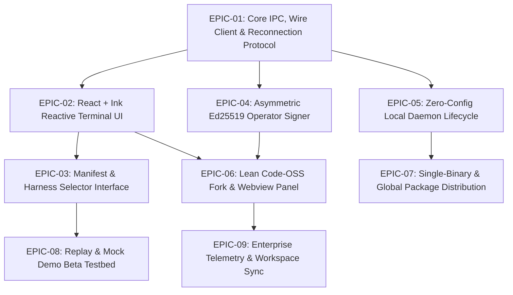

# Vanguard Frontend & Interaction Plane — Master Backlog & Roadmap

**Document ID:** `VG-FE-001`  
**Version:** `0.4.1-beta`  
**Status:** `Normative / Authoritative`  
**Owner:** `Tech Lead & Project Lead`  
**Target Systems:** `TypeScript CLI / TUI (@vanguard/cli)`, `Code-OSS / VSCodium Fork (Vanguard IDE)`, `Daemon IPC Client`

---

## 1. Executive Summary & Vision

The Vanguard Frontend & Interaction Plane provides a **dual-surface, developer-first environment** for deterministic, capability-governed agentic coding:
1. **Headless & Terminal Surface:** A high-performance, reactive Terminal User Interface (TUI) and command-line tool (`vg`) built in TypeScript with React and Ink, executing over an isolated Unix Domain Socket (UDS) / Named Pipe.
2. **Integrated IDE Surface:** A debloated, telemetry-free **Code-OSS / VSCodium fork** embedding the Vanguard Interaction Plane into the native workbench as a secondary panel and inline code lens/diff reviewer.

This backlog governs the construction of both surfaces, ensuring zero drift from the core microkernel contracts ([`04_vanguard_core_contracts_and_wire_schema_v040.md`](file:///home/rocha/Coding/Aether-D-System/docs/main_v4/04_vanguard_core_contracts_and_wire_schema_v040.md)), full compatibility with asymmetric Ed25519 operator signing ([`ADR-0062`](file:///home/rocha/Coding/Aether-D-System/docs/main_v4/09_vanguard_decision_register_v040.md#L181)), and self-contained zero-prerequisite distribution.

---

## 2. Epics Overview & Dependency Lattice

---

## 3. Detailed Sprint Epics & User Stories

### EPIC-01: Core IPC, Wire Client & Reconnection Protocol
*Goal: Provide a rock-solid, type-safe TypeScript client over Unix Domain Sockets (Linux/macOS) and Windows Named Pipes that parses NDJSON wire envelopes according to JSON Schema 2020-12.*

* **US-101: Resilient UDS / Named Pipe Socket Adapter**
  * **Description:** Implement `LiveDaemonClient` with auto-reconnection, exponential backoff (100ms $\to$ 5000ms), and framed NDJSON stream buffering.
  * **Acceptance Criteria:** Survives daemon crashes and restarts without terminating the UI process; replays pending subscriptions upon reconnection.
  * **Target File:** [`vanguard/clients/cli/src/adapters/live.ts`](file:///home/rocha/Coding/Aether-D-System/vanguard/clients/cli/src/adapters/live.ts)

* **US-102: Wire Contract Validation & Deserialization**
  * **Description:** Integrate TypeScript schema validators for all wire verbs (`StartRun`, `GetRun`, `StreamEvents`, `ResolveApproval`, `Cancel`, `Resume`) ensuring 100% vector parity with the Python runtime.
  * **Acceptance Criteria:** Passes all `test/contracts/` reader vectors with zero schema drift.
  * **Target File:** [`vanguard/clients/cli/src/contract/validators.ts`](file:///home/rocha/Coding/Aether-D-System/vanguard/clients/cli/src/contract)

* **US-103: Heartbeat & Backpressure Control**
  * **Description:** Implement ping/pong heartbeat interval (5s) and sliding-window event buffer to prevent UI memory blowup during heavy tool streaming.
  * **Acceptance Criteria:** Memory consumption remains $< 120\text{ MB}$ under a 10,000 events/minute burst.

---

### EPIC-02: React + Ink Reactive Terminal UI (`vg`)
*Goal: Deliver a state-of-the-art interactive TUI offering Claude Code-level fluidity, rich diffs, token gauges, and responsive keystroke handling.*

* **US-201: Live Stream Token & Thought Chunk Formatter**
  * **Description:** Build reactive components that render live streaming reasoning (`<Thinking>`), markdown text, and ANSI syntax-highlighted code blocks.
  * **Target File:** `vanguard/clients/cli/src/ui/StreamRenderer.tsx`

* **US-202: Unified Git & File Diff Viewer Component**
  * **Description:** Render 2-column or unified terminal diffs showing additions (+), deletions (-), and context lines with line numbers and syntax highlighting.
  * **Target File:** `vanguard/clients/cli/src/ui/DiffViewer.tsx`

* **US-203: Real-Time Token & Budget Gauge**
  * **Description:** Visualize L1–L5 prompt context layer sizes, token limits, and spend metrics updated per turn from ledger events.
  * **Target File:** `vanguard/clients/cli/src/ui/BudgetMeter.tsx`

* **US-204: Interactive Keybinding Engine & Multiline Input**
  * **Description:** Provide multiline prompt input with syntax navigation, tab-completion for `/commands` (`/plan`, `/run`, `/replay`, `/manifest`), history buffer, and fast escape sequences.
  * **Target File:** `vanguard/clients/cli/src/ui/PromptInput.tsx`

---

### EPIC-03: Manifest & Harness Selector Interface
*Goal: Enable dynamic discovery, switching, and configuration of agent manifests and capability genes directly from the UI.*

* **US-301: Manifest Discovery & Schema Explorer**
  * **Description:** Query the daemon for active and registered manifests (`vg-code-default`, `vg-code-swe-mini`, `vg-shell-only`) and render their capabilities and tool permissions in a clean terminal card.
  * **Target File:** `vanguard/clients/cli/src/application/ManifestExplorer.ts`

* **US-302: Parameter & Budget Customization Prompt**
  * **Description:** Allow user to tune max turns, context ceiling, timeout, and model routing per run through interactive terminal prompts.

---

### EPIC-04: Asymmetric Ed25519 Operator Signer
*Goal: Provide a secure, isolated operator approval authority outside the Python runtime process to fulfill `ADR-0062` and `REQ-APP-001`.*

* **US-401: Ed25519 Local Keypair Provisioning**
  * **Description:** Generate or load operator keys from `~/.vanguard/keys/operator.ed25519` with restricted filesystem permissions (`0600`).
  * **Target File:** [`vanguard/clients/cli/src/adapters/signer.ts`](file:///home/rocha/Coding/Aether-D-System/vanguard/clients/cli/src/adapters/signer.ts)

* **US-402: Canonical RFC 8785 Descriptor Signing**
  * **Description:** When an approval request event is received from the daemon, prompt the user (Allow/Deny/Modify), serialize the exact canonical descriptor bytes, sign with private key, and return the signature envelope over NDJSON RPC.
  * **Acceptance Criteria:** Python runtime verification must pass with zero signature or canonicalization mismatch.

---

### EPIC-05: Zero-Config Local Daemon Lifecycle
*Goal: Eliminate manual setup by having the CLI/TUI automatically supervise and manage the local Python runtime daemon.*

* **US-501: Invisible Daemon Supervisor Process**
  * **Description:** If the local socket is not alive upon launching `vg`, spawn `python3 -m vanguard.packages.runtime.service.server` as a detached daemon process, redirecting logs to `~/.vanguard/logs/daemon.log`.
  * **Target File:** `vanguard/clients/cli/src/runtime/daemon-supervisor.ts`

* **US-502: Graceful Termination & Orphan Reaper**
  * **Description:** Provide health checks, lockfile management (`~/.vanguard/run/daemon.pid`), and a `/shutdown` command to safely terminate background engines.

---

### EPIC-06: Lean Code-OSS Fork & Webview Panel (Vanguard IDE)
*Goal: Fork Code-OSS/VSCodium, remove all telemetry and bloat, and embed Vanguard as a native right-panel AI copilot.*

* **US-601: Code-OSS Scrubbing & Branding Pipeline**
  * **Description:** Build scripts to strip Microsoft telemetry endpoints, Microsoft marketplace URLs, and proprietary assets, substituting clean Vanguard branding and Open-VSX registry.
  * **Target Directory:** `vanguard/ide/build-scripts/`

* **US-602: Native Vanguard Webview Sidebar Panel**
  * **Description:** Implement a dedicated VS Code extension that renders the React UI inside the secondary sidebar panel, listening to the local Vanguard socket.
  * **Target Directory:** `vanguard/ide/extensions/vanguard-panel/`

* **US-603: Bidirectional Workspace & Context Sync**
  * **Description:** Inject active file path, editor selection, dirty buffers, and git diffs directly into the Vanguard prompt context bar on every turn.

* **US-604: Inline Diff & CodeLens Reviewer**
  * **Description:** Highlight proposed agent edits directly in the active VS Code editor with inline "Accept / Reject / Sign" buttons bound to the Ed25519 signer.

---

### EPIC-07: Single-Binary & Global Package Distribution
*Goal: Package the system for instant one-line installation across Linux, macOS, and Windows.*

* **US-701: Global NPM Package (`@vanguard/cli`)**
  * **Description:** Publish `@vanguard/cli` with standalone executable binary entry point `vg`.
* **US-702: Zero-Dependency Shell Installer (`curl | sh`)**
  * **Description:** Provide `install.sh` script that downloads pre-compiled self-contained bundles (Node SEA + embedded Python) into `~/.vanguard/bin`.
* **US-703: Windows MSI & Desktop App Image**
  * **Description:** Build single installer packaging Tauri desktop shell + embedded runtime engine for non-technical users.

---

### EPIC-08: Replay & Mock Demo Beta Testbed
*Goal: Enable immediate end-to-end testing and stakeholder demonstrations without live API keys or remote network calls.*

* **US-801: Deterministic Replay Adapter**
  * **Description:** Implement `ReplayAdapter` reading recorded `.jsonl` session fixtures (`fixtures/sessions/`) at configurable playback speeds (1x, 2x, instant).
  * **Target File:** [`vanguard/clients/cli/src/adapters/replay.ts`](file:///home/rocha/Coding/Aether-D-System/vanguard/clients/cli/src/adapters/replay.ts)

* **US-802: Interactive Mock Harness (`vg --demo`)**
  * **Description:** Provide out-of-the-box interactive mock scenarios demonstrating multi-step code generation, automated test execution, and operator approval flows.

---

## 4. Release Milestones & Gate Criteria

| Milestone | Target Scope | Verification Gate |
| :--- | :--- | :--- |
| **M0: Mock Beta TUI** | Ink TUI + Replay Adapter + Mock Signer | 100% green UI unit tests; interactive mock demo executes cleanly |
| **M1: Live Daemon Integration** | Live UDS client + Asymmetric Signer + `vg-shell-only` | Real bash tool execution via local Python daemon over socket |
| **M2: Zero-Config CLI Release** | Auto-spawn daemon + Global npm release + curl installer | Fresh VM installation passes `curl \| sh` and executes coding task |
| **M3: Code-OSS Desktop Beta** | Debloated VSCodium + Vanguard Webview + Context sync | E2E task editing workspace files with live editor diff updates |
| **M4: Enterprise SOTA Delivery** | MSI/AppImage packaging + Audit log stream + Multi-platform CI | 1,000 runs stability soak test, zero memory leaks, full audit compliance |
