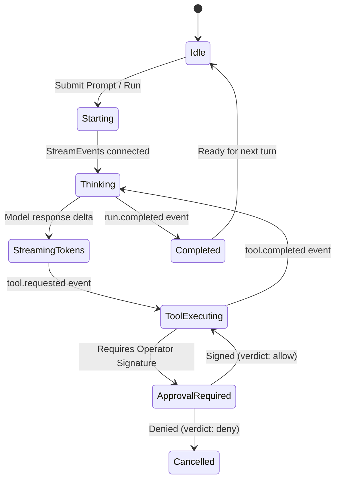

# Vanguard UI/UX Views & Interaction Workflows

**Document ID:** `VG-FE-004`  
**Version:** `0.4.1-beta`  
**Status:** `Normative / Authoritative`  
**Owner:** `Principal Product Designer & Frontend Lead`  
**Targets:** `Terminal TUI (React+Ink)`, `IDE Webview Panel (Code-OSS / VSCodium)`

---

## 1. Design Philosophy & Aesthetic Principles

The Vanguard frontend is built around **Function-Driven Precision and Zero-Fluff Utility**:
* **High-Density Legibility:** Optimized for reading dense diffs, terminal traces, and model reasoning without clutter.
* **Curated Terminal Palette:** Deep neutral backgrounds with high-contrast text and semantic accents:
  * **Neutral Base:** Background `#0E1116`, Border `#262C36`, Muted Text `#6E7681`, Primary Text `#E6EDF3`.
  * **Semantic Accents:** Success `#2DA44E` (Green), Caution `#BF8700` (Amber), Critical/Deny `#CF222E` (Red), Info/Thinking `#0969DA` (Deep Blue), Tool Execution `#8250DF` (Indigo muted).
* **Strict Anti-Cliché Rules:** No purple-on-dark neon glow, no particle meshes, no bloated decorative cards, no unaligned tracking.

---

## 2. Terminal UI (TUI) Layout Specification (`React + Ink`)

```
┌─────────────────────────────────────────────────────────────────────────────┐
│ ⚡ VANGUARD v0.4.1-beta │ MANIFEST: vg-code-swe-mini │ RUN: #run_01HPX94K     │
│ Context: [L1-L4: 14.2k tokens (Cache Hit: 89%)] │ Budget: $0.18 / $5.00     │
├─────────────────────────────────────────────────────────────────────────────┤
│                                                                             │
│  [20:04:12] Thinking...                                                     │
│  │ The unit test in test_dispatch.py failed because the canonical mapping   │
│  │ for proc.exec was missing an alias lookup. I will inspect the file first.│
│                                                                             │
│  ⚙ Tool Call: fs.read_file(path="vanguard/packages/kernel/dispatch.py")      │
│  ✓ Result: 347 lines read (exit 0)                                          │
│                                                                             │
│  Proposed Modification: vanguard/packages/kernel/dispatch.py                │
│  ─────────────────────────────────────────────────────────────────────────  │
│  @@ -82,6 +82,7 @@ def resolve_tool(alias: str) -> str:                    │
│       if alias in REGISTRY:                                                 │
│           return REGISTRY[alias].canonical_name                             │
│  +    if alias in ALIASES:                                                  │
│  +        return ALIASES[alias]                                             │
│       raise UnknownToolError(alias)                                         │
│  ─────────────────────────────────────────────────────────────────────────  │
│                                                                             │
├─────────────────────────────────────────────────────────────────────────────┤
│ 🛡 OPERATOR APPROVAL REQUIRED (High Risk Action)                             │
│ Tool: proc.exec | Command: 'git commit -m "fix(kernel): resolve aliases"'   │
│ [A] Accept & Sign (Ed25519)   [D] Deny   [E] Edit Command   [?] Details     │
├─────────────────────────────────────────────────────────────────────────────┤
│ > [Prompt Input Area: Type /plan, /run, /manifest, or prompt...]            │
└─────────────────────────────────────────────────────────────────────────────┘
```

---

## 3. IDE Webview Sidebar Panel (Vanguard for VS Code)

In the Code-OSS fork, the Vanguard interaction plane lives in the **Secondary Sidebar (Right Panel)**:

```
┌───────────────────────────┬────────────────────────────────┬──────────────┐
│  PROJECT EXPLORER         │  MAIN CODE EDITOR (Monaco)     │ VANGUARD AI  │
│  📁 vanguard/             │                                │ ⚡ vg-code    │
│    📁 packages/           │  82  def resolve_tool(alias):  ├──────────────┤
│      📁 kernel/           │  83      if alias in REGISTRY: │ 💬 Session   │
│        📄 dispatch.py     │  84          return REGISTRY.. │ Fix bug in   │
│    📁 clients/            │ +85      if alias in ALIASES:  │ test_dispatch│
│      📁 cli/              │ +86          return ALIASES[..]├──────────────┤
│                           │  87      raise UnknownTool...  │ ⚙ Tool Exec  │
│                           │                                │ fs.read_file │
│                           │  [Inline CodeLens: Accept|Deny]│ proc.exec    │
│                           │                                ├──────────────┤
│                           │                                │ [Input Bar]  │
└───────────────────────────┴────────────────────────────────┴──────────────┘
```

### Key IDE Interaction Features:
1. **Active Editor Context Sync:** The prompt bar displays the currently active file, selected text range, and branch: `Context: dispatch.py (L80-90) | branch: main`.
2. **Inline Diff Decoration:** Proposed code changes are rendered directly in the editor using VS Code's native diff editor decorations (green/red background highlights) rather than forcing the user to copy-paste.
3. **One-Click CodeLens Approval:** Operators can click `[Accept & Sign]` directly above the code diff in the editor, triggering the local Ed25519 signing flow.

---

## 4. Interaction State Machine



---

## 5. Visual Component Hierarchy (React / TypeScript)

```
<AppContainer>
  ├── <StatusBar>
  │     ├── <ConnectionBadge isOnline={connected} />
  │     ├── <ManifestSelector activeManifest={manifest} />
  │     └── <BudgetGauge spent={spend} limit={budget} cacheHitRate={cacheRate} />
  │
  ├── <EventScrollView ref={scrollRef}>
  │     ├── <TurnBlock turn={turnIndex}>
  │     │     ├── <ThinkingCollapsible content={reasoningDelta} />
  │     │     ├── <MessageBubble role="agent" content={tokenStream} />
  │     │     ├── <ToolCallCard toolName={name} args={args} status={status} />
  │     │     └── <DiffViewer patch={diffPatch} />
  │     └── </TurnBlock>
  │
  ├── <ApprovalModal isOpen={needsApproval} descriptor={approvalReq}>
  │     ├── <ActionSummary command={actionDesc.command} risk={riskLevel} />
  │     ├── <DiffPreview patch={actionDesc.diff} />
  │     └── <KeybindingActions onAccept={handleSign} onDeny={handleReject} />
  │
  └── <PromptBar>
        ├── <ContextPills activeFile={file} selection={range} />
        └── <MultilineTextInput onSubmit={handleStartRun} onCommand={handleSlashCmd} />
```
