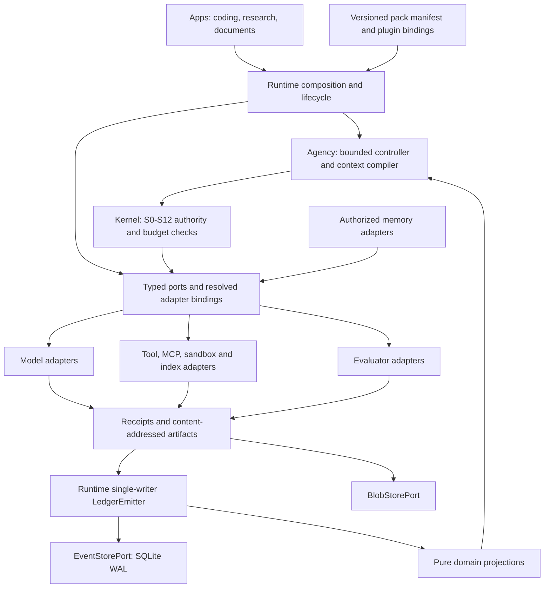

# The "Modular Hardware" Substrate Architecture Specification

## 1. Executive decision and evidence boundary

AETHER should retain its event-sourced hexagonal substrate and make its existing extension seams operationally interchangeable. The architecture selected here is a composition-frozen execution bus, one durable controller per task, a bounded context compiler, and replaceable adapters. The immediate work is integration and reliability, not a larger kernel or another agent framework. Models act as compute devices, context as working RAM, artifacts as storage, and ports as typed connectors. The analogy stops at authority: plugins do not receive unrestricted direct memory access to the host or ledger.

This report records executive design decisions for subsequent blueprints. It is intentionally non-canonical: implementation contracts must be promoted into the existing execution specification and mapped architecture owners. It neither accepts milestones nor rewrites the active execution board. The inspected source revision is `b93abfa24b094fd7b2942b70f0d039c265322bcc`; no production code changes are part of this review.

Navigation used the repository's LDA skill, `lda doctor`, and a 3,000-token task plan, followed by targeted source ranges. Doctor reported `index_healthy: true`, 2,092 files, and 10,694 symbols at the inspected HEAD. These differ from the prompt's illustrative counts. The knowledge catalog reports `VALIDATED` and nonzero counts, but its older timestamp supplies no independent current-source digest; mapped paths were checked against source. The refreshed development summary reports 1,386 TCB LOC, leaving 52 below the 1,438 ceiling. Generated inventories and historical failure-string counts are routing aids, not benchmark measurements.

The main evidence anchors are [ContextCompiler](../../../../vanguard/packages/agency/context/compiler.py), [compaction strategies](../../../../vanguard/packages/agency/context/compaction.py), [SPI contracts](../../../../vanguard/packages/ports/spi.py), [composition](../../../../vanguard/packages/runtime/compose.py), [wiring](../../../../vanguard/packages/runtime/wiring.py), [semantic task state](../../../../vanguard/packages/domain/task_state.py), and [agency architecture](../../../backend/architecture/agency.md). The [execution specification](../../../execution/spec.md) already calls for durable task state, model-neutral routing, and completion backed by fresh verification. This design consolidates that direction.

## 2. Substrate and bus architecture

Adopt one composition root that resolves a manifest into immutable component bindings, schema versions, configuration digests, and capability requirements. Retain `ModelPort`, `IndexPort`, event/blob storage ports, and the existing planner, context, toolkit, and memory SPIs. Introduce a new public port only where existing contracts cannot express a separately replaceable responsibility. A protocol per helper function would enlarge the compatibility burden without creating useful modularity.

The following diagrams define the selected target interaction architecture. Arrows represent calls, effects, or evidence flow, not Python import permissions. Imports must separately preserve inward dependency rules; adapters implement ports and never import agency or kernel.



```text
Apps + pack manifest
         |
Runtime composition -------- typed/versioned component bindings
         |
Agency controller + context <---- pure state fold <---- durable events
         |                                                ^
Kernel authority / budgets                                |
         |                                           LedgerEmitter
Ports -> model | tools/MCP | sandbox | evaluator            ^
         |                                                |
         +-------------- results / receipts --------------+
                              |
                      content-addressed blobs
```

The bus is a contract and lifecycle boundary, not a message broker. Keep local dispatch in process where appropriate; isolate effectful plugins according to the selected execution profile. Reject a mandatory distributed event bus, plugin microservices, or shared mutable blackboard daemon. They would introduce delivery ambiguity and operational dependencies before throughput evidence justifies them. Remote adapters remain possible behind the same contracts.

Define interchangeability through conformance tests: request/response schemas, error taxonomy, cancellation, timeouts, usage reporting, provenance, and lifecycle behavior. `typing.Protocol` establishes structural compatibility, not behavioral equivalence. A replacement model must preserve tool-call identities and account for partial usage; a replacement store must preserve ordering and conflict semantics. Pin executable plugin identity, not merely its display name or semantic-version range.

Interpret hot swapping as replacement at a quiescent execution boundary. Finish or reconcile outstanding effects, persist a checkpoint, validate the replacement, record the new composition identity, and resume in a successor segment. Never replace a live ledger writer, active transaction manager, or provider stream underneath an unresolved operation. Predeclared model routes may switch between calls with a recorded route decision. Changing the tool schema set or context policy starts a new prefix epoch. Storage migration requires a verified copy and cursor handoff, not pointer reassignment.

Keep compatibility negotiation explicit: supported schema versions, required capabilities, optional features, migration support, and failure behavior. Reject unknown required features before execution. A plugin may request narrower authority but cannot install grants, reopen settled reservations, or write its own acceptance events. Runtime owns composition and event emission; adapters own external mechanisms. Subprocess execution remains outside runtime source, in approved adapters or tooling, preserving N-06.

## 3. Compute and model routing

Choose one strong coding model as the reference configuration, plus deterministic retrieval and validation. Add a small routing policy as an optional measured optimization. Cheap-first cascades are not inherently economical: a malformed edit can consume more verification, repair, and context reconstruction than the initial inference saved. Syntax parsing, exact search, graph lookup, and diff validation should use deterministic tools rather than a small language model.

The existing [single planner](../../../../packs/code-default/planners/single_planner.py) exposes free/cheap/frontier tiers and verdict-triggered escalation, but `plan()` emits a fixed `src/app.py` repair body. It is evidence of a bounded SPI demonstration, not evidence of an effective model cascade. Its embedded pricing tuple should not become the product's route policy. Resolve models, availability, context limits, and prices through the repository's centralized registry and freeze the resolved configuration for each measured run.

Use three responsibilities rather than a proliferation of model personas: a primary implementer, an optional inexpensive reader for bounded extraction, and an optional stronger consultation for unresolved design or recovery. The reader returns source-bound facts; it neither certifies correctness nor commits changes. Escalation requires a typed trigger such as repeated distinct hypothesis failures, unresolved cross-module ambiguity, or persistent output-protocol errors. An ordinary failing test is expected during development and does not automatically trigger a more expensive model.

Route using expected cost per verified completion, latency limits, and remaining budget. Estimate the probability of avoiding another repair from held-out observations, not self-reported confidence. Reserve worst-case uncached input, output, time, and retry allowances before dispatch; settle observed usage afterward. Cache savings are realized discounts, never permission to underreserve. Cap route switches per task and persist their counters across restart. Provider transport failure and engineering failure must remain separate signals.

Evaluate strong-only, inexpensive-localizer/strong-implementer, and bounded escalation on the same tasks, contexts, tools, and verification rules. Adopt a cascade only when paired results show acceptable reliability and a worthwhile cost or latency improvement. Reject per-turn model voting, hidden speculative requests, and a learned router before enough clean data exists. The selected architecture supports these experiments without making any of them the default dependency.

## 4. Context and caching architecture

Preserve the existing L1–L5 compiler. `ContextCompiler.__init__` freezes system instructions, rendered tool schemas, and environment material. `compile()` protects the original brief and pinned L4 sources, adds a goal echo, computes candidate provenance, and compacts flexible material. These are strong foundations. The implementation is not an unbounded transcript concatenator and should not be replaced with one.

The remaining weaknesses are precise. Result eviction leaves a generic label/source/byte-count receipt, which is insufficient as the sole record of what was learned. Structured consolidation classifies text using words such as “failed” and “decision” and keeps short snippets; it does not reliably extract causal hypotheses or preserve structured evidence. Token estimates are not proof that a provider request fits. Sorting schema keys also does not stabilize the order of the schema list. Finally, a compiler breakpoint is metadata, not proof of a provider cache hit.

Adopt the following context pipeline:

1. Reconstruct authorized task state at a known event cursor and repository identity.
2. Reuse immutable L1–L3 bytes for the current composition epoch.
3. Render the exact brief and bounded critical state into L4, preserving source identities.
4. Retrieve targeted evidence against current file digests, with deduplication and explicit token allocation.
5. Append recent complete action/result units and the next-action/goal reminder in L5.
6. Elide superseded bodies, then remove low-value evidence and old complete interaction units.
7. Validate the final provider serialization against its input budget and record selection identity.

Budget from the provider's usable context window after reserving output, protocol overhead, and an estimation margin. Start with a conservative configurable margin and calibrate against observed usage by model and language; do not treat a character ratio as an exact tokenizer. Trigger compaction before saturation and compact to a lower watermark so consecutive turns do not repeatedly churn the same material. Suggested initial watermarks are 80% and 60% of the input allocation, explicitly experimental defaults.

Pinned material needs its own bounded policy. An indefinitely growing collection of “never evict” dead ends eventually makes every prompt impossible. Keep original requirements immutable in durable storage, preserve the essential constraint set verbatim, and select relevant structured dead ends by affected subject. Archive superseded records with retrievable identifiers. If the irreducible brief and constraints exceed the available input, return a typed budget failure or recompose with a suitable authorized model; never silently summarize away a requirement.

Stabilize the actual provider prefix, including tool ordering and request-shaping settings. Put timestamps, balances, new observations, and mutable workspace facts after the stable region. L4 notes may evolve, so the dependable cache boundary remains before changing material. An appended tool body belongs in dynamic context until a declared new composition epoch. Keep capability-card injection within the separate 4,096-character repository limit; that is not the total prompt-token budget.

OpenAI documents prefix-based caching with model-dependent controls and diagnostics; stable content should precede variable content. Claude documents exact matching through cache-control boundaries. Implement those differences in provider serializers, with negotiated limits and usage reporting; do not embed one vendor's breakpoint or retention rules in agency. Cache misses must preserve identical task semantics. [OpenAI prompt caching](https://developers.openai.com/api/docs/guides/prompt-caching) and [Claude prompt caching](https://platform.claude.com/docs/en/build-with-claude/prompt-caching) support this provider-specific treatment.

Record prefix digest, provider/model identity, serialization version, estimated and observed token counts, cache reads/writes when reported, compaction decisions, and uncached latency. A local prefix-stability test proves stable bytes only. Qualification must separately demonstrate that the selected adapter translates metadata correctly and that provider telemetry reports actual reuse. Never infer a fixed cost reduction from prefix stability alone.

## 5. Working memory and long-session focus

Choose a typed working-state projection backed by events, with a short recent interaction window. Reject flat dialogue as authoritative memory and reject unconstrained model-written blackboards. The existing `SemanticTaskState` already includes objective, constraints, hypotheses, discoveries, dead ends, changed files, verification, route decisions, recovery state, task steps, and repository identity. Extend and integrate this value rather than introducing a competing state schema.

Separate an observation, a hypothesis, a decision, and a verified fact. Each promoted fact needs an evidence reference, subject digest, and validity condition. A hypothesis may be proposed by the model; a test receipt can falsify it. A changed file invalidates claims depending on its previous digest. Confidence does not authorize an effect. Maintain an explicit next action and its reason so restart can resume useful work without reconstructing intent from prose.

Use structured receipts to replace noisy tool output. A test receipt should retain command identity, working directory, environment fingerprint, collection count, exit status, failing assertion signature, and stdout/stderr artifact references. A file-read receipt should retain path, content digest, selected range or symbol, and a retrievable blob reference. Do not claim the current compactor already provides these fields. The selected change is to consume structured observations before rendering, leaving compaction responsible for presentation rather than semantic discovery.

Model summaries remain optional navigation aids. They may compress a closed episode into candidate lessons, but they cannot overwrite the original objective, grant scope, remaining budget, or executed-test facts. Preserve failed approaches as structured claims tied to the repository version and triggering evidence. Revisiting one is legitimate after a relevant source or assumption changes; a global permanent prohibition would freeze learning around stale mistakes.

Long-session qualification should span at least 100 turns with forced compaction, changed evidence, approval suspension, and fresh-process continuation. Verify exact objective retention, budget monotonicity, unchanged settled-effect identities, reconstruction of the pending next action, and rejection of stale verification. Include deliberately misleading tool output that tries to rewrite the goal. Passing these tests demonstrates bounded state handling; it does not establish that every hundred-turn engineering task will succeed.

Anthropic's context-engineering guidance discusses compaction, structured notes, and selective retrieval as ways to manage long horizons. That supports testing a hybrid design, but the selection here comes from AETHER's durable-state and authority requirements rather than an assumption that narrative summarization is sufficient. [Effective context engineering](https://www.anthropic.com/engineering/effective-context-engineering-for-ai-agents).

## 6. Tools, MCP, and general agency

Expose browsers, terminal execution, repository intelligence, and external services through named toolkit verbs. Each binding specifies argument schema, result schema, effect class, timeout, resource selector, and retry/idempotency policy. LDA belongs behind `IndexPort` or a toolkit adapter, with revision-bound results. Code-pack policies interpret symbols and test failures; the kernel sees only generic actions, selectors, reservations, and receipts.

Use MCP as an adapter transport and discovery protocol, not an alternative authorization plane. Its client/server architecture and negotiated capabilities describe interoperability, not AETHER grants. Bind discovered tool schemas and server identity at composition, and treat server-originated updates as requests to revalidate bindings. [MCP architecture specification](https://modelcontextprotocol.io/specification/2025-06-18/architecture).

The [attenuation implementation](../../../../vanguard/packages/kernel/attenuation.py) rejects additional actions, uncovered resources, broader constraints, and excessive child depth. Preserve that mechanism unchanged. The MCP bridge must map each invocation to an existing authorized effect and validate the result envelope. A child may receive read access to a repository slice without credentials for its parent's remote services. Never expose a raw authenticated MCP session handle in model context.

Capability checks alone do not contain executable plugins. Enforce filesystem and network limits at the selected sandbox or service boundary. Resolve and constrain browser redirects, downloads, subprocess children, and server-side outbound calls as applicable. Classify externally fetched instructions as untrusted content. Propagate cancellation and deadlines; if a remote operation times out after dispatch, reconcile its operation identifier before retrying a potentially non-idempotent effect.

General agency becomes a pack choice: a research pack uses search, source capture, and citation checking; a document pack uses artifact transformations and output validation. They reuse context, budgets, durability, and completion admission. They do not inherit coding-specific “tests green” semantics. External publication remains a separately authorized effect, not an automatic consequence of generating a document.

## 7. Persistence and long-term memory

Retain SQLite WAL as the default event store and content-addressed blobs for large payloads. The [LedgerEmitter](../../../../vanguard/packages/runtime/ledger_emitter.py) remains the single writing authority. WAL supports concurrent readers; it does not authorize multiple independent writers to assign conflicting causal sequence numbers. Child workers submit facts through runtime-owned emission. Checkpoints accelerate replay and must bind reducer version, covered cursor, and artifact digest.

The logical event history is append-only under application rules, not physically immutable by virtue of SQLite. Durability additionally depends on synchronization policy, storage behavior, backups, and restore verification. Keep audit replay distinct from rerunning probabilistic model calls. An interrupted external effect requires reconciliation even when its intent is durably recorded; an event ledger cannot alone guarantee exactly-once behavior in another system.

Use the existing [memory contracts](../../../../vanguard/packages/ports/memory.py): knowledge, experience, project memory, and skill library already have authorization and retrieval-provenance mechanisms. Store reusable bug-fix lessons with repository identity, applicable versions, failure signature, successful patch reference, verification evidence, scope, and supersession status. Retrieval is advisory evidence, never a new instruction hierarchy. Project-local facts must not leak through cross-project search.

Begin with exact keys and lexical retrieval over structured records, then add semantic retrieval only where held-out recall improves. Rebuild embeddings from authorized source records; bind embedding and index versions to results. Reject a mandatory vector database and unrestricted self-modifying procedural memory. Candidate skills require governed evaluation and explicit promotion; failed promotions retain their evidence and support rollback. Revocation must apply at retrieval and cache boundaries, including previously materialized results.

The architectural acceptance criteria are therefore concrete: swap conforming adapters without kernel edits; resume task state from durable evidence; preserve authorized context through compaction; reconcile interrupted effects; and measure useful completion under fixed budgets. All proposed changes live in domain values, ports, agency, runtime composition, adapters, or packs. The planned kernel delta is zero LOC. Future implementation must still execute boundary, domain-blindness, isolation, and TCB checks before claiming preservation.

## 8. Operational qualification of modularity

Make replacement observable through a small compatibility matrix. Model qualification should replay the same tool-call fixture through each supported serializer and check equivalent normalized proposals, cancellation, and accounting. Context qualification should compile identical state twice and compare bytes and provenance, then change one dynamic observation and confirm that the stable prefix remains identical. Storage qualification should replay the same event sequence through the candidate backend and compare projection digests before enabling it for a continuing task.

Test negative cases as rigorously as successful swaps. A model without required structured-output support must be rejected or bound to an explicitly supported dialect. A context plugin that drops a pinned requirement must fail conformance. A storage adapter that acknowledges an append and loses it after process restart cannot satisfy the durable-history contract. A tool plugin that changes its schema after composition must not silently redefine an already authorized action.

Operational dashboards should distinguish adapter availability, contract conformance, task success, and evidence acceptance. A healthy process can still return invalid proposals; a correctly executed task can still fail its independent oracle. This separation makes incident handling actionable and prevents plugin health checks from becoming success claims.

For this documentation turn, direct boundary, TCB, domain-blindness, isolation-policy, document-metadata, and local-link checks passed. The TCB checker measured 1,386 LOC. Both `just check` and `just verify` were attempted but could not start because `just` is unavailable. Markdown lint also could not start because the installed dependency tree lacks the required `fast-glob` entrypoint. These limitations do not invalidate the source findings, but full repository qualification is not claimed.
