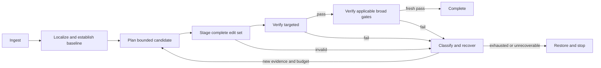

# SOTA Benchmark Mastery & Autonomous Topologies

> [!IMPORTANT]
> **Implementation Status & Lifecycle Classification (Current Head: `2989d57d` / September 2026)**:  
> This document specifies benchmark strategy, editing transactions, anti-stall loops, and topologies. The table below classifies each capability into its active implementation state:
>
> | Strategy & Engineering Domain | Lifecycle Classification | Current Implementation Truth |
> |---|:---:|---|
> | **Measurement & Control Discipline** (§1) | **`[NEXT - ACTIVE GATE]`** | Candidate `2989d57d` is unfrozen; [`T-26`](../../../execution/main/tasks.md#L605) (Freeze SHA & digests) and [`T-27`](../../../execution/main/tasks.md#L611) (30+ task live canary, Wilson $\ge 0.40$) are the immediate active gates. |
> | **Failure Modes & Veto Harness** (§2) | **`[DONE - INTEGRATED]`** | Hard veto on false completions (`fc == 0`) and separation of `abstained` vs `completed` delivered in [`test_metric_veto.py`](../../../../test/benchmarks/test_metric_veto.py) and [`entrypoint.py`](../../../../vanguard/packages/runtime/entrypoint.py) (Closed via `T-94`, `T-99`). |
> | **Brownfield LDA Localization** (§3) | **`[DONE - INTEGRATED]`** | Revision-bound graph retrieval and AST delta sync delivered via LDA protocol ([`.agents/skills/lda-navigator/`](../../../../.agents/skills/lda-navigator/SKILL.md)). |
> | **Multi-File Transactions & Patching** (§4) | **`[HYBRID]`** | In-memory atomic 2PC preflight & syntax checks are **`[DONE]`** ([`transaction.py`](../../../../vanguard/packages/adapters/environment/transaction.py)); exact-match `str_replace` (`T-78`) is **`[NEXT - TODO]`**; Virtual CAS workspace (`CAS-01` / `T-112`–`T-116`) is **`[PROPOSAL - EXPERIMENTAL]`**. |
> | **Verification Ladder & Admission** (§5) | **`[HYBRID]`** | Decoupled terminal states and receipt binding are **`[DONE]`**; reverse-caller admission check (`callers_by_symbol` / `T-83b`) is **`[NEXT - TODO]`**. |
> | **Greenfield Execution Strategy** (§6) | **`[PROPOSAL - EXPERIMENTAL]`** | Distinct greenfield specification and corpus qualification (`T-125`) remain post-control proposals. |
> | **Loop Engineering & Anti-Stall FSM** (§7) | **`[DONE - INTEGRATED]`** | Semantic progress tracking, stagnation detection (2-3 repeated actions), and recovery FSM delivered in [`protocol_recovery.py`](../../../../vanguard/packages/agency/episode/protocol_recovery.py) (Closed via `T-106`). |
> | **Topology: Controller vs Specialists** (§8) | **`[HYBRID]`** | Single receipt-driven controller default is **`[DONE]`**; Attenuated read-only specialists (`DEL-01` / `T-117`–`T-118`) and campaigns (`OCT-03` / `T-120`) are **`[PROPOSAL - EXPERIMENTAL]`**. |

## 1. Strategy and measurement discipline [CANONICAL DIRECTIVE]

Adopt one durable, receipt-driven controller as the default software-engineering topology. Let the model choose hypotheses and edits inside a finite-state workflow, while deterministic tools localize evidence, stage mutations, and run verification. Add bounded specialists only when the work can be separated into explicit artifact contracts. The principal investment is a reliable path from task specification to independently checked output, not a larger population of talking agents.

This report selects the execution strategy underlying the subsequent interface blueprints. It is a non-canonical architectural review of HEAD `b93abfa24b094fd7b2942b70f0d039c265322bcc`, not milestone acceptance or a published benchmark result. It complements [Part 1](part1_modular_hardware_architecture.md) and preserves the [agency architecture](../../../backend/architecture/agency.md) and [execution specification](../../../execution/main/spec.md). No live model benchmark was run for this review.

SWE-bench Verified is a human-filtered set of 500 repository issue instances. Aider's polyglot leaderboard evaluates 225 coding exercises and reports edit-format behavior alongside solution rates. These measure different capabilities: repository issue repair versus constrained multilingual implementation/editing. Neither is a complete greenfield product benchmark. Published leaderboard rows also mix models, harnesses, and resource choices; ranking alone does not identify which architectural feature caused a gain. [SWE-bench](https://www.swebench.com/) and [Aider leaderboard](https://aider.chat/docs/leaderboards/).

Treat “SOTA” as an empirical goal, not a component name. The SWE-agent research demonstrates that the agent-computer interface materially affects engineering performance. The SWE-bench site also highlights strong results from a minimal agent, which is evidence against assuming that elaborate topology is necessary. The inference for AETHER is to establish a clean single-controller baseline before adding complexity, not to claim that minimal agents always win. [SWE-agent paper](https://arxiv.org/abs/2405.15793).

Freeze task identifiers, repository commits, runtime SHA, model/provider identity, prompt and tool schemas, environment images, attempt limits, and budget envelope before comparing treatments. Separate development tasks from held-out evaluation. Preserve all attempted instances, infrastructure failures, missing outputs, and invalid datasets; report their denominators explicitly. Dry-run and cassette success can qualify protocol handling but cannot establish real-model task success or cost savings.

Use independent evaluation against the final patch, with tests unavailable to the agent where the benchmark requires that separation. Follow the official SWE-bench harness and dataset rules, including pinned evaluation environments. Local canaries are engineering evidence, not an official score. Report single-attempt resolve rate, total cost per resolved task, latency distribution, invalid-patch rate, regression rate, and failure attribution. [Official evaluation guide](https://www.swebench.com/SWE-bench/guides/evaluation/).

## 2. Failure modes that the harness must expose [DONE - VETO & RECOVERY WIRED]

Autonomous agents fail through interacting stages. Poor localization yields an irrelevant edit; a weak reproduction makes that edit appear plausible; incomplete verification accepts it; later context loss hides the original requirement. More model tokens do not automatically repair these feedback errors. AETHER should classify failure at the earliest evidenced stage while retaining downstream consequences.

| Failure | Architectural response | Required evidence |
| --- | --- | --- |
| Wrong subsystem or stale symbol | Revision-bound lexical and graph retrieval | Source digest, selected symbol, callers |
| Environment failure mistaken for bug | Separate setup and reproduction outcomes | Environment fingerprint and stderr |
| Plausible but incomplete patch | Declared change surface and transaction set | Expected versus actual changed paths |
| Invalid editing protocol | Strict parsing and preimage validation | Rejection before mutation |
| Green tests on obsolete code | Subject-bound verification admission | Postimage digest and execution cursor |
| Lost objective after compaction | Replayable semantic state and pinned brief | State digest before/after compaction |
| Repeated ineffective recovery | Persisted semantic cycle detection | Action, outcome, state and budget history |
| False reported success | Independent exterior oracle | Final artifact and evaluator disposition |

The repository already contains relevant mechanisms. [EpisodeEngine](../../../../vanguard/packages/agency/episode/engine.py) has bounded turns, repeated-action detection, protocol recovery, and completion restrictions. [SemanticTaskState](../../../../vanguard/packages/domain/task_state.py) contains plans, discoveries, falsified hypotheses, verification state, and recovery history. The missing proof is that the selected product composition uses these consistently across long, real tasks. Do not equate fields existing with end-to-end reliability.

Historical string-frequency tables in development logs are not failure rates. They can include repeated fixtures, generated files, and multiple mentions of one incident. Build failure attribution from one canonical task receipt per attempt, then inspect trajectories for causal diagnosis. This prevents optimization against the most frequently printed message rather than the most costly actual failure.

## 3. Brownfield localization and reproduction [DONE - LDA GRAPH RETRIEVAL]

Start by identifying the repository subject, task intent, applicable constraints, and permitted mutation surface. Preserve existing user modifications in the baseline. An isolated workspace is preferred for repair candidates because it protects the original tree and makes verification subjects unambiguous. Record the dirty baseline explicitly when legitimate; release qualification may separately require a clean subject.

Use LDA's token-bounded plan as the first retrieval bundle, then exact symbol slices and caller relationships. Combine error strings, test names, and identifiers through BM25 with bounded graph expansion. Graph centrality is a tie-breaker for connectivity, not proof that a heavily imported module contains the defect. Suppress irrelevant high-degree utilities and generated dependencies when they overwhelm task-specific evidence.

Retrieval must return repository identity, file digest, symbol/range, and relation provenance. Check those identities before patching. After edits, refresh the delta index and invalidate affected observations. If LDA is unavailable or stale, fall back to exact file search, targeted lexical search, source inspection, and executable tests. The agent must remain functional without a particular index backend; an index cannot override current source.

Bound localization by an evidence question. A useful first packet contains the suspected implementation, its closest caller, the relevant contract, and a falsifier. Widen only when the current hypothesis fails or missing context is explicit. Do not flood the prompt with complete dependency trees. Track whether each retrieval changed the candidate set or supplied a new constraint; repeated reads of unchanged content become a measurable stall signal.

Reproduction is the default gate before production mutation. Run the smallest existing test that exhibits the reported behavior, capturing collection count and failure signature. When no test exists, synthesize a regression test or deterministic reproducer from the issue's public behavior. Run it against the baseline and verify that it fails for the intended reason, rather than a missing package, invalid fixture, or syntax error in the new test.

Some tasks are refactors or extensions without an existing failure. Require a behavioral contract and a baseline regression suite instead of inventing a red test. For difficult nondeterministic bugs, use a bounded stress or controlled fault-injection reproducer and state its limits. If the environment cannot reproduce the issue, allow a clearly labeled hypothesis-driven candidate where policy permits, but withhold verified completion until applicable evidence exists.

Keep generated tests separate from protected benchmark oracles. Never weaken assertions, delete failing tests, or alter the evaluator to obtain a pass. Test changes can be legitimate when the requested contract changes, but require an explicit requirement-to-assertion explanation. The patch author may supply operational checks; independent evaluation remains responsible for benchmark acceptance.

## 4. Editing mechanics and multi-file transactions [HYBRID: PREFLIGHT DONE; CAS PROPOSAL]

Choose one strict edit-set representation with interchangeable frontends: digest-bound symbol replacements for precise Python edits, exact unique text replacements for small local changes, and a fully validated unified-diff parser for language-neutral changes. Use whole-file creation for genuinely new files and bounded rewrites where preserving a complicated old structure has no benefit. Do not let the model select a permissive fallback after an anchor failure.

The audit of [ast_patch.py](../../../../packs/code-default/toolkits/ast_patch.py) identifies concrete limitations. `_anchored()` compares a supplied “qualified” name to a node's simple name and permits an empty anchor digest. `_apply()` replaces the first matching text without requiring uniqueness. `_unified()` strips removed text and appends additions only in limited cases; it does not apply general hunks with validated positions and context. `compensate()` returns the receipt without restoring bytes. These paths must not be marketed as robust multi-file editing or rollback.

An anchored patch should identify the file digest, actual qualified symbol path, node kind, byte span, and expected span digest. Apply against the inspected preimage and parse the complete resulting file before staging. Decorators, nested same-name methods, Unicode offsets, and line endings need explicit treatment. ASTs guide localization and validation; their existence does not make textual replacement safe by itself.

Unified diffs should validate every hunk, expected context, path, and final newline convention before producing a candidate. Reject ambiguous or stale input as `PATCH_PREIMAGE_MISMATCH`. Return a fresh source slice so the model can regenerate the patch. Reject fuzzy application by default: silently finding “similar enough” code can create a syntactically valid edit in the wrong location.

The existing [AtomicMultiFileTransactionManager](../../../../vanguard/packages/adapters/environment/transaction.py) already snapshots bytes, performs Python syntax preflight, stages temporary files, and restores snapshots on a caught commit error. Its current [tests](../../../../test/runtime/test_atomic_multi_file_transaction.py) cover syntax failure before mutation and a valid five-file commit. This is useful implementation to extend, not a reason to create a second transaction engine.

Its guarantees have limits: snapshots are in memory, file replacements occur sequentially, and no test-verification callback or durable recovery journal appears in the inspected manager. A process death can leave a partial tree; a later failing test does not automatically restore it. A per-file atomic rename is not atomic publication of a repository. An exception during restoration also needs a first-class outcome rather than an assumed successful rollback.

Adopt isolated candidate workspaces with one mutating owner. Stage the complete edit set, reject duplicate or escaping paths, verify preimages, parse applicable languages, and run targeted checks on the staged subject. Bind the candidate digest and verification plan before promotion. This makes intermediate multi-file states private. Concurrent readers of the user workspace must not be promised atomic visibility unless a snapshot/pointer-switch mechanism actually provides it.

Promotion and rollback need durable preimage artifacts and a journal identifying intent, prepared candidate, verification, publishing progress, and final disposition. Persist recoverable preimages before modifying the destination. Preserve bytes, existence, executable mode, and relevant path metadata; define symlink and newly created directory handling. Use a workspace lock and compare the destination to the recorded baseline immediately before publishing. Conflicts with external edits must stop promotion rather than overwrite user work.

On failed falsifiers or exhausted repair budget, retain the failed candidate only as an isolated evidence artifact and restore the owned workspace to its baseline. Verify restoration digests before reporting rollback complete. If recovery cannot restore a path, quarantine the workspace and return an explicit recovery failure; “fail closed” means no further promotion or success claim, not pretending disk failures are impossible. Crash recovery must be idempotent across repeated interruptions.

## 5. Verification and completion admission [HYBRID: ADMISSION DONE; CALLER CHECK TODO]

Run verification in a ladder: patch shape and syntax; the reproducer; impacted module tests; then the applicable broader regression and architecture checks. Use caller/import relationships to select the middle tier, but let canonical repository instructions determine mandatory gates. Avoid rerunning an expensive full suite after every inspection-only turn. Conversely, any new edit invalidates verification whose subject no longer matches.

A valid receipt binds command arguments, working directory, environment/image identity, test selection, collection count, exit status, output artifacts, and final workspace digest. Zero collected tests do not establish success. A timeout is not an assertion failure. Existing baseline failures must be recorded and compared, not quietly excluded from the report. Hash relevant untracked source and configuration as part of the subject when they affect execution.

Completion requires all requirements addressed, the intended files present, no unfinished transaction, and fresh applicable verification after the latest accepted mutation. For analysis-only or documentation work, use an explicit completion policy with its own checks. For benchmark repair, an agent finish message is only a submission request; it cannot manufacture an oracle pass. The existing admission seam should enforce these distinctions through pack policy.

Reserve resources for verification and restoration before allowing a repair. A task that spends its last token producing an unverified patch has exhausted its usable budget even if the model could write more text. After a failed candidate, preserve its failure evidence before rollback so the next hypothesis benefits from the attempt. Bound repair rounds by both task budget and semantic progress, rather than a fixed count alone.

## 6. Greenfield execution strategy [PROPOSAL - EXPERIMENTAL CORPUS]

Greenfield work needs an explicit acceptance model because an empty repository offers no inherited tests or architecture. Convert the specification into observable behaviors, interfaces, constraints, and non-goals. Record an initial file/module blueprint and a requirement-to-check matrix. Keep decisions proportional: a small service needs a concise contract and vertical slice, not an invented enterprise architecture.

Bootstrap the test harness before broad implementation. Establish the interpreter/compiler version, package manifest, dependency policy, test discovery, and one failing behavioral acceptance check. Prove that the harness collects and executes that check. Select dependencies deliberately and freeze them for reproducible verification; an agent installing arbitrary latest packages between repair attempts destroys comparability.

Implement one runnable vertical slice across the required layers, then extend it incrementally. For an HTTP service, that may be request validation, one domain operation, persistence through a port, and a test that exercises the public endpoint. Define interfaces before delegating implementations so independently created files agree on names, error shapes, and ownership. Full-file generation is appropriate for new modules, but still enters the same staged edit-set and verification mechanism.

After each slice, validate imports/build, integration behavior, and requirement coverage. Include negative cases, clean-start behavior, configuration errors, and a smoke test from a fresh environment. Prevent placeholder success: a command that prints an expected string or a test that mirrors a constant is not proof that the requested system works. Use exterior acceptance checks designed from the specification independently of implementation choices.

Qualify greenfield separately from repository bugfixing. A useful frozen corpus varies specification ambiguity, number of modules, persistence, external-tool substitution, and deployment/configuration needs. Score runnable behavior, completeness, reproducibility, and resource use. Preserve failed bootstraps in the denominator. Do not label these results SWE-bench or infer product creation ability from Aider exercise scores.

## 7. Loop engineering and anti-stall policy [DONE - PROTOCOL RECOVERY FSM]

Preserve the generic engine and move domain-specific phase interpretation into the code pack. The selected state machine is outcome driven:

The current engine counts repeated proposal descriptors and equal outcome signatures within a bounded window, issues feedback, narrows offered tools, and eventually abandons. It carries prior turns and recovery state across reconstructed execution segments. Extend that implementation rather than adding another retry loop around it. In particular, comments about successful repeats must not obscure that current code also considers identical denial or suspension outcomes.

Add a semantic progress fingerprint: normalized action/arguments, relevant input digests, classified result, outstanding assertion set, and state revision excluding telemetry-only changes. Detect short cycles such as read-A/read-B/read-A and patch-X/revert-X/patch-X against unchanged evidence. A changed timestamp, receipt identifier, or verbose explanation is not progress. A newly isolated failing assertion or a disproved hypothesis can be progress even while tests remain red.

Use a configurable recovery ladder: first inject concrete evidence of repetition; next require a distinct hypothesis or targeted retrieval; then permit one budgeted stronger consultation; finally restore and stop with the unresolved question. Initial thresholds should be conservative and measured, for example three unchanged semantic outcomes in a six-action window. Persist counters so approval pauses, process restart, and model switching cannot reset the allowance.

Keep retry classes separate. Transient provider errors get bounded exponential backoff with jitter and deadline awareness. Deterministic assertion failures require reasoning or changed code, not sleep. Authorization denial must not be retried as though more patience grants authority. Pending long-running operations should be polled through their operation handle; repeated polling alone is not a stall while the external job legitimately remains active.

Track spending velocity, repeated retrieval, invalid patch rate, and compaction frequency as diagnostics. Do not terminate merely because a task has exceeded an average turn count. The real boundaries are authorization, finite budget, evidence of no progress, and recoverability. A 100-turn session should be possible when it makes progress; a ten-turn loop that repeats a settled failure should stop much earlier.

## 8. Topology choice and qualification [HYBRID: CONTROLLER DONE; SPECIALISTS PROPOSAL]

Refactor [DriveUntilGreenPlanner](../../../../packs/code-default/planners/single_planner.py) into the selected pack policy or replace its binding with the real planner implementation after tracing composition. Its fixed repair proposal, four-round default, and verdict-based tier bump do not constitute autonomous localization, multi-file synthesis, or verification. The harness references this planner identifier, but that alone does not prove every application execution uses this demonstration path.

Choose a single mutating controller with optional hierarchical read-only specialists. The FSM constrains transitions; it does not dictate the model's detailed reasoning. Specialists may investigate an independent subsystem, propose a reproducer, or critique a candidate. Each receives a task contract, input artifact digests, bounded budget, attenuated resources, and an expected output schema. The parent integrates findings and owns the canonical patch.

If parallel implementation later proves useful, give workers isolated candidates and explicit file ownership. The parent resolves conflicts and verifies the combined tree; passing worker tests do not prove integration. Child budgets must be reserved from the parent's available envelope, and cancellation must account for unsettled effects. All children use the existing canonical spawn/runtime lineage and the single event-writing authority.

Reject a standing critic committee, unrestricted recursive delegation, and multiple writers to a shared tree. Critic agreement is correlated model opinion, not independent acceptance. Invoke a reviewer only for a concrete risk or measured benefit, with access to evidence and a distinct evaluation question. Repository milestone independence requirements remain separate from simulated model roles.

Qualification compares the single controller against one bounded specialist treatment on identical tasks and total resource ceilings. Use paired task outcomes, repository-level breakdowns, confidence intervals, and repeated trials where model nondeterminism matters. Measure coordination tokens, merge failures, recovery correctness, and cost per verified completion. Retain extra topology only if its benefit survives those costs. This yields a modular autonomous substrate whose sophistication is earned by evidence and whose kernel remains unchanged.
