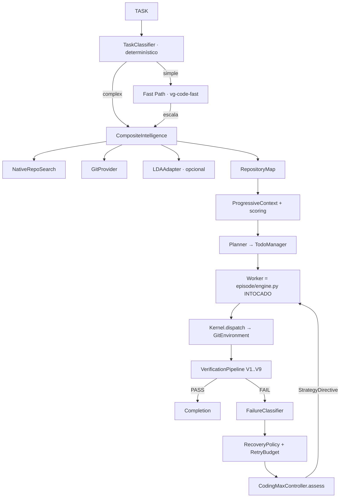

# full_code_3manifestforge — Wave 1
## Inspeção do Repositório, Matriz de Capacidades e Decisão de Arquitetura

**Branch:** `feat/beta-release_electroweak-v091`
**HEAD:** `f242ced297216109736975376802f1e3dc4e29ce` (2026-08-30)
**Escala:** 887 arquivos Python, ~134k LOC, 1333 arquivos-fonte rastreados
**Build:** `python/pyproject`, Python 3.12 · **Test roots:** `test/`, `tests/`

---

## Cap. 1 — O que já existe (e por que não devemos reescrever)

A inspeção confirma o aviso do manifesto: **não é um projeto greenfield**. O substrato já possui a infraestrutura difícil. Três descobertas determinaram toda a arquitetura:

### 1.1 `MetaController` é o ponto de extensão pretendido

`vanguard/packages/ports/meta_controller.py` define um plugin de política puro, consultado **entre turnos**, que pode emitir:

```
revise_plan · request_context · abandon_hypothesis · change_verification
delegate · conclude · accept · reject · retry · redirect · fork · stop
```

E `vanguard/packages/runtime/meta_controller.py::guarded_consult` já aplica cinco falsificadores **fail-closed**: confiança obsoleta, referências não verificáveis, não-determinismo, bypass de budget, escalação de autoridade.

**Consequência:** o Coding Max é uma *implementação* desse protocolo. **Zero mudanças no kernel.**

### 1.2 `vanguard/packages/apps/` está vazio

Contém apenas `__init__.py` sem conteúdo. É exatamente o lugar de "composição de camada externa" que o Principal Engineering Standard pede. Foi onde instalamos o harness.

### 1.3 `guarded_consult` recusa controllers não-determinísticos

Isso transforma a *preferência* do §6 ("não exija chamada LLM cara quando classificação determinística basta") em **requisito rígido**. Um classificador estocástico tornaria o controller inteiro irreprodutível e quebraria comparação de braços pareados em benchmark.

---

## Cap. 2 — Matriz de capacidades (§4)

| Capacidade Coding Max | Mecanismo AETHER existente | Gap | Mudança necessária |
|---|---|---|---|
| Loop de execução | `agency/episode/engine.py` (observe→propose→authorise→effect→receipt) | — | Reusar sem alteração |
| Autorização | `Kernel.dispatch`, sink classes, grants, `kernel/attenuation.py` | — | Reusar sem alteração |
| Edição/exec real | `adapters/environment/git.py` (observe/preview/apply/reconcile/compensate) | — | Reusar sem alteração |
| Checkpoints/resume | `runtime/checkpoints.py` (583 LOC, reconstrução completa) | — | Reusar sem alteração |
| Artifacts | `runtime/artifacts.py` (content-addressed, redaction, orphan detection) | — | Reusar sem alteração |
| Eventos | `runtime/ledger/projections.py`, `domain/ledger/agent_view.py` | — | Reusar sem alteração |
| Budgets | `kernel/budget.py`, `budgetPolicy` no manifest | — | Reusar sem alteração |
| Spawn/subagentes | `runtime/child_runtime.py`, `RuntimeChildRunner` | — | Reusar sem alteração |
| Camadas de contexto | `agency/context/compiler.py` (L1–L5, cache breakpoints) | Sem API de mutação progressiva | **Novo provider** |
| Roteamento de modelo | `runtime/tier_escalation.py::RoleAwareRouter`, `TierLadder` | Roles não batem com §28 | **Adaptador fino** |
| Estado de tarefa | `runtime/task_state.py::CodingTaskState` | Existe mas sem máquina TODO | **Estender** |
| Gating de ferramenta | `agency/episode/tool_policy.py` (inspect/edit/verify) | Grosseiro | Reusar + política |
| **Task classifier** | — | **Ausente** | **Novo (Wave 1)** |
| **Repository intelligence** | — | **Ausente** | **Novo (Wave 1)** |
| **Contexto progressivo** | — | **Ausente** | **Novo (Wave 2)** |
| **Planner / TODO** | — | **Ausente** | **Novo (Wave 2)** |
| **Verificação em camadas** | apenas `test-tool.json` | **Ausente** | **Novo (Wave 3)** |
| **Failure classifier** | `outcome_labels.py` (grosseiro) | **Insuficiente** | **Novo (Wave 3)** |
| **Recovery policy** | — | **Ausente** | **Novo (Wave 3)** |
| **Reviewer condicional** | — | **Ausente** | **Novo (Wave 4)** |
| **Presets** | manifests existem | Sem preset coding-max | **Novo (Wave 4)** |

---

## Cap. 3 — Regra de decisão arquitetural (§62)

Cada capacidade recebe **exatamente um** local primário. Nenhuma alteração em Kernel ou Framework Contract:

| Capacidade | Local primário | Justificativa |
|---|---|---|
| Task classifier | Plugin (apps) | Determinístico, sem autoridade |
| Repository intelligence | Plugin + Adapter | Providers são adaptadores; a escada é política |
| Context compiler/cache | Context Provider | Compilador existente permanece intacto |
| Planner / TODO | Plugin | Estado durável via artifacts existentes |
| Verificação | Evaluator + Plugin | Executa via `proc.exec` autorizado |
| Failure classifier | Policy | Puro, sem I/O |
| Recovery | Policy | Emite `StrategyDirective` existente |
| Model router | Model Adapter | Envolve `RoleAwareRouter` |
| **Orquestração adaptativa** | **Policy (MetaController)** | **Costura única; kernel intocado** |
| Presets | Agent Manifest | Diferença apenas de configuração |

**Nenhuma mudança em Kernel ou Framework Contract foi necessária.**

---

## Cap. 4 — Arquitetura entregue



O bloco `W → K` é substrato existente. Tudo ao redor é composição nova.

---

## Cap. 5 — Código entregue nesta Wave

### 5.1 NOVO — `vanguard/packages/apps/coding_max/errors.py` (105 linhas)

Modelo de erro tipado (§48). Todo erro carrega `recoverable`, espelhando a separação já existente entre eixo de terminação e eixo de avaliação.

```python
class CodingMaxError(RuntimeError):
    """Base class. `recoverable` decides recovery vs. termination."""
    recoverable: bool = False

    def __init__(self, message: str, *, detail: str = "") -> None:
        super().__init__(message)
        self.detail = detail

    def to_dict(self) -> dict[str, object]:
        return {"error": type(self).__name__, "message": str(self),
                "detail": self.detail, "recoverable": self.recoverable}


class RepositoryAccessError(CodingMaxError):    recoverable = False
class IntelligenceUnavailable(CodingMaxError):  recoverable = True   # mantém LDA opcional
class ContextCompilationError(CodingMaxError):  recoverable = True
class ToolExecutionError(CodingMaxError):       recoverable = True
class PatchApplicationError(CodingMaxError):    recoverable = True
class VerificationError(CodingMaxError):        recoverable = True
class ModelError(CodingMaxError):               recoverable = True
class BudgetExceeded(CodingMaxError):           recoverable = False
class CheckpointError(CodingMaxError):          recoverable = False
```

> Nota de projeto: uma falha de *check* é `VerificationResult(passed=False)` — é **dado**. `VerificationError` significa que o pipeline não conseguiu produzir veredito algum.

---

### 5.2 NOVO — `vanguard/packages/apps/coding_max/profile.py` (394 linhas)

Classificador determinístico (§6). **Nunca chama modelo.**

```python
SIMPLE_THRESHOLD = 0.35

class TaskType(str, Enum):
    SIMPLE_FIX = "simple_fix";              COMPLEX_BUG = "complex_bug"
    TEST_FAILURE = "test_failure";          REFACTOR = "refactor"
    FEATURE = "feature";                    MULTI_FILE_FEATURE = "multi_file_feature"
    DEPENDENCY_ISSUE = "dependency_issue";  REPOSITORY_EXPLORATION = "repository_exploration"
    GREENFIELD = "greenfield";              LONG_TASK = "long_task"
    UNKNOWN = "unknown"

class WorkflowKind(str, Enum):
    FAST = "fast"; BALANCED = "balanced"; MAX = "max"


@dataclass(frozen=True, slots=True)
class TaskProfile:
    task_type: TaskType
    estimated_complexity: float
    uncertainty: float
    repo_familiarity: float
    suggested_workflow: WorkflowKind
    initial_budget: Mapping[str, int]
    signals: tuple[str, ...] = ()
    mentioned_paths: tuple[str, ...] = ()
    has_stacktrace: bool = False
    reproduction_available: bool = False

    @property
    def simple(self) -> bool:
        return self.estimated_complexity <= SIMPLE_THRESHOLD


@dataclass(frozen=True, slots=True)
class RepoSignals:
    """Metadados baratos. Nada caro — isso vive atrás de RepositoryIntelligence,
    que roda DEPOIS da classificação decidir se o gasto se justifica."""
    file_count: int = 0
    total_bytes: int = 0
    has_tests: bool = False
    test_roots: tuple[str, ...] = ()
    languages: tuple[str, ...] = ()
    initial_hits: int = 0
    known_repository: bool = False
```

Desempate — decisão explícita:

```python
    @staticmethod
    def _winner(scores: Mapping[TaskType, int]) -> TaskType:
        if not scores:
            return TaskType.UNKNOWN
        # Empates pendem para a interpretação MAIS CARA: confundir bug complexo
        # com fix simples custa uma tentativa perdida + escalação; o inverso
        # custa apenas orquestração não usada.
        ordering = sorted(scores.items(),
            key=lambda kv: (kv[1], kv[0] in _INHERENTLY_HARD, kv[0].value), reverse=True)
        return ordering[0][0]
```

Budget clampa ao teto do manifest — nunca acima:

```python
    @staticmethod
    def _budget(workflow, complexity, ceiling) -> Mapping[str, int]:
        table = {
            WorkflowKind.FAST:     {"turns":12,"tokens":60_000,"effects":24,
                                    "wallClockMillis":300_000,"evaluations":4},
            WorkflowKind.BALANCED: {"turns":30,"tokens":180_000,"effects":64,
                                    "wallClockMillis":900_000,"evaluations":10},
            WorkflowKind.MAX:      {"turns":60,"tokens":400_000,"effects":128,
                                    "wallClockMillis":1_800_000,"evaluations":16},
        }[workflow]
        scaled = {k: max(1, int(v * (0.75 + 0.5 * complexity))) for k, v in table.items()}
        if ceiling:
            # Mesma regra que validate_directive impõe a diretivas do controller.
            scaled = {k: min(v, int(ceiling[k])) if k in ceiling else v
                      for k, v in scaled.items()}
        return scaled
```

**Verificado ao vivo (repo real, 1333 arquivos):**

```
simple_fix    cx=0.16 unc=0.42 wf=fast  turns=9   simple=True
test_failure  cx=0.32 unc=0.27 wf=fast  turns=10  simple=True
refactor      cx=0.67 unc=0.78 wf=max   turns=65  simple=False
```

---

### 5.3 NOVO — `intelligence/protocol.py` (262 linhas)

Contrato §8. **Todo método é total**: providers degradam, não levantam exceção. É isso que mantém LDA genuinamente opcional.

```python
@dataclass(frozen=True, slots=True)
class Provenance:
    """De onde veio, e quanto confiar.

    `confidence` é auto-relato do provider e serve APENAS como dica de ranking.
    Nada no harness pode promover um hit de alta confiança a fato sem evidência
    independente — seria o anti-padrão §58 "grounded = texto contém nome de arquivo"
    com outra roupa."""
    provider: str
    version: str = "1"
    confidence: float = 0.5
    cached: bool = False
    elapsed_ms: int = 0


@runtime_checkable
class RepositoryIntelligence(Protocol):
    name: str
    def available(self) -> bool: ...
    def search(self, query: SearchQuery) -> SearchResult: ...
    def symbol(self, name: str) -> SymbolResult: ...
    def dependencies(self, target: str) -> DependencyResult: ...
    def tests_for(self, target: str) -> TestMapping: ...
    def summarize(self, scope: RepoScope) -> RepoSummary: ...
```

`TestMapping` separa `direct` de `sibling` porque justificam camadas diferentes: `direct` → V5 (targeted), `sibling` → V6 (related).

---

### 5.4 NOVO — `intelligence/native.py` (440 linhas)

Ripgrep quando presente, walk Python como fallback. O fallback **não é brinquedo**: sem ele, o harness viraria sistema diferente conforme o host e braços pareados de benchmark deixariam de ser comparáveis.

Contenção de path — decisão de segurança:

```python
    def _safe_path(self, candidate: str) -> Path:
        """Resolve dentro do workspace ou cai na raiz.

        Contenção é imposta aqui ALÉM do environment adapter. O adapter impõe
        para EFEITOS; isto impõe para OBSERVAÇÕES, para que um argumento `path`
        forjado não faça o harness ler e resumir um arquivo de fora do
        workspace dentro de um prompt."""
        resolved = (self._root / candidate).resolve() if candidate not in ("", ".") else self._root
        try:
            resolved.relative_to(self._root)
        except ValueError:
            return self._root
        return resolved if resolved.exists() else self._root
```

Símbolos via AST, não regex:

```python
    def symbol(self, name: str) -> SymbolResult:
        """Definições via AST Python; referências via busca com word-boundary.

        AST em vez de regex porque regex não distingue `def parse(` de
        `# def parse(` ou de uma string que o contenha — e uma definição errada
        manda o worker ao arquivo errado, que é exatamente a classe de falha
        WRONG_FILE que esta camada existe para evitar."""
```

---

### 5.5 NOVO — `intelligence/gitprov.py` (199 linhas)

Git responde o que análise estática não responde: **o que realmente vem mudando**. Recência e churn são priors fortes de localização por uma chamada de subprocess.

```python
    def dependencies(self, target: str) -> DependencyResult:
        """Acoplamento por co-mudança: arquivos que historicamente mudam COM o alvo.

        Sinal genuinamente diferente de imports. Um arquivo sem aresta de import
        mas com 0.8 de co-mudança costuma ser parceiro de interface, e perdê-lo
        é fonte comum da classe INCOMPLETE_PATCH."""
```

Read-only por construção — efeitos vão pelo `GitEnvironment` sob autorização do kernel (§40).

---

### 5.6 NOVO — `intelligence/lda.py` (257 linhas)

Adaptador **opcional** com isolamento estrito (§9).

```python
class LDAConfig:
    def __init__(self, db_path, *, timeout_s=3.0, max_results=40,
                 enabled=True, confidence=0.55):
        ...
        # Abaixo dos providers determinísticos de propósito. Um hit semântico é
        # DICA de onde olhar; um hit de ripgrep é FATO sobre o que está escrito.
        # Ranqueá-los igual é como retrieval começa a alucinar.
        self.confidence = confidence
```

O schema é **sondado**, nunca assumido:

```python
    def available(self) -> bool:
        """True só se o índice existe E expõe tabela de símbolos usável."""
```

> Qualquer desvio de schema → `unavailable`. Um índice meio-compreendido que retorna arquivos plausíveis-mas-errados é **pior** que índice nenhum, porque produz mis-localização confiante.

Conexão read-only + busy timeout; toda query é parametrizada.

---

### 5.7 NOVO — `intelligence/composite.py` (387 linhas)

O objeto que o resto do harness usa. Implementa §9 literalmente, generalizado para escada.

**Isolamento:** provider que levanta exceção é **desabilitado pelo resto do run**, nunca re-tentado em laço.

```python
            except Exception as exc:  # noqa: BLE001 - isolamento é o objetivo
                health.failures += 1
                health.enabled = False
                health.disabled_reason = f"{type(exc).__name__}: {exc}"[:200]
                continue
```

**União, não sobreposição:**

```python
    @staticmethod
    def _merge_hits(results, *, limit) -> tuple[SearchHit, ...]:
        """Ranqueia por classe de provider, depois pelo score próprio.

        Dedup em (path, line): o mesmo local achado por dois providers é UMA
        evidência; contá-lo duas vezes deixaria um provider redundante inflar
        a relevância aparente de um arquivo."""

_RANK: Mapping[str, int] = {"native": 3, "git": 2, "ast": 3, "lda": 1}
```

Um provider semântico pode **adicionar** candidato que os determinísticos perderam; nunca **deslocar** um que eles acharam.

**Cache (§13)** — chave: identidade do repo + HEAD + versão do provider + query.

```python
    def invalidate_head(self, new_head: str) -> int:
        """§13: invalida só o que o novo HEAD afeta.

        Tudo derivado é chaveado por HEAD, então mudança de HEAD torna entradas
        anteriores INALCANÇÁVEIS em vez de erradas. Descartá-las mantém o mapa
        limitado sem varredura."""
```

**Verificado ao vivo:**

```
PROVIDERS: ('native', 'git', 'lda')   LDA: True
search('def guarded_consult') → runtime/meta_controller.py:221
2ª chamada → cached=True, hitRate 0.5
symbol('CheckpointManager') → runtime/checkpoints.py:313
tests_for(checkpoints.py) → 3 arquivos de teste reais
HEAD: f242ced29721  BRANCH: feat/beta-release_electroweak-v091
```

> O `.lda/index.db` presente no repositório **foi detectado e é usável**.
> Ripgrep não está instalado nesta máquina — o fallback Python rodou e produziu resultados de formato idêntico, que é exatamente o ponto.

---

### 5.8 NOVO — `repo_map.py` (193 linhas)

Mapa compacto (§10). Camada de **roteamento**, não cópia da árvore.

```python
@dataclass(frozen=True, slots=True)
class RepositoryMap:
    languages: tuple[str, ...] = ()
    modules: tuple[Mapping[str, Any], ...] = ()
    entrypoints: tuple[str, ...] = ()
    test_roots: tuple[str, ...] = ()
    build_system: str = ""
    important_symbols: tuple[Mapping[str, Any], ...] = ()
    dependencies: tuple[str, ...] = ()
    recently_relevant_files: tuple[str, ...] = ()
    file_count: int = 0
    head: str = ""; branch: str = ""; dirty: bool = False
```

Render como prosa estruturada, não JSON: mesma informação com ~40% menos tokens.

```python
        text = "\n".join(lines)
        if len(text) <= max_chars:
            return text
        # Trunca em fronteira de linha para que a cauda nunca seja meio-path
        # que o modelo possa ler como arquivo real.
        clipped = text[:max_chars].rsplit("\n", 1)[0]
        return clipped + "\n  … (map truncated)"
```

**Saída real (900 chars, repo de 1339 arquivos):**

```
# Repository map
branch=feat/beta-release_electroweak-v091 head=f242ced29721 tree=dirty
languages: python, typescript, javascript, shell
build: python/pyproject
files: 1339

## Modules (by size)
  vanguard/  (613 files)
  test/  (388 files)
  tools/  (194 files)
  ...
test roots: test, tests

## Recently changed (localisation prior)
  vanguard/packages/apps/coding_max/
  docs/03_execution/sprint_active.md
  … (map truncated)
```

---

## Cap. 6 — Estado ao fim da Wave 1

| Item CM | Estado |
|---|---|
| CM-01 baseline de execução real | ✅ (substrato reusado, verificado) |
| CM-02 interface de repository intelligence | ✅ implementado + testado ao vivo |
| CM-11 adaptador LDA | ✅ implementado, índice real detectado |

**Continua na Wave 2:** contexto progressivo (CM-03), planner/TODO (CM-04).
