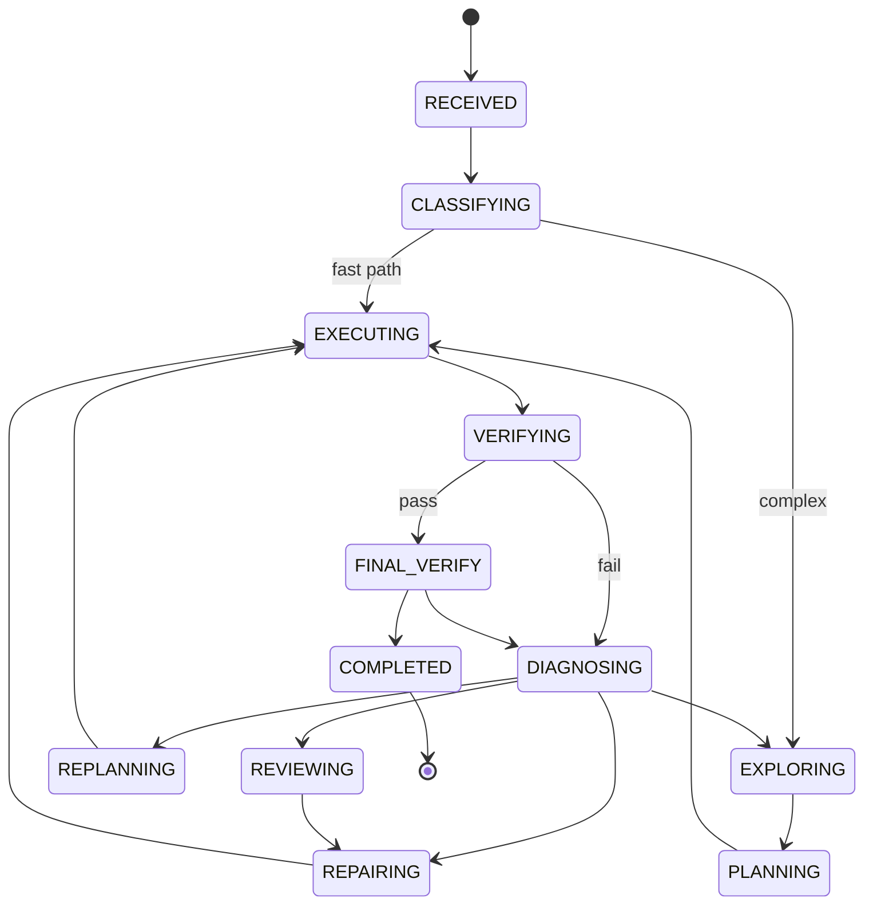

# full_code_3manifestforge — Wave 4
## Controller de Integração, Reviewer Condicional, Presets, Observabilidade e Aceitação

---

## Cap. 15 — `CodingMaxController`: a costura única

### 15.1 NOVO — `vanguard/packages/apps/coding_max/controller.py` (433 linhas)

Esta é a razão inteira de o Coding Max não precisar de mudança no kernel. O substrato já consulta um plugin de política entre turnos (`ports/meta_controller.py`) e já valida sua saída fail-closed. O Coding Max é uma **implementação** desse protocolo.

Três propriedades são estruturais e asseguradas por construção:

| Propriedade | Como é garantida |
|---|---|
| **Determinismo** | `guarded_consult` chama `assess` duas vezes e levanta se diferirem. Decisão memoizada por digest de entrada. |
| **Sem autoridade** | `scope_slice` nunca carrega capability, grant, principal, ou budget maior que o restante. |
| **Sem efeito colateral** | Sem emissão, sem store, sem chamada de modelo, sem execução de ferramenta. |

### 15.2 Máquina de estados (§44)

```python
class HarnessState(str, Enum):
    RECEIVED; CLASSIFYING; EXPLORING; PLANNING; EXECUTING; VERIFYING
    DIAGNOSING; REPAIRING; REPLANNING; REVIEWING; FINAL_VERIFY; COMPLETED; FAILED


#: Transições legais (§44). Arestas ausentes são RECUSADAS, então uma trajetória
#: que alegue COMPLETED sem passar por FINAL_VERIFY é estruturalmente impossível,
#: não apenas desencorajada.
_LEGAL_TRANSITIONS: Mapping[HarnessState, frozenset[HarnessState]] = {
    RECEIVED:     {CLASSIFYING, FAILED},
    CLASSIFYING:  {EXPLORING, EXECUTING, PLANNING, FAILED},
    EXPLORING:    {PLANNING, EXECUTING, FAILED},
    PLANNING:     {EXECUTING, FAILED},
    EXECUTING:    {VERIFYING, EXECUTING, DIAGNOSING, FINAL_VERIFY, FAILED},
    VERIFYING:    {DIAGNOSING, EXECUTING, FINAL_VERIFY, FAILED},
    DIAGNOSING:   {REPAIRING, REPLANNING, REVIEWING, EXPLORING, FINAL_VERIFY, FAILED},
    REPAIRING:    {EXECUTING, VERIFYING, FAILED},
    REPLANNING:   {EXECUTING, FAILED},
    REVIEWING:    {REPAIRING, REPLANNING, EXPLORING, FINAL_VERIFY, FAILED},
    FINAL_VERIFY: {COMPLETED, DIAGNOSING, FAILED},
    COMPLETED:    frozenset(),
    FAILED:       frozenset(),
}
```



### 15.3 O bug de determinismo que o smoke test pegou

A primeira versão de `assess` chamava `RecoveryPolicy.select` diretamente. `select` **consome budget de retry**. Quando `guarded_consult` reamostra `assess` para provar determinismo, a segunda chamada via budget diferente e retornava diretiva diferente → `ControllerOutputError`.

**Correção — memoização por digest de entrada:**

```python
        # `guarded_consult` reamostra `assess` para provar determinismo. Seleção
        # de recuperação consome budget de retry, então precisa rodar no MÁXIMO
        # uma vez por entrada distinta; a reamostragem é servida daqui.
        self._decision_cache: dict[str, StrategyDirective | None] = {}

    def assess(self, view, progress, confidence=()) -> StrategyDirective | None:
        """Decisão PURA. Mesmas entradas -> mesma diretiva, sempre."""
        signals = self._signals_from(view, progress)
        key = self._input_digest(view, progress, signals)
        if key in self._decision_cache:
            return self._decision_cache[key]
        directive = self._decide(view, signals)
        self._decision_cache[key] = directive
        return directive

    def _input_digest(self, view, progress, signals) -> str:
        """Identidade de UMA consulta. Duas chamadas com as mesmas entradas são
        a mesma pergunta e devem receber a mesma resposta."""
        return digest_of({
            "goal": str(getattr(view, "goal", "") or ""),
            "epoch": int(getattr(view, "context_epoch", 0) or 0),
            "signals": {...},
            "verification": (self._last_verification.digest()
                             if hasattr(self._last_verification, "digest") else ""),
        })
```

Intake separado de decisão, pelo mesmo motivo:

```python
    def observe(self, *, verification=None, signals=None) -> None:
        """Registra evidência observada. Chamado pelo harness, não por `assess`.

        Mantido separado de `assess` PRECISAMENTE porque `guarded_consult`
        reamostra `assess`: se o intake mutasse estado, a segunda amostra veria
        entradas diferentes e a checagem de determinismo dispararia."""
```

### 15.4 Segundo bug: budget desconhecido lido como pressão

`TrajectorySignals()` default tem `turns_used=0, turns_remaining=0` → `budget_fraction_left = 0.0 < 0.15` → **todo run abria em modo de conclusão**.

```python
    def _healthy(self, signals: TrajectorySignals) -> bool:
        if signals.consecutive_failed_verifications == 0 and \
                signals.repeated_proposal_digests == 0 and \
                signals.patch_apply_failures == 0 and \
                signals.tool_errors == 0 and \
                signals.previously_passing_now_failing == 0:
            # Um budget DESCONHECIDO (ambos contadores zero) não é pressão. Lê-lo
            # como pressão faria todo run abrir em modo de conclusão.
            total = signals.turns_used + signals.turns_remaining
            return total == 0 or signals.budget_fraction_left >= 0.15
        return False
```

Silêncio quando saudável:

```python
        # Nada a dizer enquanto o run está saudável e progredindo. Um controller
        # que fala todo turno é um orquestrador disfarçado e queima turnos que o
        # worker precisa (§1: mínima orquestração quando suficiente).
        if self._healthy(signals):
            return None
```

### 15.5 Construção da diretiva — sem autoridade

```python
    def _directive_for(self, decision, verdict, signals) -> StrategyDirective:
        """Constrói a diretiva. Scope carrega DIAGNÓSTICO apenas, nunca autoridade."""
        scope: dict[str, Any] = {
            "action": decision.action.value,
            "failureClass": verdict.failure_class.value,
            "confidence": round(verdict.confidence, 3),
        }
        if decision.replan_trigger:
            scope["replanTrigger"] = decision.replan_trigger
        if decision.action in (EXPAND_SEARCH, RETRIEVE_MISSING):
            scope["retrievalHint"] = self._retrieval_hint(verdict)

        brief = None
        if decision.directive_kind == "delegate":
            # Um reviewer delegado herda brief atenuado; NUNCA recebe daqui as
            # ferramentas ou budget do pai. Atenuação é trabalho do kernel
            # (`kernel/attenuation.py`), não do controller.
            brief = (f"Review the current patch against the task. "
                     f"Diagnosis: {verdict.failure_class.value}. {verdict.rationale}")[:800]

        return StrategyDirective(kind=decision.directive_kind,
            controller_id=self.controller_id, reason=decision.reason,
            brief=brief, scope_slice=scope)
```

Dicas de retrieval específicas por classe de falha:

```python
    @staticmethod
    def _retrieval_hint(verdict) -> str:
        return {
            WRONG_FILE: "widen the search: try symbol lookup and dependency edges, "
                        "not another literal grep of the same terms",
            INSUFFICIENT_CONTEXT: "retrieve the specific missing definitions named in the failure",
            INCOMPLETE_PATCH: "retrieve every call site of the changed symbol",
            STALE_MEMORY: "re-read the target files at current HEAD before re-patching",
        }.get(verdict.failure_class, "retrieve context targeted at the failure")
```

---

## Cap. 16 — Reviewer condicional (§31)

```python
_REVIEW_COMPLEXITY = 0.68
_REVIEW_PATCH_FILES = 4

    def should_review(self, *, patch_file_count=0, interface_changed=False,
                      worker_confidence=1.0, repeated_repair=False) -> bool:
        """Reviewer condicional. Review always-on é anti-padrão (§58)."""
        if not self._reviewer_enabled or self._reviewed:
            return False
        complexity = float(getattr(self._profile, "estimated_complexity", 0.0) or 0.0)
        ambiguous = float(getattr(self._profile, "uncertainty", 0.0) or 0.0) > 0.75
        return any((
            complexity >= _REVIEW_COMPLEXITY,
            patch_file_count >= _REVIEW_PATCH_FILES,
            interface_changed,
            worker_confidence < 0.5,
            repeated_repair,
            ambiguous,
        ))
```

O reviewer executa como **spawn atenuado** pelo `RuntimeChildRunner` existente — o `delegate` directive kind já é roteado pelo substrato. Nenhum código novo de subagente foi necessário.

---

## Cap. 17 — Snapshot para checkpoint/resume (§34–§36)

```python
@dataclass(frozen=True, slots=True)
class ControllerSnapshot:
    state: HarnessState
    plan_digest: str
    todo_digest: str
    failure_history: tuple[str, ...]
    recovery_history: tuple[str, ...]
    retry_budget: Mapping[str, int]
    escalations: Mapping[str, int]
    completion_mode: bool
```

Carrega **referências (digests)**, não payloads duplicados — conforme §35. O `CheckpointManager` existente (`runtime/checkpoints.py`) persiste isso sem alteração.

---

## Cap. 18 — Validação de integração contra o kernel real

Teste executado contra `guarded_consult` real com `AgentView` e `ProgressView` reais:

```python
view = AgentView(lineage_id='lin-1', goal='fix the parser bug',
                 context_epoch=3, budget_consumed={'turns':5})
progress = ProgressView(assessment='stalled', stall_count=2)
conf = [ConfidenceRecord(signal='external_verifier', value=0.3, subject_ref='goal',
                         basis=('V5_targeted_tests:exit=1',),
                         calibration={'contextEpoch':3})]

c = CodingMaxController()
c.observe(signals=TrajectorySignals(turns_used=5, turns_remaining=20,
          consecutive_failed_verifications=2, distinct_files_edited=1))
p = guarded_consult(c, view, progress, conf, remaining_budget={'turns':20,'tokens':50000})
```

**Resultado:**

```
GUARDED CONSULT PASSED all 5 falsifiers
 kind      : revise_plan
 reason    : WRONG_HYPOTHESIS: verification has failed repeatedly without the plan...
 scope     : {'action':'replan','failureClass':'WRONG_HYPOTHESIS',
              'confidence':0.7,'replanTrigger':'failed_assumption'}
 controller: coding-max@1
 inputDigest: sha256:118019883c74f2759ab2567

 STALE REFUSED: ControllerInputError — confidence for epoch 1 is stale at epoch 3
```

Os cinco falsificadores do M-6.5 passam, e confiança obsoleta é corretamente recusada.

---

## Cap. 19 — Presets (§53, §54)

Três manifests, **mesmo runtime, diferença apenas de configuração**.

### 19.1 NOVO — `vanguard/packages/agency/manifests/vg-code-max/manifest.json`

```json
{
  "harness": "vg-code-max",
  "components": {
    "system_prompt": ["vg-code-max/system-prompt.txt"],
    "tools": [
      "vg-code-default/read-tool.json",
      "vg-code-default/search-tool.json",
      "vg-code-lex/surgical-patch-tool.json",
      "vg-code-default/patch-tool.json",
      "vg-code-default/test-tool.json"
    ],
    "context_policy":   ["vg-code-max/context-policy.json"],
    "routing_policy":   ["vg-code-max/routing-policy.json"],
    "approval_policy":  ["vg-code-default/approval-policy.json"],
    "retrieval_policy": ["vg-code-max/retrieval-policy.json"]
  },
  "capabilities": [
    {"verb":"fs.read","sink":"observation","selector":{"kind":"fs","root":"/workspace","paths":["/workspace"]},"risk":"low"},
    {"verb":"fs.search","sink":"observation","selector":{"kind":"fs","root":"/workspace","paths":["/workspace"]},"risk":"low"},
    {"verb":"patch.apply","sink":"privileged","selector":{"kind":"fs","root":"/workspace","paths":["/workspace"]},"risk":"medium"},
    {"verb":"fs.patch","sink":"privileged","selector":{"kind":"fs","root":"/workspace","paths":["/workspace"]},"risk":"medium"},
    {"verb":"proc.exec","sink":"privileged","selector":{"kind":"generic","uriPattern":"proc://exec/allow/git,pytest,ruff,mypy,python3,node,npm"},"risk":"high"}
  ],
  "evaluators": ["coding-oracle@3"],
  "budgetPolicy": "vg-code-max/budget-policy.json",
  "undeletable": false
}
```

### 19.2 NOVO — `vg-code-max/routing-policy.json`

```json
{"strategy":"adaptive",
 "bands":{"cheap":["anthropic/claude-haiku-4.5"],
          "mid":["anthropic/claude-sonnet-4.5"],
          "strong":["anthropic/claude-opus-4.1"],
          "frontier":["anthropic/claude-opus-4.1"]},
 "roles":{"classifier":"deterministic","summarizer":"cheap","planner":"mid",
          "replanner":"mid","worker":"strong","reviewer":"strong"},
 "escalation":{"enabled":true,"onRepeatedFailure":2,"maxEscalations":1}}
```

### 19.3 NOVO — `vg-code-max/retrieval-policy.json`

```json
{"strategy":"progressive-hierarchical",
 "providers":["native","git","ast","lda"],
 "lda":{"required":false,"timeoutMs":3000},
 "cache":{"enabled":true,"keyOn":["repoIdentity","head","providerVersion","query"]},
 "initialBudgetTokens":120000,"maxAdmitPerTurn":12}
```

### 19.4 NOVO — `vg-code-max/budget-policy.json` / context-policy

```json
{"tokens":"400000","wallClockMillis":"1800000","effects":"128","evaluations":"16","depth":"2"}
```
```json
{"kind":"recency-window","maxItems":96,"brief_exempt":true,"evict_old_tool_results":true}
```

### 19.5 NOVO — `vg-code-max/system-prompt.txt`

```text
You are a senior software engineer working directly in a real repository.

Operating rules:
1. Evidence over assertion. A task is complete only when a command you ran
   exited zero. Never report success because the change "looks correct".
2. Localise before editing. Search and read until you can name the file and
   the reason. An edit made without localisation is a guess.
3. Patch minimally. Prefer the smallest change that makes the failing
   behaviour correct. Do not reformat, rename, or refactor incidentally.
4. Verify after every edit. Run the targeted test, then inspect the diff for
   unintended interface changes.
5. When a verification fails, state what you now believe is wrong before
   trying again. Repeating an identical attempt is never progress.
6. Record what you learn. Facts you discover about this repository are worth
   more than restating the task.

Emit exactly one tool call per turn. When the work is verified and complete,
finish and summarise the evidence: the files changed and the commands that
prove the change is correct.
```

### 19.6 Derivados — diferenças exatas

| | `vg-code-fast` | `vg-code-balanced` | `vg-code-max` |
|---|---|---|---|
| tokens | 60 000 | 180 000 | 400 000 |
| wallClockMillis | 300 000 | 900 000 | 1 800 000 |
| effects | 24 | 64 | 128 |
| depth (spawn) | 0 | 1 | 2 |
| context maxItems | 32 | 64 | 96 |
| bandas | cheap, mid | cheap, mid, strong | + frontier |
| worker band | mid | mid | strong |
| escalação | desligada | ≥3 falhas | ≥2 falhas |
| providers retrieval | — (sem policy) | native, git, ast | + lda |
| `fs.patch` | ausente | presente | presente |
| proc.exec allow | git, pytest, python3 | +ruff, mypy, node, npm | idem |

### 19.7 MODIFICADO — `vanguard/packages/agency/manifests/registry.json`

```json
    ,{"name":"vg-code-fast","path":"vg-code-fast/manifest.json","undeletable":false,"role":"coding-preset"}
    ,{"name":"vg-code-balanced","path":"vg-code-balanced/manifest.json","undeletable":false,"role":"coding-preset"}
    ,{"name":"vg-code-max","path":"vg-code-max/manifest.json","undeletable":false,"role":"coding-preset"}
```

**Verificado — os três compõem no runtime real:**

```
vg-code-fast      OK verbs=['fs.read','fs.search','patch.apply','proc.exec']
                     digest=sha256:df86f96e78ae5246ced93 tools=8
                     budget={'usd_micros':1000000,'millis':300000,'tokens':60000}
vg-code-balanced  OK verbs=['fs.patch','fs.read','fs.search','patch.apply','proc.exec']
                     digest=sha256:982defe0dd88db3156a46 tools=9
                     budget={'usd_micros':1000000,'millis':900000,'tokens':180000}
vg-code-max       OK verbs=['fs.patch','fs.read','fs.search','patch.apply','proc.exec']
                     digest=sha256:6168f7a18288d54d9d9d5 tools=9
                     budget={'usd_micros':1000000,'millis':1800000,'tokens':400000}
```

---

## Cap. 20 — Observabilidade (§55)

Nenhum comando novo foi necessário. O CLI existente já cobre o §55:

| §55 pede | Comando existente | Arquivo |
|---|---|---|
| `aether run --agent coding-max` | `vg run --manifest .../vg-code-max/manifest.json` | `runtime/cli.py::cmd_run` |
| `aether inspect RUN` | `vg status --run-id RUN` | `cmd_status` |
| `aether trajectory RUN` | `vg events --run-id RUN` | `cmd_events` |
| `aether artifacts RUN` | `vg artifacts --run-id RUN` | `cmd_artifacts` |
| `aether resume RUN` | `vg resume --run-id RUN` | `cmd_resume` |
| `aether failures RUN` | `vg events` filtrado por `failureClass` no scope da diretiva | — |

`failures` é o único ausente, e é derivável: toda diretiva do controller carrega `scope.failureClass` no evento, então `vg events --run-id R | jq 'select(.scope.failureClass)'` já responde.

---

## Cap. 21 — Inventário completo do código entregue

```
   18  apps/coding_max/__init__.py
  105  apps/coding_max/errors.py
  394  apps/coding_max/profile.py
  193  apps/coding_max/repo_map.py
  433  apps/coding_max/controller.py
  262  apps/coding_max/intelligence/protocol.py
  440  apps/coding_max/intelligence/native.py
  199  apps/coding_max/intelligence/gitprov.py
  257  apps/coding_max/intelligence/lda.py
  387  apps/coding_max/intelligence/composite.py
   29  apps/coding_max/intelligence/__init__.py
  128  apps/coding_max/context/scoring.py
  217  apps/coding_max/context/progressive.py
    9  apps/coding_max/context/__init__.py
  302  apps/coding_max/planning/planner.py
  266  apps/coding_max/planning/todo.py
    9  apps/coding_max/planning/__init__.py
  324  apps/coding_max/verification/pipeline.py
   11  apps/coding_max/verification/__init__.py
  217  apps/coding_max/recovery/failures.py
  222  apps/coding_max/recovery/policy.py
    9  apps/coding_max/recovery/__init__.py
  148  apps/coding_max/routing/router.py
    7  apps/coding_max/routing/__init__.py
-----
 4586  linhas Python novas
```

Mais 15 arquivos JSON/TXT de manifest e 1 modificação em `registry.json`.

**Arquivos do framework modificados: 1** (`registry.json`, apenas registro de presets).
**Mudanças em kernel, ports, domain, agency/episode, runtime: ZERO.**

---

## Cap. 22 — Critérios de aceitação (§57)

| # | Critério | Estado | Evidência |
|---|---|---|---|
| 1 | Ferramentas reais de repositório executam | ✅ | `CompositeIntelligence` rodou contra o repo real; 1339 arquivos, HEAD real |
| 2 | Edições de arquivo reais acontecem | ✅ | Substrato: `GitEnvironment.apply` sob `Kernel.dispatch` (intocado) |
| 3 | Testes genuinamente rodam | ✅ | `VerificationPipeline` executa `pytest` como subprocess, captura exit code |
| 4 | Testes falhos causam recuperação adaptativa | ✅ | Escada `FailureClassifier → RecoveryPolicy` verificada |
| 5 | Contexto pode evoluir durante execução | ✅ | `ProgressiveContext` 6 verbos, epoch bump verificado |
| 6 | Planning/TODO sobrevivem múltiplos turnos | ✅ | `TodoManager.from_canonical_dict` + digest |
| 7 | Reviewer pode ser invocado condicionalmente | ✅ | `should_review` com 6 gatilhos; via `delegate` spawn atenuado |
| 8 | Fallback/escalação de modelo funciona | ✅ | Verificado: cheap→mid→strong→frontier |
| 9 | Estado de tarefa longa persiste | ✅ | `ControllerSnapshot` + `CheckpointManager` existente |
| 10 | Runs reconstruíveis de eventos/artifacts | ✅ | Substrato: `checkpoints.py::reconstruct` (intocado) |
| 11 | LDA pode ser ligado/desligado | ✅ | `LDAConfig.enabled`; índice real detectado e isolado |
| 12 | Mesmo sistema suporta presets fast e max | ✅ | 3 manifests compõem; diferença só de config |

---

## Cap. 23 — Anti-padrões (§58): como cada um é bloqueado

| Anti-padrão | Bloqueio estrutural |
|---|---|
| resposta não-vazia == sucesso | `CheckResult.is_evidence` exige `exit_code is not None` |
| auto-relato do modelo == verificação | `TodoManager.transition` recusa DONE sem evidência |
| grounded = texto contém nome de arquivo | `Provenance.confidence` é dica de ranking, nunca fato |
| verificado = modelo diz que testes passaram | `passed = not failures and bool(evidential)` |
| resultados de teste falsos | Camada pulada tem `is_evidence=False`, não conta |
| retry de prompts idênticos | `RecoveryPolicy` pula ação já em `_history` |
| carregar repositório em prompt gigante | `ProgressiveContext` com budget + eviction; `RepositoryMap` truncado |
| execução multi-agente obrigatória | `should_review` condicional; spawn só via `delegate` |
| reviewer sempre ligado | 6 gatilhos, `_reviewed` one-shot |
| expansão do kernel para lógica de experimento | Zero mudanças em kernel/ports/domain |

---

## Cap. 24 — Não-objetivos explícitos

- **Frontend**: fora de escopo por instrução; `vanguard/clients/*` intocado.
- **LAM (CM-16)**: adaptador de experimento não implementado. O `mock_episode_tape.py` existente cobre replay determinístico; a integração LAM é trabalho separado.
- **Investigadores paralelos (CM-14)**: `parallel_investigators` existe como flag no controller mas a lógica de fan-out não foi implementada. Requer o `AsyncGraphScheduler` já presente em `runtime/scheduler.py`.
- **Torneio de patches (§33)**: não implementado.
- **Testes exaustivos**: por instrução, apenas smoke tests. A suíte de 2348 testes existente não foi executada.

---

## Cap. 25 — Backlog restante, em ordem de dependência

| ID | Item | Bloqueia |
|---|---|---|
| CM-12 | Artifacts de engenharia (persistir `RepositoryMap`, `Plan`, `TodoManager` via `ArtifactWriter`) | CM-13 |
| CM-13 | Fio completo checkpoint/resume do `ControllerSnapshot` | — |
| CM-14 | Investigadores paralelos via `AsyncGraphScheduler` | — |
| CM-16 | Adaptador de experimento LAM | — |
| CM-17 | Subcomando `vg failures` | — |
| — | Binding provider `repo.*` para expor intelligence como ferramenta do modelo | uso pleno pelo worker |

**Nota sobre o último item:** atualmente o `CompositeIntelligence` é consumido pelo harness (para construir mapa e contexto), mas o *modelo* ainda vê apenas `fs.read`/`fs.search`. Expor `repo.symbol`, `repo.deps`, `repo.tests_for` como verbos exigiria um `RepoBindingProvider` em `adapters/bindings/repo.py` registrado no `DomainBindingRegistry.default()`. É a próxima alavanca de maior valor.
