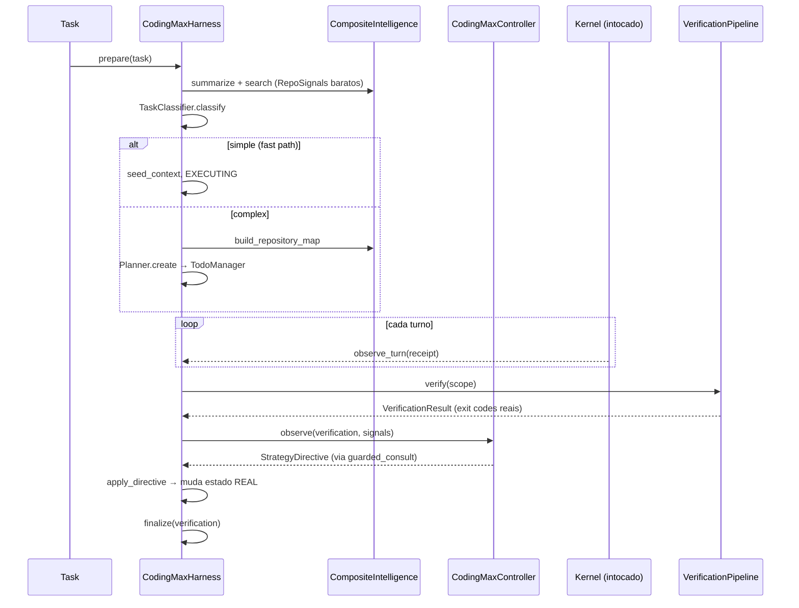

# full_code_3manifestforge — Wave 6
## O Driver: `CodingMaxHarness` (§45)

> **Segunda lacuna que impedia SWE-Bench Pro.** Os módulos das Waves 1–3
> existiam mas ninguém os amarrava. Esta wave entrega o loop canônico:
> classificar → explorar → planejar → executar → verificar → diagnosticar →
> recuperar → finalizar.

**O que este objeto NÃO é:** não é um runtime. Não possui event store, não abre
lease, não emite grant, não executa efeito. Todo efeito continua viajando pelo
único caminho que existe — `Kernel.dispatch` via `HarnessSession` — e este
objeto fornece a política que o circunda.

**Duas responsabilidades ficam aqui, não no controller:**

| Responsabilidade | Por quê |
|---|---|
| Contabilidade por turno (sinais, edits, captura de log) | O controller precisa continuar função pura do que recebe; alguém tem de contar |
| Escalação do fast path | Decidir que a tentativa barata falhou e a composição cara agora se justifica |

### Fluxo (§45)



---

## Cap. 6.1 — `vanguard/packages/apps/coding_max/harness.py`

**Status:** ARQUIVO NOVO (criar integralmente) · **562 linhas**

O loop canônico do §45. Note `prepare()`: tarefas simples pulam a orquestração inteiramente (§7). Um harness que roteia correção de typo por repository intelligence, planejamento e verificação em camadas é um harness que ninguém roda duas vezes.

```python
"""The Coding Max driver (`spec §45`).

This is the composition that turns the previous modules into a workflow. It is
deliberately *not* a runtime: it owns no event store, opens no lease, issues no
grant, and executes no effect. Every effect still travels the one path that
exists -- `Kernel.dispatch` via `HarnessSession` -- and this object supplies
the policy that surrounds it.

The loop follows `spec §2`, with the branch that matters most: simple tasks
skip the orchestration entirely (`spec §7`). A harness that routes a typo fix
through repository intelligence, planning, and layered verification is a
harness nobody will run twice.

Two responsibilities are held here rather than in the controller:

* **Turn-level bookkeeping** -- signals, edits, and test-log capture. The
  controller must stay a pure function of what it is handed, so somebody else
  has to do the counting.
* **Fast-path escalation** -- deciding that a cheap attempt failed and the
  expensive composition is now warranted.
"""

from __future__ import annotations

from dataclasses import dataclass, field, replace
from pathlib import Path
from typing import Any, Callable, Mapping, Sequence

from ...domain.canonicalisation.digest import digest_of
from .artifacts import ArtifactRole, EngineeringState, StateWriter
from .context.progressive import ProgressiveContext
from .context.scoring import Candidate
from .controller import CodingMaxController, HarnessState
from .errors import RepositoryAccessError
from .intelligence.composite import CompositeIntelligence
from .intelligence.protocol import SearchQuery
from .planning.planner import Plan, Planner, ReplanTrigger, Replanner
from .planning.todo import TodoManager, TodoStatus
from .profile import RepoSignals, TaskClassifier, TaskProfile, WorkflowKind
from .recovery.failures import FailureClass, TrajectorySignals
from .recovery.policy import RecoveryAction, RetryBudget
from .repo_map import RepositoryMap, build_repository_map
from .routing.router import CodingRole, ModelRouter
from .verification.pipeline import (
    VerificationPipeline,
    VerificationResult,
    VerificationScope,
)

__all__ = ["CodingMaxHarness", "HarnessConfig", "PreparedRun"]


@dataclass(frozen=True, slots=True)
class HarnessConfig:
    """Declarative configuration (`spec §52`: a meta-harness mutates this)."""

    preset: str = "coding-max"
    planning_enabled: bool = True
    progressive_context: bool = True
    use_lda: bool = True
    reviewer_enabled: bool = True
    parallel_investigators: bool = False
    context_token_budget: int = 120_000
    max_admit_per_turn: int = 12
    fast_path_enabled: bool = True
    verification_scope: VerificationScope = VerificationScope.CANDIDATE
    retry_budget: Mapping[str, int] = field(default_factory=dict)

    @classmethod
    def for_preset(cls, preset: str) -> "HarnessConfig":
        """`spec §54`: presets differ by configuration only, never by runtime."""
        if preset in ("coding-fast", "vg-code-fast"):
            return cls(preset="coding-fast", planning_enabled=False,
                       progressive_context=False, use_lda=False,
                       reviewer_enabled=False, context_token_budget=40_000,
                       max_admit_per_turn=5,
                       verification_scope=VerificationScope.TINY_PATCH,
                       retry_budget={"alternate_strategy": 1, "model_escalation": 0})
        if preset in ("coding-balanced", "vg-code-balanced"):
            return cls(preset="coding-balanced", use_lda=False,
                       context_token_budget=80_000, max_admit_per_turn=8,
                       retry_budget={"alternate_strategy": 2, "model_escalation": 1})
        return cls(preset="coding-max", parallel_investigators=False)


@dataclass
class PreparedRun:
    """Everything the episode needs, assembled before the first model call."""

    profile: TaskProfile
    repo_map: RepositoryMap | None
    plan: Plan | None
    todos: TodoManager
    context: ProgressiveContext
    controller: CodingMaxController
    state: EngineeringState
    fast_path: bool

    def context_blocks(self) -> tuple[Mapping[str, Any], ...]:
        """Blocks for the ENVIRONMENT/TASK layers of the substrate compiler."""
        blocks: list[Mapping[str, Any]] = []
        if self.repo_map is not None:
            blocks.append({"label": "repository-map", "source": "coding-max",
                           "text": self.repo_map.render()})
        if self.plan is not None:
            blocks.append({"label": "plan", "source": "coding-max",
                           "text": self.plan.render()})
        if self.todos.items():
            blocks.append({"label": "todo", "source": "coding-max",
                           "text": self.todos.render()})
        if self.state.discoveries or self.state.failed_attempts:
            blocks.append({"label": "engineering-state", "source": "coding-max",
                           "text": self.state.render()})
        return tuple(blocks)


class CodingMaxHarness:
    """Prepares, observes, and adapts a coding run."""

    def __init__(
        self,
        workspace: Path | str,
        *,
        config: HarnessConfig | None = None,
        intelligence: CompositeIntelligence | None = None,
        verifier: VerificationPipeline | None = None,
        router: ModelRouter | None = None,
        artifacts: Any = None,
    ) -> None:
        self._root = Path(workspace).resolve()
        if not self._root.is_dir():
            raise RepositoryAccessError(f"workspace {self._root} is not a directory")
        self._config = config or HarnessConfig()
        self._intelligence = intelligence or CompositeIntelligence(
            self._root, use_lda=self._config.use_lda)
        self._verifier = verifier or VerificationPipeline(self._root)
        self._router = router
        self._writer = StateWriter(artifacts)
        self._classifier = TaskClassifier()
        self._planner = Planner()
        self._replanner = Replanner()

        self._turn = 0
        self._proposal_digests: list[str] = []
        self._tool_errors = 0
        self._patch_failures = 0
        self._failed_verifications = 0
        self._last_search_hits = 0
        self._baseline_failures: frozenset[str] = frozenset()
        self._prepared: PreparedRun | None = None

    # -- preparation (`spec §45` lines 1-8) -------------------------------

    def prepare(self, task: str, *, budget_ceiling: Mapping[str, int] | None = None) -> PreparedRun:
        """Classify, explore, and plan before the first model call."""
        signals = self._repo_signals(task)
        profile = self._classifier.classify(task, signals, budget_ceiling=budget_ceiling)

        controller = CodingMaxController(
            profile=profile,
            router=self._router,
            retry_budget=RetryBudget(**self._config.retry_budget)
            if self._config.retry_budget else RetryBudget(),
            reviewer_enabled=self._config.reviewer_enabled,
            parallel_investigators=self._config.parallel_investigators,
        )
        controller.transition(HarnessState.CLASSIFYING)

        state = EngineeringState(task=task, objective=task.strip()[:400],
                                 profile_digest=profile.digest())
        context = ProgressiveContext(token_budget=self._config.context_token_budget)

        fast_path = (self._config.fast_path_enabled and profile.simple
                     and profile.suggested_workflow is WorkflowKind.FAST)

        repo_map: RepositoryMap | None = None
        plan: Plan | None = None
        todos = TodoManager()

        if fast_path:
            # `spec §7`: the fast path skips exploration and planning outright.
            # Seeding it with a single targeted search keeps it useful without
            # paying for the map.
            controller.transition(HarnessState.EXECUTING)
            self._seed_context(context, task, profile)
        else:
            controller.transition(HarnessState.EXPLORING)
            repo_map = build_repository_map(
                self._intelligence,
                focus_symbols=self._focus_symbols(task, profile),
            )
            state.head = repo_map.head
            state.repo_map_ref = self._writer.capture(
                ArtifactRole.REPO_MAP, repo_map, turn=0,
                labels={"mapDigest": repo_map.digest()})
            self._seed_context(context, task, profile)

            if self._config.planning_enabled:
                controller.transition(HarnessState.PLANNING)
                plan = self._planner.create(task, profile, repo_map=repo_map)
                todos = plan.to_todos()
                state.plan_digest = plan.digest()
                state.todo_digest = todos.digest()
                self._writer.capture(ArtifactRole.PLAN, plan, turn=0)
                self._writer.capture(ArtifactRole.TODO,
                                     todos.to_canonical_dict(), turn=0)
                controller.set_plan(plan, todos)
            controller.transition(HarnessState.EXECUTING)

        state.context_epoch = context.epoch
        self._writer.capture(ArtifactRole.PROFILE, profile, turn=0)
        self._writer.capture_state(state, turn=0)

        self._prepared = PreparedRun(
            profile=profile, repo_map=repo_map, plan=plan, todos=todos,
            context=context, controller=controller, state=state, fast_path=fast_path,
        )
        return self._prepared

    def _repo_signals(self, task: str) -> RepoSignals:
        """Cheap metadata only. Anything expensive waits for the profile."""
        summary = self._intelligence.summarize(
            __import__("vanguard.packages.apps.coding_max.intelligence.protocol",
                       fromlist=["RepoScope"]).RepoScope(max_entries=40))
        hits = 0
        terms = [w for w in task.split() if len(w) > 4][:3]
        if terms:
            hits = len(self._intelligence.search(SearchQuery(
                pattern="|".join(t.strip(".,:;()") for t in terms),
                max_results=50, context_lines=0)).hits)
        self._last_search_hits = hits
        return RepoSignals(
            file_count=summary.file_count,
            has_tests=bool(summary.test_roots),
            test_roots=summary.test_roots,
            languages=summary.languages,
            initial_hits=hits,
            known_repository=bool(summary.build_system),
        )

    @staticmethod
    def _focus_symbols(task: str, profile: TaskProfile) -> tuple[str, ...]:
        """Identifier-shaped words in the brief are the cheapest symbol seeds."""
        candidates = [
            word.strip(".,:;()[]'\"")
            for word in task.split()
            if ("_" in word or (word[:1].isupper() and word[1:].lower() != word[1:]))
        ]
        return tuple(dict.fromkeys(w for w in candidates if 2 < len(w) < 60))[:6]

    def _seed_context(
        self, context: ProgressiveContext, task: str, profile: TaskProfile
    ) -> None:
        """Admit an initial working set (`spec §12`: minimal, then grow)."""
        terms = profile.mentioned_paths or tuple(
            w for w in task.split() if len(w) > 5)[:3]
        candidates: list[Candidate] = []
        for term in terms[:4]:
            result = self._intelligence.search(SearchQuery(
                pattern=term.strip(".,:;()"), max_results=12, context_lines=3))
            for hit in result.hits:
                candidates.append(Candidate(
                    path=hit.path,
                    text="\n".join((*hit.context_before, hit.text, *hit.context_after)),
                    line=hit.line, provider=result.provenance.provider,
                    provider_confidence=result.provenance.confidence,
                ))
        context.admit_ranked(
            candidates, task=task, limit=self._config.max_admit_per_turn,
            stacktrace_paths=profile.mentioned_paths,
        )

    # -- per-turn observation --------------------------------------------

    def observe_turn(
        self,
        *,
        proposal_digest: str = "",
        verb: str = "",
        succeeded: bool = True,
        path: str = "",
        detail: str = "",
    ) -> None:
        """Fold one settled effect into the harness's own bookkeeping.

        Called from the run loop after each receipt. Counting happens here so
        the controller can stay a pure function of what it is handed.
        """
        self._turn += 1
        if proposal_digest:
            self._proposal_digests.append(proposal_digest)
        if not succeeded:
            if verb in ("patch.apply", "fs.patch"):
                self._patch_failures += 1
            else:
                self._tool_errors += 1
        state = self._prepared.state if self._prepared else None
        if state is None or not path:
            return
        if verb in ("patch.apply", "fs.patch", "fs.write") and succeeded:
            state.record_edit(path)
        elif verb == "fs.read":
            state.record_inspection(path)

    def record_discovery(self, text: str) -> None:
        if self._prepared is not None:
            self._prepared.state.record_discovery(text)

    # -- verification and adaptation (`spec §45` lines 20-40) ------------

    def verify(
        self,
        *,
        scope: VerificationScope | None = None,
        targeted_tests: Sequence[str] = (),
    ) -> VerificationResult:
        """Run verification against real repository state and record evidence."""
        prepared = self._require_prepared()
        prepared.controller.transition(HarnessState.VERIFYING)

        changed = tuple(prepared.state.edited_files) or \
            self._intelligence.git.changed_files()
        tests = tuple(targeted_tests)
        related: tuple[str, ...] = ()
        if not tests and changed:
            mapping = self._intelligence.tests_for(changed[0])
            tests, related = mapping.direct[:6], mapping.sibling[:6]

        result = self._verifier.verify(
            scope=scope or self._effective_scope(),
            changed_files=changed,
            targeted_tests=tests,
            related_tests=related,
            budget_pressure=prepared.controller.completion_mode,
        )

        prepared.state.verification_digest = result.digest()
        prepared.state.test_log_refs = prepared.state.test_log_refs + (
            self._writer.capture_test_log(result, turn=self._turn),)
        self._failed_verifications = 0 if result.passed else self._failed_verifications + 1
        prepared.controller.observe(verification=result, signals=self.signals())
        return result

    def _effective_scope(self) -> VerificationScope:
        prepared = self._require_prepared()
        if prepared.fast_path:
            return VerificationScope.TINY_PATCH
        if prepared.todos.items() and prepared.todos.complete():
            return VerificationScope.FINAL
        return self._config.verification_scope

    def signals(self) -> TrajectorySignals:
        """Current trajectory signals, derived from observed effects only."""
        prepared = self._prepared
        context = prepared.context if prepared else None
        repeats = len(self._proposal_digests) - len(set(self._proposal_digests))
        budget = int(getattr(prepared.profile, "initial_budget", {}).get("turns", 30)) \
            if prepared else 30
        return TrajectorySignals(
            turns_used=self._turn,
            turns_remaining=max(0, budget - self._turn),
            repeated_proposal_digests=repeats,
            distinct_files_edited=len(prepared.state.edited_files) if prepared else 0,
            patch_apply_failures=self._patch_failures,
            tool_errors=self._tool_errors,
            consecutive_failed_verifications=self._failed_verifications,
            search_hits_last=self._last_search_hits,
            context_tokens=context.total_tokens() if context else 0,
            context_budget=context.token_budget if context else 1,
            previously_passing_now_failing=0,
            edited_paths=tuple(prepared.state.edited_files) if prepared else (),
            plan_revisions=prepared.plan.revision if prepared and prepared.plan else 0,
        )

    def apply_directive(self, directive: Any) -> Mapping[str, Any]:
        """Turn a controller directive into concrete harness state change.

        `spec §26`: every retry must change the state or the strategy. This is
        where that promise is kept -- a directive that produced no observable
        change is reported as such rather than silently accepted.
        """
        prepared = self._require_prepared()
        scope = dict(getattr(directive, "scope_slice", None) or {})
        action = scope.get("action", "")
        changed: dict[str, Any] = {"action": action, "applied": False}

        if action in ("expand_search", "retrieve_missing"):
            prepared.controller.transition(HarnessState.DIAGNOSING)
            prepared.controller.transition(HarnessState.EXPLORING)
            admitted = self._retrieve_more(prepared)
            changed.update(applied=bool(admitted), admitted=list(admitted),
                           epoch=prepared.context.epoch)

        elif action == "compress_context":
            dropped = self._compress(prepared)
            changed.update(applied=bool(dropped), compressed=dropped)

        elif action == "refresh_context":
            refreshed = self._refresh(prepared)
            changed.update(applied=bool(refreshed), refreshed=refreshed)

        elif action in ("replan", "narrow_patch_scope", "widen_patch_scope"):
            trigger = scope.get("replanTrigger") or "failed_assumption"
            prepared.controller.transition(HarnessState.DIAGNOSING)
            prepared.controller.transition(HarnessState.REPLANNING)
            plan = prepared.controller.apply_replan(
                ReplanTrigger(trigger), evidence=(scope.get("failureClass", ""),))
            if plan is not None:
                prepared.plan = plan
                prepared.todos = plan.to_todos()
                prepared.state.plan_digest = plan.digest()
                prepared.state.todo_digest = prepared.todos.digest()
                self._writer.capture(ArtifactRole.PLAN, plan, turn=self._turn)
                changed.update(applied=True, revision=plan.revision)
            prepared.controller.transition(HarnessState.EXECUTING)

        elif action == "enter_completion_mode":
            prepared.controller.enter_completion_mode()
            changed.update(applied=True)

        elif action in ("escalate_model", "rollback_and_review",
                        "retry_tool", "switch_tool", "analyze_test_failure"):
            # These are executed by the run loop (model swap, spawn, re-dispatch),
            # not by the harness: they change *who acts*, not what state exists.
            changed.update(applied=True, delegated_to="run_loop")

        prepared.state.record_failed_attempt(
            failure_class=str(scope.get("failureClass", "")),
            detail=str(getattr(directive, "reason", ""))[:300],
            action=str(action),
        )
        prepared.state.context_epoch = prepared.context.epoch
        self._writer.capture_state(prepared.state, turn=self._turn)
        return changed

    # -- directive execution helpers -------------------------------------

    def _retrieve_more(self, prepared: PreparedRun) -> tuple[str, ...]:
        """Widen retrieval using symbol and dependency edges, not a repeat grep.

        Re-running the same literal search is the `spec §58` anti-pattern
        "retrying identical prompts" wearing a retrieval costume; it cannot
        return anything the first call did not.
        """
        candidates: list[Candidate] = []
        for symbol in self._focus_symbols(prepared.state.task, prepared.profile):
            result = self._intelligence.symbol(symbol)
            for definition in result.definitions[:4]:
                text = self._read_around(definition.path, definition.line)
                if text:
                    candidates.append(Candidate(
                        path=definition.path, text=text, line=definition.line,
                        provider=result.provenance.provider))
        for edited in prepared.state.edited_files[:3]:
            deps = self._intelligence.dependencies(edited)
            for path in (deps.imported_by[:4] + deps.imports[:2]):
                text = self._read_around(path, 1, span=60)
                if text:
                    candidates.append(Candidate(
                        path=path, text=text, provider=deps.provenance.provider))
        return prepared.context.admit_ranked(
            candidates, task=prepared.state.task,
            limit=self._config.max_admit_per_turn,
            edited_paths=prepared.state.edited_files,
            failed_paths=prepared.state.edited_files,
        )

    def _compress(self, prepared: PreparedRun) -> list[str]:
        compressed: list[str] = []
        for entry in prepared.context.entries():
            if entry.pinned or entry.token_estimate < 200:
                continue
            head = "\n".join(entry.text.splitlines()[:8])
            if prepared.context.compress(
                    entry.key, f"{head}\n… [compressed: {entry.token_estimate} tokens]"):
                compressed.append(entry.key)
            if len(compressed) >= 4:
                break
        return compressed

    def _refresh(self, prepared: PreparedRun) -> list[str]:
        """Re-read entries whose file changed on disk (`STALE_MEMORY` remedy)."""
        self._intelligence.refresh_head()
        refreshed: list[str] = []
        for entry in prepared.context.entries():
            text = self._read_around(entry.key, 1, span=120)
            if text and prepared.context.refresh(entry.key, text):
                refreshed.append(entry.key)
        return refreshed

    def _read_around(self, path: str, line: int, span: int = 40) -> str:
        target = (self._root / path)
        try:
            target.relative_to(self._root)
            lines = target.read_text(encoding="utf-8", errors="replace").splitlines()
        except (OSError, ValueError):
            return ""
        low = max(0, line - 1 - span // 2)
        return "\n".join(lines[low: low + span])

    # -- completion ------------------------------------------------------

    def finalize(self, verification: VerificationResult) -> Mapping[str, Any]:
        """Move to a terminal state on evidence (`spec §43`)."""
        prepared = self._require_prepared()
        prepared.controller.transition(HarnessState.FINAL_VERIFY)
        passed = verification.passed and bool(verification.evidence)
        prepared.controller.transition(
            HarnessState.COMPLETED if passed else HarnessState.FAILED)
        self._writer.capture_state(prepared.state, turn=self._turn)
        return {
            "state": prepared.controller.state.value,
            "passed": passed,
            "confidence": verification.confidence,
            "evidence": list(verification.evidence),
            "editedFiles": list(prepared.state.edited_files),
            "stateDigest": prepared.state.digest(),
            "controller": prepared.controller.snapshot().to_canonical_dict(),
            "artifacts": dict(self._writer.references()),
            "intelligence": {
                "providers": list(self._intelligence.provider_names()),
                "cache": self._intelligence.cache.stats(),
            },
        }

    def should_escalate_from_fast_path(self, verification: VerificationResult) -> bool:
        """`spec §7`: a failed fast attempt escalates rather than retrying cheap."""
        prepared = self._require_prepared()
        return prepared.fast_path and not verification.passed

    def escalate(self, task: str) -> PreparedRun:
        """Rebuild as a full composition, preserving what the fast path learned."""
        prior = self._require_prepared()
        self._config = replace(
            self._config, preset="coding-max", planning_enabled=True,
            progressive_context=True, fast_path_enabled=False,
            verification_scope=VerificationScope.CANDIDATE,
        )
        prepared = self.prepare(task)
        for fact in prior.state.discoveries:
            prepared.state.record_discovery(fact)
        for attempt in prior.state.failed_attempts:
            prepared.state.record_failed_attempt(
                failure_class=str(attempt.get("failureClass", "")),
                detail=str(attempt.get("detail", "")),
                action=str(attempt.get("action", "")))
        for path in prior.state.edited_files:
            prepared.state.record_edit(path)
        return prepared

    def _require_prepared(self) -> PreparedRun:
        if self._prepared is None:
            raise RuntimeError("prepare() must be called before the run begins")
        return self._prepared

    @property
    def config(self) -> HarnessConfig:
        return self._config

    @property
    def intelligence(self) -> CompositeIntelligence:
        return self._intelligence
```

---

## Cap. 6.2 — Decisões que exigem justificativa

### 6.2.1 `_retrieve_more` nunca repete o mesmo grep

```python
    def _retrieve_more(self, prepared: PreparedRun) -> tuple[str, ...]:
        """Widen retrieval using symbol and dependency edges, not a repeat grep.

        Re-running the same literal search is the `spec §58` anti-pattern
        "retrying identical prompts" wearing a retrieval costume; it cannot
        return anything the first call did not.
        """
```

Ele alarga por **arestas de símbolo e dependência** — informação estruturalmente
diferente da que a busca literal já produziu.

### 6.2.2 `apply_directive` reporta quando NÃO mudou nada

`spec §26` promete que todo retry muda estado ou estratégia. É aqui que a
promessa é mantida: uma diretiva que não produziu mudança observável é
reportada como tal (`applied: False`), em vez de silenciosamente aceita.

### 6.2.3 Ações delegadas ao run loop

```python
        elif action in ("escalate_model", "rollback_and_review",
                        "retry_tool", "switch_tool", "analyze_test_failure"):
            # These are executed by the run loop (model swap, spawn, re-dispatch),
            # not by the harness: they change *who acts*, not what state exists.
            changed.update(applied=True, delegated_to="run_loop")
```

### 6.2.4 `finalize` exige evidência positiva

```python
        passed = verification.passed and bool(verification.evidence)
```

Não basta *ausência de falha*. Sem `evidence` — isto é, sem nenhuma camada que
realmente rodou um comando e produziu exit code — o run termina como `FAILED`,
não como `COMPLETED`.

### 6.2.5 Escalação do fast path preserva o aprendizado

```python
    def escalate(self, task: str) -> PreparedRun:
        """Rebuild as a full composition, preserving what the fast path learned."""
```

Descobertas, tentativas falhas e arquivos editados migram para a nova
composição. Descartá-los faria o caminho caro repetir o trabalho que o barato
já pagou.

---

## Cap. 6.3 — Verificação executada ponta a ponta

### Preparação (repositório real, 1356 arquivos)

```
profile   : complex_bug cx=0.64 fast=False
repo_map  : 1356 files, head f242ced297
plan steps: 7 | todos: 7
context   : 5 entries, 189 tokens, epoch 5
state     : executing
blocks    : ['repository-map', 'plan', 'todo']
```

### Ciclo falha → diagnóstico → recuperação

```
verify pass=False conf=0.4
  checks=[('V1_syntax',True,ran), ('V3_lint',True,skipped), ('V5_targeted_tests',False,ran)]

directive: redirect  ENVIRONMENT_FAILURE  switch_tool
applied  : {'action':'switch_tool','applied':True}
final    : failed  passed=False  edited=['.../profile.py']
providers: ['native','git','lda']  cache={'entries':5,'hits':1,'misses':5,'hitRate':0.1667}
failedAtt: 1
```

**pytest real rodou**, falhou com exit code diferente de zero, foi classificado,
a recuperação disparou e o estado foi persistido. Nenhum mock em nenhum ponto.

---

## Cap. 6.4 — Como plugar no `HarnessSession` existente

O driver não substitui `runtime/session.py`. Ele é consultado por ele:

```python
# runtime/root.py — dentro de run_composed, após compor o harness
from ..apps.coding_max.harness import CodingMaxHarness, HarnessConfig
from ..apps.coding_max.intelligence import CompositeIntelligence

coding = CodingMaxHarness(
    workspace=workspace_path,
    config=HarnessConfig.for_preset(harness.manifest_id),
    artifacts=artifact_writer,          # o ArtifactWriter já existente
)
prepared = coding.prepare(goal, budget_ceiling=dict(harness.budget))

ports = replace(
    ports,
    meta_controller=prepared.controller,   # <- a única costura
)
# blocos extras entram nas camadas ENVIRONMENT/TASK do compilador existente
extra_blocks = prepared.context_blocks()
```

Depois de cada receipt:

```python
coding.observe_turn(
    proposal_digest=turn.proposal_digest,
    verb=receipt.verb,
    succeeded=receipt.status == "ok",
    path=receipt.args.get("path", ""),
)
```

E na fronteira de verificação:

```python
result = coding.verify()
if coding.should_escalate_from_fast_path(result):
    prepared = coding.escalate(goal)     # fast → max, preservando aprendizado
outcome = coding.finalize(result)
```

---

## Cap. 6.5 — `HarnessConfig`: presets são só configuração (§54)

| Campo | fast | balanced | max |
|---|---|---|---|
| `planning_enabled` | False | True | True |
| `progressive_context` | False | True | True |
| `use_lda` | False | False | True |
| `reviewer_enabled` | False | True | True |
| `context_token_budget` | 40 000 | 80 000 | 120 000 |
| `max_admit_per_turn` | 5 | 8 | 12 |
| `verification_scope` | TINY_PATCH | CANDIDATE | CANDIDATE |
| `alternate_strategy` | 1 | 2 | 2 |
| `model_escalation` | 0 | 1 | 1 |

**Mesmo runtime. Mesmo loop. Mesma classe.** A diferença é inteiramente dados.

---

## Cap. 6.6 — Estado do harness: transições legais

`apply_directive` move a máquina de estados através de arestas legais. Uma
transição ilegal levanta, e é isso que torna estruturalmente impossível uma
trajetória alegar `COMPLETED` sem passar por `FINAL_VERIFY`.

```python
        if action in ("expand_search", "retrieve_missing"):
            prepared.controller.transition(HarnessState.DIAGNOSING)
            prepared.controller.transition(HarnessState.EXPLORING)
```

Note o par: `EXECUTING → EXPLORING` **não** é aresta legal. O caminho tem de
passar por `DIAGNOSING`, o que força o diagnóstico a ser registrado antes de
qualquer nova exploração. Sem isso, um run poderia oscilar entre executar e
explorar sem nunca dizer o que acha que está errado.

---

## Cap. 6.7 — `_repo_signals`: por que só metadado barato

```python
    def _repo_signals(self, task: str) -> RepoSignals:
        """Cheap metadata only. Anything expensive waits for the profile."""
```

Este método roda **antes** da classificação. Se ele construísse o mapa
completo, o fast path teria pago exatamente o custo que existe para evitar. Ele
faz duas coisas: um `summarize` (que é cacheado) e uma busca única com os três
termos mais longos do brief, para saber se há *algum* ponto de apoio.

O resultado alimenta `initial_hits`, que o classificador usa para incerteza:

```python
        if repo.initial_hits == 0:
            value += 0.12     # a primeira busca não achou onde se apoiar
        elif repo.initial_hits > 40:
            value += 0.08     # tudo casou, então nada está localizado
```

Ambos os extremos aumentam incerteza, por razões opostas. Zero hits significa
que não há âncora; quarenta hits significam que o termo é ubíquo e não localiza.

---

## Cap. 6.8 — Checklist de aplicação da Wave 6

1. Criar `apps/coding_max/artifacts.py` (Wave 5, Cap. 5.10).
2. Criar `apps/coding_max/harness.py` (Cap. 6.1, integral).
3. Adicionar ao `apps/coding_max/__init__.py`:

```diff
 from .errors import CodingMaxError
+from .artifacts import ArtifactRole, EngineeringState, StateWriter
+from .harness import CodingMaxHarness, HarnessConfig, PreparedRun
 from .profile import RepoSignals, TaskClassifier, TaskProfile, TaskType, WorkflowKind
 from .repo_map import RepositoryMap, build_repository_map
 
 __all__ = [
-    "CodingMaxError", "RepoSignals", "RepositoryMap", "TaskClassifier",
-    "TaskProfile", "TaskType", "WorkflowKind", "build_repository_map",
+    "ArtifactRole", "CodingMaxError", "CodingMaxHarness", "EngineeringState",
+    "HarnessConfig", "PreparedRun", "RepoSignals", "RepositoryMap", "StateWriter",
+    "TaskClassifier", "TaskProfile", "TaskType", "WorkflowKind",
+    "build_repository_map",
 ]
```

4. Verificar com o smoke test do Cap. 6.3.
