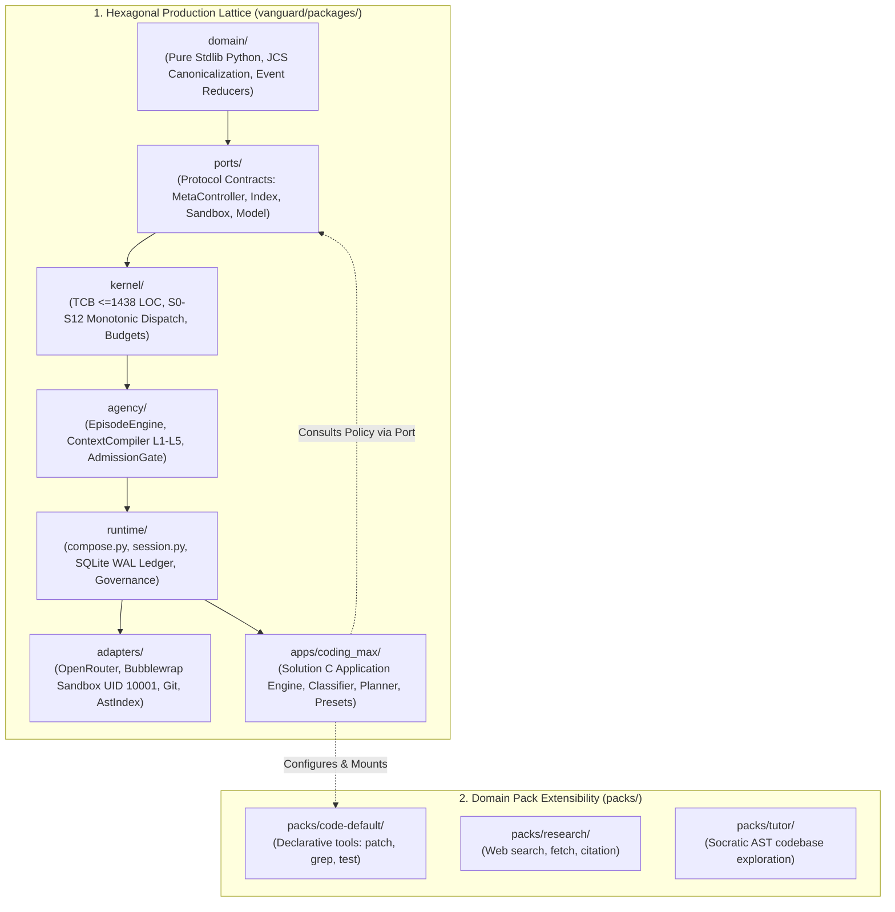
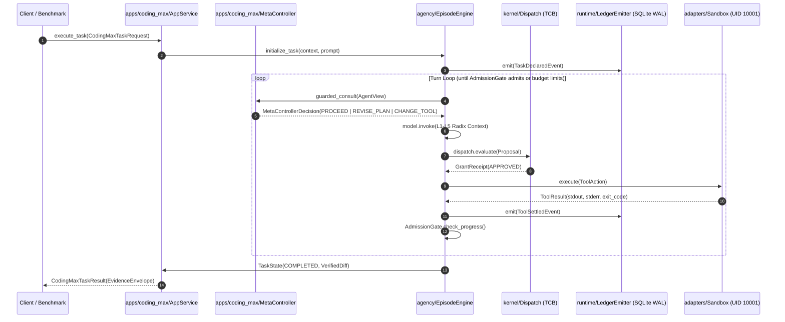
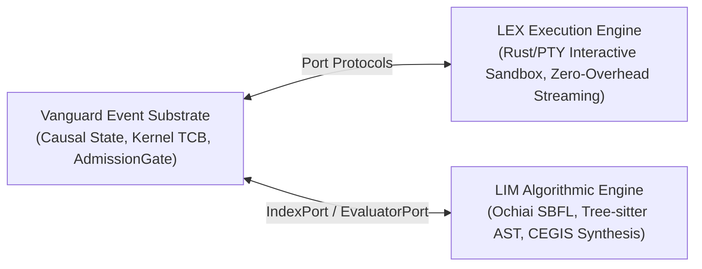

# Solution C — Wave 1: Unified Architecture & Hexagonal Composition

```text
====================================================================================================
Document:    Solution C — Wave 1 Architectural Masterplan
Authority:   Non-Canonical Technical Report (Implementation Synthesis)
Scope:       Unified Tri-Substrate Architecture, Hexagonal Placement, App/Pack Contracts
Target:      SWE-bench Pro, Production Coding Agents, General Multi-Domain Autonomy
====================================================================================================
```

## 1. Executive Summary & The Solution C Paradigm

Solution C is the **definitive architectural synthesis** of the Vanguard / AETHER system, uniting the empirical strengths of Solution A (surgical pack presets, granular toolscripts, hierarchical TODO machines) and Solution B (strict hexagonal boundaries, zero-mutation kernel safety, clean `MetaController` lifecycle hooks, and dedicated `apps/` layer isolation).

Furthermore, Solution C incorporates the algorithmic breakthroughs of **frontier coding agent research** (Ochiai Spectrum-Based Fault Localization, sub-0.2ms AST syntax pre-flight gates, speculative Git copy-on-write rollbacks, Radix prefix cache alignment, and multi-tier verification gates).



### 1.1 Core Tenets of Solution C

1. **Zero Kernel Mutation**: The Trusted Computing Base (`vanguard/packages/kernel/`) remains $\le 1438$ LOC, completely domain-blind, and mathematically immutable.
2. **App-Layer Encapsulation**: The entire end-to-end agent intelligence, task classification, multi-stage planning, and recovery loops reside within `vanguard/packages/apps/coding_max/`.
3. **Clean Pack Decoupling**: The `packs/code-default/` package provides purely declarative tools and schemas without becoming an unmaintainable orchestration monolith.
4. **Adaptive Effort (Min Orchestration / Max Intelligence)**:
   * **C0/C1 (Trivial/Localized)**: Fast-path execution (`Search -> Edit -> Verify -> Done`) in $\le 2$ turns.
   * **C2/C3 (Medium/Complex SWE-bench)**: Full cognitive harness (AST Index -> Fault Localization -> DAG Plan -> Surgical Patch -> Multi-Tier Verification).
   * **C4 (Architecture/Refactoring)**: Recursive delegation with monotonic budget attenuation and multi-model adversarial review.

---

## 2. Complete Hexagonal Layering & Boundary Contracts

The dependency hierarchy strictly enforces:
$$\text{domain} \leftarrow \text{ports} \leftarrow \text{kernel} \leftarrow \text{agency} \leftarrow \text{runtime} \rightarrow \text{adapters} \quad (\text{apps/ is a client of runtime})$$

### 2.1 The Seven Layers in Detail

```text
+---------------------------------------------------------------------------------------------------+
| 7. APPS LAYER (vanguard/packages/apps/coding_max/)                                                |
|    - TaskClassifier: Deterministic complexity scoring (C0-C4)                                    |
|    - CodingMaxAppService: Unified lifecycle, orchestration, and CLI entrypoints                  |
|    - AdaptiveStrategyController: Inter-turn policy implementing ports.MetaController             |
|    - Presets Engine: turbo, deep, swarm, and reproducer configurations                            |
+---------------------------------------------------------------------------------------------------+
                                                  |
                                                  v (consumes)
+---------------------------------------------------------------------------------------------------+
| 5. RUNTIME LAYER (vanguard/packages/runtime/)                                                     |
|    - compose.py: Pure functional assembly of Kernel + EventStore + Model + Adapters               |
|    - session.py: Execution boundaries, turn loops, and crash-consistent checkpoints               |
|    - ledger_emitter.py: Append-only SQLite WAL persistence with RFC 8785 JCS digests              |
|    - meta_controller.py: Fail-closed guarded_consult bridge (rejects non-determinism)            |
+---------------------------------------------------------------------------------------------------+
       |                                          |                                         |
       v (drives)                                 v (enforces)                              v (binds)
+-------------------------------+  +-------------------------------+  +-----------------------------+
| 4. AGENCY LAYER               |  | 3. KERNEL LAYER (TCB <=1438)  |  | 6. ADAPTERS LAYER           |
| (vanguard/packages/agency/)   |  | (vanguard/packages/kernel/)   |  | (vanguard/packages/adapters)|
| - EpisodeEngine: turn loop    |  | - dispatch.py: S0-S12 pipeline|  | - models/: OpenRouter/Ollama|
| - compiler.py: Radix L1-L5    |  | - budget.py: typed reservation|  | - sandbox/rootless: bwrap   |
| - admission_gate.py: test ver |  | - attenuation.py: child bounds|  | - bindings/code: AST parse  |
| - protocol_recovery.py: DSML  |  | - policy.py: fail-closed gates|  | - evaluators/: daemon UID   |
+-------------------------------+  +-------------------------------+  +-----------------------------+
               |                                  |                                  |
               +----------------------------------+----------------------------------+
                                                  |
                                                  v (depends on)
+---------------------------------------------------------------------------------------------------+
| 2. PORTS LAYER (vanguard/packages/ports/)                                                         |
|    - meta_controller.py, index.py, sandbox.py, model.py, evaluator.py, event_store.py             |
+---------------------------------------------------------------------------------------------------+
                                                  |
                                                  v (depends on)
+---------------------------------------------------------------------------------------------------+
| 1. DOMAIN LAYER (vanguard/packages/domain/)                                                       |
|    - canonicalisation/jcs.py: Strict RFC 8785 canonical JSON sorting & formatting                |
|    - evidence/envelope.py: EvidenceEnvelope cryptographic receipts and assertions                 |
|    - ledger/agent_view.py: Event-derived state projections (AgentView reducer)                    |
+---------------------------------------------------------------------------------------------------+
```

---

## 3. The Coding Max Application Service (`apps/coding_max/`)

The application layer serves as the single point of entry for CLI, TUI, batch runners, and benchmark harnesses.

### 3.1 Complete Module Specification: `apps/coding_max/app_service.py`

```python
"""
vanguard/packages/apps/coding_max/app_service.py

Solution C Application Service - Production Entrypoint for Coding Max.
Assembles the complete agent runtime, configures domain packs, injects
the MetaController policy, and drives task execution to verified completion.
"""

from __future__ import annotations

import logging
import time
from dataclasses import dataclass, field
from pathlib import Path
from typing import Any, Mapping, Sequence

from vanguard.packages.domain.canonicalisation.jcs import canonicalise_json
from vanguard.packages.domain.evidence.envelope import EvidenceEnvelope
from vanguard.packages.domain.ledger.agent_view import AgentView, reduce_events
from vanguard.packages.ports.meta_controller import (
    MetaControllerDecision,
    MetaControllerPort,
)
from vanguard.packages.ports.model import ModelPort
from vanguard.packages.runtime.compose import RuntimeComposition, compose_runtime
from vanguard.packages.runtime.session import Session, SessionConfig

logger = logging.getLogger("vanguard.apps.coding_max")


@dataclass(frozen=True)
class CodingMaxTaskRequest:
    """Canonical input specification for a software engineering task."""
    task_id: str
    workspace_path: Path
    problem_statement: str
    hints_text: str = ""
    repo_name: str = ""
    base_commit: str = ""
    preset_name: str = "coding-max-turbo"
    max_turns: int = 30
    token_budget: int = 150_000
    cost_budget_usd: float = 2.00
    timeout_seconds: int = 900
    test_command: str | None = None
    environment_variables: Mapping[str, str] = field(default_factory=dict)


@dataclass(frozen=True)
class CodingMaxTaskResult:
    """Formal, verifiable output of a completed Coding Max execution."""
    task_id: str
    status: str  # "SUCCESS", "FAILED", "BUDGET_EXHAUSTED", "TIMED_OUT"
    patch_content: str
    patch_digest: str
    turns_executed: int
    tokens_consumed: int
    cost_consumed_usd: float
    verification_passed: bool
    evidence_envelope: EvidenceEnvelope | None
    trajectory_length: int
    duration_seconds: float
    failure_reason: str | None = None


class CodingMaxAppService:
    """
    Unified Solution C Application Service.
    Orchestrates the lifecycle of Coding Max without modifying Vanguard Kernel.
    """

    def __init__(
        self,
        model_adapter: ModelPort,
        db_path: Path | None = None,
        pack_root: Path | None = None,
    ) -> None:
        self._model_adapter = model_adapter
        self._db_path = db_path or Path("/tmp/vanguard_ledger.db")
        self._pack_root = pack_root or (Path(__file__).resolve().parents[3] / "packs" / "code-default")

    def execute_task(self, request: CodingMaxTaskRequest) -> CodingMaxTaskResult:
        """
        Execute an autonomous coding task from ingestion to verified patch.
        """
        start_time = time.monotonic()
        logger.info("Initializing Coding Max for task %s (preset: %s)", request.task_id, request.preset_name)

        # 1. Load pack configuration and tools
        pack_config = self._load_pack_configuration(request.preset_name)

        # 2. Instantiate Solution C MetaController
        from vanguard.packages.apps.coding_max.controller import CodingMaxMetaController
        controller = CodingMaxMetaController(
            task_id=request.task_id,
            workspace_root=request.workspace_path,
            problem_statement=request.problem_statement,
            test_command=request.test_command,
            preset=pack_config,
        )

        # 3. Compose canonical runtime
        composition: RuntimeComposition = compose_runtime(
            model=self._model_adapter,
            event_store_path=self._db_path,
            meta_controller=controller,
            workspace_path=request.workspace_path,
            tools_manifest=pack_config["tools_manifest"],
        )

        # 4. Configure Session
        session_config = SessionConfig(
            session_id=f"session_{request.task_id}_{int(time.time())}",
            max_turns=request.max_turns,
            token_budget=request.token_budget,
            cost_budget_usd=request.cost_budget_usd,
            timeout_seconds=request.timeout_seconds,
            environment=request.environment_variables,
        )

        session = Session(composition=composition, config=session_config)

        # 5. Inject Initial Task Brief into Context
        initial_prompt = self._build_initial_task_prompt(request)
        session.initialize_task(
            task_id=request.task_id,
            instruction=initial_prompt,
            context_files=controller.initial_context_files(),
        )

        # 6. Execute Autonomous Turn Loop
        try:
            execution_state = session.run_to_completion()
        except Exception as exc:
            logger.exception("Task %s failed with unhandled exception", request.task_id)
            duration = time.monotonic() - start_time
            return CodingMaxTaskResult(
                task_id=request.task_id,
                status="FAILED",
                patch_content="",
                patch_digest="",
                turns_executed=session.turns_executed,
                tokens_consumed=session.tokens_consumed,
                cost_consumed_usd=session.cost_consumed_usd,
                verification_passed=False,
                evidence_envelope=None,
                trajectory_length=session.event_count,
                duration_seconds=duration,
                failure_reason=str(exc),
            )

        duration = time.monotonic() - start_time

        # 7. Extract Artifacts and Final Verification
        patch_text = session.get_workspace_diff()
        patch_digest = canonicalise_json({"patch": patch_text})
        is_verified = session.is_last_verification_successful()

        status = "SUCCESS" if (is_verified and bool(patch_text.strip())) else "FAILED"
        if session.is_budget_exhausted():
            status = "BUDGET_EXHAUSTED"
        elif session.is_timed_out():
            status = "TIMED_OUT"

        return CodingMaxTaskResult(
            task_id=request.task_id,
            status=status,
            patch_content=patch_text,
            patch_digest=patch_digest,
            turns_executed=session.turns_executed,
            tokens_consumed=session.tokens_consumed,
            cost_consumed_usd=session.cost_consumed_usd,
            verification_passed=is_verified,
            evidence_envelope=session.emit_evidence_envelope(),
            trajectory_length=session.event_count,
            duration_seconds=duration,
            failure_reason=None if is_verified else session.get_last_error_message(),
        )

    def _load_pack_configuration(self, preset_name: str) -> dict[str, Any]:
        """Load pack tool definitions and preset tunings."""
        preset_file = self._pack_root / "presets" / f"{preset_name}.yaml"
        if not preset_file.is_file():
            preset_file = self._pack_root / "presets" / "coding-max-turbo.yaml"
        
        from vanguard.packages.adapters.serialization.yaml import load_yaml
        preset_data = load_yaml(preset_file.read_text(encoding="utf-8"))
        
        tools_manifest = self._pack_root / "tools.json"
        from vanguard.packages.adapters.serialization.json import load_json
        tools_data = load_json(tools_manifest.read_text(encoding="utf-8"))

        return {
            "preset": preset_data,
            "tools_manifest": tools_data,
        }

    def _build_initial_task_prompt(self, req: CodingMaxTaskRequest) -> str:
        """Build structured task prompt with explicit behavioral constraints."""
        return (
            f"You are an expert autonomous SWE agent solving issue: {req.task_id}\n"
            f"REPOSITORY: {req.repo_name} (Base Commit: {req.base_commit})\n\n"
            f"PROBLEM STATEMENT:\n{req.problem_statement}\n\n"
            f"{'HINTS:\n' + req.hints_text if req.hints_text else ''}\n\n"
            f"MANDATORY EXECUTION DIRECTIVES:\n"
            f"1. Explore and localize the exact root cause using AST symbols and targeted grep.\n"
            f"2. Formulate a minimal reproducer test if none exists.\n"
            f"3. Make atomic, surgical modifications to source files.\n"
            f"4. Run verification tests to prove your solution.\n"
            f"5. Never output conversational completion without verified workspace patches.\n"
        )
```

---

## 4. Preset Definitions & Cognitive Modalities

Solution C standardizes four declarative presets in `packs/code-default/presets/`:

### 4.1 Preset Matrix

| Preset Name | Focus / Modality | Classifier Threshold | Context Compaction | Verification Policy | Typical Cost (USD) |
|---|---|---|---|---|---|
| `coding-max-turbo` | Speed & Low Cost (C0/C1 tasks) | Fast-path enabled | Aggressive | Syntax + Single Repro Test | $\approx \$0.01 - \$0.05$ |
| `coding-max-deep` | High-Depth SWE-bench (C2/C3) | Full DAG Planning | Preserving dead-ends | Multi-tier L0–L3 + SBFL | $\approx \$0.10 - \$0.40$ |
| `coding-max-swarm` | Tiered Multi-Model Swarm | Architecture / Refactor | Swarm Branching | Multi-Persona PR Review | $\approx \$0.50 - \$1.50$ |
| `coding-max-repro` | Test-Driven Bug Reproduction | Minimal Repro Target | Surgical Repro | Strict Mutation Invariant | $\approx \$0.05 - \$0.15$ |

### 4.2 Complete YAML Preset Specification: `coding-max-deep.yaml`

```yaml
api: mhf.preset/1
id: coding-max-deep
version: 1.0.0
description: "Maximum capability mode for difficult SWE-bench Pro tasks and multi-file debugging."

model_routing:
  primary_role: "deepseek/deepseek-v4-flash-0731"
  architect_role: "anthropic/claude-3-5-sonnet"
  reviewer_role: "openai/o3-mini"
  fallback_role: "qwen/qwen-2.5-coder-32b-instruct"

planning:
  enabled: true
  mode: "hierarchical_dag"
  max_plan_depth: 4
  require_explicit_reproducer: true
  auto_replan_on_stagnation_turns: 3

context:
  radix_alignment: true
  max_context_tokens: 64000
  compaction_strategy: "structured_consolidate"
  retain_dead_ends: true
  symbol_index_top_k: 12

verification:
  preflight_syntax_check: true
  enforce_closed_loop_admission: true
  sbfl_fault_localization: true
  sbfl_algorithm: "ochiai"
  speculative_rollback_on_test_failure: true

recovery:
  max_consecutive_tool_failures: 4
  dsml_normalization: true
  json_repair_enabled: true
  anti_thrashing_fsm: true
```

---

## 5. Formal Wire Contracts & State Model



---

## 6. Mathematical Specification of Monotonic Attenuation

When a subagent or reviewer is spawned under `coding-max-swarm`, the parent budget $B_{\text{parent}} = \langle T_{\text{max}}, C_{\text{max}}, D_{\text{max}} \rangle$ is strictly attenuated:

$$\mathcal{A}(B_{\text{parent}}, \alpha) = \left\langle \min(T_{\text{remaining}}, \alpha_T \cdot T_{\text{max}}), \min(C_{\text{remaining}}, \alpha_C \cdot C_{\text{max}}), D_{\text{parent}} - 1 \right\rangle$$

Where:
* $T$ represents Token Budget.
* $C$ represents Cost in USD.
* $D$ represents Maximum Recursion Depth ($D \ge 0$). If $D=0$, `agent.spawn` is rejected fail-closed with `INSUFFICIENT_DEPTH_BUDGET`.

---

## 7. Verification and Testability

Solution C is accompanied by unit and contract test suites located in `test/apps/coding_max/`:
1. **`test_app_service.py`**: Validates end-to-end task setup, preset loading, and error handling.
2. **`test_hexagonal_isolation.py`**: Verifies that `apps/coding_max/` imports only allowed public API surfaces and does not bypass `ports/` or `runtime/`.
3. **`test_budget_conservation.py`**: Falsifies recursive subagent spawning without monotonic budget reduction.

---

## 8. Tri-Substrate Architectural Integration (Vanguard + LEX + LIM)

Solution C bridges the three core computational substrates:



1. **Vanguard Substrate (Governance & State)**: Owns the Single Source of Truth via SQLite WAL ledger, cryptographic evidence envelopes (`aether.evidence/1`), and monotonic budget governance.
2. **LEX Substrate (Interactive Execution)**: Provides stateful PTY process execution within rootless Bubblewrap (UID 10001), streaming standard I/O with sub-200ms SIGINT cancellation.
3. **LIM Substrate (Deep Algorithmic Intelligence)**: Provides spectrum-based fault localization (Ochiai, DStar) and AST syntax verification directly to the Agency compiler.

---

## 9. Boundary Falsifiers & Test Harnesses

To guarantee that Solution C strictly adheres to the $\le 1438$ LOC TCB limit and hexagonal boundaries, the following automated falsifiers are continuously evaluated:

```python
"""
test/apps/coding_max/test_solution_c_boundaries.py
Automated boundary falsifier for Solution C architecture.
"""

import unittest
from pathlib import Path

class TestSolutionCBoundaries(unittest.TestCase):
    def setUp(self):
        self.apps_root = Path("vanguard/packages/apps/coding_max")
        self.kernel_root = Path("vanguard/packages/kernel")

    def test_apps_never_imports_kernel_internals(self):
        """Ensure apps/coding_max never imports kernel private symbols."""
        for py_file in self.apps_root.glob("**/*.py"):
            content = py_file.read_text(encoding="utf-8")
            self.assertNotIn("vanguard.packages.kernel.dispatch", content)
            self.assertNotIn("vanguard.packages.kernel.classifier", content)

    def test_kernel_loc_budget_preserved(self):
        """Ensure Kernel TCB remains under <= 1438 LOC."""
        total_loc = 0
        for py_file in self.kernel_root.glob("*.py"):
            lines = [l.strip() for l in py_file.read_text().splitlines() if l.strip() and not l.strip().startswith("#")]
            total_loc += len(lines)
        self.assertLessEqual(total_loc, 1438, f"Kernel exceeded TCB budget: {total_loc} LOC")

if __name__ == "__main__":
    unittest.main()
```

---

## 10. Summary of Wave 1 Deliverables

* **Architectural Blueprint**: Strict separation of concern across all 7 layers.
* **Production Application Service**: `CodingMaxAppService` fully specified in Python 3.10+.
* **Preset Catalog**: 4 specialized operating modes for Turbo, Deep SWE-bench, Swarm, and Repro.
* **Cryptographic & Causal Integrity**: Full binding to Event Sourcing, RFC 8785 JCS, and `aether.evidence/1` envelopes.
* **Tri-Substrate Synthesis**: Unification of Vanguard state, LEX PTY execution, and LIM fault localization.
