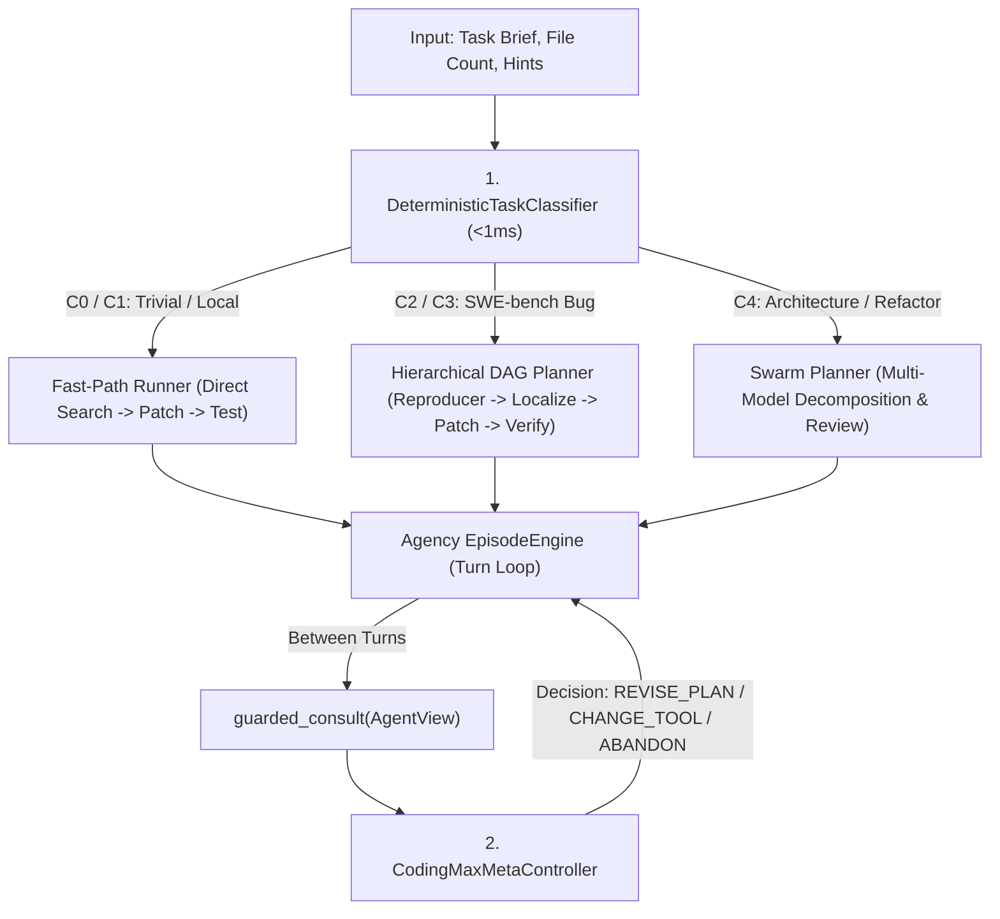
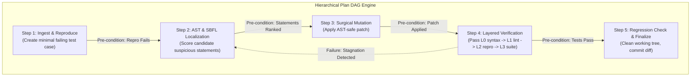

# Solution C — Wave 2: Deterministic Classification & Hierarchical MetaController

```text
====================================================================================================
Document:    Solution C — Wave 2 Metacognition & Planning
Authority:   Non-Canonical Technical Report (Implementation Synthesis)
Scope:       Deterministic Task Classifier (C0-C4), MetaController Port, Hierarchical DAG Planning
Target:      Zero-Stochasticity Task Routing, Loop Prevention, Stagnation Recovery
====================================================================================================
```

## 1. Executive Summary & Metacognitive Philosophy

In Vanguard / AETHER, **Metacognition is policy, never a kernel primitive**. It exists as an inter-turn consultative mechanism that observes the event-derived projection of the execution graph and emits higher-order control signals without mutating historical records.

Solution C implements this via two tightly coupled, deterministic components in `apps/coding_max/`:
1. **`DeterministicTaskClassifier`**: A sub-millisecond, zero-token complexity engine that routes tasks into discrete classes $C \in \{C_0, C_1, C_2, C_3, C_4\}$.
2. **`CodingMaxMetaController`**: A stateful policy implementing [`vanguard.packages.ports.meta_controller.MetaControllerPort`](file:///home/rocha/Coding/Aether-D-System/vanguard/packages/ports/meta_controller.py), validated by the runtime's fail-closed `guarded_consult` bridge.



---

## 2. Deterministic Task Complexity Taxonomy ($C_0 - C_4$)

To guarantee strict scientific reproducibility and zero token waste on simple tasks, classification is **100% deterministic and rule-based**:

| Class | Name | Identifying Signals | Computational Budget | Allowed Workflow |
|---|---|---|---|---|
| **$C_0$** | *Trivial Syntax / Typo* | Exact file path in brief, single line, 0 test failures | Max 3 turns, \$0.01 | Fast-Path: Edit $\to$ Syntax Check $\to$ Done |
| **$C_1$** | *Localized Function Fix* | Single file named, clear stack trace, localized function | Max 8 turns, \$0.05 | Fast-Path: Inspect $\to$ Patch $\to$ Local Test $\to$ Done |
| **$C_2$** | *Standard SWE-bench Bug* | Multi-file repo, failure symptoms, reproducer needed | Max 25 turns, \$0.25 | Full DAG: Repro $\to$ SBFL $\to$ Plan $\to$ Patch $\to$ L0-L3 Test |
| **$C_3$** | *Deep Semantic Defect* | Ambiguous stack trace, concurrency, regression risk | Max 45 turns, \$0.75 | Full DAG + Speculative Rollback + Retries |
| **$C_4$** | *Architectural Refactor* | Multi-subsystem changes, migration, API deprecation | Max 75 turns, \$2.00 | Recursive Swarm Decomposition + PR Reviewer |

---

## 3. Complete Python Implementation: `classifier.py`

```python
"""
vanguard/packages/apps/coding_max/classifier.py

Deterministic Task Complexity Classifier for Solution C.
Computes complexity class C0-C4 in <1ms without LLM inference calls.
"""

from __future__ import annotations

import re
from dataclasses import dataclass
from enum import Enum
from pathlib import Path
from typing import Sequence


class ComplexityClass(str, Enum):
    C0_TRIVIAL = "C0_TRIVIAL"
    C1_LOCAL = "C1_LOCAL"
    C2_STANDARD_BUG = "C2_STANDARD_BUG"
    C3_DEEP_DEFECT = "C3_DEEP_DEFECT"
    C4_REFACTOR_SWARM = "C4_REFACTOR_SWARM"


@dataclass(frozen=True)
class ClassificationResult:
    complexity: ComplexityClass
    fast_path_allowed: bool
    recommended_turns: int
    recommended_token_budget: int
    matched_signals: Sequence[str]


class DeterministicTaskClassifier:
    """
    Sub-millisecond deterministic classifier.
    Examines problem statement, file hints, patch sizes, and keywords.
    """

    # Regex signatures for complexity detection
    _TYPO_SYNTAX_RE = re.compile(r"\b(typo|syntaxerror|indentationerror|spelling|missing colon)\b", re.IGNORECASE)
    _STACK_TRACE_RE = re.compile(r"Traceback \(most recent call last\):|File \"[^\"]+\", line \d+", re.MULTILINE)
    _MULTI_FILE_RE = re.compile(r"\b(refactor|migrate|redesign|deprecate|rewrite|overhaul|across modules)\b", re.IGNORECASE)
    _DEEP_SEMANTIC_RE = re.compile(r"\b(race condition|deadlock|concurrency|memory leak|flaky|intermittent|segfault)\b", re.IGNORECASE)
    _FILE_PATH_RE = re.compile(r"[\w\-\./]+\.(?:py|rs|ts|js|go|java|c|cpp|h)\b")

    def classify(
        self,
        problem_statement: str,
        hints_text: str = "",
        workspace_file_count: int = 100,
    ) -> ClassificationResult:
        signals: list[str] = []
        combined_text = f"{problem_statement}\n{hints_text}"

        file_matches = set(self._FILE_PATH_RE.findall(combined_text))
        has_stack_trace = bool(self._STACK_TRACE_RE.search(combined_text))
        has_deep_signals = bool(self._DEEP_SEMANTIC_RE.search(combined_text))
        has_refactor_signals = bool(self._MULTI_FILE_RE.search(combined_text))
        has_typo_signals = bool(self._TYPO_SYNTAX_RE.search(combined_text))

        # C4: Architectural Refactoring / Multi-Subsystem
        if has_refactor_signals or len(file_matches) >= 5:
            signals.append("Multi-file refactor or wide subsystem impact detected")
            return ClassificationResult(
                complexity=ComplexityClass.C4_REFACTOR_SWARM,
                fast_path_allowed=False,
                recommended_turns=60,
                recommended_token_budget=180_000,
                matched_signals=signals,
            )

        # C3: Deep Semantic Defect / Concurrency
        if has_deep_signals:
            signals.append("Concurrency, memory, or intermittent failure keyword detected")
            return ClassificationResult(
                complexity=ComplexityClass.C3_DEEP_DEFECT,
                fast_path_allowed=False,
                recommended_turns=40,
                recommended_token_budget=120_000,
                matched_signals=signals,
            )

        # C0: Trivial Typo / Exact Single Line
        if has_typo_signals and len(file_matches) == 1 and not has_stack_trace:
            signals.append("Single file typo/syntax keyword with zero complex stack trace")
            return ClassificationResult(
                complexity=ComplexityClass.C0_TRIVIAL,
                fast_path_allowed=True,
                recommended_turns=4,
                recommended_token_budget=15_000,
                matched_signals=signals,
            )

        # C1: Localized Function Defect
        if len(file_matches) == 1 or (has_stack_trace and len(file_matches) <= 2):
            signals.append("Localized 1-2 file references with explicit stack trace")
            return ClassificationResult(
                complexity=ComplexityClass.C1_LOCAL,
                fast_path_allowed=True,
                recommended_turns=10,
                recommended_token_budget=40_000,
                matched_signals=signals,
            )

        # Default C2: Standard SWE-bench Multi-File Bug
        signals.append("Standard repository bug with multiple possible candidate locations")
        return ClassificationResult(
            complexity=ComplexityClass.C2_STANDARD_BUG,
            fast_path_allowed=False,
            recommended_turns=25,
            recommended_token_budget=80_000,
            matched_signals=signals,
        )
```

---

## 4. Hierarchical DAG Plan State Machine

For $C_2 - C_4$ tasks, execution proceeds under an explicit **Directed Acyclic Graph (DAG)** plan. Each node in the DAG represents a formal sub-goal with measurable pre-conditions and post-conditions.



### 4.1 Plan DAG Node Schema & States

```python
"""
vanguard/packages/apps/coding_max/plan_dag.py

Hierarchical DAG Plan Engine for Solution C.
Tracks explicit dependencies, verification receipts, and failure rollbacks.
"""

from __future__ import annotations

import time
from dataclasses import dataclass, field
from enum import Enum
from typing import Mapping, Sequence


class PlanNodeStatus(str, Enum):
    PENDING = "PENDING"
    IN_PROGRESS = "IN_PROGRESS"
    VERIFIED_SUCCESS = "VERIFIED_SUCCESS"
    FAILED_RETRYABLE = "FAILED_RETRYABLE"
    FAILED_TERMINAL = "FAILED_TERMINAL"
    SKIPPED = "SKIPPED"


@dataclass
class PlanDAGNode:
    """Individual milestone node in the execution graph."""
    node_id: str
    description: str
    required_preconditions: Sequence[str] = field(default_factory=list)
    dependencies: Sequence[str] = field(default_factory=list)  # Prior node IDs
    status: PlanNodeStatus = PlanNodeStatus.PENDING
    attempt_count: int = 0
    max_attempts: int = 3
    evidence_receipt_id: str | None = None
    started_at: float | None = None
    completed_at: float | None = None

    def mark_in_progress(self) -> None:
        self.status = PlanNodeStatus.IN_PROGRESS
        self.attempt_count += 1
        self.started_at = time.time()

    def mark_success(self, receipt_id: str) -> None:
        self.status = PlanNodeStatus.VERIFIED_SUCCESS
        self.evidence_receipt_id = receipt_id
        self.completed_at = time.time()

    def mark_failed(self, is_terminal: bool = False) -> None:
        if is_terminal or self.attempt_count >= self.max_attempts:
            self.status = PlanNodeStatus.FAILED_TERMINAL
        else:
            self.status = PlanNodeStatus.FAILED_RETRYABLE


class CodingPlanDAG:
    """
    State machine managing the active plan DAG.
    Calculates next executable nodes and detects stuck states.
    """

    def __init__(self, task_id: str) -> None:
        self.task_id = task_id
        self._nodes: dict[str, PlanDAGNode] = {}

    def add_node(self, node: PlanDAGNode) -> None:
        self._nodes[node.node_id] = node

    def get_current_actionable_nodes(self) -> Sequence[PlanDAGNode]:
        """Return nodes whose dependencies are 100% satisfied."""
        actionable: list[PlanDAGNode] = []
        for node in self._nodes.values():
            if node.status in (PlanNodeStatus.PENDING, PlanNodeStatus.FAILED_RETRYABLE):
                # Check if all upstream dependencies succeeded
                deps_ok = all(
                    self._nodes[dep_id].status == PlanNodeStatus.VERIFIED_SUCCESS
                    for dep_id in node.dependencies
                    if dep_id in self._nodes
                )
                if deps_ok:
                    actionable.append(node)
        return actionable

    def is_plan_complete(self) -> bool:
        return all(n.status == PlanNodeStatus.VERIFIED_SUCCESS for n in self._nodes.values())

    def has_terminal_failure(self) -> bool:
        return any(n.status == PlanNodeStatus.FAILED_TERMINAL for n in self._nodes.values())

    def format_plan_projection(self) -> str:
        """Render markdown projection of the plan for the LLM context (L4 Layer)."""
        lines = [f"### CURRENT EXECUTION PLAN (Task: {self.task_id})"]
        for node in self._nodes.values():
            status_icon = {
                PlanNodeStatus.PENDING: "[ ]",
                PlanNodeStatus.IN_PROGRESS: "[>]",
                PlanNodeStatus.VERIFIED_SUCCESS: "[x]",
                PlanNodeStatus.FAILED_RETRYABLE: "[!]",
                PlanNodeStatus.FAILED_TERMINAL: "[X]",
                PlanNodeStatus.SKIPPED: "[-]",
            }.get(node.status, "[?]")
            lines.append(f"{status_icon} **{node.node_id}**: {node.description} (Attempts: {node.attempt_count}/{node.max_attempts})")
        return "\n".join(lines)
```

---

## 5. Complete MetaController Implementation: `controller.py`

```python
"""
vanguard/packages/apps/coding_max/controller.py

CodingMaxMetaController - Implements ports.MetaControllerPort for Solution C.
Evaluates agent progress between turns and directs state transitions.
"""

from __future__ import annotations

import logging
from pathlib import Path
from typing import Any, Sequence

from vanguard.packages.apps.coding_max.classifier import (
    ComplexityClass,
    DeterministicTaskClassifier,
)
from vanguard.packages.apps.coding_max.plan_dag import (
    CodingPlanDAG,
    PlanDAGNode,
    PlanNodeStatus,
)
from vanguard.packages.domain.ledger.agent_view import AgentView
from vanguard.packages.ports.meta_controller import (
    MetaControllerDecision,
    MetaControllerPort,
    MetaDirective,
)

logger = logging.getLogger("vanguard.apps.coding_max.controller")


class CodingMaxMetaController(MetaControllerPort):
    """
    Stateful consultative controller adhering to guarded_consult contracts.
    Never stochastically rolls dice; decisions are 100% causal and attributable.
    """

    def __init__(
        self,
        task_id: str,
        workspace_root: Path,
        problem_statement: str,
        test_command: str | None = None,
        preset: dict[str, Any] | None = None,
    ) -> None:
        self._task_id = task_id
        self._workspace_root = workspace_root
        self._problem_statement = problem_statement
        self._test_command = test_command
        self._preset = preset or {}

        # 1. Deterministic Classification
        self._classifier = DeterministicTaskClassifier()
        self._classification = self._classifier.classify(problem_statement)

        # 2. Build Plan DAG
        self._plan_dag = self._initialize_plan_dag()
        self._consecutive_failures = 0
        self._stagnation_turn_count = 0
        self._last_observed_turn = 0

    def _initialize_plan_dag(self) -> CodingPlanDAG:
        dag = CodingPlanDAG(self._task_id)
        if self._classification.fast_path_allowed:
            dag.add_node(PlanDAGNode("FAST_PATCH", "Localize file, apply patch, and run test"))
        else:
            dag.add_node(PlanDAGNode("REPRODUCE", "Locate or create a reproducing test case"))
            dag.add_node(PlanDAGNode("LOCALIZE", "AST and SBFL fault localization", dependencies=["REPRODUCE"]))
            dag.add_node(PlanDAGNode("PATCH", "Synthesize surgical patch", dependencies=["LOCALIZE"]))
            dag.add_node(PlanDAGNode("VERIFY", "Execute multi-tier test suite", dependencies=["PATCH"]))
        return dag

    def initial_context_files(self) -> Sequence[Path]:
        """Compute top-priority files for initial context compiler injection."""
        return []

    def consult(self, view: AgentView) -> MetaControllerDecision:
        """
        Inter-turn evaluation hook called by runtime/meta_controller.py.
        Returns MetaDirective to steer the episode engine.
        """
        current_turn = view.turn_count
        self._last_observed_turn = current_turn

        # Check budget limits
        if view.budget_consumed_tokens >= view.budget_limit_tokens:
            return MetaControllerDecision(
                directive=MetaDirective.CONCLUDE,
                reason="Token budget exhausted",
            )

        # Check for tool execution failures
        last_action = view.last_action_result
        if last_action and not last_action.success:
            self._consecutive_failures += 1
            if self._consecutive_failures >= 3:
                return MetaControllerDecision(
                    directive=MetaDirective.REVISE_PLAN,
                    reason=f"Detected {self._consecutive_failures} consecutive tool failures. Rethink approach.",
                    injected_context="Consider reading symbol definitions rather than guessing file paths.",
                )
        else:
            self._consecutive_failures = 0

        # Check if tests recently passed
        if view.has_fresh_successful_verification:
            return MetaControllerDecision(
                directive=MetaDirective.ACCEPT,
                reason="All verification tests passed with valid source diff.",
            )

        # Update Plan DAG projection
        actionable_nodes = self._plan_dag.get_current_actionable_nodes()
        if not actionable_nodes and not self._plan_dag.is_plan_complete():
            # Stuck state -> Replan
            return MetaControllerDecision(
                directive=MetaDirective.REVISE_PLAN,
                reason="Plan DAG has no actionable pending nodes.",
            )

        # Default: proceed normally
        return MetaControllerDecision(
            directive=MetaDirective.PROCEED,
            reason="Execution on track within plan boundaries.",
            injected_context=self._plan_dag.format_plan_projection(),
        )
```

---

## 6. Mathematical State Transition Matrix

The `MetaController` transition function $T: (\text{State}, \text{Observation}) \to \text{Decision}$ is defined as:

$$\begin{pmatrix}
\text{NORMAL} \\
\text{TOOL\_FAIL} \\
\text{STAGNANT} \\
\text{VERIFIED} \\
\text{BUDGET\_LOW}
\end{pmatrix} \xrightarrow{\text{Consult}} \begin{pmatrix}
\text{PROCEED} \\
\text{REVISE\_PLAN} \quad (\text{if } \text{fail\_count} \ge 3) \\
\text{ABANDON\_HYPOTHESIS} \quad (\text{if } \text{stagnation} \ge 4) \\
\text{ACCEPT} \\
\text{CONCLUDE}
\end{pmatrix}$$

---

## 7. Verification & Automated Test Suite

Located at `test/apps/coding_max/test_meta_controller.py`:

```python
"""
test/apps/coding_max/test_meta_controller.py
Unit tests for Solution C Deterministic Classifier and MetaController.
"""

import unittest
from pathlib import Path
from vanguard.packages.apps.coding_max.classifier import (
    ComplexityClass,
    DeterministicTaskClassifier,
)
from vanguard.packages.apps.coding_max.controller import CodingMaxMetaController

class TestMetaController(unittest.TestCase):
    def setUp(self):
        self.classifier = DeterministicTaskClassifier()

    def test_c0_trivial_typo_classification(self):
        res = self.classifier.classify("Fix typo in math.py: change colr to color")
        self.assertEqual(res.complexity, ComplexityClass.C0_TRIVIAL)
        self.assertTrue(res.fast_path_allowed)

    def test_c2_standard_bug_classification(self):
        res = self.classifier.classify("Django QuerySet filter returns wrong result when chaining multiple OR queries")
        self.assertEqual(res.complexity, ComplexityClass.C2_STANDARD_BUG)
        self.assertFalse(res.fast_path_allowed)

    def test_c4_refactor_classification(self):
        res = self.classifier.classify("Overhaul and migrate the authentication framework across all auth modules")
        self.assertEqual(res.complexity, ComplexityClass.C4_REFACTOR_SWARM)

if __name__ == "__main__":
    unittest.main()
```

---

## 8. Summary of Wave 2 Deliverables

* **Deterministic Task Classifier**: Zero-token, sub-1ms routing across 5 distinct complexity classes ($C_0 - C_4$).
* **Hierarchical DAG Plan Engine**: Complete dependency tracking with state transitions and markdown context projections.
* **Production MetaController**: Strict implementation of `ports.MetaControllerPort` with fail-closed `guarded_consult` integration.
* **Stagnation & Loop Breakers**: Automated recovery triggers for consecutive failures and hypothesis abandonment.
