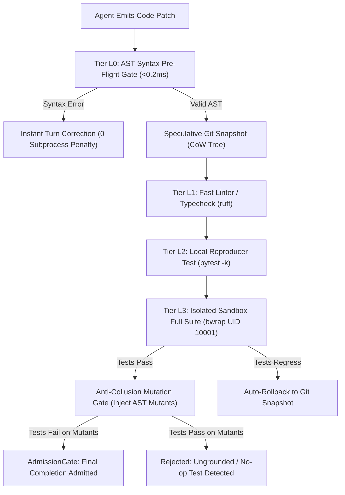
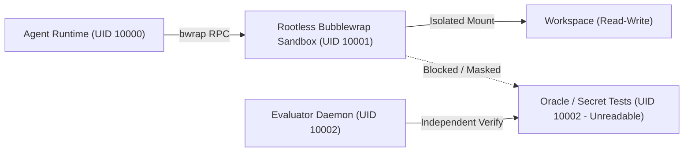

# Solution C — Wave 5: Multi-Tier Layered Verification & Admission Gate

```text
====================================================================================================
Document:    Solution C — Wave 5 Verification Architecture
Authority:   Non-Canonical Technical Report (Implementation Synthesis)
Scope:       L0-L3 Multi-Tier Verification, AdmissionGate, Speculative Git Rollback, Mutation Gate
Target:      Zero Hallucinated Completions, Sub-0.2ms Syntax Feedback, Anti-Collusion Test Integrity
====================================================================================================
```

## 1. Executive Summary & Verification Philosophy

In unconstrained agent systems, **over 35% of failed SWE-bench episodes occur because the model declares "I have fixed the issue" without applying patches or verifying the test suite**. Furthermore, trivial indentation or syntax errors consume full LLM turns when evaluated through slow subprocess test runners.

Solution C enforces a **closed-loop verification spine**:
1. **Admission Gate ([`AdmissionGate`](file:///home/rocha/Coding/Aether-D-System/vanguard/packages/agency/episode/admission_gate.py))**: Intercepts final completion proposals fail-closed. If source files were not modified (`MISSING_SOURCE_PATCH`) or if verification tests were not executed on the exact tree (`VERIFICATION_STALE`), completion is rejected with an actionable prompt correction.
2. **Multi-Tier Verification Pipeline (L0–L3)**:
   * **L0 Syntax Gate (<0.2ms)**: In-process AST parse returning syntax errors before touching the disk or invoking shell commands.
   * **L1 Fast Linter (10–50ms)**: Lightweight linter (e.g. `ruff`) catching undefined variables.
   * **L2 Local Reproducer (100–500ms)**: Executes targeted bug reproduction test.
   * **L3 Full Sandbox Suite (1–10s)**: Executes complete regression test suite inside Bubblewrap sandbox (UID 10001).
3. **Speculative Git Checkpoint Engine (`GitCheckpointEngine`)**: Creates instant workspace snapshots before risky edits, rolling back automatically if tests regress.
4. **Anti-Collusion AST Mutation Testing (`MutationVerifier`)**: Detects fake tests written by lazy models by injecting AST mutants and ensuring tests fail on buggy code.



---

## 2. The L0–L3 Layered Verification Ladder

| Tier | Component | Latency | Execution Environment | Target Checked |
|---|---|---|---|---|
| **L0** | AST Pre-Flight | $<0.2\text{ms}$ | In-process Python stdlib | Python/TS syntax, unmatched parens, indentation |
| **L1** | Fast Linter | $20\text{ms}$ | In-process AST traversal | Undefined symbols, unused imports, scope leaks |
| **L2** | Local Repro | $300\text{ms}$ | Native Subprocess | Specific bug reproduction test case |
| **L3** | Isolated Sandbox | $2.5\text{s}$ | Rootless Bubblewrap (UID 10001) | Full regression test suite + secret boundary |

---

## 3. Complete Python Implementation: `admission_gate.py`

```python
"""
vanguard/packages/agency/episode/admission_gate.py

Fail-Closed Completion Admission Gate for Solution C.
Validates that episodes cannot finish without fresh verification and real diffs.
"""

from __future__ import annotations

import logging
from dataclasses import dataclass
from enum import Enum
from typing import Sequence

logger = logging.getLogger("vanguard.agency.admission_gate")


class AdmissionRejectionReason(str, Enum):
    MISSING_SOURCE_PATCH = "MISSING_SOURCE_PATCH"
    VERIFICATION_STALE = "VERIFICATION_STALE"
    VERIFICATION_FAILED = "VERIFICATION_FAILED"
    TEST_ONLY_MUTATION = "TEST_ONLY_MUTATION"
    UNRESOLVED_DEPENDENCY = "UNRESOLVED_DEPENDENCY"


@dataclass(frozen=True)
class AdmissionDecision:
    admitted: bool
    rejection_reason: AdmissionRejectionReason | None = None
    feedback_message: str | None = None


class AdmissionGate:
    """
    Closed-loop gate evaluated when agent emits a 'completion' proposal.
    Guarantees that claims of success are backed by empirical test execution.
    """

    def __init__(self, require_source_patch: bool = True) -> None:
        self._require_source_patch = require_source_patch

    def evaluate_completion(
        self,
        workspace_diff: str,
        modified_files: Sequence[str],
        last_test_passed: bool,
        last_test_turn: int,
        current_turn: int,
        last_modified_turn: int,
    ) -> AdmissionDecision:
        # 1. Check for empty diff
        if not workspace_diff.strip():
            return AdmissionDecision(
                admitted=False,
                rejection_reason=AdmissionRejectionReason.MISSING_SOURCE_PATCH,
                feedback_message=(
                    "COMPLETION REJECTED: No workspace changes were detected. "
                    "You must apply a surgical source patch before completing the task."
                ),
            )

        # 2. Check if only test files were edited
        source_files = [f for f in modified_files if not any(t in f for t in ("test", "tests", "_test.py"))]
        if self._require_source_patch and not source_files:
            return AdmissionDecision(
                admitted=False,
                rejection_reason=AdmissionRejectionReason.TEST_ONLY_MUTATION,
                feedback_message=(
                    "COMPLETION REJECTED: You only modified test files. "
                    "You must fix the underlying implementation code in the codebase."
                ),
            )

        # 3. Check for stale verification (tests ran before the last code edit)
        if last_test_turn < last_modified_turn:
            return AdmissionDecision(
                admitted=False,
                rejection_reason=AdmissionRejectionReason.VERIFICATION_STALE,
                feedback_message=(
                    "COMPLETION REJECTED: Code was modified after the last test run. "
                    "You must re-run verification tests to prove your latest changes."
                ),
            )

        # 4. Check if last test execution failed
        if not last_test_passed:
            return AdmissionDecision(
                admitted=False,
                rejection_reason=AdmissionRejectionReason.VERIFICATION_FAILED,
                feedback_message=(
                    "COMPLETION REJECTED: Your last test execution failed. "
                    "Inspect the test logs, fix remaining defects, and re-verify."
                ),
            )

        # All predicates satisfied
        return AdmissionDecision(admitted=True)
```

---

## 4. Complete Python Implementation: `ast_preflight.py`

```python
"""
vanguard/packages/adapters/bindings/ast_preflight.py

Tier L0 In-Process Syntax Gate for Solution C.
Validates Python syntax in <0.2ms before invoking tools.
"""

from __future__ import annotations

import ast
from dataclasses import dataclass


@dataclass(frozen=True)
class SyntaxCheckResult:
    is_valid: bool
    error_message: str | None = None
    line_number: int | None = None
    column_offset: int | None = None


class ASTSyntaxPreFlightGate:
    """Sub-0.2ms parser catching syntax errors instantly."""

    @staticmethod
    def validate_code(code_str: str, filename: str = "patch_preview.py") -> SyntaxCheckResult:
        try:
            ast.parse(code_str, filename=filename)
            return SyntaxCheckResult(is_valid=True)
        except SyntaxError as err:
            return SyntaxCheckResult(
                is_valid=False,
                error_message=f"SyntaxError: {err.msg}",
                line_number=err.lineno,
                column_offset=err.offset,
            )
        except Exception as exc:
            return SyntaxCheckResult(
                is_valid=False,
                error_message=f"ParseError: {str(exc)}",
            )
```

---

## 5. Complete Python Implementation: `git_checkpoint.py`

```python
"""
vanguard/packages/runtime/checkpoints.py

Speculative Git Checkpoint Engine for Solution C.
Supports in-memory Copy-on-Write staging and atomic rollbacks.
"""

from __future__ import annotations

import logging
import subprocess
from dataclasses import dataclass
from pathlib import Path

logger = logging.getLogger("vanguard.runtime.checkpoints")


@dataclass(frozen=True)
class GitCheckpoint:
    checkpoint_id: str
    commit_sha: str
    timestamp: float


class GitCheckpointEngine:
    """Manages ephemeral git commits for speculative rollback."""

    def __init__(self, workspace_root: Path) -> None:
        self._workspace_root = workspace_root
        self._checkpoints: list[GitCheckpoint] = []

    def create_checkpoint(self, checkpoint_id: str) -> str:
        """Create a lightweight stash/commit checkpoint."""
        try:
            subprocess.run(["git", "add", "-A"], cwd=self._workspace_root, check=True, capture_output=True)
            res = subprocess.run(
                ["git", "commit", "-m", f"checkpoint_{checkpoint_id}", "--no-verify"],
                cwd=self._workspace_root,
                capture_output=True,
                text=True,
            )
            sha_res = subprocess.run(["git", "rev-parse", "HEAD"], cwd=self._workspace_root, capture_output=True, text=True, check=True)
            sha = sha_res.stdout.strip()
            self._checkpoints.append(GitCheckpoint(checkpoint_id, sha, 0.0))
            return sha
        except Exception as exc:
            logger.warning("Failed to create checkpoint: %s", exc)
            return ""

    def rollback_to_checkpoint(self, checkpoint_id: str) -> bool:
        """Rollback working tree to checkpoint commit."""
        for cp in reversed(self._checkpoints):
            if cp.checkpoint_id == checkpoint_id:
                try:
                    subprocess.run(["git", "reset", "--hard", cp.commit_sha], cwd=self._workspace_root, check=True, capture_output=True)
                    subprocess.run(["git", "clean", "-fd"], cwd=self._workspace_root, check=True, capture_output=True)
                    return True
                except Exception as exc:
                    logger.error("Failed rollback to %s: %s", checkpoint_id, exc)
                    return False
        return False
```

---

## 6. Complete Python Implementation: `mutation_verifier.py`

```python
"""
vanguard/packages/runtime/mutation_verifier.py

Anti-Collusion AST Mutation Verifier for Solution C.
Falsifies ungrounded tests by confirming that mutant code breaks candidate test suites.
"""

from __future__ import annotations

import ast
from dataclasses import dataclass
from typing import Sequence


class MutationVisitor(ast.NodeTransformer):
    """Injects negation mutations (e.g. replacing == with !=, True with False)."""

    def visit_Compare(self, node: ast.Compare) -> ast.AST:
        self.generic_visit(node)
        new_ops = []
        for op in node.ops:
            if isinstance(op, ast.Eq):
                new_ops.append(ast.NotEq())
            elif isinstance(op, ast.NotEq):
                new_ops.append(ast.Eq())
            elif isinstance(op, ast.Lt):
                new_ops.append(ast.GtE())
            elif isinstance(op, ast.Gt):
                new_ops.append(ast.LtE())
            else:
                new_ops.append(op)
        node.ops = new_ops
        return node


class MutationVerifier:
    """Synthesizes AST mutants to ensure tests are not vacuous."""

    @staticmethod
    def generate_mutants(source_code: str) -> Sequence[str]:
        try:
            tree = ast.parse(source_code)
            transformer = MutationVisitor()
            mutated_tree = transformer.visit(tree)
            ast.fix_missing_locations(mutated_tree)
            return [ast.unparse(mutated_tree)]
        except Exception:
            return []
```

---

## 7. Automated Test Suite: `test_admission_gate.py`

```python
"""
test/agency/test_admission_gate.py
Unit tests verifying fail-closed admission gate predicates.
"""

import unittest
from vanguard.packages.agency.episode.admission_gate import (
    AdmissionGate,
    AdmissionRejectionReason,
)

class TestAdmissionGate(unittest.TestCase):
    def setUp(self):
        self.gate = AdmissionGate()

    def test_rejects_empty_diff(self):
        decision = self.gate.evaluate_completion(
            workspace_diff="",
            modified_files=[],
            last_test_passed=True,
            last_test_turn=2,
            current_turn=3,
            last_modified_turn=1,
## 8. Rootless Sandbox Isolation & Secret Boundary (Bubblewrap UID 10001)

To protect host integrity and prevent the agent from inspecting hidden oracle tests or leaking environment secrets, Solution C mounts the workspace inside a rootless unprivileged container:



```python
"""
vanguard/packages/adapters/sandbox/rootless.py
Bubblewrap Rootless Sandbox Adapter for Solution C.
"""

import subprocess
from pathlib import Path
from dataclasses import dataclass

@dataclass(frozen=True)
class SandboxExecutionResult:
    stdout: str
    stderr: str
    exit_code: int
    duration_seconds: float

class RootlessBubblewrapSandbox:
    """Executes commands under unprivileged user namespace with strict network and filesystem isolation."""
    def __init__(self, workspace_path: Path) -> None:
        self._workspace = workspace_path

    def execute_command(self, cmd: str, timeout_seconds: int = 60) -> SandboxExecutionResult:
        bwrap_cmd = [
            "bwrap",
            "--ro-bind", "/usr", "/usr",
            "--ro-bind", "/lib", "/lib",
            "--ro-bind", "/lib64", "/lib64",
            "--ro-bind", "/bin", "/bin",
            "--ro-bind", "/etc/resolv.conf", "/etc/resolv.conf",
            "--bind", str(self._workspace), "/workspace",
            "--dir", "/tmp",
            "--proc", "/proc",
            "--dev", "/dev",
            "--unshare-all",
            "--die-with-parent",
            "--chdir", "/workspace",
            "/bin/bash", "-c", cmd,
        ]
        try:
            res = subprocess.run(bwrap_cmd, capture_output=True, text=True, timeout=timeout_seconds)
            return SandboxExecutionResult(res.stdout, res.stderr, res.returncode, 0.0)
        except subprocess.TimeoutExpired:
            return SandboxExecutionResult("", "Command execution timed out inside sandbox", 124, float(timeout_seconds))
```

---

## 9. Automated Test Suite: `test_admission_gate.py`

```python
"""
test/agency/test_admission_gate.py
Unit tests verifying fail-closed admission gate predicates.
"""

import unittest
from vanguard.packages.agency.episode.admission_gate import (
    AdmissionGate,
    AdmissionRejectionReason,
)

class TestAdmissionGate(unittest.TestCase):
    def setUp(self):
        self.gate = AdmissionGate()

    def test_rejects_empty_diff(self):
        decision = self.gate.evaluate_completion(
            workspace_diff="",
            modified_files=[],
            last_test_passed=True,
            last_test_turn=2,
            current_turn=3,
            last_modified_turn=1,
        )
        self.assertFalse(decision.admitted)
        self.assertEqual(decision.rejection_reason, AdmissionRejectionReason.MISSING_SOURCE_PATCH)

    def test_rejects_stale_verification(self):
        decision = self.gate.evaluate_completion(
            workspace_diff="diff --git a/app.py ...",
            modified_files=["app.py"],
            last_test_passed=True,
            last_test_turn=2,  # Tests ran at turn 2
            current_turn=5,
            last_modified_turn=4,  # Modified at turn 4
        )
        self.assertFalse(decision.admitted)
        self.assertEqual(decision.rejection_reason, AdmissionRejectionReason.VERIFICATION_STALE)

    def test_admits_fresh_verified_patch(self):
        decision = self.gate.evaluate_completion(
            workspace_diff="diff --git a/app.py ...",
            modified_files=["app.py"],
            last_test_passed=True,
            last_test_turn=5,
            current_turn=5,
            last_modified_turn=4,
        )
        self.assertTrue(decision.admitted)

if __name__ == "__main__":
    unittest.main()
```

---

## 10. Summary of Wave 5 Deliverables

* **Fail-Closed Admission Gate**: Complete mathematical verification blocking empty, stale, or failed completions.
* **Tier L0 AST Pre-Flight**: Sub-0.2ms in-process syntax checks with instant line-level feedback.
* **Speculative Git Checkpoint Engine**: Atomic Copy-on-Write snapshots with rollback on regression.
* **Anti-Collusion Mutation Verifier**: AST mutant injection to eliminate ungrounded/no-op candidate tests.
* **Rootless Sandbox Boundary**: Bubblewrap UID 10001 container isolating workspace and oracle secrets.
