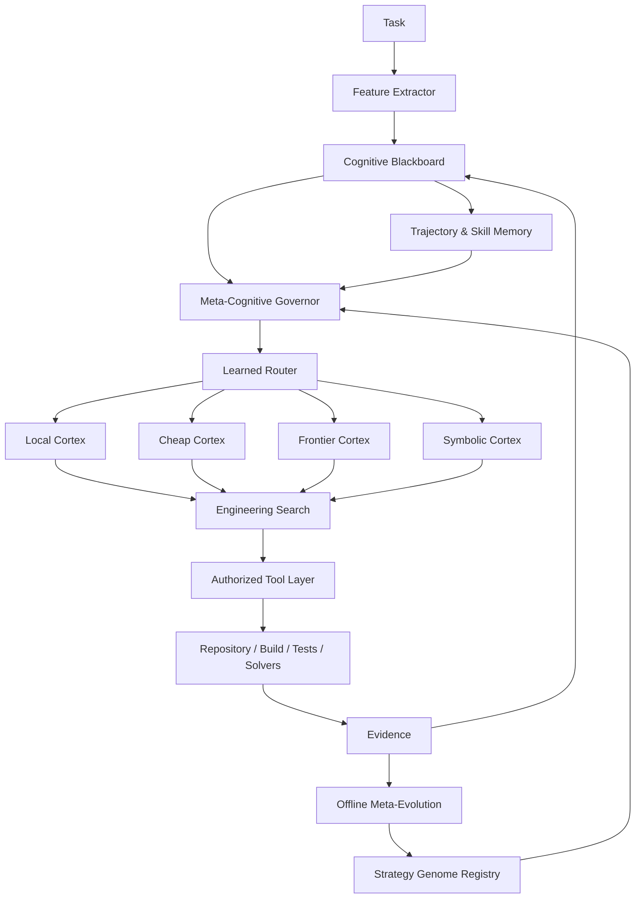

# AETHER — ELECTROWEAK / Vanguard
# CHIMERA: Neuro-Symbolic Adaptive Meta-Harness
## Principal Engineering PRD, Research Architecture & Development Guide

**Document class:** Product Requirements Document + Architecture Decision Record + Implementation Blueprint  
**Status:** Experimental third-generation coding architecture  
**Target substrate:** AETHER — ELECTROWEAK / Vanguard  
**Harness:** `vg-code-chimera`  
**Primary domain:** Long-horizon software engineering, repository repair, scientific coding, algorithmic reasoning, coding challenges, SWE-style benchmarks  
**Secondary domain:** Mathematical reasoning, symbolic/numerical problem solving, program synthesis, repository research  
**Engineering level:** Staff / Principal / Senior Principal Software Architecture  
**Date:** 2026-08-30

---

# 0. Executive Decision

CHIMERA is the third and deliberately most eclectic AETHER coding architecture.

It is **not**:

1. the first design's large engineered pipeline;
2. the second design's minimal reflexive runtime;
3. a conventional swarm;
4. a single-model coding agent;
5. a benchmark-specific script.

CHIMERA combines structured engineering control with runtime flexibility, but adds a new dimension:

> **A heterogeneous cognitive machine where different kinds of computation are assigned to the cheapest mechanism competent to perform them.**

Instead of asking a frontier LLM to perform every operation, CHIMERA uses a portfolio:

```text
Frontier LLMs
Cheap/fast LLMs
Small local LLMs
Embedding models
Neural rerankers
Graph neural networks
Classifiers
Contextual bandits
Search algorithms
Symbolic solvers
Static analysis
Test runners
Fuzzers
Property-based testing
Repository graphs
Deterministic scripts
Learned skills
Trajectory memory
```

The central architecture is a **Mixture of Cognition (MoC)**:

```text
                    TASK
                      │
                      ▼
            Cognitive Blackboard
                      │
                      ▼
            Meta-Cognitive Governor
                      │
         ┌────────────┼─────────────┐
         ▼            ▼             ▼
   Fast Local     Frontier      Symbolic /
    Cortex          Cortex       Algorithmic
         │            │             │
         └────────────┼─────────────┘
                      ▼
              Engineering Search
                      │
           hypotheses / patches /
             tests / strategies
                      │
                      ▼
               Real Environment
                      │
                      ▼
            Evidence + Trajectory
                      │
           ┌──────────┴──────────┐
           ▼                     ▼
       Online Adaptation     Offline Evolution
       routing/memory        prompts/skills/
                            workflows/models
```

Three loops operate at different timescales:

```text
L0 — Engineering Loop
Observe → Act → Verify → Repair

L1 — Deliberation/Search Loop
Generate hypotheses → Explore → Compare → Distill → Refine

L2 — Evolution Loop
Mine trajectories → Diagnose patterns → Mutate harness → Evaluate → Promote
```

The defining principle is:

> **Do not spend frontier intelligence on computation that can be performed faster, cheaper, and more reliably by an algorithm, local model, solver, or learned specialist.**

---

# 1. Why CHIMERA Exists

Current coding agents often behave as if a single generative model should:

```text
understand task
retrieve code
rank files
interpret graph structure
plan
write code
run tools
parse logs
select tests
evaluate patches
decide whether it is stuck
decide which model should run next
remember previous failures
optimize its own prompts
```

This is computationally wasteful.

Many of those operations are:

- ranking problems;
- classification problems;
- graph problems;
- optimization problems;
- search problems;
- deterministic transformations;
- constraint-solving problems.

A frontier LLM should be reserved for decisions where broad semantic reasoning is genuinely valuable.

CHIMERA therefore treats the coding harness as an **adaptive computational system**, not merely an LLM loop.

---

# 2. Research Basis

The architecture is grounded in several converging research directions.

## 2.1 Test-time scaling for coding

Recent work on agentic coding shows that increasing inference-time computation can materially improve software engineering performance, but naive repeated rollouts waste compute. "Scaling Test-Time Compute for Agentic Coding" uses compact trajectory representations with Recursive Tournament Voting and Parallel-Distill-Refine to reuse prior attempts. It reports substantial gains on SWE-Bench Verified and Terminal-Bench. [R1]

SWE-Replay similarly reuses prior trajectories and branches from important intermediate states, reducing cost while retaining or improving performance. [R2]

**CHIMERA implication:**

```text
trajectory representation
+
selection
+
reuse
```

matter more than simply launching many agents.

---

## 2.2 Repository retrieval is a first-class failure surface

Agent Retrieval Bench finds that no single retrieval method dominates across coding workflows and that logged coding trajectories can entirely miss required files. [R3]

ContextBench similarly studies context retrieval as its own process rather than treating final patch success as the only metric. [R4]

Repository-level neural retrieval work shows large improvements from multi-stage retrieval and neural reranking. [R5]

SweRank+ combines code embeddings, learned reranking, and iterative agent search for issue localization. [R6]

**CHIMERA implication:**

Repository context should be obtained through an **ensemble retrieval market**, not a single semantic-search system.

---

## 2.3 Graph learning for bug localization and test selection

GREPO studies GNNs specifically for repository-level bug localization and reports advantages over traditional retrieval baselines. [R7]

Graph-based regression-test prioritization research combines code dependency graphs, execution traces, and learned ranking to improve test ordering. [R8]

**CHIMERA implication:**

A local graph model can act as a cheap structural specialist for:

```text
fault localization
impact prediction
test prioritization
dependency relevance
```

without invoking a frontier LLM.

---

## 2.4 Small models can become tool-using specialists

Agent Distillation demonstrates that small models, including sub-7B and even sub-3B scales, can inherit tool-using behavior through trajectory distillation. [R9]

Devstral showed that an agent-specialized open model small enough for a workstation can perform strongly in software engineering when paired with a suitable harness. [R10]

**CHIMERA implication:**

Do not ask a local small model to replace the frontier solver.

Train/distill it for narrow high-frequency roles.

---

## 2.5 Learned routing

Agent-as-a-Router frames coding-model selection as an adaptive Context → Action → Feedback loop and shows that accumulated execution experience materially improves routing. [R11]

**CHIMERA implication:**

Model selection should become an online learning problem rather than a static mapping.

---

## 2.6 Metacognition and capability boundaries

Recent metacognition work emphasizes confidence, belief updating, procedural reflection, and competence boundaries. [R12][R13]

MARS distinguishes principle-level reflection from procedural reflection for efficient self-improvement. [R14]

**CHIMERA implication:**

The system should maintain explicit:

```text
beliefs
confidence
unknowns
capability estimates
failure attribution
```

and use historical calibration rather than raw LLM confidence.

---

## 2.7 Verification scaling

DeepVerifier demonstrates inference-time verification using explicit failure rubrics and reports gains over simpler LLM-as-judge baselines. [R15]

Program repair literature also consistently shows that compiler/test feedback improves iterative repair. [R16]

**CHIMERA implication:**

Verification is itself a computational budget that can scale independently of generation.

---

## 2.8 Automated workflow/prompt evolution

AFlow formulates workflow generation as search over executable agent graphs using MCTS. [R17]

MIPRO optimizes multi-stage language-model programs using data-aware instruction generation and Bayesian optimization. [R18]

TextGrad treats textual feedback as an optimization signal over compound AI systems. [R19]

EvoAgentX integrates several workflow-optimization families. [R20]

ARTEMIS reports evolutionary joint optimization of prompts/tool descriptions/configurations, including improvements on a Mini-SWE-based setup. [R21]

AlphaEvolve demonstrates the broader power of evaluator-driven evolutionary search over code. [R22]

**CHIMERA implication:**

The harness itself can be treated as an optimizable program — but optimization must occur in a controlled experimental layer, not by arbitrary self-modification during production runs.

---

# 3. Reality Constraint

SWE-Bench Pro is much harder than traditional SWE-bench. Its paper reports frontier models below 25% Pass@1 under its unified scaffold at publication time. [R23]

More recent scientific SWE evaluation still reports substantial headroom even for leading coding systems. [R24]

Therefore:

> CHIMERA must be designed as an experimental capability program, not as a guarantee of 90% benchmark success.

The architecture should maximize the probability of discovering stronger strategies.

---

# 4. Core Thesis

CHIMERA uses five interacting computational layers:

```text
1. Symbolic / deterministic computation
2. Learned local specialists
3. Cheap generative workers
4. Frontier deliberative models
5. Meta-optimization algorithms
```

These form a hierarchy of cost:

```text
deterministic
    <
small local inference
    <
cheap hosted model
    <
frontier model
    <
multi-rollout frontier search
```

Every decision should be executed at the **lowest layer likely to solve it correctly**.

---

# 5. Design Principles

## P1 — Intelligence is heterogeneous

Do not encode intelligence as "LLM call".

## P2 — Environment evidence dominates verbal confidence

```text
tests > verifier > model confidence
```

## P3 — Routing is learned

The system should learn which computational component works best for which class of decision.

## P4 — Context has economic value

Every context item consumes tokens and attention.

## P5 — Search is budgeted

More hypotheses/patches are useful only when uncertainty justifies them.

## P6 — Self-improvement is gated

No production agent may silently rewrite its permanent harness.

## P7 — Local inference should be cheap enough to invoke often

Use small models for tasks that happen dozens of times per run.

## P8 — Frontier inference should be high-information

A frontier model call should ideally decide something that deterministic/local mechanisms cannot.

## P9 — Everything learned retains provenance

No memory, skill, prompt, router weight, or workflow revision exists without source runs and evaluation evidence.

## P10 — AETHER remains authoritative

Even if CHIMERA changes Vanguard extensively, capability authorization, lineage, resource conservation, artifacts, and settlement remain constitutional.

---

# 6. Architecture Overview



---

# 7. Three Loops

## 7.1 L0 — Engineering Loop

Fast operational loop:

```text
observe
→ select action
→ execute
→ receive environment evidence
→ update blackboard
```

Examples:

```text
search file
read symbol
edit patch
run targeted test
query solver
```

---

## 7.2 L1 — Deliberation/Search Loop

Activated when uncertainty is high.

```text
current state
→ generate competing hypotheses
→ allocate rollouts
→ execute probes
→ summarize trajectories
→ rank candidates
→ refine best candidates
```

Possible algorithms:

```text
best-first search
beam search
Parallel-Distill-Refine
Recursive Tournament Voting
trajectory replay
limited MCTS
```

Do not use all simultaneously.

---

## 7.3 L2 — Evolution Loop

Runs outside a live task:

```text
trajectories
→ failure clustering
→ candidate improvements
→ prompt/skill/workflow mutations
→ LAM/internal evaluation
→ holdout validation
→ promotion
```

Algorithms may include:

```text
Bayesian optimization
evolution strategies
quality-diversity search
MIPRO-like prompt optimization
TextGrad-like textual feedback
AFlow-style graph search
contextual-bandit policy updates
small-model distillation
```

---

# 8. Cognitive Blackboard

The central shared structure is not a transcript.

It is a typed state projection.

```python
@dataclass(frozen=True)
class CognitiveBlackboard:
    task: TaskContract

    facts: tuple["Fact", ...]
    hypotheses: tuple["Hypothesis", ...]
    open_questions: tuple["Question", ...]

    candidate_files: tuple["RankedFile", ...]
    candidate_symbols: tuple["RankedSymbol", ...]
    candidate_tests: tuple["RankedTest", ...]

    patches: tuple["PatchCandidate", ...]
    verification: tuple["VerificationRecord", ...]

    active_strategy: "StrategyGenomeRef"
    cognitive_budget: "CognitiveBudget"

    confidence: "CalibratedConfidence"
    uncertainty: "UncertaintyProfile"

    memory_refs: tuple[str, ...]
    artifact_refs: tuple[str, ...]
```

It should be reconstructed from ledger events and artifacts.

It is not a second source of truth.

---

# 9. Blackboard Fact Model

```python
@dataclass(frozen=True)
class Fact:
    fact_id: str
    kind: str
    statement: str

    source: Literal[
        "direct_read",
        "test",
        "compiler",
        "git",
        "lda",
        "local_model",
        "frontier_model",
        "solver",
    ]

    evidence_refs: tuple[str, ...]
    repo_digest: str | None
    confidence: float
    freshness: float
```

Facts from deterministic sources may receive higher default trust than generated summaries.

---

# 10. Hypothesis Model

```python
@dataclass(frozen=True)
class Hypothesis:
    hypothesis_id: str
    statement: str

    status: Literal[
        "candidate",
        "active",
        "supported",
        "rejected",
        "resolved",
    ]

    prior: float
    posterior: float

    supporting_evidence: tuple[str, ...]
    contradicting_evidence: tuple[str, ...]
    expected_information_gain: float
```

This enables explicit belief updating.

---

# 11. Bayesian-Style Belief Updating

CHIMERA does not need full Bayesian inference.

Use approximate updates:

```python
posterior_logit = (
    prior_logit
    + evidence_support
    - evidence_contradiction
)
```

or normalized heuristic scoring.

The important change is architectural:

```text
hypothesis
+
evidence
+
confidence
```

becomes explicit state.

---

# 12. Meta-Cognitive Governor

The Governor decides **how to think**, not what the final code must be.

Responsibilities:

```text
select cognitive mode
allocate compute
trigger search
route model
request additional context
trigger solver/plugin
decide whether a small model is sufficient
trigger frontier escalation
stop unproductive branch
request verification
```

Suggested interface:

```python
class MetaCognitiveGovernor(Protocol):
    def decide(
        self,
        state: CognitiveBlackboard,
        capabilities: "CognitiveCapabilities",
    ) -> "CognitiveDirective":
        ...
```

---

# 13. Cognitive Directives

```python
class CognitiveDirectiveKind(str, Enum):
    ACT = "act"
    RETRIEVE = "retrieve"
    SOLVE = "solve"
    GENERATE = "generate"
    VERIFY = "verify"
    FORK = "fork"
    REPLAY = "replay"
    REFINE = "refine"
    COMPACT = "compact"
    ESCALATE = "escalate"
    STOP = "stop"
```

Directive:

```python
@dataclass(frozen=True)
class CognitiveDirective:
    kind: CognitiveDirectiveKind
    objective: str
    route: str
    budget: "BudgetSlice"
    rationale_code: str
```

---

# 14. Mixture-of-Cognition Router

The router chooses among computational specialists.

```python
class CognitiveRouter(Protocol):
    def select(
        self,
        decision: "DecisionRequest",
        state: CognitiveBlackboard,
        portfolio: "CognitivePortfolio",
    ) -> "RouteDecision":
        ...
```

Possible routes:

```text
RULE
SCRIPT
EMBEDDING
RERANKER
GNN
LOCAL_SLM
CHEAP_LLM
FRONTIER_LLM
SYMBOLIC_SOLVER
SEARCH
```

---

# 15. Contextual Bandit Router

Use a contextual bandit for online route selection once enough data exists.

Context features:

```text
task type
repo size
language
error type
current phase
context pressure
number of failures
uncertainty
candidate count
model history
```

Arms:

```text
local reranker
local coder
cheap LLM
frontier LLM
solver
branch search
```

Reward:

```math
R =
  success_signal
  - λ_c * normalized_cost
  - λ_l * latency
  - λ_t * turns
  - λ_r * regression_risk
```

Initial implementation can use:

```text
epsilon-greedy
UCB1
Thompson sampling
```

Prefer Thompson sampling for simple probabilistic exploration/exploitation.

---

# 16. Routing Must Be Safe

The router may choose **who computes**.

It may not choose:

```text
who has authority
who can bypass policy
who can exceed budget
```

AETHER authorization remains independent.

---

# 17. Local Cortex

The Local Cortex is a set of specialized inference services.

Initial recommended components:

```text
Code Embedding Retriever
Issue→File Reranker
Issue→Symbol Reranker
Failure Classifier
Test Prioritizer
Context Utility Scorer
Patch Risk Scorer
Trajectory Similarity Retriever
Cheap Summary Model
Router Model
```

These can run locally with:

```text
ONNX Runtime
llama.cpp
vLLM
Ollama
PyTorch
```

The adapter must abstract the backend.

---

# 18. Local Model Strategy

Do not initially train a giant "AETHER local intelligence model".

Start with specialized pretrained models.

Recommended progression:

```text
Phase 1
pretrained inference

Phase 2
lightweight calibration

Phase 3
LoRA / small finetuning

Phase 4
trajectory distillation

Phase 5
specialized local worker
```

---

# 19. Local Inference Port

```python
class LocalInferencePort(Protocol):
    def embed(
        self,
        texts: Sequence[str],
        model: str,
    ) -> Sequence[Sequence[float]]:
        ...

    def rank(
        self,
        query: str,
        candidates: Sequence[str],
        model: str,
    ) -> Sequence[float]:
        ...

    def classify(
        self,
        features: Mapping[str, object],
        model: str,
    ) -> Mapping[str, float]:
        ...

    def generate(
        self,
        request: "LocalGenerationRequest",
    ) -> "LocalGenerationResult":
        ...
```

This may justify a general Vanguard port because it is useful across agent domains.

---

# 20. Local Inference Adapter

Suggested implementations:

```text
LlamaCppAdapter
OllamaAdapter
OnnxAdapter
TorchAdapter
```

Do not couple runtime logic to one serving system.

---

# 21. Learned Bug Localization

Use retrieval ensemble:

```text
lexical
+
embedding
+
graph
+
git history
+
neural reranker
```

Candidate generation:

```python
candidates = union(
    bm25.search(issue),
    embedding.search(issue),
    lda.search(issue),
    graph_neighbors(seed_files),
)
```

Rerank:

```python
scores = issue_file_reranker.rank(
    issue,
    candidates,
)
```

---

# 22. Retrieval Market

Because no single retrieval family dominates, CHIMERA treats retrieval algorithms as competing bidders.

```python
@dataclass(frozen=True)
class RetrievalBid:
    provider: str
    candidate_id: str
    relevance: float
    confidence: float
    novelty: float
    token_cost: int
    provenance: str
```

Final utility:

```math
U(c) =
    α * relevance
  + β * structural_relevance
  + γ * novelty
  + δ * failure_relevance
  - λ * token_cost
```

---

# 23. Value-of-Information Context Selection

For each candidate context item:

```math
VOI(c) =
E[ΔP(success) | c]
/
(token_cost(c) + ε)
```

Exact probability does not need to be perfect.

Start with a learned or heuristic proxy:

```text
task relevance
graph proximity
test proximity
failure mention
novelty
token size
historical utility
```

---

# 24. Context Portfolio

Maintain several stores:

```text
Hot Context
    current model input

Warm Context
    compressed blackboard facts

Cold Context
    artifact store / repository index

Learned Context
    trajectory/skill memory
```

The context compiler pages items between levels.

---

# 25. Local Context Utility Model

A tiny model can predict:

```text
KEEP
DROP
COMPRESS
FETCH
PIN
```

Inputs:

```text
task embedding
context item embedding
current hypothesis embedding
source type
age
token size
historical use
```

This can be:

```text
small MLP
gradient boosted tree
small cross-encoder
```

Use whichever is empirically fastest.

Deep learning is not automatically superior.

---

# 26. Graph Cortex

Create or reuse a repository graph from LDA/Atlas.

Nodes:

```text
file
module
symbol
test
package
documentation
commit
```

Edges:

```text
imports
calls
references
contains
tests
changed_with
documents
depends_on
```

---

# 27. GNN Bug Locator

Optional learned graph model:

```python
class GraphBugLocator:
    def score_nodes(
        self,
        repo_graph,
        task_embedding,
        failure_features,
    ) -> Mapping[NodeId, float]:
        ...
```

Use it only when:

```text
repository graph exists
repo is large enough
model latency is low
```

Native search remains fallback.

---

# 28. GNN Test Prioritizer

Input graph:

```text
changed symbols
dependencies
test coverage/execution history
historical co-change
```

Output:

```text
ordered tests
predicted fault-detection value
estimated runtime
```

Utility:

```math
priority(test) =
P(detect regression)
/
runtime(test)
```

This can reduce full-suite waste.

---

# 29. Symbolic Cortex

CHIMERA adds first-class algorithmic tools.

Potential plugins:

```text
SymPy
Z3
SMT
constraint solver
SAT
numeric optimizer
linear algebra
property-based test generator
fuzzer
static analyzer
type checker
compiler
mutation tester
```

The goal is not "AI for everything".

The goal is to exploit exact computation when possible.

---

# 30. Equation & Scientific Problem Mode

For problems containing mathematical constraints:

```text
natural-language requirement
→ symbolic extraction
→ equations / invariants
→ solver
→ executable tests
→ implementation
```

Example:

```python
invariants = extract_invariants(task)

solution = sympy.solve(
    invariants.equations,
    invariants.variables,
)
```

Then use the result as **evidence**, not merely generated explanation.

---

# 31. SMT-Assisted Coding

Useful for:

```text
state machine correctness
boundary conditions
integer constraints
protocol invariants
resource conservation
```

Example workflow:

```text
LLM proposes invariant
→ Z3 checks satisfiability
→ counterexample returned
→ patch revised
```

---

# 32. Property-Based Testing Plugin

The harness should be able to generate candidate properties and use:

```text
Hypothesis
QuickCheck
proptest
fast-check
```

depending on language.

Flow:

```text
task requirements
→ derive property
→ run generator
→ discover counterexample
→ repair
```

This is especially useful when benchmark tests are sparse.

---

# 33. Metamorphic Testing

When exact expected output is hard to specify:

```text
define transformation
→ expected invariant relation
→ execute before/after
```

Examples:

```text
sorting idempotence
cache read-after-write
serialization round-trip
monotonicity
symmetry
scaling invariance
```

---

# 34. Mutation-Guided Verification

Mutation testing is expensive and therefore **not default**.

Use selectively:

```text
high-risk patch
critical logic
generated test confidence uncertain
```

Objective:

```text
Does the new test actually kill plausible incorrect variants?
```

This can become a strong verifier for difficult tasks.

---

# 35. Frontier Cortex

Frontier LLMs perform high-entropy tasks:

```text
task interpretation
architecture reasoning
hypothesis generation
novel patch design
multi-file integration
ambiguous requirement resolution
trajectory synthesis
```

They should not spend turns manually sorting 500 search results.

---

# 36. Cheap Cortex

Cheap hosted models perform:

```text
summarization
query expansion
branch investigation
simple patch candidates
documentation lookup
review of narrow diffs
```

The router chooses them when expected value is positive.

---

# 37. Local Small LLM Workers

Roles suitable for 0.5B–7B class models after distillation:

```text
failure classifier
tool-call planner
repo query generator
test log summarizer
context compressor
simple patch repair
skill selector
trajectory tagger
```

Do not use tiny models for unconstrained architectural reasoning.

---

# 38. Agent Distillation Flywheel

Training data:

```text
frontier run
→ tool trajectory
→ successful subtask
→ distillation sample
```

Example sample:

```json
{
  "state": "...",
  "objective": "rank likely files",
  "actions": ["search", "read", "rank"],
  "result": ["cache/store.py", "cache/expiry.py"],
  "outcome": "successful localization"
}
```

Train narrow local worker.

---

# 39. Distillation Safety

Never train on:

```text
failed trajectory labeled as success
benchmark hidden answers
contaminated future state
unverified model claims
```

Use only environment-grounded labels.

---

# 40. Engineering Search Space

Search nodes represent:

```python
@dataclass(frozen=True)
class EngineeringState:
    hypothesis: str
    context_refs: tuple[str, ...]
    workspace_digest: str
    patch_digest: str | None
    verification: str | None
    unresolved_failures: tuple[str, ...]
    cost: float
```

Edges:

```text
retrieve
edit
test
fork
replay
refine
change model
invoke solver
```

---

# 41. Best-First Engineering Search

Priority:

```math
priority(n) =
w_p * progress(n)
+ w_e * evidence(n)
+ w_v * verification(n)
+ w_i * information_gain(n)
- w_c * cost(n)
- w_r * risk(n)
```

Open queue:

```python
while frontier and budget.available():
    node = pop_best(frontier)

    children = expand(node)

    for child in children:
        evaluate(child)
        push(frontier, child)

    if verified_solution(child):
        return child
```

This is more general than a fixed repair loop.

---

# 42. Beam Search Mode

Maintain K promising states.

```text
beam width 2–4
```

Use when:

```text
multiple plausible patch designs
tests give delayed feedback
task is high-value
```

Avoid wide beams by default.

---

# 43. Parallel-Distill-Refine

CHIMERA should support PDR-like scaling:

```text
N initial attempts
→ compact trajectory summaries
→ synthesis of successes/failures
→ refined attempt conditioned on summaries
```

Key contract:

```python
TrajectorySummary(
    hypothesis,
    progress,
    files,
    patch,
    verification,
    failure_mode,
    useful_evidence,
    dead_ends,
)
```

---

# 44. Recursive Tournament Voting

When many candidates exist:

```text
group candidate summaries
→ compare small groups
→ retain winners
→ repeat
```

Use:

```text
environment evidence
+
local verifier
+
LLM judgment
```

not LLM judgment alone.

---

# 45. SWE-Replay-Style Trajectory Recycling

Instead of always starting over:

```text
archived trajectory
→ identify critical useful state
→ replay known prefix
→ branch from that state
```

Useful when:

```text
repository exploration was expensive
early localization was correct
later patch reasoning failed
```

---

# 46. Critical-State Detector

A small local model or heuristic can mark checkpoints:

```text
first correct file localization
first reproduced failure
first useful test
first hypothesis with evidence
first patch changing failure mode
```

These become replay branch points.

---

# 47. Search Budget Controller

```python
@dataclass
class SearchBudget:
    max_nodes: int
    max_frontier_calls: int
    max_local_calls: int
    max_tool_calls: int
    max_wall_seconds: int
```

Search expands only while expected value remains positive.

---

# 48. Expected Value of Compute

Approximate:

```math
EVC(action) =
P(success_gain | action) * value_of_success
- compute_cost(action)
```

Use a heuristic/local predictor.

This is the basis for:

```text
Should we fork?
Should we use frontier?
Should we rerun?
Should we mutate?
```

---

# 49. Capability Boundary Model

For each model/worker maintain:

```python
CapabilityProfile(
    model_id,
    task_class_success,
    language_success,
    avg_cost,
    avg_latency,
    calibration,
    failure_modes,
)
```

Updated from verified trajectories.

---

# 50. Metacognitive Confidence

Do not use raw verbal confidence.

Calibrate confidence:

```text
model self-rating
+
historical accuracy for similar tasks
+
retrieval coverage
+
verification evidence
+
failure count
```

Example:

```math
C =
0.15 * self_report
+ 0.35 * historical_success
+ 0.20 * evidence_coverage
+ 0.30 * verification_signal
```

Weights initially heuristic.

Later learned.

---

# 51. Uncertainty Profile

```python
@dataclass(frozen=True)
class UncertaintyProfile:
    task_understanding: float
    localization: float
    implementation: float
    verification: float
    environment: float
```

This helps decide where to spend compute.

---

# 52. Meta-Cognitive Policy Example

```python
if uncertainty.localization > 0.7:
    route("retrieval_ensemble")

elif uncertainty.implementation > 0.8:
    route("frontier_hypothesis_search")

elif uncertainty.verification > 0.7:
    route("property_or_test_generation")

elif repeated_failure:
    route("trajectory_replay_or_branch")
```

---

# 53. Strategy Genome

CHIMERA represents its harness configuration as a versioned genome.

```python
@dataclass(frozen=True)
class StrategyGenome:
    genome_id: str

    prompt_refs: tuple[str, ...]
    skill_refs: tuple[str, ...]

    router_policy: str
    retrieval_policy: str
    search_policy: str
    verification_policy: str

    model_routes: Mapping[str, str]
    thresholds: Mapping[str, float]

    plugin_refs: tuple[str, ...]

    parent_genomes: tuple[str, ...]
    provenance: tuple[str, ...]
```

---

# 54. Why a Strategy Genome

It enables optimization over:

```text
prompts
skills
thresholds
routing
tool descriptions
search width
context ranking
verification depth
model allocation
```

without editing the kernel.

---

# 55. Genome Is Immutable

A production run uses a fixed genome ID.

```text
run
→ genome sha256:X
```

The run cannot silently rewrite it.

Mutations produce:

```text
sha256:Y
```

and require separate evaluation.

---

# 56. Online Adaptation vs Offline Evolution

## Online

Allowed during a task:

```text
bandit statistics
temporary hypotheses
temporary branch strategies
task-local scripts
task-local skills/capsules
```

## Offline

Required for permanent changes:

```text
prompt mutation
router weights
skill promotion
workflow topology
local model weights
threshold changes
```

This separation is mandatory.

---

# 57. Evolution Laboratory

Suggested package:

```text
vanguard/lab/chimera/
```

or equivalent existing `lab/` surface.

Components:

```text
dataset
experiment runner
genome registry
optimizer
evaluator
promotion gate
reports
```

This is not runtime kernel code.

---

# 58. Evolution Objective

Multi-objective score:

```math
J =
w_s * success
+ w_q * quality
- w_c * cost
- w_l * latency
- w_t * turns
- w_r * regression
- w_k * complexity
```

Include complexity penalty.

Otherwise evolution will produce bloated workflows.

---

# 59. Pareto Frontier

Do not collapse everything into one score.

Retain Pareto-optimal genomes across:

```text
success
cost
latency
complexity
```

Potential presets:

```text
chimera-fast
chimera-balanced
chimera-max
chimera-science
```

---

# 60. Prompt Optimization

Candidates:

```text
MIPRO-like Bayesian optimization
GEPA-like reflective prompt evolution
TextGrad-like textual gradient
simple evolutionary mutation
```

Prompt optimizer operates on:

```text
system instructions
tool descriptions
branch prompts
verifier rubrics
context compressor instructions
```

---

# 61. Prompt Optimization Dataset

Use:

```text
verified successful runs
verified failures
LAM scenarios
held-out internal tasks
```

Never optimize against only one benchmark split.

---

# 62. Textual Gradient Concept

```text
run fails
→ critique identifies prompt deficiency
→ optimizer assigns textual feedback to prompt component
→ mutated prompt generated
→ evaluate
```

Example:

```text
Failure:
agent repeatedly edits before reproducing bug.

Gradient:
system prompt should prioritize reproduction before modification
when a runnable failing test is available.
```

---

# 63. Bayesian Prompt Search

Parameters:

```text
instruction candidate
demo set
skill subset
thresholds
```

Surrogate predicts objective.

Next candidate chosen by acquisition function.

This is appropriate when evaluations are expensive.

---

# 64. Evolutionary Workflow Search

Genome mutation operations:

```text
add/remove skill
change model route
change retrieval provider weights
change search width
change stop threshold
change verifier depth
change prompt fragment
```

Crossover:

```text
parent A retrieval
+
parent B verification
```

Use only in offline lab.

---

# 65. Quality-Diversity Search

Do not only seek one best workflow.

Seek diverse strong strategies:

```text
strong Python repair
strong Rust repair
strong greenfield
strong math/code
strong large-repo retrieval
```

MAP-Elites-style quality-diversity could be explored later.

---

# 66. AFlow-Style Workflow Search

Represent operators as a graph:

```text
retrieve
generate
verify
branch
summarize
solver
```

Use MCTS offline to search graph topologies.

Do not run workflow MCTS inside every coding task.

---

# 67. Small Surrogate Models

The evolution lab can train a lightweight surrogate:

```text
genome features
task features
→ predicted success/cost
```

Model can be:

```text
XGBoost
small MLP
random forest
```

Choose by empirical calibration.

Do not force deep learning unnecessarily.

---

# 68. Self-Improvement Memory

Store three memory classes.

## Episodic

```text
what happened in a task
```

## Semantic

```text
repository/general facts
```

## Procedural

```text
what strategy worked
```

---

# 69. Procedural Skill Record

```python
@dataclass(frozen=True)
class Skill:
    skill_id: str
    description: str
    applicability: tuple[str, ...]
    procedure: str
    tool_requirements: tuple[str, ...]
    evidence_runs: tuple[str, ...]
    success_rate: float
    version: str
```

---

# 70. Skill Retrieval

Use task features and embeddings:

```text
task
→ retrieve top candidate skills
→ local reranker
→ compile compact skill context
```

Do not inject entire skill library.

This follows Retrieval-Augmented Execution principles where skill context itself must be compiled effectively. [R25]

---

# 71. Skill Admission

A skill becomes active only if:

```text
applicability match
confidence above threshold
token/complexity budget acceptable
```

---

# 72. Skill Promotion

Task-local strategy:

```text
successful ephemeral procedure
→ candidate skill
→ evaluation
→ promotion
```

Failed procedures remain useful as negative evidence.

---

# 73. Failure Taxonomy

CHIMERA should maintain a structured taxonomy.

```text
F01 task misunderstanding
F02 wrong repository region
F03 wrong symbol
F04 missing dependency context
F05 excessive context
F06 wrong hypothesis
F07 invalid patch
F08 incomplete patch
F09 regression
F10 test misunderstanding
F11 insufficient verification
F12 tool misuse
F13 environment failure
F14 looping
F15 premature completion
F16 model mismatch
F17 skill mismatch
F18 solver misuse
F19 search-budget waste
F20 stale memory
F21 retrieval miss
F22 branch selection error
```

---

# 74. Failure Classifier

Start heuristic.

Later train a local classifier.

```python
class FailureClassifier:
    def classify(
        self,
        state,
        events,
        verification,
    ) -> Distribution[FailureClass]:
        ...
```

Use probabilistic distribution rather than one forced label.

---

# 75. Failure-to-Intervention Map

```text
retrieval miss
→ alternate retriever / GNN / LDA

wrong hypothesis
→ counterexample branch

invalid patch
→ compiler/test repair

repeated failure
→ trajectory replay / alternate model

model mismatch
→ router update / escalation

insufficient verification
→ test generation / property checking
```

---

# 76. Counterfactual Reasoning

When stuck, generate:

```text
"If my current hypothesis were false, what observation should I expect?"
```

Then run the cheapest discriminating test.

This turns reflection into experimental design.

---

# 77. Information-Gain Probe

Candidate probe:

```python
Probe(
    action,
    expected_outcomes,
    hypothesis_separation,
    cost,
)
```

Score:

```math
score =
expected_hypothesis_reduction
/
cost
```

Examples:

```text
read one file
run one targeted test
inspect one git commit
query one solver
```

---

# 78. Scientific Method Loop

```text
Hypothesis
→ Prediction
→ Experiment
→ Observation
→ Belief Update
```

This should be explicit in difficult debugging.

---

# 79. Engineering Loop

```text
UNDERSTAND
→ LOCALIZE
→ FORM HYPOTHESIS
→ PROBE
→ PATCH
→ VERIFY
→ UPDATE
```

Unlike the first design, these are **cognitive phases**, not mandatory workflow states.

The Governor may skip or revisit them.

---

# 80. Example Hybrid Task

```text
Issue:
cache expires entries early under concurrent refresh.

1. lexical + embedding retrieval finds 30 files
2. local reranker selects 8
3. graph model identifies expiry heap and concurrency lock
4. frontier model forms race-condition hypotheses
5. Z3/state-model plugin checks ordering invariant
6. cheap branch inspects tests
7. frontier worker patches locking logic
8. local test prioritizer selects 12 tests
9. tests expose secondary regression
10. trajectory search creates two repair candidates
11. verifier chooses candidate with passing tests
12. blackboard records successful strategy
```

No single model performed all cognition.

---

# 81. Tool Scripts

CHIMERA inherits the FORGE idea of programmatic tool calling.

But ToolScripts become one member of the portfolio.

Examples:

```text
batch repository analysis
test-log clustering
symbol graph traversal
patch statistics
AST queries
```

---

# 82. Local Script Registry

Develop coding-specific scripts:

```text
rank_failure_files.py
map_tests.py
diff_risk.py
trace_cluster.py
symbol_impact.py
api_surface.py
repo_bootstrap.py
dependency_slice.py
```

These should be deterministic and heavily reused.

---

# 83. Script Promotion

If a generated ToolScript repeatedly succeeds:

```text
task-local script
→ reviewed deterministic script
→ registered plugin tool
```

Prefer scripts over LLM calls for stable operations.

---

# 84. Plugin Families

Recommended CHIMERA plugin surface:

```text
chimera-retrieval
chimera-local-inference
chimera-graph
chimera-symbolic
chimera-search
chimera-verification
chimera-skills
chimera-meta
chimera-toolscript
chimera-memory
```

Avoid a monolithic plugin.

---

# 85. Proposed AETHER Architectural Changes

Unlike FORGE, CHIMERA is allowed to extend Vanguard.

Recommended general additions:

```text
LocalInferencePort
CognitiveRouter
StrategyGenome
typed CognitiveBlackboard projection
ExperimentOptimizer interface
ModelCapabilityProfile
```

Do not add them to the kernel unless authority semantics require it.

---

# 86. Suggested Layer Placement

```text
kernel/
    unchanged where possible

ports/
    local_inference.py
    cognitive_router.py

agency/
    cognitive/
        blackboard.py
        governor.py
        strategy.py
    manifests/
        vg-code-chimera/

runtime/
    cognitive_runtime.py
    search_runtime.py
    trajectory_replay.py
    skill_runtime.py

adapters/
    local_models/
    graph/
    symbolic/

lab/
    chimera/
        evolution/
        datasets/
        optimizers/
        reports/
```

Confirm actual repository structure before editing.

---

# 87. Cognitive Runtime

```python
class CognitiveRuntime:
    def __init__(
        self,
        governor,
        router,
        blackboard,
        episode_engine,
        search_runtime,
    ):
        ...

    def step(self):
        directive = self.governor.decide(
            self.blackboard.snapshot(),
            self.capabilities,
        )

        route = self.router.select(
            directive,
            self.blackboard,
        )

        result = self.execute_route(
            directive,
            route,
        )

        self.blackboard.apply(result)
```

The underlying effect execution still uses AETHER.

---

# 88. Separation from EpisodeEngine

Do not replace the ordinary agent loop if avoidable.

`CognitiveRuntime` should sit above or beside `EpisodeEngine` as an orchestration composition.

Possible model:

```text
CognitiveRuntime
    │
    ├── invokes EpisodeEngine for generative episodes
    ├── invokes local services
    ├── invokes deterministic tools
    └── coordinates search state
```

This is one of the few areas where a new runtime-level abstraction may be justified.

---

# 89. Cognitive Episode

```python
@dataclass(frozen=True)
class CognitiveEpisodeRequest:
    role: str
    objective: str
    context_refs: tuple[str, ...]
    model_route: str
    max_turns: int
```

A frontier or cheap LLM run can remain an ordinary AETHER child episode.

---

# 90. Model Portfolio

Manifest concept:

```yaml
models:
  frontier:
    primary: frontier-a
    fallback: frontier-b

  cheap:
    primary: fast-cloud

  local:
    coder: local-code-7b
    summarizer: local-code-3b

  learned:
    reranker: swe-reranker
    embedder: code-embed
    router: chimera-router-v1
    graph: chimera-grepognn-v1
```

Names are placeholders.

---

# 91. Cognitive Budget

```python
@dataclass
class CognitiveBudget:
    frontier_tokens: int
    cheap_tokens: int
    local_inferences: int
    search_nodes: int
    solver_seconds: int
    tool_calls: int
    wall_seconds: int
```

This is distinct from authority but maps into existing conserved budgets.

---

# 92. Budget Allocation Policy

Example:

```text
20% exploration
50% implementation
20% verification
10% reserve
```

Dynamic reallocation:

```python
if localization_uncertainty_high:
    move_budget("implementation", "exploration", 0.10)

if candidate_patch_exists:
    move_budget("exploration", "verification", 0.10)
```

---

# 93. Frontier Escalation Reserve

Always preserve a small reserve for:

```text
final difficult diagnosis
cross-branch synthesis
architecture-level repair
```

Do not exhaust budget on early cheap loops.

---

# 94. Verification Cortex

Verification is a portfolio:

```text
compiler
typechecker
targeted tests
related tests
property tests
fuzzer
mutation test
static analyzer
LLM rubric verifier
```

Governor chooses depth.

---

# 95. Verification Scaling Levels

```text
V0 syntax
V1 targeted test
V2 related tests
V3 static/type checks
V4 generated properties
V5 fuzz/metamorphic
V6 mutation analysis
V7 independent model review
```

Most tasks should stop before V6/V7.

---

# 96. Rubric Verifier

For ambiguous tasks, build explicit rubric:

```python
VerificationRubric(
    requirements=[
        Requirement("behavior X"),
        Requirement("no regression Y"),
        Requirement("API compatibility"),
    ]
)
```

Verifier maps evidence to requirements.

---

# 97. Local Patch Risk Model

Features:

```text
files changed
LOC changed
API symbols changed
test files touched
dependency graph centrality
historical churn
typecheck failures
```

Output:

```text
low / medium / high risk
```

High risk increases verification depth.

---

# 98. Test-Time Search Policy

```python
if risk == "low" and tests_pass:
    stop

if risk == "medium" and uncertainty > threshold:
    refine_once()

if risk == "high":
    generate_alternate_candidate()
```

---

# 99. Dynamic Candidate Count

```math
K =
ceil(
    base_K
    * uncertainty
    * task_value
)
```

Bound tightly.

Example:

```text
simple task K=1
ambiguous task K=2
high-value difficult task K=3–4
```

---

# 100. Meta-Evolution Dataset

Projection table:

```text
chimera_runs
chimera_task_features
chimera_decisions
chimera_routes
chimera_retrievals
chimera_search_nodes
chimera_skills
chimera_outcomes
chimera_genomes
```

These are analytics projections.

Ledger remains authoritative.

---

# 101. Task Feature Vector

```python
TaskFeatures(
    language,
    repo_size,
    issue_length,
    stacktrace_present,
    tests_present,
    task_type,
    files_hint_count,
    dependency_complexity,
    historical_repo_familiarity,
)
```

Used by router and experiment analysis.

---

# 102. Decision Logging

Each adaptive decision records:

```text
state features
available routes
chosen route
reason
predicted value
actual outcome
cost
```

This is essential for learning.

---

# 103. Router Training

From verified trajectories:

```text
decision state
+
route
+
outcome
→ reward sample
```

Train:

```text
bandit posterior
or
small policy network
```

---

# 104. Router Reward

Example:

```math
R =
10 * task_progress
+ 50 * verified_success
- 0.002 * tokens
- 0.1 * seconds
- 5 * repeated_failure
```

Normalize in implementation.

Do not use a reward that can be trivially hacked by generating progress events.

---

# 105. Reward Hacking Defense

Reward must rely primarily on:

```text
environment-derived evidence
```

Never reward:

```text
self-reported confidence
number of TODOs completed
number of agent messages
length of explanation
```

---

# 106. Offline Holdout

Every meta-improvement uses:

```text
train/evolution tasks
validation tasks
held-out tasks
```

Prefer repository-separated or temporal splits.

Prevent leakage.

---

# 107. Temporal Evaluation

For repository learning:

```text
train on older issues
test on later issues
```

This approximates real continual learning and reduces contamination risk.

---

# 108. Continual Learning

SWE-Bench-CL motivates evaluating whether coding agents transfer useful experience without catastrophic forgetting. [R26]

CHIMERA should track:

```text
forward transfer
backward transfer
forgetting
```

for skills/router/local models.

---

# 109. No Online Weight Mutation During Task

A live coding run may update:

```text
ephemeral bandit state
task memory
blackboard
```

But should not alter permanent model weights.

Weight updates happen in controlled lab runs.

---

# 110. Local Model Training Pipeline

```text
ledger/artifacts
→ trajectory extraction
→ verified label generation
→ dedup
→ leakage filtering
→ train/val split
→ fine-tune
→ calibration
→ benchmark
→ model registry
```

---

# 111. Candidate Local Models

Categories:

```text
embedding
cross-encoder reranker
small code LLM
graph neural network
MLP classifier
```

Use quantization for local inference where quality permits.

---

# 112. Quantization

Support:

```text
INT8
INT4
GGUF
```

depending on backend.

Record exact model digest and quantization in events.

---

# 113. Local Model Registry

```python
LocalModelSpec(
    id,
    task,
    architecture,
    artifact_digest,
    quantization,
    runtime,
    latency_profile,
    validation_metrics,
)
```

---

# 114. Capability Profiling

Run small calibration suites:

```text
retrieval
classification
summarization
patch repair
```

Record profile.

Router uses it.

---

# 115. Local Inference Caching

Cache deterministic model outputs by:

```text
model digest
input digest
config digest
```

Especially for:

```text
embeddings
reranking
graph inference
classification
```

---

# 116. LDA / Atlas Integration

LDA remains a repository intelligence provider.

CHIMERA can use it to build:

```text
repository graph
symbol metadata
doc-code links
test links
semantic index
```

Unlike FORGE, CHIMERA may integrate LDA more deeply because the Graph Cortex needs a normalized IR.

Still:

```text
LDA unavailable
→ native fallback
```

---

# 117. Atlas → Graph Cortex Pipeline

```text
repository
→ LDA providers
→ normalized IR
→ graph projection
→ embedding features
→ GNN / heuristics / graph queries
```

---

# 118. LAM Integration

LAM becomes the cheap experimental environment for L2 evolution.

Use it to:

```text
simulate model responses
inject tool failures
exercise router decisions
test stop gates
test search algorithms
generate trajectory fixtures
```

LAM does not prove real coding ability.

It validates harness mechanics cheaply.

---

# 119. Empirical Development Ladder

```text
Tier 0
unit / deterministic

Tier 1
LAM harness simulation

Tier 2
internal real coding tasks

Tier 3
small external benchmark sample

Tier 4
larger benchmark

Tier 5
held-out/private tasks
```

---

# 120. Implementation Phase 0 — Reconcile AETHER

Before coding:

```text
inspect current branch / HEAD
map EpisodeEngine
map HarnessSession
map MetaController
map AdmissionGate
map ContextCompiler
map SpawnAdapter
map TransformRuntime
map model routing
map skill lifecycle
map SQLite projections
map artifacts
map LDA/LAM integration points
```

Produce one compatibility map.

Do not repeatedly reopen the architecture afterward.

---

# 121. Phase 1 — Cognitive Blackboard

Implement typed blackboard projection.

Files conceptually:

```text
vanguard/packages/agency/cognitive/blackboard.py
vanguard/packages/runtime/cognitive_projection.py
```

Acceptance:

```text
task facts/hypotheses/evidence reconstruct from events
```

---

# 122. Phase 2 — Local Inference Port

Add:

```text
LocalInferencePort
LlamaCppAdapter
OnnxAdapter
```

Start with:

```text
embedding
reranking
classification
```

No local generative worker required yet.

---

# 123. Phase 3 — Retrieval Ensemble

Implement:

```text
lexical
LDA
embedding
reranker
graph heuristic
```

Aggregate via Retrieval Market.

Acceptance:

```text
top-k candidate files visibly better than lexical baseline
on small localization set
```

---

# 124. Phase 4 — Meta-Cognitive Governor

Start deterministic.

Inputs:

```text
blackboard
uncertainty
budget
```

Outputs:

```text
route / retrieve / generate / verify / search
```

---

# 125. Phase 5 — Router

Version 0:

```text
rules
```

Version 1:

```text
Thompson sampling
```

Version 2:

```text
learned policy
```

Do not jump directly to neural routing.

---

# 126. Phase 6 — Symbolic Plugins

Add:

```text
sympy
z3
property testing
```

Only expose through AETHER tool capabilities.

---

# 127. Phase 7 — Search Runtime

Implement:

```text
EngineeringState
SearchNode
BestFirstSearch
beam mode
trajectory summaries
```

Do not implement generic MCTS first.

---

# 128. Phase 8 — Trajectory Replay / PDR

Add:

```text
critical-state checkpoints
trajectory distillation
replay branch
parallel-distill-refine
```

---

# 129. Phase 9 — Verification Cortex

Add adaptive verification planner.

Start with:

```text
targeted tests
related tests
property tests
```

Mutation testing later.

---

# 130. Phase 10 — Skill Runtime

Add:

```text
skill registry
skill retrieval
skill context compilation
task-local procedural candidate
```

---

# 131. Phase 11 — Strategy Genome

Make harness config immutable/versioned.

Every run records genome digest.

---

# 132. Phase 12 — Evolution Lab

Implement offline:

```text
genome mutation
experiment execution
metrics
Pareto selection
promotion
```

Start with simple evolutionary search.

---

# 133. Phase 13 — Prompt Optimizer

Integrate or reproduce minimal:

```text
MIPRO-like
or
GEPA/TextGrad-like
```

No need to import an entire external framework if a small adapter suffices.

---

# 134. Phase 14 — Local Model Distillation

Only when trajectory corpus is sufficient.

First targets:

```text
failure classifier
context compressor
repo query generator
```

---

# 135. Phase 15 — Graph Neural Models

Train or integrate:

```text
bug localization GNN
test prioritizer
```

Only after graph data is stable.

---

# 136. `vg-code-chimera` Manifest

Conceptual:

```yaml
agent: vg-code-chimera

strategy_genome: chimera-balanced-v1

cognitive:
  governor: adaptive
  blackboard: true

routing:
  policy: contextual-bandit

local_cortex:
  embeddings: true
  reranker: true
  classifier: true
  local_llm: optional
  graph_model: optional

frontier:
  enabled: true

search:
  mode: adaptive
  max_beam: 3

retrieval:
  ensemble: true
  lda: auto

symbolic:
  sympy: true
  z3: optional
  property_testing: auto

skills:
  retrieval: true

verification:
  adaptive: true

meta:
  evolution: offline_only
```

Translate to actual schema.

---

# 137. Presets

## `chimera-fast`

```text
heuristics
retrieval ensemble
local reranker
one cheap/frontier worker
targeted verification
```

## `chimera-balanced`

```text
router
local cortex
frontier escalation
best-first search up to small width
skills
adaptive verification
```

## `chimera-max`

```text
full portfolio
PDR/replay
multiple frontier candidates
symbolic verification
graph cortex
strong verification
```

## `chimera-science`

Adds:

```text
SymPy
Z3
numeric tools
scientific domain retrieval
metamorphic tests
```

---

# 138. Pseudocode — Top-Level

```python
def run_chimera(task, runtime, genome):
    board = CognitiveBlackboard.from_task(task, genome)

    while board.budget.available():
        board.refresh_from_ledger()

        directive = governor.decide(
            state=board,
            capabilities=runtime.capabilities,
        )

        route = router.select(
            decision=directive,
            state=board,
            portfolio=portfolio,
        )

        result = execute_cognitive_route(
            directive=directive,
            route=route,
            runtime=runtime,
            board=board,
        )

        runtime.record(result)
        board = board.apply(result)

        if should_search(board):
            board = engineering_search(board, runtime)

        if completion_gate.accepts(board):
            return complete(board)

    return fail(board)
```

---

# 139. Pseudocode — Router

```python
def select_route(request, features, profiles):
    eligible = [
        route
        for route in profiles
        if route.supports(request)
    ]

    if deterministic_solver_available(request):
        return "symbolic"

    if simple_local_task(request):
        return bandit.select(
            context=features,
            arms=eligible_local_routes,
        )

    if high_entropy(request):
        return "frontier"

    return "cheap"
```

---

# 140. Pseudocode — Retrieval Market

```python
def retrieve(task, board):
    bids = []

    for provider in retrieval_providers:
        results = provider.retrieve(task)

        for result in results:
            bids.append(
                RetrievalBid(
                    provider=provider.id,
                    candidate_id=result.id,
                    relevance=result.score,
                    confidence=result.confidence,
                    novelty=novelty(result, board),
                    token_cost=result.token_cost,
                    provenance=result.provenance,
                )
            )

    merged = deduplicate(bids)

    reranked = local_reranker.rank(
        task.text,
        merged,
    )

    return select_by_value_of_information(
        reranked,
        board.context_budget,
    )
```

---

# 141. Pseudocode — Engineering Search

```python
def engineering_search(root, runtime):
    frontier = PriorityQueue()
    frontier.push(root)

    while frontier and search_budget.available():
        state = frontier.pop()

        if verified(state):
            return state

        actions = propose_expansions(state)

        for action in actions:
            route = router.select(action, state, portfolio)
            child = execute(action, route, runtime)

            child.score = search_value(child)

            if not dominated(child):
                frontier.push(child)

    return best_observed(frontier)
```

---

# 142. Pseudocode — PDR

```python
def parallel_distill_refine(state, n=3):
    attempts = parallel_rollouts(
        state,
        count=n,
    )

    summaries = [
        trajectory_distiller(a)
        for a in attempts
    ]

    synthesis = synthesize(
        successes=summaries,
        failures=summaries,
        dead_ends=summaries,
    )

    return frontier_worker.run(
        state=state,
        additional_context=synthesis,
    )
```

---

# 143. Pseudocode — Meta-Evolution

```python
def evolve(population, tasks):
    evaluated = evaluate_population(
        population,
        tasks,
    )

    pareto = pareto_front(evaluated)

    parents = select_diverse(pareto)

    candidates = []

    for parent in parents:
        candidates.extend(
            mutate_genome(parent)
        )

    for a, b in pairwise(parents):
        candidates.append(
            crossover(a, b)
        )

    validated = evaluate(
        candidates,
        validation_tasks,
    )

    return promote_if_holdout_improves(validated)
```

---

# 144. Pseudocode — Prompt Textual Gradient

```python
def optimize_prompt(component, failed_runs):
    critiques = [
        analyze_failure(run, component)
        for run in failed_runs
    ]

    gradient = aggregate_textual_feedback(critiques)

    candidates = prompt_mutator.generate(
        component.prompt,
        gradient,
    )

    return evaluate_prompt_candidates(
        candidates,
        validation_tasks,
    )
```

---

# 145. Pseudocode — Local Distillation

```python
def build_distillation_dataset(runs):
    samples = []

    for run in runs:
        if not run.environment_verified:
            continue

        for decision in run.decisions:
            if decision.is_good_training_example():
                samples.append(
                    distill(decision)
                )

    return leakage_filter(
        deduplicate(samples)
    )
```

---

# 146. Development Rule — Prefer Small Experiments

For every new cognitive mechanism:

```text
Problem
Hypothesis
Small implementation
3–10 representative tasks
Compare
Keep/Revert
```

Do not implement the entire architecture before observing the first gain.

---

# 147. Development Rule — Algorithms Need Baselines

Every learned component must compare against:

```text
simple heuristic
```

Examples:

```text
GNN bug locator vs ripgrep/BM25
neural router vs static rule
test prioritizer vs changed-file heuristic
```

If the advanced model does not win enough to justify complexity, remove it.

---

# 148. Development Rule — Local Model Must Earn Its Runtime

Require:

```math
utility_gain > inference_overhead
```

A local model is useful when:

```text
called frequently
low latency
reliable enough
saves frontier tokens
```

---

# 149. Development Rule — Frontier Calls Must Be Accountable

Log:

```text
why frontier was selected
alternative route
cost
outcome
```

This produces training data for future routing.

---

# 150. Development Rule — Self-Improvement Must Be Reversible

Every promotion:

```text
old genome retained
new genome versioned
rollback one command/config change
```

---

# 151. Testing

## Unit

```text
blackboard reducers
routing rules
bandit updates
retrieval fusion
search ordering
genome serialization
skill selection
```

## Integration

```text
retrieval → frontier → patch → verify
local route → escalation
symbolic counterexample → repair
search candidate → selection
trajectory replay → refinement
```

## Learning

```text
router offline replay
prompt optimizer holdout
local model calibration
```

---

# 152. Falsifiers

```text
local router sends impossible task to weak model forever
→ escalation required

retrieval ensemble misses hinted file
→ diagnose provider coverage

GNN returns stale graph node
→ repo digest mismatch rejected

strategy optimizer improves training but hurts holdout
→ promotion rejected

reward optimizer produces more "progress" but no passing tasks
→ objective rejected

skill library injects irrelevant procedure
→ retrieval calibration failure

model changes genome during live run
→ forbidden
```

---

# 153. Security

CHIMERA expands computational surface.

Therefore:

```text
local models cannot grant capabilities
solvers cannot bypass tool policy
generated scripts remain sandboxed
optimization lab cannot mutate production registry without promotion
model artifacts are content-addressed
training datasets preserve provenance
```

---

# 154. Performance

Fast path target:

```text
task
→ local retrieval/rerank
→ one frontier episode
→ test
```

Heavy path activates only when required.

Do not initialize:

```text
GNN
all local LLMs
mutation engine
search population
```

for a trivial bug.

Use lazy loading.

---

# 155. Hardware Profile

CHIMERA should degrade gracefully.

## CPU-only

```text
lexical retrieval
small ONNX models
heuristics
frontier cloud
```

## Consumer GPU

```text
embeddings
rerankers
3B–7B local model
GNN
```

## Larger GPU

```text
larger local coder
parallel local branches
```

Cloud frontier remains optional/configurable.

---

# 156. Local Runtime Supervisor

Manage local models:

```text
lazy startup
LRU unloading
memory budget
health checks
batching
```

Do not keep every model resident.

---

# 157. Model Residency Policy

Example:

```text
embedder resident
reranker resident
local LLM lazy
GNN lazy per repository
```

---

# 158. SQLite Projections

Suggested analytical projections:

```sql
chimera_task_features
chimera_route_decisions
chimera_retrieval_scores
chimera_search_nodes
chimera_skill_usage
chimera_model_outcomes
chimera_genome_results
```

Do not store duplicate authoritative payloads.

Use artifact/event IDs.

---

# 159. Example Route Table

| Operation | Default | Escalation |
|---|---|---|
| file candidate retrieval | embedding + lexical | LDA/GNN/frontier |
| file rerank | local cross-encoder | frontier |
| failure classification | heuristic/local | frontier |
| task architecture | frontier | alternate frontier |
| log compression | local SLM | cheap cloud |
| symbolic equation | SymPy/Z3 | frontier interpretation |
| patch design | frontier | search/multi-candidate |
| test ordering | heuristic/GNN | frontier |
| final verification | environment | rubric model |

---

# 160. Initial Algorithms to Implement

**P0**

```text
retrieval ensemble
local reranker
heuristic metacognitive governor
Thompson router
best-first patch/hypothesis search
trajectory distillation
```

**P1**

```text
PDR
trajectory replay
skill retrieval
SymPy/Z3
property testing
```

**P2**

```text
local SLM distillation
GNN bug localization
test prioritization
prompt optimization
genome evolution
```

---

# 161. Algorithms Not to Implement Initially

```text
full MCTS inside every coding task
online RL weight updates
giant multi-agent society
dozens of local models
unbounded evolutionary loops
end-to-end neural controller
automatic kernel rewriting
```

---

# 162. Acceptance Criteria — v0.1

1. `vg-code-chimera` runs through AETHER.
2. Blackboard state is reconstructable.
3. Retrieval ensemble works with local reranker.
4. Router chooses between at least local/cheap/frontier paths.
5. Real patch and verification execute.
6. Router decision/outcome is logged.
7. Existing harnesses remain unchanged.

---

# 163. Acceptance Criteria — v0.2

1. Best-first engineering search works.
2. At least two candidate hypotheses can be compared.
3. PDR or replay reuses trajectory summaries.
4. Symbolic plugin can produce environment-grounded evidence.
5. Skill retrieval is selective.
6. Adaptive verification changes depth by risk.

---

# 164. Acceptance Criteria — v0.3

1. Strategy Genome is immutable/versioned.
2. Offline evolution mutates genomes.
3. Validation/holdout gate blocks regressions.
4. Router learns from prior outcomes.
5. At least one local specialist is fine-tuned/distilled from trajectories.
6. Promotion is reversible.

---

# 165. Acceptance Criteria — Local Cortex

A local specialist is promoted only when:

```text
latency acceptable
calibration measured
baseline beaten
frontier cost reduced or success improved
fallback exists
```

---

# 166. Acceptance Criteria — Self Improvement

Self-improvement is real only when:

```text
new genome/model/skill
beats parent
on held-out tasks
with reproducible evidence
```

"Agent says it learned" is irrelevant.

---

# 167. Success Metrics

Primary:

```text
verified task success
```

Secondary:

```text
success/token
success/cost
success/time
retrieval recall
time to correct localization
repair recovery rate
branch utility
router regret
skill transfer
```

---

# 168. Router Regret

When multiple model outcomes are known experimentally:

```math
regret =
reward(best available route)
-
reward(chosen route)
```

Track cumulative regret.

This turns routing into a measurable problem.

---

# 169. Retrieval Metrics

```text
MRR
Recall@K
context precision
budgeted context yield
gold-file discovery latency
abstention calibration
```

Use retrieval benchmarks independently from patch benchmarks.

---

# 170. Search Metrics

```text
nodes expanded
successful candidate rank
reuse rate
trajectory replay savings
branch diversity
```

---

# 171. Self-Improvement Metrics

```text
parent vs child genome
holdout delta
cost delta
complexity delta
transfer across repositories
```

---

# 172. Benchmark Program

Do not chase one leaderboard.

Use:

```text
internal complex tasks
SWE-style fresh tasks
SWE-Bench Pro subsets where appropriate
repository retrieval benchmarks
scientific software tasks
greenfield tasks
algorithmic/equation tasks
```

---

# 173. First Experimental Matrix

```text
A baseline Vanguard
B + retrieval ensemble
C + local reranker
D + metacognitive routing
E + best-first search
F + PDR/replay
G + symbolic plugins
H + skills
I + local distilled worker
J + evolved genome
```

This establishes causal signal.

---

# 174. Why This Is Different from Coding Max

Coding Max:

```text
pre-designed strong workflow
```

CHIMERA:

```text
portfolio of heterogeneous cognitive algorithms
+
learned routing
+
search
+
offline evolution
```

---

# 175. Why This Is Different from FORGE

FORGE:

```text
minimal programmable agent runtime
```

CHIMERA:

```text
adaptive cognitive architecture
with specialized learned/non-LLM processors
and explicit self-optimization
```

---

# 176. When CHIMERA Should Win

Likely strong cases:

```text
large repository
complex context retrieval
multiple plausible failures
high-value difficult task
scientific/mathematical constraints
repeat work across similar repositories
```

---

# 177. When CHIMERA Should Lose

Likely weak cases:

```text
tiny obvious edit
single-file typo
very low latency requirement
no useful prior data
hardware-constrained environment
```

Use `forge-fast` or simple coding preset instead.

---

# 178. Architectural Risk: Overengineering

CHIMERA has permission to be ambitious.

It does not have permission to become undisciplined.

Every component must satisfy:

```text
clear role
measurable value
independent disable switch
fallback path
bounded complexity
```

---

# 179. Principal Engineering Rule

> **Build CHIMERA as an algorithm portfolio, not a cathedral.**

The architecture should allow deleting half its algorithms without breaking the runtime.

---

# 180. Recommended Initial Directory

```text
vanguard/packages/
├── agency/
│   ├── cognitive/
│   │   ├── blackboard.py
│   │   ├── governor.py
│   │   ├── confidence.py
│   │   └── strategy.py
│   └── manifests/
│       └── vg-code-chimera/
│
├── ports/
│   ├── local_inference.py
│   └── cognitive_router.py
│
├── runtime/
│   ├── cognitive_runtime.py
│   ├── engineering_search.py
│   ├── trajectory_replay.py
│   ├── retrieval_market.py
│   └── skill_runtime.py
│
├── adapters/
│   ├── local_models/
│   ├── graph/
│   └── symbolic/
│
└── lab/
    └── chimera/
        ├── evolution/
        ├── optimizers/
        ├── datasets/
        └── reports/
```

Adjust to current repository conventions after reconciliation.

---

# 181. PR Sequence

```text
CHM-PR-01 blackboard + manifest
CHM-PR-02 local inference port + embedding/reranker
CHM-PR-03 retrieval market
CHM-PR-04 governor + heuristic router
CHM-PR-05 Thompson bandit routing
CHM-PR-06 engineering search
CHM-PR-07 trajectory replay/PDR
CHM-PR-08 symbolic plugins
CHM-PR-09 skill retrieval
CHM-PR-10 Strategy Genome
CHM-PR-11 evolution lab
CHM-PR-12 local distillation
CHM-PR-13 graph cortex/GNN
```

---

# 182. First 30-Day Execution Priorities

The fastest path to useful capability is:

```text
1. retrieval ensemble
2. local reranker
3. blackboard
4. frontier/cheap routing
5. real verification
6. small hypothesis search
7. trajectory reuse
```

Do not spend the first month training GNNs.

---

# 183. First Local Models to Try

Prioritize mature, easy inference components:

```text
code embedding model
code reranker
small code summarizer
```

Then train:

```text
failure classifier
router
```

GNNs follow once graph pipeline/data exists.

---

# 184. What to Learn from Logs First

Ask:

```text
Where did correct files first appear?
Which tool/model found them?
How long until correct localization?
Which context was actually used?
What failure repeated?
Which model recovered?
Which tests predicted final success?
```

This determines the first learned specialists.

---

# 185. Self-Improvement Roadmap

```text
Stage 0
manual strategy variants

Stage 1
bandit routing

Stage 2
prompt optimization

Stage 3
skill evolution

Stage 4
genome evolution

Stage 5
local worker distillation

Stage 6
learned meta-controller
```

Do not invert this order.

---

# 186. Meta-Cognitive Roadmap

```text
rules
→ calibrated confidence
→ historical competence profile
→ contextual bandit
→ learned policy
```

---

# 187. Research Program

Important research questions:

```text
RQ1 Which operations should never use frontier LLMs?
RQ2 Which local specialist gives the largest success/token gain?
RQ3 How much does retrieval quality predict repair success?
RQ4 When does search outperform single trajectory?
RQ5 How many prior trajectories are useful before returns diminish?
RQ6 Can skill retrieval outperform bigger prompts?
RQ7 Can a small local router reduce frontier spend without lowering success?
RQ8 Does GNN localization outperform retrieval ensemble enough to justify complexity?
RQ9 Which verification level predicts hidden-test success best?
RQ10 Can evolved genomes transfer across repositories?
```

---

# 188. Scientific Standards

For experiments:

```text
preregister hypothesis when practical
store exact genome/model versions
store task digest
store environment digest
store seed where relevant
do not mix dry-run and real results
do not call model self-report success
```

---

# 189. Benchmark Contamination

Use:

```text
fresh tasks
temporal splits
private internal tasks
held-out repositories
```

whenever possible.

Static benchmark score alone is insufficient.

---

# 190. Final Architecture Thesis

CHIMERA should become an **adaptive neuro-symbolic engineering system**:

```text
AETHER constitutional substrate
+
typed cognitive state
+
learned local specialists
+
frontier reasoning
+
symbolic computation
+
engineering search
+
trajectory reuse
+
skills
+
offline evolution
```

The architecture should make models progressively more interchangeable because the harness itself becomes better at:

```text
finding the right context
choosing the right computation
allocating the right model
verifying the right property
remembering what worked
improving itself safely
```

---

# 191. Final Development Directive

Implement CHIMERA incrementally.

The first milestone is **not** autonomous self-improvement.

It is:

> **Prove that heterogeneous computation beats “frontier LLM does everything.”**

Start with:

```text
retrieval ensemble
+
local reranker
+
metacognitive routing
+
frontier worker
+
real verification
```

Then add:

```text
search
trajectory reuse
solvers
skills
```

Only after these produce trustworthy data should the system begin:

```text
prompt evolution
workflow evolution
local model distillation
GNN training
```

The system may be ambitious at the research layer while keeping the execution core deterministic, inspectable, and reversible.

---

# 192. Final Principal Engineer Checklist

```text
[ ] Blackboard is projection, not authority
[ ] Local inference has explicit ports
[ ] Every local model has fallback
[ ] Retrieval algorithms are composable
[ ] Context selection is budget-aware
[ ] Frontier LLM reserved for high-value reasoning
[ ] Symbolic tools produce evidence
[ ] Search is bounded
[ ] Trajectories can be distilled/replayed
[ ] Router decisions are logged
[ ] Skills retain evidence/provenance
[ ] Strategy genomes are immutable
[ ] Live tasks cannot mutate permanent harness
[ ] Evolution uses validation + holdout
[ ] Reward relies on environment evidence
[ ] New algorithms beat simple baselines
[ ] Complexity is penalized
[ ] AETHER authority remains conserved
[ ] All self-improvement is reversible
```

---

# 193. Research References

**[R1]** Kim et al., *Scaling Test-Time Compute for Agentic Coding*, arXiv:2604.16529, 2026.  
https://arxiv.org/abs/2604.16529

**[R2]** Ding & Zhang, *SWE-Replay: Efficient Test-Time Scaling for Software Engineering Agents*, arXiv:2601.22129, 2026.  
https://arxiv.org/abs/2601.22129

**[R3]** Qin & Xie, *Agent Retrieval Bench: Evaluating Repository Context Retrieval for Coding Agents*, arXiv:2607.24882, 2026.  
https://arxiv.org/abs/2607.24882

**[R4]** Li et al., *ContextBench: A Benchmark for Context Retrieval in Coding Agents*, arXiv:2602.05892, 2026.  
https://arxiv.org/abs/2602.05892

**[R5]** Gandhi, Gao & Callan, *Repository-level Code Search with Neural Retrieval Methods*, arXiv:2502.07067, 2025.  
https://arxiv.org/abs/2502.07067

**[R6]** Reddy et al., *SweRank+: Multilingual, Multi-Turn Code Ranking for Software Issue Localization*, arXiv:2512.20482, 2025.  
https://arxiv.org/abs/2512.20482

**[R7]** Wang et al., *GREPO: A Benchmark for Graph Neural Networks on Repository-Level Bug Localization*, arXiv:2602.13921, 2026.  
https://arxiv.org/abs/2602.13921

**[R8]** Sowmyadevi & Alphy, *Graph neural network-based mutation-aware regression test ordering using code dependency graphs and execution traces*, MethodsX, 2025/2026.  
https://pmc.ncbi.nlm.nih.gov/articles/PMC12808596/

**[R9]** Kang et al., *Distilling LLM Agent into Small Models with Retrieval and Code Tools*, arXiv:2505.17612, 2025.  
https://arxiv.org/abs/2505.17612

**[R10]** OpenHands/Mistral, *Devstral: A new state-of-the-art open model for coding agents*, 2025.  
https://www.openhands.dev/blog/devstral-a-new-state-of-the-art-open-model-for-coding-agents

**[R11]** Zhou et al., *Agent-as-a-Router: Agentic Model Routing for Coding Tasks*, arXiv:2606.22902, 2026.  
https://arxiv.org/abs/2606.22902

**[R12]** Liu et al., *Metacognition in LLMs: Foundations, Progress, and Opportunities*, arXiv:2607.11881, 2026.  
https://arxiv.org/abs/2607.11881

**[R13]** Wang & Shu, *MetaCogAgent: A Metacognitive Multi-Agent LLM Framework with Self-Aware Task Delegation*, arXiv:2605.17292, 2026.  
https://arxiv.org/abs/2605.17292

**[R14]** Hou et al., *Learn Like Humans: Use Meta-cognitive Reflection for Efficient Self-Improvement*, arXiv:2601.11974, 2026.  
https://arxiv.org/abs/2601.11974

**[R15]** Wan et al., *Inference-Time Scaling of Verification: Self-Evolving Deep Research Agents via Test-Time Rubric-Guided Verification*, arXiv:2601.15808, 2026.  
https://arxiv.org/abs/2601.15808

**[R16]** Kulsum et al., *A Case Study of LLM for Automated Vulnerability Repair: Assessing Impact of Reasoning and Patch Validation Feedback*, 2024.  
https://arxiv.org/abs/2405.15690

**[R17]** Zhang et al., *AFlow: Automating Agentic Workflow Generation*, ICLR 2025.  
https://proceedings.iclr.cc/paper_files/paper/2025/hash/5492ecbce4439401798dcd2c90be94cd-Abstract-Conference.html

**[R18]** Opsahl-Ong et al., *Optimizing Instructions and Demonstrations for Multi-Stage Language Model Programs*, EMNLP 2024.  
https://aclanthology.org/2024.emnlp-main.525/

**[R19]** Yuksekgonul et al., *TextGrad: Automatic "Differentiation" via Text*, arXiv:2406.07496, 2024.  
https://arxiv.org/abs/2406.07496

**[R20]** Wang et al., *EvoAgentX: An Automated Framework for Evolving Agentic Workflows*, arXiv:2507.03616, 2025.  
https://arxiv.org/abs/2507.03616

**[R21]** Brookes et al., *Evolving Excellence: Automated Optimization of LLM-based Agents*, arXiv:2512.09108, 2025.  
https://arxiv.org/abs/2512.09108

**[R22]** Novikov et al., *AlphaEvolve: A coding agent for scientific and algorithmic discovery*, arXiv:2506.13131, 2025.  
https://arxiv.org/abs/2506.13131

**[R23]** Deng et al., *SWE-Bench Pro: Can AI Agents Solve Long-Horizon Software Engineering Tasks?*, arXiv:2509.16941, 2025.  
https://arxiv.org/abs/2509.16941

**[R24]** Xu et al., *SWE-bench Science: Can Coding Agents Resolve Engineering Tasks in Science?*, arXiv:2608.19799, 2026.  
https://arxiv.org/abs/2608.19799

**[R25]** Meng, Wang & Fang, *SkillRAE: Agent Skill-Based Context Compilation for Retrieval-Augmented Execution*, arXiv:2605.10114, 2026.  
https://arxiv.org/abs/2605.10114

**[R26]** Joshi, Chowdhury & Uysal, *SWE-Bench-CL: Continual Learning for Coding Agents*, arXiv:2507.00014, 2025.  
https://arxiv.org/abs/2507.00014

---

# 194. Closing Statement

Coding Max asks:

> What is the strongest workflow we can engineer?

FORGE asks:

> What is the smallest programmable harness that lets a strong model engineer its own strategy?

CHIMERA asks:

> **What if software engineering capability emerges from coordinating the best algorithm, model, solver, memory, search strategy, and learned skill for each decision — and the system gets measurably better at making those choices over time?**

That is the third architectural bet.
