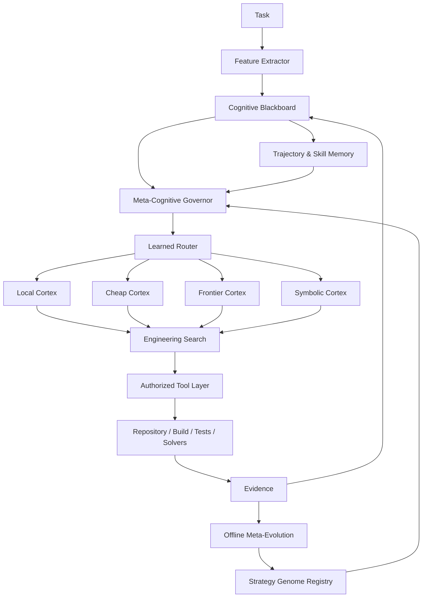

# AETHER CHIMERA — Full Code Manifest — Wave 1

## Delivery contract

- Branch: `feat/beta-release_electroweak-v091`
- Exact reconciled subject: `f242ced297216109736975376802f1e3dc4e29ce`
- Scope: backend only; frontend excluded.
- Focus: Executive architecture, research basis, three loops, cognitive blackboard, beliefs, governor, router, and routing safety.
- Primary placement: `domain/ledger` projections, `ports/`, `agency/chimera`, and `runtime/chimera`.
- Status: implementation-ready manifest of complete changed classes, functions, schemas, policies, and tests.

## Code-first reconciliation

CHIMERA is lowered onto the existing Vanguard mechanisms rather than becoming a second framework. Existing authority remains in the kernel dispatch pipeline, capabilities, typed budgets, immutable events, artifact store, EpisodeEngine, guarded MetaController seam, context compiler, child runtime, model adapters, evaluator gateway, and SQLite-WAL store. Cognitive routing, blackboard projections, retrieval markets, symbolic solvers, search, local inference, learned ranking, and evolution are exterior ports/runtime/adapters or offline laboratory code. The kernel remains domain-blind and unchanged.

## Mandatory architectural interpretation

| PRD concept | Existing Vanguard owner | CHIMERA implementation boundary |
|---|---|---|
| Cognitive blackboard | ledger + artifacts + projections | derived projection; never mutable authority |
| Governor | `MetaController` + guarded consultation | deterministic exterior policy first |
| Mixture of Cognition | model/tool ports and routing | contextual router returning ordinary proposals |
| Local/graph/symbolic cortex | adapters | capability-declared optional plugins |
| Engineering search | child runtime + artifacts | bounded branches with attenuated budgets |
| Verification cortex | evaluator gateway + receipts | staged verification policy |
| Strategy genome | manifest/config artifacts | immutable, versioned, digest-bound values |
| Evolution lab | benchmark/evidence tooling | offline only; no task-time weight mutation |
| Learned skills | experience/artifact seams | evidence-gated admission and rollback |
| Atlas/LDA | `IndexPort` and optional adapters | optional provider; never authority |

## Non-negotiable implementation rules

1. No CHIMERA imports or domain vocabulary in `kernel/`.
2. No controller, model, bandit, GNN, solver, or capsule grants itself authority.
3. Every branch consumes a conserved child budget and returns artifacts/summaries.
4. Environment evidence outranks verbal confidence.
5. Learned routing begins in shadow mode and has a deterministic fallback.
6. Online adaptation changes routing/state only; weights and promoted skills change offline.
7. Heavy dependencies remain optional extras behind ports.
8. Every mechanism must beat a simpler baseline before promotion.

## Implementation specification and complete changed units

# AETHER — ELECTROWEAK / Vanguard
# CHIMERA: Neuro-Symbolic Adaptive Meta-Harness
## Principal Engineering PRD, Research Architecture & Development Guide

**Document class:** Product Requirements Document + Architecture Decision Record + Implementation Blueprint  
**Status:** Experimental third-generation coding architecture  
**Target substrate:** AETHER — ELECTROWEAK / Vanguard  
**Harness:** `vg-code-chimera`  
**Primary domain:** Long-horizon software engineering, repository repair, scientific coding, algorithmic reasoning, coding challenges, SWE-style benchmarks  
**Secondary domain:** Mathematical reasoning, symbolic/numerical problem solving, program synthesis, repository research  
**Engineering level:** Staff / Principal / Senior Principal Software Architecture  
**Date:** 2026-08-30

---

# 0. Executive Decision

CHIMERA is the third and deliberately most eclectic AETHER coding architecture.

It is **not**:

1. the first design's large engineered pipeline;
2. the second design's minimal reflexive runtime;
3. a conventional swarm;
4. a single-model coding agent;
5. a benchmark-specific script.

CHIMERA combines structured engineering control with runtime flexibility, but adds a new dimension:

> **A heterogeneous cognitive machine where different kinds of computation are assigned to the cheapest mechanism competent to perform them.**

Instead of asking a frontier LLM to perform every operation, CHIMERA uses a portfolio:

```text
Frontier LLMs
Cheap/fast LLMs
Small local LLMs
Embedding models
Neural rerankers
Graph neural networks
Classifiers
Contextual bandits
Search algorithms
Symbolic solvers
Static analysis
Test runners
Fuzzers
Property-based testing
Repository graphs
Deterministic scripts
Learned skills
Trajectory memory
```

The central architecture is a **Mixture of Cognition (MoC)**:

```text
                    TASK
                      │
                      ▼
            Cognitive Blackboard
                      │
                      ▼
            Meta-Cognitive Governor
                      │
         ┌────────────┼─────────────┐
         ▼            ▼             ▼
   Fast Local     Frontier      Symbolic /
    Cortex          Cortex       Algorithmic
         │            │             │
         └────────────┼─────────────┘
                      ▼
              Engineering Search
                      │
           hypotheses / patches /
             tests / strategies
                      │
                      ▼
               Real Environment
                      │
                      ▼
            Evidence + Trajectory
                      │
           ┌──────────┴──────────┐
           ▼                     ▼
       Online Adaptation     Offline Evolution
       routing/memory        prompts/skills/
                            workflows/models
```

Three loops operate at different timescales:

```text
L0 — Engineering Loop
Observe → Act → Verify → Repair

L1 — Deliberation/Search Loop
Generate hypotheses → Explore → Compare → Distill → Refine

L2 — Evolution Loop
Mine trajectories → Diagnose patterns → Mutate harness → Evaluate → Promote
```

The defining principle is:

> **Do not spend frontier intelligence on computation that can be performed faster, cheaper, and more reliably by an algorithm, local model, solver, or learned specialist.**

---

# 1. Why CHIMERA Exists

Current coding agents often behave as if a single generative model should:

```text
understand task
retrieve code
rank files
interpret graph structure
plan
write code
run tools
parse logs
select tests
evaluate patches
decide whether it is stuck
decide which model should run next
remember previous failures
optimize its own prompts
```

This is computationally wasteful.

Many of those operations are:

- ranking problems;
- classification problems;
- graph problems;
- optimization problems;
- search problems;
- deterministic transformations;
- constraint-solving problems.

A frontier LLM should be reserved for decisions where broad semantic reasoning is genuinely valuable.

CHIMERA therefore treats the coding harness as an **adaptive computational system**, not merely an LLM loop.

---

# 2. Research Basis

The architecture is grounded in several converging research directions.

## 2.1 Test-time scaling for coding

Recent work on agentic coding shows that increasing inference-time computation can materially improve software engineering performance, but naive repeated rollouts waste compute. "Scaling Test-Time Compute for Agentic Coding" uses compact trajectory representations with Recursive Tournament Voting and Parallel-Distill-Refine to reuse prior attempts. It reports substantial gains on SWE-Bench Verified and Terminal-Bench. [R1]

SWE-Replay similarly reuses prior trajectories and branches from important intermediate states, reducing cost while retaining or improving performance. [R2]

**CHIMERA implication:**

```text
trajectory representation
+
selection
+
reuse
```

matter more than simply launching many agents.

---

## 2.2 Repository retrieval is a first-class failure surface

Agent Retrieval Bench finds that no single retrieval method dominates across coding workflows and that logged coding trajectories can entirely miss required files. [R3]

ContextBench similarly studies context retrieval as its own process rather than treating final patch success as the only metric. [R4]

Repository-level neural retrieval work shows large improvements from multi-stage retrieval and neural reranking. [R5]

SweRank+ combines code embeddings, learned reranking, and iterative agent search for issue localization. [R6]

**CHIMERA implication:**

Repository context should be obtained through an **ensemble retrieval market**, not a single semantic-search system.

---

## 2.3 Graph learning for bug localization and test selection

GREPO studies GNNs specifically for repository-level bug localization and reports advantages over traditional retrieval baselines. [R7]

Graph-based regression-test prioritization research combines code dependency graphs, execution traces, and learned ranking to improve test ordering. [R8]

**CHIMERA implication:**

A local graph model can act as a cheap structural specialist for:

```text
fault localization
impact prediction
test prioritization
dependency relevance
```

without invoking a frontier LLM.

---

## 2.4 Small models can become tool-using specialists

Agent Distillation demonstrates that small models, including sub-7B and even sub-3B scales, can inherit tool-using behavior through trajectory distillation. [R9]

Devstral showed that an agent-specialized open model small enough for a workstation can perform strongly in software engineering when paired with a suitable harness. [R10]

**CHIMERA implication:**

Do not ask a local small model to replace the frontier solver.

Train/distill it for narrow high-frequency roles.

---

## 2.5 Learned routing

Agent-as-a-Router frames coding-model selection as an adaptive Context → Action → Feedback loop and shows that accumulated execution experience materially improves routing. [R11]

**CHIMERA implication:**

Model selection should become an online learning problem rather than a static mapping.

---

## 2.6 Metacognition and capability boundaries

Recent metacognition work emphasizes confidence, belief updating, procedural reflection, and competence boundaries. [R12][R13]

MARS distinguishes principle-level reflection from procedural reflection for efficient self-improvement. [R14]

**CHIMERA implication:**

The system should maintain explicit:

```text
beliefs
confidence
unknowns
capability estimates
failure attribution
```

and use historical calibration rather than raw LLM confidence.

---

## 2.7 Verification scaling

DeepVerifier demonstrates inference-time verification using explicit failure rubrics and reports gains over simpler LLM-as-judge baselines. [R15]

Program repair literature also consistently shows that compiler/test feedback improves iterative repair. [R16]

**CHIMERA implication:**

Verification is itself a computational budget that can scale independently of generation.

---

## 2.8 Automated workflow/prompt evolution

AFlow formulates workflow generation as search over executable agent graphs using MCTS. [R17]

MIPRO optimizes multi-stage language-model programs using data-aware instruction generation and Bayesian optimization. [R18]

TextGrad treats textual feedback as an optimization signal over compound AI systems. [R19]

EvoAgentX integrates several workflow-optimization families. [R20]

ARTEMIS reports evolutionary joint optimization of prompts/tool descriptions/configurations, including improvements on a Mini-SWE-based setup. [R21]

AlphaEvolve demonstrates the broader power of evaluator-driven evolutionary search over code. [R22]

**CHIMERA implication:**

The harness itself can be treated as an optimizable program — but optimization must occur in a controlled experimental layer, not by arbitrary self-modification during production runs.

---

# 3. Reality Constraint

SWE-Bench Pro is much harder than traditional SWE-bench. Its paper reports frontier models below 25% Pass@1 under its unified scaffold at publication time. [R23]

More recent scientific SWE evaluation still reports substantial headroom even for leading coding systems. [R24]

Therefore:

> CHIMERA must be designed as an experimental capability program, not as a guarantee of 90% benchmark success.

The architecture should maximize the probability of discovering stronger strategies.

---

# 4. Core Thesis

CHIMERA uses five interacting computational layers:

```text
1. Symbolic / deterministic computation
2. Learned local specialists
3. Cheap generative workers
4. Frontier deliberative models
5. Meta-optimization algorithms
```

These form a hierarchy of cost:

```text
deterministic
    <
small local inference
    <
cheap hosted model
    <
frontier model
    <
multi-rollout frontier search
```

Every decision should be executed at the **lowest layer likely to solve it correctly**.

---

# 5. Design Principles

## P1 — Intelligence is heterogeneous

Do not encode intelligence as "LLM call".

## P2 — Environment evidence dominates verbal confidence

```text
tests > verifier > model confidence
```

## P3 — Routing is learned

The system should learn which computational component works best for which class of decision.

## P4 — Context has economic value

Every context item consumes tokens and attention.

## P5 — Search is budgeted

More hypotheses/patches are useful only when uncertainty justifies them.

## P6 — Self-improvement is gated

No production agent may silently rewrite its permanent harness.

## P7 — Local inference should be cheap enough to invoke often

Use small models for tasks that happen dozens of times per run.

## P8 — Frontier inference should be high-information

A frontier model call should ideally decide something that deterministic/local mechanisms cannot.

## P9 — Everything learned retains provenance

No memory, skill, prompt, router weight, or workflow revision exists without source runs and evaluation evidence.

## P10 — AETHER remains authoritative

Even if CHIMERA changes Vanguard extensively, capability authorization, lineage, resource conservation, artifacts, and settlement remain constitutional.

---

# 6. Architecture Overview



---

# 7. Three Loops

## 7.1 L0 — Engineering Loop

Fast operational loop:

```text
observe
→ select action
→ execute
→ receive environment evidence
→ update blackboard
```

Examples:

```text
search file
read symbol
edit patch
run targeted test
query solver
```

---

## 7.2 L1 — Deliberation/Search Loop

Activated when uncertainty is high.

```text
current state
→ generate competing hypotheses
→ allocate rollouts
→ execute probes
→ summarize trajectories
→ rank candidates
→ refine best candidates
```

Possible algorithms:

```text
best-first search
beam search
Parallel-Distill-Refine
Recursive Tournament Voting
trajectory replay
limited MCTS
```

Do not use all simultaneously.

---

## 7.3 L2 — Evolution Loop

Runs outside a live task:

```text
trajectories
→ failure clustering
→ candidate improvements
→ prompt/skill/workflow mutations
→ LAM/internal evaluation
→ holdout validation
→ promotion
```

Algorithms may include:

```text
Bayesian optimization
evolution strategies
quality-diversity search
MIPRO-like prompt optimization
TextGrad-like textual feedback
AFlow-style graph search
contextual-bandit policy updates
small-model distillation
```

---

# 8. Cognitive Blackboard

The central shared structure is not a transcript.

It is a typed state projection.

```python
@dataclass(frozen=True)
class CognitiveBlackboard:
    task: TaskContract

    facts: tuple["Fact", ...]
    hypotheses: tuple["Hypothesis", ...]
    open_questions: tuple["Question", ...]

    candidate_files: tuple["RankedFile", ...]
    candidate_symbols: tuple["RankedSymbol", ...]
    candidate_tests: tuple["RankedTest", ...]

    patches: tuple["PatchCandidate", ...]
    verification: tuple["VerificationRecord", ...]

    active_strategy: "StrategyGenomeRef"
    cognitive_budget: "CognitiveBudget"

    confidence: "CalibratedConfidence"
    uncertainty: "UncertaintyProfile"

    memory_refs: tuple[str, ...]
    artifact_refs: tuple[str, ...]
```

It should be reconstructed from ledger events and artifacts.

It is not a second source of truth.

---

# 9. Blackboard Fact Model

```python
@dataclass(frozen=True)
class Fact:
    fact_id: str
    kind: str
    statement: str

    source: Literal[
        "direct_read",
        "test",
        "compiler",
        "git",
        "lda",
        "local_model",
        "frontier_model",
        "solver",
    ]

    evidence_refs: tuple[str, ...]
    repo_digest: str | None
    confidence: float
    freshness: float
```

Facts from deterministic sources may receive higher default trust than generated summaries.

---

# 10. Hypothesis Model

```python
@dataclass(frozen=True)
class Hypothesis:
    hypothesis_id: str
    statement: str

    status: Literal[
        "candidate",
        "active",
        "supported",
        "rejected",
        "resolved",
    ]

    prior: float
    posterior: float

    supporting_evidence: tuple[str, ...]
    contradicting_evidence: tuple[str, ...]
    expected_information_gain: float
```

This enables explicit belief updating.

---

# 11. Bayesian-Style Belief Updating

CHIMERA does not need full Bayesian inference.

Use approximate updates:

```python
posterior_logit = (
    prior_logit
    + evidence_support
    - evidence_contradiction
)
```

or normalized heuristic scoring.

The important change is architectural:

```text
hypothesis
+
evidence
+
confidence
```

becomes explicit state.

---

# 12. Meta-Cognitive Governor

The Governor decides **how to think**, not what the final code must be.

Responsibilities:

```text
select cognitive mode
allocate compute
trigger search
route model
request additional context
trigger solver/plugin
decide whether a small model is sufficient
trigger frontier escalation
stop unproductive branch
request verification
```

Suggested interface:

```python
class MetaCognitiveGovernor(Protocol):
    def decide(
        self,
        state: CognitiveBlackboard,
        capabilities: "CognitiveCapabilities",
    ) -> "CognitiveDirective":
        ...
```

---

# 13. Cognitive Directives

```python
class CognitiveDirectiveKind(str, Enum):
    ACT = "act"
    RETRIEVE = "retrieve"
    SOLVE = "solve"
    GENERATE = "generate"
    VERIFY = "verify"
    FORK = "fork"
    REPLAY = "replay"
    REFINE = "refine"
    COMPACT = "compact"
    ESCALATE = "escalate"
    STOP = "stop"
```

Directive:

```python
@dataclass(frozen=True)
class CognitiveDirective:
    kind: CognitiveDirectiveKind
    objective: str
    route: str
    budget: "BudgetSlice"
    rationale_code: str
```

---

# 14. Mixture-of-Cognition Router

The router chooses among computational specialists.

```python
class CognitiveRouter(Protocol):
    def select(
        self,
        decision: "DecisionRequest",
        state: CognitiveBlackboard,
        portfolio: "CognitivePortfolio",
    ) -> "RouteDecision":
        ...
```

Possible routes:

```text
RULE
SCRIPT
EMBEDDING
RERANKER
GNN
LOCAL_SLM
CHEAP_LLM
FRONTIER_LLM
SYMBOLIC_SOLVER
SEARCH
```

---

# 15. Contextual Bandit Router

Use a contextual bandit for online route selection once enough data exists.

Context features:

```text
task type
repo size
language
error type
current phase
context pressure
number of failures
uncertainty
candidate count
model history
```

Arms:

```text
local reranker
local coder
cheap LLM
frontier LLM
solver
branch search
```

Reward:

```math
R =
  success_signal
  - λ_c * normalized_cost
  - λ_l * latency
  - λ_t * turns
  - λ_r * regression_risk
```

Initial implementation can use:

```text
epsilon-greedy
UCB1
Thompson sampling
```

Prefer Thompson sampling for simple probabilistic exploration/exploitation.

---


## Wave acceptance

Accept only after focused unit, contract, integration, and falsifier tests for this wave pass; boundary/domain-blindness/TCB linters remain green; optional dependencies fail closed; and no benchmark claim is made from unexecuted evaluation. Full-suite execution is deferred until final integration as requested.
