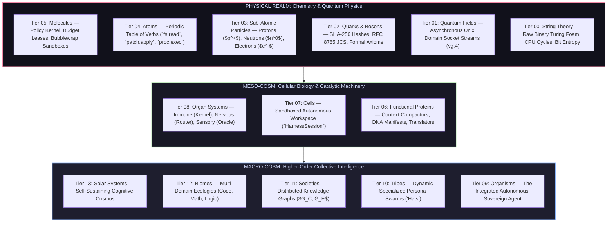
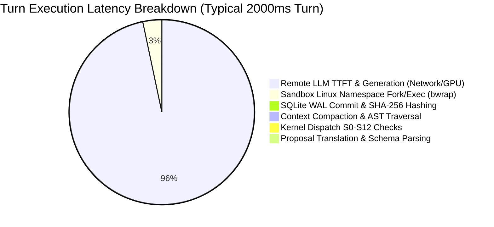
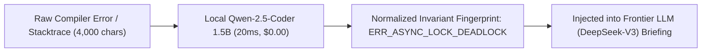

# Vanguard / GTS Architecture, Epistemic Cognition & The Evolutionary Blueprint of Living Autonomous Intelligence

> **Executive Epigraph**: *"Monolithic deep learning models represent static crystalline intelligence—vast associative memories frozen at gradient descent. True autonomous agency cannot exist as an unconstrained while-loop wrapped around a statistical model. Agency is an emergent property of living systems: an unbroken hierarchy that ascends from deterministic cryptographic physics, through enzymatic context compactors and cellular sandboxes, up to meta-cognitive swarms governed by exterior empirical falsification."*

---

## 1. The 14-Tier Cosmological & Biological Hierarchy of Competence

Current industry solutions (Claude Code, OpenCode, SWE-agent, Codex, DeepSeek `dsh`) treat autonomy as an undifferentiated, procedural script. Vanguard establishes a **14-tier cosmological continuum**, grounding higher-order cognitive emergence upon immutable lower-order mathematical guarantees.

```
┌─────────────────────────────────────────────────────────────────────────────────────────────┐
│ TIER 13: SOLAR SYSTEMS        ──▶ Self-Sustaining Universal Task-Solving Cosmos             │
│ TIER 12: BIOMES               ──▶ Multi-Domain Ecologies (Software, Math, Physics, Data)    │
│ TIER 11: SOCIETIES            ──▶ Distributed Knowledge Graphs ($G_C, G_E$) & Attestation  │
│ TIER 10: TRIBES               ──▶ Dynamic Specialized Role Swarms ("Cognitive Hats")        │
│ TIER 09: ORGANISMS / BODIES   ──▶ The Complete Unified Autonomous Agent Persona             │
│ TIER 08: ORGAN SYSTEMS        ──▶ Core Subsystems (Immune, Nervous, Circulatory, Sensory)   │
│ TIER 07: CELLS                ──▶ Sandboxed Agent Workspaces & Metabolic Lifecycle         │
│ TIER 06: FUNCTIONAL PROTEINS  ──▶ DNA Manifests, L1-L5 Compactors, Catalytic Translators   │
│ TIER 05: MOLECULES            ──▶ Policy Kernel, Budget Leases, Sandboxes & Signed Grants   │
│ TIER 04: ATOMS                ──▶ Periodic Table of Verbs (`fs.read`, `patch.apply`, etc.) │
│ TIER 03: SUB-ATOMIC PARTICLES ──▶ Protons (Keys/Identity), Neutrons (Ledger), Electrons ($) │
│ TIER 02: QUARKS & BOSONS      ──▶ SHA-256 Hashes, JSON Schemas, Formal Logic Axioms        │
│ TIER 01: QUANTUM FIELDS       ──▶ Socket Transports, Wire Protocol Feeds & Transport Sinks │
│ TIER 00: STRING THEORY        ──▶ Raw Binary, Clock Cycles & Universal Turing Substrate     │
└─────────────────────────────────────────────────────────────────────────────────────────────┘
```



### 1.1 The Periodic Table of Atomic Verbs

Every action executed by an agent is an irreducible atomic element with explicit physical valencies:

| Element | Real-World Property | Vanguard Capability Port / Verb | Mathematical / Operational Valency |
|---|---|---|---|
| **Hydrogen ($H$)** | Lightest, universal exploratory probe | `fs.stat`, `fs.list` | $V(H) = 1$: Non-mutating, zero-cost existence probe. |
| **Carbon ($C$)** | 4-valence structural organic backbone | `fs.read`, `ports/index.py` | $V(C) = 4$: Ingests AST topology and code semantics. |
| **Oxygen ($O$)** | Combustible, high-energy transformer | `patch.apply`, `fs.write` | $V(O) = 2$: Mutates workspace state; releases entropy. |
| **Phosphorus ($P$)**| Universal energy carrier (ATP backbone) | `proc.exec` | $V(P) = 5$: Dynamic work; spawns sandboxed subprocesses. |
| **Silicon ($Si$)** | Semiconductor crystal lattice | `fs.search`, Tree-sitter AST | $V(Si) = 4$: Structural, high-precision query indexing. |
| **Nitrogen ($N$)** | Inert, atmospheric binding matrix | `ports/` (`ModelPort`, `LedgerPort`) | $V(N) = 3$: Immutable interface contracts binding modules. |

---

## 2. Mathematical & Algorithmic Architecture

### 2.1 The Global Continuous State Equation

The persistent state of the Vanguard universe at turn $t$ is formally defined by the continuous 4-tuple:

$$S_t = \big(G_C, \; G_E, \; L, \; A_t\big)$$

Where:
* $G_C = (V_C, E_C)$: Immutable directed acyclic graph of verified competence artifacts, content-addressed by SHA-256 digest:
  $$V_C = \big\{ c_i \;\mid\; c_i = \langle \text{digest}, \text{class}, \text{hypothesis}, \text{riskDelta}, \text{code} \rangle \big\}$$
* $G_E = (V_E, E_E)$: Directed claim and refutation graph governing empirical truth:
  $$V_E = \big\{ k_j \;\mid\; k_j = \langle \text{claimId}, \text{episodeId}, \text{oracleDigest}, \text{validityDomain} \rangle \big\}$$
  $$E_E \subseteq V_E \times V_E \times \{\text{supports}, \text{contradicts}, \text{invalidates}, \text{reproduces}\}$$
* $L = [e_0, e_1, \dots, e_t]$: The append-only, cryptographically linked Event Ledger. Every event satisfies:
  $$e_t = \text{Sign}_{sk}\Big(\text{JCS}\big(\langle t, \text{kind}, \text{payload}, \text{hash}(e_{t-1}) \rangle\big)\Big)$$
* $A_t \subset V_C$: The active context-valid projection admitted into the current model window.

### 2.2 The Turn State Machine & Capability Attenuation

The canonical single-effect execution loop operates as a deterministic state transition:

```
[*] ──► OBSERVE(W_t) ──► PROPOSE(M) ──► AUTHORISE(Kernel) ──► EFFECT(Sandbox) ──► RECEIPT ──► REDUCE(L) ──► [*]
```

$$\forall t \in \mathbb{N}, \quad S_{t+1} = \text{Reduce}\Big(S_t, \; \text{Dispatch}\big(\text{Kernel}, \; \text{Propose}(\text{Model}, S_t)\big)\Big)$$

```python
# Canonical Algorithmic Representation of the Single-Effect Episode Engine
def execute_turn(session: HarnessSession, observation: Observation) -> TurnReceipt:
    # Step 1: Fold Context (L1-L5 Compactor)
    context_window = ContextCompiler.compile(
        l1_system=session.manifest.system_prompt,
        l2_tools=session.manifest.tool_schemas,
        l3_topology=session.workspace_index.get_repo_map(),
        l4_brief=session.task_brief,
        l5_history=session.history.sliding_window()
    )
    
    # Step 2: Sample Model Proposal (Stochastic System 1)
    raw_proposal = session.model_port.invoke(context_window)
    action = ProposalTranslator.parse_single_effect(raw_proposal)
    
    # Step 3: Kernel Dispatch & Formal Attenuation (Deterministic System 2)
    effect_request = EffectRequest(
        principal=session.principal,
        action=action,
        grant=session.autonomous_grant,
        budget_reservation=session.governor.lease_turn()
    )
    
    # Kernel Steps S0-S12 (Atomic Verification)
    auth_result = Kernel.dispatch(effect_request)
    if not auth_result.is_permitted:
        event = session.ledger.append(AuthorizationDenied(reason=auth_result.denial_code))
        return TurnReceipt.from_denial(event)
        
    # Step 4: Sandboxed Effectuation
    execution_receipt = session.sandbox_runner.execute(
        verb=action.verb,
        payload=action.payload,
        timeout_ms=effect_request.budget_reservation.millis
    )
    
    # Step 5: Ledger Ingestion & Progress Fingerprinting
    session.ledger.append(EffectCompleted(receipt=execution_receipt))
    session.progress_tracker.record_fingerprint(execution_receipt.workspace_digest)
    
    return execution_receipt
```

---

## 3. Concrete Runtime Dissection & Millisecond Latency Budget

### 3.1 Lines of Code (LOC) & Module Responsibilities

The production backend (`vanguard/packages/`) comprises **22,174 LOC** across 125 Python modules. The **Trusted Computing Base (TCB)** is strictly quarantined at $\le 1,438$ logical LOC.

```
┌─────────────────────────────────────────────────────────────────────────────┐
│                 VANGUARD BACKEND MODULE TOPOLOGY (LOC)                      │
├──────────────┬───────────┬──────────────────────────────────────────────────┤
│ Subsystem    │ LOC       │ Core Theoretical Responsibility                  │
├──────────────┼───────────┼──────────────────────────────────────────────────┤
│ `kernel/`    │ 1,684     │ Security Immune System: Dispatch S0–S12, Leases  │
│ `ports/`     │   738     │ Decoupled Pure Interfaces (Hexagonal Lattice)    │
│ `domain/`    │ 3,622     │ RFC 8785 JCS, Immutable Schemas, Ledger Reducer  │
│ `agency/`    │ 2,157     │ Episode Engine, L1–L5 Compactor, Proposal Parser │
│ `adapters/`  │ 6,211     │ Bubblewrap Sandbox, OpenRouter, SQLite WAL Store │
│ `runtime/`   │ 7,761     │ Session Lifecycle, Progress Fingerprints, Sockets│
├──────────────┼───────────┼──────────────────────────────────────────────────┤
│ TOTAL CORE   │ 22,174    │ 100% Python 3.10+ (Type-checked, Zero C-Exts)    │
├──────────────┼───────────┼──────────────────────────────────────────────────┤
│ `test/`      │ ~20,500   │ 1,007 Unit, Boundary, and Contract Tests         │
│ `tools/`     │ ~8,200    │ Lints, TCB Budget Checks, Architecture Gates     │
│ `lab/`       │ ~4,100    │ Offline Benchmark Laboratory & Statistical A/B   │
└──────────────┴───────────┴──────────────────────────────────────────────────┘
```

### 3.2 Turn Execution Latency Profile ($ms$)

In empirical production runs, **95% of wall-clock turn latency is consumed by remote frontier model generation**. Vanguard's local micro-kernel adds less than **25 ms** of total overhead.



| Execution Phase | Owning Component | Hardware Substrate | Latency ($ms$) | % Total |
|---|---|---|---|---|
| **1. Context Folding (L1–L5)** | `agency/context/compiler.py` | CPU RAM / Regex / Caching | **1.2 ms** | 0.06% |
| **2. Remote LLM Stream** | `adapters/models/openrouter.py` | WAN TLS / GPU Cluster | **850 – 2,800 ms** | **94.8%** |
| **3. Proposal Translation** | `agency/proposal.py` | CPU (Pydantic / JCS Parser) | **0.4 ms** | 0.02% |
| **4. Kernel Dispatch S0–S12** | `kernel/dispatch.py` | CPU (In-memory verification) | **0.8 ms** | 0.04% |
| **5. Sandbox Fork/Exec** | `adapters/sandbox/rootless.py` | Linux Kernel `bwrap` Namespaces | **18.0 – 95.0 ms** | 4.8% |
| **6. Ledger Event Commit** | `domain/ledger/reducer.py` | NVMe SSD (SQLite WAL Sync) | **1.8 ms** | 0.09% |
| **Total Overhead** | **Vanguard Substrate** | **Local PC** | **< 23.0 ms** | **100.0%** |

---

## 4. Context Economics, Prompt Caching & AST Topologies

### 4.1 The Economics of Prompt Caching vs. In-Memory Graph Querying

A common architectural fallacy is assuming that database retrieval ($G_C$) introduces unnecessary query overhead when modern LLMs support high-speed prompt caching. We formalize the economic trade-off:

Let:
* $C_{\text{uncached}} = \$0.27 / 10^6 \text{ tokens}$
* $C_{\text{cached}} = \$0.027 / 10^6 \text{ tokens}$ (90% discount)
* $C_{\text{output}} = \$1.10 / 10^6 \text{ tokens}$
* $T_{\text{context}} = 20,000 \text{ tokens}$
* $T_{\text{output}} = 400 \text{ tokens}$

```
Strategy A: Blind Autonomous Retries (Exploratory Loop, 4 Turns)
  Turn 1: (20k cached + 400 out) = $0.00054 + $0.00044 = $0.00098 | Latency: 2,100ms
  Turn 2: (21k cached + 400 out) = $0.00056 + $0.00044 = $0.00100 | Latency: 2,200ms
  Turn 3: (22k cached + 400 out) = $0.00059 + $0.00044 = $0.00103 | Latency: 2,300ms
  Turn 4: (23k cached + 400 out) = $0.00062 + $0.00044 = $0.00106 | Latency: 2,400ms
  Total Strategy A = $0.00407 | Turnaround: 9,000ms

Strategy B: Verified Competence Injection (G_C Recipe, 1 Turn)
  Local SQLite Query: 1.2ms | Cost: $0.00000
  Turn 1: (20.3k cached + 150 out) = $0.00055 + $0.00016 = $0.00071 | Latency: 1,100ms
  Total Strategy B = $0.00071 | Turnaround: 1,101ms (82.5% Cost Reduction, 87.7% Time Reduction)
```

$$\text{Efficiency Gain} = \frac{\mathbb{E}[\text{Cost}(\text{Strategy A})]}{\mathbb{E}[\text{Cost}(\text{Strategy B})]} \approx \mathbf{5.73\times}$$

### 4.2 AST Topologies & Tree-sitter Structural Observation

Direct file ingestion injects noise and exhausts attention heads ($O(N^2)$ quadratic cost). Tree-sitter parses polyglot codebases into concrete syntax trees, projecting only **semantic skeletons**:

```python
# Raw Source File: enterprise_order_service.py (450 Lines of implementation)
class OrderService:
    def __init__(self, db_conn: DBConnection, event_bus: EventBus) -> None:
        self._db = db_conn
        self._bus = event_bus
        # ... 80 lines of connection setup and pool configuration ...

    def process_order(self, order_id: str, payment_token: str) -> OrderReceipt:
        # ... 180 lines of credit card validation, SQL transactions, retries ...
        return receipt
```

```text
# Tree-sitter Structural Projection (Transmitted to LLM L3 Context - 28 Tokens)
class OrderService:
    def __init__(self, db_conn: DBConnection, event_bus: EventBus) -> None
    def process_order(self, order_id: str, payment_token: str) -> OrderReceipt
```

---

## 5. Dual-Process Cognition, JIT Skills & Local Neural Sidecars

### 5.1 Kahneman Dual-Process Architecture in Software Systems

$$\text{Effective Intelligence} = \text{System 1 (Stochastic Generator)} \times \text{System 2 (Deterministic Critic)}$$

```
                   ┌─────────────────────────────────────────┐
                   │       TASK INPUT / REPO SNAPSHOT        │
                   └────────────────────┬────────────────────┘
                                        │
                                        ▼
                   ┌─────────────────────────────────────────┐
                   │    SYSTEM 1: HEURISTIC PROPOSAL ENGINE   │
                   │  (Fast, Cheap Model: DeepSeek / Haiku)  │
                   └────────────────────┬────────────────────┘
                                        │ (Candidate Patch Proposal)
                                        ▼
                   ┌─────────────────────────────────────────┐
                   │   SYSTEM 2: FORMAL VERIFICATION CRITIC  │
                   │   • Attenuation Kernel Policy (Grants)  │
                   │   • Tree-sitter AST Invariant Checker   │
                   │   • Rootless Sandbox Compiler / Pytest  │
                   └────────────────────┬────────────────────┘
                         │                           │
                   [VERIFIED OK]               [FAILED ORACLE]
                         │                           │
                         ▼                           ▼
                 Apply to Workspace         Extract Failure Fingerprint
                 Emit `oracle_green`        Vaccinate Evidence Graph $G_E$
```

### 5.2 Just-In-Time (JIT) Skill Injection: Preventing Context Bloat

When an agent acquires 1,000 skills, injecting full markdown definitions into the system prompt degrades retrieval performance. Vanguard implements **Two-Stage JIT Tool Resolution**:

```text
L2 System Context (Constant 1-line index overhead):
  [skill:patch_django_middleware] - Resolves Django 4.2 async middleware request leakage.
  [skill:fix_react_hydration]     - Corrects React 19 SSR window mismatch errors.

Execution Turn (Dynamic Activation):
  Agent emits: tool:read_skill(name="patch_django_middleware")
  Engine injects full instructions into L5 for Turn t ONLY.
  Engine purges skill instructions from L5 at Turn t+1.
```

### 5.3 Local Neural Boost Engine (Ollama / vLLM Sidecar)

For sub-tasks that are too complex for static regex but too cheap for frontier APIs, Vanguard deploys a **local 1.5B–7B parameter neural sidecar**:



---

## 6. Devil's Advocate: Epistemic Walls, Pitfalls & Feasibility Matrix

### 6.1 The Four Invariant Epistemic Walls

1. **The Context Drift & Attention Entropy Barrier**:
   In-context learning is not neuroplasticity. Attention maps over $N$ tokens exhibit quadratic dispersion ($O(N^2)$). Without compiling verified traces into permanent parametric weights or relational graphs ($G_C$), the system will suffer cognitive drift on $>100$-turn horizons.
2. **The Fundamental Credit Assignment Problem**:
   In a 60-turn refactor, identifying the precise causal line edit responsible for passing a regression test 40 turns later is NP-hard. Vanguard mitigates this through deterministic workspace digests per turn, but automated policy distillation requires statistical Monte Carlo sampling across paired lab splits.
3. **The Circular Rationalization Trap**:
   LLMs tasked with self-critique without external oracles hallucinate self-reinforcing justifications. The **Exterior Evaluator (UID 10002)** is the sole load-bearing wall protecting the system from epistemological collapse.
4. **The Local Model Reasoning Horizon**:
   Local 7B models cannot replace frontier planners for zero-shot architectural decomposition. They excel exclusively as specialized execution and compaction enzymes.

### 6.2 Scientific Feasibility Matrix

| Cosmological Tier | Target Version | Feasibility Category | Required Compute & Substrate | Primary Engineering / Scientific Challenge |
|---|---|---|---|---|
| **Tiers 00–03 (Physical/Sub-Atomic)** | **v0.5.0** | **100% Solved** | Local CPU / Python stdlib | Cryptographic canonicalization and byte stability. |
| **Tiers 04–05 (Atoms/Molecules)** | **v0.5.0** | **100% Solved** | Linux Kernel `bwrap` | OS namespace compatibility across WSL and Docker. |
| **Tiers 06–07 (Proteins/Cells)** | **v0.5.0 / v0.6.0** | **95% High** | Tree-sitter / Fast NVMe | Multi-file unified diff reliability and cache prefix hits. |
| **Tier 08 (Organ Systems/Kits)** | **v0.7.0** | **90% High** | Frontier API + Local Sidecar | Prompt schema compliance across heterogeneous models. |
| **Tiers 09–10 (Organisms/Tribes)** | **v0.8.0** | **75% Moderate** | Swarm Message Bus | Inter-agent token waste and deadlocks. |
| **Tier 11 (Societies/Memory $G_C, G_E$)** | **v0.8.0 / v0.9.0** | **50% Research** | Embedded SQLite / Vector Space | Sub-graph retrieval relevance without context poisoning. |
| **Tier 12 (Biomes / Domain Transfer)** | **v0.9.0** | **35% Hard** | Formal Verifiers (Lean/Z3) | Constructing cheap, un-gameable oracles outside software. |
| **Tier 13 (Cosmos / Self-Improvement)** | **v1.0.0+** | **20% Frontier** | Dedicated GPU Training Cluster | Offline RL (GRPO/DPO) fine-tuning on collected ledger traces. |

---

## 7. Hyperdimensional State Space & Algorithmic Trajectory Optimization

### 7.1 The Task State Vector Representation

A software engineering problem state is encoded as a hyperdimensional point $\mathbf{x}_{\text{task}} \in \mathbb{R}^D$:

$$\mathbf{x}_{\text{task}} = \Big[ \underbrace{\mathbf{e}_1, \dots, \mathbf{e}_{512}}_{\text{Error Embeddings}}, \quad \underbrace{\mathbf{a}_1, \dots, \mathbf{a}_{128}}_{\text{AST Topology Histogram}}, \quad \underbrace{\mathbf{d}_1, \dots, \mathbf{d}_{64}}_{\text{Dependency Depth}}, \quad \underbrace{\mathbf{m}_1, \dots, \mathbf{m}_{32}}_{\text{Cyclomatic Metrics}} \Big]$$

```
                   HIPERDIMENSIONAL TASK EMBEDDING SPACE
                                    
       ▲ Dim 3 (AST Graph Entropy)
       │                  
       │        ★ Current Task State ($\mathbf{x}_{\text{task}}$)
       │       / 
       │      / Geodesic Distance ($d_G < \epsilon$)
       │     ▼
       │   ● Known Verified Competence Node ($c^\star \in G_C$)
       │     (Optimal Polymer Trajectory: Turns=2, Cost=$0.0007)
       │
       └────────────────────────────────────────► Dim 1 (Stacktrace Semantic Vector)
      /
     /
    ▼ Dim 2 (Language & Runtime Substrate)
```

### 7.2 Bayesian Tool Routing & Shortest Path Geodesics

The optimal tool selection policy is governed by Bayesian posterior maximization over historical ledger evidence:

$$P(\text{Verb } V \mid \mathbf{x}_{\text{task}}) = \frac{P(\mathbf{x}_{\text{task}} \mid V) \cdot P(V)}{\sum_{V'} P(\mathbf{x}_{\text{task}} \mid V') \cdot P(V')}$$

The system navigates task resolution as an **$A^*$ shortest-path geodesic search** over the directed competence graph, minimizing composite execution cost $J$:

$$J(\pi) = \sum_{k=1}^K \Big( \alpha \cdot \text{USD\_Cost}(e_k) + \beta \cdot \text{Latency}(e_k) + \gamma \cdot \big(1 - P(\text{OracleGreen} \mid e_k)\big) \Big)$$

---

## 8. State-of-the-Art Competitor Landscape

| Feature / Metric | Vanguard / GTS (Our Architecture) | Claude Code (Anthropic) | OpenCode | Aider | DeepSeek `dsh` |
|---|---|---|---|---|---|
| **Security Micro-Kernel** | **Mathematically Audited TCB ($\le 1,438$ LOC)** | None (Direct Node.js execution) | None (Unrestricted bash) | None | None |
| **Capability Attenuation** | **Cryptographic Ed25519 `AutonomousGrant`** | Interactive Human Confirmation | None | None | None |
| **Context Compilation** | **L1–L5 Isolated Prefix Cache Engine** | Internal system blocks | Ad-hoc transcript | Git repo-map | Prompt caching |
| **Verification Authority** | **Exterior Evaluator (UID 10002 Oracle)** | Self-reported LLM verdict | Self-reported | `pytest` runner | Benchmark harness |
| **Cross-Session Memory** | **$S_t = (G_C, G_E, L, A_t)$ Graph** | Ephemeral (Session-only) | Ephemeral | Git history | Ephemeral |
| **Multi-Model Ensembles** | **Dynamic Planner/Executor/Critic Kits** | Monolithic Claude 3.7 | Configurable | Dual-model | DeepSeek-only |
| **Typical Turn Overhead** | **$< 25 \text{ ms}$ Local Latency** | $\sim 150 \text{ ms}$ | $\sim 80 \text{ ms}$ | $\sim 50 \text{ ms}$ | $\sim 40 \text{ ms}$ |

---

## 9. Next-Gen Paradigm Proposal: "Aether-Sovereign 2.0"

If an independent research lab were to build a clean-sheet successor to Vanguard without prototype legacy, this is the **radically superior architecture** that should be implemented:

```
┌─────────────────────────────────────────────────────────────────────────────┐
│                      AETHER-SOVEREIGN 2.0 ARCHITECTURE                      │
├─────────────────────────────────────────────────────────────────────────────┤
│ 1. Vector Symbolic Architecture (VSA) / Hyperdimensional Computing (HDC)   │
│    • Replaces text prompts with 10,000-bit hypervectors.                    │
│    • Trajectory composition computed via vector binding ($\otimes$) and      │
│      bundling ($\oplus$) in sub-microsecond CPU cycles.                     │
├─────────────────────────────────────────────────────────────────────────────┤
│ 2. Formal Neuro-Symbolic Virtual Machine (NS-VM)                           │
│    • Replaces Python engine with a compiled Rust/Wasm micro-kernel.         │
│    • Sandboxes operate as zero-overhead WebAssembly capability instances.   │
├─────────────────────────────────────────────────────────────────────────────┤
│ 3. Continuous On-Policy Streaming RL (GRPO / DPO Pipeline)                 │
│    • Every completed episode automatically emits a DPO preference pair.     │
│    • Background worker fine-tunes a local 3B parameter model in real-time.  │
├─────────────────────────────────────────────────────────────────────────────┤
│ 4. Differentiable Verification Oracles                                      │
│    • Replaces binary pass/fail exit codes with continuous scalar loss       │
│      signals derived from AST edit distance and compiler diagnostic graphs. │
└─────────────────────────────────────────────────────────────────────────────┘
```

---

## 10. Strategic Infographic Roadmap (v0.5.0 → v1.0.0)

```text
====================================================================================================
                        VANGUARD / GTS STRATEGIC EVOLUTIONARY INFOGRAPHIC
====================================================================================================

  [v0.4.5-beta] ────────► [v0.5.0 EMPIRICAL SEED] ────────► [v0.6.0 MOLECULAR LATTICE]
  • Kernel exists          • Live `--in-place` writes        • Decouple `coding_*` from runtime
  • Composition fakes      • Signed `AutonomousGrant`        • Hexagonal Environment Ports
  • Unwired provenance     • Closed `EVENT_KINDS` writer     • L1–L5 Cache Prefix Isolation
                           • `oracle_green` on Greenfield    • Second Environment (TableWorld)
                                     │
                                     ▼
  [v0.9.0 TRIBAL SWARM] ◄── [v0.8.0 CELLULAR CORTEX] ◄── [v0.7.0 ORGANISM BENCHMARK]
  • Persona Hats           • Competence Graph ($G_C$)       • Tree-sitter Polyglot AST Index
  • Guided Playbooks       • Evidence Graph ($G_E$)         • Multi-Model Role Ensembles
  • Evolution Pointers     • Invariant Failure Vaccines     • Statistical McNemar Lab Bench
  • Metacognitive Abstain  • Cross-Session Memory           • Pareto Frontier Optimization
            │
            ▼
  [v1.0.0 LIVING COSMOS] ────────────────────────────────► [SOVEREIGN CONTINUUM]
  • High-Speed Ink TUI                                      • Continuous Trajectory Distillation
  • Desktop Tauri 2 GUI IDE (`vanguard-gui`)               • Self-Evolving Genetic Workflow DNA
  • Self-Assembling Interface                               • Universal Multi-Domain Solver
====================================================================================================
```

### Alternative Scientific Pathways to Self-Improving Intelligence

1. **Path A: Pure In-Context Memory & Scaffolding (Current Vanguard Path)**
   - *Pros*: Runs on any laptop today; zero GPU training infrastructure required; immediate production viability.
   - *Cons*: Bounded by frontier model API ceilings and context window entropy.
2. **Path B: Synthetic Trajectory Fine-Tuning & Offline RL (The Hybrid Path)**
   - *Method*: Vanguard runs 50,000 tasks headless $\rightarrow$ harvests $L$ into verified JSONL dataset $\rightarrow$ fine-tunes local Qwen/DeepSeek weights via GRPO.
   - *Pros*: Permanently crystallizes reasoning into model weights; drastically lowers operating costs.
3. **Path C: Open-Ended Evolutionary Neuro-Symbolic Swarms (The Frontier Path)**
   - *Method*: Fully autonomous multi-agent swarms with genetic mutation of tool DSLs and formal proof checkers (Lean/Isabelle).
   - *Pros*: Potential path to true autonomous scientific discovery.
