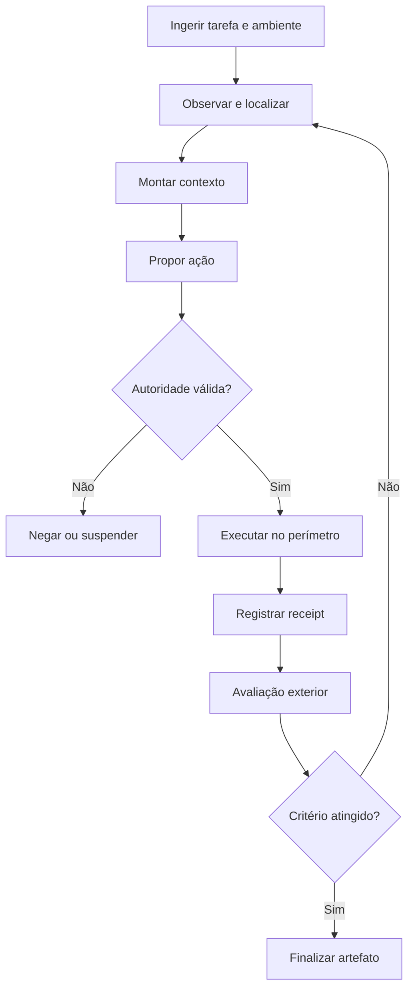

# Padrões de Harness para Agentic Coding CLIs

## Revisão arquitetural e síntese corrigida — 15 de agosto de 2026

## Parecer executivo

A tese central está correta: coding agents compartilham um loop abstrato simples, mas a qualidade operacional emerge do harness — seleção de contexto, contrato de ferramentas, autoridade, execução, edição, validação, recuperação e mensuração. O modelo continua importante, porém comparar produtos pelo nome do modelo ou por um percentual isolado de SWE-bench não mede a arquitetura do harness.

O texto-base, contudo, apresenta como fatos públicos vários detalhes que são apenas inferências, implementações históricas ou linguagem de marketing. A correção mais importante é adotar três níveis de evidência em cada ficha:

- **contrato público**: comportamento documentado ou observável;
- **inferência arquitetural**: hipótese plausível, explicitamente rotulada;
- **não verificável**: detalhe proprietário que não deve fundamentar decisão.

Também é necessário separar quatro unidades frequentemente misturadas:

1. **produto** — Claude Code, Goose, OpenHands;
2. **harness** — loop, ferramentas, contexto, recovery e runtime;
3. **modelo** — família e versão do LLM;
4. **protocolo experimental** — dataset, split, orçamento, tentativas e política de seleção.

Sem essa separação, uma tabela numérica produz falsa precisão.

## 1. O loop canônico correto

O fluxo apresentado no texto é útil, mas falta distinguir intenção, autorização, efeito e evidência. A forma adequada para um sistema auditável é:



Essa decomposição evita equivalências incorretas:

- prompt de aprovação não é sandbox;
- tool calling não é autoridade;
- diagnóstico de LSP não é prova de correção;
- Git checkpoint não reverte efeitos externos;
- memória não é evidência de competência;
- o agente não deve ser o único juiz de seu próprio sucesso.

## 2. FUAA revisado

As oito camadas originais são um bom começo, mas misturam preocupações que precisam de contratos independentes. Recomenda-se um FUAA de doze camadas.

| Camada | Pergunta arquitetural | Evidência mínima |
|---|---|---|
| 1. Ingestão e identidade | Como tarefa, workspace, baseline e versão do instrumento são fixados? | Manifesto imutável e IDs reproduzíveis |
| 2. Localização | Como arquivos e símbolos candidatos são encontrados? | Recall, precisão, custo e ablação do indexador |
| 3. Montagem de contexto | O que entra, em que ordem e por quanto tempo? | Política de seleção, truncamento e provenance |
| 4. Cache e compaction | O prefixo permanece estável sem sacrificar informação necessária? | Hit rate, tokens reprocessados, perda medida |
| 5. Planejamento e controle | Quem decide próximos passos, parada e delegação? | Máquina de estados, limites e política de stop |
| 6. Ferramentas e protocolos | Como ferramentas são descritas, descobertas e chamadas? | Schemas, versionamento, MCP/ACP quando aplicável |
| 7. Autoridade | Qual principal pode agir sobre qual recurso e sob quais restrições? | Capability resource-scoped, attenuation e auditoria |
| 8. Contenção | Qual é o dano máximo mesmo quando a política falha? | Sandbox/container/microVM e testes adversariais |
| 9. Edição | Como mudanças são expressas, validadas e aplicadas? | Taxa de aplicação, completude e falhas por drift |
| 10. Trajetória e recovery | O que é durável antes e depois de cada efeito? | Intent record, receipt, replay e reconciliação |
| 11. Evidência | Quem executa e interpreta testes? | Avaliador exterior e estado inconclusivo |
| 12. Mensuração | Resultados são comparáveis? | Mesmos modelo, budget, split, tentativas e instrumento |

MCP pertence principalmente à camada 6. ACP desacopla cliente/editor do agente, também na camada 6. Nenhum dos dois resolve sozinho autoridade, contenção, durabilidade ou validade experimental.

## 3. Correções essenciais por projeto

### Claude Code

É seguro afirmar que oferece loop agêntico, ferramentas de arquivos/shell, permissões, sandbox configurável, MCP, hooks, sessões, memória e subagentes. Auto-compaction e prompt caching também são documentados. Não é seguro apresentar como contrato público uma “pipeline de cinco camadas”, truncamento AST interno, runtime híbrido Node/Rust ou um classificador de risco em sete anéis. A documentação atual distingue regras de permissão de sandboxing e informa que o sandbox pode estar desligado por padrão, portanto “permission gate” não deve ser usado como sinônimo de isolamento. [Agent SDK](https://docs.anthropic.com/en/docs/claude-code/sdk) · [Settings e sandbox](https://docs.anthropic.com/en/docs/claude-code/settings) · [Model e compaction](https://docs.anthropic.com/en/docs/claude-code/model-config)

### Aider

Repo-map com Tree-sitter, grafo de dependências e ranking sob orçamento de tokens é uma referência pública sólida. Architect/editor e múltiplos formatos de edição também são propriedades úteis. Devem ser corrigidas duas formulações: PageRank não equivale necessariamente a um call graph semanticamente completo; e fuzzy matching textual não deve ser chamado de matching AST sem prova da implementação correspondente. Aider Polyglot e SWE-bench são instrumentos diferentes e não podem compartilhar uma faixa única. [Repo map](https://aider.chat/2023/10/22/repomap.html) · [Edit formats](https://aider.chat/docs/more/edit-formats.html)

### OpenHands

A arquitetura atual documenta eventos imutáveis e tipados, log append-only, Conversation, condenser, workspaces locais/remotos e servidores em containers. Isso sustenta event sourcing e isolamento configurável. Não sustenta, como característica universal atual, uma hierarquia fixa PlannerAgent/CoderAgent/BrowsingAgent, integração Chroma/FAISS como memória padrão ou rollback automático de edição condicionado a qualquer teste com exit code não zero. [Eventos](https://docs.openhands.dev/sdk/arch/events) · [Conversation](https://docs.openhands.dev/sdk/arch/conversation) · [Agent Server](https://docs.openhands.dev/sdk/guides/agent-server/overview)

### Goose

Rust, CLI/Desktop, MCP, ACP, extensões, recipes e subagentes são confirmados. É correto classificá-lo como MCP-first, mas “toda funcionalidade do Goose é um servidor MCP” é absoluto demais: há core, servidor, clientes, protocolos e extensões built-in. A segurança também não se reduz à autorização do cliente MCP; o isolamento pode depender de extensões ou ambientes separados. O Code Mode, por exemplo, descobre ferramentas sob demanda e executa composição em um runtime Deno, mudando a estratégia de contexto. [Arquitetura](https://goose-docs.ai/docs/goose-architecture/) · [ACP](https://goose-docs.ai/docs/guides/acp-clients/) · [Code Mode](https://goose-docs.ai/docs/guides/managing-tools/code-mode/)

### mini-SWE-agent

É um excelente braço de controle minimalista: interface bash, estado simples e baixa abstração. O slogan público fala em “100 linhas”, mas a distribuição real possui CLIs, modelos, ambientes, configurações e infraestrutura adicional; portanto “core de 100–150 linhas” deve ser tratado como princípio de design, não tamanho total do sistema. A alegação de maximização automática de prefix cache também precisa de medição: append-only ajuda, mas mudanças em schemas, mensagens de sistema, provider wrappers ou truncamento ainda podem invalidar caches. Seu >74% publicado é configuração específica, não atributo permanente do harness. [mini-SWE-agent](https://github.com/SWE-agent/mini-swe-agent)

### DeepSeek Harness e Reasonix

São projetos distintos.

- **DeepSeek Harness (`dsh`)** é o projeto oficial da DeepSeek, publicado em developer preview em agosto de 2026. A arquitetura pública é plugin-first sobre Cordis: model adapter, tool registry, session log e o próprio loop são plugins. Não deve ser descrito primariamente como um runtime MLA com scanner AST Rust/C, tiering V4-Flash/V4-Pro ou parser JSON autocorretivo, pois esses contratos não aparecem na arquitetura oficial. [DeepSeek Harness](https://github.com/deepseek-ai/deepseek-harness) · [Arquitetura](https://github.com/deepseek-ai/deepseek-harness/blob/master/docs/architecture.md)
- **Reasonix** é comunitário, da organização esengine, atualmente com implementação Go ativa e foco declarado em estabilidade de prefix cache. Não é o harness oficial da DeepSeek. Seus mecanismos específicos devem ser citados a partir do branch/release correspondente; não se deve fundir o legado TypeScript com a linha Go atual. [Reasonix](https://github.com/esengine/DeepSeek-Reasonix)

## 4. Matriz comparativa defensável

Em vez de atribuir percentuais sem protocolo comum, compare padrões observáveis.

| Harness | Localização dominante | Controle de contexto | Boundary de execução | Edição dominante | Extensão/interoperabilidade | Melhor uso como referência |
|---|---|---|---|---|---|---|
| Claude Code | Busca e subagentes | Compaction + memória de projeto | Host com permissões; sandbox configurável | Edit/patch estruturado | MCP, hooks, SDK | Agent UX, subagentes e policy surface |
| Aider | Repo-map Tree-sitter + ranking | Mapa sob token budget | Host local + Git | Search/replace e outros formatos | Multi-provider | Localização e edit harness |
| OpenHands | Ferramentas/workspace | Event log + condenser | Local, Docker ou remote sandbox | Ferramentas de workspace | SDK, servidor HTTP/WS, MCP | Event sourcing e runtime remoto |
| Goose | Ferramentas e busca sob demanda | Context/session + Code Mode | Host ou isolamento via extensão | Ferramentas developer/MCP | MCP + ACP | Portabilidade e ecossistema de ferramentas |
| mini-SWE-agent | Bash/Unix | Trajetória mínima | Local ou container configurado | Comandos shell | Quase nenhum por design | Controle experimental mínimo |
| DeepSeek Harness | Plugins configurados | Loop e session plugins | Dependente da composição | Tool plugins | Cordis/plugin-first | Composabilidade e lifecycle |
| Reasonix | Navegação/ferramentas próprias | Prefix-cache-first | Workspace sandbox conforme versão | Checkpoints/edits conforme versão | ACP/MCP conforme release | Estabilidade de prefixo |

Essa matriz ainda não diz qual é “melhor”. Ela diz qual propriedade cada sistema torna observável e qual hipótese pode ser reconstruída em um experimento controlado.

## 5. Como avaliar corretamente

Uma comparação válida precisa congelar um **instrument tuple**:

```text
benchmark_id
split_hash
task_ids_hash
repository_snapshot
container_image_digest
model_id_and_revision
harness_commit
system_prompt_hash
tool_schema_hash
context_policy
token_and_time_budget
max_steps
attempt_count
selection_policy
network_policy
evaluator_version
```

Metadados como timestamp e run ID devem ser registrados, mas não usados como campos de igualdade da chave de comparabilidade. Para cada propriedade do harness:

1. rode A/A para medir variância;
2. altere uma única dimensão;
3. use tarefas pareadas;
4. reporte sucesso, inconclusivos, custo, tokens, latência e falhas do instrumento;
5. preserve todas as tentativas, não apenas a selecionada;
6. publique o protocolo antes do resultado.

SWE-bench Verified não deve ser tratado como placar universal ou estável. Além de diferenças de modelo e budget, o próprio ecossistema passou a enfatizar problemas de contaminação e qualidade de tarefas; resultados recentes devem migrar para instrumentos mais robustos, como SWE-bench Pro, quando o objetivo for fronteira. [SWE-bench](https://www.swebench.com/) · [Por que a OpenAI deixou de usar Verified](https://openai.com/index/why-we-no-longer-evaluate-swe-bench-verified/)

## 6. Recomendações para o VANGUARD

### Absorver

- repo-map e localização estrutural como `ObservationSource`, somente após ablação;
- ACI mínima do mini-SWE-agent como braço de controle;
- event log e workspace remoto do OpenHands como referências de durabilidade e isolamento;
- separação entre permission policy e sandbox demonstrada por harnesses modernos;
- MCP/ACP nos adapters, sem colocá-los dentro do kernel de confiança;
- prefix stability como otimização mensurável, nunca como claim de correção;
- subagentes como leases filhos com authority attenuation, não como processos soberanos.

### Rejeitar

- rankings com percentuais e preços sem instrumento reproduzível;
- “everything is a plugin” dentro do policy kernel ou evaluator boundary;
- sandbox opt-in como base de claim de contenção;
- autorização baseada apenas no verbo da ferramenta;
- Git checkpoint como substituto de intent/receipt ledger;
- memória promovida automaticamente após uma execução aparentemente bem-sucedida;
- critic ou agente interno como única fonte de evidência;
- best-of-N sem contabilizar número de tentativas, seleção e custo.

### Prioridade de implementação

1. **Phase 0:** loop determinístico, intent-before-effect, receipt, capability resource-scoped, sandbox obrigatório no benchmark mode, evaluator exterior e estado inconclusivo.
2. **Phase 1:** suspensão/aprovação, retomada, recovery reconciliation e observabilidade operacional.
3. **Phase 2:** subagentes, MCP amplo, indexação avançada, memória de competência e experimentos de cache.

Antes de iniciar o build, o corpus VANGUARD ainda deve corrigir três conflitos de alta prioridade já identificados: a chave de comparabilidade que inclui timestamp; a tensão entre `DEF-12` e os failure paths de suspensão exigidos por `TK-06`; e a ambiguidade de “verification” passando pelo dispatcher do episódio apesar da exterioridade do Evidence plane.

## Conclusão

O melhor harness não é o que acumula mais features nem o que aparece com o maior número em um leaderboard heterogêneo. É o que transforma ações probabilísticas em efeitos limitados, reversíveis quando possível, observáveis e avaliados por um mecanismo exterior.

O FUAA revisado deve, portanto, classificar mecanismos antes de produtos e exigir evidência antes de adjetivos. Sob esse critério:

- Aider é a referência de repo-map e edição;
- mini-SWE-agent é o controle minimalista;
- OpenHands é a referência de event sourcing e workspace remoto;
- Goose é a referência de MCP/ACP e portabilidade;
- Claude Code é a referência de produto integrado, subagentes e superfície de policy;
- DeepSeek Harness é a referência experimental de composabilidade plugin-first;
- Reasonix é a referência de engenharia orientada a prefix-cache.

Nenhum deles, isoladamente, oferece o conjunto completo de garantias que o VANGUARD pretende estabelecer. A estratégia correta é reconstruir propriedades isoladas atrás de ports e adapters, mantendo autoridade, contenção, durabilidade e evidência no Trust Spine.
