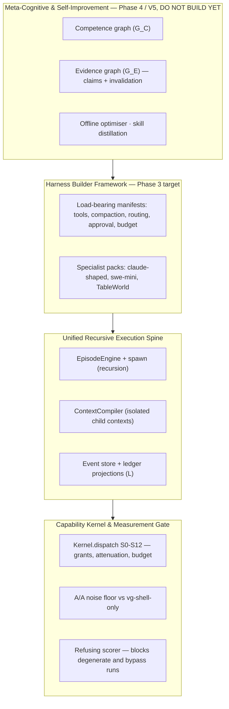

# 00 — Architecture Decisions for Implementers

**Audience:** any developer, any level, implementing a Phase 3 backlog row.
**Purpose:** carry every architectural decision you need so you can code without asking the Tech
Lead. If a question is not answered here, that is a defect in this document — raise it.
**Authority:** this is a **projection**. `docs/main_v4/` owns the rules; `VG-09` owns the decisions.
Where this file and an owner disagree, **the owner wins** (`PR-3`).

---

## 1. The four layers you are working inside



**Find your task's layer before you start.** A task that seems to need work in a layer *below*
yours is almost always a design error in your task — escalate rather than reaching down.

---

## 2. The eight properties a governed harness must have

Any change that weakens one of these is rejected regardless of what it improves.

1. **Single dispatch authority.** Effects happen on one path or they did not happen.
2. **Prefix-stable context.** L1–L3 frozen; dynamics only in later layers.
3. **Fail-closed uncertainty.** `inconclusive ≠ pass`. Missing evaluator ≠ success.
4. **Exterior judgement.** The loop must not grade itself.
5. **Operator-held privilege.** The process that can patch the disk must not mint the signature
   authorising the patch.
6. **Containment of exec.** Command verbs go through the sandbox, not the host.
7. **A real client protocol.** A CLI that cannot start a run on a daemon is a cassette player.
8. **Gates that can fail.** A contract row whose component is invisible to CI is not a requirement.

---

## 3. "Where does my new thing go?" — the decision tree

```
Is it a new capability?
├─ It observes or acts on the world        → EffectAdapter behind EnvironmentPort
│                                            + a DEFAULT_BINDINGS row + a manifest capability line
├─ It produces a proposal                  → CognitiveOperator (DATA in the artifact graph, not a
│                                            function in the loop) — Phase 4, O-03 gated
├─ It can be seen                          → ObservationSource
└─ It produces evidence                    → Evaluator (separate identity, unreachable)

Is it a behaviour change?
├─ Prompt / tools / compaction / routing / budget / approval → a MANIFEST COMPONENT
├─ A methodology with phases and gates                       → a PLAYBOOK artifact (Phase 4)
└─ A finite, auditable approval or release flow              → a PROCESS DEFINITION (governance/)

Is it none of the above?
└─ STOP. GTS-13C Ch. 6: "anything fitting none of these columns means the spine is wrong."
   That is a design review, not a pull request.
```

**A proposal to add a fifth extension form is a design review, not a PR.**

---

## 4. The locked decisions — D-01 … D-15

Binding via `ADR-0065`. Each has a reversal condition. **Do not reopen one for convenience**; if
you believe a reversal condition has fired, write an ADR citing it.

| # | Decision | Reversal |
|---|---|---|
| **D-01** | Two cassette systems, one `ModelPort`. LAM (OpenAI chat dialect) and `CassettePlayer` (proposal dialect) stay **distinct** | A single golden vector set proven byte-identical across both stores and both parsers |
| **D-02** | **Depth-1 remains the engine.** Reconstructions serialise parallel tools; the translator rejects `len(toolCalls) != 1` | `T4.7` independence groups land with property tests; privileged calls stay singleton |
| **D-03** | **No live PTY.** `proc.interactive` is not a handle; observe returns a snapshot | An ADR for `proc.session` binding `{argv0, cwd, envDigest, ttl, maxBytes}` with per-chunk authorisation |
| **D-04** | **New verbs are registry rows, not engine branches.** Tool schema + capability line + binding row + sink class + decidable selector kind. **Zero `if harness == "claude"`** | Never for competitor names |
| **D-05** | The proposal translator becomes **manifest-driven**. Frozen tool schemas are the only name→verb map | None while `ADR-0060` holds |
| **D-06** | **`vg-shell-only` is the only legal control arm.** LAM replay is not an A/A floor | `L-15` evidence licenses *not defaulting* to typed tools — never deletion of the baseline |
| **D-07** | LAM never sets competence; corrections are episodic and carry no instruction authority | `VG-06 §5` promotion has run on an artifact that cleared A/A **and** ablation |
| **D-08** | Public leaderboards stay deferred (`DEF-08`) | A non-degenerate live A/A floor exists, splits exist, the gap is monitored |
| **D-09** | Reconstruction honesty: `*-shaped` packs reconstruct **tool surface + prompt + policy**, never a vendor's scheduler. Never "beats X" | A legal agreement to run vendor binaries as an arm |
| **D-10** | `lab.harness` before `vg harness` while the product path is not trustworthy | Product path closed |
| **D-11** | Model-visible tool names ≠ kernel verbs. Packs declare the visible name; composition binds the verb | — |
| **D-12** | **Turn bounds live in `budget_policy`, not engine defaults.** A pack needing 80 turns is a budget artifact, not a loop fork | — |
| **D-13** | `models.json` `top` is `[]` until the Project Lead names three ids in the Decision Register | Named ids recorded |
| **D-14** | Indexing is an **observation adapter**, size-capped, in the worker. No in-kernel index, no semantic-search claim | Measured cost on a real repo crosses a stated threshold |
| **D-15** | **TableWorld is the generality falsifier, not a coding feature.** If it needs engine/algebra/envelope changes, `C-10` is falsified — file the finding, do not "make the engine more general" in the same PR | — |

---

## 5. The axioms you will actually trip over

| Axiom | What it means at the keyboard |
|---|---|
| `A-01` | The episode is the only execution primitive. **No second loop.** If you are writing `while` around a model call outside `EpisodeEngine`, stop |
| `A-02` / `L-3` | Operators are **data**, not functions in the loop. A loop that hard-codes "planning" can never replace its planner |
| `A-03` | Effects are authorised **before** a capability is issued, and bounded by a boundary independent of the model |
| `A-05` | **The verifier is outside the mutable surface.** No capability resolves to a verifier-owned path. If your code reads a verdict and branches on it, you have built a second judge |
| `A-07` | Everything is an event. One durable typed ledger; **every surface is a projection of it** — not a second store |
| `A-10` | **A gate that cannot fail is not a gate.** Every fix ships a test proven to fail against pre-fix code |
| `A-11` | Extensions resolve once at composition, then freeze. No runtime discovery |
| `A-12` | Instrument error is not task failure. `inconclusive` is first-class, never coerced |
| `N-16` | Leases release on **every** path, including creation failure |
| `N-17` | Unknown names fail at **composition**, not at first use |
| `N-21` | The brief is immutable and exempt from compaction |

---

## 6. The failure modes with your name on them

| Code | Failure | How it reaches your PR |
|---|---|---|
| `FT-08` | **Second patch path** | You add a second way to express "what changed". The environment's diff is the only one |
| `FT-09` | **Second judge** | A ranker admits, or a lint result becomes a verdict. Only the activation policy admits |
| `FT-10` | **Decorative switch** | A flag that reads as enabled and changes nothing. This is why an unread manifest component is a composition error |
| `FT-11` | **Goal drift** | Optimising the summary rather than the brief |
| `FT-13` | **Cache thrash** | Mid-run mutation of L1–L4. Mid-run additions go to L5, always |
| `FT-15` | **Silent recovery fiction** | Resolving an undeterminable external effect to success or failure. Preserve the uncertainty |

---

## 7. When to stop and escalate

Stop — do not work around — when:

1. A task needs a `kernel/` change (`ADR-0054`: ADR required, TCB budget alarmed).
2. A task needs an `agency/episode/` change and is not Sprint 8's `spawn` (`ADR-0060`).
3. A reconstruction pack cannot compose without a core change (**that is the `T7.6` experiment
   producing a result** — a valuable one).
4. TableWorld needs an engine, algebra or envelope change (`D-15`, `C-10` falsified).
5. You are about to write a conditional naming one provider, environment or task type
   (`T10.9` — *"it always arrives disguised as pragmatism"*).
6. A gate would have to be weakened for your change to pass.

**Escalation is a finding, not a failure.** `VG-02 §11.9`: negative results from a good instrument
are worth more than positive results from a bad one. Several of Phase 3's most valuable outcomes
are stop conditions firing.
