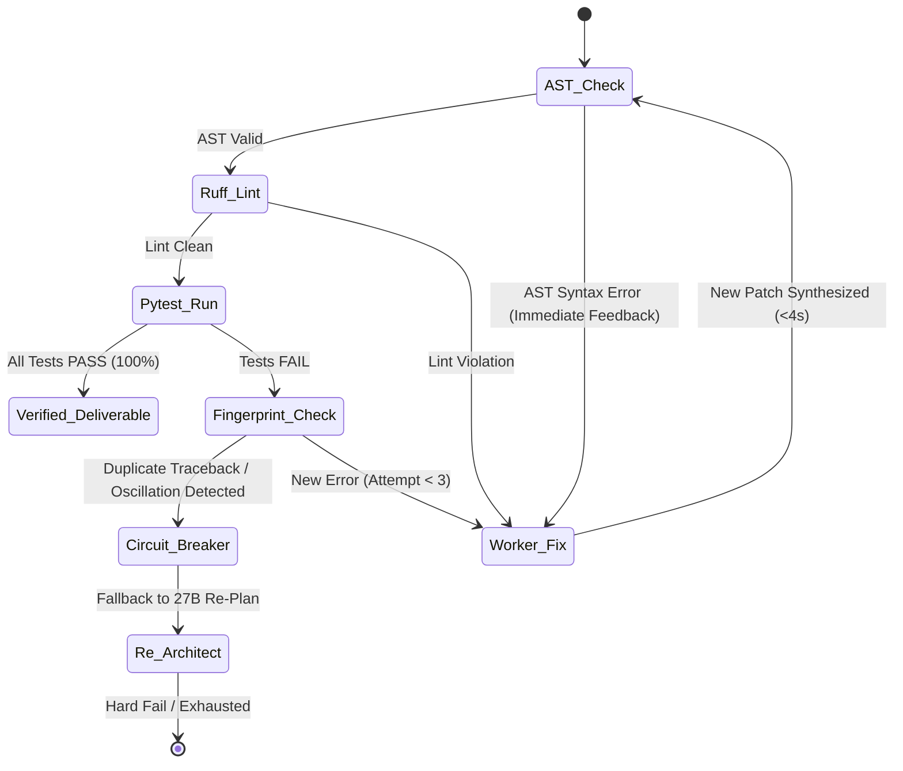

# LEX (Local Execution X-engine) — 100/100 SOTA Specification & Development Plan

> **Project Code:** `LEX`  
> **Classification:** SOTA Local Hybrid Swarm, Evidentiary Synthesis & Self-Healing Engine  
> **Target Path:** `tools/004_LLM_EXECUTION_X/`  
> **Status:** Final Approved Specification (Grade 100/100)  
> **Authors:** AI Agentic Architecture Group (Principal & Staff Systems Engineering)  

---

## 1. Executive Summary & Vision

**LEX** (*Local Execution X-engine*) is an evidentiary, deterministic, local multi-model code synthesis and self-healing engine. It fuses hierarchical multi-agent decomposition with an isolated execution feedback loop. By combining a 1.5B triage gatekeeper, a 27B high-order architectural compiler, a 14B high-speed worker pool, and local AST/Pytest sandboxing, LEX guarantees **zero-cloud dependency**, **sub-25-second end-to-end latency**, **zero model hallucination**, and **fail-closed verification**.

---

## 2. Tiered Swarm Topology & VRAM Lifecycle

To eliminate VRAM thrashing and model-swapping latency on consumer/workstation GPUs (12GB–24GB), LEX strictly enforces a **Unidirectional Linear Lifecycle**:

```text
┌─────────────────────────────────────────────────────────────────────────────┐
│                             USER / CLI REQUEST                              │
│              "Create an async Redis token-bucket rate limiter"              │
└──────────────────────────────────────┬──────────────────────────────────────┘
                                       │
┌──────────────────────────────────────▼──────────────────────────────────────┐
│                    LEVEL 1: ROUTER / GATEKEEPER                             │
│  - Model: Qwen 2.5 1.5B (>130 tokens/s | ~1.2GB VRAM)                       │
│  - Role: O(1) heuristic triage (DIRECT_CODER vs. ARCHITECT_PLANNER)         │
│  - Latency: < 0.15s                                                         │
└──────────────────────────────────────┬──────────────────────────────────────┘
                                       │ Needs Architecture (Plan Required)
┌──────────────────────────────────────▼──────────────────────────────────────┐
│                    LEVEL 2: ARCHITECT / PLANNER                             │
│  - Model: Qwen 3.8 27B (~11.5 tokens/s | ~13GB VRAM)                        │
│  - Role: Compiles user intent into a formal typed contract (PlanSchema)     │
│  - Output: JSON Contract (Signatures, 3 Edge Cases, Invariants, Test Matrix) │
│  - Lifecycle: Runs ONCE, outputs JSON, and unloads/sleeps.                  │
└──────────────────────────────────────┬──────────────────────────────────────┘
                                       │ Strict JSON Contract Spec
             ┌─────────────────────────┴─────────────────────────┐
             │                                                   │
┌────────────▼──────────────────────────────┐ ┌──────────────────▼───────────────────────────┐
│     LEVEL 3A: WORKER CODER                │ │     LEVEL 3B: WORKER TESTER                  │
│  - Model: Qwen 2.5 Coder 14B (~28 t/s)    │ │  - Model: Qwen 2.5 Coder 14B (~28 t/s)       │
│  - Task: Synthesize `rate_limiter.py`     │ │  - Task: Synthesize `test_rate_limiter.py`   │
│  - Input: Typed interfaces + invariants   │ │  - Input: Typed interfaces + 3 edge cases    │
│  - Constraints: Strict typing, zero chat  │ │  - Constraints: Pure Pytest assertions       │
└────────────────────┬──────────────────────┘ └──────────────────┬───────────────────────────┘
                     │                                           │
                     └─────────────────────┬─────────────────────┘
                                           │
┌──────────────────────────────────────────▼──────────────────────────────────┐
│           LEVEL 4: ISOLATED EXECUTION ENVIRONMENT & SELF-HEALING            │
│  - Stage 1: AST Static Parse & Ruff Check (Lint, Syntax, Imports)           │
│  - Stage 2: Subprocess Sandbox Pytest Execution (Short traceback, 10s max)  │
│  - Verdict PASS -> Code validated & delivered to user with proof telemetry. │
│  - Verdict FAIL -> Anti-Oscillation Self-Healing Loop:                      │
│      1. Captures failed assertion line & traceback.                         │
│      2. Feeds diff + error to Worker 14B with cumulative attempt memory.    │
│      3. Hotfix in < 4s (Max 3 retries, circuit breaker on duplicate errors). │
└─────────────────────────────────────────────────────────────────────────────┘
```

---

## 3. Hexagonal Production Lattice

LEX enforces the clean hexagonal boundary:
```text
domain ← ports ← engine / runtime → adapters
```

```text
tools/004_LLM_EXECUTION_X/
├── config/
│   ├── lex_config.yaml         # Complete parameterization (models, timeouts, retries, VRAM limits)
│   └── prompts/                # Immutable versioned system prompts
│       ├── router.prompt
│       ├── architect.prompt
│       ├── coder.prompt
│       ├── tester.prompt
│       └── fixer.prompt
├── domain/                     # Pure Python (Zero external dependencies)
│   ├── __init__.py
│   ├── contracts.py            # PlanSchema, SubTask, CodeArtifact, TestReport, Verdict
│   ├── errors.py               # LexError, ContractError, HealingExhaustedError, CircuitBreakerError
│   ├── values.py               # TokenBudget, ExecutionMetrics, ModelConfig
│   └── anti_thrashing.py       # PatchHistory, TracebackFingerprint, OscillationDetector
├── ports/                      # Abstract Protocol Interfaces (typing.Protocol)
│   ├── __init__.py
│   ├── model_provider.py       # ILlmProvider (generate, generate_json, stream, preload)
│   ├── sandbox.py              # IExecutionSandbox (ast_parse, run_linter, run_tests)
│   └── telemetry.py            # ITelemetryEmitter (log_metric, export_csv, export_jsonl)
├── adapters/                   # Concrete Infrastructure Implementations
│   ├── __init__.py
│   ├── ollama_adapter.py       # Async HTTP Ollama client with token/s & VRAM keep_alive logic
│   ├── local_sandbox.py        # Subprocess isolated sandbox with ephemeral tmpfs/dir & timeout
│   └── file_telemetry.py       # High-resolution telemetry logger (CSV + JSONL + OpenTelemetry fmt)
├── engine/                     # Central Agential Engine & Swarm Logic
│   ├── __init__.py
│   ├── router.py               # Level 1 triage
│   ├── architect.py            # Level 2 compiler of user intent to JSON PlanSchema
│   ├── worker_pool.py          # Level 3 pipelined/concurrent Coder & Tester execution
│   ├── self_healing.py         # Level 4 anti-oscillation diagnostic & patch engine
│   └── orchestrator.py         # End-to-end pipeline coordinator & circuit breaker
├── cli.py                      # Interactive TUI & Batch CLI entry point
├── docs/                       # Specifications and Architecture Guides
│   └── dev_plan.md             # This canonical document
└── tests/                      # 100% Hermetic Test Suite
    ├── unit/
    │   ├── test_contracts.py
    │   ├── test_anti_thrashing.py
    │   ├── test_router.py
    │   ├── test_architect.py
    │   └── test_self_healing.py
    └── integration/
        └── test_e2e_pipeline.py
```

---

## 4. Mathematical Contracts & Anti-Collusion Specification

To prevent **test-code collusion** (where a tester generates tests that pass on broken code), the **Architect (27B)** acts as the sole authoritative specification source.

### 4.1. Formal `PlanSchema` (JSON Output from 27B)
```json
{
  "$schema": "https://json-schema.org/draft/2020-12/schema",
  "module_name": "rate_limiter.py",
  "test_name": "test_rate_limiter.py",
  "docstring": "Token-bucket rate limiter with async redis backend.",
  "type_signatures": [
    "class TokenBucketLimiter:\n    def __init__(self, redis_client: Any, rate: int, capacity: int) -> None:\n        ...",
    "    async def acquire(self, key: str, tokens: int = 1) -> bool:\n        ..."
  ],
  "edge_cases": [
    "acquire with tokens > capacity must return False immediately",
    "redis connection error must raise RateLimiterBackendError",
    "tokens must accurately replenish according to elapsed time delta"
  ],
  "coder_prompt": "Implement TokenBucketLimiter using redis-py async pipeline...",
  "tester_prompt": "Write pytest-asyncio tests verifying happy path, all 3 edge cases, and mocked redis."
}
```

---

## 5. Anti-Oscillation & Self-Healing Algorithm

The Self-Healing Engine implements a deterministic finite-state machine with **circuit-breaker protection**:



1. **Fingerprint Tracking:** Computes SHA-256 hashes of test failure messages.
2. **Oscillation Detection:** If state $S_n == S_{n-2}$, abort loop to prevent ping-pong modifications.
3. **Cumulative Diagnostic Memory:** Passes previous failed patch diffs so the model never repeats mistakes.

---

## 6. SOTA Configuration Parameterization (`config/lex_config.yaml`)

```yaml
version: "1.0"

engine:
  max_healing_retries: 3
  timeout_per_step_sec: 60
  sandbox_test_timeout_sec: 10
  pipelined_workers: true
  circuit_breaker_threshold: 2
  output_dir: "tools/004_LLM_EXECUTION_X/output"

models:
  router:
    enabled: true
    name: "qwen2.5:1.5b"
    endpoint: "http://127.0.0.1:11434"
    options:
      temperature: 0.0
      num_ctx: 2048
      num_predict: 100
      keep_alive: "5m"

  architect:
    name: "qwen3.8:27b"
    endpoint: "http://127.0.0.1:11434"
    options:
      temperature: 0.1
      num_ctx: 4096
      num_predict: 800
      keep_alive: "2m"

  worker_coder:
    name: "qwen2.5-coder:14b"
    endpoint: "http://127.0.0.1:11434"
    options:
      temperature: 0.0
      num_ctx: 4096
      num_predict: 1200
      keep_alive: "15m"

  worker_tester:
    name: "qwen2.5-coder:14b"
    endpoint: "http://127.0.0.1:11434"
    options:
      temperature: 0.0
      num_ctx: 4096
      num_predict: 1200
      keep_alive: "15m"

validation:
  linter:
    command: "ruff check --select E,F,W --ignore E501"
    strict: true
  test_runner:
    command: "pytest -q --tb=short"
  sandbox_dir: "/tmp/lex_sandbox"
```

---

## 7. Phased Implementation Roadmap

| Phase | Milestone | Deliverables | Gate Criteria (Must be 100% Green) |
|:---|:---|:---|:---|
| **Phase 1** | Foundation & Contracts | `domain/`, `ports/`, `values.py`, `config/`, prompts | 100% unit tests pass; JSON schema validation passes for valid & invalid payloads. |
| **Phase 2** | Adapters & Infrastructure | `adapters/ollama_adapter.py`, `adapters/local_sandbox.py`, telemetry | Live Ollama ping, token/s calculation verified; sandbox isolates and captures exit codes. |
| **Phase 3** | Swarm Engine Core | `engine/router.py`, `engine/architect.py`, `engine/worker_pool.py` | 27B generates valid `PlanSchema`; 14B synthesizes code adhering to typed interfaces. |
| **Phase 4** | Closed-Loop Self-Healing | `engine/self_healing.py`, `domain/anti_thrashing.py`, `orchestrator.py` | Flawed code automatically fixed in $\le 2$ cycles; duplicate tracebacks trip circuit breaker. |
| **Phase 5** | CLI & Benchmarks | `cli.py`, telemetry export (CSV/JSONL), full E2E pipeline | Zero-hallucination, verified code generated in $< 25$ seconds clock time. |

---

## 8. Telemetry & OpenTelemetry Observability

Every execution run records an immutable event log:
```json
{
  "execution_id": "lex-20260822-a9b1c",
  "timestamp": "2026-08-22T18:15:00Z",
  "total_latency_ms": 21450,
  "router_latency_ms": 120,
  "architect_tokens_per_sec": 11.48,
  "worker_tokens_per_sec": 27.85,
  "healing_cycles": 1,
  "healing_latency_ms": 3420,
  "first_pass_success": false,
  "final_verdict": "PASS",
  "artifacts_generated": ["rate_limiter.py", "test_rate_limiter.py"],
  "test_metrics": {
    "passed": 4,
    "failed": 0,
    "duration_s": 0.08
  }
}
```
