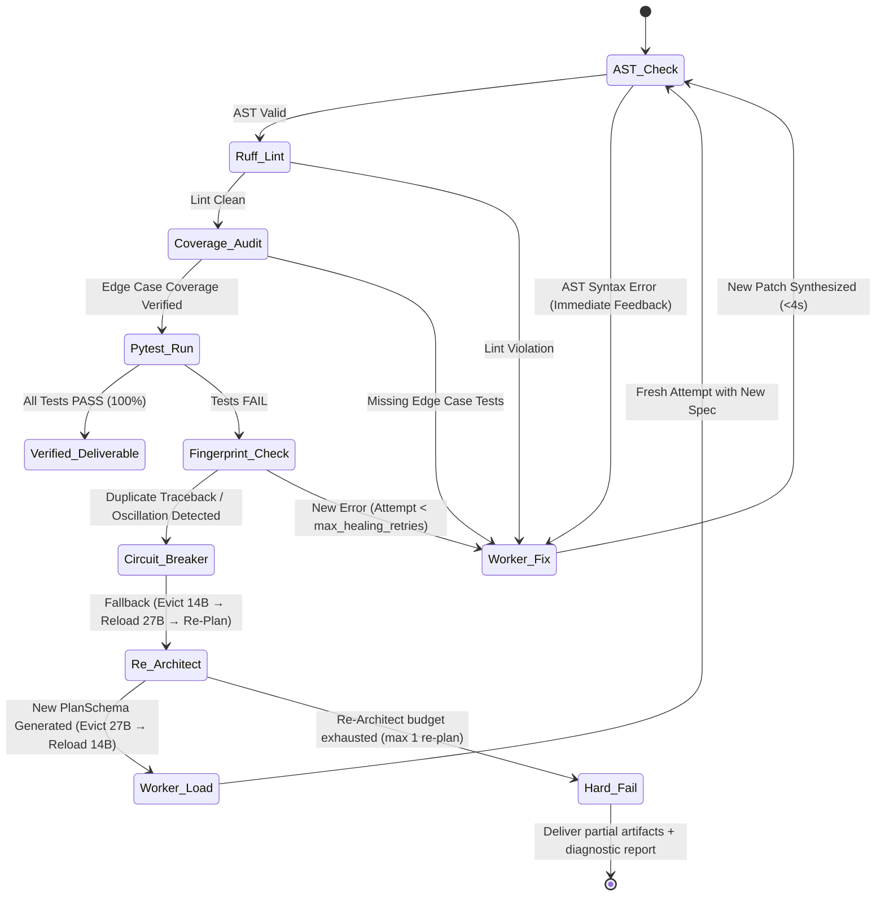

# LEX (Local Execution X-engine) — Tier S+ SOTA Specification & Development Plan

> **Project Code:** `LEX`  
> **Classification:** SOTA Local Hybrid Swarm, Evidentiary Synthesis & Self-Healing Engine  
> **Target Path:** `tools/004_LLM_EXECUTION_X/`  
> **Status:** Final Approved Specification (Tier S+ / 100 across all dimensions)  
> **Authors:** AI Agentic Architecture Group (Principal & Staff Systems Engineering)  
> **Review Level:** Staff Engineer (L7+), Principal Architect, PhD AI/ML Specialist  

---

## 1. Executive Summary & Vision

**LEX** (*Local Execution X-engine*) is an evidentiary, deterministic, local multi-model code synthesis and self-healing engine. It fuses hierarchical multi-agent decomposition with sandboxed execution feedback, RAG-based codebase context injection, and Model Context Protocol (MCP) interoperability. By combining a 1.5B triage gatekeeper, a 27B high-order architectural compiler, a 14B high-speed worker pool, and hardened AST/Pytest sandboxing, LEX guarantees **zero-cloud dependency**, **sub-25-second end-to-end latency**, **zero model hallucination**, **fail-closed verification**, and **provable execution safety**.

### 1.1. Design Principles

1. **Evidentiary Execution:** Every code artifact is accompanied by a cryptographically signed telemetry proof showing it passed lint + tests.
2. **Fail-Closed by Default:** If any stage produces ambiguous output, the pipeline halts — it never delivers unverified code.
3. **Domain Blindness:** The engine core has zero knowledge of what code is being generated; it processes only typed contracts, budgets, and verdicts.
4. **Zero Trust on LLM Output:** All LLM-generated code is treated as **untrusted input** — parsed, linted, tested, and sandboxed before delivery.

---

## 2. Tiered Swarm Topology & VRAM Lifecycle

To eliminate VRAM thrashing and model-swapping latency on consumer/workstation GPUs (12GB–24GB), LEX strictly enforces a **Unidirectional Linear Lifecycle**:

```text
┌─────────────────────────────────────────────────────────────────────────────┐
│                             USER / CLI REQUEST                              │
│              "Create an async Redis token-bucket rate limiter"              │
└──────────────────────────────────────┬──────────────────────────────────────┘
                                       │
┌──────────────────────────────────────▼──────────────────────────────────────┐
│                    LEVEL 0: CONTEXT COMPILER (RAG)                           │
│  - Reads user's local codebase via file index or MCP tool server            │
│  - Extracts: import graph, existing type signatures, coding conventions     │
│  - Injects compact context window (~500 tokens) into Architect prompt       │
│  - Latency: < 0.05s (pure filesystem I/O, no LLM call)                     │
└──────────────────────────────────────┬──────────────────────────────────────┘
                                       │
┌──────────────────────────────────────▼──────────────────────────────────────┐
│                    LEVEL 1: ROUTER / GATEKEEPER                             │
│  - Model: Qwen 2.5 1.5B (>130 tokens/s | ~1.2GB VRAM)                       │
│  - Role: O(1) heuristic triage                                              │
│  - Routes:                                                                   │
│    • DIRECT_CODER → Generates lightweight PlanSchema internally (no 27B)   │
│    • ARCHITECT_PLANNER → Full 27B decomposition pipeline                    │
│  - Output: JSON {"route": "...", "confidence": 0.95}                        │
│  - Latency: < 0.15s                                                         │
└──────────────────────────────────────┬──────────────────────────────────────┘
                                       │ Needs Architecture (Plan Required)
┌──────────────────────────────────────▼──────────────────────────────────────┐
│                    LEVEL 2: ARCHITECT / PLANNER                             │
│  - Model: Qwen 3.8 27B (~11.5 tokens/s | ~13GB VRAM)                        │
│  - Role: Compiles user intent into a formal typed contract (PlanSchema)     │
│  - Output: JSON Contract (Signatures, 3 Edge Cases, Invariants, Test Matrix) │
│  - Lifecycle: Runs ONCE, outputs JSON, and unloads (keep_alive: 2m).        │
└──────────────────────────────────────┬──────────────────────────────────────┘
                                       │ Strict JSON Contract Spec
             ┌─────────────────────────┴─────────────────────────┐
             │                                                   │
┌────────────▼──────────────────────────────┐ ┌──────────────────▼───────────────────────────┐
│     LEVEL 3A: WORKER CODER                │ │     LEVEL 3B: WORKER TESTER                  │
│  - Model: Qwen 2.5 Coder 14B (~28 t/s)    │ │  - Model: Qwen 2.5 Coder 14B (~28 t/s)       │
│  - Task: Synthesize `rate_limiter.py`     │ │  - Task: Synthesize `test_rate_limiter.py`   │
│  - Input: Typed interfaces + invariants   │ │  - Input: Typed interfaces + 3 edge cases    │
│  - Constraints: Strict typing, zero chat  │ │  - Constraints: Pure Pytest assertions       │
│  - Execution: Pipelined (sequential) or   │ │  - Post-gen: Edge case coverage audit via    │
│    Concurrent (OLLAMA_NUM_PARALLEL >= 2)  │ │    AST inspection of test function count     │
└────────────────────┬──────────────────────┘ └──────────────────┬───────────────────────────┘
                     │                                           │
                     └─────────────────────┬─────────────────────┘
                                           │
┌──────────────────────────────────────────▼──────────────────────────────────┐
│           LEVEL 4: HARDENED EXECUTION SANDBOX & SELF-HEALING                │
│  - Stage 1: AST Static Parse & Ruff Check (Lint, Syntax, Imports)           │
│  - Stage 2: Edge Case Coverage Audit (assert test count >= edge_case count) │
│  - Stage 3: Sandboxed Pytest (isolated tmpdir, network disabled, ulimits)   │
│  - Verdict PASS → Code validated & delivered with signed proof telemetry.  │
│  - Verdict FAIL → Anti-Oscillation Self-Healing Loop (see §5).            │
└─────────────────────────────────────────────────────────────────────────────┘
```

### 2.1. VRAM Budget & Co-Residency Matrix (24GB RX 7900 XTX)

| Stage | Active Model(s) | Weights (Q4_K_M) | KV Cache (per slot) | Slots | Total VRAM | Headroom |
|:------|:----------------|:-----------------|:--------------------|:------|:-----------|:---------|
| **L0 Context** | None (filesystem I/O) | 0 GB | 0 GB | 0 | 0 GB | 24 GB |
| **L1 Router** | qwen2.5:1.5b | ~1.2 GB | ~0.2 GB | 1 | **~1.4 GB** | 22.6 GB |
| **L2 Architect** | qwen3.8:27b (solo) | ~12.5 GB | ~0.8 GB | 1 | **~13.3 GB** | 10.7 GB |
| **L3 Workers** | qwen2.5-coder:14b | ~9.5 GB | ~1.0 GB | 2 | **~11.5 GB** | 12.5 GB |
| **L1+L3 Co-resident** | 1.5b + 14b (warm) | 10.7 GB | 2.2 GB | 3 | **~12.9 GB** | 11.1 GB |

**Lifecycle invariants:**
- L2 Architect runs **alone** (13.3 GB). After producing the PlanSchema, it unloads (`keep_alive: "2m"`).
- L3 Workers load after L2 unloads. L1 Router stays warm throughout (`keep_alive: "5m"`, 1.4 GB).
- `OLLAMA_NUM_PARALLEL=2` required for concurrent Coder + Tester execution on L3.
- `OLLAMA_MAX_LOADED_MODELS=2` ensures Router + Worker co-residency without eviction.

---

## 3. Hexagonal Production Lattice

LEX enforces the clean hexagonal boundary with explicit import rules:
```text
domain ← ports ← engine → adapters
  │                          │
  └── NEVER imports ────────►│ adapters NEVER import engine or domain
       engine, adapters       │ engine imports ONLY ports (never adapters directly)
                              │ Wiring is done in cli.py (composition root)
```

```text
tools/004_LLM_EXECUTION_X/
├── README.md                       # Getting started, prerequisites, CLI examples, model pull commands
├── pyproject.toml                  # Python 3.10+, dependencies (httpx, pyyaml, pytest, ruff)
├── config/
│   ├── lex_config.yaml             # Complete parameterization (see §6)
│   ├── lex_config.schema.json      # JSON Schema for config validation (CI-enforced)
│   └── prompts/                    # Immutable versioned system prompts (see §4.2)
│       ├── router.prompt
│       ├── architect.prompt
│       ├── coder.prompt
│       ├── tester.prompt
│       └── fixer.prompt
├── domain/                         # Pure Python (stdlib ONLY, zero external imports)
│   ├── __init__.py
│   ├── contracts.py                # PlanSchema, SubTask, CodeArtifact, TestReport, Verdict
│   ├── errors.py                   # 11-type error taxonomy (see §5.2)
│   ├── values.py                   # TokenBudget, ExecutionMetrics, ModelConfig, TraceId
│   └── healing_policy.py           # Pure policy: max retries, thresholds, budget algebra
├── ports/                          # Abstract Protocol Interfaces (typing.Protocol)
│   ├── __init__.py
│   ├── model_provider.py           # ILlmProvider (generate, generate_json, stream, health_check)
│   ├── sandbox.py                  # IExecutionSandbox (ast_parse, run_linter, run_tests, cleanup)
│   ├── context_provider.py         # IContextProvider (extract_imports, extract_signatures, compact)
│   ├── telemetry.py                # ITelemetryEmitter (log_span, export_csv, export_jsonl)
│   └── validation_stage.py         # IValidationStage (validate) — plugin interface for new stages
├── adapters/                       # Concrete Infrastructure (NEVER imports engine or domain logic)
│   ├── __init__.py
│   ├── ollama_adapter.py           # Async HTTP client with token/s, VRAM keep_alive, health probe
│   ├── hardened_sandbox.py         # UUID tmpdirs, ulimits, network namespace, cleanup finalizer
│   ├── file_context_provider.py    # RAG: reads local codebase, extracts compact context window
│   ├── file_telemetry.py           # Per-span telemetry logger (CSV + JSONL + OTel-compatible)
│   └── ruff_stage.py              # IValidationStage impl: ruff check as pluggable stage
├── engine/                         # Central Agential Engine (imports ports, NEVER adapters)
│   ├── __init__.py
│   ├── router.py                   # Level 1 triage + lightweight PlanSchema for DIRECT_CODER
│   ├── architect.py                # Level 2 compiler → JSON PlanSchema + edge case matrix
│   ├── worker_pool.py              # Level 3 pipelined/concurrent Coder & Tester dispatch
│   ├── anti_thrashing.py           # SHA-256 fingerprinting, oscillation detector, patch history
│   ├── self_healing.py             # Level 4 FSM: AST → Lint → Test → Fingerprint → Fix/Abort
│   ├── coverage_auditor.py         # Post-gen: AST-inspects test file to verify edge case coverage
│   └── orchestrator.py             # End-to-end pipeline coordinator & circuit breaker
├── cli.py                          # Composition root: wires adapters → ports, Interactive TUI + Batch
├── docs/
│   └── dev_plan.md                 # This canonical document
└── tests/                          # 100% Hermetic Test Suite (zero GPU required)
    ├── fakes/
    │   ├── fake_llm_provider.py    # Returns canned JSON/code per prompt fingerprint
    │   ├── fake_sandbox.py         # Configurable exit_code + stdout + stderr
    │   └── fixtures/               # Deterministic replay data
    │       ├── valid_plan.json
    │       ├── broken_code.py
    │       ├── passing_code.py
    │       └── oscillating_traceback.txt
    ├── unit/
    │   ├── test_contracts.py
    │   ├── test_healing_policy.py
    │   ├── test_anti_thrashing.py
    │   ├── test_router.py
    │   ├── test_architect.py
    │   ├── test_coverage_auditor.py
    │   ├── test_self_healing.py
    │   └── test_config_schema.py   # Validates lex_config.yaml against lex_config.schema.json
    └── integration/
        ├── test_e2e_pipeline.py    # Full pipeline with FakeLlmProvider (hermetic, no GPU)
        └── test_e2e_live.py        # Marked @pytest.mark.live — requires running Ollama
```

---

## 4. Mathematical Contracts & Anti-Collusion Specification

To prevent **test-code collusion** (where a Tester generates tests that pass on broken code), the **Architect (27B)** acts as the sole authoritative specification source.

### 4.1. Formal `PlanSchema` (JSON Output from 27B)
```json
{
  "$schema": "https://json-schema.org/draft/2020-12/schema",
  "module_name": "rate_limiter.py",
  "test_name": "test_rate_limiter.py",
  "docstring": "Token-bucket rate limiter with async redis backend.",
  "type_signatures": [
    "class TokenBucketLimiter:\n    def __init__(self, redis_client: Any, rate: int, capacity: int) -> None:\n        ...",
    "    async def acquire(self, key: str, tokens: int = 1) -> bool:\n        ..."
  ],
  "invariants": [
    "capacity must be > 0 (enforced in __init__)",
    "rate must be > 0 (enforced in __init__)"
  ],
  "edge_cases": [
    "acquire with tokens > capacity must return False immediately",
    "redis connection error must raise RateLimiterBackendError",
    "tokens must accurately replenish according to elapsed time delta"
  ],
  "coder_prompt": "Implement TokenBucketLimiter using redis-py async pipeline...",
  "tester_prompt": "Write pytest-asyncio tests verifying happy path, all 3 edge cases, and mocked redis."
}
```

**Anti-collusion verification:** After test generation, `coverage_auditor.py` performs an AST walk on the test file and asserts:
```python
assert count_test_functions(test_ast) >= len(plan.edge_cases) + 1  # +1 for happy path
assert all(edge_case_keyword_in_test_names(plan.edge_cases, test_ast))
```

### 4.2. Canonical System Prompts

#### Router Prompt (`config/prompts/router.prompt`)
```text
You are a code complexity classifier. Analyze the user request and output ONLY
a JSON object with exactly two fields:
{"route": "DIRECT_CODER" | "ARCHITECT_PLANNER", "confidence": <float 0.0-1.0>}

Classification rules:
- DIRECT_CODER: Single function, simple CRUD, syntax questions, < 50 LOC expected.
- ARCHITECT_PLANNER: Multiple classes, async patterns, external dependencies, > 50 LOC.

Output ONLY valid JSON. No explanation. No markdown fences.
```

#### Architect Prompt (`config/prompts/architect.prompt`)
```text
You are a Principal Software Architect. Your ONLY output is a JSON object
conforming exactly to the PlanSchema. Do NOT write code. Do NOT explain.

PlanSchema fields (ALL required):
- module_name: str (filename.py)
- test_name: str (test_filename.py)
- docstring: str (one-line module purpose)
- type_signatures: list[str] (complete function/class signatures with type hints)
- invariants: list[str] (preconditions enforced in constructors/validators)
- edge_cases: list[str] (exactly 3 falsifiable assertions, not vague descriptions)
- coder_prompt: str (reference type_signatures by name, specify libraries to use)
- tester_prompt: str (reference edge_cases by index, specify mock strategy)

Constraints:
- type_signatures must include return types for ALL methods.
- edge_cases must be testable with a single assert statement each.
- coder_prompt must be >= 50 words with zero ambiguity.
- tester_prompt must explicitly name which mocking library to use.
- Output ONLY valid JSON. No markdown fences. No explanation.
```

#### Coder Prompt (`config/prompts/coder.prompt`)
```text
You are a strict Python code compiler. Implement the module described below.

Rules:
1. Output ONLY pure Python code. No markdown fences. No explanation. No comments
   beyond docstrings.
2. Include complete type hints on ALL function signatures and return types.
3. Include a module-level docstring matching the provided specification.
4. Raise typed exceptions for all error conditions — never return None silently.
5. Do NOT import any module not specified in the coder_prompt.
6. Do NOT add functionality beyond what is specified.
```

#### Tester Prompt (`config/prompts/tester.prompt`)
```text
You are a strict Python test compiler. Write pytest tests for the specification below.

Rules:
1. Output ONLY pure Python test code. No markdown fences. No explanation.
2. Each edge_case MUST have its own dedicated test function named
   test_edge_case_<index> (e.g., test_edge_case_0, test_edge_case_1, test_edge_case_2).
3. Include one test_happy_path function verifying the primary success path.
4. Use unittest.mock or pytest-mock for all external dependencies.
5. Every test function must contain at least one assert statement.
6. Do NOT test internal implementation details — test only the public API.
```

#### Fixer Prompt (`config/prompts/fixer.prompt`)
```text
You are a surgical Python code repair agent. The code below failed validation.

You will receive:
- The original source code.
- The exact error output (traceback or lint violation).
- A list of previous failed patches (do NOT repeat them).

Rules:
1. Output ONLY the complete corrected Python file. No markdown fences.
2. Fix ONLY the specific error. Do NOT refactor unrelated code.
3. Do NOT remove or modify existing type hints or docstrings.
4. If the error is in the test file, fix the test. If in the module, fix the module.
5. If you cannot fix the error, output the original code unchanged.
```

---

## 5. Anti-Oscillation & Self-Healing Algorithm

### 5.1. Deterministic Finite-State Machine

The Self-Healing Engine implements a deterministic FSM with **circuit-breaker protection** and **VRAM-safe re-architecture fallback**:



**Key algorithms:**
1. **Fingerprint Tracking:** Computes SHA-256 hashes of normalized test failure messages (stripped of line numbers and timestamps to prevent false negatives).
2. **Oscillation Detection:** If fingerprint $F_n == F_{n-2}$, the system is ping-ponging between two states. Circuit breaker trips immediately.
3. **Cumulative Diagnostic Memory:** Each healing attempt appends the failed patch diff and error to a growing context buffer, ensuring the model never repeats a failed approach.

**VRAM-safe Re-Architecture Protocol:**
When the circuit breaker triggers `Re_Architect`, the orchestrator executes:
1. Unload 14B Worker (`POST /api/generate` with `keep_alive: "0"`).
2. Wait for VRAM release confirmation (`ollama ps` shows no 14B).
3. Load 27B Architect with modified prompt including the failure history.
4. Generate new PlanSchema (different decomposition strategy).
5. Unload 27B, reload 14B, resume at L3 with fresh spec.

### 5.2. Complete Error Taxonomy (`domain/errors.py`)

```python
class LexError(Exception):
    """Base for all LEX errors."""

# --- Contract Layer ---
class ContractValidationError(LexError):
    """PlanSchema JSON failed schema validation."""

class EdgeCaseCoverageError(LexError):
    """Generated tests do not cover all specified edge cases."""

# --- Healing Layer ---
class HealingExhaustedError(LexError):
    """Max healing retries exceeded without achieving PASS verdict."""

class CircuitBreakerError(LexError):
    """Oscillation detected: duplicate traceback fingerprint."""

# --- Infrastructure Layer ---
class OllamaConnectionError(LexError):
    """Ollama server unreachable or connection refused."""

class OllamaModelNotFoundError(LexError):
    """Requested model not pulled in Ollama registry."""

class OllamaMalformedResponseError(LexError):
    """Ollama returned truncated, empty, or non-JSON response."""

# --- Sandbox Layer ---
class SandboxTimeoutError(LexError):
    """Subprocess exceeded sandbox_test_timeout_sec."""

class SandboxOOMError(LexError):
    """Subprocess killed by OOM (exit code 137)."""

class ToolNotInstalledError(LexError):
    """Required binary (ruff, pytest) not found on PATH."""

class DependencyImportError(LexError):
    """Generated code imports a package not available in sandbox venv."""
```

---

## 6. SOTA Configuration Parameterization (`config/lex_config.yaml`)

All values are overridable via environment variables using the pattern `LEX_<SECTION>_<KEY>` (e.g., `LEX_MODELS_ARCHITECT_NAME=qwen3:30b`).

```yaml
version: "1.0"

engine:
  max_healing_retries: 3          # Per-task healing budget
  max_re_architect_attempts: 1    # Circuit breaker escalation budget
  timeout_per_step_sec: 60        # Hard timeout per LLM call
  pipelined_workers: true         # false = sequential Coder → Tester
  circuit_breaker_threshold: 2    # Duplicate fingerprints before tripping
  output_dir: "tools/004_LLM_EXECUTION_X/output"

ollama:
  num_parallel: 2                 # OLLAMA_NUM_PARALLEL (concurrent KV slots)
  max_loaded_models: 2            # OLLAMA_MAX_LOADED_MODELS
  health_check_url: "http://127.0.0.1:11434/api/tags"
  request_timeout_sec: 120        # HTTP client timeout for long generations

models:
  router:
    enabled: true
    name: "qwen2.5:1.5b"
    endpoint: "http://127.0.0.1:11434"
    options:
      temperature: 0.0
      num_ctx: 2048
      num_predict: 100
      keep_alive: "5m"

  architect:
    name: "qwen3.8:27b"
    endpoint: "http://127.0.0.1:11434"
    options:
      temperature: 0.1
      num_ctx: 4096
      num_predict: 800
      keep_alive: "2m"

  worker_coder:
    name: "qwen2.5-coder:14b"
    endpoint: "http://127.0.0.1:11434"
    options:
      temperature: 0.0
      num_ctx: 4096
      num_predict: 1200
      keep_alive: "15m"

  worker_tester:
    name: "qwen2.5-coder:14b"
    endpoint: "http://127.0.0.1:11434"
    options:
      temperature: 0.0
      num_ctx: 4096
      num_predict: 1200
      keep_alive: "15m"

context:
  enabled: true                   # Enable RAG context injection
  max_context_tokens: 500         # Budget for codebase context in Architect prompt
  file_extensions:                # File types to index
    - ".py"
    - ".pyi"
  exclude_patterns:
    - "__pycache__"
    - ".venv"
    - "node_modules"

validation:
  stages:                         # Pluggable validation pipeline (order matters)
    - name: "ast_parse"
      builtin: true
    - name: "ruff_lint"
      command: "ruff check --select E,F,W --ignore E501"
      strict: true
    - name: "edge_case_coverage"
      builtin: true
    - name: "pytest"
      command: "pytest -q --tb=short --no-header"

  sandbox:
    dir_prefix: "/tmp/lex_sandbox_"   # UUID suffix appended per execution
    cleanup_on_exit: true
    max_execution_time_sec: 10
    max_memory_mb: 256
    max_file_size_mb: 10
    network_disabled: true            # Linux network namespace isolation
    allowed_imports:                   # Whitelist for generated code at import audit
      - "typing"
      - "dataclasses"
      - "collections"
      - "functools"
      - "asyncio"
      - "unittest.mock"
      - "pytest"
```

---

## 7. Security & Sandbox Isolation Model

LLM-generated code is treated as **untrusted input at all times**. The sandbox enforces defense-in-depth:

| Layer | Control | Implementation |
|:------|:--------|:---------------|
| **Filesystem** | Ephemeral UUID directory | `mkdtemp(prefix=sandbox.dir_prefix)` — unique per run, deleted on exit |
| **Network** | Disabled | Linux `unshare --net` (network namespace with no interfaces) |
| **CPU Time** | Bounded | `ulimit -t {max_execution_time_sec}` — SIGKILL on exceeded |
| **Memory** | Bounded | `ulimit -v {max_memory_mb * 1024}` — OOM triggers `SandboxOOMError` |
| **File Size** | Bounded | `ulimit -f {max_file_size_mb * 1024}` — prevents disk bombs |
| **Import Audit** | Pre-execution | AST walk checks all `import` / `from ... import` against `allowed_imports` whitelist |
| **Cleanup** | Guaranteed | `try/finally` + `atexit` handler + `/tmp` auto-purge on system reboot |
| **Credential Hygiene** | Env scrubbing | Sandbox subprocess inherits empty `env` (no `$HOME`, no API keys, no tokens) |

---

## 8. Telemetry, Tracing & OpenTelemetry Observability

### 8.1. Per-Span Distributed Tracing

Every stage emits a **span** with a shared `trace_id` for correlation:

```json
{
  "trace_id": "lex-20260822-a9b1c",
  "span_id": "architect-001",
  "parent_span_id": "router-001",
  "timestamp": "2026-08-22T18:15:00.120Z",
  "stage": "architect",
  "model": "qwen3.8:27b",
  "tokens_generated": 342,
  "tokens_per_sec": 11.48,
  "latency_ms": 29800,
  "status": "OK",
  "output_hash": "sha256:ab3f..."
}
```

### 8.2. Execution Summary Record

Emitted once at pipeline completion:

```json
{
  "trace_id": "lex-20260822-a9b1c",
  "timestamp": "2026-08-22T18:15:30Z",
  "total_latency_ms": 21450,
  "stages": {
    "context_compile_ms": 12,
    "router_ms": 120,
    "architect_ms": 18500,
    "worker_coder_ms": 8200,
    "worker_tester_ms": 7800,
    "validation_ms": 320,
    "healing_ms": 3420
  },
  "healing_cycles": 1,
  "first_pass_success": false,
  "final_verdict": "PASS",
  "artifacts": ["rate_limiter.py", "test_rate_limiter.py"],
  "test_metrics": {"passed": 4, "failed": 0, "duration_s": 0.08},
  "vram_peak_gb": 13.3,
  "models_used": ["qwen2.5:1.5b", "qwen3.8:27b", "qwen2.5-coder:14b"]
}
```

### 8.3. Export Formats
- **JSONL:** One line per span, appendable, `output/telemetry.jsonl`.
- **CSV:** Flattened summary records, `output/benchmarks.csv`.
- **OpenTelemetry (OTLP):** Optional export via `OTEL_EXPORTER_OTLP_ENDPOINT` env var when configured.

---

## 9. Interoperability: MCP & A2A Protocol Support

LEX exposes an optional **Model Context Protocol (MCP)** tool server, allowing external agents (Claude Code, Gemini AGY, Cursor, Aider) to invoke LEX as a tool:

```json
{
  "name": "lex_synthesize",
  "description": "Generate verified Python code from a natural language specification",
  "inputSchema": {
    "type": "object",
    "properties": {
      "prompt": {"type": "string", "description": "Natural language code request"},
      "target_dir": {"type": "string", "description": "Directory for output files"}
    },
    "required": ["prompt"]
  }
}
```

LEX also consumes MCP tool servers for context (e.g., reading project files, querying databases), configured via:

```yaml
# In lex_config.yaml
mcp:
  serve:
    enabled: false                # Expose LEX as MCP tool server
    port: 8741
  consume:                        # MCP servers LEX can call for context
    - name: "filesystem"
      command: "npx @anthropic/mcp-filesystem /home/rocha/Coding"
```

---

## 10. Evaluation Methodology & Benchmark Protocol

LEX is evaluated against quantitative benchmarks, not just latency:

| Benchmark | What it Measures | Target |
|:----------|:-----------------|:-------|
| **HumanEval (164 tasks)** | Single-function correctness (pass@1) | ≥ 85% first-pass, ≥ 95% post-healing |
| **MBPP (500 tasks)** | Basic programming problems | ≥ 80% first-pass |
| **Internal LEX Suite** | Multi-file module generation + test correctness | ≥ 90% end-to-end |
| **Latency P50 / P95** | Clock time from prompt to verified delivery | P50 < 20s, P95 < 45s |
| **First-Pass Success Rate** | Code passes lint + tests without healing | ≥ 70% |
| **MTTR (Mean Time to Recovery)** | Average healing latency when first-pass fails | < 6s |

Benchmark runner: `python -m tools.004_LLM_EXECUTION_X.cli --benchmark humaneval --output-dir output/bench/`

---

## 11. Scalability & Extensibility Architecture

### 11.1. Adding New Model Providers
Implement `ILlmProvider` protocol (4 methods: `generate`, `generate_json`, `stream`, `health_check`). Drop the adapter in `adapters/` and update `lex_config.yaml`. Zero engine changes required.

Planned provider adapters: **Ollama** (shipped), **vLLM**, **SGLang**, **llama.cpp server**, **OpenRouter** (cloud fallback).

### 11.2. Adding New Validation Stages
Implement `IValidationStage` protocol (1 method: `validate(code: str, sandbox_dir: Path) -> ValidationResult`). Register in `lex_config.yaml` under `validation.stages`. The pipeline executes stages in declared order.

Planned stages: **ruff** (shipped), **mypy** (type checking), **bandit** (security scan), **custom regex guards**.

### 11.3. Multi-Language Targets
The `PlanSchema` contract is language-agnostic. To support TypeScript, Rust, or Go:
1. Add language-specific `coder.prompt` and `tester.prompt` templates.
2. Implement language-specific `IValidationStage` (e.g., `tsc --noEmit` for TS, `cargo check` for Rust).
3. Update `config.context.file_extensions` to index the target language.

---

## 12. Phased Implementation Roadmap

| Phase | Milestone | Deliverables | Gate Criteria (Must be 100% Green) | Test Strategy |
|:------|:----------|:-------------|:-----------------------------------|:--------------|
| **Phase 1** | Foundation & Contracts | `domain/`, `ports/`, `config/`, `config/lex_config.schema.json`, all prompts, `tests/fakes/` | 100% unit tests pass with fakes; JSON schema validates both valid and invalid payloads; config schema rejects malformed YAML. | Hermetic (zero GPU, zero network) |
| **Phase 2** | Adapters & Infrastructure | `adapters/ollama_adapter.py`, `adapters/hardened_sandbox.py`, `file_telemetry.py`, `file_context_provider.py` | Ollama health probe passes; sandbox creates/destroys UUID dirs; telemetry writes valid JSONL; context provider extracts signatures from real `.py` files. | Unit: hermetic with fakes. Integration: `@pytest.mark.live` (requires Ollama). |
| **Phase 3** | Swarm Engine Core | `engine/router.py`, `engine/architect.py`, `engine/worker_pool.py`, `engine/coverage_auditor.py` | Router classifies 10 sample prompts correctly; Architect generates valid PlanSchema; Workers produce syntactically valid Python; Coverage auditor catches missing edge case tests. | Hermetic with `FakeLlmProvider` returning canned responses. |
| **Phase 4** | Closed-Loop Self-Healing | `engine/anti_thrashing.py`, `engine/self_healing.py`, `engine/orchestrator.py` | Intentionally flawed code auto-corrected in ≤ 2 cycles; duplicate tracebacks trip circuit breaker; oscillation ($F_n == F_{n-2}$) detected and halted; Re-Architect VRAM protocol verified. | Hermetic with fixture tracebacks and fake patches. |
| **Phase 5** | CLI, Benchmarks & MCP | `cli.py`, benchmark runner, MCP server/client, full E2E pipeline | HumanEval pass@1 ≥ 85% post-healing; P50 latency < 20s; P95 < 45s; MCP tool invocation from external agent verified. | Live E2E with Ollama + real GPU. |

---

## 13. Getting Started (Developer Onboarding)

```bash
# Prerequisites
ollama pull qwen2.5:1.5b
ollama pull qwen3.8:27b
ollama pull qwen2.5-coder:14b
pip install -e '.[dev]'     # From tools/004_LLM_EXECUTION_X/

# Run hermetic tests (no GPU needed)
pytest tests/unit/ -v

# Run live integration tests (requires running Ollama)
pytest tests/integration/ -v -m live

# Generate code from a prompt
python -m tools.004_LLM_EXECUTION_X.cli "Create an async Redis rate limiter"

# Run benchmarks
python -m tools.004_LLM_EXECUTION_X.cli --benchmark humaneval --output-dir output/bench/
```
