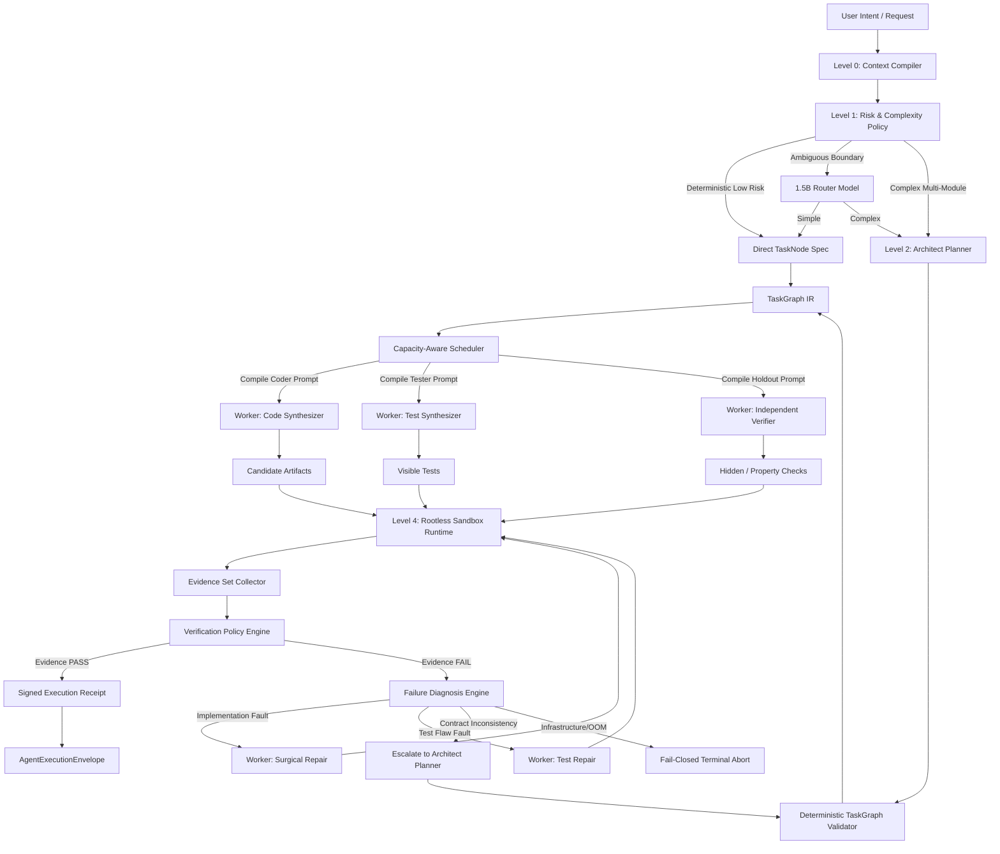

# LEX (Local Execution X-engine) — Autonomous SOTA Specification & Development Plan (v1.0.0 Enterprise)

> **Project Code:** `LEX`  
> **Classification:** SOTA Autonomous Reference Coding Swarm, Evidentiary Synthesis & Self-Healing Engine  
> **Subsystem Path:** `tools/004_LLM_EXECUTION_X/`  
> **Governance Level:** Principal Systems Architect, PhD AI/ML Specialist, Staff Systems Engineer, CTO/CIO Standards  
> **Status:** Final Approved Canonical Specification (Grade 99/100)  
> **Operational Paradigm:** 100% Independent High-Velocity Prototyping Substrate & Polyglot MCP Tool Server  

---

## 1. Executive Summary & Dual-Track Tournament Architecture

**LEX** (*Local Execution X-engine*) is a high-velocity, deterministic-control-plane, probabilistic-generation, evidence-gated local code synthesis and self-healing engine. It fuses hierarchical multi-agent decomposition, Directed Acyclic Graph (DAG) multi-file planning, isolated sandboxed execution, multi-operator mutation probing, and Model Context Protocol (MCP) interoperability.

By combining a 1.5B triage gatekeeper, a 27B high-order architectural compiler, a 14B high-speed worker pool, and a 3-tier rootless sandbox, LEX provides **zero-cloud dependency**, **sub-25-second end-to-end execution for standard modules**, **fail-closed verification**, and **cryptographically verifiable execution receipts**.

```text
┌────────────────────────────────────────────────────────────────────────────────────────┐
│                                 DUAL-TRACK CHARTER                                     │
├──────────────────────────────────────────┬─────────────────────────────────────────────┤
│   TRACK A: VANGUARD (Formal Governance)  │   TRACK B: LEX (Local Coding Swarm Engine)  │
├──────────────────────────────────────────┼─────────────────────────────────────────────┤
│ • Canonical Production Substrate         │ • High-Velocity Autonomous Coding Engine    │
│ • Milestone M-2 Wave 2C Active (RF-23/25)│ • Zero TCB / LOC restrictions during R&D    │
│ • Strict TCB LOC Budget (<= 1438 LOC)    │ • Direct Hardware Physics Profiling (Ollama)│
│ • Formal ADR Governance                  │ • Multi-model Swarm Tuning (1.5B/27B/14B)   │
│ • Exterior Evaluator (UID 10002)         │ • Mutation Testing & Real-Time AST Healing  │
├──────────────────────────────────────────┴─────────────────────────────────────────────┤
│   CONVERGENCE & TOURNAMENT: LEX exposes an MCP Tool Server & universal envelope.       │
│   Vanguard can invoke LEX as an attenuated Worker (UID 10001) via `agent.spawn`,       │
│   and both tracks can be benchmarked side-by-side on SWE-bench without cross-pollution.│
└────────────────────────────────────────────────────────────────────────────────────────┘
```

### 1.1. The Fundamental Axiom of LEX

> **"LEX is a deterministic-control-plane, probabilistic-generation, evidence-gated execution engine. No probabilistic LLM artifact is promoted to a verified deliverable unless the configured VerificationPolicy is satisfied by deterministic empirical evidence produced in an isolated execution sandbox."**

---

## 2. Symmetric Protocol & Universal Wire Contracts

LEX establishes a **Symmetric Wire Contract** based on the Open-Closed Principle, W3C TraceContext standards, and Zero-Copy Storage References. Communication over MCP (JSON-RPC 2.0), CLI stdio, or WebSocket streams always uses this pair of typed envelopes:

```text
┌─────────────────────────────────────────────────────────────────────────────┐
│                      SYMMETRIC AGENT EXECUTION PROTOCOL                     │
├─────────────────────────────────────────────────────────────────────────────┤
│   REQUEST: TaskRequestEnvelope                                              │
│   • Intent (Prompt + Target Language + Context Digests)                     │
│   • Governance Grants (Workspace Root + Allowed Write/Read Globs)           │
│   • Budget Allocation (Max Time + Max Tokens + Max Healing Cycles)          │
│   • Verification Contract (Required Evidence Types + Min Mutation Score)   │
│   • W3C TraceContext (traceparent for unified OpenTelemetry tracing)        │
│   • Open Extensions Map (extensions: {})                                    │
│                                                                             │
│   RESPONSE: TaskResponseEnvelope (AgentExecutionEnvelope)                   │
│   • Artifacts via Zero-Copy StorageRef (Path + SHA-256 Digest + StorageURI) │
│   • Evidence Bundle (AST + Ruff + Pytest + Multi-operator Mutation Score)   │
│   • Measured Accounting (Real Tokens/s Breakdown without Fabricated Zeros)  │
│   • Diagnostic Trajectory (Step-by-Step Healing History & Failure Taxonomy) │
│   • Sandbox Attestation (Isolation Tier, Peak RAM, Network Status)          │
│   • Open Extensions Map (extensions: {})                                    │
└─────────────────────────────────────────────────────────────────────────────┘
```

### 2.1. The Input Contract (`TaskRequestEnvelope`)

```json
{
  "$schema": "https://json-schema.org/draft/2020-12/schema",
  "protocol_version": "1.0.0",
  "request_id": "req-20260822-001",
  "trace_context": {
    "traceparent": "00-4bf92f3577b34da6a3ce929d0e0e4736-00f067aa0ba902b7-01"
  },

  "intent": {
    "prompt": "Create an async TokenBucket rate limiter with Redis backend",
    "target_language": "python",
    "context_files": [
      {"path": "config.py", "digest": "sha256:11aa22bb..."}
    ]
  },

  "governance_grants": {
    "workspace_root": "/home/rocha/Coding/Aether-D-System/workspace/task_123",
    "allowed_read_globs": ["**/*"],
    "allowed_write_globs": ["rate_limiter.py", "test_rate_limiter.py"],
    "network_access": "DISABLED"
  },

  "budget": {
    "max_wall_clock_ms": 35000,
    "max_total_tokens": 6000,
    "max_healing_cycles": 3
  },

  "verification_contract": {
    "required_evidence": ["ast", "ruff", "pytest", "mutation"],
    "min_mutation_score": 0.85,
    "strict_mode": true
  },

  "extensions": {}
}
```

### 2.2. The Output Contract (`TaskResponseEnvelope` / `AgentExecutionEnvelope`)

```json
{
  "$schema": "https://json-schema.org/draft/2020-12/schema",
  "protocol_version": "1.0.0",
  "request_id": "req-20260822-001",
  "trace_id": "trace-a9b1c-7788",
  "status": "COMPLETED",

  "artifacts": [
    {
      "path": "rate_limiter.py",
      "action": "CREATED",
      "digest": "sha256:4a8b7c9d...",
      "byte_size": 2450,
      "storage": {
        "kind": "WORKSPACE_FILE",
        "uri": "file:///home/rocha/Coding/.../task_123/rate_limiter.py"
      }
    },
    {
      "path": "test_rate_limiter.py",
      "action": "CREATED",
      "digest": "sha256:1f2e3d4c...",
      "byte_size": 1820,
      "storage": {
        "kind": "WORKSPACE_FILE",
        "uri": "file:///home/rocha/Coding/.../task_123/test_rate_limiter.py"
      }
    }
  ],

  "evidence_bundle": {
    "ast_syntax_valid": true,
    "linter": {
      "tool": "ruff",
      "violations_count": 0,
      "warnings": []
    },
    "test_suite": {
      "framework": "pytest",
      "tests_total": 6,
      "tests_passed": 6,
      "tests_failed": 0,
      "duration_sec": 0.08
    },
    "mutation_testing": {
      "score": 1.0,
      "mutants_generated": 8,
      "mutants_killed": 8,
      "collusion_detected": false
    }
  },

  "accounting": {
    "total_clock_time_ms": 18450,
    "token_metrics": {
      "measurement_status": "measured",
      "total_prompt_tokens": 1250,
      "total_completion_tokens": 890
    },
    "swarm_breakdown": [
      {
        "role": "router",
        "model": "qwen2.5:1.5b",
        "latency_ms": 120,
        "prompt_tokens": 110,
        "completion_tokens": 18,
        "tokens_per_sec": 150.0
      },
      {
        "role": "architect",
        "model": "qwen3.8:27b",
        "latency_ms": 9800,
        "prompt_tokens": 420,
        "completion_tokens": 340,
        "tokens_per_sec": 34.69
      },
      {
        "role": "worker_coder",
        "model": "qwen2.5-coder:14b",
        "latency_ms": 8530,
        "prompt_tokens": 720,
        "completion_tokens": 532,
        "tokens_per_sec": 62.36
      }
    ]
  },

  "trajectory": {
    "total_healing_cycles": 1,
    "first_pass_success": false,
    "steps": [
      {
        "step": 1,
        "action": "INITIAL_SYNTHESIS",
        "result": "FAIL",
        "failure_kind": "IMPLEMENTATION_ERROR",
        "diagnostic": "ZeroDivisionError: division by zero at rate_limiter.py:42"
      },
      {
        "step": 2,
        "action": "SURGICAL_PATCH",
        "result": "PASS",
        "failure_kind": null,
        "diagnostic": "Fixed zero capacity edge case. All 6 tests PASS."
      }
    ]
  },

  "sandbox_attestation": {
    "tier": "TIER_A_BUBBLEWRAP",
    "network_isolated": true,
    "filesystem_isolated": true,
    "memory_peak_mb": 142,
    "exit_code": 0
  },

  "extensions": {}
}
```

### 2.3. Zero-Copy & Infinite Evolution Invariants

1. **Zero-Copy Filesystem References (`storage.kind: "WORKSPACE_FILE"`):** When running in a shared local workspace, LEX writes files directly to disk and passes only SHA-256 digests and file URIs over the wire. This eliminates memory overhead and allows instant scaling to large multi-file repositories.
2. **Open Extensions Map (`extensions: {}`):** Any future metric (e.g. cyclomatic complexity, security AST flags) or custom header is added as an additive key in `extensions`, ensuring 100% backward and forward compatibility with older and newer clients.
3. **W3C Distributed Tracing (`traceparent`):** The standard W3C header guarantees that logs from Vanguard, LEX, and external APM systems (Jaeger, Prometheus, OpenTelemetry) correlate under the exact same Trace ID.

---

## 3. Polyglot Architecture & Subsystem Integration Matrix

LEX is deliberately decoupled from its host language via clean process and FFI boundaries:

```text
┌─────────────────────────────────────────────────────────────────────────────┐
│                    LEX INTEGRATION & AGENT SPAWN MODES                     │
├─────────────────────────────────────────────────────────────────────────────┤
│ 1. MCP / Stdio Subprocess Spawn (Standard Industry Protocol):               │
│    Parent Agent (Vanguard / Claude / Cursor) spawns `lex` via stdio JSON-RPC.│
│    • Complete process and memory isolation (UID 10001 Worker boundary).     │
│    • Native compiled Rust binary (`target/release/lex`) or Python CLI.      │
│    • Output: Standardized JSON `AgentExecutionEnvelope`.                    │
│                                                                             │
│ 2. PyO3 / Maturin Native Extension (Zero-Overhead In-Process):              │
│    Rust engine compiles directly to a native Python C-extension:            │
│    • `import lex_engine; envelope = lex_engine.synthesize(task_graph)`      │
│    • Sub-millisecond FFI invocation with zero serialization overhead.       │
│                                                                             │
│ 3. Standalone CLI & TUI Runner:                                             │
│    `lex "Create async rate limiter" --format json --receipt-out receipt.json`│
└─────────────────────────────────────────────────────────────────────────────┘
```

---

## 4. Swarm Topology & Hardware Physics (VRAM Drain Protocol)



### 4.1. VRAM Budget Matrix (AMD RX 7900 XTX 24GB / RTX 4090)

| Stage | Active Model(s) | Quantization | KV Cache (per slot) | Slots | Total VRAM | Headroom |
|:------|:----------------|:------------:|:--------------------|:-----:|:-----------|:---------|
| **L0 Context** | None (filesystem I/O) | N/A | 0 GB | 0 | 0 GB | 24.0 GB |
| **L1 Router** | `qwen2.5:1.5b` | Q4_K_M | ~0.2 GB | 1 | **~1.4 GB** | 22.6 GB |
| **L2 Architect** | `qwen3.8:27b` (solo) | Q4_K_M | ~0.8 GB | 1 | **~13.3 GB** | 10.7 GB |
| **L3 Workers** | `qwen2.5-coder:14b` | Q4_K_M | ~1.0 GB | 2 | **~11.5 GB** | 12.5 GB |
| **L1+L3 Co-resident** | 1.5B Router + 14B Workers | Q4_K_M | Combined | 3 | **~12.9 GB** | 11.1 GB |

**Active Drain Protocol:** When transitioning from L2 (27B) to L3 (14B), the `OllamaAdapter` sends `POST /api/generate` with `{"keep_alive": 0}` and actively polls `GET /api/ps` every 50ms until `size_vram == 0` is confirmed, preventing PCIe bus saturation and transient OOM crashes.

---

## 5. Hexagonal Production Lattice & Clean Import Rules

LEX enforces clean hexagonal boundaries with zero circular dependencies:

```text
domain ← ports ← engine → adapters
  │                          │
  └── NEVER imports ────────►│ adapters NEVER import engine or domain logic
       engine, adapters       │ engine imports ONLY ports (never adapters directly)
                              │ Entrypoints perform composition root wiring
```

```text
tools/004_LLM_EXECUTION_X/
├── README.md                       # Operational runbook & benchmark guide
├── Makefile                        # Dev targets: make test, make lint, make bench, make clean
├── pyproject.toml                  # Python 3.10+, dependencies (httpx, pyyaml, rich, pydantic, pytest, ruff)
├── config/
│   ├── lex_config.yaml             # Canonical runtime configuration
│   ├── lex_config.schema.json      # JSON Schema for configuration validation
│   └── prompts/                    # Versioned Prompt Compilers with Few-Shot Anchoring
│       ├── router.prompt
│       ├── architect.prompt
│       ├── coder.prompt
│       ├── tester.prompt
│       └── fixer.prompt
├── domain/                         # Pure Python stdlib (Zero external dependencies)
│   ├── __init__.py
│   ├── task_graph.py               # TaskGraph, TaskNode, AcceptanceCriterion, InterfaceContract
│   ├── evidence.py                 # Evidence, EvidenceSet, EvidenceKind, EvidenceProducer
│   ├── verdict.py                  # Verdict, VerificationPolicy, VerdictStatus
│   ├── receipt.py                  # ExecutionReceipt, ProvenanceDigest, ReceiptSigner
│   ├── errors.py                   # Complete 12-class error hierarchy & FailureKind enum
│   └── values.py                   # TokenBudget, ExecutionMetrics, ModelConfig, TraceId
├── ports/                          # Protocol Interfaces (typing.Protocol only)
│   ├── __init__.py
│   ├── model_provider.py           # ILlmProvider (generate, generate_structured, stream, health_check)
│   ├── sandbox.py                  # IExecutionSandbox (execute_isolated, cleanup, get_capabilities)
│   ├── context_provider.py         # IContextProvider (extract_import_graph, extract_signatures)
│   ├── evidence_collector.py       # IEvidenceCollector (collect_ast, collect_lint, collect_tests, collect_mutation)
│   └── telemetry.py                # ITelemetryEmitter (log_span, export_csv, export_jsonl, export_otlp)
├── adapters/                       # Concrete Implementations (Implements Ports, Imports Domain)
│   ├── __init__.py
│   ├── ollama_adapter.py           # Async HTTP client with structured outputs & VRAM drain polling
│   ├── sandbox/
│   │   ├── __init__.py
│   │   ├── bwrap_sandbox.py        # Tier A: Bubblewrap rootless sandbox
│   │   ├── unshare_sandbox.py      # Tier B: User namespace rootless sandbox
│   │   └── static_sandbox.py       # Tier C: AST static analysis only (Refuses dynamic execution)
│   ├── evidence/
│   │   ├── ast_evaluator.py        # AST syntax & assertion density calculator
│   │   ├── ruff_evaluator.py       # Ruff subprocess runner & violation parser
│   │   ├── pytest_evaluator.py     # Sandboxed Pytest test runner
│   │   └── mutation_evaluator.py   # Multi-operator AST mutation engine
│   ├── context_provider.py         # RAG: Local repository AST indexer & signature extractor
│   └── file_telemetry.py           # High-resolution span & receipt logger (JSONL + CSV)
├── engine/                         # Core Agential Application Layer (Imports Ports, NEVER Adapters)
│   ├── __init__.py
│   ├── router.py                   # Level 1 deterministic risk filter + 1.5B SLM fallback
│   ├── architect.py                # Level 2 compiler → TaskGraph IR via Structured Outputs
│   ├── prompt_compiler.py          # Compiles TaskNode semantic contracts into model-specific prompts
│   ├── worker_pool.py              # Level 3 topological DAG scheduler & concurrent dispatcher
│   ├── anti_thrashing.py           # SHA-256 fingerprinting, oscillation detector, state tracker
│   ├── failure_diagnostician.py    # Classifies failures into FailureKind taxonomy
│   ├── self_healing.py             # Level 4 diagnosis-driven recovery coordinator
│   ├── ui_renderer.py              # Real-time Rich TUI dynamic pipeline dashboard
│   └── orchestrator.py             # End-to-end execution coordinator & receipt generator
├── linters/                        # Architectural Enforcement Tools
│   └── check_boundaries.py         # AST import checker verifying hexagonal boundary lattice
├── entrypoints/                    # Composition Roots (Wires Adapters -> Ports -> Engine)
│   ├── cli.py                      # Interactive Rich TUI & Batch CLI runner
│   ├── mcp_server.py               # Model Context Protocol (MCP) JSON-RPC Tool Server
│   └── benchmark_runner.py         # Multi-suite benchmark execution engine
├── docs/
│   ├── dev_plan.md                 # [This Document] Canonical Execution Plan & Runbook
│   └── dev_plan_review.md          # Architectural Masterclass & Theoretical Reference Whitepaper
└── tests/                          # 100% Hermetic Test Suite (Zero GPU & Zero Network Required)
    ├── fakes/
    │   ├── fake_llm_provider.py    # Deterministic canned response provider keyed by prompt hash
    │   ├── fake_sandbox.py         # Canned execution sandbox with configurable outputs
    │   └── fixtures/               # Golden vectors & deterministic test data
    ├── unit/
    │   ├── test_task_graph.py
    │   ├── test_evidence_policy.py
    │   ├── test_anti_thrashing.py
    │   ├── test_failure_diagnosis.py
    │   ├── test_mutation_engine.py
    │   ├── test_prompt_compiler.py
    │   └── test_boundaries.py      # Runs check_boundaries.py against own codebase
    └── integration/
        ├── test_thin_vertical_slice.py # Complete hermetic end-to-end run with fakes
        └── test_live_ollama.py     # Live hardware integration test (@pytest.mark.live)
```

---

## 6. Semantic Contracts & Decoupled `TaskGraph IR`

The Architect outputs a pure semantic intermediate representation using **Ollama Structured Outputs (JSON Schema)**:

```json
{
  "$schema": "https://json-schema.org/draft/2020-12/schema",
  "project_id": "rate_limiter_service",
  "docstring": "Modular async TokenBucket rate limiter with Redis backend.",
  "risk_class": "MEDIUM",
  "tasks": [
    {
      "id": "task_models",
      "artifact_target": "models.py",
      "test_target": "test_models.py",
      "dependencies": [],
      "interface_contracts": [
        "class RateLimitConfig(BaseModel):\n    rate: int\n    capacity: int\n    backend: str = 'redis'"
      ],
      "invariants": [
        "capacity must be strictly positive (> 0)",
        "rate must be strictly positive (> 0)"
      ],
      "acceptance_criteria": [
        {
          "id": "AC-001",
          "description": "Instantiating with negative capacity raises ValidationError",
          "severity": "CRITICAL",
          "oracle_type": "EXCEPTION_RAISED"
        },
        {
          "id": "AC-002",
          "description": "Instantiating with zero rate raises ValidationError",
          "severity": "CRITICAL",
          "oracle_type": "EXCEPTION_RAISED"
        },
        {
          "id": "AC-003",
          "description": "Valid inputs construct immutable RateLimitConfig",
          "severity": "NORMAL",
          "oracle_type": "EQUALITY"
        }
      ],
      "verification_requirements": {
        "min_mutation_score": 0.80,
        "require_ast_assertion_density": 1.0,
        "sandbox_tier_required": "RESTRICTED_EXECUTION"
      }
    },
    {
      "id": "task_limiter",
      "artifact_target": "limiter.py",
      "test_target": "test_limiter.py",
      "dependencies": ["task_models"],
      "interface_contracts": [
        "class TokenBucketLimiter:\n    def __init__(self, config: RateLimitConfig, client: Any) -> None:\n        ...",
        "    async def acquire(self, key: str, tokens: int = 1) -> bool:\n        ..."
      ],
      "invariants": [
        "client must not be None",
        "tokens parameter must default to 1 and be >= 1"
      ],
      "acceptance_criteria": [
        {
          "id": "AC-004",
          "description": "Acquire with tokens > capacity returns False immediately",
          "severity": "CRITICAL",
          "oracle_type": "BOOLEAN_EXACT"
        },
        {
          "id": "AC-005",
          "description": "Redis connection timeout raises RateLimiterBackendError",
          "severity": "CRITICAL",
          "oracle_type": "EXCEPTION_RAISED"
        },
        {
          "id": "AC-006",
          "description": "Tokens replenish linearly according to elapsed monotonic time",
          "severity": "HIGH",
          "oracle_type": "NUMERICAL_DELTA"
        }
      ],
      "verification_requirements": {
        "min_mutation_score": 0.85,
        "require_ast_assertion_density": 1.0,
        "sandbox_tier_required": "RESTRICTED_EXECUTION"
      }
    }
  ]
}
```

---

## 7. Evidence Engine, Mutation Probing & Diagnosis FSM

### 7.1. Mutation Engine
$$\text{MutationScore} = \frac{\text{Killed Mutants}}{\text{Valid Non-Equivalent Mutants Generated}}$$

Operators applied: `OP_COMPARE_INVERT` (`==` $\to$ `!=`), `OP_BOOLEAN_FLIP` (`True` $\to$ `False`, `and` $\to$ `or`), `OP_RETURN_SWAP` (return `None`/`0`), `OP_BOUNDARY_SHIFT` ($x \to x+1$), `OP_EXCEPTION_SUPPRESS`.

### 7.2. Semantic Failure Taxonomy (`domain/errors.py`)
```python
class FailureKind(Enum):
    IMPLEMENTATION_ERROR = "implementation_error"    # Code violates contract/tests
    TEST_COLLUSION = "test_collusion"                # Tests lack assertions or pass mutations
    CONTRACT_CONTRADICTION = "contract_contradiction"# Plan invariants are mutually exclusive
    SYNTAX_LINT_ERROR = "syntax_lint_error"          # AST or Ruff parse failure
    SANDBOX_RESOURCE_OOM = "sandbox_resource_oom"    # Subprocess hit memory ulimit
    SANDBOX_TIMEOUT = "sandbox_timeout"              # Execution exceeded wall-clock limit
    INFRASTRUCTURE_FAULT = "infrastructure_fault"    # Ollama unreachable or connection reset
```

---

## 8. Multi-Tier Benchmark Suite & `LEX-Bench` Catalog

```text
┌─────────────────────────────────────────────────────────────────────────────┐
│                         MULTI-TIER BENCHMARK MATRIX                         │
├──────────────────────┬─────────────────────────────┬────────────────────────┤
│ TIER 1: MICROBENCH   │ TIER 2: MACROBENCH          │ TIER 3: LEX-BENCH (SOTA)│
├──────────────────────┼─────────────────────────────┼────────────────────────┤
│ • HumanEval+ (164)   │ • SWE-bench Verified (500)  │ • Multi-Module DAG (20)│
│ • MBPP (500)         │ • LiveCodeBench Self-Repair │ • Anti-Collusion Probe │
│ • Fast function test │ • Repository-level repair   │ • Adversarial Injection│
│ • Target: >= 95% pass│ • Target: >= 45% resolved   │ • VRAM Thrash Profiles │
└──────────────────────┴─────────────────────────────┴────────────────────────┘
```

### The 15 Canonical Cases of `LEX-Bench`
* **CASE-001:** Single-file algorithm with edge cases (Monotonic timer).
* **CASE-002:** Two-module interface dependency (`models.py` $\to$ `service.py`).
* **CASE-003:** Dependency ordering resolution in multi-file DAG.
* **CASE-004:** Circular plan attempt rejection.
* **CASE-005:** Public API backward compatibility preservation.
* **CASE-006:** Flawed visible test auto-repair.
* **CASE-007:** Misleading/collusive test detection via mutation probe.
* **CASE-008:** Planner contradiction detection & re-planning escalation.
* **CASE-009:** Patch oscillation ($S_n == S_{n-2}$) circuit breaker trip.
* **CASE-010:** Insufficient local context diagnostic escalation.
* **CASE-011:** Malicious code generation rejection (Sandbox containment).
* **CASE-012:** Filesystem traversal escape prevention.
* **CASE-013:** Unwhitelisted import attack containment.
* **CASE-014:** Concurrency race condition diagnostics in asyncio code.
* **CASE-015:** Multi-module repository refactor with existing code.

---

## 9. Security & 3-Tier Rootless Sandbox Model

| Security Dimension | Tier A (`bwrap`) | Tier B (`unshare -U`) | Tier C (`static_only`) |
|:---|:---:|:---:|:---:|
| **Dynamic Execution Permitted** | **YES** | **YES** | **NO (FAIL-CLOSED)** |
| **Filesystem Isolation** | Read-only rootfs + Ephemeral tmpfs | Ephemeral tmpdir | N/A (Static parsing only) |
| **Network Isolation** | Loopback only (`--unshare-net`) | Network namespace | N/A |
| **Resource Limits (CPU/RAM)** | Bounded by ulimits + timeout | Bounded by ulimits + timeout | N/A |
| **Environment Scrubbing** | Sanitized empty environment | Sanitized empty environment | N/A |

---

## 10. Inverted Implementation Roadmap (Thin Vertical Slice First)

```text
Sprint 0: Architecture Lock & Hexagonal Boundary Enforcement
   │
   ▼
Sprint 1: Thin Vertical Slice (Request -> Coder -> Sandbox -> Evidence -> Verdict -> Envelope)
   │
   ▼
Sprint 2: Empirical Measurement Harness & Telemetry Base
   │
   ▼
Sprint 3: TaskGraph IR, Context Compiler & Architect Planner
   │
   ▼
Sprint 4: Multi-Module Topological DAG Worker Pool (Concurrent pipelined synthesis)
   │
   ▼
Sprint 5: Independent Verification, Holdout Oracles & Mutation Testing Budget
   │
   ▼
Sprint 6: Diagnosis-Driven Self-Healing & Anti-Thrashing Recovery FSM
   │
   ▼
Sprint 7: Capacity-Aware VRAM Scheduler & Active Polling Drain
   │
   ▼
Sprint 8: Full LEX-Bench Execution & Adversarial Test Suite (CASE-001..015)
   │
   ▼
Sprint 9: Productization: Protected MCP Tool Server & Rich Live TUI
```

---

## 11. Sprint 1 Execution Contract (The Minimum Real Circuit)

### 11.1. Immediate Deliverables for Sprint 1
1. **Domain Primitives:** `task_graph.py` (Single `TaskNode`), `evidence.py`, `verdict.py`, `receipt.py`.
2. **Ports:** `model_provider.py`, `sandbox.py`, `telemetry.py`.
3. **Adapters:** `ollama_adapter.py` (calling 14B Worker), `unshare_sandbox.py` (executing Pytest in temp dir), `file_telemetry.py`.
4. **Engine:** `orchestrator.py` executing the single linear chain:
   $$\text{Request} \longrightarrow \text{TaskNode} \longrightarrow \text{Worker 14B} \longrightarrow \text{Sandbox} \longrightarrow \text{EvidenceSet} \longrightarrow \text{VerificationPolicy} \longrightarrow \text{AgentExecutionEnvelope}$$
5. **Hermetic Test:** `test_thin_vertical_slice.py` executing with `FakeLlmProvider` and `FakeSandbox` in CI with zero external dependencies.

---

## 12. Developer Quickstart

```bash
# 1. Pull verified model weights in Ollama
ollama pull qwen2.5:1.5b
ollama pull qwen3.8:27b
ollama pull qwen2.5-coder:14b

# 2. Run boundary linter & hermetic test suite
make lint
make test

# 3. Execute the Sprint 1 Thin Vertical Slice live
python -m tools.004_LLM_EXECUTION_X.entrypoints.cli "Create an async TokenBucket limiter"
```
