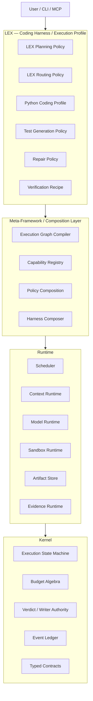
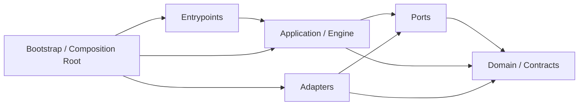
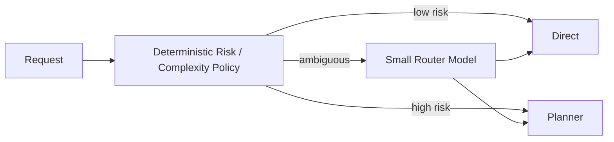
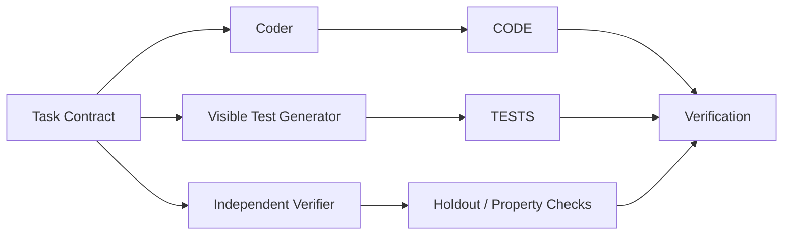
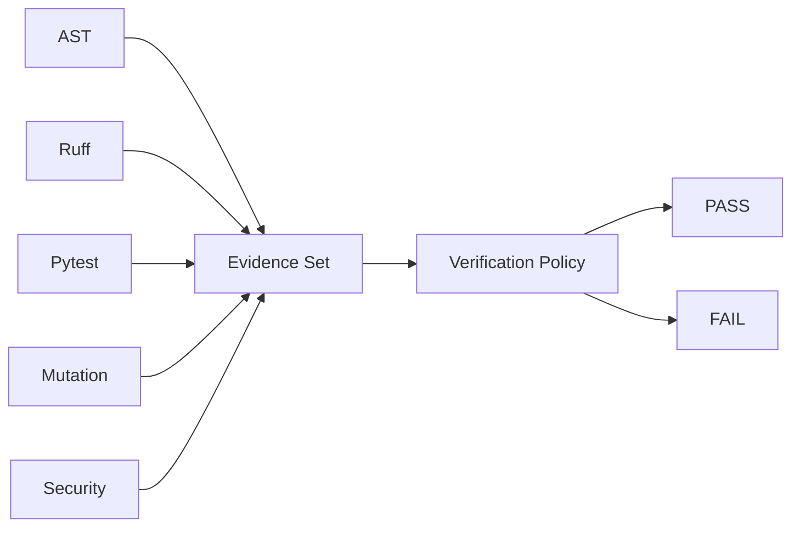
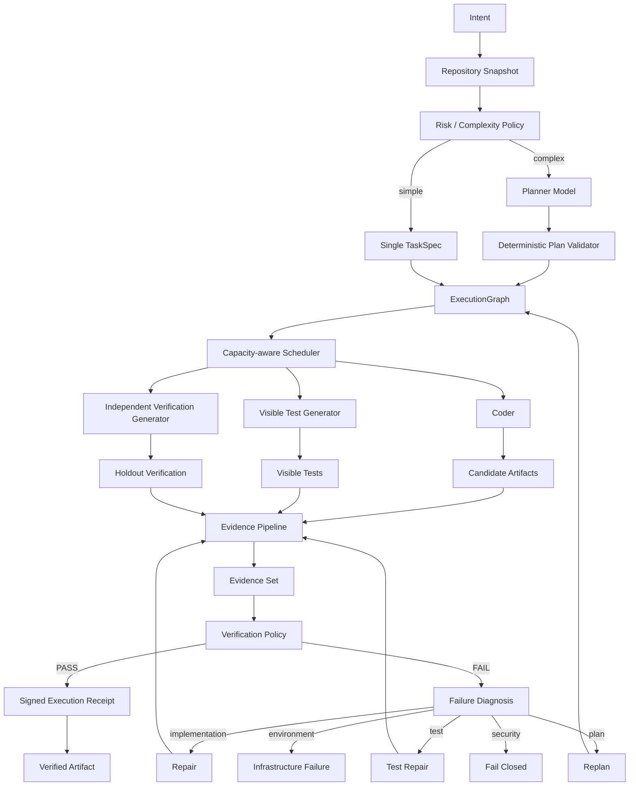

# Revisão executiva

**Eu não aprovaria o documento atual como “Final Approved — 99/100”.** Eu aprovaria como uma **arquitetura v0.8 forte, pronta para entrar em implementação após uma rodada curta de correções estruturais**.

O problema não é falta de sofisticação. O problema é o contrário: existem algumas abstrações excelentes misturadas com **claims impossíveis de garantir**, métricas que podem ser facilmente “gameadas”, detalhes de infraestrutura promovidos cedo demais a invariantes arquiteturais e, principalmente, **LEX está recriando partes do substrate/framework que deveriam existir abaixo dele**.

A melhoria mais importante é esta:

> **LEX não deveria ser “o framework”. LEX deveria ser um Harness/Execution Profile de referência construído sobre o Kernel + Runtime + Meta-Framework.**

Isso transforma LEX de um projeto isolado muito bom em **um laboratório real para validar a arquitetura maior**.

---

# 1. O que eu manteria e o que mudaria

| Área                            | Plano atual                              | Minha decisão                                                  |
| ------------------------------- | ---------------------------------------- | -------------------------------------------------------------- |
| Evidentiary execution           | Excelente conceito                       | **Manter e aprofundar**                                        |
| Fail-closed                     | Correto                                  | **Manter como invariant real**                                 |
| Zero-trust LLM output           | Correto                                  | **Manter**                                                     |
| DAG multi-file                  | Correto                                  | **Manter, mas generalizar o IR**                               |
| Planner → Coder/Tester → Verify | Boa composição inicial                   | **Manter como um Harness Strategy**                            |
| Self-healing FSM                | Boa base                                 | **Trocar retry loop por diagnosis/progress-driven recovery**   |
| Mutation testing                | Muito bom                                | **Substituir 1-mutant sanity check por mutation budget/score** |
| Hexagonal architecture          | Direção correta                          | **Corrigir dependências e composition root**                   |
| 1.5B Router                     | Provavelmente desnecessário no fast path | **Policy determinística primeiro; LLM fallback**               |
| Qwen models hardcoded           | Bom perfil experimental                  | **Não tornar parte da arquitetura**                            |
| VRAM matrix fixa                | Útil como benchmark snapshot             | **Não como invariant**                                         |
| Sandbox 3-tier                  | Tier A válido; Tier C perigoso           | **Tier C não pode executar código**                            |
| “zero hallucination”            | Não demonstrável                         | **Remover**                                                    |
| “100% safety”                   | Não demonstrável                         | **Remover**                                                    |
| “provable safety”               | Não demonstrável com essa arquitetura    | **Trocar por bounded/evidenced execution**                     |
| “cryptographic telemetry proof” | Conceito interessante                    | **Transformar em signed Execution Receipt / provenance**       |
| HumanEval + MBPP                | Insuficiente para Agentic Coding         | **Manter apenas como microbench**                              |
| MCP                             | Correto                                  | **Adapter externo, jamais core architectural primitive**       |
| TUI                             | Útil                                     | **Atrasar; não Phase-critical**                                |
| Validation plugins              | Perigoso se plugin decide PASS           | **Plugin produz Evidence; Kernel decide Verdict**              |

---

# 2. A mudança arquitetural mais importante

Hoje o LEX contém:

```text
domain/
ports/
adapters/
engine/
orchestrator
sandbox
context
telemetry
model provider
execution state
```

Isso significa que o LEX estava tentando construir um ecossistema monolítico acoplado em vez de se estruturar como um **Harness de Execução e Síntese de Código modular e independente**, cujas camadas internas (Domain, TaskGraph IR, Evidence Pipeline, Verification Authority) possam operar 100% autônomas hoje e, opcionalmente, plugar em qualquer meta-framework ou substrate maior no futuro.

Eu mudaria para:



A consequência é importante:

**LEX passa a operar como um Harness autônomo com separação de camadas limpa, pronto para ser executado de forma independente ou integrado a qualquer meta-framework.**

Isso permite depois criar:

```text
CodingHarness
ResearchHarness
DataAnalysisHarness
ScientificHarness
BrowserHarness
SecurityReviewHarness
MetaHarness
```

todos usando o mesmo:

```text
ExecutionGraph
TaskNode
Evidence
Artifact
Budget
Failure
Verdict
ExecutionReceipt
ModelRuntime
SandboxRuntime
ContextRuntime
Scheduler
```

Isso é muito mais próximo da generalização arquitetural que vocês estão buscando.

---

# 3. O `DAGPlanSchema` deveria virar um IR, não um prompt container

Aqui existe uma limitação estrutural importante.

Atualmente:

```json
{
  "coder_prompt": "...",
  "tester_prompt": "...",
  "edge_cases": [...]
}
```

Isso acopla:

```text
Planning
    ↓
Prompt engineering
    ↓
Model implementation
```

Eu não faria isso.

O Architect deveria produzir **semântica**, não prompts.

Algo conceitualmente assim:

```text
TaskGraph
└── TaskNode
    ├── id
    ├── artifact_targets[]
    ├── read_set[]
    ├── write_set[]
    ├── dependencies[]
    ├── interface_contracts[]
    ├── requirements[]
    ├── acceptance_criteria[]
    ├── invariants[]
    ├── forbidden_behaviors[]
    ├── verification_requirements[]
    ├── context_refs[]
    ├── risk_class
    └── budget
```

Depois:

```text
TaskNode
   ↓
PromptCompiler<CoderProfile>
   ↓
Coder prompt

TaskNode
   ↓
PromptCompiler<TestProfile>
   ↓
Tester prompt
```

A partir disso você pode trocar:

```text
Qwen
DeepSeek
Llama
GPT
Claude
local SLM
future model
```

sem alterar o `PlanIR`.

E pode trocar:

```text
Python → Rust → Go → TypeScript
```

sem alterar o Kernel.

---

# 4. “Domain Blindness” hoje não é verdade

O documento afirma que o core é domain-blind, mas o contrato conhece:

```text
.py
pytest
Pydantic
AST
Ruff
module_name
test_name
Python signatures
```

Portanto ele é um **Python coding engine**, não um domain-blind execution engine.

Não existe problema algum em LEX v1 ser Python-first.

O problema seria chamar essas abstrações de universais.

Eu separaria:

```text
Generic substrate
────────────────────
Artifact
Task
ExecutionGraph
Evidence
VerificationClaim
Failure
Verdict
Budget

Coding domain
────────────────────
SourceFile
InterfaceContract
TestArtifact
Patch

Python profile
────────────────────
PythonModule
PythonASTEvidence
RuffEvidence
PytestEvidence
PythonMutationEvidence
```

Então a generalização futura deixa de exigir refactoring do núcleo.

---

# 5. Corrija a arquitetura hexagonal

Este trecho atual tem uma inconsistência:

> adapters NEVER import engine or domain

Um adapter normalmente **precisa implementar ports e consumir os contracts correspondentes**.

Eu usaria:



Invariantes:

```text
domain     → stdlib only
ports      → domain
application→ domain + ports
adapters   → ports + domain
application NEVER → adapters
domain NEVER → application/adapters
bootstrap  → knows everything
```

E eu **não colocaria o único composition root em `cli.py`**.

Porque depois haverá:

```text
CLI
MCP server
Python SDK
benchmark runner
test harness
daemon
possibly HTTP service
```

Melhor:

```text
bootstrap.py
entrypoints/
    cli.py
    mcp.py
    benchmark.py
```

---

# 6. O Router 1.5B não deveria ser obrigatório

A ideia:

```text
Request
→ 1.5B
→ decide direct/planner
```

é elegante, mas provavelmente adiciona mais custo e complexidade do que valor para vários requests.

Além disso:

> O(1) heuristic complexity triage

não é correto para uma inferência Transformer; custo depende do tamanho do contexto e geração.

Eu faria:



O classifier determinístico pode considerar:

```text
estimated files
existing repository?
public API changes?
dependency changes?
database?
concurrency?
security-sensitive?
multi-language?
requested tests?
cross-module changes?
ambiguity score?
```

Assim o SLM fica reservado para casos em que realmente agrega informação.

---

# 7. Use Structured Outputs reais no Architect

Hoje o prompt tenta forçar JSON com:

> ONLY output raw JSON.

Isso já não deveria ser o mecanismo primário.

Ollama suporta **JSON Schema diretamente no campo `format`**, inclusive reutilizando schemas Pydantic. ([Ollama][1])

Então:

```text
Architect
    ↓
ModelProvider.generate_structured(
    schema=ExecutionPlan.model_json_schema()
)
    ↓
Pydantic validation
    ↓
semantic plan validation
```

Em vez de:

```text
Prompt harder
→ hope for JSON
→ parse
→ repair malformed JSON
```

O prompt continua útil semanticamente, mas o transport deve fazer o enforcement estrutural.

---

# 8. “Exactly 3 edge cases” precisa sair

Esta regra:

> exactly 3 falsifiable edge_cases

é ótima para demonstração.

É ruim como arquitetura.

O sistema vai começar a otimizar para “produzir três coisas”.

Um:

```text
CSV parser
```

e um:

```text
distributed transaction coordinator
```

não deveriam ter exatamente três riscos.

Eu substituiria por:

```text
AcceptanceCriterion {
    id
    description
    oracle_type
    severity
    evidence_required
}
```

E algo como:

```text
risk_class=LOW
→ minimum evidence budget

risk_class=HIGH
→ larger verification budget
```

Não número fixo.

---

# 9. O anti-collusion atual é muito mais fraco do que parece

Existe um bug conceitual no exemplo:

```python
asserts = [
    node
    for node in ast.walk(func)
    if isinstance(node, (ast.Assert, ast.Call))
]
```

Isso considera **qualquer chamada de função uma assertion**.

Este teste:

```python
def test_something():
    foo()
```

passaria no auditor.

Além disso:

```text
assertion count > 0
```

não mede qualidade do oracle.

Você pode ter:

```python
assert True
```

e satisfazer o gate.

### Melhor arquitetura

Separe três níveis:

```text
A. Structural test analysis
B. Behavioral mutation analysis
C. Independent verification oracle
```

Especialmente C.

O problema de Coder e Tester receberem a mesma especificação de um mesmo Architect é que existe uma origem comum de erro.

Eu introduziria:



O Fixer não deveria necessariamente receber o conteúdo integral dos hidden verification checks.

Ele recebe:

```text
claim violated
error category
relevant diagnostic
counterexample if policy permits
```

Isso reduz test-overfitting.

---

# 10. Mutation testing deve virar um orçamento

Hoje:

```text
mutate first Compare
or flip True/False
```

é um bom **sanity test**.

Não sustenta:

> Mutation score 100%

Eu faria:

```text
MutationBudget
├── comparison flips
├── boolean inversion
├── boundary shifts
├── arithmetic replacement
├── return replacement
├── condition removal
└── exception removal
```

e:

```text
mutation_score =
killed_mutants / valid_mutants
```

Com orçamento variável:

```text
fast profile     → 1–3 mutants
standard profile → 5–20
strict profile   → full/sample mutation campaign
```

Assim você troca uma falsa garantia binária por um sinal quantitativo.

---

# 11. O Self-Healing precisa de um `Diagnosis Layer`

Hoje:

```text
FAIL
→ fingerprint
→ fixer
→ retry
```

é bom, mas ainda é essencialmente um retry loop sofisticado.

Para o sistema evoluir para meta-cognição depois, eu colocaria agora um contrato explícito de diagnóstico:

```text
Failure
    ↓
Diagnosis
    ↓
RepairHypothesis
    ↓
Action
    ↓
Evidence
    ↓
ProgressEvaluation
```

Algo como:

```text
Diagnosis {
    failure_kind
    suspected_layer
    affected_claims
    confidence
    retryability
    suggested_action_class
}
```

Porque existem falhas fundamentalmente diferentes:

```text
implementation fault
test fault
planner fault
contract contradiction
dependency fault
environment fault
sandbox fault
model output fault
context insufficiency
resource exhaustion
```

Você não deveria rearchitectar porque o mesmo traceback apareceu duas vezes.

Você deveria rearchitectar quando:

```text
diagnosis = PLAN_FAULT
or
CONTRACT_INCONSISTENCY
or
INTERFACE_GRAPH_INVALID
or
non_progress persisted after implementation repair
```

---

# 12. Anti-thrashing deve medir estado, não apenas traceback

Use:

```text
FailureFingerprint =
hash(
    validation_stage,
    exception_class,
    failing_claim,
    failing_test,
    normalized_stack,
    assertion_signature,
    relevant_source_span
)
```

Mas também:

```text
RepairState =
hash(
    artifact hashes,
    failing claims,
    test results,
    planner revision
)
```

Aí detecta:

```text
A → B → A → B
```

mesmo quando o traceback muda ligeiramente.

E mede **progresso**:

```text
failed tests:       5 → 3 → 1
lint errors:       12 → 2 → 0
mutation score:   .55 → .72 → .91
```

Nesse cenário você não quer circuit-break.

Já:

```text
5 → 5 → 5
same semantic failure
different useless patches
```

é non-progress.

---

# 13. A maior falha de segurança está no Tier C

Este é um blocker real.

O documento diz:

```text
Fail Closed
```

mas depois permite:

```text
Tier C:
Python in-process
AST filter
socket monkeypatch
```

Essas duas coisas se contradizem.

**Código LLM não confiável jamais deveria executar in-process no orchestrator.**

Monkeypatch de:

```python
socket.socket = None
```

não constitui boundary de segurança.

O fallback correto seria:

```text
Tier A → SECURE_EXECUTION
Tier B → RESTRICTED_EXECUTION
Tier C → STATIC_ONLY / EXECUTION_UNAVAILABLE
```

e não:

```text
Tier C → execute anyway
```

Isso finalmente torna `fail-closed` verdadeiro.

Bubblewrap também não oferece automaticamente uma política de segurança completa; os próprios mantenedores deixam claro que ele é um toolkit e que a segurança depende da política/configuração passada pelo caller. Eles destacam inclusive cuidados adicionais como namespaces, mounts, `--new-session`/seccomp e recursos expostos ao sandbox. ([GitHub][2])

---

# 14. O Tier B também não está isolando o filesystem suficientemente

Isto:

```bash
unshare -U -n -r --mount-proc pytest
```

não equivale a um filesystem sandbox completo.

Eu criaria um contrato:

```text
SandboxCapabilities {
    filesystem_isolated
    network_isolated
    pid_isolated
    user_isolated
    syscall_filtered
    resource_bounded
    env_scrubbed
}
```

E o Verification Policy exigiria:

```text
SECURITY_PROFILE_STRICT:
filesystem_isolated = true
network_isolated = true
...
```

Não basta saber:

```text
backend == "unshare"
```

O importante são as **capabilities efetivamente verificadas**.

---

# 15. Não use `preexec_fn` nesse worker pool

O plano menciona:

```text
preexec_fn
```

para configurar resource limits.

Mas você também está construindo execução assíncrona/concorrente.

A documentação atual do Python explicitamente alerta que `preexec_fn` **não é seguro na presença de threads e pode deadlockar antes do exec**. ([Python documentation][3])

Eu usaria:

```text
launcher process
+ RLIMITs
+ cgroups/systemd user scope where available
+ wall-clock timeout
```

sem executar Python arbitrário dentro de `preexec_fn`.

---

# 16. “Signed telemetry proof” deveria virar `ExecutionReceipt`

Esse conceito pode ficar muito melhor.

Não assine apenas:

```text
"pytest passed"
```

Assine a **proveniência completa**.

Por exemplo:

```text
ExecutionReceipt
├── trace_id
├── input_request_digest
├── source_tree_digest
├── plan_digest
├── prompt_bundle_digest
├── model_digest
├── quantization
├── runtime_version
├── toolchain_lock_digest
├── sandbox_profile
├── artifact_digests[]
├── evidence_digests[]
├── verification_policy_version
├── final_verdict
└── signature
```

Isso aproxima o LEX de padrões de provenance de software. SLSA trata provenance justamente como informação verificável sobre **como, onde e a partir de quais inputs um artifact foi produzido**, incluindo digests de inputs/dependências e identidade do builder. ([GitHub][4])

Você pode assinar o receipt localmente; ferramentas como Cosign também suportam assinatura/verificação de blobs. ([Sigstore][5])

Mas eu chamaria de:

> **signed execution attestation**

ou:

> **execution receipt**

Não “proof of correctness”.

É uma prova de que **um processo declarado ocorreu**, não uma prova matemática de que o programa está correto.

---

# 17. Separe `Evidence` de `Verdict`

Isso é particularmente importante para a arquitetura maior.

Hoje:

```python
IValidationStage.validate() -> ValidationResult
```

pode facilmente virar:

```text
plugins decide what is valid
```

Eu faria:

```python
EvidenceProducer.produce(...) -> Evidence
```

Exemplos:

```text
RuffEvidence
ASTEvidence
PytestEvidence
MutationEvidence
TypeCheckEvidence
SecurityScanEvidence
```

Depois existe **uma única autoridade**:

```text
VerificationPolicy
    ↓
Verdict
```

Ou seja:



Isso impede que um validator/plugin adquira autoridade semântica sobre o sistema.

É um detalhe pequeno no código e enorme arquiteturalmente.

---

# 18. O modelo não pode ser parte da arquitetura

`Qwen3.8-27B` existe oficialmente no catálogo Qwen/Hugging Face atualmente. ([Hugging Face][6])

Mas eu **não encontrei neste momento um first-party `qwen3.8:27b` no catálogo oficial Ollama**; o catálogo first-party indexado mostra atualmente Qwen 3.5, 3.6, Qwen3-Coder etc. ([Ollama][7])

Portanto esta linha:

```bash
ollama pull qwen3.8:27b
```

não deveria estar em uma spec arquitetural antes de um preflight de disponibilidade.

Faça:

```yaml
model_profiles:

  quality:
    planner: ...
    coder: ...

  balanced:
    planner: ...
    coder: ...

  latency:
    planner: ...
    coder: ...
```

E uma capability:

```text
ModelCapabilities
├── structured_output
├── context_length
├── tool_calling
├── thinking
├── max_parallel
├── estimated_vram
├── quantization
└── runtime
```

---

# 19. O Qwen2.5-Coder 14B ainda é uma boa baseline — não necessariamente o endpoint

Ollama informa aproximadamente **9 GB** para `qwen2.5-coder:14b` Q4_K_M. ([Ollama][8])

Já `qwen3-coder:30b` Q4 está por volta de **19 GB**, com 30.5B parâmetros totais e arquitetura MoE de aproximadamente 3.3B ativos. ([Ollama][9])

Então eu teria pelo menos:

```text
LEX-small
  worker = 14B

LEX-quality
  worker = Qwen3-Coder 30B-A3B

LEX-experimental
  planner/worker candidate matrix
```

E **deixaria o Meta-Harness descobrir qual composição ganha**.

Esse é exatamente o tipo de decisão que não deveria ser congelada na arquitetura.

---

# 20. A tabela de VRAM deve virar um resultado experimental

Este trecho:

```text
13.3 GB architect
11.5 GB workers
12.9 GB co-resident
```

não deveria ser `Invariant`.

Ollama confirma que `OLLAMA_MAX_LOADED_MODELS` e `OLLAMA_NUM_PARALLEL` controlam concorrência, mas também documenta que o consumo cresce com o paralelismo e com o context length. ([Ollama][10])

Logo:

```text
VRAM =
weights
+ KV(model, context, parallelism)
+ runtime overhead
+ backend/device overhead
```

Faça o Scheduler usar:

```text
CapacityProfile
```

medido/calibrado.

O `/api/ps` de fato expõe `size_vram`, então o drain probe é uma boa ideia. ([Ollama][11])

E `keep_alive: 0` realmente pode ser usado para descarregar imediatamente o modelo. ([Ollama][12])

Portanto essa parte do design é tecnicamente válida — só precisa deixar de ser hardcoded como verdade universal.

---

# 21. Existe uma inconsistência matemática no exemplo de latência

O TUI mostra:

```text
Coder:
410 tokens
27.8 tokens/s
7.40 s
```

Mas:

```text
410 / 27.8 ≈ 14.75 s
```

E:

```text
Tester:
380 / 28.1 ≈ 13.52 s
```

Mesmo rodando os dois em paralelo:

```text
worker wall time ≈ 14.75 s
```

Somando somente:

```text
Architect = 18.20 s
Workers   = 14.75 s
───────────────────
           32.95 s
```

Logo:

```text
Total Clock Time: 21.45s
```

é impossível com os próprios números mostrados.

Isso é importante porque revela que:

> **latency SLO não pode estar na especificação como conclusão antes de existir benchmark.**

---

# 22. Eu mudaria os SLOs para workload classes

Em vez de:

```text
everything <20 s
```

algo como:

| Class             | Exemplo                    |        Objetivo inicial |
| ----------------- | -------------------------- | ----------------------: |
| **L0 Direct**     | função/single-file pequena |       warm P50 < 15–20s |
| **L1 Structured** | 2–4 módulos                |          warm P50 < 45s |
| **L2 Repository** | mudança multi-file real    |              P50 < 120s |
| **L3 Repair**     | 1 repair iteration         |    incremental < 20–30s |
| **Cold start**    | model load included        | reportado separadamente |

Depois o benchmark determina números reais.

Não o contrário.

---

# 23. HumanEval não deve ser o principal benchmark

HumanEval/MBPP podem continuar como microbenchmarks.

Mas LEX está afirmando ser:

> multi-file, repository-aware, agentic, self-healing engine.

Então seu benchmark principal precisa testar isso.

SWE-bench Verified possui 500 tarefas human-validated de problemas reais de software e explicitamente compara sistemas agentic/RAG/multi-rollout. ([SWE-bench][13])

LiveCodeBench também testa, além de geração, **self-repair e execução**, e foi construído com preocupação explícita em contaminação temporal; o próprio projeto mostra que bons resultados no HumanEval podem não transferir. ([LiveCodeBench][14])

Aider Polyglot adiciona 225 problemas em C++, Go, Java, JavaScript, Python e Rust e mede também capacidade de edição. ([Aider][15])

Minha matriz seria:

| Layer               | Benchmark                     |
| ------------------- | ----------------------------- |
| Function synthesis  | HumanEval+/MBPP/LiveCodeBench |
| Self-repair         | LiveCodeBench Self Repair     |
| Complex instruction | BigCodeBench/Hard             |
| Repository repair   | **SWE-bench Verified**        |
| Editing fidelity    | Aider Polyglot                |
| Architecture/DAG    | **LEX-Bench próprio**         |
| Sandbox             | **LEX-Adversarial**           |
| Self-healing        | **LEX-Recovery Bench**        |
| Performance         | **LEX Runtime Bench**         |

---

# 24. O benchmark mais importante será o próprio `LEX-Bench`

Essa é uma oportunidade estratégica.

Crie cases como:

```text
CASE-001 single-file function
CASE-002 two-module interface
CASE-003 dependency ordering
CASE-004 circular plan attempt
CASE-005 API compatibility
CASE-006 broken tests
CASE-007 misleading test
CASE-008 planner contradiction
CASE-009 repair oscillation
CASE-010 insufficient context
CASE-011 malicious generated code
CASE-012 path escape
CASE-013 import attack
CASE-014 concurrency bug
CASE-015 multi-module refactor
...
```

Cada case tem:

```text
input
workspace snapshot
expected claims
hidden verification
budget
acceptable outputs
metrics
```

Esse será mais importante para evolução do Meta-Framework do que perseguir HumanEval 95%.

---

# 25. MCP precisa ser atualizado conceitualmente

A especificação MCP atual de **28 de julho de 2026** mudou substancialmente: o core passou a ser stateless, existem mudanças em routing, caching, authorization e extensions. ([Model Context Protocol Blog][16])

Portanto eu não colocaria simplesmente:

```text
MCP server/client
```

como uma feature genérica.

Criaria:

```text
McpAdapter
├── protocol_version
├── capability negotiation
├── transport
├── authorization profile
└── workspace capability
```

Especialmente este parâmetro:

```json
"target_dir": "..."
```

precisa ser protegido.

O caller não deveria conseguir escrever arbitrariamente em:

```text
/etc/
/home/user/.ssh/
repo-outside-workspace/
```

Melhor:

```text
WorkspaceCapability {
    root
    allowed_read_paths
    allowed_write_paths
}
```

A especificação MCP também exige validação de inputs, controles de acesso, rate limiting e sanitização de outputs para tools. ([Model Context Protocol][17])

---

# 26. Eu mudaria a promessa fundamental do projeto

Hoje:

> deterministic
> zero hallucination
> 100% safety
> provable safety

Eu escreveria conceitualmente:

> **LEX is a deterministic-control-plane, probabilistic-generation, evidence-gated execution engine. No probabilistic artifact is promoted to a verified deliverable unless the configured verification policy is satisfied.**

Isso é muito mais rigoroso.

Porque:

```text
LLM inference = probabilistic component

Scheduler = deterministic
FSM = deterministic
Budgets = deterministic
Verification policy = deterministic
Evidence collection = deterministic/replayable where possible
Artifact promotion = deterministic
```

Essa distinção é excelente para toda a tese do projeto.

---

# 27. Arquitetura que eu considero mais próxima do alvo final



Isso já é praticamente a ponte entre:

```text
Harness
→ Meta-Harness
→ Meta-Cognition
→ Self-improvement
```

porque o sistema começa a produzir explicitamente:

```text
state
decision
hypothesis
action
evidence
outcome
cost
```

que depois são os dados necessários para aprender políticas melhores.

---

# 28. Eu também inverteria o roadmap

O roadmap atual constrói muita infraestrutura antes de ter uma vertical slice real.

Minha sequência seria:

| Sprint                           | Objetivo                                                 | Resultado obrigatório                                                           |
| -------------------------------- | -------------------------------------------------------- | ------------------------------------------------------------------------------- |
| **0 — Architecture Lock**        | corrigir contracts/boundaries                            | `ExecutionGraph`, `Evidence`, `Failure`, `Verdict`, `Receipt`, capability model |
| **1 — Thin Vertical Slice**      | request → coder → secure sandbox → evidence → verdict    | um único arquivo funcionando end-to-end                                         |
| **2 — Measurement Harness**      | benchmark + replay + telemetry                           | medir baseline antes de otimizar                                                |
| **3 — Context + PlanIR**         | repo context + planner + graph validator                 | multi-file deterministic graph                                                  |
| **4 — Parallel Execution**       | ready-set scheduler + writer locks + capacity            | parallel DAG execution                                                          |
| **5 — Independent Verification** | tests + hidden checks + mutation budget                  | strong evidence model                                                           |
| **6 — Recovery Runtime**         | Diagnosis → Repair → Progress → Escalation               | bounded self-healing                                                            |
| **7 — Runtime Optimization**     | model profiles + VRAM scheduler + warm/cold optimization | measured latency profiles                                                       |
| **8 — LEX-Bench**                | multi-file/adversarial/recovery suite                    | quality surface real                                                            |
| **9 — MCP / TUI**                | external interfaces                                      | productization                                                                  |
| **10 — Meta-Harness**            | automatic comparison of policies/models/topologies       | experimental optimization loop                                                  |

O benchmark nasce no Sprint 2, não no final.

---

# 29. Isso também melhora diretamente a futura Meta-Cognição

O LEX atual armazena principalmente:

```text
prompt
output
error
retry
```

O LEX melhorado armazenaria:

```text
Intent
Context Snapshot
Plan
Decision
Action
Evidence
Failure
Diagnosis
Hypothesis
Repair
Progress
Verdict
Cost
Latency
Outcome
```

Agora você tem uma trajectory semanticamente rica.

E futuramente pode avaliar:

```text
Which routing policy worked?
Which planner produced fewer revisions?
Which model produced better first-pass code?
Which repair hypothesis reduced failures?
Which context strategy improved quality/token?
Which verifier detected more real faults?
Which mutation operators were informative?
When was replanning worth its cost?
```

Esse é o material necessário para **self-improvement baseado em evidência**, em vez de self-improvement baseado em “LLM introspection”.

---

# 30. Minha classificação depois da revisão

Eu classificaria assim:

| Dimensão                       | Plano atual | Após alterações |
| ------------------------------ | ----------: | --------------: |
| Architectural cleanliness      |         8.5 |         **9.7** |
| Modularity                     |         8.5 |         **9.8** |
| Generalizability               |         7.5 |         **9.8** |
| Verification design            |         8.5 |         **9.6** |
| Security correctness           |         6.5 |         **9.2** |
| Runtime engineering            |         8.5 |         **9.4** |
| Benchmark validity             |         6.5 |         **9.6** |
| Self-healing                   |         8.0 |         **9.5** |
| Future meta-learning readiness |         7.0 |         **9.8** |
| Claims/scientific rigor        |         6.0 |         **9.8** |

Não porque faltam features.

Porque as alterações eliminam **overclaims e false abstractions**.

---

# Minha recomendação final

**Não implemente a SPEC exatamente como está.**

Faça uma revisão curta `LEX SPEC v1.1` com cinco mudanças não negociáveis:

1. **LEX vira um Coding Harness independente com ontologia limpa, e não um monólito acoplado.**
2. **`DAGPlanSchema` vira generic `ExecutionGraph/TaskSpec IR`; prompts saem do contrato.**
3. **Validators produzem `Evidence`; apenas uma `VerificationPolicy` produz `Verdict`.**
4. **Tier C deixa de executar código; fail-closed passa a ser verdadeiro.**
5. **Benchmarks e claims deixam de ser metas inventadas e passam a ser resultados medidos pelo Meta-Harness.**

Depois disso, eu começaria imediatamente pelo menor circuito real:

```text
Request
   ↓
TaskSpec
   ↓
Coder
   ↓
Artifact
   ↓
Secure Sandbox
   ↓
Evidence
   ↓
VerificationPolicy
   ↓
ExecutionReceipt
```

**Esse vertical slice deveria ser o primeiro código do LEX.**

Só depois:

```text
Context
→ Planner
→ DAG
→ parallel workers
→ independent verifier
→ diagnosis
→ repair
→ replanning
→ MCP
→ Meta-Harness
```

Essa ordem reduz brutalmente o risco de vocês construírem muita arquitetura antes de descobrirem quais abstrações realmente sobrevivem ao contato com execução real.

[1]: https://docs.ollama.com/capabilities/structured-outputs?utm_source=chatgpt.com "Structured Outputs - Ollama"
[2]: https://github.com/containers/bubblewrap/security?utm_source=chatgpt.com "Overview · containers/bubblewrap · GitHub"
[3]: https://docs.python.org/3/library/subprocess.html?highlight=universal_newlines&utm_source=chatgpt.com "subprocess — Subprocess management — Python 3.14.6 documentation"
[4]: https://github.com/slsa-framework/slsa/blob/main/spec/build-provenance.md?utm_source=chatgpt.com "slsa/spec/build-provenance.md at main · slsa-framework/slsa · GitHub"
[5]: https://docs.sigstore.dev/cosign/signing/signing_with_blobs/?utm_source=chatgpt.com "Signing Blobs - Sigstore"
[6]: https://huggingface.co/Qwen/models?utm_source=chatgpt.com "Qwen (Qwen)"
[7]: https://ollama.com/search?q=qwen3&utm_source=chatgpt.com "qwen3 · Ollama"
[8]: https://ollama.com/library/qwen2.5-coder?utm_source=chatgpt.com "qwen2.5-coder"
[9]: https://ollama.com/library/qwen3-coder?utm_source=chatgpt.com "qwen3-coder"
[10]: https://docs.ollama.com/faq "FAQ - Ollama"
[11]: https://docs.ollama.com/api/ps?utm_source=chatgpt.com "List running models - Ollama"
[12]: https://docs.ollama.com/faq?utm_source=chatgpt.com "FAQ - Ollama"
[13]: https://www.swebench.com/verified.html?utm_source=chatgpt.com "SWE-bench Verified"
[14]: https://livecodebench.github.io/?utm_source=chatgpt.com "LiveCodeBench: Holistic and Contamination Free Evaluation of Large Language Models for Code"
[15]: https://aider.chat/docs/leaderboards/?utm_source=chatgpt.com "Aider LLM Leaderboards | aider"
[16]: https://blog.modelcontextprotocol.io/posts/2026-07-28/?utm_source=chatgpt.com "The 2026-07-28 Specification | Model Context Protocol Blog"
[17]: https://modelcontextprotocol.io/specification/draft/server/tools?utm_source=chatgpt.com "Tools - Model Context Protocol"
