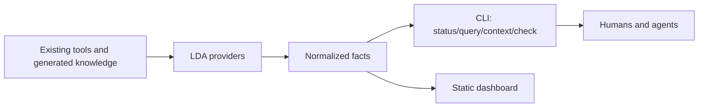

# LDA — LLM Docs Atlas

LDA is a thin, deterministic Documentation-as-Code and machine-context control plane. It orchestrates existing repository indexes and checks; it is not a replacement parser, search engine, graph database, RAG system, or agent harness.



Run from the repository root (the supported installable surface is the `lda` console script):

```bash
python3 -m tools.007_LLM_DOCS_ATLAS.cli status --json
python3 -m tools.007_LLM_DOCS_ATLAS.cli context "modify delegation behavior" --budget 6000 --json
python3 -m tools.007_LLM_DOCS_ATLAS.cli inspect docs/SPEC.md
uv run lda --help
uv run lda serve
```

The local dashboard binds only to `127.0.0.1:8765` by default. Its read-only API exposes `/api/status`, `/api/documents`, `/api/relations`, `/api/context`, and `/api/providers`. The Overview, Documents, Context, Graph, Quality, and Providers views all consume those same service results as the CLI.

The `knowledge` provider consumes `.generated/knowledge/*.jsonl`; the `git` provider adds revision provenance. Context selection ranks keyword matches and authority, prefers canonical/normative documents, and enforces the token budget. Research is opt-in. JSON is the stable agent-facing interface.

Add a provider by implementing `available(ctx)` and `collect(ctx) -> ProviderResult`, then registering it in `atlas.default_registry()`. An analyzer should consume normalized results and return metrics/diagnostics. A future ranker can replace the transparent heuristic without changing the packet schema.

LDA deliberately delegates validation/build authority to existing `just docs-check`, `just docs-full`, and `just verify`; it adds no CI pipeline or parallel knowledge store. Heavy providers, embeddings, graph databases, servers, and autonomous inference are deferred. The `tools/lda` package is a stable import/entry-point facade over this physical project directory, which retains the requested numbered location.
